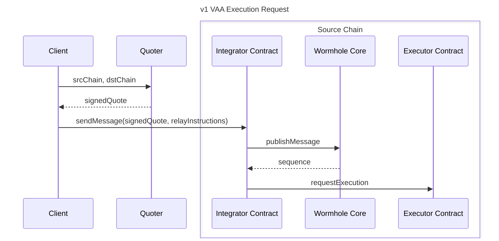
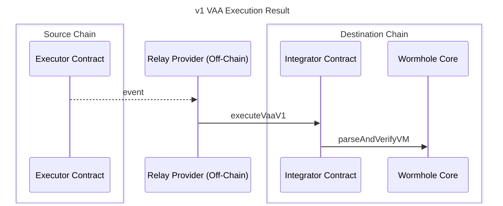
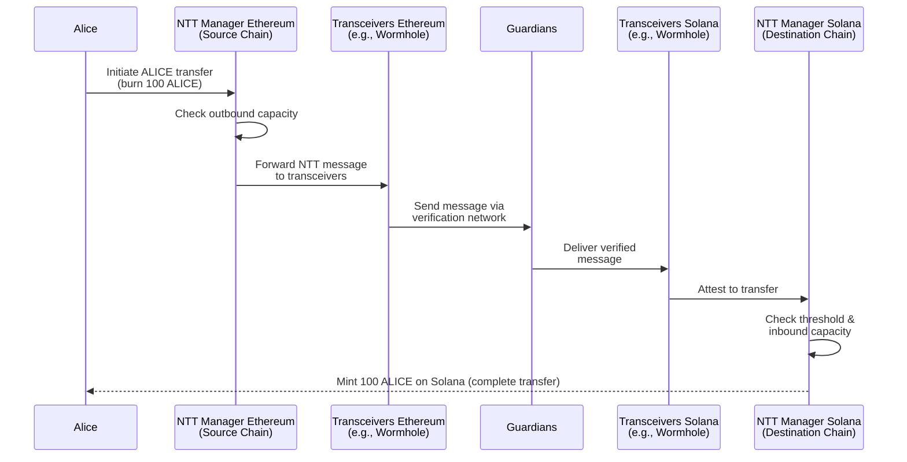
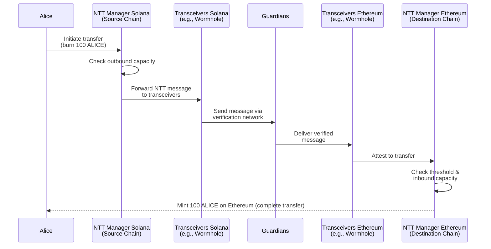
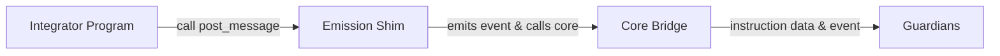
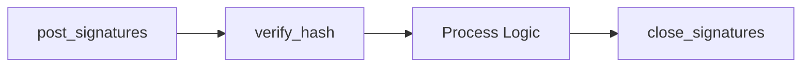
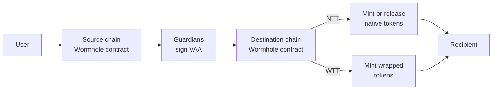

# Begin New Bundle: NTT
Includes shared base categories: Basics, Reference


---

Page Title: Architecture

- Resolved Markdown: https://wormhole.com/docs/ai/pages/protocol-architecture.md
- Canonical (HTML): https://wormhole.com/docs/protocol/architecture/
- Summary: Overview of Wormhole's architecture, detailing key on-chain and off-chain components like the Core Contract, Guardian Network, and relayers.
- Word Count: 657; Token Estimate: 1053

# Architecture

Wormhole has several noteworthy components. Before discussing each component in depth, this page will provide an overview of how the major pieces fit together.


The preceding diagram outlines the end-to-end flow of multichain communication through Wormhole's architecture, which is described as follows:

1. **Source chain**: A source contract emits a message by interacting with the [Wormhole Core Contract](/docs/protocol/infrastructure/core-contracts/){target=\_blank} on the source chain, which publishes the message in the blockchain's transaction logs.
2. **Guardian Network**: [Guardians](/docs/protocol/infrastructure/guardians/){target=\_blank} validate these messages and sign them to produce [Verifiable Action Approvals (VAAs)](/docs/protocol/infrastructure/vaas/){target=\_blank}.
3. **Relayers**: Off-chain relayers or applications fetch the VAA and relay it to the target chain. Relayers act as the transport layer of the Wormhole network, responsible for carrying signed messages between chains. In Wormhole’s protocol, this role is fulfilled by the [Executor](/docs/products/messaging/concepts/executor-overview/){target=\_blank}, a shared, permissionless framework for message delivery. The Executor enables anyone to act as a delivery provider through an open request-and-quote model, removing the need for centralized relayer services.

4. **Target chain**: On the target chain, the message is consumed by the appropriate contract. This contract interacts with the Wormhole Core Contract to verify the VAA and execute the intended multichain operation.

    The flow from the relayer to the target chain involves an entry point contract, which could vary based on the use case:

    - In some applications, the target contract acts as the entry point and performs verification via the Core Contract.
    - In products like Wrapped Token Transfers (WTT), the WTT contract itself interacts with the Core Contract.

## On-Chain Components

- **Emitter**: A contract that calls the publish message method on the Core Contract. To identify the message, the Core Contract will write an event to the transaction logs with details about the emitter and sequence number. This may be your cross-chain dApp or an existing ecosystem protocol.
- **[Wormhole Core Contract](/docs/protocol/infrastructure/core-contracts/){target=\_blank}**: Primary contract, this is the contract which the Guardians observe and which fundamentally allows for multichain communication.
- **Transaction logs**: Blockchain-specific logs that allow the Guardians to observe messages emitted by the Core Contract.

## Off-Chain Components

- **Guardian Network**: Validators that exist in their own P2P network. Guardians observe and validate the messages emitted by the Core Contract on each supported chain to produce VAAs (signed messages).
- **[Guardian](/docs/protocol/infrastructure/guardians/){target=\_blank}**: One of 19 validators in the Guardian Network that contributes to the VAA multisig.
- **[Spy](/docs/protocol/infrastructure/spy/){target=\_blank}**: A daemon that subscribes to messages published within the Guardian Network. A Spy can observe and forward network traffic, which helps scale up VAA distribution.
- **[API](https://docs.wormholescan.io/){target=\_blank}**: A REST server to retrieve details for a VAA or the Guardian Network.
- **[VAAs](/docs/protocol/infrastructure/vaas/){target=\_blank}**: Verifiable Action Approvals (VAAs) are the signed attestation of an observed message from the Wormhole Core Contract.
- **[Relayer](/docs/protocol/infrastructure/relayer/){target=\_blank}**: Any off-chain process that relays a VAA to the target chain. Wormhole provides the [Executor framework](/docs/protocol/infrastructure/relayers/executor-framework/){target=\_blank}, a shared execution framework. This framework enables permissionless message delivery through an open marketplace where relay providers compete using a request-and-quote model.

## Next Steps

<div class="grid cards" markdown>

-   :octicons-book-16:{ .lg .middle } **Core Contracts**

    ---

    Discover Wormhole's Core Contracts, enabling multichain communication with message sending, receiving, and multicast features for efficient synchronization.

    [:custom-arrow: Explore Core Contracts](/docs/protocol/infrastructure/core-contracts/)

-   :octicons-tools-16:{ .lg .middle } **Wormhole Dev Arena**

    ---

    A structured learning hub with hands-on tutorials across the Wormhole ecosystem.

    [:custom-arrow: Explore the Dev Arena](https://arena.wormhole.com/ecosystem){target=\_blank}

</div>


---

Page Title: Chain IDs

- Resolved Markdown: https://wormhole.com/docs/ai/pages/products-reference-chain-ids.md
- Canonical (HTML): https://wormhole.com/docs/products/reference/chain-ids/
- Summary: This page documents the Wormhole-specific chain IDs for each chain and contrasts them to the more commonly referenced EVM chain IDs originating in EIP-155.
- Word Count: 1976; Token Estimate: 5485

# Chain IDs

The following table documents the chain IDs used by Wormhole and places them alongside the more commonly referenced [EVM Chain IDs](https://chainlist.org/){target=\_blank}.

!!! note
    Please note, Wormhole chain IDs are different than the more commonly referenced [EVM chain IDs](https://chainlist.org/){target=\_blank}, specified in the Mainnet and Testnet ID columns.

!!!warning
    Wormhole Contributors recommend that all connected chains implement robust security practices including (but not exclusively): open sourcing code and running public bug bounty programs, undergoing security audits and publishing those reports, using version control with adequate access controls and mandatory code review, and high unit and integration test coverage where the results of those tests are available publicly. Connected chains that can't verifiably prove that they've implemented a high percentage of these practices may be noted below with the :warning: symbol. 
    
    Wormhole integrators are encouraged to understand the security assumptions of any chain before trusting messages from it. See the recommended security practices for chains in [Wormhole's security program](https://github.com/wormhole-foundation/wormhole/blob/main/SECURITY.md#chain-integrators){target=\_blank}.


=== "Mainnet"

    <table data-full-width="true" markdown><thead><th>Chain Name</th><th style="width:26%">Wormhole Chain ID</th><th>Network ID</th></thead><tbody><tr><td>Ethereum</td><td><code>2</code></td><td><code>1</code></td></tr><tr><td>Solana</td><td><code>1</code></td><td><code>Mainnet Beta</code> - <code>5eykt4UsFv8P8NJdTREpY1vzqKqZKvdpKuc147dw2N9d</code></td></tr><tr><td>0G (Zero Gravity)</td><td><code>67</code></td><td><code>16661</code></td></tr><tr><td>Algorand</td><td><code>8</code></td><td><code>mainnet-v1.0</code></td></tr><tr><td>Aptos</td><td><code>22</code></td><td><code>1</code></td></tr><tr><td>Arbitrum</td><td><code>23</code></td><td><code>Arbitrum One</code> - <code>42161</code></td></tr><tr><td>Avalanche</td><td><code>6</code></td><td><code>C-Chain</code> - <code>43114</code></td></tr><tr><td>Base</td><td><code>30</code></td><td><code>Base</code> - <code>8453</code></td></tr><tr><td>Berachain</td><td><code>39</code></td><td></td></tr><tr><td>BNB Smart Chain</td><td><code>4</code></td><td><code>56</code></td></tr><tr><td>Celestia</td><td><code>4004</code></td><td><code>celestia</code></td></tr><tr><td>Celo</td><td><code>14</code></td><td><code>42220</code></td></tr><tr><td>Converge</td><td><code>53</code></td><td></td></tr><tr><td>Cosmos Hub</td><td><code>4000</code></td><td><code>cosmoshub-4</code></td></tr><tr><td>CreditCoin</td><td><code>59</code></td><td></td></tr><tr><td>Dymension</td><td><code>4007</code></td><td><code>dymension_1100-1</code></td></tr><tr><td>Evmos</td><td><code>4001</code></td><td><code>evmos_9001-2</code></td></tr><tr><td>Fantom</td><td><code>10</code></td><td><code>250</code></td></tr><tr><td>Fogo</td><td><code>51</code></td><td></td></tr><tr><td>HyperCore</td><td><code>65000</code></td><td><code>20000</code></td></tr><tr><td>HyperEVM :material-alert:{ title='⚠️ The HyperEVM integration is experimental, as its node software is not open source. Use Wormhole messaging on HyperEVM with caution.' }</td><td><code>47</code></td><td></td></tr><tr><td>Injective</td><td><code>19</code></td><td><code>injective-1</code></td></tr><tr><td>Ink</td><td><code>46</code></td><td></td></tr><tr><td>Kaia</td><td><code>13</code></td><td><code>8217</code></td></tr><tr><td>Kujira</td><td><code>4002</code></td><td><code>kaiyo-1</code></td></tr><tr><td>Linea</td><td><code>38</code></td><td><code>59144</code></td></tr><tr><td>Mantle</td><td><code>35</code></td><td><code>5000</code></td></tr><tr><td>MegaETH</td><td><code>64</code></td><td><code>4326</code></td></tr><tr><td>Mezo</td><td><code>50</code></td><td></td></tr><tr><td>Moca</td><td><code>63</code></td><td><code>2288</code></td></tr><tr><td>Monad</td><td><code>48</code></td><td></td></tr><tr><td>Moonbeam</td><td><code>16</code></td><td><code>1284</code></td></tr><tr><td>NEAR</td><td><code>15</code></td><td><code>mainnet</code></td></tr><tr><td>Neutron</td><td><code>4003</code></td><td><code>neutron-1</code></td></tr><tr><td>Noble</td><td><code>4009</code></td><td><code>noble-1</code></td></tr><tr><td>Optimism</td><td><code>24</code></td><td><code>10</code></td></tr><tr><td>Osmosis</td><td><code>20</code></td><td><code>osmosis-1</code></td></tr><tr><td>Plasma</td><td><code>58</code></td><td></td></tr><tr><td>Plume</td><td><code>55</code></td><td><code>98866</code></td></tr><tr><td>Polygon</td><td><code>5</code></td><td><code>137</code></td></tr><tr><td>Provenance</td><td><code>4008</code></td><td><code>pio-mainnet-1</code></td></tr><tr><td>Pythnet</td><td><code>26</code></td><td></td></tr><tr><td>Scroll</td><td><code>34</code></td><td><code>534352</code></td></tr><tr><td>SEDA</td><td><code>4006</code></td><td></td></tr><tr><td>Sei</td><td><code>32</code></td><td><code>pacific-1</code></td></tr><tr><td>SeiEVM</td><td><code>40</code></td><td></td></tr><tr><td>Sonic</td><td><code>52</code></td><td><code>146</code></td></tr><tr><td>Stacks</td><td><code>60</code></td><td><code>1</code></td></tr><tr><td>Stargaze</td><td><code>4005</code></td><td><code>stargaze-1</code></td></tr><tr><td>Sui</td><td><code>21</code></td><td><code>35834a8a</code></td></tr><tr><td>Unichain</td><td><code>44</code></td><td><code></code></td></tr><tr><td>World Chain</td><td><code>45</code></td><td><code>480</code></td></tr><tr><td>X Layer</td><td><code>37</code></td><td><code>196</code></td></tr><tr><td>XRPL-EVM</td><td><code>57</code></td><td><code>1440000</code></td></tr></tbody></table>

=== "Testnet"

    <table data-full-width="true" markdown><thead><th>Chain Name</th><th style="width:26%">Wormhole Chain ID</th><th>Network ID</th></thead><tbody><tr><td>Ethereum Holesky</td><td><code>10006</code></td><td><code>Holesky</code> - <code>17000</code></td></tr><tr><td>Ethereum Sepolia</td><td><code>10002</code></td><td><code>Sepolia</code> - <code>11155111</code></td></tr><tr><td>Solana</td><td><code>1</code></td><td><code>Devnet</code> - <code>EtWTRABZaYq6iMfeYKouRu166VU2xqa1wcaWoxPkrZBG</code></td></tr><tr><td>0G (Zero Gravity)</td><td><code>67</code></td><td><code>16602</code></td></tr><tr><td>Algorand</td><td><code>8</code></td><td><code>testnet-v1.0</code></td></tr><tr><td>Aptos</td><td><code>22</code></td><td><code>2</code></td></tr><tr><td>Arbitrum Sepolia</td><td><code>10003</code></td><td><code>Sepolia</code> - <code>421614</code></td></tr><tr><td>Avalanche</td><td><code>6</code></td><td><code>Fuji</code> - <code>43113</code></td></tr><tr><td>Base Sepolia</td><td><code>10004</code></td><td><code>Base Sepolia</code> - <code>84532</code></td></tr><tr><td>Berachain</td><td><code>39</code></td><td><code>80084</code></td></tr><tr><td>BNB Smart Chain</td><td><code>4</code></td><td><code>97</code></td></tr><tr><td>Celestia</td><td><code>4004</code></td><td><code>mocha-4</code></td></tr><tr><td>Celo</td><td><code>14</code></td><td><code>Alfajores</code> - <code>44787</code></td></tr><tr><td>Converge</td><td><code>53</code></td><td><code>52085145</code></td></tr><tr><td>Cosmos Hub</td><td><code>4000</code></td><td><code>theta-testnet-001</code></td></tr><tr><td>CreditCoin</td><td><code>59</code></td><td></td></tr><tr><td>Dymension</td><td><code>4007</code></td><td></td></tr><tr><td>Evmos</td><td><code>4001</code></td><td><code>evmos_9000-4</code></td></tr><tr><td>Fantom</td><td><code>10</code></td><td><code>4002</code></td></tr><tr><td>Fogo</td><td><code>51</code></td><td><code>9GGSFo95raqzZxWqKM5tGYvJp5iv4Dm565S4r8h5PEu9</code></td></tr><tr><td>HyperCore</td><td><code>65000</code></td><td><code>20000</code></td></tr><tr><td>HyperEVM :material-alert:{ title='⚠️ The HyperEVM integration is experimental, as its node software is not open source. Use Wormhole messaging on HyperEVM with caution.' }</td><td><code>47</code></td><td><code>998</code></td></tr><tr><td>Injective</td><td><code>19</code></td><td><code>injective-888</code></td></tr><tr><td>Ink</td><td><code>46</code></td><td><code>763373</code></td></tr><tr><td>Kaia</td><td><code>13</code></td><td><code>Kairos</code> - <code>1001</code></td></tr><tr><td>Kujira</td><td><code>4002</code></td><td><code>harpoon-4</code></td></tr><tr><td>Linea</td><td><code>38</code></td><td><code>59141</code></td></tr><tr><td>Mantle</td><td><code>35</code></td><td><code>Sepolia</code> - <code>5003</code></td></tr><tr><td>MegaETH</td><td><code>64</code></td><td><code>6343</code></td></tr><tr><td>Mezo</td><td><code>50</code></td><td><code>31611</code></td></tr><tr><td>Moca</td><td><code>63</code></td><td><code>222888</code></td></tr><tr><td>Monad Testnet</td><td><code>10009</code></td><td><code>10143</code></td></tr><tr><td>Moonbeam</td><td><code>16</code></td><td><code>Moonbase-Alphanet</code> - <code>1287</code></td></tr><tr><td>NEAR</td><td><code>15</code></td><td><code>testnet</code></td></tr><tr><td>Neutron</td><td><code>4003</code></td><td><code>pion-1</code></td></tr><tr><td>Noble</td><td><code>4009</code></td><td><code>grand-1</code></td></tr><tr><td>Optimism Sepolia</td><td><code>10005</code></td><td><code>Optimism Sepolia</code> - <code>11155420</code></td></tr><tr><td>Osmosis</td><td><code>20</code></td><td><code>osmo-test-5</code></td></tr><tr><td>Plasma</td><td><code>58</code></td><td></td></tr><tr><td>Plume</td><td><code>55</code></td><td><code>98867</code></td></tr><tr><td>Polygon Amoy</td><td><code>10007</code></td><td><code>Amoy</code> - <code>80002</code></td></tr><tr><td>Provenance</td><td><code>4008</code></td><td></td></tr><tr><td>Pythnet</td><td><code>26</code></td><td></td></tr><tr><td>Scroll</td><td><code>34</code></td><td><code>Sepolia</code> - <code>534351</code></td></tr><tr><td>SEDA</td><td><code>4006</code></td><td><code>seda-1-testnet</code></td></tr><tr><td>Sei</td><td><code>32</code></td><td><code>atlantic-2</code></td></tr><tr><td>SeiEVM</td><td><code>40</code></td><td></td></tr><tr><td>Sonic</td><td><code>52</code></td><td><code>57054</code></td></tr><tr><td>Stacks</td><td><code>60</code></td><td><code>2147483648</code></td></tr><tr><td>Stargaze</td><td><code>4005</code></td><td></td></tr><tr><td>Sui</td><td><code>21</code></td><td><code>4c78adac</code></td></tr><tr><td>Unichain</td><td><code>44</code></td><td><code>Unichain Sepolia</code> - <code>1301</code></td></tr><tr><td>World Chain</td><td><code>45</code></td><td><code>4801</code></td></tr><tr><td>X Layer</td><td><code>37</code></td><td><code>195</code></td></tr><tr><td>XRPL-EVM</td><td><code>57</code></td><td><code>1449000</code></td></tr></tbody></table>


---

Page Title: Compare Wormhole's Cross-Chain Solutions

- Resolved Markdown: https://wormhole.com/docs/ai/pages/products-overview.md
- Canonical (HTML): https://wormhole.com/docs/products/overview/
- Summary: Compare Wormhole’s cross-chain solutions for bridging, native transfers, data queries, and governance to enable seamless blockchain interoperability.
- Word Count: 431; Token Estimate: 908

# Products 

Wormhole provides a comprehensive suite of cross-chain solutions, enabling seamless asset transfers, data retrieval, and governance across blockchain ecosystems.

Wormhole provides multiple options for asset transfers: Connect for a plug-and-play bridging UI, Native Token Transfers (NTT) for moving native assets without wrapped representations, and Wrapped Token Transfers (WTT) for a secure lock-and-mint mechanism.

Beyond transfers, Wormhole extends interoperability with tools for cross-chain data access, decentralized governance, and an intent-based protocol through Wormhole Settlement.

## Transfer Products

Wormhole offers different solutions for cross-chain asset transfer, each designed for various use cases and integration requirements.

- **[Native Token Transfers (NTT)](/docs/products/token-transfers/native-token-transfers/overview/){target=\_blank}**: A mechanism to transfer native tokens cross-chain seamlessly without conversion to a wrapped asset. Best for projects that require maintaining token fungibility and native chain functionality across multiple networks.
- **[Wrapped Token Transfers (WTT)](/docs/products/token-transfers/wrapped-token-transfers/overview/){target=\_blank}**: A bridging solution that uses a lock and mint mechanism. Best for projects that need cross-chain liquidity using wrapped assets and the ability to send messages.
- **[Settlement](/docs/products/settlement/overview/){target=\_blank}**: Intent-based protocols enabling fast multichain transfers, optimized liquidity flows, and interoperability without relying on traditional bridging methods.

<div markdown class="full-width">

::spantable::

|                                | Criteria                              | NTT                | WTT                | Settlement         |
|--------------------------------|---------------------------------------|--------------------|--------------------|--------------------|
| Supported Transfer Types @span | Token Transfers                       | :white_check_mark: | :white_check_mark: | :white_check_mark: |
|                                | Token Transfers with Payloads         | :white_check_mark: | :white_check_mark: | :white_check_mark: |
| Supported Assets @span         | Wrapped Assets                        | :x:                | :white_check_mark: | :white_check_mark: |
|                                | Native Assets                         | :white_check_mark: | :x:                | :white_check_mark: |
| Features @span                 | Out-of-the-Box UI                     | :x:                | :x:                | :white_check_mark: |
|                                | Event-Based Actions                   | :white_check_mark: | :white_check_mark: | :x:                |
|                                | Intent-Based Execution                | :x:                | :x:                | :white_check_mark: |
|                                | Fast Settlement                       | :x:                | :x:                | :white_check_mark: |
| Requirements @span             | Contract Deployment                   | :white_check_mark: | :x:                |:x:                 |

::end-spantable::

</div>

For a deeper dive into how token transfers work and the differences between NTT and WTT, see the [Token Transfers Overview](/docs/products/token-transfers/overview/){target=\_blank}.

Beyond asset transfers, Wormhole provides additional tools for cross-chain data and governance.

## Bridging UI

[**Connect**](/docs/products/connect/overview/){target=\_blank} is a pre-built bridging UI for cross-chain token transfers, requiring minimal setup. Best for projects seeking an easy-to-integrate UI for bridging without modifying contracts.

## Real-time Data

[**Queries**](/docs/products/queries/overview/){target=\_blank} is a data retrieval service to fetch on-chain data from multiple networks. Best for applications that need multichain analytics, reporting, and data aggregation.

## Multichain Governance

[**MultiGov**](/docs/products/multigov/overview/){target=\_blank} is a unified governance framework that manages multichain protocol governance through a single mechanism. Best for projects managing multichain governance and protocol updates.


---

Page Title: Contract Addresses

- Resolved Markdown: https://wormhole.com/docs/ai/pages/products-reference-contract-addresses.md
- Canonical (HTML): https://wormhole.com/docs/products/reference/contract-addresses/
- Summary: This page documents the deployed contract addresses of the Wormhole contracts on each chain, including Core Contracts, TokenBridge, and more.
- Word Count: 3871; Token Estimate: 10961

# Contract Addresses

## Core Contracts


=== "Mainnet"

    <table data-full-width="true" markdown><thead><th>Chain Name</th><th>Contract Address</th></thead><tbody><tr><td>Ethereum</td><td><code>0x98f3c9e6E3fAce36bAAd05FE09d375Ef1464288B</code></td></tr><tr><td>Solana</td><td><code>worm2ZoG2kUd4vFXhvjh93UUH596ayRfgQ2MgjNMTth</code></td></tr><tr><td>0G (Zero Gravity)</td><td><code>0xC699482c17d43b7D5349F2D3f58d61fEFA972B8c</code></td></tr><tr><td>Algorand</td><td><code>842125965</code></td></tr><tr><td>Aptos</td><td><code>0x5bc11445584a763c1fa7ed39081f1b920954da14e04b32440cba863d03e19625</code></td></tr><tr><td>Arbitrum</td><td><code>0xa5f208e072434bC67592E4C49C1B991BA79BCA46</code></td></tr><tr><td>Avalanche</td><td><code>0x54a8e5f9c4CbA08F9943965859F6c34eAF03E26c</code></td></tr><tr><td>Base</td><td><code>0xbebdb6C8ddC678FfA9f8748f85C815C556Dd8ac6</code></td></tr><tr><td>Berachain</td><td><code>0xCa1D5a146B03f6303baF59e5AD5615ae0b9d146D</code></td></tr><tr><td>BNB Smart Chain</td><td><code>0x98f3c9e6E3fAce36bAAd05FE09d375Ef1464288B</code></td></tr><tr><td>Celo</td><td><code>0xa321448d90d4e5b0A732867c18eA198e75CAC48E</code></td></tr><tr><td>CreditCoin</td><td><code>0xaBf89de706B583424328B54dD05a8fC986750Da8</code></td></tr><tr><td>Fantom</td><td><code>0x126783A6Cb203a3E35344528B26ca3a0489a1485</code></td></tr><tr><td>Fogo</td><td><code>worm2mrQkG1B1KTz37erMfWN8anHkSK24nzca7UD8BB</code></td></tr><tr><td>HyperEVM :material-alert:{ title='⚠️ The HyperEVM integration is experimental, as its node software is not open source. Use Wormhole messaging on HyperEVM with caution.' }</td><td><code>0x7C0faFc4384551f063e05aee704ab943b8B53aB3</code></td></tr><tr><td>Injective</td><td><code>inj17p9rzwnnfxcjp32un9ug7yhhzgtkhvl9l2q74d</code></td></tr><tr><td>Ink</td><td><code>0xCa1D5a146B03f6303baF59e5AD5615ae0b9d146D</code></td></tr><tr><td>Kaia</td><td><code>0x0C21603c4f3a6387e241c0091A7EA39E43E90bb7</code></td></tr><tr><td>Linea</td><td><code>0x0C56aebD76E6D9e4a1Ec5e94F4162B4CBbf77b32</code></td></tr><tr><td>Mantle</td><td><code>0xbebdb6C8ddC678FfA9f8748f85C815C556Dd8ac6</code></td></tr><tr><td>MegaETH</td><td><code>0xaBf89de706B583424328B54dD05a8fC986750Da8</code></td></tr><tr><td>Mezo</td><td><code>0xaBf89de706B583424328B54dD05a8fC986750Da8</code></td></tr><tr><td>Moca</td><td><code>0xaBf89de706B583424328B54dD05a8fC986750Da8</code></td></tr><tr><td>Monad</td><td><code>0x194B123c5E96B9b2E49763619985790Dc241CAC0</code></td></tr><tr><td>Moonbeam</td><td><code>0xC8e2b0cD52Cf01b0Ce87d389Daa3d414d4cE29f3</code></td></tr><tr><td>NEAR</td><td><code>contract.wormhole_crypto.near</code></td></tr><tr><td>Neutron</td><td><code>neutron16rerygcpahqcxx5t8vjla46ym8ccn7xz7rtc6ju5ujcd36cmc7zs9zrunh</code></td></tr><tr><td>Optimism</td><td><code>0xEe91C335eab126dF5fDB3797EA9d6aD93aeC9722</code></td></tr><tr><td>Plume</td><td><code>0xaBf89de706B583424328B54dD05a8fC986750Da8</code></td></tr><tr><td>Polygon</td><td><code>0x7A4B5a56256163F07b2C80A7cA55aBE66c4ec4d7</code></td></tr><tr><td>Pythnet</td><td><code>H3fxXJ86ADW2PNuDDmZJg6mzTtPxkYCpNuQUTgmJ7AjU</code></td></tr><tr><td>Scroll</td><td><code>0xbebdb6C8ddC678FfA9f8748f85C815C556Dd8ac6</code></td></tr><tr><td>Sei</td><td><code>sei1gjrrme22cyha4ht2xapn3f08zzw6z3d4uxx6fyy9zd5dyr3yxgzqqncdqn</code></td></tr><tr><td>SeiEVM</td><td><code>0xCa1D5a146B03f6303baF59e5AD5615ae0b9d146D</code></td></tr><tr><td>Sui</td><td><code>0xaeab97f96cf9877fee2883315d459552b2b921edc16d7ceac6eab944dd88919c</code></td></tr><tr><td>Unichain</td><td><code>0xCa1D5a146B03f6303baF59e5AD5615ae0b9d146D</code></td></tr><tr><td>World Chain</td><td><code>0xcbcEe4e081464A15d8Ad5f58BB493954421eB506</code></td></tr><tr><td>X Layer</td><td><code>0x194B123c5E96B9b2E49763619985790Dc241CAC0</code></td></tr><tr><td>XRPL-EVM</td><td><code>0xaBf89de706B583424328B54dD05a8fC986750Da8</code></td></tr></tbody></table>

=== "Testnet"

    <table data-full-width="true" markdown><thead><th>Chain Name</th><th>Contract Address</th></thead><tbody><tr><td>Ethereum Holesky</td><td><code>0xa10f2eF61dE1f19f586ab8B6F2EbA89bACE63F7a</code></td></tr><tr><td>Ethereum Sepolia</td><td><code>0x4a8bc80Ed5a4067f1CCf107057b8270E0cC11A78</code></td></tr><tr><td>Solana</td><td><code>3u8hJUVTA4jH1wYAyUur7FFZVQ8H635K3tSHHF4ssjQ5</code></td></tr><tr><td>0G (Zero Gravity)</td><td><code>0x059560c0D626bdB982454b5EBd65DC8E7cF7973c</code></td></tr><tr><td>Algorand</td><td><code>86525623</code></td></tr><tr><td>Aptos</td><td><code>0x5bc11445584a763c1fa7ed39081f1b920954da14e04b32440cba863d03e19625</code></td></tr><tr><td>Arbitrum Sepolia</td><td><code>0x6b9C8671cdDC8dEab9c719bB87cBd3e782bA6a35</code></td></tr><tr><td>Avalanche</td><td><code>0x7bbcE28e64B3F8b84d876Ab298393c38ad7aac4C</code></td></tr><tr><td>Base Sepolia</td><td><code>0x79A1027a6A159502049F10906D333EC57E95F083</code></td></tr><tr><td>Berachain</td><td><code>0xBB73cB66C26740F31d1FabDC6b7A46a038A300dd</code></td></tr><tr><td>BNB Smart Chain</td><td><code>0x68605AD7b15c732a30b1BbC62BE8F2A509D74b4D</code></td></tr><tr><td>Celo</td><td><code>0x88505117CA88e7dd2eC6EA1E13f0948db2D50D56</code></td></tr><tr><td>Converge</td><td><code>0x556B259cFaCd9896B2773310080c7c3bcE90Ff01</code></td></tr><tr><td>CreditCoin</td><td><code>0xaBf89de706B583424328B54dD05a8fC986750Da8</code></td></tr><tr><td>Fantom</td><td><code>0x1BB3B4119b7BA9dfad76B0545fb3F531383c3bB7</code></td></tr><tr><td>Fogo</td><td><code>BhnQyKoQQgpuRTRo6D8Emz93PvXCYfVgHhnrR4T3qhw4</code></td></tr><tr><td>HyperEVM :material-alert:{ title='⚠️ The HyperEVM integration is experimental, as its node software is not open source. Use Wormhole messaging on HyperEVM with caution.' }</td><td><code>0xBB73cB66C26740F31d1FabDC6b7A46a038A300dd</code></td></tr><tr><td>Injective</td><td><code>inj1xx3aupmgv3ce537c0yce8zzd3sz567syuyedpg</code></td></tr><tr><td>Ink</td><td><code>0xBB73cB66C26740F31d1FabDC6b7A46a038A300dd</code></td></tr><tr><td>Kaia</td><td><code>0x1830CC6eE66c84D2F177B94D544967c774E624cA</code></td></tr><tr><td>Linea</td><td><code>0x79A1027a6A159502049F10906D333EC57E95F083</code></td></tr><tr><td>Mantle</td><td><code>0x376428e7f26D5867e69201b275553C45B09EE090</code></td></tr><tr><td>MegaETH</td><td><code>0x81705b969cDcc6FbFde91a0C6777bE0EF3A75855</code></td></tr><tr><td>Mezo</td><td><code>0x268557122Ffd64c85750d630b716471118F323c8</code></td></tr><tr><td>Moca</td><td><code>0xaBf89de706B583424328B54dD05a8fC986750Da8</code></td></tr><tr><td>Monad Testnet</td><td><code>0xaBf89de706B583424328B54dD05a8fC986750Da8</code></td></tr><tr><td>Moonbeam</td><td><code>0xa5B7D85a8f27dd7907dc8FdC21FA5657D5E2F901</code></td></tr><tr><td>NEAR</td><td><code>wormhole.wormhole.testnet</code></td></tr><tr><td>Neutron</td><td><code>neutron1enf63k37nnv9cugggpm06mg70emcnxgj9p64v2s8yx7a2yhhzk2q6xesk4</code></td></tr><tr><td>Optimism Sepolia</td><td><code>0x31377888146f3253211EFEf5c676D41ECe7D58Fe</code></td></tr><tr><td>Osmosis</td><td><code>osmo1hggkxr0hpw83f8vuft7ruvmmamsxmwk2hzz6nytdkzyup9krt0dq27sgyx</code></td></tr><tr><td>Plasma</td><td><code>0xaBf89de706B583424328B54dD05a8fC986750Da8</code></td></tr><tr><td>Plume</td><td><code>0x81705b969cDcc6FbFde91a0C6777bE0EF3A75855</code></td></tr><tr><td>Polygon Amoy</td><td><code>0x6b9C8671cdDC8dEab9c719bB87cBd3e782bA6a35</code></td></tr><tr><td>Pythnet</td><td><code>EUrRARh92Cdc54xrDn6qzaqjA77NRrCcfbr8kPwoTL4z</code></td></tr><tr><td>Scroll</td><td><code>0x055F47F1250012C6B20c436570a76e52c17Af2D5</code></td></tr><tr><td>Sei</td><td><code>sei1nna9mzp274djrgzhzkac2gvm3j27l402s4xzr08chq57pjsupqnqaj0d5s</code></td></tr><tr><td>SeiEVM</td><td><code>0xBB73cB66C26740F31d1FabDC6b7A46a038A300dd</code></td></tr><tr><td>Sui</td><td><code>0x31358d198147da50db32eda2562951d53973a0c0ad5ed738e9b17d88b213d790</code></td></tr><tr><td>Unichain</td><td><code>0xBB73cB66C26740F31d1FabDC6b7A46a038A300dd</code></td></tr><tr><td>World Chain</td><td><code>0xe5E02cD12B6FcA153b0d7fF4bF55730AE7B3C93A</code></td></tr><tr><td>X Layer</td><td><code>0xA31aa3FDb7aF7Db93d18DDA4e19F811342EDF780</code></td></tr><tr><td>XRPL-EVM</td><td><code>0xaBf89de706B583424328B54dD05a8fC986750Da8</code></td></tr></tbody></table>

=== "Devnet"

    <table data-full-width="true" markdown><thead><th>Chain Name</th><th>Contract Address</th></thead><tbody><tr><td>Ethereum</td><td><code>0xC89Ce4735882C9F0f0FE26686c53074E09B0D550</code></td></tr><tr><td>Solana</td><td><code>Bridge1p5gheXUvJ6jGWGeCsgPKgnE3YgdGKRVCMY9o</code></td></tr><tr><td>Algorand</td><td><code>1004</code></td></tr><tr><td>Aptos</td><td><code>0xde0036a9600559e295d5f6802ef6f3f802f510366e0c23912b0655d972166017</code></td></tr><tr><td>BNB Smart Chain</td><td><code>0xC89Ce4735882C9F0f0FE26686c53074E09B0D550</code></td></tr><tr><td>NEAR</td><td><code>wormhole.test.near</code></td></tr><tr><td>Stacks</td><td><code>ST1PQHQKV0RJXZFY1DGX8MNSNYVE3VGZJSRTPGZGM</code></td></tr><tr><td>Sui</td><td><code>0x5a5160ca3c2037f4b4051344096ef7a48ebf4400b3f385e57ea90e1628a8bde0</code></td></tr></tbody></table>

## Wrapped Token Transfers (WTT)


=== "Mainnet"

    <table data-full-width="true" markdown><thead><th>Chain Name</th><th>Contract Address</th></thead><tbody><tr><td>Ethereum</td><td><code>0x3ee18B2214AFF97000D974cf647E7C347E8fa585</code></td></tr><tr><td>Solana</td><td><code>wormDTUJ6AWPNvk59vGQbDvGJmqbDTdgWgAqcLBCgUb</code></td></tr><tr><td>0G (Zero Gravity)</td><td><code>0xee12EBDdF6E34A206e1798D185317C846BC21638</code></td></tr><tr><td>Algorand</td><td><code>842126029</code></td></tr><tr><td>Aptos</td><td><code>0x576410486a2da45eee6c949c995670112ddf2fbeedab20350d506328eefc9d4f</code></td></tr><tr><td>Arbitrum</td><td><code>0x0b2402144Bb366A632D14B83F244D2e0e21bD39c</code></td></tr><tr><td>Avalanche</td><td><code>0x0e082F06FF657D94310cB8cE8B0D9a04541d8052</code></td></tr><tr><td>Base</td><td><code>0x8d2de8d2f73F1F4cAB472AC9A881C9b123C79627</code></td></tr><tr><td>Berachain</td><td><code>0x3Ff72741fd67D6AD0668d93B41a09248F4700560</code></td></tr><tr><td>BNB Smart Chain</td><td><code>0xB6F6D86a8f9879A9c87f643768d9efc38c1Da6E7</code></td></tr><tr><td>Celo</td><td><code>0x796Dff6D74F3E27060B71255Fe517BFb23C93eed</code></td></tr><tr><td>Fantom</td><td><code>0x7C9Fc5741288cDFdD83CeB07f3ea7e22618D79D2</code></td></tr><tr><td>Fogo</td><td><code>wormQuCVWSSmPdjVmEzAWxAXViVyTSWnLyhff5hVYGS</code></td></tr><tr><td>Injective</td><td><code>inj1ghd753shjuwexxywmgs4xz7x2q732vcnxxynfn</code></td></tr><tr><td>Ink</td><td><code>0x3Ff72741fd67D6AD0668d93B41a09248F4700560</code></td></tr><tr><td>Kaia</td><td><code>0x5b08ac39EAED75c0439FC750d9FE7E1F9dD0193F</code></td></tr><tr><td>Linea</td><td><code>0x167E0752de62cb76EFc0Fbb165Bd342c6e2Bb251</code></td></tr><tr><td>Mantle</td><td><code>0x24850c6f61C438823F01B7A3BF2B89B72174Fa9d</code></td></tr><tr><td>MegaETH</td><td><code>0xF97B81E513f53c7a6B57Bd0b103a6c295b3096C5</code></td></tr><tr><td>Monad</td><td><code>0x0B2719cdA2F10595369e6673ceA3Ee2EDFa13BA7</code></td></tr><tr><td>Moonbeam</td><td><code>0xb1731c586ca89a23809861c6103f0b96b3f57d92</code></td></tr><tr><td>NEAR</td><td><code>contract.portalbridge.near</code></td></tr><tr><td>Optimism</td><td><code>0x1D68124e65faFC907325e3EDbF8c4d84499DAa8b</code></td></tr><tr><td>Polygon</td><td><code>0x5a58505a96D1dbf8dF91cB21B54419FC36e93fdE</code></td></tr><tr><td>Scroll</td><td><code>0x24850c6f61C438823F01B7A3BF2B89B72174Fa9d</code></td></tr><tr><td>Sei</td><td><code>sei1smzlm9t79kur392nu9egl8p8je9j92q4gzguewj56a05kyxxra0qy0nuf3</code></td></tr><tr><td>SeiEVM</td><td><code>0x3Ff72741fd67D6AD0668d93B41a09248F4700560</code></td></tr><tr><td>Sui</td><td><code>0xc57508ee0d4595e5a8728974a4a93a787d38f339757230d441e895422c07aba9</code></td></tr><tr><td>Unichain</td><td><code>0x3Ff72741fd67D6AD0668d93B41a09248F4700560</code></td></tr><tr><td>World Chain</td><td><code>0xc309275443519adca74c9136b02A38eF96E3a1f6</code></td></tr><tr><td>X Layer</td><td><code>0x5537857664B0f9eFe38C9f320F75fEf23234D904</code></td></tr><tr><td>XRPL-EVM</td><td><code>0x47F5195163270345fb4d7B9319Eda8C64C75E278</code></td></tr></tbody></table>

=== "Testnet"

    <table data-full-width="true" markdown><thead><th>Chain Name</th><th>Contract Address</th></thead><tbody><tr><td>Ethereum Holesky</td><td><code>0x76d093BbaE4529a342080546cAFEec4AcbA59EC6</code></td></tr><tr><td>Ethereum Sepolia</td><td><code>0xDB5492265f6038831E89f495670FF909aDe94bd9</code></td></tr><tr><td>Solana</td><td><code>DZnkkTmCiFWfYTfT41X3Rd1kDgozqzxWaHqsw6W4x2oe</code></td></tr><tr><td>0G (Zero Gravity)</td><td><code>0x7d8eBc211C4221eA18E511E4f0fD50c5A539f275</code></td></tr><tr><td>Algorand</td><td><code>86525641</code></td></tr><tr><td>Aptos</td><td><code>0x576410486a2da45eee6c949c995670112ddf2fbeedab20350d506328eefc9d4f</code></td></tr><tr><td>Arbitrum Sepolia</td><td><code>0xC7A204bDBFe983FCD8d8E61D02b475D4073fF97e</code></td></tr><tr><td>Avalanche</td><td><code>0x61E44E506Ca5659E6c0bba9b678586fA2d729756</code></td></tr><tr><td>Base Sepolia</td><td><code>0x86F55A04690fd7815A3D802bD587e83eA888B239</code></td></tr><tr><td>Berachain</td><td><code>0xa10f2eF61dE1f19f586ab8B6F2EbA89bACE63F7a</code></td></tr><tr><td>BNB Smart Chain</td><td><code>0x9dcF9D205C9De35334D646BeE44b2D2859712A09</code></td></tr><tr><td>Celo</td><td><code>0x05ca6037eC51F8b712eD2E6Fa72219FEaE74E153</code></td></tr><tr><td>Fantom</td><td><code>0x599CEa2204B4FaECd584Ab1F2b6aCA137a0afbE8</code></td></tr><tr><td>Fogo</td><td><code>78HdStBqCMioGii9D8mF3zQaWDqDZBQWTUwjjpdmbJKX</code></td></tr><tr><td>HyperEVM :material-alert:{ title='⚠️ The HyperEVM integration is experimental, as its node software is not open source. Use Wormhole messaging on HyperEVM with caution.' }</td><td><code>0x4a8bc80Ed5a4067f1CCf107057b8270E0cC11A78</code></td></tr><tr><td>Injective</td><td><code>inj1q0e70vhrv063eah90mu97sazhywmeegp7myvnh</code></td></tr><tr><td>Ink</td><td><code>0x376428e7f26D5867e69201b275553C45B09EE090</code></td></tr><tr><td>Kaia</td><td><code>0xC7A13BE098720840dEa132D860fDfa030884b09A</code></td></tr><tr><td>Linea</td><td><code>0xC7A204bDBFe983FCD8d8E61D02b475D4073fF97e</code></td></tr><tr><td>Mantle</td><td><code>0x75Bfa155a9D7A3714b0861c8a8aF0C4633c45b5D</code></td></tr><tr><td>MegaETH</td><td><code>0x3D5c2c2BEA15Af5D45F084834c535628C48c42A4</code></td></tr><tr><td>Mezo</td><td><code>0xA31aa3FDb7aF7Db93d18DDA4e19F811342EDF780</code></td></tr><tr><td>Moca</td><td><code>0xF97B81E513f53c7a6B57Bd0b103a6c295b3096C5</code></td></tr><tr><td>Monad Testnet</td><td><code>0xF97B81E513f53c7a6B57Bd0b103a6c295b3096C5</code></td></tr><tr><td>Moonbeam</td><td><code>0xbc976D4b9D57E57c3cA52e1Fd136C45FF7955A96</code></td></tr><tr><td>NEAR</td><td><code>token.wormhole.testnet</code></td></tr><tr><td>Optimism Sepolia</td><td><code>0x99737Ec4B815d816c49A385943baf0380e75c0Ac</code></td></tr><tr><td>Polygon Amoy</td><td><code>0xC7A204bDBFe983FCD8d8E61D02b475D4073fF97e</code></td></tr><tr><td>Scroll</td><td><code>0x22427d90B7dA3fA4642F7025A854c7254E4e45BF</code></td></tr><tr><td>Sei</td><td><code>sei1jv5xw094mclanxt5emammy875qelf3v62u4tl4lp5nhte3w3s9ts9w9az2</code></td></tr><tr><td>SeiEVM</td><td><code>0x23908A62110e21C04F3A4e011d24F901F911744A</code></td></tr><tr><td>Sui</td><td><code>0x6fb10cdb7aa299e9a4308752dadecb049ff55a892de92992a1edbd7912b3d6da</code></td></tr><tr><td>Unichain</td><td><code>0xa10f2eF61dE1f19f586ab8B6F2EbA89bACE63F7a</code></td></tr><tr><td>World Chain</td><td><code>0x430855B4D43b8AEB9D2B9869B74d58dda79C0dB2</code></td></tr><tr><td>X Layer</td><td><code>0xdA91a06299BBF302091B053c6B9EF86Eff0f930D</code></td></tr><tr><td>XRPL-EVM</td><td><code>0x7d8eBc211C4221eA18E511E4f0fD50c5A539f275</code></td></tr></tbody></table>

=== "Devnet"

    <table data-full-width="true" markdown><thead><th>Chain Name</th><th>Contract Address</th></thead><tbody><tr><td>Ethereum</td><td><code>0x0290FB167208Af455bB137780163b7B7a9a10C16</code></td></tr><tr><td>Solana</td><td><code>B6RHG3mfcckmrYN1UhmJzyS1XX3fZKbkeUcpJe9Sy3FE</code></td></tr><tr><td>Algorand</td><td><code>1006</code></td></tr><tr><td>Aptos</td><td><code>0x84a5f374d29fc77e370014dce4fd6a55b58ad608de8074b0be5571701724da31</code></td></tr><tr><td>BNB Smart Chain</td><td><code>0x0290FB167208Af455bB137780163b7B7a9a10C16</code></td></tr><tr><td>NEAR</td><td><code>token.test.near</code></td></tr><tr><td>Sui</td><td><code>0xa6a3da85bbe05da5bfd953708d56f1a3a023e7fb58e5a824a3d4de3791e8f690</code></td></tr></tbody></table>

## Wormhole Relayer 


=== "Mainnet"

    <table data-full-width="true" markdown><thead><th>Chain Name</th><th>Contract Address</th></thead><tbody><tr><td>Ethereum</td><td><code>0x27428DD2d3DD32A4D7f7C497eAaa23130d894911</code></td></tr><tr><td>Arbitrum</td><td><code>0x27428DD2d3DD32A4D7f7C497eAaa23130d894911</code></td></tr><tr><td>Avalanche</td><td><code>0x27428DD2d3DD32A4D7f7C497eAaa23130d894911</code></td></tr><tr><td>Base</td><td><code>0x706f82e9bb5b0813501714ab5974216704980e31</code></td></tr><tr><td>Berachain</td><td><code>0x27428DD2d3DD32A4D7f7C497eAaa23130d894911</code></td></tr><tr><td>BNB Smart Chain</td><td><code>0x27428DD2d3DD32A4D7f7C497eAaa23130d894911</code></td></tr><tr><td>Celo</td><td><code>0x27428DD2d3DD32A4D7f7C497eAaa23130d894911</code></td></tr><tr><td>Fantom</td><td><code>0x27428DD2d3DD32A4D7f7C497eAaa23130d894911</code></td></tr><tr><td>Ink</td><td><code>0x27428DD2d3DD32A4D7f7C497eAaa23130d894911</code></td></tr><tr><td>Kaia</td><td><code>0x27428DD2d3DD32A4D7f7C497eAaa23130d894911</code></td></tr><tr><td>Mantle</td><td><code>0x27428DD2d3DD32A4D7f7C497eAaa23130d894911</code></td></tr><tr><td>Mezo</td><td><code>0x27428DD2d3DD32A4D7f7C497eAaa23130d894911</code></td></tr><tr><td>Monad</td><td><code>0x27428DD2d3DD32A4D7f7C497eAaa23130d894911</code></td></tr><tr><td>Moonbeam</td><td><code>0x27428DD2d3DD32A4D7f7C497eAaa23130d894911</code></td></tr><tr><td>Optimism</td><td><code>0x27428DD2d3DD32A4D7f7C497eAaa23130d894911</code></td></tr><tr><td>Plume</td><td><code>0x27428DD2d3DD32A4D7f7C497eAaa23130d894911</code></td></tr><tr><td>Polygon</td><td><code>0x27428DD2d3DD32A4D7f7C497eAaa23130d894911</code></td></tr><tr><td>Scroll</td><td><code>0x27428DD2d3DD32A4D7f7C497eAaa23130d894911</code></td></tr><tr><td>SeiEVM</td><td><code>0x27428DD2d3DD32A4D7f7C497eAaa23130d894911</code></td></tr><tr><td>Unichain</td><td><code>0x27428DD2d3DD32A4D7f7C497eAaa23130d894911</code></td></tr><tr><td>World Chain</td><td><code>0x1520cc9e779c56dab5866bebfb885c86840c33d3</code></td></tr><tr><td>X Layer</td><td><code>0x27428DD2d3DD32A4D7f7C497eAaa23130d894911</code></td></tr></tbody></table>

=== "Testnet"

    <table data-full-width="true" markdown><thead><th>Chain Name</th><th>Contract Address</th></thead><tbody><tr><td>Ethereum Sepolia</td><td><code>0x7B1bD7a6b4E61c2a123AC6BC2cbfC614437D0470</code></td></tr><tr><td>Arbitrum Sepolia</td><td><code>0x7B1bD7a6b4E61c2a123AC6BC2cbfC614437D0470</code></td></tr><tr><td>Avalanche</td><td><code>0xA3cF45939bD6260bcFe3D66bc73d60f19e49a8BB</code></td></tr><tr><td>Base Sepolia</td><td><code>0x93BAD53DDfB6132b0aC8E37f6029163E63372cEE</code></td></tr><tr><td>Berachain</td><td><code>0x362fca37E45fe1096b42021b543f462D49a5C8df</code></td></tr><tr><td>BNB Smart Chain</td><td><code>0x80aC94316391752A193C1c47E27D382b507c93F3</code></td></tr><tr><td>Celo</td><td><code>0x306B68267Deb7c5DfCDa3619E22E9Ca39C374f84</code></td></tr><tr><td>Fantom</td><td><code>0x7B1bD7a6b4E61c2a123AC6BC2cbfC614437D0470</code></td></tr><tr><td>Ink</td><td><code>0x362fca37E45fe1096b42021b543f462D49a5C8df</code></td></tr><tr><td>Mezo</td><td><code>0x362fca37E45fe1096b42021b543f462D49a5C8df</code></td></tr><tr><td>Moonbeam</td><td><code>0x0591C25ebd0580E0d4F27A82Fc2e24E7489CB5e0</code></td></tr><tr><td>Optimism Sepolia</td><td><code>0x93BAD53DDfB6132b0aC8E37f6029163E63372cEE</code></td></tr><tr><td>Polygon Amoy</td><td><code>0x362fca37E45fe1096b42021b543f462D49a5C8df</code></td></tr><tr><td>SeiEVM</td><td><code>0x362fca37E45fe1096b42021b543f462D49a5C8df</code></td></tr><tr><td>Unichain</td><td><code>0x362fca37E45fe1096b42021b543f462D49a5C8df</code></td></tr><tr><td>XRPL-EVM</td><td><code>0x362fca37E45fe1096b42021b543f462D49a5C8df</code></td></tr></tbody></table>

=== "Devnet"

    <table data-full-width="true" markdown><thead><th>Chain Name</th><th>Contract Address</th></thead><tbody><tr><td>Ethereum</td><td><code>0xcC680D088586c09c3E0E099a676FA4b6e42467b4</code></td></tr><tr><td>BNB Smart Chain</td><td><code>0xcC680D088586c09c3E0E099a676FA4b6e42467b4</code></td></tr></tbody></table>

## CCTP


=== "Mainnet"

    <table data-full-width="true" markdown><thead><th>Chain Name</th><th>Contract Address</th></thead><tbody><tr><td>Ethereum</td><td><code>0xAaDA05BD399372f0b0463744C09113c137636f6a</code></td></tr><tr><td>Arbitrum</td><td><code>0x2703483B1a5a7c577e8680de9Df8Be03c6f30e3c</code></td></tr><tr><td>Avalanche</td><td><code>0x09Fb06A271faFf70A651047395AaEb6265265F13</code></td></tr><tr><td>Base</td><td><code>0x03faBB06Fa052557143dC28eFCFc63FC12843f1D</code></td></tr><tr><td>Optimism</td><td><code>0x2703483B1a5a7c577e8680de9Df8Be03c6f30e3c</code></td></tr><tr><td>Polygon</td><td><code>0x0FF28217dCc90372345954563486528aa865cDd6</code></td></tr></tbody></table>

=== "Testnet"

    <table data-full-width="true" markdown><thead><th>Chain Name</th><th>Contract Address</th></thead><tbody><tr><td>Ethereum Sepolia</td><td><code>0x2703483B1a5a7c577e8680de9Df8Be03c6f30e3c</code></td></tr><tr><td>Arbitrum Sepolia</td><td><code>0x2703483B1a5a7c577e8680de9Df8Be03c6f30e3c</code></td></tr><tr><td>Avalanche</td><td><code>0x58f4c17449c90665891c42e14d34aae7a26a472e</code></td></tr><tr><td>Base Sepolia</td><td><code>0x2703483B1a5a7c577e8680de9Df8Be03c6f30e3c</code></td></tr><tr><td>Optimism Sepolia</td><td><code>0x2703483B1a5a7c577e8680de9Df8Be03c6f30e3c</code></td></tr></tbody></table>

## Settlement Token Router

=== "Mainnet"

    <table data-full-width="true" markdown><thead><tr><th>Chain Name</th><th>Contract Address</th></tr></thead><tbody><tr><td>Ethereum</td><td><code>0x70287c79ee41C5D1df8259Cd68Ba0890cd389c47</code></td></tr><tr><td>Solana</td><td><code>28topqjtJzMnPaGFmmZk68tzGmj9W9aMntaEK3QkgtRe</code></td></tr><tr><td>Arbitrum</td><td><code>0x70287c79ee41C5D1df8259Cd68Ba0890cd389c47</code></td></tr><tr><td>Avalanche</td><td><code>0x70287c79ee41C5D1df8259Cd68Ba0890cd389c47</code></td></tr><tr><td>Base</td><td><code>0x70287c79ee41C5D1df8259Cd68Ba0890cd389c47</code></td></tr><tr><td>Optimism</td><td><code>0x70287c79ee41C5D1df8259Cd68Ba0890cd389c47</code></td></tr><tr><td>Polygon</td><td><code>0x70287c79ee41C5D1df8259Cd68Ba0890cd389c47</code></td></tr></tbody></table>

=== "Testnet"

    <table data-full-width="true" markdown><thead><tr><th>Chain Name</th><th>Contract Address</th></tr></thead><tbody><tr><td>Solana</td><td><code>tD8RmtdcV7bzBeuFgyrFc8wvayj988ChccEzRQzo6md</code></td></tr><tr><td>Arbitrum Sepolia</td><td><code>0xe0418C44F06B0b0D7D1706E01706316DBB0B210E</code></td></tr><tr><td>Optimism Sepolia</td><td><code>0x6BAa7397c18abe6221b4f6C3Ac91C88a9faE00D8</code></td></tr></tbody></table>

## Executor


=== "Mainnet"

    <table data-full-width="true" markdown><thead><th>Chain Name</th><th>Contract Address</th></thead><tbody><tr><td>Ethereum</td><td><code>0x84EEe8dBa37C36947397E1E11251cA9A06Fc6F8a</code></td></tr><tr><td>Solana</td><td><code>execXUrAsMnqMmTHj5m7N1YQgsDz3cwGLYCYyuDRciV</code></td></tr><tr><td>Aptos</td><td><code>0x11aa75c059e1a7855be66b931bf340a2e0973274ac16b5f519c02ceafaf08a18</code></td></tr><tr><td>Arbitrum</td><td><code>0x3980f8318fc03d79033Bbb421A622CDF8d2Eeab4</code></td></tr><tr><td>Avalanche</td><td><code>0x4661F0E629E4ba8D04Ee90080Aee079740B00381</code></td></tr><tr><td>Base</td><td><code>0x9E1936E91A4a5AE5A5F75fFc472D6cb8e93597ea</code></td></tr><tr><td>Berachain</td><td><code>0x0Dd7a5a32311b8D87A615Cc7f079B632D3d5e2D3</code></td></tr><tr><td>BNB Smart Chain</td><td><code>0xeC8cCCD058DbF28e5D002869Aa9aFa3992bf4ee0</code></td></tr><tr><td>Celo</td><td><code>0xe6Ea5087c6860B94Cf098a403506262D8F28cF05</code></td></tr><tr><td>Codex</td><td><code>0x99341e2c76E41aCC62595f9dEf123f9a299F3b80</code></td></tr><tr><td>CreditCoin</td><td><code>0xd2e420188f17607Aa6344ee19c3e76Cf86CA7BDe</code></td></tr><tr><td>Fogo</td><td><code>execXUrAsMnqMmTHj5m7N1YQgsDz3cwGLYCYyuDRciV</code></td></tr><tr><td>HyperEVM :material-alert:{ title='⚠️ The HyperEVM integration is experimental, as its node software is not open source. Use Wormhole messaging on HyperEVM with caution.' }</td><td><code>0xd7717899cc4381033Bc200431286D0AC14265F78</code></td></tr><tr><td>Ink</td><td><code>0x3e44a5F45cbD400acBEF534F51e616043B211Ddd</code></td></tr><tr><td>Linea</td><td><code>0x23aF2B5296122544A9A7861da43405D5B15a9bD3</code></td></tr><tr><td>MegaETH</td><td><code>0xD405E0A1f3f9edc25Ea32d0B079d6118328b2EcB</code></td></tr><tr><td>Mezo</td><td><code>0x0f9b8E144Cc5C5e7C0073829Afd30F26A50c5606</code></td></tr><tr><td>Moca</td><td><code>0x7b8097af5459846c5A72fCc960D94F31C05915aD</code></td></tr><tr><td>Monad</td><td><code>0xC04dE634982cAdF2A677310b73630B7Ac56A3f65</code></td></tr><tr><td>Moonbeam</td><td><code>0x85D06449C78064c2E02d787e9DC71716786F8D19</code></td></tr><tr><td>OP Mainnet</td><td><code>0x85B704501f6AE718205C0636260768C4e72ac3e7</code></td></tr><tr><td>Plume</td><td><code>0x8fc2FbA8F962fbE89a9B02f03557a011c335A455</code></td></tr><tr><td>Polygon PoS</td><td><code>0x0B23efA164aB3eD08e9a39AC7aD930Ff4F5A5e81</code></td></tr><tr><td>Scroll</td><td><code>0xcFAdDE24640e395F5A71456A825D0D7C3741F075</code></td></tr><tr><td>SeiEVM</td><td><code>0x25f1c923fb7a5aefa5f0a2b419fc70f2368e66e5</code></td></tr><tr><td>Sonic</td><td><code>0x3Fdc36b4260Da38fBDba1125cCBD33DD0AC74812</code></td></tr><tr><td>Sui</td><td><code>0xdb0fe8bb1e2b5be628adbea0636063325073e1070ee11e4281457dfd7f158235</code></td></tr><tr><td>Unichain</td><td><code>0x764dD868eAdD27ce57BCB801E4ca4a193d231Aed</code></td></tr><tr><td>World Chain</td><td><code>0x8689b4E6226AdC8fa8FF80aCc3a60AcE31e8804B</code></td></tr><tr><td>XRPL-EVM</td><td><code>0x8345E90Dcd92f5Cf2FAb0C8E2A56A5bc2c30d896</code></td></tr></tbody></table>

=== "Testnet"

    <table data-full-width="true" markdown><thead><th>Chain Name</th><th>Contract Address</th></thead><tbody><tr><td>Ethereum Sepolia</td><td><code>0xD0fb39f5a3361F21457653cB70F9D0C9bD86B66B</code></td></tr><tr><td>Solana</td><td><code>execXUrAsMnqMmTHj5m7N1YQgsDz3cwGLYCYyuDRciV</code></td></tr><tr><td>0G Galileo</td><td><code>0x7c43825eeb76df7aaf3e1d2e8f684d4876f0cc05</code></td></tr><tr><td>Aptos</td><td><code>0x139717c339f08af674be77143507a905aa28cbc67a0e53e7095c07b630d73815</code></td></tr><tr><td>Arbitrum Sepolia</td><td><code>0xBF161de6B819c8af8f2230Bcd99a9B3592f6F87b</code></td></tr><tr><td>Avalanche Fuji</td><td><code>0x4661F0E629E4ba8D04Ee90080Aee079740B00381</code></td></tr><tr><td>Base Sepolia</td><td><code>0x51B47D493CBA7aB97e3F8F163D6Ce07592CE4482</code></td></tr><tr><td>BNB Smart Chain</td><td><code>0xeC8cCCD058DbF28e5D002869Aa9aFa3992bf4ee0</code></td></tr><tr><td>Celo</td><td><code>0xe6Ea5087c6860B94Cf098a403506262D8F28cF05</code></td></tr><tr><td>Converge</td><td><code>0xAab9935349B9c08e0e970720F6D640d5B91C293E</code></td></tr><tr><td>Fogo</td><td><code>execXUrAsMnqMmTHj5m7N1YQgsDz3cwGLYCYyuDRciV</code></td></tr><tr><td>Ink</td><td><code>0x3e44a5F45cbD400acBEF534F51e616043B211Ddd</code></td></tr><tr><td>Linea Sepolia</td><td><code>0x4f6c3a93a80DdC691312974DAAbf9B6e4Bb44111</code></td></tr><tr><td>Mezo</td><td><code>0x0f9b8E144Cc5C5e7C0073829Afd30F26A50c5606</code></td></tr><tr><td>Moca</td><td><code>0xc4a03f2c47caA4b961101bAD6338DEf37376F052</code></td></tr><tr><td>Monad Testnet</td><td><code>0xe37D3E162B4B1F17131E4e0e6122DbA31243382f</code></td></tr><tr><td>Optimism Sepolia</td><td><code>0x5856651eB82aeb6979B4954317194d48e1891b3c</code></td></tr><tr><td>Plume</td><td><code>0x8fc2FbA8F962fbE89a9B02f03557a011c335A455</code></td></tr><tr><td>Polygon Sepolia (Amoy)</td><td><code>0x7056721C33De437f0997F67BC87521cA86b721d3</code></td></tr><tr><td>SeiEVM</td><td><code>0x25f1c923Fb7A5aEFA5F0A2b419fC70f2368e66e5</code></td></tr><tr><td>Sui</td><td><code>0x4000cfe2955d8355b3d3cf186f854fea9f787a457257056926fde1ec977670eb</code></td></tr><tr><td>Unichain Sepolia</td><td><code>0x764dD868eAdD27ce57BCB801E4ca4a193d231Aed</code></td></tr><tr><td>XRPL EVM Testnet</td><td><code>0x4d9525D94D275dEB495b7C8840b154Ae04cfaC2A</code></td></tr></tbody></table>

## Guardian Governance

=== "Mainnet"

    
    <table data-full-width="true" markdown><thead><th>Chain Name</th><th>Contract Address</th></thead><tbody><tr><td>Ethereum</td><td><code>0x23Fea5514DFC9821479fBE18BA1D7e1A61f6FfCf</code></td></tr><tr><td>Solana</td><td><code>NGoD1yTeq5KaURrZo7MnCTFzTA4g62ygakJCnzMLCfm</code></td></tr><tr><td>Arbitrum</td><td><code>0x36CF4c88FA548c6Ad9fcDc696e1c27Bb3306163F</code></td></tr><tr><td>Avalanche</td><td><code>0x169D91C797edF56100F1B765268145660503a423</code></td></tr><tr><td>Base</td><td><code>0x838a95B6a3E06B6f11C437e22f3C7561a6ec40F1</code></td></tr><tr><td>Fogo</td><td><code>ngoLQ35zgtP3SxWrjAJ8Mz2H8BPFVeZoxyBPotPYwnB</code></td></tr><tr><td>HyperEVM :material-alert:{ title='⚠️ The HyperEVM integration is experimental, as its node software is not open source. Use Wormhole messaging on HyperEVM with caution.' }</td><td><code>0x574B7864119C9223A9870Ea614dC91A8EE09E512</code></td></tr><tr><td>MegaETH</td><td><code>0x574B7864119C9223A9870Ea614dC91A8EE09E512</code></td></tr><tr><td>Monad</td><td><code>0x574B7864119C9223A9870Ea614dC91A8EE09E512</code></td></tr><tr><td>Optimism</td><td><code>0x0E09a3081837ff23D2e59B179E0Bc48A349Afbd8</code></td></tr><tr><td>Unichain</td><td><code>0x574b7864119c9223a9870ea614dc91a8ee09e512</code></td></tr><tr><td>XRPL-EVM</td><td><code>0x574B7864119C9223A9870Ea614dC91A8EE09E512</code></td></tr></tbody></table>
    

=== "Testnet"

    
    <table data-full-width="true" markdown><thead><th>Chain Name</th><th>Contract Address</th></thead><tbody><tr><td>Ethereum Sepolia</td><td><code>0x9517F0164c1d089ad72E669E57b9088790966dBd</code></td></tr><tr><td>Solana</td><td><code>NGoD1yTeq5KaURrZo7MnCTFzTA4g62ygakJCnzMLCfm</code></td></tr><tr><td>Arbitrum Sepolia</td><td><code>0x81b65A48DCAccBA04aCa3C055C4112b0715b90c0</code></td></tr><tr><td>Base Sepolia</td><td><code>0x720A59128B96Eda6EC2940c7899406E4dc56d0DC</code></td></tr><tr><td>Optimism Sepolia</td><td><code>0xcE1DE1eA4b040D324a07719043A6234C94fd0b5d</code></td></tr><tr><td>XRPL-EVM</td><td><code>0x574B7864119C9223A9870Ea614dC91A8EE09E512</code></td></tr></tbody></table>
    
!!! note
    Guardian-governed ownership contracts are used where an owner is required, without adding new trust assumptions. They only accept instructions signed by a quorum of Wormhole Guardians, validated on-chain by the Wormhole Core contracts. Implementations: [EVM](https://github.com/wormhole-foundation/native-token-transfers/blob/main/evm/src/wormhole/Governance.sol){target=\_blank} and [SVM](https://github.com/wormhole-foundation/native-token-transfers/blob/main/solana/programs/wormhole-governance/src/instructions/governance.rs){target=\_blank}.


## Read-Only Deployments

=== "Mainnet"

    <table data-full-width="true" markdown><thead><th>Chain Name</th><th>Contract Address</th></thead><tbody>
    <tr><td>Acala</td><td><code>0xa321448d90d4e5b0A732867c18eA198e75CAC48E</code></td></tr>
    <tr><td>Aurora</td><td><code>0x51b5123a7b0F9b2bA265f9c4C8de7D78D52f510F</code></td></tr>
    <tr><td>Blast</td><td><code>0xbebdb6C8ddC678FfA9f8748f85C815C556Dd8ac6</code></td></tr>
    <tr><td>Corn</td><td><code>0xa683c66045ad16abb1bCE5ad46A64d95f9A25785</code></td></tr>
    <tr><td>Gnosis</td><td><code>0xa321448d90d4e5b0A732867c18eA198e75CAC48E</code></td></tr>
    <tr><td>Goat</td><td><code>0x352A86168e6988A1aDF9A15Cb00017AAd3B67155</code></td></tr>
    <tr><td>Karura</td><td><code>0xa321448d90d4e5b0A732867c18eA198e75CAC48E</code></td></tr>
    <tr><td>LightLink</td><td><code>0x352A86168e6988A1aDF9A15Cb00017AAd3B67155</code></td></tr>
    <tr><td>Oasis</td><td><code>0xfE8cD454b4A1CA468B57D79c0cc77Ef5B6f64585</code></td></tr>
    <tr><td>Rootstock</td><td><code>0xbebdb6C8ddC678FfA9f8748f85C815C556Dd8ac6</code></td></tr>
    <tr><td>Sonic</td><td><code>0x352A86168e6988A1aDF9A15Cb00017AAd3B67155</code></td></tr>
    <tr><td>Telos</td><td><code>0x352A86168e6988A1aDF9A15Cb00017AAd3B67155</code></td></tr>
    <tr><td>Terra</td><td><code>terra1dq03ugtd40zu9hcgdzrsq6z2z4hwhc9tqk2uy5</code></td></tr>
    <tr><td>Terra 2.0</td><td><code>terra12mrnzvhx3rpej6843uge2yyfppfyd3u9c3uq223q8sl48huz9juqffcnhp</code></td></tr>
    <tr><td>SNAXchain</td><td><code>0xc1BA3CC4bFE724A08FbbFbF64F8db196738665f4</code></td></tr>
    <tr><td>XPLA</td><td><code>xpla1jn8qmdda5m6f6fqu9qv46rt7ajhklg40ukpqchkejcvy8x7w26cqxamv3w</code></td></tr>
    </tbody>
    </table>
!!! note  
    Read-only deployments allow Wormhole messages to be received on chains not fully integrated with Wormhole Guardians. These deployments support cross-chain data verification but cannot originate messages. For example, a governance message can be sent from a fully integrated chain and processed on a read-only chain, but the read-only chain cannot send messages back.


---

Page Title: Core Contract (EVM)

- Resolved Markdown: https://wormhole.com/docs/ai/pages/products-messaging-reference-core-contract-evm.md
- Canonical (HTML): https://wormhole.com/docs/products/messaging/reference/core-contract-evm/
- Summary: Reference for the Wormhole Core contract on EVM chains. Covers the proxy structure, components, state variables, functions, events, and errors.
- Word Count: 1963; Token Estimate: 4016

# Core Contract (EVM)

The [Wormhole Core Contract on EVM](https://github.com/wormhole-foundation/wormhole/blob/main/ethereum/contracts/Implementation.sol){target=\_blank} chains is a proxy-based contract responsible for receiving and verifying Wormhole messages (VAAs). It implements the messaging interface and delegates logic to upgradeable implementation contracts.

## Structure Overview

The Wormhole Core system consists of a proxy contract and a modular implementation constructed through layered inheritance.

```text
Wormhole.sol (Proxy)
└── Implementation.sol
    └── Governance.sol
        ├── Getters.sol
        ├── GovernanceStructs.sol
        ├── Messages.sol
        ├── Setters.sol
        └── Structs.sol
```

**Key Components:**

 - **Wormhole.sol**: The upgradeable proxy contract that delegates all logic to `Implementation.sol`.
 - **Implementation.sol**: The main logic contract, which handles message publication and initialization. Inherits from Governance.sol.
 - **Governance.sol**: Core governance logic for processing upgrades, setting fees, and updating the Guardian set. Also responsible for verifying governance VAAs and performing privileged actions.
 - **Getters.sol**: Exposes view functions to access internal contract state, such as current Guardian sets, fees, and contract configuration.
 - **GovernanceStructs.sol**: Provides structures and helpers for processing governance-related VAAs.
 - **Messages.sol**: Handles VAA parsing and verification.
 - **Setters.sol**: Contains internal functions for mutating contract state.
 - **Structs.sol**: Defines core data structures like GuardianSet and VM (VAA Message) used across multiple modules.

## State Variables

 - **`provider` ++"Structs.Provider"++**: Holds metadata like `chainId`, `governanceChainId`, and `governanceContract`. This is a nested struct.
 - **`guardianSets` ++"mapping(uint32 => GuardianSet)"++**: Mapping of all Guardian sets by index.
 - **`guardianSetIndex` ++"uint32"++**: Index of the currently active Guardian set.
 - **`guardianSetExpiry` ++"uint32"++**: How long a Guardian set remains valid after it's replaced (in seconds).
 - **`sequences` ++"mapping(address => uint64)"++**: Tracks message sequences per emitter (used to enforce message ordering).
 - **`consumedGovernanceActions` ++"mapping(bytes32 => bool)"++**: Used to prevent governance VAAs from being reused (replay protection).
 - **`initializedImplementations` ++"mapping(address => bool)"++**: Tracks which implementation addresses have been initialized (for upgrade safety).
 - **`messageFee` ++"uint256"++**: The amount (in native gas token) required to post a message. Set via governance.
 - **`evmChainId` ++"uint256"++**: The actual EVM chain ID (e.g., 1 for Ethereum, 10 for Optimism). Used in fork recovery.

## Events

### LogMessagePublished

Emitted when a message is published via `publishMessage`. *(Defined in [Implementation.sol](https://github.com/wormhole-foundation/wormhole/blob/main/ethereum/contracts/Implementation.sol){target=\_blank})*

```solidity
event LogMessagePublished(
    address indexed sender,
    uint64 sequence,
    uint32 nonce,
    bytes payload,
    uint8 consistencyLevel
)
```

??? interface "Parameters"

    `sender` ++"address"++  

    Address that called `publishMessage`.

    ---

    `sequence` ++"uint64"++

    The sequence number of the message.

    ---

    `nonce` ++"uint32"++

    The provided nonce.

    ---

    `payload` ++"bytes"++

    The payload that was published.

    ---

    `consistencyLevel` ++"uint8"++

    Finality level requested.

### ContractUpgraded

Emitted when the Core Contract is upgraded to a new implementation via governance. *(Defined in [Governance.sol](https://github.com/wormhole-foundation/wormhole/blob/main/ethereum/contracts/Governance.sol){target=\_blank})*

```solidity
event ContractUpgraded(
    address indexed oldContract,
    address indexed newContract
)
```

??? interface "Parameters"

    `oldContract` ++"address"++

    The address of the previous implementation.

    ---

    `newContract` ++"address"++

    The address of the new implementation.

### GuardianSetAdded

Emitted when a new Guardian set is registered via governance. *(Defined in [Governance.sol](https://github.com/wormhole-foundation/wormhole/blob/main/ethereum/contracts/Governance.sol){target=\_blank})*

```solidity
event GuardianSetAdded(
    uint32 indexed index
)
```

??? interface "Parameters"

    `index` ++"uint32"++

    Index of the newly added Guardian set.

### LogGuardianSetChanged

Emitted when the active Guardian set is changed. *(Defined in [State.sol](https://github.com/wormhole-foundation/wormhole/blob/main/ethereum/contracts/State.sol){target=\_blank})*

```solidity
event LogGuardianSetChanged(
    uint32 oldGuardianIndex,
    uint32 newGuardianIndex
)
```

??? interface "Parameters"

    `oldGuardianIndex` ++"uint32"++

    The previous active Guardian set index.

    ---

    `newGuardianIndex` ++"uint32"++

    The new active Guardian set index.

## Functions

### publishMessage

Publishes a message to Wormhole's Guardian Network. *(Defined in [Implementation.sol](https://github.com/wormhole-foundation/wormhole/blob/main/ethereum/contracts/Implementation.sol){target=\_blank})*

```solidity
function publishMessage(
    uint32 nonce,
    bytes memory payload,
    uint8 consistencyLevel
) public payable returns (uint64 sequence)
```

??? interface "Parameters"

    `nonce` ++"uint32"++

    Custom sequence identifier for the emitter.

    ---

    `payload` ++"bytes"++

    Arbitrary user data to be included in the message.

    ---

    `consistencyLevel` ++"uint8"++

    Finality requirement for Guardian attestation (e.g., safe or finalized).

??? interface "Returns"

    `sequence` ++"uint64"++

    Unique sequence number assigned to this message.

### getCurrentGuardianSetIndex

Returns the index of the currently active Guardian set. *(Defined in [Getters.sol](https://github.com/wormhole-foundation/wormhole/blob/main/ethereum/contracts/Getters.sol){target=\_blank})*

Each VAA includes the index of the Guardian set that signed it. This function allows contracts to retrieve the current index, ensuring the VAA is verified against the correct set.

```solidity
function getCurrentGuardianSetIndex() external view returns (uint32)
```

??? interface "Returns"

    `index` ++"uint32"++

    The index of the active Guardian set used to verify signatures.

### getGuardianSet

Retrieves metadata for a given Guardian set index. *(Defined in [Getters.sol](https://github.com/wormhole-foundation/wormhole/blob/main/ethereum/contracts/Getters.sol){target=\_blank})*

```solidity
function getGuardianSet(uint32 index) external view returns (address[] memory keys, uint32 expirationTime)
```

??? interface "Parameters"

    `index` ++"uint32"++

    Guardian set index to query.

??? interface "Returns"

    `keys` ++"address[]"++

    Public keys of the guardians in this set.

    ---

    `expirationTime` ++"uint32"++

    Timestamp after which the Guardian set is considered expired.

### getGuardianSetExpiry

Returns the expiration time of a specific Guardian set index. *(Defined in [Getters.sol](https://github.com/wormhole-foundation/wormhole/blob/main/ethereum/contracts/Getters.sol){target=\_blank})*

```solidity
function getGuardianSetExpiry(uint32 index) external view returns (uint32)
```

??? interface "Parameters"

    `index` ++"uint32"++

    The index of the Guardian set to query.

??? interface "Returns"

    `expiry` ++"uint32"++

    UNIX timestamp after which the set is no longer valid.

### messageFee

Returns the current fee (in native tokens) required to publish a message. *(Defined in [Getters.sol](https://github.com/wormhole-foundation/wormhole/blob/main/ethereum/contracts/Getters.sol){target=\_blank})*

```solidity
function messageFee() public view returns (uint256)
```

??? interface "Returns"

    `fee` ++"uint256"++

    Fee in Wei required to publish a message successfully. Must be sent as `msg.value`.

### nextSequence

Retrieves the next sequence number for a given emitter address. *(Defined in [Getters.sol](https://github.com/wormhole-foundation/wormhole/blob/main/ethereum/contracts/Getters.sol){target=\_blank})*

```solidity
function nextSequence(address emitter) external view returns (uint64)
```

??? interface "Parameters"

    `emitter` ++"address"++

    The address for which the next sequence will be issued.

??? interface "Returns"

    `sequence` ++"uint64"++

    The next sequence number for the specified emitter.

### parseAndVerifyVM

Verifies signatures and parses a signed VAA. *(Defined in [Messages.sol](https://github.com/wormhole-foundation/wormhole/blob/main/ethereum/contracts/Messages.sol){target=\_blank})*

```solidity
function parseAndVerifyVM(bytes memory encodedVM)
    external
    view
    returns (
        VM memory vm,
        bool valid,
        string memory reason
    )
```

??? interface "Parameters"

    `encodedVM` ++"bytes"++

    Serialized signed VAA from Guardians.

??? interface "Returns"

    `vm` ++"VM memory"++

    Full parsed VAA contents

    ---

    `valid` ++"bool"++

    Whether the VAA is valid according to the current Guardian set.

    ---

    `reason` ++"string"++

    Reason for invalidity if `valid` is false (invalid).

### verifyVM

Performs low-level VAA signature verification. *(Defined in [Messages.sol](https://github.com/wormhole-foundation/wormhole/blob/main/ethereum/contracts/Messages.sol){target=\_blank})*

```solidity
function verifyVM(bytes memory encodedVM)
    public view returns (bool isValid, string memory reason)
```

??? interface "Parameters"

    `encodedVM` ++"bytes"++

    Serialized signed VAA to verify.

??? interface "Returns"

    `isValid` ++"bool"++

    `true` if the signatures are valid and meet the quorum.

    ---

    `reason` ++"string"++

    Explanation for failure if `isValid` is `false`.

### verifySignatures

Used to verify individual Guardian signatures against a VAA digest. *(Defined in [Messages.sol](https://github.com/wormhole-foundation/wormhole/blob/main/ethereum/contracts/Messages.sol){target=\_blank})*

```solidity
function verifySignatures(
    bytes32 hash,
    Structs.Signature[] memory signatures,
    GuardianSet memory guardianSet
) public view returns (bool)
```

??? interface "Parameters"

    `hash` ++"bytes32"++

    The message digest to verify.

    ---

    `signatures` ++"Structs.Signature[]"++

    An array of Guardian signatures.

    ---

    `guardianSet` ++"GuardianSet memory"++

    Guardian set to validate against.

??? interface "Returns"

    `isValid` ++"bool"++

    `true` if the required number of valid signatures is present.

### quorum

Returns the number of Guardian signatures required to reach quorum. *(Defined in [Governance.sol](https://github.com/wormhole-foundation/wormhole/blob/main/ethereum/contracts/Governance.sol){target=\_blank})*

```solidity
function quorum() public view returns (uint8)
```

??? interface "Returns"

    `quorum` ++"uint8"++

    Number of valid Guardian signatures required to reach consensus for VAA verification.

### chainId

Returns Wormhole chain ID used internally by the protocol. *(Defined in [Getters.sol](https://github.com/wormhole-foundation/wormhole/blob/main/ethereum/contracts/Getters.sol){target=\_blank})*

```solidity
function chainId() public view returns (uint16)
```

??? interface "Returns"

    `id` ++"uint16"++

    Wormhole-specific chain identifier. 

### evmChainId

Returns the EVM chain ID (i.e., value from `block.chainid`). *(Defined in [Getters.sol](https://github.com/wormhole-foundation/wormhole/blob/main/ethereum/contracts/Getters.sol){target=\_blank})*

```solidity
function evmChainId() public view returns (uint256)
```

??? interface "Returns"

    `id` ++"uint256"++

    Native EVM chain ID for the current network.

## Errors

### Invalid Fee

Reverts when the message fee (`msg.value`) sent is not equal to the required fee returned by `messageFee()`. *(Defined in [Implementation.sol](https://github.com/wormhole-foundation/wormhole/blob/main/ethereum/contracts/Implementation.sol){target=\_blank})*

### Unsupported

Reverts on any call to the fallback function. The contract does not support arbitrary calls. *(Defined in [Implementation.sol](https://github.com/wormhole-foundation/wormhole/blob/main/ethereum/contracts/Implementation.sol){target=\_blank})*

### The Wormhole Contract Does Not Accept Assets

Reverts when native tokens (ETH) are sent directly to the contract via the `receive()` function. *(Defined in [Implementation.sol](https://github.com/wormhole-foundation/wormhole/blob/main/ethereum/contracts/Implementation.sol){target=\_blank})*

### Already Initialized

Reverts when trying to call `initialize()` on an implementation that has already been initialized. *(Defined in [Implementation.sol](https://github.com/wormhole-foundation/wormhole/blob/main/ethereum/contracts/Implementation.sol){target=\_blank}, via `initializer` modifier)*

### Unknown Chain ID

Reverts inside the `initialize()` function if the chain ID stored by the contract does not match any known Wormhole chain. *(Defined in [Implementation.sol](https://github.com/wormhole-foundation/wormhole/blob/main/ethereum/contracts/Implementation.sol){target=\_blank})*

### Invalid Fork

Reverts when attempting to perform a governance action intended only for forked chains on a non-forked chain. *(Defined in [Governance.sol](https://github.com/wormhole-foundation/wormhole/blob/main/ethereum/contracts/Governance.sol){target=\_blank})*

### Invalid Module

Reverts if the VAA’s module field doesn’t match the expected "Core" module. *(Defined in [Governance.sol](https://github.com/wormhole-foundation/wormhole/blob/main/ethereum/contracts/Governance.sol){target=\_blank})*

### Invalid Chain

Reverts if the VAA’s target chain doesn’t match the chain on which this contract is deployed. *(Defined in [Governance.sol](https://github.com/wormhole-foundation/wormhole/blob/main/ethereum/contracts/Governance.sol){target=\_blank})*

### New Guardian Set is Empty

Reverts when trying to register a new Guardian set that has no keys. *(Defined in [Governance.sol](https://github.com/wormhole-foundation/wormhole/blob/main/ethereum/contracts/Governance.sol){target=\_blank})*

### Index Must Increase in Steps of 1

Reverts when the new Guardian set index is not exactly one greater than the current. *(Defined in [Governance.sol](https://github.com/wormhole-foundation/wormhole/blob/main/ethereum/contracts/Governance.sol){target=\_blank})*

### Not a Fork

Reverts when trying to recover chain ID on a non-forked chain. *(Defined in [Governance.sol](https://github.com/wormhole-foundation/wormhole/blob/main/ethereum/contracts/Governance.sol){target=\_blank})*

### Invalid EVM Chain

Reverts if the recovered chain ID doesn't match the current `block.chainid`. *(Defined in [Governance.sol](https://github.com/wormhole-foundation/wormhole/blob/main/ethereum/contracts/Governance.sol){target=\_blank})*

### Governance Action Already Consumed

Reverts when the same governance VAA is submitted more than once. *(Defined in [Governance.sol](https://github.com/wormhole-foundation/wormhole/blob/main/ethereum/contracts/Governance.sol){target=\_blank})*

### Wrong Governance Contract

Reverts when the governance VAA’s emitter address doesn't match the expected governance contract address. *(Defined in [Governance.sol](https://github.com/wormhole-foundation/wormhole/blob/main/ethereum/contracts/Governance.sol){target=\_blank})*

### Wrong Governance Chain

Reverts when the governance VAA’s emitter chain doesn't match the expected governance chain (Solana). *(Defined in [Governance.sol](https://github.com/wormhole-foundation/wormhole/blob/main/ethereum/contracts/Governance.sol){target=\_blank})*

### Not Signed by Current Guardian Set

Reverts if the Guardian set index in the VAA doesn’t match the current Guardian set. *(Defined in [Governance.sol](https://github.com/wormhole-foundation/wormhole/blob/main/ethereum/contracts/Governance.sol){target=\_blank})*


---

Page Title: Core Contract (Solana)

- Resolved Markdown: https://wormhole.com/docs/ai/pages/products-messaging-reference-core-contract-solana.md
- Canonical (HTML): https://wormhole.com/docs/products/messaging/reference/core-contract-solana/
- Summary: Reference for the Wormhole Core program on Solana. Covers architecture, PDA accounts, and instructions for posting, verifying, and processing VAAs.
- Word Count: 2162; Token Estimate: 4527

# Core Contract (Solana)

The [Wormhole Core Program on Solana](https://github.com/wormhole-foundation/wormhole/blob/main/solana/bridge/program/src/lib.rs){target=\_blank} is a native Solana program responsible for posting, verifying, and relaying Wormhole messages (VAAs). It implements core messaging functionality, Guardian set updates, and upgradeability.

## Structure Overview

The Wormhole Core program on Solana is implemented using modular Rust files. Logic is separated across instruction dispatch, account definitions, core types, and signature verification.

```text
lib.rs
├── instructions.rs
├── accounts.rs
├── api.rs
│   ├── post_message
│   ├── verify_signatures
│   ├── post_vaa
│   ├── upgrade_contract
│   └── upgrade_guardian_set
├── types.rs
└── vaa.rs
```

**Key Components:**

 - **lib.rs**: Program entry point and instruction dispatcher. Registers all handlers and exposes the on-chain processor.
 - **instructions.rs**: Defines the `WormholeInstruction` enum and maps it to individual instruction handlers.
 - **accounts.rs**: Specifies the account constraints and validation logic for each instruction.
 - **api.rs**: Contains the main logic for processing instructions such as message posting, VAA verification, upgrades, and governance actions.
 - **types.rs**: Defines shared structs and enums used throughout the program, including configuration and `GuardianSet` formats.
 - **vaa.rs**: Implements VAA parsing, hashing, and signature-related logic used to verify Wormhole messages.
 - **error.rs** (not listed above): Defines custom error types used across the program for precise failure handling.
 - **wasm.rs** (not listed above): Provides WebAssembly bindings for testing and external tooling; not used on-chain.

## State Accounts

Below are on-chain PDAs used to store persistent state for the core contract. All are derived using deterministic seeds with the program ID.

 - **`bridge` ++"BridgeData"++**: Stores global config like the active Guardian set index, message fee, and Guardian set expiration time. (Derived at PDA seed `["Bridge"]`)
 - **`guardianSets` ++"GuardianSetData"++**: Mapping of Guardian sets by index. Each Guardian set includes public key hashes and creation/expiration times. (Derived at PDA seed `["GuardianSet", index]`)
 - **`sequences` ++"SequenceTracker"++**: Tracks the last sequence number used by each emitter, enforcing strict message ordering. (Derived at PDA seed `["Sequence", emitter]`)
 - **`postedVAAs` ++"PostedVAAData"++**: Stores verified and finalized VAAs, preventing replay. (Derived at PDA seed `["PostedVAA", hash]`)
 - **`claims` ++"ClaimData"++**: Tracks consumed governance VAAs to ensure replay protection. (Derived at PDA seed `["Claim", emitter, sequence]`)
 - **`feeCollector` ++"FeeCollector"++**: Holds lamports collected via message fees, and can be drained via governance. (Derived at PDA seed `["fee_collector"]`)

## Instructions

### initialize

Initializes the Wormhole Core contract on Solana with a Guardian set and fee configuration. This should be called only once at deployment time. *(Defined in [api/initialize.rs](https://github.com/wormhole-foundation/wormhole/blob/main/solana/bridge/program/src/api/initialize.rs){target=\_blank})*

```rust
initialize(
    payer: Pubkey,
    fee: u64,
    guardian_set_expiration_time: u32,
    initial_guardians: &[[u8; 20]]
)
```

??? interface "Accounts"

    - **`Bridge`**: PDA to store global configuration.
    - **`GuardianSet`**: PDA for Guardian set at index 0.
    - **`FeeCollector`**: PDA to collect message posting fees.
    - **`Payer`**: Funds account creation.
    - **`Clock`, `Rent`, `SystemProgram`**: Solana system accounts.

??? interface "Parameters"

    `fee` ++"u64"++

    Fee in lamports required to post messages.

    ---

    `guardian_set_expiration_time` ++"u32"++

    Time in seconds after which the Guardian set expires.

    ---

    `initial_guardians` ++"[[u8; 20]]"++

    List of Guardian public key hashes (Ethereum-style addresses).

### post_message

Posts a Wormhole message to the Solana Core contract. *(Defined in [api/post_message.rs](https://github.com/wormhole-foundation/wormhole/blob/main/solana/bridge/program/src/api/post_message.rs){target=\_blank})*

```rust
PostMessage {
    nonce: u32,
    payload: Vec<u8>,
    consistency_level: u8
}
```

??? interface "Accounts"

    - **`Bridge`**: PDA for global config.
    - **`Message`**: PDA where the posted message will be stored.
    - **`Emitter`**: The emitting account (must sign).
    - **`Sequence`**: PDA tracking the emitter’s message sequence.
    - **`Payer`**: Pays for account creation and fees.
    - **`FeeCollector`**: PDA that collects message fees.
    - **`Clock`, `Rent`, `SystemProgram`**: Solana system accounts.

??? interface "Parameters"

    `nonce` ++"u32"++

    Unique nonce to disambiguate messages with the same payload.

    ---

    `payload` ++"Vec<u8>"++

    The arbitrary message payload to be posted.

    ---

    `consistency_level` ++"u8"++

    Level of finality required before the message is processed.

    `1` = Confirmed, `32` = Finalized.

### post_message_unreliable

Posts a Wormhole message without requiring reliable delivery. Used for lightweight publishing when finality isn't critical. *(Defined in [api/post_message.rs](https://github.com/wormhole-foundation/wormhole/blob/main/solana/bridge/program/src/api/post_message.rs){target=\_blank})*

```rust
PostMessageUnreliable {
    nonce: u32,
    payload: Vec<u8>,
    consistency_level: u8
}
```

??? interface "Accounts"

    - **`Bridge`**: PDA for global config.
    - **`Message`**: PDA where the posted message will be stored.
    - **`Emitter`**: The emitting account (must sign).
    - **`Sequence`**: PDA tracking the emitter’s message sequence.
    - **`Payer`**: Pays for account creation and fees.
    - **`FeeCollector`**: PDA that collects message fees.
    - **`Clock`, `Rent`, `SystemProgram`**: Solana system accounts.

??? interface "Parameters"

    `nonce` ++"u32"++

    Unique nonce to disambiguate messages with the same payload.

    ---

    `payload` ++"Vec<u8>"++

    The arbitrary message payload to be posted.

    ---

    `consistency_level` ++"u8"++

    Level of finality required before the message is processed. `1` = Confirmed, `32` = Finalized.

### verify_signatures

Verifies Guardian signatures over a VAA body hash. This is the first step in VAA processing and is required before posting the VAA. *(Defined in [api/verify_signature.rs](https://github.com/wormhole-foundation/wormhole/blob/main/solana/bridge/program/src/api/verify_signature.rs){target=\_blank})*

```rust
VerifySignatures {
    signers: [i8; 19]
}
```

??? interface "Accounts"

    - **`Payer`**: Pays for account creation and fees.
    - **`GuardianSet`**: PDA holding the current Guardian set.
    - **`SignatureSet`**: PDA that will store the verified signature data.
    - **`InstructionsSysvar`**: Required to access prior instructions (e.g., secp256k1 sigverify).
    - **`Rent`, `SystemProgram`**: Solana system accounts.

??? interface "Parameters"

    `signers` ++"[i8; 19]"++

    A mapping from Guardian index to its position in the instruction payload (or -1 if not present).

    Used to correlate secp256k1 verify instructions with Guardian set entries.

### post_vaa

Finalizes a VAA after signature verification. This stores the message on-chain and marks it as consumed. *(Defined in [api/post_vaa.rs](https://github.com/wormhole-foundation/wormhole/blob/main/solana/bridge/program/src/api/post_vaa.rs){target=\_blank})*

```rust
PostVAA {
    version: u8,
    guardian_set_index: u32,
    timestamp: u32,
    nonce: u32,
    emitter_chain: u16,
    emitter_address: [u8; 32],
    sequence: u64,
    consistency_level: u8,
    payload: Vec<u8>
}
```

??? interface "Accounts"

    - **`GuardianSet`**: PDA of the Guardian set used to verify the VAA.
    - **`Bridge`**: Global Wormhole state.
    - **`SignatureSet`**: Verified signature PDA (from verify_signatures).
    - **`PostedVAA`**: PDA where the VAA will be stored.
    - **`Payer`**: Funds the account creation.
    - **`Clock`, `Rent`, `SystemProgram`**: Solana system accounts.

??? interface "Parameters"

    `version` ++"u8"++

    VAA protocol version.

    ---

    `guardian_set_index` ++"u32"++

    Index of the Guardian Set that signed this VAA.

    ---

    `timestamp` ++"u32"++

    The time the emitter submitted the message.

    ---

    `nonce` ++"u32"++

    Unique identifier for the message.

    ---

    `emitter_chain` ++"u16"++

    ID of the chain where the message originated.

    ---

    `emitter_address` ++"[u8; 32]"++

    Address of the contract or account that emitted the message.

    ---

    `sequence` ++"u64"++

    Monotonically increasing sequence number for the emitter.

    ---

    `consistency_level` ++"u8"++

    Required confirmation level before the message is accepted.
    
    `1` = Confirmed, `32` = Finalized.

    ---

    `payload` ++"Vec<u8>"++

    Arbitrary data being transferred in the message.

### set_fees

Updates the message posting fee for the core bridge contract. *(Defined in [api/governance.rs](https://github.com/wormhole-foundation/wormhole/blob/main/solana/bridge/program/src/api/governance.rs){target=\_blank})*

```rust
SetFees {}
```

This function is called via governance and requires a valid governance VAA. The VAA payload must contain the new fee value.

??? interface "Accounts"

    - **`Payer`**: Funds transaction execution.
    - **`Bridge`**: PDA storing global Wormhole state.
    - **`Message`**: The PostedVAA account containing the governance message.
    - **`Claim`**: PDA that ensures this governance message hasn't been processed already.
    - **`SystemProgram`**: Required by Solana for creating/initializing accounts.

### transfer_fees

Transfers the accumulated message posting fees from the contract to a specified recipient. *(Defined in [api/governance.rs](https://github.com/wormhole-foundation/wormhole/blob/main/solana/bridge/program/src/api/governance.rs){target=\_blank})*

```rust
TransferFees {}
```

This function is triggered via a governance VAA and transfers the fee balance from the `FeeCollector` to the recipient address specified in the VAA payload.

??? interface "Accounts"

    - **`Payer`**: Funds transaction execution.
    - **`Bridge`**: PDA storing global Wormhole state.
    - **`Message`**: PostedVAA account containing the governance message.
    - **`FeeCollector`**: PDA holding the accumulated fees.
    - **`Recipient`**: The account that will receive the fees.
    - **`Claim`**: PDA that ensures this governance message hasn't been processed already.
    - **`Rent`, `SystemProgram`**: Standard Solana system accounts.

### upgrade_contract

Upgrades the deployed Wormhole program using a governance VAA. *(Defined in [api/governance.rs](https://github.com/wormhole-foundation/wormhole/blob/main/solana/bridge/program/src/api/governance.rs){target=\_blank})*

```rust
UpgradeContract {}
```

This instruction allows authorized governance messages to trigger an upgrade of the on-chain Wormhole program logic to a new address.

??? interface "Accounts"

    - **`Payer`**: Funds transaction execution.
    - **`Bridge`**: PDA storing global Wormhole state.
    - **`Message`**: PostedVAA account containing the governance message.
    - **`Claim`**: PDA that ensures this governance message hasn't been processed already.
    - **`UpgradeAuthority`**: PDA with authority to perform the upgrade (seeded with "upgrade").
    - **`Spill`**: Account that receives remaining funds from the upgrade buffer.
    - **`NewContract`**: Account holding the new program data.
    - **`ProgramData`**: Metadata account for the upgradable program.
    - **`Program`**: Current program to be upgraded.
    - **`Rent`, `Clock`**: System accounts used during the upgrade process.
    - **`BPFLoaderUpgradeable`**: Solana system program for upgrades.
    - **`SystemProgram`**: Required by Solana for creating/initializing accounts.

### upgrade_guardian_set

Upgrades the current Guardian set using a governance VAA. *(Defined in [api/governance.rs](https://github.com/wormhole-foundation/wormhole/blob/main/solana/bridge/program/src/api/governance.rs){target=\_blank})*

```rust
UpgradeGuardianSet {}
```

This instruction replaces the active Guardian set with a new one, allowing the Wormhole network to rotate its validator keys securely through governance.

??? interface "Accounts"

    - **`Payer`**: Funds transaction execution.
    - **`Bridge`**: PDA storing global Wormhole state.
    - **`Message`**: PostedVAA account containing the governance message.
    - **`Claim`**: PDA that ensures this governance message hasn't been processed already.
    - **`GuardianSetOld`**: Current (active) Guardian set PDA.
    - **`GuardianSetNew`**: PDA for the newly proposed Guardian set.
    - **`SystemProgram`**: Standard Solana system accounts.

## Errors

### GuardianSetMismatch

The Guardian set index does not match the expected value. *(Defined in [error.rs](https://github.com/wormhole-foundation/wormhole/blob/main/solana/bridge/program/src/error.rs){target=\_blank})*

### InstructionAtWrongIndex

The instruction was found at the wrong index. *(Defined in [error.rs](https://github.com/wormhole-foundation/wormhole/blob/main/solana/bridge/program/src/error.rs){target=\_blank})*

### InsufficientFees

Insufficient fees were provided to post the message. *(Defined in [error.rs](https://github.com/wormhole-foundation/wormhole/blob/main/solana/bridge/program/src/error.rs){target=\_blank})*

### InvalidFeeRecipient

The recipient address does not match the one specified in the governance VAA. *(Defined in [error.rs](https://github.com/wormhole-foundation/wormhole/blob/main/solana/bridge/program/src/error.rs){target=\_blank})*

### InvalidGovernanceAction

The action specified in the governance payload is invalid. *(Defined in [error.rs](https://github.com/wormhole-foundation/wormhole/blob/main/solana/bridge/program/src/error.rs){target=\_blank})*

### InvalidGovernanceChain

The governance VAA was not emitted by a valid governance chain. *(Defined in [error.rs](https://github.com/wormhole-foundation/wormhole/blob/main/solana/bridge/program/src/error.rs){target=\_blank})*

### InvalidGovernanceKey

The emitter address in the governance VAA is not the expected governance key. *(Defined in [error.rs](https://github.com/wormhole-foundation/wormhole/blob/main/solana/bridge/program/src/error.rs){target=\_blank})*

### InvalidGovernanceModule

The module string in the governance VAA header is invalid. *(Defined in [error.rs](https://github.com/wormhole-foundation/wormhole/blob/main/solana/bridge/program/src/error.rs){target=\_blank})*

### InvalidGovernanceWithdrawal

Fee withdrawal would cause the fee collector account to drop below rent-exempt balance. *(Defined in [error.rs](https://github.com/wormhole-foundation/wormhole/blob/main/solana/bridge/program/src/error.rs){target=\_blank})*

### InvalidGuardianSetUpgrade

The Guardian set upgrade VAA is invalid (e.g., skipped index or mismatched current index). *(Defined in [error.rs](https://github.com/wormhole-foundation/wormhole/blob/main/solana/bridge/program/src/error.rs){target=\_blank})*

### InvalidHash

The hash computed from the VAA does not match the expected result. *(Defined in [error.rs](https://github.com/wormhole-foundation/wormhole/blob/main/solana/bridge/program/src/error.rs){target=\_blank})*

### InvalidSecpInstruction

The SECP256k1 instruction used for signature verification is malformed. *(Defined in [error.rs](https://github.com/wormhole-foundation/wormhole/blob/main/solana/bridge/program/src/error.rs){target=\_blank})*

### MathOverflow

An arithmetic overflow occurred during computation. *(Defined in [error.rs](https://github.com/wormhole-foundation/wormhole/blob/main/solana/bridge/program/src/error.rs){target=\_blank})*

### PostVAAConsensusFailed

Not enough valid signatures were collected to achieve quorum. *(Defined in [error.rs](https://github.com/wormhole-foundation/wormhole/blob/main/solana/bridge/program/src/error.rs){target=\_blank})*

### PostVAAGuardianSetExpired

The Guardian set used to verify the VAA has already expired. *(Defined in [error.rs](https://github.com/wormhole-foundation/wormhole/blob/main/solana/bridge/program/src/error.rs){target=\_blank})*

### TooManyGuardians

The Guardian set exceeds the maximum allowed number of guardians. *(Defined in [error.rs](https://github.com/wormhole-foundation/wormhole/blob/main/solana/bridge/program/src/error.rs){target=\_blank})*

### VAAAlreadyExecuted

The VAA has already been executed and cannot be processed again. *(Defined in [error.rs](https://github.com/wormhole-foundation/wormhole/blob/main/solana/bridge/program/src/error.rs){target=\_blank})*

### VAAInvalid

The VAA is structurally invalid or fails to decode. *(Defined in [error.rs](https://github.com/wormhole-foundation/wormhole/blob/main/solana/bridge/program/src/error.rs){target=\_blank})*

### InvalidPayloadLength

The payload length is incorrect or malformed. *(Defined in [error.rs](https://github.com/wormhole-foundation/wormhole/blob/main/solana/bridge/program/src/error.rs){target=\_blank})*

### EmitterChanged

The emitter address changed unexpectedly. *(Defined in [error.rs](https://github.com/wormhole-foundation/wormhole/blob/main/solana/bridge/program/src/error.rs){target=\_blank})*


---

Page Title: Core Contracts

- Resolved Markdown: https://wormhole.com/docs/ai/pages/protocol-infrastructure-core-contracts.md
- Canonical (HTML): https://wormhole.com/docs/protocol/infrastructure/core-contracts/
- Summary: Discover Wormhole's Core Contracts, which enable multichain communication with message sending, receiving, and multicast features for efficient synchronization.
- Word Count: 963; Token Estimate: 1312

# Core Contracts

The Wormhole Core Contract is deployed across each supported blockchain network. This contract is a fundamental component of the Wormhole interoperability protocol and acts as the foundational layer enabling secure and efficient multichain messaging. All multichain applications either interact directly with the Core Contract or with another contract that does.

This page summarizes the key functions of the Core Contract and outlines how the Core Contract works.

## Key Functions 

Key functions of the Wormhole Core Contract include the following:

- **Multichain messaging**: Standardizes and secures the format of messages to facilitate consistent communication for message transfer between Wormhole-connected blockchain networks, allowing developers to leverage the unique features of each network.
- **Verification and validation**: Verifies and validates all VAAs received on the target chain by confirming the Guardian signature to ensure the message is legitimate and has not been manipulated or altered.
- **Guardian Network coordination**: Coordinates with Wormhole's Guardian Network to facilitate secure, trustless communication across chains and ensure that only validated interactions are processed to enhance the protocol's overall security and reliability.
- **Event emission for monitoring**: Emits events for every multichain message processed, allowing for network activity monitoring like tracking message statuses, debugging, and applications that can react to multichain events in real time.

## How the Core Contract Works

The Wormhole Core Contract is central in facilitating secure and efficient multichain transactions. It enables communication between different blockchain networks by packaging transaction data into standardized messages, verifying their authenticity, and ensuring they are executed correctly on the destination chain.

The following describes the role of the Wormhole Core Contract in message transfers:

1. **Message submission**: When a user initiates a multichain transaction, the Wormhole Core Contract on the source chain packages the transaction data into a standardized message payload and submits it to the Guardian Network for verification.
2. **Guardian verification**: The Guardians independently observe and sign the message. Once enough Guardians have signed the message, the collection of signatures is combined with the message and metadata to produce a VAA.
3. **Message reception and execution**: On the target chain, the Wormhole Core Contract receives the verified message, checks the Guardians' signatures, and executes the corresponding actions like minting tokens, updating states, or calling specific smart contract functions.

For a closer look at how messages flow between chains and all of the components involved, you can refer to the [Architecture Overview](/docs/protocol/architecture/) page.

### Message Submission

You can send multichain messages by calling a function against the source chain Core Contract, which then publishes the message. Message publishing strategies can differ by chain; however, generally, the Core Contract posts the following items to the blockchain logs:

- **`emitterAddress`**: The contract which made the call to publish the message.
- **`sequenceNumber`**: A unique number that increments for every message for a given emitter (and implicitly chain).
- **`consistencyLevel`**: The level of finality to reach before the Guardians will observe and attest the emitted event. This is a defense against reorgs and rollbacks since a transaction, once considered "final,"  is guaranteed not to have the state changes it caused rolled back. Since different chains use different consensus mechanisms, each one has different finality assumptions, so this value is treated differently on a chain-by-chain basis. See the options for finality for each chain in the [Wormhole Finality](/docs/products/reference/consistency-levels/){target=\_blank} reference page.

There are no fees to publish a message except when publishing on Solana, but this is subject to change in the future.

### Message Reception

When you receive a multichain message on the target chain Core Contract, you generally must parse and verify the [components of a VAA](/docs/protocol/infrastructure/vaas#vaa-format){target=\_blank}. Receiving and verifying a VAA ensures that the Guardian Network properly attests to the message and maintains the integrity and authenticity of the data transmitted between chains.

## Multicast

Multicast refers to simultaneously broadcasting a single message or transaction across different blockchains with no destination address or chain for the sending and receiving functions. VAAs attest that "this contract on this chain said this thing." Therefore, VAAs are multicast by default and will be verified as authentic on any chain where they are used.

This multicast-by-default model makes it easy to synchronize state across the entire ecosystem. A blockchain can make its data available to every chain in a single action with low latency, which reduces the complexity of the n^2 problems encountered by routing data to many blockchains.

This doesn't mean an application _cannot_ specify a destination address or chain. For example, the [Wrapped Token Transfers (WTT)](/docs/products/token-transfers/wrapped-token-transfers/overview/){target=\_blank} and [Executor](/docs/products/messaging/concepts/executor-overview/){target=\_blank} contracts require that some destination details be passed and verified on the destination chain.

Because the VAA creation is separate from relaying, the multicast model does not incur an additional cost when a single chain is targeted. If the data isn't needed on a certain blockchain, don't relay it there, and it won't cost anything.

## Next Steps

<div class="grid cards" markdown>

-   :octicons-book-16:{ .lg .middle } **Verified Action Approvals (VAA)**

    ---

    Learn about Verified Action Approvals (VAAs) in Wormhole, their structure, validation, and their role in multichain communication.

    [:custom-arrow: Learn About VAAs](/docs/protocol/infrastructure/vaas/)

- :octicons-tools-16:{ .lg .middle } **Get Started with Core Contracts**

    ---

    This guide walks through the key methods of the Core Contracts, providing you with the knowledge needed to integrate them into your multichain contracts.

    [:custom-arrow: Build with Core Contracts](/docs/products/messaging/guides/core-contracts/)

-   :octicons-tools-16:{ .lg .middle } **Wormhole Dev Arena**

    ---

    A structured learning hub with hands-on tutorials across the Wormhole ecosystem.

    [:custom-arrow: Explore the Dev Arena](https://arena.wormhole.com/ecosystem){target=\_blank}

</div>


---

Page Title: Create Cross-Chain Contracts

- Resolved Markdown: https://wormhole.com/docs/ai/pages/products-messaging-tutorials-cross-chain-contracts.md
- Canonical (HTML): https://wormhole.com/docs/products/messaging/tutorials/cross-chain-contracts/
- Summary: Learn how to create cross-chain contracts using Wormhole's Solidity SDK. Deploy contracts on Avalanche and Celo Testnets and send messages across chains.
- Word Count: 4028; Token Estimate: 7178

# Create Cross-Chain Messaging Contracts

:simple-github: [Source code on GitHub](https://github.com/wormhole-foundation/demo-wormhole-messaging){target=\_blank}

Wormhole's cross-chain messaging allows smart contracts to interact seamlessly across multiple blockchains. This enables developers to build decentralized applications that leverage the strengths of different networks, whether it's Avalanche, Celo, Ethereum, or beyond. In this tutorial, we'll explore using [Wormhole's Solidity SDK](https://github.com/wormhole-foundation/wormhole-solidity-sdk){target=\_blank} to create cross-chain contracts to send and receive messages across chains.

Wormhole's messaging infrastructure simplifies data transmission, event triggering, and transaction initiation across blockchains. In this tutorial, we'll guide you through a simple yet powerful hands-on demonstration that showcases this practical capability. We'll deploy contracts on two testnets, Avalanche Fuji and Celo Alfajores, and send messages from one chain to another. This tutorial is perfect for those new to cross-chain development and seeking hands-on experience with Wormhole's powerful toolkit.

By the end of this tutorial, you will have not only built a fully functioning cross-chain message sender and receiver using Solidity but also developed a comprehensive understanding of how to interact with the relayer, manage cross-chain costs, and ensure your smart contracts are configured correctly on both source and target chains.

This tutorial assumes a basic understanding of Solidity and smart contract development. Before diving in, it may be helpful to review [the basics of Wormhole](/docs/protocol/introduction/){target=\_blank} to familiarize yourself with the protocol.

## Wormhole Overview

We'll interact with two key Wormhole components: the [relayer](/docs/protocol/infrastructure/relayer/){target=\_blank} and the [Wormhole Core Contracts](/docs/protocol/infrastructure/core-contracts/){target=\_blank}. The relayer handles cross-chain message delivery and ensures the message is accurately received on the target chain. This allows smart contracts to communicate across blockchains without developers worrying about the underlying complexity.

Additionally, we'll rely on the relayer to automatically determine cross-chain transaction costs and facilitate payments. This feature simplifies cross-chain development by allowing you to specify only the target chain and the message. The relayer handles the rest, ensuring that the message is transmitted with the appropriate fee.


## Prerequisites

Before starting this tutorial, ensure you have the following:

- [Node.js and npm](https://docs.npmjs.com/downloading-and-installing-node-js-and-npm){target=\_blank} installed on your machine.
- [Foundry](https://getfoundry.sh/introduction/installation/){target=\_blank} for deploying contracts.
- Testnet tokens for [Avalanche-Fuji](https://core.app/tools/testnet-faucet/?token=C){target=\_blank} and [Celo-Alfajores](https://faucet.celo.org/alfajores){target=\_blank} to cover gas fees.
- Wallet private key.

## Build Cross-Chain Messaging Contracts

In this section, we'll deploy two smart contracts: one to send a message from Avalanche Fuji and another to receive it on Celo Alfajores. The contracts interact with the relayer to transmit messages across chains.

At a high level, our contracts will:

1. Send a message from Avalanche to Celo using the relayer.
2. Receive and process the message on Celo, logging the content of the message.

Before diving into the deployment steps, let's first break down key parts of the contracts.

### Sender Contract: MessageSender

The `MessageSender` contract is responsible for quoting the cost of sending a message cross-chain and then sending that message. 

Key functions include:

 - **`quoteCrossChainCost`**: Calculates the cost of delivering a message to the target chain using the relayer.
 - **`sendMessage`**: Encodes the message and sends it to the target chain and contract address using the relayer.

Here's the core of the contract:

```solidity
    function sendMessage(
        uint16 targetChain,
        address targetAddress,
        string memory message
    ) external payable {
        uint256 cost = quoteCrossChainCost(targetChain);

        require(
            msg.value >= cost,
            "Insufficient funds for cross-chain delivery"
        );

        wormholeRelayer.sendPayloadToEvm{value: cost}(
            targetChain,
            targetAddress,
            abi.encode(message, msg.sender),
            0,
            GAS_LIMIT
        );
    }
```

You can find the full code for the `MessageSender.sol` below.

??? code "MessageSender.sol"

    ```solidity
    // SPDX-License-Identifier: MIT
    pragma solidity ^0.8.18;

    import "lib/wormhole-solidity-sdk/src/interfaces/IWormholeRelayer.sol";

    contract MessageSender {
        IWormholeRelayer public wormholeRelayer;
        uint256 constant GAS_LIMIT = 50000;

        constructor(address _wormholeRelayer) {
            wormholeRelayer = IWormholeRelayer(_wormholeRelayer);
        }

        function quoteCrossChainCost(
            uint16 targetChain
        ) public view returns (uint256 cost) {
            (cost, ) = wormholeRelayer.quoteEVMDeliveryPrice(
                targetChain,
                0,
                GAS_LIMIT
            );
        }

        function sendMessage(
            uint16 targetChain,
            address targetAddress,
            string memory message
        ) external payable {
            uint256 cost = quoteCrossChainCost(targetChain);

            require(
                msg.value >= cost,
                "Insufficient funds for cross-chain delivery"
            );

            wormholeRelayer.sendPayloadToEvm{value: cost}(
                targetChain,
                targetAddress,
                abi.encode(message, msg.sender),
                0,
                GAS_LIMIT
            );
        }
    }
    ```

### Receiver Contract: MessageReceiver

The `MessageReceiver` contract handles incoming cross-chain messages. When a message arrives, it decodes the payload and logs the message content. It ensures that only authorized contracts can send and process messages, adding an extra layer of security in cross-chain communication.

#### Emitter Validation and Registration

In cross-chain messaging, validating the sender is essential to prevent unauthorized contracts from sending messages. The `isRegisteredSender` modifier ensures that messages can only be processed if they come from the registered contract on the source chain. This guards against malicious messages and enhances security.

Key implementation details include:

 - **`registeredSender`**: Stores the address of the registered sender contract.
 - **`setRegisteredSender`**: Registers the sender's contract address on the source chain. It ensures that only registered contracts can send messages, preventing unauthorized senders.
 - **`isRegisteredSender`**: Restricts the processing of messages to only those from registered senders, preventing unauthorized cross-chain communication.

```solidity
    mapping(uint16 => bytes32) public registeredSenders;
    modifier isRegisteredSender(uint16 sourceChain, bytes32 sourceAddress) {
        require(
            registeredSenders[sourceChain] == sourceAddress,
            "Not registered sender"
        );
        _;
    }

    function setRegisteredSender(
        uint16 sourceChain,
        bytes32 sourceAddress
    ) public {
        require(
            msg.sender == registrationOwner,
            "Not allowed to set registered sender"
        );
        registeredSenders[sourceChain] = sourceAddress;
    }
```

#### Message Processing

The `receiveWormholeMessages` is the core function that processes the received message. It checks that the relayer sent the message, decodes the payload, and emits an event with the message content. It is essential to verify the message sender to prevent unauthorized messages.

```solidity
    function receiveWormholeMessages(
        bytes memory payload,
        bytes[] memory,
        bytes32 sourceAddress,
        uint16 sourceChain,
        bytes32
    ) public payable override isRegisteredSender(sourceChain, sourceAddress) {
        require(
            msg.sender == address(wormholeRelayer),
            "Only the Wormhole relayer can call this function"
        );

        // Decode the payload to extract the message
        string memory message = abi.decode(payload, (string));

        // Example use of sourceChain for logging
        if (sourceChain != 0) {
            emit SourceChainLogged(sourceChain);
        }

        // Emit an event with the received message
        emit MessageReceived(message);
    }
```

You can find the full code for the `MessageReceiver.sol` below.

??? code "MessageReceiver.sol"

    ```solidity
    // SPDX-License-Identifier: MIT
    pragma solidity ^0.8.18;

    import "lib/wormhole-solidity-sdk/src/interfaces/IWormholeRelayer.sol";
    import "lib/wormhole-solidity-sdk/src/interfaces/IWormholeReceiver.sol";

    contract MessageReceiver is IWormholeReceiver {
        IWormholeRelayer public wormholeRelayer;
        address public registrationOwner;

        // Mapping to store registered senders for each chain
        mapping(uint16 => bytes32) public registeredSenders;

        event MessageReceived(string message);
        event SourceChainLogged(uint16 sourceChain);

        constructor(address _wormholeRelayer) {
            wormholeRelayer = IWormholeRelayer(_wormholeRelayer);
            registrationOwner = msg.sender; // Set contract deployer as the owner
        }

        modifier isRegisteredSender(uint16 sourceChain, bytes32 sourceAddress) {
            require(
                registeredSenders[sourceChain] == sourceAddress,
                "Not registered sender"
            );
            _;
        }

        function setRegisteredSender(
            uint16 sourceChain,
            bytes32 sourceAddress
        ) public {
            require(
                msg.sender == registrationOwner,
                "Not allowed to set registered sender"
            );
            registeredSenders[sourceChain] = sourceAddress;
        }

        // Update receiveWormholeMessages to include the source address check
        function receiveWormholeMessages(
            bytes memory payload,
            bytes[] memory,
            bytes32 sourceAddress,
            uint16 sourceChain,
            bytes32
        ) public payable override isRegisteredSender(sourceChain, sourceAddress) {
            require(
                msg.sender == address(wormholeRelayer),
                "Only the Wormhole relayer can call this function"
            );

            // Decode the payload to extract the message
            string memory message = abi.decode(payload, (string));

            // Example use of sourceChain for logging
            if (sourceChain != 0) {
                emit SourceChainLogged(sourceChain);
            }

            // Emit an event with the received message
            emit MessageReceived(message);
        }
    }
    ```

## Deploy Contracts

This section will guide you through deploying the cross-chain messaging contracts on the Avalanche Fuji and Celo Alfajores Testnets. Follow these steps to get your contracts up and running.

### Deployment Tools
We use _Foundry_ to deploy our smart contracts. However, you can use any tool you're comfortable with, such as:

 - [Remix](https://remix.ethereum.org/){target=\_blank} for a browser-based IDE.
 - [Hardhat](https://hardhat.org/hardhat-runner/docs/getting-started#installation){target=\_blank} for a more extensive JavaScript/TypeScript workflow.
 - [Foundry](https://getfoundry.sh/introduction/installation/){target=\_blank} for a CLI-focused experience with built-in scripting and testing features.

The contracts and deployment steps remain the same regardless of your preferred tool. The key is to ensure you have the necessary Testnet funds and are deploying to the right networks.

### Repository Setup

To get started with cross-chain messaging using Wormhole, first clone the [GitHub repository](https://github.com/wormhole-foundation/demo-wormhole-messaging){target=\_blank}. This repository includes everything you need to deploy, interact, and test the message flow between chains.

This demo focuses on using the scripts, so it's best to take a look at them, starting with `deploySender.ts`, `deployReceiver.ts`, and `sendMessage.ts`.

To configure the dependencies properly, run the following command:

```bash
npm install
```

The repository includes:

- Two Solidity contracts:

    - **`MessageSender.sol`**: Contract that sends the cross-chain message from Avalanche.
    - **`MessageReceiver.sol`**: Contract that receives the cross-chain message on Celo.

- Deployment scripts located in the `script` directory:

    - **`deploySender.ts`**: Deploys the `MessageSender` contract to Avalanche.
    - **`deployReceiver.ts`**: Deploys the `MessageReceiver` contract to Celo.
    - **`sendMessage.ts`**: Sends a message from Avalanche to Celo.

- Configuration files and ABI JSON files for easy deployment and interaction:

    - **`chains.json`**: Configuration file that stores key information for the supported Testnets, including the relayer addresses, RPC URLs, and chain IDs. You likely won't need to modify this file unless you're working with different networks.

 - A dedicated `interfaces` directory inside the `src` folder for TypeScript type definitions:

    - **`ChainsConfig.ts`**: Defines the types for the `chains.json` configuration file.
    - **`DeployedContracts.ts`**: Contains types for deployed contract addresses and related information.
    - **`MessageJsons.ts`**: Includes types for ABI and bytecode JSONs used by the deployment scripts.
    - **`index.ts`**: Serves as an export aggregator for the interfaces, simplifying imports in other files.

### Important Setup Steps

1. **Add your private key**: Create a `.env` file in the root of the project and add your private key.
    
    ```env
    touch .env
    ```

    Inside `.env`, add your private key in the following format:

    ```env
    PRIVATE_KEY=INSERT_PRIVATE_KEY
    ```

2. **Compile the contracts**: Ensure everything is set up correctly by compiling the contracts.

    ```bash
    forge build
    ```

The expected output should be similar to this:

<div id="termynal" data-termynal>
	<span data-ty="input"><span class="file-path"></span>forge build</span>
	<span data-ty> > [⠒] Compiling...</span>
	<span data-ty> > [⠰] Compiling 30 files with 0.8.23</span>
	<span data-ty> [⠔] Solc 0.8.23 finished in 2.29s</span>
	<span data-ty>Compiler run successful!</span>
	<span data-ty="input"><span class="file-path"></span></span>
</div>
### Deployment Process

Both deployment scripts, `deploySender.ts` and `deployReceiver.ts`, perform the following key tasks:

1. **Load configuration and contract details**: Each script begins by loading the necessary configuration details, such as the network's RPC URL and the contract's ABI and bytecode. This information is essential for deploying the contract to the correct blockchain network.

    === "`chains.json`"

        ```json
        {
            "chains": [
                {
                    "description": "Avalanche testnet fuji",
                    "chainId": 6,
                    "rpc": "https://api.avax-test.network/ext/bc/C/rpc",
                    "tokenBridge": "0x61E44E506Ca5659E6c0bba9b678586fA2d729756",
                    "wormholeRelayer": "0xA3cF45939bD6260bcFe3D66bc73d60f19e49a8BB",
                    "wormhole": "0x7bbcE28e64B3F8b84d876Ab298393c38ad7aac4C"
                },
                {
                    "description": "Celo Testnet",
                    "chainId": 14,
                    "rpc": "https://alfajores-forno.celo-testnet.org",
                    "tokenBridge": "0x05ca6037eC51F8b712eD2E6Fa72219FEaE74E153",
                    "wormholeRelayer": "0x306B68267Deb7c5DfCDa3619E22E9Ca39C374f84",
                    "wormhole": "0x88505117CA88e7dd2eC6EA1E13f0948db2D50D56"
                }
            ]
        }
        ```

    === "`deploySender.ts`"

        ```typescript
          // Load the chain configuration from JSON
          const chains: ChainsConfig = JSON.parse(
            fs.readFileSync(
              path.resolve(__dirname, '../deploy-config/chains.json'),
              'utf8'
            )
          );

          // Get the Avalanche Fuji configuration
          const avalancheChain = chains.chains.find((chain) =>
            chain.description.includes('Avalanche testnet')
          );
        ```

    === "`deployReceiver.ts`"

        ```typescript
          // Load the chain configuration from the JSON file
          const chains: ChainsConfig = JSON.parse(
            fs.readFileSync(
              path.resolve(__dirname, '../deploy-config/chains.json'),
              'utf8'
            )
          );

          // Get the Celo Testnet configuration
          const celoChain = chains.chains.find((chain) =>
            chain.description.includes('Celo Testnet')
          );
        ```

    !!! note
        The `chains.json` file contains the configuration details for the Avalanche Fuji and Celo Alfajores Testnets. You can modify this file to add more networks if needed. For a complete list of contract addresses, visit the [reference page](/docs/products/reference/contract-addresses/){target=\_blank}.

2. **Set up provider and wallet**: The scripts establish a connection to the blockchain using a provider and create a wallet instance using a private key. This wallet is responsible for signing the deployment transaction.

    === "`deploySender.ts`"

        ```typescript
          const provider = new ethers.JsonRpcProvider(avalancheChain.rpc);
          const wallet = new ethers.Wallet(process.env.PRIVATE_KEY, provider);
        ```

    === "`deployReceiver.ts`"

        ```typescript
          const provider = new ethers.JsonRpcProvider(celoChain.rpc);
          const wallet = new ethers.Wallet(process.env.PRIVATE_KEY, provider);
        ```

3. **Deploy the contract**: The contract is deployed to the network specified in the configuration. Upon successful deployment, the contract address is returned, which is crucial for interacting with the contract later on.

    === "`deploySender.ts`"

        ```typescript
          const senderContract = await MessageSender.deploy(
            avalancheChain.wormholeRelayer
          );
          await senderContract.waitForDeployment();
        ```

    === "`deployReceiver.ts`"

        ```typescript
          const receiverContract = await MessageReceiver.deploy(
            celoChain.wormholeRelayer
          );
          await receiverContract.waitForDeployment();
        ```

4. **Register the `MessageSender` on the target chain**: After you deploy the `MessageReceiver` contract on the Celo Alfajores network, the sender contract address from Avalanche Fuji needs to be registered. This ensures that only messages from the registered `MessageSender` contract are processed.

    This additional step is essential to enforce emitter validation, preventing unauthorized senders from delivering messages to the `MessageReceiver` contract

    ```typescript
      // Retrieve the address of the MessageSender from the deployedContracts.json file
      const avalancheSenderAddress = deployedContracts.avalanche?.MessageSender;
      if (!avalancheSenderAddress) {
        throw new Error('Avalanche MessageSender address not found.');
      }

      // Define the source chain ID for Avalanche Fuji
      const sourceChainId = 6;

      // Call setRegisteredSender on the MessageReceiver contract
      const tx = await (receiverContract as any).setRegisteredSender(
        sourceChainId,
        ethers.zeroPadValue(avalancheSenderAddress, 32)
      );
      await tx.wait();
    ```

You can find the full code for the `deploySender.ts` and `deployReceiver.ts` below.

??? code "deploySender.ts"

    ```typescript
    import { ethers } from 'ethers';
    import fs from 'fs';
    import path from 'path';
    import dotenv from 'dotenv';
    import {
      ChainsConfig,
      DeployedContracts,
      MessageSenderJson,
    } from './interfaces';

    dotenv.config();

    async function main(): Promise<void> {
      // Load the chain configuration from JSON
      const chains: ChainsConfig = JSON.parse(
        fs.readFileSync(
          path.resolve(__dirname, '../deploy-config/chains.json'),
          'utf8'
        )
      );

      // Get the Avalanche Fuji configuration
      const avalancheChain = chains.chains.find((chain) =>
        chain.description.includes('Avalanche testnet')
      );
      if (!avalancheChain) {
        throw new Error(
          'Avalanche testnet configuration not found in chains.json.'
        );
      }

      // Set up the provider and wallet
      const provider = new ethers.JsonRpcProvider(avalancheChain.rpc);
      const wallet = new ethers.Wallet(process.env.PRIVATE_KEY, provider);

      // Load the ABI and bytecode of the MessageSender contract
      const messageSenderJson: MessageSenderJson = JSON.parse(
        fs.readFileSync(
          path.resolve(__dirname, '../out/MessageSender.sol/MessageSender.json'),
          'utf8'
        )
      );

      const { abi, bytecode } = messageSenderJson;

      // Create a ContractFactory for MessageSender
      const MessageSender = new ethers.ContractFactory(abi, bytecode, wallet);

      // Deploy the contract using the Wormhole Relayer address for Avalanche Fuji
      const senderContract = await MessageSender.deploy(
        avalancheChain.wormholeRelayer
      );
      await senderContract.waitForDeployment();

      console.log('MessageSender deployed to:', senderContract.target); // `target` is the address in ethers.js v6

      // Update the deployedContracts.json file
      const deployedContractsPath = path.resolve(
        __dirname,
        '../deploy-config/deployedContracts.json'
      );
      const deployedContracts: DeployedContracts = JSON.parse(
        fs.readFileSync(deployedContractsPath, 'utf8')
      );

      deployedContracts.avalanche = {
        MessageSender: senderContract.target as any,
        deployedAt: new Date().toISOString(),
      };

      fs.writeFileSync(
        deployedContractsPath,
        JSON.stringify(deployedContracts, null, 2)
      );
    }

    main().catch((error) => {
      console.error(error);
      process.exit(1);
    });
    ```

??? code "deployReceiver.ts"

    ```typescript
    import { ethers } from 'ethers';
    import fs from 'fs';
    import path from 'path';
    import dotenv from 'dotenv';
    import {
      ChainsConfig,
      DeployedContracts,
      MessageReceiverJson,
    } from './interfaces';

    dotenv.config();

    async function main(): Promise<void> {
      // Load the chain configuration from the JSON file
      const chains: ChainsConfig = JSON.parse(
        fs.readFileSync(
          path.resolve(__dirname, '../deploy-config/chains.json'),
          'utf8'
        )
      );

      // Get the Celo Testnet configuration
      const celoChain = chains.chains.find((chain) =>
        chain.description.includes('Celo Testnet')
      );
      if (!celoChain) {
        throw new Error('Celo Testnet configuration not found.');
      }

      // Set up the provider and wallet
      const provider = new ethers.JsonRpcProvider(celoChain.rpc);
      const wallet = new ethers.Wallet(process.env.PRIVATE_KEY, provider);

      // Load the ABI and bytecode of the MessageReceiver contract
      const messageReceiverJson: MessageReceiverJson = JSON.parse(
        fs.readFileSync(
          path.resolve(
            __dirname,
            '../out/MessageReceiver.sol/MessageReceiver.json'
          ),
          'utf8'
        )
      );

      const { abi, bytecode } = messageReceiverJson;

      // Create a ContractFactory for MessageReceiver
      const MessageReceiver = new ethers.ContractFactory(abi, bytecode, wallet);

      // Deploy the contract using the Wormhole Relayer address for Celo Testnet
      const receiverContract = await MessageReceiver.deploy(
        celoChain.wormholeRelayer
      );
      await receiverContract.waitForDeployment();

      console.log('MessageReceiver deployed to:', receiverContract.target); // `target` is the contract address in ethers.js v6

      // Update the deployedContracts.json file
      const deployedContractsPath = path.resolve(
        __dirname,
        '../deploy-config/deployedContracts.json'
      );
      const deployedContracts: DeployedContracts = JSON.parse(
        fs.readFileSync(deployedContractsPath, 'utf8')
      );

      // Retrieve the address of the MessageSender from the deployedContracts.json file
      const avalancheSenderAddress = deployedContracts.avalanche?.MessageSender;
      if (!avalancheSenderAddress) {
        throw new Error('Avalanche MessageSender address not found.');
      }

      // Define the source chain ID for Avalanche Fuji
      const sourceChainId = 6;

      // Call setRegisteredSender on the MessageReceiver contract
      const tx = await (receiverContract as any).setRegisteredSender(
        sourceChainId,
        ethers.zeroPadValue(avalancheSenderAddress, 32)
      );
      await tx.wait();

      console.log(
        `Registered MessageSender (${avalancheSenderAddress}) for Avalanche chain (${sourceChainId})`
      );

      deployedContracts.celo = {
        MessageReceiver: receiverContract.target as any,
        deployedAt: new Date().toISOString(),
      };

      fs.writeFileSync(
        deployedContractsPath,
        JSON.stringify(deployedContracts, null, 2)
      );
    }

    main().catch((error) => {
      console.error(error);
      process.exit(1);
    });
    ```

### Deploy the Sender Contract

The sender contract will handle quoting and sending messages cross-chain.

1. Run the following command to deploy the sender contract:

    ```bash
    npm run deploy:sender
    ```

2. Once deployed, the contract address will be displayed. You may check the contract on the [Avalanche Fuji Explorer](https://testnet.snowtrace.io/){target=\_blank}.

<div id="termynal" data-termynal>
	<span data-ty="input"
		><span class="file-path"></span>npm run deploy:sender</span
	>
	<span data-ty> > wormhole-cross-chain@1.0.0 deploy:sender</span>
	<span data-ty> > node script/deploySender.ts</span>
	<span data-ty> MessageSender deployed to: 0xf5c474f335fFf617fA6FD04DCBb17E20ee0cEfb1</span>
	<span data-ty="input"><span class="file-path"></span></span>
</div>
### Deploy the Receiver Contract

The receiver contract listens for cross-chain messages and logs them when received.

1. Deploy the receiver contract with this command:
    
    ```bash
    npm run deploy:receiver
    ```

2. After deployment, note down the contract address. You may check the contract on the [Celo Alfajores Explorer](https://alfajores.celoscan.io/){target=\_blank}.


## Send a Cross-Chain Message

Now that both the sender and receiver contracts are deployed, let's move on to the next exciting step: sending a cross-chain message from Avalanche Fuji to Celo Alfajores.

In this example, we will use the `sendMessage.ts` script to transmit a message from the sender contract on Avalanche to the receiver contract on Celo. The script uses [Ethers.js](https://docs.ethers.org/v6/){target=\_blank} to interact with the deployed contracts, calculate the cross-chain cost dynamically, and handle the transaction.

Let's break down the script step by step.

1. **Load configuration files**:

    1. **`chains.json`**: Contains details about the supported Testnet chains, such as RPC URLs and relayer addresses.
    2. **`deployedContracts.json`**: Stores the addresses of the deployed sender and receiver contracts. This file is dynamically updated when contracts are deployed, but users can also manually add their own deployed contract addresses if needed.

    ```typescript
      const chains: ChainsConfig = JSON.parse(
        fs.readFileSync(
          path.resolve(__dirname, '../deploy-config/chains.json'),
          'utf8'
        )
      );

      const deployedContracts: DeployedContracts = JSON.parse(
        fs.readFileSync(
          path.resolve(__dirname, '../deploy-config/deployedContracts.json'),
          'utf8'
        )
      );
    ```

2. **Configure the provider and signer**: The script first reads the chain configurations and extracts the contract addresses. One essential step in interacting with a blockchain is setting up a _provider_. A provider is your connection to the blockchain network. It allows your script to interact with the blockchain, retrieve data, and send transactions. In this case, we're using a JSON-RPC provider.

    Next, we configure the wallet, which will be used to sign transactions. The wallet is created using the private key and the provider. This ensures that all transactions sent from this wallet are broadcast to the Avalanche Fuji network.
        
    ```typescript
      const provider = new ethers.JsonRpcProvider(avalancheChain.rpc);
      const wallet = new ethers.Wallet(process.env.PRIVATE_KEY, provider);
    ```

    After setting up the wallet, the script loads the ABI for the `MessageSender.sol` contract and creates an instance of it.

    ```typescript
      const messageSenderJson = JSON.parse(
        fs.readFileSync(
          path.resolve(__dirname, '../out/MessageSender.sol/MessageSender.json'),
          'utf8'
        )
      );
    ```

3. **Set up the message details**: The next part of the script defines the target chain (Celo) and the target address (the receiver contract on Celo).

    ```typescript
      const targetChain = 14; // Wormhole chain ID for Celo Alfajores
      const targetAddress = deployedContracts.celo.MessageReceiver;
    ```

    You can customize the message that will be sent across chains.

    ```typescript
      const message = 'Hello from Avalanche to Celo!';
    ```

4. **Estimate cross-chain cost**: Before sending the message, we dynamically calculate the cross-chain cost using the `quoteCrossChainCost` function.

    ```typescript
      const txCost = await MessageSender.quoteCrossChainCost(targetChain);
    ```

    This ensures that the transaction includes enough funds to cover the gas fees for the cross-chain message.

5. **Send a message**: With everything set up, the message is sent using the `sendMessage` function.

    ```typescript
      const tx = await MessageSender.sendMessage(
        targetChain,
        targetAddress,
        message,
        {
          value: txCost,
        }
      );
    ```

    After sending, the script waits for the transaction to be confirmed.

    ```typescript
      await tx.wait();
    ```

6. **Run the script**: To send the message, run the following command:

    ```bash
    npm run send:message
    ```

If everything is set up correctly, the message will be sent from the Avalanche Fuji Testnet to the Celo Alfajores Testnet. You can monitor the transaction and verify that the message was received on Celo using the [Wormhole Explorer](https://wormholescan.io/#/?network=TESTNET){target=\_blank}.

The console should output something similar to this:

<div id="termynal" data-termynal>
	<span data-ty="input"
		><span class="file-path"></span>npm run send:message</span
	>
	<span data-ty> > wormhole-cross-chain@1.0.0 send:message</span>
	<span data-ty> > node script/sendMessage.ts</span>
	<span data-ty
		>Sender Contract Address: 0xD720BFF42a0960cfF1118454A907a44dB358f2b1</span
	>
	<span data-ty
		>Receiver Contract Address: 0x692550997C252cC5044742D1A2BD91E4f4b46D39</span
	>
	<span data-ty>...</span>
	<span data-ty>Transaction sent, waiting for confirmation...</span>
	<span data-ty>...</span>
	<span data-ty
		>Message sent! Transaction hash:
		0x9d359a66ba42baced80062229c0b02b4f523fe304aff3473dcf53117aee13fb6</span
	>
	<span data-ty
		>You may see the transaction status on the Wormhole Explorer:
		https://wormholescan.io/#/tx/0x9d359a66ba42baced80062229c0b02b4f523fe304aff3473dcf53117aee13fb6?network=TESTNET</span
	>
	<span data-ty="input"><span class="file-path"></span></span>
</div>
You can find the full code for the `sendMessage.ts` below.

??? code "sendMessage.ts"

    ```solidity
    import { ethers } from 'ethers';
    import fs from 'fs';
    import path from 'path';
    import dotenv from 'dotenv';
    import { ChainsConfig, DeployedContracts } from './interfaces';

    dotenv.config();

    async function main(): Promise<void> {
      // Load the chain configuration and deployed contract addresses
      const chains: ChainsConfig = JSON.parse(
        fs.readFileSync(
          path.resolve(__dirname, '../deploy-config/chains.json'),
          'utf8'
        )
      );

      const deployedContracts: DeployedContracts = JSON.parse(
        fs.readFileSync(
          path.resolve(__dirname, '../deploy-config/deployedContracts.json'),
          'utf8'
        )
      );

      console.log(
        'Sender Contract Address: ',
        deployedContracts.avalanche.MessageSender
      );
      console.log(
        'Receiver Contract Address: ',
        deployedContracts.celo.MessageReceiver
      );
      console.log('...');

      // Get the Avalanche Fuji configuration
      const avalancheChain = chains.chains.find((chain) =>
        chain.description.includes('Avalanche testnet')
      );

      if (!avalancheChain) {
        throw new Error(
          'Avalanche testnet configuration not found in chains.json.'
        );
      }

      // Set up the provider and wallet
      const provider = new ethers.JsonRpcProvider(avalancheChain.rpc);
      const wallet = new ethers.Wallet(process.env.PRIVATE_KEY, provider);

      // Load the ABI of the MessageSender contract
      const messageSenderJson = JSON.parse(
        fs.readFileSync(
          path.resolve(__dirname, '../out/MessageSender.sol/MessageSender.json'),
          'utf8'
        )
      );

      const abi = messageSenderJson.abi;

      // Create a contract instance for MessageSender
      const MessageSender = new ethers.Contract(
        deployedContracts.avalanche.MessageSender, // Automatically use the deployed address
        abi,
        wallet
      );

      // Define the target chain and target address (the Celo receiver contract)
      const targetChain = 14; // Wormhole chain ID for Celo Alfajores
      const targetAddress = deployedContracts.celo.MessageReceiver;

      // The message you want to send
      const message = 'Hello from Avalanche to Celo!';

      // Dynamically quote the cross-chain cost
      const txCost = await MessageSender.quoteCrossChainCost(targetChain);

      // Send the message (make sure to send enough gas in the transaction)
      const tx = await MessageSender.sendMessage(
        targetChain,
        targetAddress,
        message,
        {
          value: txCost,
        }
      );

      console.log('Transaction sent, waiting for confirmation...');
      await tx.wait();
      console.log('...');

      console.log('Message sent! Transaction hash:', tx.hash);
      console.log(
        `You may see the transaction status on the Wormhole Explorer: https://wormholescan.io/#/tx/${tx.hash}?network=TESTNET`
      );
    }

    main().catch((error) => {
      console.error(error);
      process.exit(1);
    });
    ```

## Conclusion

You're now fully equipped to build cross-chain contracts using the Wormhole protocol! With this tutorial, you've learned how to:

- Deploy sender and receiver contracts on different testnets.
- Send a cross-chain message from one blockchain to another.
- Monitor the status of your cross-chain transactions using Wormholescan and the Wormhole Solidity SDK.

Looking for more? Check out the [Wormhole Tutorial Demo repository](https://github.com/wormhole-foundation/demo-tutorials){target=\_blank} for additional examples.


---

Page Title: Cross-Chain Token Transfers

- Resolved Markdown: https://wormhole.com/docs/ai/pages/products-messaging-tutorials-cross-chain-token-contracts.md
- Canonical (HTML): https://wormhole.com/docs/products/messaging/tutorials/cross-chain-token-contracts/
- Summary: Learn how to create cross-chain token transfers using Wormhole's Solidity SDK. Build and deploy smart contracts to send tokens from one blockchain to another.
- Word Count: 7064; Token Estimate: 12503

# Create Cross-Chain Token Transfer Contracts

:simple-github: [Source code on GitHub](https://github.com/wormhole-foundation/demo-cross-chain-token-transfer){target=\_blank}

In this tutorial, you'll learn how to create a simple cross-chain token transfer system using the Wormhole protocol via the [Wormhole Solidity SDK](https://github.com/wormhole-foundation/wormhole-solidity-sdk){target=\_blank}. We'll guide you through building and deploying smart contracts that enable seamless token transfers of IERC-20 tokens between blockchains. Whether you're a developer looking to explore cross-chain applications or just interested in the Wormhole protocol, this guide will help you understand the fundamentals.

By the end of this tutorial, you'll have a working cross-chain token transfer system built with the powerful tools provided by the Wormhole Solidity SDK, which you can further customize and integrate into your projects.

## Prerequisites

Before you begin, ensure you have the following:

- [Node.js and npm](https://docs.npmjs.com/downloading-and-installing-node-js-and-npm){target=\_blank} installed on your machine.
- [Foundry](https://getfoundry.sh/introduction/installation/){target=\_blank} for deploying contracts.
- Testnet tokens for [Avalanche-Fuji](https://core.app/tools/testnet-faucet/?token=C){target=\_blank} and [Base Sepolia](https://faucets.chain.link/base-sepolia){target=\_blank} to cover gas fees.
- [USDC Testnet](https://faucet.circle.com/){target=\_blank} tokens on Avalanche-Fuji or/and Base Sepolia for cross-chain transfer.
- Wallet private key.

## Valid Tokens for Transfer

It's important to note that this tutorial leverages [Wormhole's TokenBridge](https://github.com/wormhole-foundation/wormhole/blob/6130bbb6f456b42b789a71f7ea2fd049d632d2fb/ethereum/contracts/bridge/TokenBridge.sol){target=\_blank} to transfer tokens between chains. So, the tokens you'd like to transfer must have an attestation on the `TokenBridge` contract of the target blockchain.

To simplify this process, we've included a tool for verifying if a token has an attestation on the target chain. This tool uses the [`wrappedAsset`](https://github.com/wormhole-foundation/wormhole/blob/6130bbb6f456b42b789a71f7ea2fd049d632d2fb/ethereum/contracts/bridge/BridgeGetters.sol#L50-L52){target=\_blank} function from the `TokenBridge` contract. If the token has an attestation, the `wrappedAsset` function returns the address of the wrapped token on the target chain; otherwise, it returns the zero address.

???- tip "Check Token Attestation"
    1. Clone the [repository](https://github.com/wormhole-foundation/demo-cross-chain-token-transfer){target=\_blank} and navigate to the project directory:

        ```bash
        git clone https://github.com/wormhole-foundation/demo-cross-chain-token-transfer.git
        cd cross-chain-token-transfers
        ```

    2. Install the dependencies:

        ```bash
        npm install
        ```
    
    3. Run the script to check token attestation:

        ```bash
        npm run verify
        ```

    4. Follow the prompts:

        1. Enter the RPC URL of the target chain.
        2. Enter the `TokenBridge` contract address on the target chain.
        3. Enter the token contract address on the source chain.
        4. Enter the source chain ID.

    5. The expected output when the token has an attestation:
        
        <div id="termynal" data-termynal>
        	<span data-ty="input"><span class="file-path"></span>npm run verify</span>
        	<span data-ty> > cross-chain-token-transfer@1.0.0 verify</span>
        	<span data-ty> > npx ts-node script/check-attestation.ts</span>
          <span data-ty> </span>
        	<span data-ty> Enter the TARGET chain RPC URL: https://base-sepolia-rpc.publicnode.com</span>
        	<span data-ty> Enter the WTT contract address on the TARGET chain: 0x05...E153</span>
          <span data-ty> Enter the token contract address on the SOURCE chain: 0x54...bc65</span>
          <span data-ty> Enter the SOURCE chain ID: 6</span>
          <span data-ty> The token is attested on the target chain. Wrapped token address: 0xDDB349c976cA2C873644F21f594767Eb5390C831</span>
        	<span data-ty="input"><span class="file-path"></span></span>
        </div>
    Using this tool ensures that you only attempt to transfer tokens with verified attestations, avoiding any potential issues during the cross-chain transfer process.

## Project Setup

Let's start by initializing a new Foundry project. This will set up a basic structure for our smart contracts.

1. Open your terminal and run the following command to initialize a new Foundry project:
    
    ```bash
    forge init cross-chain-token-transfers
    ```

    This will create a new directory named `cross-chain-token-transfers` with a basic project structure. This also initializes a new `git` repository.

2. Navigate into the newly created project directory:

    ```bash
    cd cross-chain-token-transfers
    ```

3. Install the Wormhole Solidity SDK:

    ```bash
    forge install wormhole-foundation/wormhole-solidity-sdk
    ```

    To ease development, we'll use the Wormhole Solidity SDK, which provides useful helpers for cross-chain development.
    This SDK includes the `TokenSender` and `TokenReceiver` abstract classes, which simplify sending and receiving tokens across chains.

## Build Cross-Chain Contracts

In this section, we'll build two smart contracts to send tokens from a source chain and receive them on a target chain. These contracts will interact with the Wormhole protocol to facilitate secure and seamless cross-chain token transfers.

At a high level, our contracts will:

1. Send tokens from one blockchain to another using the Wormhole protocol.
2. Receive and process the tokens on the target chain, ensuring they are correctly transferred to the intended recipient.

Before diving into the contract implementation steps, let’s first break down the key parts of the contracts.

### Sender Contract: CrossChainSender

The `CrossChainSender` contract calculates the cost of sending tokens across chains and then facilitates the actual token transfer.

Let's start writing the `CrossChainSender` contract:

1. Create a new file named `CrossChainSender.sol` in the `/src` directory:
    
    ```bash
    touch src/CrossChainSender.sol
    ```

2. Open the file. First, we'll start with the imports and the contract setup:

    ```solidity
    // SPDX-License-Identifier: MIT
    pragma solidity ^0.8.13;

    import "lib/wormhole-solidity-sdk/src/WormholeRelayerSDK.sol";
    import "lib/wormhole-solidity-sdk/src/interfaces/IERC20.sol";

    contract CrossChainSender is TokenSender {
        uint256 constant GAS_LIMIT = 250_000;

        constructor(
            address _wormholeRelayer,
            address _tokenBridge,
            address _wormhole
        ) TokenBase(_wormholeRelayer, _tokenBridge, _wormhole) {}
    }
    ```

    This sets up the basic structure of the contract, including the necessary imports and the constructor that initializes the contract with the Wormhole-related addresses.

    With the contract structure in place, define the following functions within its body to enable multichain token transfers.

3. Next, let's add a function that estimates the cost of sending tokens across chains:

    ```solidity
        function quoteCrossChainDeposit(
            uint16 targetChain
        ) public view returns (uint256 cost) {
            uint256 deliveryCost;
            (deliveryCost, ) = wormholeRelayer.quoteEVMDeliveryPrice(
                targetChain,
                0,
                GAS_LIMIT
            );

            cost = deliveryCost + wormhole.messageFee();
        }
    ```

    This function, `quoteCrossChainDeposit`, helps calculate the cost of transferring tokens to a different chain. It factors in the delivery cost and the cost of publishing a message via the Wormhole protocol.

4. Finally, we'll add the function that sends the tokens across chains:

    ```solidity
        function sendCrossChainDeposit(
            uint16 targetChain,
            address targetReceiver,
            address recipient,
            uint256 amount,
            address token
        ) public payable {
            uint256 cost = quoteCrossChainDeposit(targetChain);
            require(
                msg.value == cost,
                "msg.value must equal quoteCrossChainDeposit(targetChain)"
            );

            IERC20(token).transferFrom(msg.sender, address(this), amount);

            bytes memory payload = abi.encode(recipient);

            sendTokenWithPayloadToEvm(
                targetChain,
                targetReceiver,
                payload,
                0,
                GAS_LIMIT,
                token,
                amount
            );
        }
    ```

    This `sendCrossChainDeposit` function is where the actual token transfer happens. It sends the tokens to the recipient on the target chain using the Wormhole protocol.

Here’s a breakdown of what happens in each step of the `sendCrossChainDeposit` function:

1. **Cost calculation**: The function starts by calculating the cost of the cross-chain transfer using `quoteCrossChainDeposit`(`targetChain`). This cost includes both the delivery fee and the Wormhole message fee. The `sendCrossChainDeposit` function then checks that the user has sent the correct amount of Ether to cover this cost (`msg.value`).

2. **Token transfer to contract**: The next step is to transfer the specified amount of tokens from the user to the contract itself using `IERC-20(token).transferFrom(msg.sender, address(this), amount)`. This ensures that the contract has custody of the tokens before initiating the cross-chain transfer.

3. **Payload encoding**: The recipient's address on the target chain is encoded into a payload using `abi.encode(recipient)`. This payload will be sent along with the token transfer, so the target contract knows who should receive the tokens on the destination chain.

4. **Cross-chain transfer**: The `sendTokenWithPayloadToEvm` function is called to initiate the cross-chain token transfer. This function does the following:
    - Specifies the `targetChain` (the Wormhole chain ID of the destination blockchain).
    - Sends the `targetReceiver` contract address on the target chain that will receive the tokens.
    - Attaches the payload containing the recipient's address.
    - Sets the `GAS_LIMIT` for the transaction.
    - Passes the token `address` and `amount` to transfer.

    This triggers the Wormhole protocol to handle the cross-chain messaging and token transfer, ensuring the tokens and payload reach the correct destination on the target chain.

You can find the complete code for the `CrossChainSender.sol` below.

??? code "CrossChainSender.sol"

    ```solidity
    // SPDX-License-Identifier: MIT
    pragma solidity ^0.8.13;

    import "lib/wormhole-solidity-sdk/src/WormholeRelayerSDK.sol";
    import "lib/wormhole-solidity-sdk/src/interfaces/IERC20.sol";

    contract CrossChainSender is TokenSender {
        uint256 constant GAS_LIMIT = 250_000;

        constructor(
            address _wormholeRelayer,
            address _tokenBridge,
            address _wormhole
        ) TokenBase(_wormholeRelayer, _tokenBridge, _wormhole) {}

        // Function to get the estimated cost for cross-chain deposit
        function quoteCrossChainDeposit(
            uint16 targetChain
        ) public view returns (uint256 cost) {
            uint256 deliveryCost;
            (deliveryCost, ) = wormholeRelayer.quoteEVMDeliveryPrice(
                targetChain,
                0,
                GAS_LIMIT
            );

            cost = deliveryCost + wormhole.messageFee();
        }

        // Function to send tokens and payload across chains
        function sendCrossChainDeposit(
            uint16 targetChain,
            address targetReceiver,
            address recipient,
            uint256 amount,
            address token
        ) public payable {
            uint256 cost = quoteCrossChainDeposit(targetChain);
            require(
                msg.value == cost,
                "msg.value must equal quoteCrossChainDeposit(targetChain)"
            );

            IERC20(token).transferFrom(msg.sender, address(this), amount);

            bytes memory payload = abi.encode(recipient);

            sendTokenWithPayloadToEvm(
                targetChain,
                targetReceiver,
                payload,
                0,
                GAS_LIMIT,
                token,
                amount
            );
        }
    }
    ```

### Receiver Contract: CrossChainReceiver

The `CrossChainReceiver` contract is designed to handle the receipt of tokens and payloads from another blockchain. It ensures that the tokens are correctly transferred to the designated recipient on the receiving chain.

Let's start writing the `CrossChainReceiver` contract:

1. Create a new file named `CrossChainReceiver.sol` in the `/src` directory:

    ```bash
    touch src/CrossChainReceiver.sol
    ```

2. Open the file. First, we'll start with the imports and the contract setup:

    ```solidity
    // SPDX-License-Identifier: MIT
    pragma solidity ^0.8.13;

    import "lib/wormhole-solidity-sdk/src/WormholeRelayerSDK.sol";
    import "lib/wormhole-solidity-sdk/src/interfaces/IERC20.sol";

    contract CrossChainReceiver is TokenReceiver {
        // The Wormhole relayer and registeredSenders are inherited from the Base.sol contract

        constructor(
            address _wormholeRelayer,
            address _tokenBridge,
            address _wormhole
        ) TokenBase(_wormholeRelayer, _tokenBridge, _wormhole) {}
    }
    ```

    Similar to the `CrossChainSender` contract, this sets up the basic structure of the contract, including the necessary imports and the constructor that initializes the contract with the Wormhole-related addresses.

3. Next, let's add a function inside the contract to handle receiving the payload and tokens:

    ```solidity
        function receivePayloadAndTokens(
            bytes memory payload,
            TokenReceived[] memory receivedTokens,
            bytes32 sourceAddress,
            uint16 sourceChain,
            bytes32 // deliveryHash
        )
            internal
            override
            onlyWormholeRelayer
            isRegisteredSender(sourceChain, sourceAddress)
        {
            require(receivedTokens.length == 1, "Expected 1 token transfer");

            // Decode the recipient address from the payload
            address recipient = abi.decode(payload, (address));

            // Transfer the received tokens to the intended recipient
            IERC20(receivedTokens[0].tokenAddress).transfer(
                recipient,
                receivedTokens[0].amount
            );
        }
    ```

    This `receivePayloadAndTokens` function processes the tokens and payload sent from another chain, decodes the recipient address, and transfers the tokens to them using the Wormhole protocol. This function also validates the emitter (`sourceAddress`) to ensure the message comes from a trusted sender.

    This function ensures that:

    - It only processes one token transfer at a time.
    - The `sourceAddress` is checked against a list of registered senders using the `isRegisteredSender` modifier, which verifies if the emitter is allowed to send tokens to this contract.
    - The recipient address is decoded from the payload, and the received tokens are transferred to them using the ERC-20 interface.

After we call `sendTokenWithPayloadToEvm` on the source chain, the message goes through the standard Wormhole message lifecycle. Once a [VAA (Verifiable Action Approval)](/docs/protocol/infrastructure/vaas/){target=\_blank} is available, the delivery provider will call `receivePayloadAndTokens` on the target chain and target address specified, with the appropriate inputs.

??? tip "Understanding the `TokenReceived` Struct"

    Let’s delve into the fields provided to us in the `TokenReceived` struct:

    ```solidity
    struct TokenReceived {
        bytes32 tokenHomeAddress;
        uint16 tokenHomeChain;
        address tokenAddress;
        uint256 amount;
        uint256 amountNormalized;
    }
    ```

    - **`tokenHomeAddress`**: The original address of the token on its native chain. This is the same as the token field in the call to `sendTokenWithPayloadToEvm` unless the original token sent is a Wormhole-wrapped token. In that case, this will be the address of the original version of the token (on its native chain) in Wormhole address format (left-padded with 12 zeros).

    - **`tokenHomeChain`**: The Wormhole chain ID corresponding to the home address above. This will typically be the source chain unless the original token sent is a Wormhole-wrapped asset, which will be the chain of the unwrapped version of the token.

    - **`tokenAddress`**: The address of the IERC-20 token on the target chain that has been transferred to this contract. If `tokenHomeChain` equals the target chain, this will be the same as `tokenHomeAddress`; otherwise, it will be the Wormhole-wrapped version of the token sent.

    - **`amount`**: The token amount sent to you with the same units as the original token. Since `TokenBridge` only sends with eight decimals of precision, if your token has 18 decimals, this will be the "amount" you sent, rounded down to the nearest multiple of 10^10.

    - **`amountNormalized`**: The amount of token divided by (1 if decimals ≤ 8, else 10^(decimals - 8)).

You can find the complete code for the `CrossChainReceiver.sol` contract below:

??? code "CrossChainReceiver.sol"

    ```solidity
    // SPDX-License-Identifier: MIT
    pragma solidity ^0.8.13;

    import "lib/wormhole-solidity-sdk/src/WormholeRelayerSDK.sol";
    import "lib/wormhole-solidity-sdk/src/interfaces/IERC20.sol";

    contract CrossChainReceiver is TokenReceiver {
        // The Wormhole relayer and registeredSenders are inherited from the Base.sol contract

        constructor(
            address _wormholeRelayer,
            address _tokenBridge,
            address _wormhole
        ) TokenBase(_wormholeRelayer, _tokenBridge, _wormhole) {}

        // Function to receive the cross-chain payload and tokens with emitter validation
        function receivePayloadAndTokens(
            bytes memory payload,
            TokenReceived[] memory receivedTokens,
            bytes32 sourceAddress,
            uint16 sourceChain,
            bytes32 // deliveryHash
        )
            internal
            override
            onlyWormholeRelayer
            isRegisteredSender(sourceChain, sourceAddress)
        {
            require(receivedTokens.length == 1, "Expected 1 token transfer");

            // Decode the recipient address from the payload
            address recipient = abi.decode(payload, (address));

            // Transfer the received tokens to the intended recipient
            IERC20(receivedTokens[0].tokenAddress).transfer(
                recipient,
                receivedTokens[0].amount
            );
        }
    }
    ```

## Deploy the Contracts

Now that you've written the `CrossChainSender` and `CrossChainReceiver` contracts, it's time to deploy them to your chosen networks.

1. **Set up deployment configuration**: Before deploying, you must configure the networks and the deployment environment. This information is stored in a configuration file.

    1. Create a directory named deploy-config in the root of your project:

        ```bash
        mkdir deploy-config
        ```

    2. Create a `config.json` file in the `deploy-config` directory:

        ```bash
        touch deploy-config/config.json
        ```

    3. Open the `config.json` file and add the following configuration:

        ```json
        {
            "chains": [
                {
                    "description": "Avalanche testnet fuji",
                    "chainId": 6,
                    "rpc": "https://api.avax-test.network/ext/bc/C/rpc",
                    "tokenBridge": "0x61E44E506Ca5659E6c0bba9b678586fA2d729756",
                    "wormholeRelayer": "0xA3cF45939bD6260bcFe3D66bc73d60f19e49a8BB",
                    "wormhole": "0x7bbcE28e64B3F8b84d876Ab298393c38ad7aac4C"
                },
                {
                    "description": "Base Sepolia",
                    "chainId": 10004,
                    "rpc": "https://base-sepolia-rpc.publicnode.com",
                    "tokenBridge": "0x86F55A04690fd7815A3D802bD587e83eA888B239",
                    "wormholeRelayer": "0x93BAD53DDfB6132b0aC8E37f6029163E63372cEE",
                    "wormhole": "0x79A1027a6A159502049F10906D333EC57E95F083"
                }
            ]
        }
        ```

        This file specifies the details for each chain where you plan to deploy your contracts, including the RPC URL, the `TokenBridge` address, the relayer, and the Wormhole Core contract.

        For a complete list of Wormhole contract addresses on various blockchains, refer to the [Wormhole Contract Addresses](/docs/products/reference/contract-addresses/){target=\_blank}.

        !!! note
            You can add your desired chains to this file by specifying the required fields for each chain. In this example, we use the Avalanche Fuji and Base Sepolia Testnets.

    4. Create a `contracts.json` file in the `deploy-config` directory:

        ```bash
        echo '{}' > deploy-config/contracts.json
        ```

        This file can be left blank initially. It will be automatically updated with the deployed contract addresses after a successful deployment.

2. **Set up your Node.js environment**: You'll need to set up your Node.js environment to run the deployment script.

    1. Initialize a Node.js project:

        ```bash
        npm init -y
        ```

    2. Create a `.gitignore` file to ensure your private key isn't accidentally exposed or committed to version control:

    ```bash
    echo ".env" >> .gitignore
    ```
    
    3. Install the necessary dependencies:

        ```bash
        npm install ethers dotenv readline-sync @types/readline-sync
        ```

        These dependencies are required for the deployment script to work properly.

3. **Compile your smart contracts**: Compile your smart contracts using Foundry. This ensures that your contracts are up-to-date and ready for deployment.

    - Run the following command to compile your contracts:

        ```bash
        forge build
        ```

        This will generate the necessary ABI and bytecode files in a directory named `/out`.

    The expected output should be similar to this:

    <div id="termynal" data-termynal>
    	<span data-ty="input"><span class="file-path"></span>forge build</span>
    	<span data-ty> > [⠒] Compiling...</span>
    	<span data-ty> > [⠰] Compiling 30 files with 0.8.23</span>
    	<span data-ty> > [⠔] Solc 0.8.23 finished in 2.29s</span>
    	<span data-ty>Compiler run successful!</span>
    	<span data-ty="input"><span class="file-path"></span></span>
    </div>
4. **Write the deployment script**: You’ll need a script to automate the deployment of your contracts. Let’s create the deployment script.

    1. Create a new file named `deploy.ts` in the `/script` directory:

        ```bash
        touch script/deploy.ts
        ```

    2. Open the file and load imports and configuration:

        ```typescript
        import { BytesLike, ethers } from 'ethers';
        import * as fs from 'fs';
        import * as path from 'path';
        import * as dotenv from 'dotenv';
        import readlineSync from 'readline-sync';

        dotenv.config();
        ```

        Import the required libraries and modules to interact with Ethereum, handle file paths, load environment variables, and enable user interaction via the terminal.

    3. Define interfaces to use for chain configuration and contract deployment:

        ```typescript
        interface ChainConfig {
          description: string;
          chainId: number;
          rpc: string;
          tokenBridge: string;
          wormholeRelayer: string;
          wormhole: string;
        }

        interface DeployedContracts {
          [chainId: number]: {
            networkName: string;
            CrossChainSender?: string;
            CrossChainReceiver?: string;
            deployedAt: string;
          };
        }
        ```

        These interfaces define the structure of the chain configuration and the contract deployment details.

    4. Load and select the chains for deployment:

        ```typescript
        function loadConfig(): ChainConfig[] {
          const configPath = path.resolve(__dirname, '../deploy-config/config.json');
          return JSON.parse(fs.readFileSync(configPath, 'utf8')).chains;
        }

        function selectChain(
          chains: ChainConfig[],
          role: 'source' | 'target'
        ): ChainConfig {
          console.log(`\nSelect the ${role.toUpperCase()} chain:`);
          chains.forEach((chain, index) => {
            console.log(`${index + 1}: ${chain.description}`);
          });

          const chainIndex =
            readlineSync.questionInt(
              `\nEnter the number for the ${role.toUpperCase()} chain: `
            ) - 1;
          return chains[chainIndex];
        }
        ```

        The `loadConfig` function reads the chain configuration from the `config.json` file, and the `selectChain` function allows the user to choose the source and target chains for deployment interactively. The user is prompted in the terminal to select which chains to use, making the process interactive and user-friendly.

    5. Define the main function for deployment and load the chain configuration:

        ```typescript
        async function main() {
          const chains = loadConfig();

          const sourceChain = selectChain(chains, 'source');
          const targetChain = selectChain(chains, 'target');
        ```

        - The `main` function is the entry point for the deployment script.
        - We then call the `loadConfig` function we previously defined to load the chain configuration from the `config.json` file.

    6. Set up provider and wallet: 
    
        ```typescript
          const sourceProvider = new ethers.JsonRpcProvider(sourceChain.rpc);
          const targetProvider = new ethers.JsonRpcProvider(targetChain.rpc);
          const wallet = new ethers.Wallet(process.env.PRIVATE_KEY!, sourceProvider);
        ```
        
        The scripts establish a connection to the blockchain using a provider and create a wallet instance using a private key. This wallet is responsible for signing the deployment transaction on the source chain.

    7. Read the compiled contracts:

        ```typescript
          const senderJson = JSON.parse(
            fs.readFileSync(
              path.resolve(
                __dirname,
                '../out/CrossChainSender.sol/CrossChainSender.json'
              ),
              'utf8'
            )
          );
        ```

        - This code reads the `CrossChainSender.json` file, the compiled output of the `CrossChainSender.sol` contract.
        - The file is in the `../out/` directory, which contains the ABI (Application Binary Interface) and bytecode generated during contract compilation.
        - It uses the `fs.readFileSync` function to read the file and `JSON.parse` to convert the file contents (in JSON format) into a JavaScript object.

    8. Extract the contract ABI and bytecode:

        ```typescript
          const abi = senderJson.abi;
          const bytecode = senderJson.bytecode;
        ```

        - **ABI (Application Binary Interface)**: Defines the structure of the contract’s functions, events, and data types, allowing the front end to interact with the contract on the blockchain.
        - **Bytecode**: This is the compiled machine code that will be deployed to the blockchain to create the contract.

    9. Create the Contract Factory:

        ```typescript
          const CrossChainSenderFactory = new ethers.ContractFactory(
            abi,
            bytecode,
            wallet
          );
        ```

        - **`ethers.ContractFactory`**: Creates a new contract factory using the ABI, bytecode, and a wallet (representing the signer). The contract factory is responsible for deploying instances of the contract to the blockchain.
        - This is a crucial step for deploying the contract since the factory will create and deploy the `CrossChainSender` contract.

    10. Deploy the `CrossChainSender` and `CrossChainReceiver` contracts:

        === "`CrossChainSender`"
            ```typescript
              try {
                const senderContract = await CrossChainSenderFactory.deploy(
                  sourceChain.wormholeRelayer,
                  sourceChain.tokenBridge,
                  sourceChain.wormhole
                );
                await senderContract.waitForDeployment();
            ```

        === "`CrossChainReceiver`"
            ```typescript
                const targetWallet = new ethers.Wallet(
                  process.env.PRIVATE_KEY!,
                  targetProvider
                );
                const receiverJson = JSON.parse(
                  fs.readFileSync(
                    path.resolve(
                      __dirname,
                      '../out/CrossChainReceiver.sol/CrossChainReceiver.json'
                    ),
                    'utf8'
                  )
                );
                const CrossChainReceiverFactory = new ethers.ContractFactory(
                  receiverJson.abi,
                  receiverJson.bytecode,
                  targetWallet
                );

                const receiverContract = await CrossChainReceiverFactory.deploy(
                  targetChain.wormholeRelayer,
                  targetChain.tokenBridge,
                  targetChain.wormhole
                );
                await receiverContract.waitForDeployment();
            ```

        Both functions deploy the respective contracts to the selected chains.

        For the `CrossChainReceiver` contract:

        - It defines the wallet related to the target chain.
        - The logic reads the compiled ABI and bytecode from the JSON file generated during compilation.
        - It creates a new contract factory using the ABI, bytecode, and wallet.
        - It deploys the contract to the selected chain passing in the relayer, `TokenBridge`, and Wormhole addresses.

    11. Save the deployed contract addresses:

        === "`senderAddress`"
            ```typescript
                const senderAddress = (senderContract as ethers.Contract).target;
                console.log(
                  `CrossChainSender on ${sourceChain.description}: ${senderAddress}`
                );
            ```

        === "`receiverAddress`"
            ```typescript
                const receiverAddress = (receiverContract as ethers.Contract).target;
                console.log(
                  `CrossChainReceiver on ${targetChain.description}: ${receiverAddress}`
                );
            ```

        You may display the deployed contract addresses in the terminal or save them to a JSON file for future reference.

    12. Register the `CrossChainSender` address on the target chain:

        ```typescript
            const CrossChainReceiverContract = new ethers.Contract(
              receiverAddress,
              receiverJson.abi,
              targetWallet
            );

            const tx = await CrossChainReceiverContract.setRegisteredSender(
              sourceChain.chainId,
              ethers.zeroPadValue(senderAddress as BytesLike, 32)
            );

            await tx.wait();
        ```

        After you deploy the `CrossChainReceiver` contract on the target network, the sender contract address from the source chain needs to be registered. This ensures that only messages from the registered `CrossChainSender` contract are processed.

        This additional step is essential to enforce emitter validation, preventing unauthorized senders from delivering messages to the `CrossChainReceiver` contract.

    13. Save the deployment details:

        ???- example "Save Deployment Details Example"
            ```typescript
                const deployedContractsPath = path.resolve(
                  __dirname,
                  '../deploy-config/contracts.json'
                );
                let deployedContracts: DeployedContracts = {};

                if (fs.existsSync(deployedContractsPath)) {
                  deployedContracts = JSON.parse(
                    fs.readFileSync(deployedContractsPath, 'utf8')
                  );
                }

                // Update the contracts.json file:
                // If a contract already exists on a chain, update its address; otherwise, add a new entry.
                if (!deployedContracts[sourceChain.chainId]) {
                  deployedContracts[sourceChain.chainId] = {
                    networkName: sourceChain.description,
                    deployedAt: new Date().toISOString(),
                  };
                }
                deployedContracts[sourceChain.chainId].CrossChainSender =
                  senderAddress.toString();
                deployedContracts[sourceChain.chainId].deployedAt =
                  new Date().toISOString();

                if (!deployedContracts[targetChain.chainId]) {
                  deployedContracts[targetChain.chainId] = {
                    networkName: targetChain.description,
                    deployedAt: new Date().toISOString(),
                  };
                }
                deployedContracts[targetChain.chainId].CrossChainReceiver =
                  receiverAddress.toString();
                deployedContracts[targetChain.chainId].deployedAt =
                  new Date().toISOString();

                // Save the updated contracts.json file
                fs.writeFileSync(
                  deployedContractsPath,
                  JSON.stringify(deployedContracts, null, 2)
                );
            ```
        
        Add your desired logic to save the deployed contract addresses in a JSON file (or another format). This will be important later when transferring tokens, as you'll need these addresses to interact with the deployed contracts.

    14. Handle errors and finalize the script:

        ```typescript
          } catch (error: any) {
            if (error.code === 'INSUFFICIENT_FUNDS') {
              console.error(
                'Error: Insufficient funds for deployment. Please make sure your wallet has enough funds to cover the gas fees.'
              );
            } else {
              console.error('An unexpected error occurred:', error.message);
            }
            process.exit(1);
          }
        }

        main().catch((error) => {
          console.error(error);
          process.exit(1);
        });
        ```

        The try-catch block wraps the deployment logic to catch any errors that may occur.

        - If the error is due to insufficient funds, it logs a clear message about needing more gas fees.
        - For any other errors, it logs the specific error message to help with debugging.

        The `process.exit(1)` ensures that the script exits with a failure status code if any error occurs.

    You can find the full code for the `deploy.ts` file below:

    ??? code "deploy.ts"

        ```solidity
        import { BytesLike, ethers } from 'ethers';
        import * as fs from 'fs';
        import * as path from 'path';
        import * as dotenv from 'dotenv';
        import readlineSync from 'readline-sync';

        dotenv.config();

        interface ChainConfig {
          description: string;
          chainId: number;
          rpc: string;
          tokenBridge: string;
          wormholeRelayer: string;
          wormhole: string;
        }

        interface DeployedContracts {
          [chainId: number]: {
            networkName: string;
            CrossChainSender?: string;
            CrossChainReceiver?: string;
            deployedAt: string;
          };
        }

        function loadConfig(): ChainConfig[] {
          const configPath = path.resolve(__dirname, '../deploy-config/config.json');
          return JSON.parse(fs.readFileSync(configPath, 'utf8')).chains;
        }

        function selectChain(
          chains: ChainConfig[],
          role: 'source' | 'target'
        ): ChainConfig {
          console.log(`\nSelect the ${role.toUpperCase()} chain:`);
          chains.forEach((chain, index) => {
            console.log(`${index + 1}: ${chain.description}`);
          });

          const chainIndex =
            readlineSync.questionInt(
              `\nEnter the number for the ${role.toUpperCase()} chain: `
            ) - 1;
          return chains[chainIndex];
        }

        async function main() {
          const chains = loadConfig();

          const sourceChain = selectChain(chains, 'source');
          const targetChain = selectChain(chains, 'target');

          const sourceProvider = new ethers.JsonRpcProvider(sourceChain.rpc);
          const targetProvider = new ethers.JsonRpcProvider(targetChain.rpc);
          const wallet = new ethers.Wallet(process.env.PRIVATE_KEY!, sourceProvider);

          const senderJson = JSON.parse(
            fs.readFileSync(
              path.resolve(
                __dirname,
                '../out/CrossChainSender.sol/CrossChainSender.json'
              ),
              'utf8'
            )
          );

          const abi = senderJson.abi;
          const bytecode = senderJson.bytecode;

          const CrossChainSenderFactory = new ethers.ContractFactory(
            abi,
            bytecode,
            wallet
          );

          try {
            const senderContract = await CrossChainSenderFactory.deploy(
              sourceChain.wormholeRelayer,
              sourceChain.tokenBridge,
              sourceChain.wormhole
            );
            await senderContract.waitForDeployment();

            // Safely access the deployed contract's address
            const senderAddress = (senderContract as ethers.Contract).target;
            console.log(
              `CrossChainSender on ${sourceChain.description}: ${senderAddress}`
            );

            const targetWallet = new ethers.Wallet(
              process.env.PRIVATE_KEY!,
              targetProvider
            );
            const receiverJson = JSON.parse(
              fs.readFileSync(
                path.resolve(
                  __dirname,
                  '../out/CrossChainReceiver.sol/CrossChainReceiver.json'
                ),
                'utf8'
              )
            );
            const CrossChainReceiverFactory = new ethers.ContractFactory(
              receiverJson.abi,
              receiverJson.bytecode,
              targetWallet
            );

            const receiverContract = await CrossChainReceiverFactory.deploy(
              targetChain.wormholeRelayer,
              targetChain.tokenBridge,
              targetChain.wormhole
            );
            await receiverContract.waitForDeployment();

            // Safely access the deployed contract's address
            const receiverAddress = (receiverContract as ethers.Contract).target;
            console.log(
              `CrossChainReceiver on ${targetChain.description}: ${receiverAddress}`
            );

            // Register the sender contract in the receiver contract
            console.log(
              `Registering CrossChainSender (${senderAddress}) as a valid sender in CrossChainReceiver (${receiverAddress})...`
            );

            const CrossChainReceiverContract = new ethers.Contract(
              receiverAddress,
              receiverJson.abi,
              targetWallet
            );

            const tx = await CrossChainReceiverContract.setRegisteredSender(
              sourceChain.chainId,
              ethers.zeroPadValue(senderAddress as BytesLike, 32)
            );

            await tx.wait();
            console.log(
              `CrossChainSender registered as a valid sender on ${targetChain.description}`
            );

            // Load existing deployed contract addresses from contracts.json
            const deployedContractsPath = path.resolve(
              __dirname,
              '../deploy-config/contracts.json'
            );
            let deployedContracts: DeployedContracts = {};

            if (fs.existsSync(deployedContractsPath)) {
              deployedContracts = JSON.parse(
                fs.readFileSync(deployedContractsPath, 'utf8')
              );
            }

            // Update the contracts.json file:
            // If a contract already exists on a chain, update its address; otherwise, add a new entry.
            if (!deployedContracts[sourceChain.chainId]) {
              deployedContracts[sourceChain.chainId] = {
                networkName: sourceChain.description,
                deployedAt: new Date().toISOString(),
              };
            }
            deployedContracts[sourceChain.chainId].CrossChainSender =
              senderAddress.toString();
            deployedContracts[sourceChain.chainId].deployedAt =
              new Date().toISOString();

            if (!deployedContracts[targetChain.chainId]) {
              deployedContracts[targetChain.chainId] = {
                networkName: targetChain.description,
                deployedAt: new Date().toISOString(),
              };
            }
            deployedContracts[targetChain.chainId].CrossChainReceiver =
              receiverAddress.toString();
            deployedContracts[targetChain.chainId].deployedAt =
              new Date().toISOString();

            // Save the updated contracts.json file
            fs.writeFileSync(
              deployedContractsPath,
              JSON.stringify(deployedContracts, null, 2)
            );
          } catch (error: any) {
            if (error.code === 'INSUFFICIENT_FUNDS') {
              console.error(
                'Error: Insufficient funds for deployment. Please make sure your wallet has enough funds to cover the gas fees.'
              );
            } else {
              console.error('An unexpected error occurred:', error.message);
            }
            process.exit(1);
          }
        }

        main().catch((error) => {
          console.error(error);
          process.exit(1);
        });
        ```

5. **Add your private key**: You'll need to provide your private key. It allows your deployment script to sign the transactions that deploy the smart contracts to the blockchain. Without it, the script won't be able to interact with the blockchain on your behalf.

    Create a `.env` file in the root of the project and add your private key:

    ```bash
    touch .env
    ```

    Inside `.env`, add your private key in the following format:

    ```env
    PRIVATE_KEY=INSERT_PRIVATE_KEY
    ```
    
6. **Run the deployment script**:

    1. Open a terminal and run the following command:

        ```bash
        npx ts-node script/deploy.ts
        ```

        This will execute the deployment script, deploying both contracts to the selected chains.

    2. Check the deployment output:

        - You will see the deployed contract addresses printed in the terminal if successful. The `contracts.json` file will be updated with these addresses.
        - If you encounter an error, the script will provide feedback, such as insufficient funds for gas.

If you followed the logic provided in the full code above, your terminal output should look something like this:

<div id="termynal" data-termynal>
	<span data-ty="input"><span class="file-path"></span>npx ts-node deploy.ts</span>
	<span data-ty> > cross-chain-token-transfer@1.0.0 deploy</span>
	<span data-ty> > npx ts-node script/deploy.ts</span>
	<span data-ty> Select the SOURCE chain:</span>
	<span data-ty> 1: Avalanche testnet fuji</span>
  <span data-ty> 2: Base Sepolia</span>
  <span data-ty> </span>
  <span data-ty> Enter the number for the SOURCE chain: 1</span>
  <span data-ty> </span>
  <span data-ty> Select the TARGET chain:</span>
  <span data-ty> 1: Avalanche testnet fuji</span>
  <span data-ty> 2: Base Sepolia</span>
  <span data-ty> </span>
  <span data-ty> Enter the number for the TARGET chain: 2</span>
  <span data-ty> CrossChainSender Avalanche testnet fuji: 0x1Cac52a183D02F9002fdb37b13eC2fAB950d44E3</span>
  <span data-ty> CrossChainReceiver Base Sepolia: 0xD720BFF42a0960cfF1118454A907a44dB358f2b1</span>
  <span data-ty> </span>
  <span data-ty> Registering CrossChainSender (0x1Cac52a183D02F9002fdb37b13eC2fAB950d44E3) as a valid sender in CrossChainReceiver (0xD720BFF42a0960cfF1118454A907a44dB358f2b1)...</span>
  <span data-ty> </span>
  <span data-ty> CrossChainSender registered as a valid sender on Base Sepolia</span>
	<span data-ty="input"><span class="file-path"></span></span>
</div>
## Transfer Tokens Across Chains

### Quick Recap

Up to this point, you've set up a new Solidity project using Foundry, developed two key contracts (`CrossChainSender` and `CrossChainReceiver`), and created a deployment script to deploy these contracts to different blockchain networks. The deployment script also saves the new contract addresses for easy reference. With everything in place, it's time to transfer tokens using the deployed contracts.

In this step, you'll write a script to transfer tokens across chains using the `CrossChainSender` and `CrossChainReceiver` contracts you deployed earlier. This script will interact with the contracts and facilitate the cross-chain token transfer.

### Transfer Script

1. Set up the transfer script:

    1. Create a new file named `transfer.ts` in the `/script` directory:

        ```bash
        touch script/transfer.ts
        ```

    2. Open the file. Start with the necessary imports, interfaces and configurations:

        ```typescript
        import { ethers } from 'ethers';
        import * as fs from 'fs';
        import * as path from 'path';
        import * as dotenv from 'dotenv';
        import readlineSync from 'readline-sync';

        dotenv.config();

        interface ChainConfig {
          description: string;
          chainId: number;
          rpc: string;
          tokenBridge: string;
          wormholeRelayer: string;
          wormhole: string;
        }

        interface DeployedContracts {
          [chainId: number]: {
            networkName: string;
            CrossChainSender?: string;
            CrossChainReceiver?: string;
            deployedAt: string;
          };
        }
        ```

        These imports include the essential libraries for interacting with Ethereum, handling file paths, loading environment variables, and managing user input.

    3. Load configuration and contracts:


        ```typescript
        function loadConfig(): ChainConfig[] {
          const configPath = path.resolve(__dirname, '../deploy-config/config.json');
          return JSON.parse(fs.readFileSync(configPath, 'utf8')).chains;
        }

        function loadDeployedContracts(): DeployedContracts {
          const contractsPath = path.resolve(
            __dirname,
            '../deploy-config/contracts.json'
          );
          if (
            !fs.existsSync(contractsPath) ||
            fs.readFileSync(contractsPath, 'utf8').trim() === ''
          ) {
            console.error(
              'No contracts found. Please deploy contracts first before transferring tokens.'
            );
            process.exit(1);
          }
          return JSON.parse(fs.readFileSync(contractsPath, 'utf8'));
        }
        ```

        These functions load the network and contract details that were saved during deployment.

    4. Allow users to select source and target chains:

        Refer to the deployed contracts and create logic as desired. In our example, we made this process interactive, allowing users to select the source and target chains from all the historically deployed contracts. This interactive approach helps ensure the correct chains are selected for the token transfer.

        ```typescript
        function selectSourceChain(deployedContracts: DeployedContracts): {
          chainId: number;
          networkName: string;
        } {
          const sourceOptions = Object.entries(deployedContracts).filter(
            ([, contracts]) => contracts.CrossChainSender
          );

          if (sourceOptions.length === 0) {
            console.error('No source chains available with CrossChainSender deployed.');
            process.exit(1);
          }

          console.log('\nSelect the source chain:');
          sourceOptions.forEach(([chainId, contracts], index) => {
            console.log(`${index + 1}: ${contracts.networkName}`);
          });

          const selectedIndex =
            readlineSync.questionInt(`\nEnter the number for the source chain: `) - 1;
          return {
            chainId: Number(sourceOptions[selectedIndex][0]),
            networkName: sourceOptions[selectedIndex][1].networkName,
          };
        }

        function selectTargetChain(deployedContracts: DeployedContracts): {
          chainId: number;
          networkName: string;
        } {
          const targetOptions = Object.entries(deployedContracts).filter(
            ([, contracts]) => contracts.CrossChainReceiver
          );

          if (targetOptions.length === 0) {
            console.error(
              'No target chains available with CrossChainReceiver deployed.'
            );
            process.exit(1);
          }

          console.log('\nSelect the target chain:');
          targetOptions.forEach(([chainId, contracts], index) => {
            console.log(`${index + 1}: ${contracts.networkName}`);
          });

          const selectedIndex =
            readlineSync.questionInt(`\nEnter the number for the target chain: `) - 1;
          return {
            chainId: Number(targetOptions[selectedIndex][0]),
            networkName: targetOptions[selectedIndex][1].networkName,
          };
        }
        ```

2. Implement the token transfer logic:

    1. **Create the `main` function**: Add the token transfer logic, including the chain and contract details, wallet and provider for the source chain, and the `CrossChainSender` contract for interaction.
    
        ```typescript
        async function main() {
          const chains = loadConfig();
          const deployedContracts = loadDeployedContracts();

          // Select the source chain (only show chains with CrossChainSender deployed)
          const { chainId: sourceChainId, networkName: sourceNetworkName } =
            selectSourceChain(deployedContracts);
          const sourceChain = chains.find((chain) => chain.chainId === sourceChainId)!;

          // Select the target chain (only show chains with CrossChainReceiver deployed)
          const { chainId: targetChainId, networkName: targetNetworkName } =
            selectTargetChain(deployedContracts);
          const targetChain = chains.find((chain) => chain.chainId === targetChainId)!;

          // Set up providers and wallets
          const sourceProvider = new ethers.JsonRpcProvider(sourceChain.rpc);
          const wallet = new ethers.Wallet(process.env.PRIVATE_KEY!, sourceProvider);

          // Load the ABI from the JSON file (use the compiled ABI from Forge or Hardhat)
          const CrossChainSenderArtifact = JSON.parse(
            fs.readFileSync(
              path.resolve(
                __dirname,
                '../out/CrossChainSender.sol/CrossChainSender.json'
              ),
              'utf8'
            )
          );

          const abi = CrossChainSenderArtifact.abi;

          // Create the contract instance using the full ABI
          const CrossChainSender = new ethers.Contract(
            deployedContracts[sourceChainId].CrossChainSender!,
            abi,
            wallet
          );
        ```

    2. **Ask the user for token transfer details**: You'll now ask the user for the token contract address, the recipient address on the target chain, and the amount of tokens to transfer.

        ```typescript
          const tokenAddress = readlineSync.question(
            'Enter the token contract address: '
          );
          const recipientAddress = readlineSync.question(
            'Enter the recipient address on the target chain: '
          );

          // Get the token contract
          const tokenContractDecimals = new ethers.Contract(
            tokenAddress,
            [
              'function decimals() view returns (uint8)',
              'function approve(address spender, uint256 amount) public returns (bool)',
            ],
            wallet
          );

          // Fetch the token decimals
          const decimals = await tokenContractDecimals.decimals();

          // Get the amount from the user, then parse it according to the token's decimals
          const amount = ethers.parseUnits(
            readlineSync.question('Enter the amount of tokens to transfer: '),
            decimals
          );
        ```

        This section of the script prompts the user for the token contract address and the recipient's address, fetches the token's decimal value, and parses the amount accordingly.

    3. **Initiate the transfer**: Finally, initiate the cross-chain transfer and log the details.

        ```typescript
          const cost = await CrossChainSender.quoteCrossChainDeposit(targetChainId);

          // Approve the CrossChainSender contract to transfer tokens on behalf of the user
          const tokenContract = new ethers.Contract(
            tokenAddress,
            ['function approve(address spender, uint256 amount) public returns (bool)'],
            wallet
          );

          const approveTx = await tokenContract.approve(
            deployedContracts[sourceChainId].CrossChainSender!,
            amount
          );
          await approveTx.wait();
          console.log(`Approved tokens for cross-chain transfer.`);

          // Initiate the cross-chain transfer
          const transferTx = await CrossChainSender.sendCrossChainDeposit(
            targetChainId,
            deployedContracts[targetChainId].CrossChainReceiver!,
            recipientAddress,
            amount,
            tokenAddress,
            { value: cost } // Attach the necessary fee for cross-chain transfer
          );
          await transferTx.wait();
          console.log(
            `Transfer initiated from ${sourceNetworkName} to ${targetNetworkName}. Transaction Hash: ${transferTx.hash}`
          );
        }
        ```

        This part of the script first approves the token transfer, then initiates the cross-chain transfer using the `CrossChainSender` contract, and finally logs the transaction hash for the user to track.

    4. **Finalize the script**: Call the `main` function and handle any errors that may occur during the token transfer process.

        ```typescript
        main().catch((error) => {
          console.error(error);
          process.exit(1);
        });
        ```

You can find the full code for the `transfer.ts` file below:

??? code "transfer.ts"

    ```solidity
    import { ethers } from 'ethers';
    import * as fs from 'fs';
    import * as path from 'path';
    import * as dotenv from 'dotenv';
    import readlineSync from 'readline-sync';

    dotenv.config();

    interface ChainConfig {
      description: string;
      chainId: number;
      rpc: string;
      tokenBridge: string;
      wormholeRelayer: string;
      wormhole: string;
    }

    interface DeployedContracts {
      [chainId: number]: {
        networkName: string;
        CrossChainSender?: string;
        CrossChainReceiver?: string;
        deployedAt: string;
      };
    }

    function loadConfig(): ChainConfig[] {
      const configPath = path.resolve(__dirname, '../deploy-config/config.json');
      return JSON.parse(fs.readFileSync(configPath, 'utf8')).chains;
    }

    function loadDeployedContracts(): DeployedContracts {
      const contractsPath = path.resolve(
        __dirname,
        '../deploy-config/contracts.json'
      );
      if (
        !fs.existsSync(contractsPath) ||
        fs.readFileSync(contractsPath, 'utf8').trim() === ''
      ) {
        console.error(
          'No contracts found. Please deploy contracts first before transferring tokens.'
        );
        process.exit(1);
      }
      return JSON.parse(fs.readFileSync(contractsPath, 'utf8'));
    }

    function selectSourceChain(deployedContracts: DeployedContracts): {
      chainId: number;
      networkName: string;
    } {
      const sourceOptions = Object.entries(deployedContracts).filter(
        ([, contracts]) => contracts.CrossChainSender
      );

      if (sourceOptions.length === 0) {
        console.error('No source chains available with CrossChainSender deployed.');
        process.exit(1);
      }

      console.log('\nSelect the source chain:');
      sourceOptions.forEach(([chainId, contracts], index) => {
        console.log(`${index + 1}: ${contracts.networkName}`);
      });

      const selectedIndex =
        readlineSync.questionInt(`\nEnter the number for the source chain: `) - 1;
      return {
        chainId: Number(sourceOptions[selectedIndex][0]),
        networkName: sourceOptions[selectedIndex][1].networkName,
      };
    }

    function selectTargetChain(deployedContracts: DeployedContracts): {
      chainId: number;
      networkName: string;
    } {
      const targetOptions = Object.entries(deployedContracts).filter(
        ([, contracts]) => contracts.CrossChainReceiver
      );

      if (targetOptions.length === 0) {
        console.error(
          'No target chains available with CrossChainReceiver deployed.'
        );
        process.exit(1);
      }

      console.log('\nSelect the target chain:');
      targetOptions.forEach(([chainId, contracts], index) => {
        console.log(`${index + 1}: ${contracts.networkName}`);
      });

      const selectedIndex =
        readlineSync.questionInt(`\nEnter the number for the target chain: `) - 1;
      return {
        chainId: Number(targetOptions[selectedIndex][0]),
        networkName: targetOptions[selectedIndex][1].networkName,
      };
    }

    async function main() {
      const chains = loadConfig();
      const deployedContracts = loadDeployedContracts();

      // Select the source chain (only show chains with CrossChainSender deployed)
      const { chainId: sourceChainId, networkName: sourceNetworkName } =
        selectSourceChain(deployedContracts);
      const sourceChain = chains.find((chain) => chain.chainId === sourceChainId)!;

      // Select the target chain (only show chains with CrossChainReceiver deployed)
      const { chainId: targetChainId, networkName: targetNetworkName } =
        selectTargetChain(deployedContracts);
      const targetChain = chains.find((chain) => chain.chainId === targetChainId)!;

      // Set up providers and wallets
      const sourceProvider = new ethers.JsonRpcProvider(sourceChain.rpc);
      const wallet = new ethers.Wallet(process.env.PRIVATE_KEY!, sourceProvider);

      // Load the ABI from the JSON file (use the compiled ABI from Forge or Hardhat)
      const CrossChainSenderArtifact = JSON.parse(
        fs.readFileSync(
          path.resolve(
            __dirname,
            '../out/CrossChainSender.sol/CrossChainSender.json'
          ),
          'utf8'
        )
      );

      const abi = CrossChainSenderArtifact.abi;

      // Create the contract instance using the full ABI
      const CrossChainSender = new ethers.Contract(
        deployedContracts[sourceChainId].CrossChainSender!,
        abi,
        wallet
      );

      // Display the selected chains
      console.log(
        `\nInitiating transfer from ${sourceNetworkName} to ${targetNetworkName}.`
      );

      // Ask the user for token transfer details
      const tokenAddress = readlineSync.question(
        'Enter the token contract address: '
      );
      const recipientAddress = readlineSync.question(
        'Enter the recipient address on the target chain: '
      );

      // Get the token contract
      const tokenContractDecimals = new ethers.Contract(
        tokenAddress,
        [
          'function decimals() view returns (uint8)',
          'function approve(address spender, uint256 amount) public returns (bool)',
        ],
        wallet
      );

      // Fetch the token decimals
      const decimals = await tokenContractDecimals.decimals();

      // Get the amount from the user, then parse it according to the token's decimals
      const amount = ethers.parseUnits(
        readlineSync.question('Enter the amount of tokens to transfer: '),
        decimals
      );

      // Calculate the cross-chain transfer cost
      const cost = await CrossChainSender.quoteCrossChainDeposit(targetChainId);

      // Approve the CrossChainSender contract to transfer tokens on behalf of the user
      const tokenContract = new ethers.Contract(
        tokenAddress,
        ['function approve(address spender, uint256 amount) public returns (bool)'],
        wallet
      );

      const approveTx = await tokenContract.approve(
        deployedContracts[sourceChainId].CrossChainSender!,
        amount
      );
      await approveTx.wait();
      console.log(`Approved tokens for cross-chain transfer.`);

      // Initiate the cross-chain transfer
      const transferTx = await CrossChainSender.sendCrossChainDeposit(
        targetChainId,
        deployedContracts[targetChainId].CrossChainReceiver!,
        recipientAddress,
        amount,
        tokenAddress,
        { value: cost } // Attach the necessary fee for cross-chain transfer
      );
      await transferTx.wait();
      console.log(
        `Transfer initiated from ${sourceNetworkName} to ${targetNetworkName}. Transaction Hash: ${transferTx.hash}`
      );
    }

    main().catch((error) => {
      console.error(error);
      process.exit(1);
    });
    ```

### Transfer Tokens

Now that your transfer script is ready, it’s time to execute it and perform a cross-chain token transfer.

1. **Run the transfer script**: Open your terminal and run the transfer script.

    ```bash
    npx ts-node script/transfer.ts
    ```

    This command will start the script, prompting you to select the source and target chains, input the token address, recipient address, and the amount of tokens to transfer.

2. **Follow the prompts**: The script will guide you through selecting the source and target chains and entering the necessary details for the token transfer. Once you provide all the required information, the script will initiate the token transfer.

3. **Verify the transaction**: After running the script, you should see a confirmation message with the transaction hash. You can use this transaction hash to check the transfer status on the respective blockchain explorers.

You can verify the transaction on the [Wormhole Explorer](https://wormholescan.io/){target=\_blank} using the link provided in the terminal output. This explorer also offers the option to add the transferred token to your MetaMask wallet automatically.

If you followed the logic provided in the `transfer.ts` file above, your terminal output should look something like this:

<div id="termynal" data-termynal>
	<span data-ty="input"><span class="file-path"></span>npx ts-node transfer.ts</span>
	<span data-ty> > cross-chain-token-transfer@1.0.0 transfer</span>
	<span data-ty> > npx ts-node script/transfer.ts</span>
  <span data-ty> </span>
	<span data-ty> Select the source chain:</span>
	<span data-ty> 1: Avalanche testnet fuji</span>
  <span data-ty> 2: Base Sepolia</span>
  <span data-ty> </span>
  <span data-ty> Enter the number for the SOURCE chain: 1</span>
  <span data-ty> </span>
  <span data-ty> Select the target chain:</span>
  <span data-ty> 1: Avalanche testnet fuji</span>
  <span data-ty> 2: Base Sepolia</span>
  <span data-ty> </span>
  <span data-ty> Enter the number for the TARGET chain: 2</span>
  <span data-ty> </span>
  <span data-ty> Initiating transfer from Avalanche testnet fuji to Base Sepolia</span>
  <span data-ty> Enter the token contract address: 0x5425890298aed601595a70ab815c96711a31bc65</span>
  <span data-ty> Enter the recipient address on the target chain: INSERT_YOUR_WALLET_ADDRESS</span>
  <span data-ty> Enter the amount of tokens to transfer: 2</span>
  <span data-ty> Approved tokens for cross-chain transfer.</span>
  <span data-ty> Transfer initiated from Avalanche testnet fuji to Base Sepolia. Transaction Hash: 0x4a923975d955c1f226a1c2f61a1a0fa1ab1a9e229dc29ceaeadf8ef40acd071f</span>
	<span data-ty="input"><span class="file-path"></span></span>
</div>
!!! note
    In this example, we demonstrated a token transfer from the Avalanche Fuji Testnet to the Base Sepolia Testnet. We sent two units of USDC Testnet tokens using the token contract address `0x5425890298aed601595a70ab815c96711a31bc65`. You can replace these details with those relevant to your project or use the same for testing purposes.

## Resources

If you'd like to explore the complete project or need a reference while following this tutorial, you can find the complete codebase in the [Cross-Chain Token Transfers GitHub repository](https://github.com/wormhole-foundation/demo-cross-chain-token-transfer){target=\_blank}. The repository includes all the scripts, contracts, and configurations needed to deploy and transfer tokens across chains using the Wormhole protocol.

## Conclusion

Congratulations! You've successfully built and deployed a cross-chain token transfer system using Solidity and the Wormhole protocol. You've learned how to:

 - Set up a new Solidity project using Foundry.
 - Develop smart contracts to send and receive tokens across chains.
 - Write deployment scripts to manage and deploy contracts on different networks.

Looking for more? Check out the [Wormhole Tutorial Demo repository](https://github.com/wormhole-foundation/demo-tutorials){target=\_blank} for additional examples.


---

Page Title: Deploy Native Token Transfers with Launchpad

- Resolved Markdown: https://wormhole.com/docs/ai/pages/products-token-transfers-native-token-transfers-guides-evm-launchpad.md
- Canonical (HTML): https://wormhole.com/docs/products/token-transfers/native-token-transfers/guides/evm-launchpad/
- Summary: Deploy a new token or extend an existing one across multiple chains with the NTT Launchpad. Manage transfers, supply, and settings—all from a single platform.
- Word Count: 1327; Token Estimate: 2211

# Deploy NTT with Launchpad

The [Native Token Transfers (NTT) Launchpad](https://ntt.wormhole.com/){target=\_blank} is a Wormhole-managed UI application that provides a step-by-step interface for deploying NTT across multiple blockchains.

Instead of manually deploying contracts on each chain, configuring relayers, and managing cross-chain communication, you can quickly launch or expand tokens with just a few clicks. 

The Launchpad automates deployment, reducing complexity and saving time.

This guide covers:

 - Launching a new cross-chain token.
 - Expanding an existing token for NTT.
 - Managing tokens via the dashboard and settings.

## Prerequisites

 - An EVM-compatible wallet (e.g., [MetaMask](https://metamask.io/){target=\_blank}, [Phantom](https://phantom.com/){target=\_blank}, etc.).
 - Minimum ETH (or equivalent) for gas fees per deployment.

## Supported Blockchains

The NTT Launchpad currently supports deployments on the following mainnet chains:

 - Ethereum
 - Arbitrum One
 - Base
 - Berachain
 - Blast
 - BNB Smart Chain
 - Ink
 - Optimism Mainnet
 - Polygon

## Choose Your Path

Once ready, choose an option to proceed:

 - **[Launch a Cross-Chain Token](#launch-a-cross-chain-token)**: Deploy a brand-new token that is NTT-ready from day one, enabling seamless transfers across multiple blockchains.
 - **[Expand Your Existing Token](#expand-your-existing-token)**: If you already have a token deployed on different chains, integrate it with NTT to enable NTT without modifying its original contract.

## Launch a Cross-Chain Token

Deploy a new NTT-compatible token that can be transferred across multiple chains. This process sets up your token on a home network and deploys it to additional blockchains. Follow the below steps to get started:

1. Open the [NTT Launchpad](https://ntt.wormhole.com/){target=\_blank}, connect your wallet, and click **Get Started**.

    
    
2. Select **Launch a Cross-Chain Token**.

    

3. Set the token details:
    1. Select the **home network** from the dropdown menu.
    2. Enter the **name** for the token.
    3. Enter the **symbol** of the token. 
    4. Provide the **initial supply**.
    5. To the token details, click **Next**.

    

4. Select the deployment chains:
    1. The home network where your token will be deployed will be populated (e.g., Optimism).
    2. Choose any additional chains to deploy your token to (e.g., Base).
    3. To continue, click **Next**.

    

5. To deploy on the first chain (Optimism), click on **Deploy**; if prompted, switch your wallet to the correct network and confirm the transaction.

    

6. Once deployed, you can view the transaction in a block explorer and add the token to your wallet.

    

7. Repeat the previous step to deploy the token on the second chain (Base). The supply of tokens on Base will be zero since the tokens were all minted on Optimism in the previous step.

8. Once both deployments are completed, proceed to the [**Dashboard**](#explore-the-launchpad-dashboard) to manage your token.

## Expand Your Existing Token

Expand an existing token to support NTT across multiple chains. This process integrates your deployed token with NTT without modifying its original contract. Follow the steps below to get started:

1. Open the [NTT Launchpad](https://ntt.wormhole.com/){target=\_blank}, connect your wallet, and click **Get Started**.

    

2. Select **Expand Your Existing Token**.

    

3. Enter the token details:
    1. Choose the home network where your token is already deployed (e.g., Optimism).
    2. Choose any additional chains to deploy your token to (e.g., Base).
    3. To continue, click **Next**.

    

4. Select the chains to deploy your token to:
    1. The home network where your token is already deployed will be populated (e.g., Optimism).
    2. Choose any additional chains to deploy your token to (e.g., Base).
    1. Click **Next**.

    

5. To deploy on the first chain (Optimism), click on **Deploy**; if prompted, switch your wallet to the correct network and confirm the transaction.

    

6. Once deployed, you can view the transaction in a block explorer and add the token to your wallet.

    

7. Repeat the previous step to deploy the token on the second chain (Base). The supply of tokens on Base will be zero since the tokens were all minted on Optimism in the previous step.

8. Now that your token has been deployed on multiple chains click [**Dashboard**](#explore-the-launchpad-dashboard) to review its details.

## Explore the Launchpad Dashboard

To access the **Dashboard** from the [Launchpad home page](https://ntt.wormhole.com/){target=\_blank}, click on **Manage Deployment**. Here, you can view deployment status, monitor supply across chains, and configure transfer settings.


The dashboard provides a high-level view of your token across all deployed chains, including:

 - Token addresses for each chain.
 - Supply distribution visualization.
 - List of deployed chains, including inbound and outbound transfer limits, which can be modified in [**Settings**](#settings).


## Settings

The **Settings** page allows you to configure security parameters, role management, and transfer limits for your deployed token. You can switch between chains to manage these settings independently for each deployment.

### Chain Management

Use the drop-down menu at the top to select the chain you want to configure. The available options correspond to the chains where your token has already been deployed. Once selected, the page displays token details specific to that chain.

From this section, you can also:

 - **Pause the token**: Temporarily turn off transfers on the selected chain.
 - **Deploy to a new chain**: Expand your token by deploying it to an additional chain.


### Role Management

This section displays key [roles](/docs/products/token-transfers/native-token-transfers/configuration/access-control/){target=\_blank} involved in token governance. You can view and modify these roles by selecting a new address and confirming the update.

 - **Manager’s Owner**: The owner through the `NTTOwner` proxy.
 - **Pauser**: The address authorized to pause transfers.


### Security Threshold

Determine and update how transceivers interact with the token. [Transceivers](/docs/products/token-transfers/native-token-transfers/concepts/architecture/#transceivers){target=\_blank} route NTT transfers between blockchains, ensuring tokens are correctly sent and received across networks.

A higher transceiver threshold increases security by requiring more approvals before processing a transfer, but it may also slow down transactions. A lower threshold allows faster transfers but reduces redundancy in message verification.  

 - **Registered Transceivers**: Displays the number of registered transceivers and their addresses.
 - **Transceivers Threshold**: A configurable value that must be less than or equal to the number of transceivers.


### Peer Chains Limits

Define the transfer restrictions for each connected network. You can adjust:

 - **Sending Limits**: The maximum amount of tokens that can be sent from the home chain.
 - **Receiving Limits**: The maximum amount of tokens that can be received for each of the supported peer chains.

Enter a new value to adjust limits and click **Update**. The changes will take effect immediately.


---

Page Title: Ecosystem

- Resolved Markdown: https://wormhole.com/docs/ai/pages/protocol-ecosystem.md
- Canonical (HTML): https://wormhole.com/docs/protocol/ecosystem/
- Summary: Explore Wormhole's modular ecosystem of cross-chain tools for messaging, bridging, governance, and developer integration.
- Word Count: 564; Token Estimate: 909

# The Wormhole Ecosystem

[Wormhole](/docs/protocol/introduction/){target=\_blank} is a cross-chain messaging protocol connecting decentralized applications across multiple blockchains. It offers a suite of interoperability tools, each addressing different multichain challenges, and allows developers to mix and match these products as needed.

Whether you’re looking for a simple UI-based bridging experience, a native token transfer flow without wrapped assets, real-time cross-chain data queries, or an advanced settlement layer for complex asset movements, Wormhole has a product designed for that purpose. Every solution integrates with Wormhole’s core messaging network, ensuring each module can operate independently or in combination with others.

This page will guide you through the structural layout of these tools—how they fit together, can be used independently, and can be layered to build robust, multichain applications.

## Ecosystem Overview

The diagram shows a high-level view of Wormhole’s modular stack, illustrating how different tools are grouped into four layers:

- **Application and user-facing products**: The top layer includes user-centric solutions such as [Connect](/docs/products/connect/overview/){target=\_blank} (a simple bridging interface).
- **Asset and data transfer layer**: Below it sits the core bridging and data solutions—[NTT](/docs/products/token-transfers/native-token-transfers/overview/){target=\_blank}, [WTT](/docs/products/token-transfers/wrapped-token-transfers/overview/){target=\_blank}, [Queries](/docs/products/queries/overview/){target=\_blank}, [Settlement](/docs/products/settlement/overview/){target=\_blank}, and [MultiGov](/docs/products/multigov/overview/){target=\_blank}—that handle the movement of tokens, real-time data fetching, advanced cross-chain settlements, and cross-chain governance.
- **Integration layer**: The [TypeScript SDK](/docs/tools/typescript-sdk/get-started/){target=\_blank} and [WormholeScan API](https://wormholescan.io/#/){target=\_blank} provide developer-friendly libraries and APIs to integrate cross-chain capabilities into applications.
- **Foundation layer**: At the base, the [Wormhole messaging](/docs/products/messaging/overview/){target=\_blank} system and the [core contracts](/docs/protocol/infrastructure/core-contracts/){target=\_blank} secure the entire network, providing essential verification and cross-chain message delivery.


## Bringing It All Together: Interoperability in Action

Wormhole’s modularity makes it easy to adopt just the pieces you need. If you want to quickly add bridging to a dApp, use Connect at the top layer while relying on the Foundation Layer behind the scenes. Or if your app needs to send raw messages between chains, integrate the Messaging layer directly via the Integration Layer (TypeScript or Solidity SDK). You can even layer on additional features—like real-time data calls from Queries or more flexible bridging flows with Native Token Transfers.

Ultimately, these components aren’t siloed but designed to be combined. You could, for instance, fetch a balance from one chain using Queries and then perform an on-chain swap on another chain using Settlement. Regardless of your approach, each Wormhole product is powered by the same Guardian-secured messaging backbone, ensuring all cross-chain interactions remain reliable and secure.

## Next Steps

<div class="grid cards" markdown>

-   :octicons-book-16:{ .lg .middle } **Visit the Product Comparison**

    ---

    Unsure which bridging solution you need? Match your requirements with the right Wormhole tool.

    [:custom-arrow: Compare Products](/docs/products/overview/)

-   :octicons-tools-16:{ .lg .middle } **Wormhole Dev Arena**

    ---

    A structured learning hub with hands-on tutorials across the Wormhole ecosystem.

    [:custom-arrow: Explore the Dev Arena](https://arena.wormhole.com/ecosystem){target=\_blank}

</div>


---

Page Title: Executor Addresses

- Resolved Markdown: https://wormhole.com/docs/ai/pages/products-messaging-reference-executor-addresses.md
- Canonical (HTML): https://wormhole.com/docs/products/messaging/reference/executor-addresses/
- Summary: Reference list of deployed Executor contract addresses across integrations, including CCTP, NTT, WTT, and referrer variants.
- Word Count: 2697; Token Estimate: 7700

# Executor Addresses

## Executor


=== "Mainnet"

    <table data-full-width="true" markdown><thead><th>Chain Name</th><th>Contract Address</th></thead><tbody><tr><td>Ethereum</td><td><code>0x84EEe8dBa37C36947397E1E11251cA9A06Fc6F8a</code></td></tr><tr><td>Solana</td><td><code>execXUrAsMnqMmTHj5m7N1YQgsDz3cwGLYCYyuDRciV</code></td></tr><tr><td>Aptos</td><td><code>0x11aa75c059e1a7855be66b931bf340a2e0973274ac16b5f519c02ceafaf08a18</code></td></tr><tr><td>Arbitrum</td><td><code>0x3980f8318fc03d79033Bbb421A622CDF8d2Eeab4</code></td></tr><tr><td>Avalanche</td><td><code>0x4661F0E629E4ba8D04Ee90080Aee079740B00381</code></td></tr><tr><td>Base</td><td><code>0x9E1936E91A4a5AE5A5F75fFc472D6cb8e93597ea</code></td></tr><tr><td>Berachain</td><td><code>0x0Dd7a5a32311b8D87A615Cc7f079B632D3d5e2D3</code></td></tr><tr><td>BNB Smart Chain</td><td><code>0xeC8cCCD058DbF28e5D002869Aa9aFa3992bf4ee0</code></td></tr><tr><td>Celo</td><td><code>0xe6Ea5087c6860B94Cf098a403506262D8F28cF05</code></td></tr><tr><td>Codex</td><td><code>0x99341e2c76E41aCC62595f9dEf123f9a299F3b80</code></td></tr><tr><td>CreditCoin</td><td><code>0xd2e420188f17607Aa6344ee19c3e76Cf86CA7BDe</code></td></tr><tr><td>Fogo</td><td><code>execXUrAsMnqMmTHj5m7N1YQgsDz3cwGLYCYyuDRciV</code></td></tr><tr><td>HyperEVM :material-alert:{ title='⚠️ The HyperEVM integration is experimental, as its node software is not open source. Use Wormhole messaging on HyperEVM with caution.' }</td><td><code>0xd7717899cc4381033Bc200431286D0AC14265F78</code></td></tr><tr><td>Ink</td><td><code>0x3e44a5F45cbD400acBEF534F51e616043B211Ddd</code></td></tr><tr><td>Linea</td><td><code>0x23aF2B5296122544A9A7861da43405D5B15a9bD3</code></td></tr><tr><td>MegaETH</td><td><code>0xD405E0A1f3f9edc25Ea32d0B079d6118328b2EcB</code></td></tr><tr><td>Mezo</td><td><code>0x0f9b8E144Cc5C5e7C0073829Afd30F26A50c5606</code></td></tr><tr><td>Moca</td><td><code>0x7b8097af5459846c5A72fCc960D94F31C05915aD</code></td></tr><tr><td>Monad</td><td><code>0xC04dE634982cAdF2A677310b73630B7Ac56A3f65</code></td></tr><tr><td>Moonbeam</td><td><code>0x85D06449C78064c2E02d787e9DC71716786F8D19</code></td></tr><tr><td>OP Mainnet</td><td><code>0x85B704501f6AE718205C0636260768C4e72ac3e7</code></td></tr><tr><td>Plume</td><td><code>0x8fc2FbA8F962fbE89a9B02f03557a011c335A455</code></td></tr><tr><td>Polygon PoS</td><td><code>0x0B23efA164aB3eD08e9a39AC7aD930Ff4F5A5e81</code></td></tr><tr><td>Scroll</td><td><code>0xcFAdDE24640e395F5A71456A825D0D7C3741F075</code></td></tr><tr><td>SeiEVM</td><td><code>0x25f1c923fb7a5aefa5f0a2b419fc70f2368e66e5</code></td></tr><tr><td>Sonic</td><td><code>0x3Fdc36b4260Da38fBDba1125cCBD33DD0AC74812</code></td></tr><tr><td>Sui</td><td><code>0xdb0fe8bb1e2b5be628adbea0636063325073e1070ee11e4281457dfd7f158235</code></td></tr><tr><td>Unichain</td><td><code>0x764dD868eAdD27ce57BCB801E4ca4a193d231Aed</code></td></tr><tr><td>World Chain</td><td><code>0x8689b4E6226AdC8fa8FF80aCc3a60AcE31e8804B</code></td></tr><tr><td>XRPL-EVM</td><td><code>0x8345E90Dcd92f5Cf2FAb0C8E2A56A5bc2c30d896</code></td></tr></tbody></table>

=== "Testnet"

    <table data-full-width="true" markdown><thead><th>Chain Name</th><th>Contract Address</th></thead><tbody><tr><td>Ethereum Sepolia</td><td><code>0xD0fb39f5a3361F21457653cB70F9D0C9bD86B66B</code></td></tr><tr><td>Solana</td><td><code>execXUrAsMnqMmTHj5m7N1YQgsDz3cwGLYCYyuDRciV</code></td></tr><tr><td>0G Galileo</td><td><code>0x7c43825eeb76df7aaf3e1d2e8f684d4876f0cc05</code></td></tr><tr><td>Aptos</td><td><code>0x139717c339f08af674be77143507a905aa28cbc67a0e53e7095c07b630d73815</code></td></tr><tr><td>Arbitrum Sepolia</td><td><code>0xBF161de6B819c8af8f2230Bcd99a9B3592f6F87b</code></td></tr><tr><td>Avalanche Fuji</td><td><code>0x4661F0E629E4ba8D04Ee90080Aee079740B00381</code></td></tr><tr><td>Base Sepolia</td><td><code>0x51B47D493CBA7aB97e3F8F163D6Ce07592CE4482</code></td></tr><tr><td>BNB Smart Chain</td><td><code>0xeC8cCCD058DbF28e5D002869Aa9aFa3992bf4ee0</code></td></tr><tr><td>Celo</td><td><code>0xe6Ea5087c6860B94Cf098a403506262D8F28cF05</code></td></tr><tr><td>Converge</td><td><code>0xAab9935349B9c08e0e970720F6D640d5B91C293E</code></td></tr><tr><td>Fogo</td><td><code>execXUrAsMnqMmTHj5m7N1YQgsDz3cwGLYCYyuDRciV</code></td></tr><tr><td>Ink</td><td><code>0x3e44a5F45cbD400acBEF534F51e616043B211Ddd</code></td></tr><tr><td>Linea Sepolia</td><td><code>0x4f6c3a93a80DdC691312974DAAbf9B6e4Bb44111</code></td></tr><tr><td>Mezo</td><td><code>0x0f9b8E144Cc5C5e7C0073829Afd30F26A50c5606</code></td></tr><tr><td>Moca</td><td><code>0xc4a03f2c47caA4b961101bAD6338DEf37376F052</code></td></tr><tr><td>Monad Testnet</td><td><code>0xe37D3E162B4B1F17131E4e0e6122DbA31243382f</code></td></tr><tr><td>Optimism Sepolia</td><td><code>0x5856651eB82aeb6979B4954317194d48e1891b3c</code></td></tr><tr><td>Plume</td><td><code>0x8fc2FbA8F962fbE89a9B02f03557a011c335A455</code></td></tr><tr><td>Polygon Sepolia (Amoy)</td><td><code>0x7056721C33De437f0997F67BC87521cA86b721d3</code></td></tr><tr><td>SeiEVM</td><td><code>0x25f1c923Fb7A5aEFA5F0A2b419fC70f2368e66e5</code></td></tr><tr><td>Sui</td><td><code>0x4000cfe2955d8355b3d3cf186f854fea9f787a457257056926fde1ec977670eb</code></td></tr><tr><td>Unichain Sepolia</td><td><code>0x764dD868eAdD27ce57BCB801E4ca4a193d231Aed</code></td></tr><tr><td>XRPL EVM Testnet</td><td><code>0x4d9525D94D275dEB495b7C8840b154Ae04cfaC2A</code></td></tr></tbody></table>

## CCTP with Executor


=== "Mainnet v1"

    <table data-full-width="true" markdown><thead><th>Chain Name</th><th>Contract Address</th></thead><tbody><tr><td>Ethereum</td><td><code>0x6DDE92942DbB24F7c9B75765b74a33446980C1e3</code></td></tr><tr><td>Solana</td><td><code>CXGRA5SCc8jxDbaQPZrmmZNu2JV34DP7gFW4m31uC1zs</code></td></tr><tr><td>Aptos</td><td><code>0x9f5ad7d5c2d067ca4abb6d8d6aba44c15596b71a1def8eb4596089b527bb2eb1</code></td></tr><tr><td>Arbitrum</td><td><code>0x772373214238F09a494828A5323574E3d7e27558</code></td></tr><tr><td>Avalanche</td><td><code>0x58aC806cd205083E7E048E196f36Ff6C4Ae17bE5</code></td></tr><tr><td>Base</td><td><code>0x4D1Cc8921e297155044C01761f581fa52a24C33d</code></td></tr><tr><td>OP Mainnet</td><td><code>0x6826c075973a4393CEf0e131c4B16869426563a7</code></td></tr><tr><td>Polygon PoS</td><td><code>0x7e6Ae241101B355447A4B471D0C6968b132eC4Ab</code></td></tr><tr><td>Unichain</td><td><code>0xa997Ef229E4D2a1fEca249eB41fBf5D4b2217d6E</code></td></tr></tbody></table>

=== "Testnet v1"

    <table data-full-width="true" markdown><thead><th>Chain Name</th><th>Contract Address</th></thead><tbody><tr><td>Ethereum Sepolia</td><td><code>0x2fcc7b2332d924764f17f1cf5eda1cd4b36751a2</code></td></tr><tr><td>Solana</td><td><code>CXGRA5SCc8jxDbaQPZrmmZNu2JV34DP7gFW4m31uC1zs</code></td></tr><tr><td>Aptos</td><td><code>0x14a12d1fd6ef371b70c2113155534ec152ec7f779e281b54866c796c9a4a58d3?</code></td></tr><tr><td>Arbitrum Sepolia</td><td><code>0x8158305d331594f3e8d18c33ca4e6d3cdc109b75</code></td></tr><tr><td>Avalanche Fuji</td><td><code>0x62819ab61cc7fcc864af7bcfc92e6c1965eb69a6</code></td></tr><tr><td>Base Sepolia</td><td><code>0x96846c31e4f87c0f186a322926c61d4183439f0a</code></td></tr><tr><td>Optimism Sepolia</td><td><code>0xe17de8e29f1f0941b541b053829af74ac81c89a6</code></td></tr><tr><td>Polygon Sepolia (Amoy)</td><td><code>0xdce63172e9ad15243c97acafd01cc4fdda98bead</code></td></tr><tr><td>Unichain Sepolia</td><td><code>0x2c1354296a11029056e0d7d7abbdd58743dbaf59</code></td></tr></tbody></table>

=== "Mainnet v2"

    <table data-full-width="true" markdown><thead><th>Chain Name</th><th>Contract Address</th></thead><tbody><tr><td>Ethereum</td><td><code>0xDD68aBa3E04CB1a05082402B9325753314803005</code></td></tr><tr><td>Solana</td><td><code>Supported</code></td></tr><tr><td>Arbitrum</td><td><code>0x760feC4425B46E3D8FEf8E2CE49786e5a6f74446</code></td></tr><tr><td>Avalanche</td><td><code>0xE42aE9e352157fcEf74E971F2C5c74A5963a71D7</code></td></tr><tr><td>Base</td><td><code>0x52892976559fB2fc8b7f850440eD9AA5Dc26f7D9</code></td></tr><tr><td>Codex</td><td><code>0x0684286448140F75d4C3D2F2c02BF66f98CdEA51</code></td></tr><tr><td>HyperEVM :material-alert:{ title='⚠️ The HyperEVM integration is experimental, as its node software is not open source. Use Wormhole messaging on HyperEVM with caution.' }</td><td><code>0x001319beBA062d918d7007E4D2D76a0A9cc439Db</code></td></tr><tr><td>Ink</td><td><code>0xef0B43b49315A4aDF11bA2617Be81a304c5D6ecc</code></td></tr><tr><td>Linea</td><td><code>0x257dBB6AD7C7AC19360bEe1A107ebE631D568776</code></td></tr><tr><td>Monad</td><td><code>0x1FdCCf65318b34CFd3F5903fFb747C17e76330ac</code></td></tr><tr><td>OP Mainnet</td><td><code>0x9b51579e67D4ab18D79609105509ad37B2a0D342</code></td></tr><tr><td>Plume</td><td><code>0x9be9C6B420eAfaaC1162D680fd7E61446b38Cf29</code></td></tr><tr><td>Polygon PoS</td><td><code>0x5116F1358ae2445f571AA702dA1feB5e13094E59</code></td></tr><tr><td>SeiEVM</td><td><code>0xe067C0D378C50CDc34bCd973F202736D5A19e5D2</code></td></tr><tr><td>Sonic</td><td><code>0x8A850b2077F1eFccA89eAa9c35b45C4dC9227cdb</code></td></tr><tr><td>Unichain</td><td><code>0xaf7f4FbB6C220baf57ABC7babF81D47Fd628bdb4</code></td></tr><tr><td>World Chain</td><td><code>0xAA4841e5d9652593852403E3ce9e8003f8D579D0</code></td></tr></tbody></table>

=== "Testnet v2"

    <table data-full-width="true" markdown><thead><th>Chain Name</th><th>Contract Address</th></thead><tbody><tr><td>Ethereum Sepolia</td><td><code>0xc58475c97ebde9cf4fefa0d4fb2774df81905d43</code></td></tr><tr><td>Solana</td><td><code>Supported</code></td></tr><tr><td>Arbitrum Sepolia</td><td><code>0xf601f9988d62943cb842baae1e46be9b17d0b2a4</code></td></tr><tr><td>Avalanche Fuji</td><td><code>0x10018394905f70daa1d740040d64cbed5a82301e</code></td></tr><tr><td>Base Sepolia</td><td><code>0x1effdcfedc6d45e44b3133257debfb522adb1cae</code></td></tr><tr><td>Ink</td><td><code>0x63993ee08bda32ecb0ba5cdc751b404f5c5c0458</code></td></tr><tr><td>Linea Sepolia</td><td><code>0xe8Ad216e23fc9425E65aB315F0EC13737e75afEF</code></td></tr><tr><td>Monad Testnet</td><td><code>0x358bAd031d7A217ebA2d471cad5fD611AeC2aF17</code></td></tr><tr><td>Optimism Sepolia</td><td><code>0x49f386393c26439b74e62f5794062925dfb7c1db</code></td></tr><tr><td>Polygon Sepolia (Amoy)</td><td><code>0x05da7c69db265b37b4d3530d476ec4b33bd9dd45</code></td></tr><tr><td>SeiEVM</td><td><code>0xDC735908C3eCF29f40D8CA5f6407F2d94d316a9F</code></td></tr><tr><td>Unichain Sepolia</td><td><code>0xf082af7668f000f60bc519b378f6363708fc302b</code></td></tr></tbody></table>

## NTT with Executor


=== "Mainnet"

    <table data-full-width="true" markdown><thead><th>Chain Name</th><th>Contract Address</th></thead><tbody><tr><td>Ethereum</td><td><code>0xD2D9c936165a85F27a5a7e07aFb974D022B89463</code><br>Multi Ntt: <code>0x03dB430D830601DB368991eE55DAa9A708df7912</code></td></tr><tr><td>Solana</td><td><code>nex1gkSWtRBheEJuQZMqHhbMG5A45qPU76KqnCZNVHR</code></td></tr><tr><td>Arbitrum</td><td><code>0x0Af42A597b0C201D4dcf450DcD0c06d55ddC1C77</code></td></tr><tr><td>Avalanche</td><td><code>0x4e9Af03fbf1aa2b79A2D4babD3e22e09f18Bb8EE</code></td></tr><tr><td>Base</td><td><code>0x83216747fC21b86173D800E2960c0D5395de0F30</code></td></tr><tr><td>Berachain</td><td><code>0x0a2AF374Cc9CCCbB0Acc4E34B20b9d02a0f08c30</code></td></tr><tr><td>BNB Smart Chain</td><td><code>0x39B57Dd9908F8be02CfeE283b67eA1303Bc29fe1</code></td></tr><tr><td>Celo</td><td><code>0x3d69869fcB9e1CD1F4020b637fb8256030BAc8fC</code></td></tr><tr><td>CreditCoin</td><td><code>0x5454b995719626256C96fb57454b044ffb3Da2F9</code></td></tr><tr><td>Fogo</td><td><code>nex1gkSWtRBheEJuQZMqHhbMG5A45qPU76KqnCZNVHR</code></td></tr><tr><td>HyperEVM :material-alert:{ title='⚠️ The HyperEVM integration is experimental, as its node software is not open source. Use Wormhole messaging on HyperEVM with caution.' }</td><td><code>0x431017B1718b86898C7590fFcCC380DEf0456393</code></td></tr><tr><td>Ink</td><td><code>0x420370DC2ECC4D44b47514B7859fd11809BbeFF5</code></td></tr><tr><td>Linea</td><td><code>0xEAa5AddB5b8939Eb73F7faF46e193EefECaF13E9</code></td></tr><tr><td>MegaETH</td><td><code>0x3EFEc0c7Ee79135330DD03e995872f84b1AD49b6</code></td></tr><tr><td>Mezo</td><td><code>0x484b5593BbB90383f94FB299470F09427cf6cfE2</code></td></tr><tr><td>Moca</td><td><code>0xE612837749a0690BA2BCe490D6eFb5F8Fc347df3</code></td></tr><tr><td>Monad</td><td><code>0xc3F3dDa544815a440633176c7598f5B97500793e</code><br>Multi Ntt: <code>0xFEA937F7124E19124671f1685671d3f04a9Af4E4</code></td></tr><tr><td>Moonbeam</td><td><code>0x1365593C8bae71a55e48E105a2Bb76d5928c7DE3</code></td></tr><tr><td>OP Mainnet</td><td><code>0x85C0129bE5226C9F0Cf4e419D2fefc1c3FCa25cF</code></td></tr><tr><td>Plume</td><td><code>0x6Eb53371f646788De6B4D0225a4Ed1d9267188AD</code></td></tr><tr><td>Polygon PoS</td><td><code>0x6762157b73941e36cEd0AEf54614DdE545d0F990</code></td></tr><tr><td>Scroll</td><td><code>0x055625d48968f99409244E8c3e03FbE73B235a62</code></td></tr><tr><td>SeiEVM</td><td><code>0x3F2D6441C7a59Dfe80f8e14142F9E28F6D440445</code></td></tr><tr><td>Sonic</td><td><code>0xaCa00703bb87F31D6F9fCcc963548b48FA46DfeB</code></td></tr><tr><td>Unichain</td><td><code>0x607723D6353Dae3ef62B7B277Cfabd0F4bc6CB4C</code></td></tr><tr><td>World Chain</td><td><code>0x66b1644400D51e104272337226De3EF1A820eC79</code></td></tr><tr><td>XRPL-EVM</td><td><code>0x6bBd1ff3bB303F88835A714EE3241bF45DE26d29</code></td></tr></tbody></table>

=== "Testnet"

    <table data-full-width="true" markdown><thead><th>Chain Name</th><th>Contract Address</th></thead><tbody><tr><td>Ethereum Sepolia</td><td><code>0x54DD7080aE169DD923fE56d0C4f814a0a17B8f41</code></td></tr><tr><td>Solana</td><td><code>nex1gkSWtRBheEJuQZMqHhbMG5A45qPU76KqnCZNVHR</code></td></tr><tr><td>0G Galileo</td><td><code>0xA8CA118f4C8d44Ab651Dad52B5E1a212e5d5c55b</code></td></tr><tr><td>Arbitrum Sepolia</td><td><code>0xd048170F1ECB8D47E499D3459aC379DA023E2C1B</code></td></tr><tr><td>Avalanche Fuji</td><td><code>0x4e9Af03fbf1aa2b79A2D4babD3e22e09f18Bb8EE</code></td></tr><tr><td>Base Sepolia</td><td><code>0x5845E08d890E21687F7Ebf7CbAbD360cD91c6245</code></td></tr><tr><td>BNB Smart Chain</td><td><code>0x39B57Dd9908F8be02CfeE283b67eA1303Bc29fe1</code></td></tr><tr><td>Celo</td><td><code>0x3d69869fcB9e1CD1F4020b637fb8256030BAc8fC</code></td></tr><tr><td>Converge</td><td><code>0x3d8c26b67BDf630FBB44F09266aFA735F1129197</code></td></tr><tr><td>Fogo</td><td><code>nex1gkSWtRBheEJuQZMqHhbMG5A45qPU76KqnCZNVHR</code></td></tr><tr><td>Ink</td><td><code>0xF420BFFf922D11c2bBF587C9dF71b83651fAf8Bc</code></td></tr><tr><td>Linea Sepolia</td><td><code>0xaA469cb84C91D5a63bf4B370dE35f0831F2CE4FF</code></td></tr><tr><td>Mezo</td><td><code>0x484b5593BbB90383f94FB299470F09427cf6cfE2</code></td></tr><tr><td>Moca</td><td><code>0x47f26bF9253Eb398fBAf825D7565FE975D839a71</code></td></tr><tr><td>Monad Testnet</td><td><code>0xc8F014FE6a8521259D9ADDc2170bA9e59305D306</code></td></tr><tr><td>Optimism Sepolia</td><td><code>0xaDB1C56D363FF5A75260c3bd27dd7C1fC8421EF5</code></td></tr><tr><td>Plume</td><td><code>0x6Eb53371f646788De6B4D0225a4Ed1d9267188AD</code></td></tr><tr><td>Polygon Sepolia (Amoy)</td><td><code>0x2982B9566E912458fE711FB1Fd78158264596937</code></td></tr><tr><td>SeiEVM</td><td><code>0x3F2D6441C7a59Dfe80f8e14142F9E28F6D440445</code></td></tr><tr><td>Unichain Sepolia</td><td><code>0x607723D6353Dae3ef62B7B277Cfabd0F4bc6CB4C</code></td></tr><tr><td>XRPL EVM Testnet</td><td><code>0xcDD9d7C759b29680f7a516d0058de8293b2AC7b1</code></td></tr></tbody></table>

## WTT Executor


=== "Mainnet"

    <table data-full-width="true" markdown><thead><th>Chain Name</th><th>Contract Address</th></thead><tbody><tr><td>Ethereum</td><td><code>0xa8969F3f8D97b3Ed89D4e2EC19B6B0CfD504b212</code></td></tr><tr><td>Solana</td><td><code>tbr7Qje6qBzPwfM52csL5KFi8ps5c5vDyiVVBLYVdRf</code></td></tr><tr><td>Arbitrum</td><td><code>0x04C98824a64d75CD1E9Bc418088b4c9A99048153</code></td></tr><tr><td>Avalanche</td><td><code>0x8849F05675E034b54506caB84450c8C82694a786</code></td></tr><tr><td>Base</td><td><code>0xD8B736EF27Fc997b1d00F22FE37A58145D3BDA07</code></td></tr><tr><td>Berachain</td><td><code>0xFAeFa20CB3759AEd2310E25015F05d62D8567A3F</code></td></tr><tr><td>BNB Smart Chain</td><td><code>0x2513515340fF71DD5AF02fC1BdB9615704d91524</code></td></tr><tr><td>Celo</td><td><code>0xe478DEe705BEae591395B08934FA19F54df316BE</code></td></tr><tr><td>Fogo</td><td><code>tbr7Qje6qBzPwfM52csL5KFi8ps5c5vDyiVVBLYVdRf</code></td></tr><tr><td>Ink</td><td><code>0x4bFB47F4c8A904d2C24e73601D175FE3a38aAb5B</code></td></tr><tr><td>MegaETH</td><td><code>0x4eEC1c908aD6e778664Efb03386C429fE5710D77</code></td></tr><tr><td>Monad</td><td><code>0xf7E051f93948415952a2239582823028DacA948e</code></td></tr><tr><td>Moonbeam</td><td><code>0xF6b9616C63Fa48D07D82c93CE02B5d9111c51a3d</code></td></tr><tr><td>OP Mainnet</td><td><code>0x37aC29617AE74c750a1e4d55990296BAF9b8De73</code></td></tr><tr><td>Polygon PoS</td><td><code>0x1d98CA4221516B9ac4869F5CeA7E6bb9C41609D6</code></td></tr><tr><td>Scroll</td><td><code>0x05129e142e7d5A518D81f19Db342fBF5f7E26A18</code></td></tr><tr><td>SeiEVM</td><td><code>0x7C129bc8F6188d12c0d1BBDE247F134148B97618</code></td></tr><tr><td>Sui</td><td><code>0x7f777663622c2570ca6168d68caa56403efc6b97cb9cb314939b7f7701136e0d</code></td></tr><tr><td>Unichain</td><td><code>0x9Bca817F67f01557aeD615130825A28F4C5f3b87</code></td></tr><tr><td>World Chain</td><td><code>0xc0565Bd29b34603C0383598E16843d95Ae9c4f65</code></td></tr><tr><td>XRPL-EVM</td><td><code>0x37bCc9d175124F77Bfce68589d2a8090eF846B85</code></td></tr></tbody></table>

=== "Testnet"

    <table data-full-width="true" markdown><thead><th>Chain Name</th><th>Contract Address</th></thead><tbody><tr><td>Ethereum Sepolia</td><td><code>0xb0b2119067cF04fa959f654250BD49fE1BD6F53c</code></td></tr><tr><td>Solana</td><td><code>tbr7Qje6qBzPwfM52csL5KFi8ps5c5vDyiVVBLYVdRf</code></td></tr><tr><td>0G Galileo</td><td><code>0x57188fC61ce92c8E941504562811660Ab883E895</code></td></tr><tr><td>Arbitrum Sepolia</td><td><code>0x69577a61a8bE30783C98f02a731a18823DDbAE23</code></td></tr><tr><td>Avalanche Fuji</td><td><code>0x10Ce9a35883C44640e8B12fea4Cc1e77F77D8c52</code></td></tr><tr><td>Base Sepolia</td><td><code>0x523d25D33B975ad72283f73B1103354352dBCBb8</code></td></tr><tr><td>BNB Smart Chain</td><td><code>0x26e7e3869b781f360A108728EE8391Cee6051E17</code></td></tr><tr><td>Celo</td><td><code>0x46F1e8a81e5C8D9C4457867A20283b333EBbbE93</code></td></tr><tr><td>Fogo</td><td><code>tbr7Qje6qBzPwfM52csL5KFi8ps5c5vDyiVVBLYVdRf</code></td></tr><tr><td>Ink</td><td><code>0x753Aefd8840A867654be8CfA3C84F7dac0fc9896</code></td></tr><tr><td>Linea Sepolia</td><td><code>0x1C5CC8522b5eE1e528159989A163167bC9264D07</code></td></tr><tr><td>Mezo</td><td><code>0x2002a44b1106DF83671Fb419A2079a75e2a34808</code></td></tr><tr><td>Moca</td><td><code>0x36b91D24BAba19Af3aD1b5D5E2493A571044f14F</code></td></tr><tr><td>Monad Testnet</td><td><code>0x03D9739c91a26d30f4B35f7e55B9FF995ef13dDb</code></td></tr><tr><td>Optimism Sepolia</td><td><code>0xD9AA4f8Ac271B3149b8C3d1D0f999Ef7cb9af9EC</code></td></tr><tr><td>Polygon Sepolia (Amoy)</td><td><code>0xC5c0bF6A8419b3d47150B2a6146b7Ed598C9d736</code></td></tr><tr><td>SeiEVM</td><td><code>0x595712bA7e4882af338d60ae37058082a5d0331A</code></td></tr><tr><td>Sui</td><td><code>0xae0d664920a60c42c89f1e7d00aee5006f0af4b4464be37c497853728f211d51</code></td></tr><tr><td>Unichain Sepolia</td><td><code>0x74D37B2bcD2f8CaB6409c5a5f81C8cF5b4156963</code></td></tr><tr><td>XRPL EVM Testnet</td><td><code>0xb00224c60fe6ab134c8544dc29350286545f8dcc</code></td></tr></tbody></table>

## WTT Executor with Referrer


=== "Mainnet"

    <table data-full-width="true" markdown><thead><th>Chain Name</th><th>Contract Address</th></thead><tbody><tr><td>Ethereum</td><td><code>0x412f30e9f8B4a1e99eaE90209A6b00f5C3cc8739</code></td></tr><tr><td>Arbitrum</td><td><code>0x412f30e9f8B4a1e99eaE90209A6b00f5C3cc8739</code></td></tr><tr><td>Avalanche</td><td><code>0x412f30e9f8B4a1e99eaE90209A6b00f5C3cc8739</code></td></tr><tr><td>Base</td><td><code>0x412f30e9f8B4a1e99eaE90209A6b00f5C3cc8739</code></td></tr><tr><td>Berachain</td><td><code>0x412f30e9f8B4a1e99eaE90209A6b00f5C3cc8739</code></td></tr><tr><td>BNB Smart Chain</td><td><code>0x412f30e9f8B4a1e99eaE90209A6b00f5C3cc8739</code></td></tr><tr><td>Celo</td><td><code>0x412f30e9f8B4a1e99eaE90209A6b00f5C3cc8739</code></td></tr><tr><td>Ink</td><td><code>0x412f30e9f8B4a1e99eaE90209A6b00f5C3cc8739</code></td></tr><tr><td>MegaETH</td><td><code>0x412f30e9f8B4a1e99eaE90209A6b00f5C3cc8739</code></td></tr><tr><td>Moca</td><td><code>0x806f697A7924De95DF4b87CDC68e7A2D5d2c5282</code></td></tr><tr><td>Monad</td><td><code>0x412f30e9f8B4a1e99eaE90209A6b00f5C3cc8739</code></td></tr><tr><td>Moonbeam</td><td><code>0x412f30e9f8B4a1e99eaE90209A6b00f5C3cc8739</code></td></tr><tr><td>OP Mainnet</td><td><code>0x412f30e9f8B4a1e99eaE90209A6b00f5C3cc8739</code></td></tr><tr><td>Polygon PoS</td><td><code>0x412f30e9f8B4a1e99eaE90209A6b00f5C3cc8739</code></td></tr><tr><td>Scroll</td><td><code>0x412f30e9f8B4a1e99eaE90209A6b00f5C3cc8739</code></td></tr><tr><td>SeiEVM</td><td><code>0x412f30e9f8B4a1e99eaE90209A6b00f5C3cc8739</code></td></tr><tr><td>Unichain</td><td><code>0x412f30e9f8B4a1e99eaE90209A6b00f5C3cc8739</code></td></tr><tr><td>World Chain</td><td><code>0x412f30e9f8B4a1e99eaE90209A6b00f5C3cc8739</code></td></tr><tr><td>XRPL-EVM</td><td><code>0x13a35c075D6Acc1Fb9BddFE5FE38e7672789e4db</code></td></tr></tbody></table>

=== "Testnet"

    <table data-full-width="true" markdown><thead><th>Chain Name</th><th>Contract Address</th></thead><tbody><tr><td>Ethereum Sepolia</td><td><code>0x412f30e9f8B4a1e99eaE90209A6b00f5C3cc8739</code></td></tr><tr><td>0G Galileo</td><td><code>0x412f30e9f8B4a1e99eaE90209A6b00f5C3cc8739</code></td></tr><tr><td>Arbitrum Sepolia</td><td><code>0x412f30e9f8B4a1e99eaE90209A6b00f5C3cc8739</code></td></tr><tr><td>Avalanche Fuji</td><td><code>0x412f30e9f8B4a1e99eaE90209A6b00f5C3cc8739</code></td></tr><tr><td>Base Sepolia</td><td><code>0x412f30e9f8B4a1e99eaE90209A6b00f5C3cc8739</code></td></tr><tr><td>BNB Smart Chain</td><td><code>0x412f30e9f8B4a1e99eaE90209A6b00f5C3cc8739</code></td></tr><tr><td>Celo</td><td><code>x</code></td></tr><tr><td>Ink</td><td><code>0x412f30e9f8B4a1e99eaE90209A6b00f5C3cc8739</code></td></tr><tr><td>Linea Sepolia</td><td><code>0x412f30e9f8B4a1e99eaE90209A6b00f5C3cc8739</code></td></tr><tr><td>Mezo</td><td><code>0x412f30e9f8B4a1e99eaE90209A6b00f5C3cc8739</code></td></tr><tr><td>Moca</td><td><code>0x412f30e9f8B4a1e99eaE90209A6b00f5C3cc8739</code></td></tr><tr><td>Monad Testnet</td><td><code>0x412f30e9f8B4a1e99eaE90209A6b00f5C3cc8739</code></td></tr><tr><td>Optimism Sepolia</td><td><code>0x412f30e9f8B4a1e99eaE90209A6b00f5C3cc8739</code></td></tr><tr><td>Polygon Sepolia (Amoy)</td><td><code>0x412f30e9f8B4a1e99eaE90209A6b00f5C3cc8739</code></td></tr><tr><td>SeiEVM</td><td><code>0x412f30e9f8B4a1e99eaE90209A6b00f5C3cc8739</code></td></tr><tr><td>Unichain Sepolia</td><td><code>0x412f30e9f8B4a1e99eaE90209A6b00f5C3cc8739</code></td></tr><tr><td>XRPL EVM Testnet</td><td><code>0x17CFAAf9e8a5ABb1eee758dB9040F945c9EAC907</code></td></tr></tbody></table>


---

Page Title: Executor Addresses

- Resolved Markdown: https://wormhole.com/docs/ai/pages/products-reference-executor-addresses.md
- Canonical (HTML): https://wormhole.com/docs/products/reference/executor-addresses/
- Summary: Reference list of deployed Executor contract addresses across integrations, including CCTP, NTT, WTT, and referrer variants.
- Word Count: 2697; Token Estimate: 7700

# Executor Addresses

## Executor


=== "Mainnet"

    <table data-full-width="true" markdown><thead><th>Chain Name</th><th>Contract Address</th></thead><tbody><tr><td>Ethereum</td><td><code>0x84EEe8dBa37C36947397E1E11251cA9A06Fc6F8a</code></td></tr><tr><td>Solana</td><td><code>execXUrAsMnqMmTHj5m7N1YQgsDz3cwGLYCYyuDRciV</code></td></tr><tr><td>Aptos</td><td><code>0x11aa75c059e1a7855be66b931bf340a2e0973274ac16b5f519c02ceafaf08a18</code></td></tr><tr><td>Arbitrum</td><td><code>0x3980f8318fc03d79033Bbb421A622CDF8d2Eeab4</code></td></tr><tr><td>Avalanche</td><td><code>0x4661F0E629E4ba8D04Ee90080Aee079740B00381</code></td></tr><tr><td>Base</td><td><code>0x9E1936E91A4a5AE5A5F75fFc472D6cb8e93597ea</code></td></tr><tr><td>Berachain</td><td><code>0x0Dd7a5a32311b8D87A615Cc7f079B632D3d5e2D3</code></td></tr><tr><td>BNB Smart Chain</td><td><code>0xeC8cCCD058DbF28e5D002869Aa9aFa3992bf4ee0</code></td></tr><tr><td>Celo</td><td><code>0xe6Ea5087c6860B94Cf098a403506262D8F28cF05</code></td></tr><tr><td>Codex</td><td><code>0x99341e2c76E41aCC62595f9dEf123f9a299F3b80</code></td></tr><tr><td>CreditCoin</td><td><code>0xd2e420188f17607Aa6344ee19c3e76Cf86CA7BDe</code></td></tr><tr><td>Fogo</td><td><code>execXUrAsMnqMmTHj5m7N1YQgsDz3cwGLYCYyuDRciV</code></td></tr><tr><td>HyperEVM :material-alert:{ title='⚠️ The HyperEVM integration is experimental, as its node software is not open source. Use Wormhole messaging on HyperEVM with caution.' }</td><td><code>0xd7717899cc4381033Bc200431286D0AC14265F78</code></td></tr><tr><td>Ink</td><td><code>0x3e44a5F45cbD400acBEF534F51e616043B211Ddd</code></td></tr><tr><td>Linea</td><td><code>0x23aF2B5296122544A9A7861da43405D5B15a9bD3</code></td></tr><tr><td>MegaETH</td><td><code>0xD405E0A1f3f9edc25Ea32d0B079d6118328b2EcB</code></td></tr><tr><td>Mezo</td><td><code>0x0f9b8E144Cc5C5e7C0073829Afd30F26A50c5606</code></td></tr><tr><td>Moca</td><td><code>0x7b8097af5459846c5A72fCc960D94F31C05915aD</code></td></tr><tr><td>Monad</td><td><code>0xC04dE634982cAdF2A677310b73630B7Ac56A3f65</code></td></tr><tr><td>Moonbeam</td><td><code>0x85D06449C78064c2E02d787e9DC71716786F8D19</code></td></tr><tr><td>OP Mainnet</td><td><code>0x85B704501f6AE718205C0636260768C4e72ac3e7</code></td></tr><tr><td>Plume</td><td><code>0x8fc2FbA8F962fbE89a9B02f03557a011c335A455</code></td></tr><tr><td>Polygon PoS</td><td><code>0x0B23efA164aB3eD08e9a39AC7aD930Ff4F5A5e81</code></td></tr><tr><td>Scroll</td><td><code>0xcFAdDE24640e395F5A71456A825D0D7C3741F075</code></td></tr><tr><td>SeiEVM</td><td><code>0x25f1c923fb7a5aefa5f0a2b419fc70f2368e66e5</code></td></tr><tr><td>Sonic</td><td><code>0x3Fdc36b4260Da38fBDba1125cCBD33DD0AC74812</code></td></tr><tr><td>Sui</td><td><code>0xdb0fe8bb1e2b5be628adbea0636063325073e1070ee11e4281457dfd7f158235</code></td></tr><tr><td>Unichain</td><td><code>0x764dD868eAdD27ce57BCB801E4ca4a193d231Aed</code></td></tr><tr><td>World Chain</td><td><code>0x8689b4E6226AdC8fa8FF80aCc3a60AcE31e8804B</code></td></tr><tr><td>XRPL-EVM</td><td><code>0x8345E90Dcd92f5Cf2FAb0C8E2A56A5bc2c30d896</code></td></tr></tbody></table>

=== "Testnet"

    <table data-full-width="true" markdown><thead><th>Chain Name</th><th>Contract Address</th></thead><tbody><tr><td>Ethereum Sepolia</td><td><code>0xD0fb39f5a3361F21457653cB70F9D0C9bD86B66B</code></td></tr><tr><td>Solana</td><td><code>execXUrAsMnqMmTHj5m7N1YQgsDz3cwGLYCYyuDRciV</code></td></tr><tr><td>0G Galileo</td><td><code>0x7c43825eeb76df7aaf3e1d2e8f684d4876f0cc05</code></td></tr><tr><td>Aptos</td><td><code>0x139717c339f08af674be77143507a905aa28cbc67a0e53e7095c07b630d73815</code></td></tr><tr><td>Arbitrum Sepolia</td><td><code>0xBF161de6B819c8af8f2230Bcd99a9B3592f6F87b</code></td></tr><tr><td>Avalanche Fuji</td><td><code>0x4661F0E629E4ba8D04Ee90080Aee079740B00381</code></td></tr><tr><td>Base Sepolia</td><td><code>0x51B47D493CBA7aB97e3F8F163D6Ce07592CE4482</code></td></tr><tr><td>BNB Smart Chain</td><td><code>0xeC8cCCD058DbF28e5D002869Aa9aFa3992bf4ee0</code></td></tr><tr><td>Celo</td><td><code>0xe6Ea5087c6860B94Cf098a403506262D8F28cF05</code></td></tr><tr><td>Converge</td><td><code>0xAab9935349B9c08e0e970720F6D640d5B91C293E</code></td></tr><tr><td>Fogo</td><td><code>execXUrAsMnqMmTHj5m7N1YQgsDz3cwGLYCYyuDRciV</code></td></tr><tr><td>Ink</td><td><code>0x3e44a5F45cbD400acBEF534F51e616043B211Ddd</code></td></tr><tr><td>Linea Sepolia</td><td><code>0x4f6c3a93a80DdC691312974DAAbf9B6e4Bb44111</code></td></tr><tr><td>Mezo</td><td><code>0x0f9b8E144Cc5C5e7C0073829Afd30F26A50c5606</code></td></tr><tr><td>Moca</td><td><code>0xc4a03f2c47caA4b961101bAD6338DEf37376F052</code></td></tr><tr><td>Monad Testnet</td><td><code>0xe37D3E162B4B1F17131E4e0e6122DbA31243382f</code></td></tr><tr><td>Optimism Sepolia</td><td><code>0x5856651eB82aeb6979B4954317194d48e1891b3c</code></td></tr><tr><td>Plume</td><td><code>0x8fc2FbA8F962fbE89a9B02f03557a011c335A455</code></td></tr><tr><td>Polygon Sepolia (Amoy)</td><td><code>0x7056721C33De437f0997F67BC87521cA86b721d3</code></td></tr><tr><td>SeiEVM</td><td><code>0x25f1c923Fb7A5aEFA5F0A2b419fC70f2368e66e5</code></td></tr><tr><td>Sui</td><td><code>0x4000cfe2955d8355b3d3cf186f854fea9f787a457257056926fde1ec977670eb</code></td></tr><tr><td>Unichain Sepolia</td><td><code>0x764dD868eAdD27ce57BCB801E4ca4a193d231Aed</code></td></tr><tr><td>XRPL EVM Testnet</td><td><code>0x4d9525D94D275dEB495b7C8840b154Ae04cfaC2A</code></td></tr></tbody></table>

## CCTP With Executor


=== "Mainnet v1"

    <table data-full-width="true" markdown><thead><th>Chain Name</th><th>Contract Address</th></thead><tbody><tr><td>Ethereum</td><td><code>0x6DDE92942DbB24F7c9B75765b74a33446980C1e3</code></td></tr><tr><td>Solana</td><td><code>CXGRA5SCc8jxDbaQPZrmmZNu2JV34DP7gFW4m31uC1zs</code></td></tr><tr><td>Aptos</td><td><code>0x9f5ad7d5c2d067ca4abb6d8d6aba44c15596b71a1def8eb4596089b527bb2eb1</code></td></tr><tr><td>Arbitrum</td><td><code>0x772373214238F09a494828A5323574E3d7e27558</code></td></tr><tr><td>Avalanche</td><td><code>0x58aC806cd205083E7E048E196f36Ff6C4Ae17bE5</code></td></tr><tr><td>Base</td><td><code>0x4D1Cc8921e297155044C01761f581fa52a24C33d</code></td></tr><tr><td>OP Mainnet</td><td><code>0x6826c075973a4393CEf0e131c4B16869426563a7</code></td></tr><tr><td>Polygon PoS</td><td><code>0x7e6Ae241101B355447A4B471D0C6968b132eC4Ab</code></td></tr><tr><td>Unichain</td><td><code>0xa997Ef229E4D2a1fEca249eB41fBf5D4b2217d6E</code></td></tr></tbody></table>

=== "Testnet v1"

    <table data-full-width="true" markdown><thead><th>Chain Name</th><th>Contract Address</th></thead><tbody><tr><td>Ethereum Sepolia</td><td><code>0x2fcc7b2332d924764f17f1cf5eda1cd4b36751a2</code></td></tr><tr><td>Solana</td><td><code>CXGRA5SCc8jxDbaQPZrmmZNu2JV34DP7gFW4m31uC1zs</code></td></tr><tr><td>Aptos</td><td><code>0x14a12d1fd6ef371b70c2113155534ec152ec7f779e281b54866c796c9a4a58d3?</code></td></tr><tr><td>Arbitrum Sepolia</td><td><code>0x8158305d331594f3e8d18c33ca4e6d3cdc109b75</code></td></tr><tr><td>Avalanche Fuji</td><td><code>0x62819ab61cc7fcc864af7bcfc92e6c1965eb69a6</code></td></tr><tr><td>Base Sepolia</td><td><code>0x96846c31e4f87c0f186a322926c61d4183439f0a</code></td></tr><tr><td>Optimism Sepolia</td><td><code>0xe17de8e29f1f0941b541b053829af74ac81c89a6</code></td></tr><tr><td>Polygon Sepolia (Amoy)</td><td><code>0xdce63172e9ad15243c97acafd01cc4fdda98bead</code></td></tr><tr><td>Unichain Sepolia</td><td><code>0x2c1354296a11029056e0d7d7abbdd58743dbaf59</code></td></tr></tbody></table>

=== "Mainnet v2"

    <table data-full-width="true" markdown><thead><th>Chain Name</th><th>Contract Address</th></thead><tbody><tr><td>Ethereum</td><td><code>0xDD68aBa3E04CB1a05082402B9325753314803005</code></td></tr><tr><td>Solana</td><td><code>Supported</code></td></tr><tr><td>Arbitrum</td><td><code>0x760feC4425B46E3D8FEf8E2CE49786e5a6f74446</code></td></tr><tr><td>Avalanche</td><td><code>0xE42aE9e352157fcEf74E971F2C5c74A5963a71D7</code></td></tr><tr><td>Base</td><td><code>0x52892976559fB2fc8b7f850440eD9AA5Dc26f7D9</code></td></tr><tr><td>Codex</td><td><code>0x0684286448140F75d4C3D2F2c02BF66f98CdEA51</code></td></tr><tr><td>HyperEVM :material-alert:{ title='⚠️ The HyperEVM integration is experimental, as its node software is not open source. Use Wormhole messaging on HyperEVM with caution.' }</td><td><code>0x001319beBA062d918d7007E4D2D76a0A9cc439Db</code></td></tr><tr><td>Ink</td><td><code>0xef0B43b49315A4aDF11bA2617Be81a304c5D6ecc</code></td></tr><tr><td>Linea</td><td><code>0x257dBB6AD7C7AC19360bEe1A107ebE631D568776</code></td></tr><tr><td>Monad</td><td><code>0x1FdCCf65318b34CFd3F5903fFb747C17e76330ac</code></td></tr><tr><td>OP Mainnet</td><td><code>0x9b51579e67D4ab18D79609105509ad37B2a0D342</code></td></tr><tr><td>Plume</td><td><code>0x9be9C6B420eAfaaC1162D680fd7E61446b38Cf29</code></td></tr><tr><td>Polygon PoS</td><td><code>0x5116F1358ae2445f571AA702dA1feB5e13094E59</code></td></tr><tr><td>SeiEVM</td><td><code>0xe067C0D378C50CDc34bCd973F202736D5A19e5D2</code></td></tr><tr><td>Sonic</td><td><code>0x8A850b2077F1eFccA89eAa9c35b45C4dC9227cdb</code></td></tr><tr><td>Unichain</td><td><code>0xaf7f4FbB6C220baf57ABC7babF81D47Fd628bdb4</code></td></tr><tr><td>World Chain</td><td><code>0xAA4841e5d9652593852403E3ce9e8003f8D579D0</code></td></tr></tbody></table>

=== "Testnet v2"

    <table data-full-width="true" markdown><thead><th>Chain Name</th><th>Contract Address</th></thead><tbody><tr><td>Ethereum Sepolia</td><td><code>0xc58475c97ebde9cf4fefa0d4fb2774df81905d43</code></td></tr><tr><td>Solana</td><td><code>Supported</code></td></tr><tr><td>Arbitrum Sepolia</td><td><code>0xf601f9988d62943cb842baae1e46be9b17d0b2a4</code></td></tr><tr><td>Avalanche Fuji</td><td><code>0x10018394905f70daa1d740040d64cbed5a82301e</code></td></tr><tr><td>Base Sepolia</td><td><code>0x1effdcfedc6d45e44b3133257debfb522adb1cae</code></td></tr><tr><td>Ink</td><td><code>0x63993ee08bda32ecb0ba5cdc751b404f5c5c0458</code></td></tr><tr><td>Linea Sepolia</td><td><code>0xe8Ad216e23fc9425E65aB315F0EC13737e75afEF</code></td></tr><tr><td>Monad Testnet</td><td><code>0x358bAd031d7A217ebA2d471cad5fD611AeC2aF17</code></td></tr><tr><td>Optimism Sepolia</td><td><code>0x49f386393c26439b74e62f5794062925dfb7c1db</code></td></tr><tr><td>Polygon Sepolia (Amoy)</td><td><code>0x05da7c69db265b37b4d3530d476ec4b33bd9dd45</code></td></tr><tr><td>SeiEVM</td><td><code>0xDC735908C3eCF29f40D8CA5f6407F2d94d316a9F</code></td></tr><tr><td>Unichain Sepolia</td><td><code>0xf082af7668f000f60bc519b378f6363708fc302b</code></td></tr></tbody></table>

## NTT With Executor


=== "Mainnet"

    <table data-full-width="true" markdown><thead><th>Chain Name</th><th>Contract Address</th></thead><tbody><tr><td>Ethereum</td><td><code>0xD2D9c936165a85F27a5a7e07aFb974D022B89463</code><br>Multi Ntt: <code>0x03dB430D830601DB368991eE55DAa9A708df7912</code></td></tr><tr><td>Solana</td><td><code>nex1gkSWtRBheEJuQZMqHhbMG5A45qPU76KqnCZNVHR</code></td></tr><tr><td>Arbitrum</td><td><code>0x0Af42A597b0C201D4dcf450DcD0c06d55ddC1C77</code></td></tr><tr><td>Avalanche</td><td><code>0x4e9Af03fbf1aa2b79A2D4babD3e22e09f18Bb8EE</code></td></tr><tr><td>Base</td><td><code>0x83216747fC21b86173D800E2960c0D5395de0F30</code></td></tr><tr><td>Berachain</td><td><code>0x0a2AF374Cc9CCCbB0Acc4E34B20b9d02a0f08c30</code></td></tr><tr><td>BNB Smart Chain</td><td><code>0x39B57Dd9908F8be02CfeE283b67eA1303Bc29fe1</code></td></tr><tr><td>Celo</td><td><code>0x3d69869fcB9e1CD1F4020b637fb8256030BAc8fC</code></td></tr><tr><td>CreditCoin</td><td><code>0x5454b995719626256C96fb57454b044ffb3Da2F9</code></td></tr><tr><td>Fogo</td><td><code>nex1gkSWtRBheEJuQZMqHhbMG5A45qPU76KqnCZNVHR</code></td></tr><tr><td>HyperEVM :material-alert:{ title='⚠️ The HyperEVM integration is experimental, as its node software is not open source. Use Wormhole messaging on HyperEVM with caution.' }</td><td><code>0x431017B1718b86898C7590fFcCC380DEf0456393</code></td></tr><tr><td>Ink</td><td><code>0x420370DC2ECC4D44b47514B7859fd11809BbeFF5</code></td></tr><tr><td>Linea</td><td><code>0xEAa5AddB5b8939Eb73F7faF46e193EefECaF13E9</code></td></tr><tr><td>MegaETH</td><td><code>0x3EFEc0c7Ee79135330DD03e995872f84b1AD49b6</code></td></tr><tr><td>Mezo</td><td><code>0x484b5593BbB90383f94FB299470F09427cf6cfE2</code></td></tr><tr><td>Moca</td><td><code>0xE612837749a0690BA2BCe490D6eFb5F8Fc347df3</code></td></tr><tr><td>Monad</td><td><code>0xc3F3dDa544815a440633176c7598f5B97500793e</code><br>Multi Ntt: <code>0xFEA937F7124E19124671f1685671d3f04a9Af4E4</code></td></tr><tr><td>Moonbeam</td><td><code>0x1365593C8bae71a55e48E105a2Bb76d5928c7DE3</code></td></tr><tr><td>OP Mainnet</td><td><code>0x85C0129bE5226C9F0Cf4e419D2fefc1c3FCa25cF</code></td></tr><tr><td>Plume</td><td><code>0x6Eb53371f646788De6B4D0225a4Ed1d9267188AD</code></td></tr><tr><td>Polygon PoS</td><td><code>0x6762157b73941e36cEd0AEf54614DdE545d0F990</code></td></tr><tr><td>Scroll</td><td><code>0x055625d48968f99409244E8c3e03FbE73B235a62</code></td></tr><tr><td>SeiEVM</td><td><code>0x3F2D6441C7a59Dfe80f8e14142F9E28F6D440445</code></td></tr><tr><td>Sonic</td><td><code>0xaCa00703bb87F31D6F9fCcc963548b48FA46DfeB</code></td></tr><tr><td>Unichain</td><td><code>0x607723D6353Dae3ef62B7B277Cfabd0F4bc6CB4C</code></td></tr><tr><td>World Chain</td><td><code>0x66b1644400D51e104272337226De3EF1A820eC79</code></td></tr><tr><td>XRPL-EVM</td><td><code>0x6bBd1ff3bB303F88835A714EE3241bF45DE26d29</code></td></tr></tbody></table>

=== "Testnet"

    <table data-full-width="true" markdown><thead><th>Chain Name</th><th>Contract Address</th></thead><tbody><tr><td>Ethereum Sepolia</td><td><code>0x54DD7080aE169DD923fE56d0C4f814a0a17B8f41</code></td></tr><tr><td>Solana</td><td><code>nex1gkSWtRBheEJuQZMqHhbMG5A45qPU76KqnCZNVHR</code></td></tr><tr><td>0G Galileo</td><td><code>0xA8CA118f4C8d44Ab651Dad52B5E1a212e5d5c55b</code></td></tr><tr><td>Arbitrum Sepolia</td><td><code>0xd048170F1ECB8D47E499D3459aC379DA023E2C1B</code></td></tr><tr><td>Avalanche Fuji</td><td><code>0x4e9Af03fbf1aa2b79A2D4babD3e22e09f18Bb8EE</code></td></tr><tr><td>Base Sepolia</td><td><code>0x5845E08d890E21687F7Ebf7CbAbD360cD91c6245</code></td></tr><tr><td>BNB Smart Chain</td><td><code>0x39B57Dd9908F8be02CfeE283b67eA1303Bc29fe1</code></td></tr><tr><td>Celo</td><td><code>0x3d69869fcB9e1CD1F4020b637fb8256030BAc8fC</code></td></tr><tr><td>Converge</td><td><code>0x3d8c26b67BDf630FBB44F09266aFA735F1129197</code></td></tr><tr><td>Fogo</td><td><code>nex1gkSWtRBheEJuQZMqHhbMG5A45qPU76KqnCZNVHR</code></td></tr><tr><td>Ink</td><td><code>0xF420BFFf922D11c2bBF587C9dF71b83651fAf8Bc</code></td></tr><tr><td>Linea Sepolia</td><td><code>0xaA469cb84C91D5a63bf4B370dE35f0831F2CE4FF</code></td></tr><tr><td>Mezo</td><td><code>0x484b5593BbB90383f94FB299470F09427cf6cfE2</code></td></tr><tr><td>Moca</td><td><code>0x47f26bF9253Eb398fBAf825D7565FE975D839a71</code></td></tr><tr><td>Monad Testnet</td><td><code>0xc8F014FE6a8521259D9ADDc2170bA9e59305D306</code></td></tr><tr><td>Optimism Sepolia</td><td><code>0xaDB1C56D363FF5A75260c3bd27dd7C1fC8421EF5</code></td></tr><tr><td>Plume</td><td><code>0x6Eb53371f646788De6B4D0225a4Ed1d9267188AD</code></td></tr><tr><td>Polygon Sepolia (Amoy)</td><td><code>0x2982B9566E912458fE711FB1Fd78158264596937</code></td></tr><tr><td>SeiEVM</td><td><code>0x3F2D6441C7a59Dfe80f8e14142F9E28F6D440445</code></td></tr><tr><td>Unichain Sepolia</td><td><code>0x607723D6353Dae3ef62B7B277Cfabd0F4bc6CB4C</code></td></tr><tr><td>XRPL EVM Testnet</td><td><code>0xcDD9d7C759b29680f7a516d0058de8293b2AC7b1</code></td></tr></tbody></table>

## WTT Executor


=== "Mainnet"

    <table data-full-width="true" markdown><thead><th>Chain Name</th><th>Contract Address</th></thead><tbody><tr><td>Ethereum</td><td><code>0xa8969F3f8D97b3Ed89D4e2EC19B6B0CfD504b212</code></td></tr><tr><td>Solana</td><td><code>tbr7Qje6qBzPwfM52csL5KFi8ps5c5vDyiVVBLYVdRf</code></td></tr><tr><td>Arbitrum</td><td><code>0x04C98824a64d75CD1E9Bc418088b4c9A99048153</code></td></tr><tr><td>Avalanche</td><td><code>0x8849F05675E034b54506caB84450c8C82694a786</code></td></tr><tr><td>Base</td><td><code>0xD8B736EF27Fc997b1d00F22FE37A58145D3BDA07</code></td></tr><tr><td>Berachain</td><td><code>0xFAeFa20CB3759AEd2310E25015F05d62D8567A3F</code></td></tr><tr><td>BNB Smart Chain</td><td><code>0x2513515340fF71DD5AF02fC1BdB9615704d91524</code></td></tr><tr><td>Celo</td><td><code>0xe478DEe705BEae591395B08934FA19F54df316BE</code></td></tr><tr><td>Fogo</td><td><code>tbr7Qje6qBzPwfM52csL5KFi8ps5c5vDyiVVBLYVdRf</code></td></tr><tr><td>Ink</td><td><code>0x4bFB47F4c8A904d2C24e73601D175FE3a38aAb5B</code></td></tr><tr><td>MegaETH</td><td><code>0x4eEC1c908aD6e778664Efb03386C429fE5710D77</code></td></tr><tr><td>Monad</td><td><code>0xf7E051f93948415952a2239582823028DacA948e</code></td></tr><tr><td>Moonbeam</td><td><code>0xF6b9616C63Fa48D07D82c93CE02B5d9111c51a3d</code></td></tr><tr><td>OP Mainnet</td><td><code>0x37aC29617AE74c750a1e4d55990296BAF9b8De73</code></td></tr><tr><td>Polygon PoS</td><td><code>0x1d98CA4221516B9ac4869F5CeA7E6bb9C41609D6</code></td></tr><tr><td>Scroll</td><td><code>0x05129e142e7d5A518D81f19Db342fBF5f7E26A18</code></td></tr><tr><td>SeiEVM</td><td><code>0x7C129bc8F6188d12c0d1BBDE247F134148B97618</code></td></tr><tr><td>Sui</td><td><code>0x7f777663622c2570ca6168d68caa56403efc6b97cb9cb314939b7f7701136e0d</code></td></tr><tr><td>Unichain</td><td><code>0x9Bca817F67f01557aeD615130825A28F4C5f3b87</code></td></tr><tr><td>World Chain</td><td><code>0xc0565Bd29b34603C0383598E16843d95Ae9c4f65</code></td></tr><tr><td>XRPL-EVM</td><td><code>0x37bCc9d175124F77Bfce68589d2a8090eF846B85</code></td></tr></tbody></table>

=== "Testnet"

    <table data-full-width="true" markdown><thead><th>Chain Name</th><th>Contract Address</th></thead><tbody><tr><td>Ethereum Sepolia</td><td><code>0xb0b2119067cF04fa959f654250BD49fE1BD6F53c</code></td></tr><tr><td>Solana</td><td><code>tbr7Qje6qBzPwfM52csL5KFi8ps5c5vDyiVVBLYVdRf</code></td></tr><tr><td>0G Galileo</td><td><code>0x57188fC61ce92c8E941504562811660Ab883E895</code></td></tr><tr><td>Arbitrum Sepolia</td><td><code>0x69577a61a8bE30783C98f02a731a18823DDbAE23</code></td></tr><tr><td>Avalanche Fuji</td><td><code>0x10Ce9a35883C44640e8B12fea4Cc1e77F77D8c52</code></td></tr><tr><td>Base Sepolia</td><td><code>0x523d25D33B975ad72283f73B1103354352dBCBb8</code></td></tr><tr><td>BNB Smart Chain</td><td><code>0x26e7e3869b781f360A108728EE8391Cee6051E17</code></td></tr><tr><td>Celo</td><td><code>0x46F1e8a81e5C8D9C4457867A20283b333EBbbE93</code></td></tr><tr><td>Fogo</td><td><code>tbr7Qje6qBzPwfM52csL5KFi8ps5c5vDyiVVBLYVdRf</code></td></tr><tr><td>Ink</td><td><code>0x753Aefd8840A867654be8CfA3C84F7dac0fc9896</code></td></tr><tr><td>Linea Sepolia</td><td><code>0x1C5CC8522b5eE1e528159989A163167bC9264D07</code></td></tr><tr><td>Mezo</td><td><code>0x2002a44b1106DF83671Fb419A2079a75e2a34808</code></td></tr><tr><td>Moca</td><td><code>0x36b91D24BAba19Af3aD1b5D5E2493A571044f14F</code></td></tr><tr><td>Monad Testnet</td><td><code>0x03D9739c91a26d30f4B35f7e55B9FF995ef13dDb</code></td></tr><tr><td>Optimism Sepolia</td><td><code>0xD9AA4f8Ac271B3149b8C3d1D0f999Ef7cb9af9EC</code></td></tr><tr><td>Polygon Sepolia (Amoy)</td><td><code>0xC5c0bF6A8419b3d47150B2a6146b7Ed598C9d736</code></td></tr><tr><td>SeiEVM</td><td><code>0x595712bA7e4882af338d60ae37058082a5d0331A</code></td></tr><tr><td>Sui</td><td><code>0xae0d664920a60c42c89f1e7d00aee5006f0af4b4464be37c497853728f211d51</code></td></tr><tr><td>Unichain Sepolia</td><td><code>0x74D37B2bcD2f8CaB6409c5a5f81C8cF5b4156963</code></td></tr><tr><td>XRPL EVM Testnet</td><td><code>0xb00224c60fe6ab134c8544dc29350286545f8dcc</code></td></tr></tbody></table>

## WTT Executor With Referrer


=== "Mainnet"

    <table data-full-width="true" markdown><thead><th>Chain Name</th><th>Contract Address</th></thead><tbody><tr><td>Ethereum</td><td><code>0x412f30e9f8B4a1e99eaE90209A6b00f5C3cc8739</code></td></tr><tr><td>Arbitrum</td><td><code>0x412f30e9f8B4a1e99eaE90209A6b00f5C3cc8739</code></td></tr><tr><td>Avalanche</td><td><code>0x412f30e9f8B4a1e99eaE90209A6b00f5C3cc8739</code></td></tr><tr><td>Base</td><td><code>0x412f30e9f8B4a1e99eaE90209A6b00f5C3cc8739</code></td></tr><tr><td>Berachain</td><td><code>0x412f30e9f8B4a1e99eaE90209A6b00f5C3cc8739</code></td></tr><tr><td>BNB Smart Chain</td><td><code>0x412f30e9f8B4a1e99eaE90209A6b00f5C3cc8739</code></td></tr><tr><td>Celo</td><td><code>0x412f30e9f8B4a1e99eaE90209A6b00f5C3cc8739</code></td></tr><tr><td>Ink</td><td><code>0x412f30e9f8B4a1e99eaE90209A6b00f5C3cc8739</code></td></tr><tr><td>MegaETH</td><td><code>0x412f30e9f8B4a1e99eaE90209A6b00f5C3cc8739</code></td></tr><tr><td>Moca</td><td><code>0x806f697A7924De95DF4b87CDC68e7A2D5d2c5282</code></td></tr><tr><td>Monad</td><td><code>0x412f30e9f8B4a1e99eaE90209A6b00f5C3cc8739</code></td></tr><tr><td>Moonbeam</td><td><code>0x412f30e9f8B4a1e99eaE90209A6b00f5C3cc8739</code></td></tr><tr><td>OP Mainnet</td><td><code>0x412f30e9f8B4a1e99eaE90209A6b00f5C3cc8739</code></td></tr><tr><td>Polygon PoS</td><td><code>0x412f30e9f8B4a1e99eaE90209A6b00f5C3cc8739</code></td></tr><tr><td>Scroll</td><td><code>0x412f30e9f8B4a1e99eaE90209A6b00f5C3cc8739</code></td></tr><tr><td>SeiEVM</td><td><code>0x412f30e9f8B4a1e99eaE90209A6b00f5C3cc8739</code></td></tr><tr><td>Unichain</td><td><code>0x412f30e9f8B4a1e99eaE90209A6b00f5C3cc8739</code></td></tr><tr><td>World Chain</td><td><code>0x412f30e9f8B4a1e99eaE90209A6b00f5C3cc8739</code></td></tr><tr><td>XRPL-EVM</td><td><code>0x13a35c075D6Acc1Fb9BddFE5FE38e7672789e4db</code></td></tr></tbody></table>

=== "Testnet"

    <table data-full-width="true" markdown><thead><th>Chain Name</th><th>Contract Address</th></thead><tbody><tr><td>Ethereum Sepolia</td><td><code>0x412f30e9f8B4a1e99eaE90209A6b00f5C3cc8739</code></td></tr><tr><td>0G Galileo</td><td><code>0x412f30e9f8B4a1e99eaE90209A6b00f5C3cc8739</code></td></tr><tr><td>Arbitrum Sepolia</td><td><code>0x412f30e9f8B4a1e99eaE90209A6b00f5C3cc8739</code></td></tr><tr><td>Avalanche Fuji</td><td><code>0x412f30e9f8B4a1e99eaE90209A6b00f5C3cc8739</code></td></tr><tr><td>Base Sepolia</td><td><code>0x412f30e9f8B4a1e99eaE90209A6b00f5C3cc8739</code></td></tr><tr><td>BNB Smart Chain</td><td><code>0x412f30e9f8B4a1e99eaE90209A6b00f5C3cc8739</code></td></tr><tr><td>Celo</td><td><code>x</code></td></tr><tr><td>Ink</td><td><code>0x412f30e9f8B4a1e99eaE90209A6b00f5C3cc8739</code></td></tr><tr><td>Linea Sepolia</td><td><code>0x412f30e9f8B4a1e99eaE90209A6b00f5C3cc8739</code></td></tr><tr><td>Mezo</td><td><code>0x412f30e9f8B4a1e99eaE90209A6b00f5C3cc8739</code></td></tr><tr><td>Moca</td><td><code>0x412f30e9f8B4a1e99eaE90209A6b00f5C3cc8739</code></td></tr><tr><td>Monad Testnet</td><td><code>0x412f30e9f8B4a1e99eaE90209A6b00f5C3cc8739</code></td></tr><tr><td>Optimism Sepolia</td><td><code>0x412f30e9f8B4a1e99eaE90209A6b00f5C3cc8739</code></td></tr><tr><td>Polygon Sepolia (Amoy)</td><td><code>0x412f30e9f8B4a1e99eaE90209A6b00f5C3cc8739</code></td></tr><tr><td>SeiEVM</td><td><code>0x412f30e9f8B4a1e99eaE90209A6b00f5C3cc8739</code></td></tr><tr><td>Unichain Sepolia</td><td><code>0x412f30e9f8B4a1e99eaE90209A6b00f5C3cc8739</code></td></tr><tr><td>XRPL EVM Testnet</td><td><code>0x17CFAAf9e8a5ABb1eee758dB9040F945c9EAC907</code></td></tr></tbody></table>


---

Page Title: Executor Framework

- Resolved Markdown: https://wormhole.com/docs/ai/pages/protocol-infrastructure-relayers-executor-framework.md
- Canonical (HTML): https://wormhole.com/docs/protocol/infrastructure/relayers/executor-framework/
- Summary: Learn how the Executor framework enables permissionless cross-chain message execution using on-chain contracts and off-chain providers.
- Word Count: 1512; Token Estimate: 2230

# Executor Framework

The Executor is a shared execution framework that delivers Wormhole messages across chains. It standardizes how message execution is requested, quoted, and performed, enabling any service or protocol to execute messages permissionlessly through on-chain contracts.

The Executor framework enables anyone to act as a relayer in a permissionless network that uses a request-and-quote model for message delivery. Instead of relying on a single, centralized relayer service, the Executor framework creates an open marketplace where multiple providers can compete to deliver messages based on signed execution quotes.

At its core, the Executor relies on Wormhole’s existing guarantees: messages are still secured by VAAs and verified by the Guardian network. By decentralizing message execution and supporting both EVM and non-EVM environments, the Executor framework enables developers to integrate Wormhole relaying with broader chain compatibility, without deploying or maintaining their own relayers.

## Architecture and Components

The Executor framework separates responsibilities between three independent participants:

| Actor	            | Responsibility                                                              | 
|-------------------|-----------------------------------------------------------------------------| 
| Integrator        | Creates and submits execution requests using valid quotes.                  | 
| Executor Contract | Publishes requests, transfers payment, and emits observable events.         | 
| Relay Provider	| Monitors events, issues and validates signed quotes, and executes messages. | 

This modular structure enables permissionless, verifiable, and cost-efficient message execution across multiple blockchains — without persistent on-chain state or protocol-specific relayers.

The Executor framework comprises a small set of on-chain and off-chain components that work together to request, quote, and execute cross-chain messages. The following components define the roles, interfaces, and data structures involved in the execution process.

- **Relay Provider**: An off-chain party responsible for performing message execution between chains. 
- **[Executor contract](/docs/products/reference/executor-addresses/){target=\_blank}**: The shared on-chain contract or program used to make execution requests. 
- **Execution quote**: A signed quote defining cost and parameters for execution between a source and destination chain. 
- **Execution request**: A request generated on-chain or off-chain for a given message (e.g., NTT, VAA v1, etc.) to be executed on another chain. 
- **Quoter**: An off-chain service that produces signed quotes. It's Quoter’s EVM public key that identifies each Relay Provider.
- **Payee**: The wallet address designated by the Quoter to receive payment once the execution is completed. 

## Execution Lifecycle

The execution lifecycle defines the sequence of interactions between integrators, the Executor contract, and Relay Providers that result in a cross-chain message being executed on the destination chain.

### Request Flow

Message execution starts on the source chain, where an integrator creates an execution request. The request includes a signed quote from a Quoter, along with message data and delivery instructions.

1. A client requests a quote from a Quoter, specifying source and destination chains.  
2. The Quoter returns a signed quote with pricing and parameters.  
3. The client sends a message through an integrator contract, including the signed quote.  
4. The integrator publishes the message via the [Wormhole Core contract](/docs/protocol/infrastructure/core-contracts/){target=\_blank}.  
5. The integrator then calls the Executor contract to register the execution request.



### Result Flow

Once the request is recorded on-chain, off-chain Relay Providers monitor the Executor contract for events that match their signed quotes. When a valid request is detected, the provider retrieves the message from the Guardians and executes it on the destination chain.

1. The Executor contract emits an event with the request and payment details.
2. A Relay Provider verifies the quote and fetches the associated message (e.g., a VAA).
3. The provider delivers the message to the destination chain’s integrator contract.
4. The integrator verifies the message with the Wormhole Core contract and performs the specified logic.



## Executor Contract

Each supported chain hosts a stateless, permissionless [Executor contract](/docs/products/reference/executor-addresses/){target=\_blank}. The contract provides an interface for submitting execution requests and emitting observable events for off-chain providers. It maintains no persistent state; all requests exist as events that off-chain agents can detect.

When called, the Executor contract:

- Accepts execution requests from integrators or clients.
- Verifies basic parameters (source/destination chain IDs, expiry time).
- Transfers payment to the designated [`payeeAddress`](https://github.com/wormholelabs-xyz/example-messaging-executor/blob/main/evm/src/Executor.sol#L59){target=\_blank}.
- Emits events containing request details for off-chain consumption. 

The Executor contract exposes the [`requestExecution`](https://github.com/wormholelabs-xyz/example-messaging-executor/blob/main/evm/src/Executor.sol#L22){target=\_blank} function, used by both on-chain and off-chain integrations to create an execution request. When `requestExecution` is called, the contract checks that:

- The quote’s source chain matches the chain of deployment.
- The destination matches the provided destination chain.
- The quote has not expired.

If all checks pass, payment is transferred to the [`payeeAddress`](https://github.com/wormholelabs-xyz/example-messaging-executor/blob/main/evm/src/Executor.sol#L59){target=\_blank} defined in the quote, and a [`RequestForExecution`](https://github.com/wormholelabs-xyz/example-messaging-executor/blob/main/evm/src/Executor.sol#L61){target=\_blank} event is emitted.

To remain lightweight and chain-agnostic, the Executor contract performs only minimal validation:

- **No signature verification**: The client is responsible for verifying the quote before submission.
- **No message inspection**: The contract does not parse or validate the message payload.
- **No payment enforcement**: The contract does not check that the payment matches the quoted fee; providers enforce this off-chain.

This minimal design keeps the contract generic, inexpensive, and compatible with multiple message formats and future Wormhole protocols.

## Relay Provider

A Relay Provider is an off-chain service that executes messages between chains and operates a Quoter service to issue signed execution quotes. Providers compete in a permissionless marketplace by offering signed execution quotes that define their pricing and delivery terms. This system decentralizes message delivery, allowing integrators to choose providers or run their own, rather than relying on a single relayer service. 

Each provider runs infrastructure that listens for execution requests emitted by the Executor contract on supported chains. When a request matches one of their quotes, the provider retrieves the associated VAA from the Guardians and performs the message execution on the destination chain.  

Each Relay Provider operates a Quoter service that issues signed quotes and defines execution terms. 

Each quote specifies: 

- The source and destination chains
- Pricing
- An expiry time before which the Executor contract can accept the quote

Short expiry windows reduce the risk of stale quotes but must be long enough for users to submit transactions on the source chain. 

Because the network is open, multiple providers may compete to fulfill the same request. Each quote defines the conditions under which a provider is willing to execute, enabling competitive pricing and redundancy across the system. Message validity is enforced through the Wormhole VAA and Guardian verification process, preventing providers from altering or forging the message and ensuring all executions remain trust-minimized.

Relay Providers may operate multiple wallets, each capable of performing execution or receiving payment. They can choose whether payments are collected per-wallet or directed to a central [`payeeAddress`](https://github.com/wormholelabs-xyz/example-messaging-executor/blob/main/evm/src/Executor.sol#L59){target=\_blank} defined by the Quoter.

Providers should provide a public API for integrators to track the status of the request such as: 

- Request creation
- Added gas fees
- Transaction executes
- Any issued refunds

To improve transparency, providers may also publish a Service-Level Agreement (SLA) describing the types of executions they support, their retry and refund policies, and their expected behavior during execution.

!!!warning
    The framework does not prevent repeated execution attempts. Providers should implement their own safeguards to avoid duplicate deliveries.

## Security Considerations

The Executor contract is explicitly designed to be immutable and sit outside an integrator's security stack. Executor is intended to be used as a mechanism to permissionlessly deliver cross-chain data that includes an independent attestation source, such as Wormhole VAAs. The Executor does not change Wormhole’s security model; it changes how delivery requests are initiated and fulfilled.

## Next Steps

<div class="grid cards" markdown>

-   :octicons-book-16:{ .lg .middle } **Migrate to Executor**

    ---

    Understand the key differences between the Executor framework and the Standard Relayer, and find guidance for migrating existing integrations.

    [:custom-arrow: Migrate to Executor](/docs/protocol/infrastructure/relayers/executor-vs-sr/)

-   :octicons-tools-16:{ .lg .middle } **Executor Demo**

    ---

    Check out a minimal end-to-end Executor demo showing quoting, request calls, and replay protection.

    [:custom-arrow: See the Hello Executor Demo](https://github.com/wormhole-foundation/demo-hello-executor){target=\_blank}

</div>


---

Page Title: Flow of a NTT Transfer

- Resolved Markdown: https://wormhole.com/docs/ai/pages/products-token-transfers-native-token-transfers-concepts-transfer-flow.md
- Canonical (HTML): https://wormhole.com/docs/products/token-transfers/native-token-transfers/concepts/transfer-flow/
- Summary: Explore the roles of Managers and Transceivers in NTT cross-chain token transfers, including key functions, lifecycle events, and rate-limiting mechanisms.
- Word Count: 2343; Token Estimate: 3357

# Flow of a Transfer

This page outlines the full lifecycle of a [Native Token Transfers (NTT)](/docs/products/native-token-transfers/overview/){target=\_blank} message, covering how transfers are initiated, sent, verified, and completed across supported chains. It highlights the distinct roles of the NTT Manager and Transceivers.

_NTT Managers_ oversee transfers, handle rate-limiting and attestations, and manage multiple transceivers per token. They ensure that tokens are locked or burned on the source chain before being minted or unlocked on the destination chain.

_Transceivers_ route transfers between source and destination managers, ensuring accurate message delivery and token transfers. They operate independently of Wormhole’s core and can support various verification backends.

## Transfer Flow

Cross-chain token transfers using NTT follow these steps:

1. **Initiation on the Source Chain**  
    The transfer begins when a user calls the NTT Manager contract on the source chain:

    - **Burning mode**: The token is burned from the user's account.
    - **Locking mode**: If the token is native to the source chain, the token is locked in the NTT Manager contract.

2. **Outbound Rate Limiting Check**  
    The NTT Manager checks if the transfer amount exceeds the current outbound capacity:

    - **Within capacity**: Transfer proceeds immediately.
    - **Exceeds capacity with queueing**: Transfer is queued for later completion after the rate limit window expires.
    - **Exceeds capacity without queueing**: Transfer fails.

3. **Message Creation and Distribution**  
    The NTT Manager creates an NTT message containing transfer details and forwards it to all enabled transceivers. Each transceiver packages this into its own message format.

4. **Cross-Chain Message Transmission**  
    Each transceiver sends the message through its verification network:

    - **Wormhole Transceiver**: Uses Wormhole's Guardian network for message attestation and optional automatic relaying.
    - **Custom Transceivers**: Can use any verification backend (validators, multi-sig, etc.).

5. **Message Reception and Attestation**  
    On the destination chain, transceivers receive and verify their respective messages:

    - Each transceiver validates the message according to its verification method.
    - Transceivers forward verified messages to the destination NTT Manager.
    - The NTT Manager collects attestations from transceivers.

6. **Threshold Verification**  
    The destination NTT Manager waits until enough transceivers have attested to the transfer (based on the configured threshold):

    - **Threshold met**: Transfer proceeds to execution.
    - **Threshold not met**: Transfer waits for more attestations.

7. **Inbound Rate Limiting Check**  
    The NTT Manager checks if the incoming transfer exceeds inbound capacity:

    - **Within capacity**: Transfer completes immediately.
    - **Exceeds capacity**: Transfer is queued for later completion.

8. **Transfer Completion on Destination Chain**  
    After rate limiting checks pass, the NTT Manager completes the transfer:

    - **Burning mode**: New tokens are minted to the recipient.
    - **Locking mode**: If tokens are native to the destination chain, they are released from the contract to the recipient.

**Consider the following example**: Alice wants to send 100 ALICE tokens from Ethereum to Solana using NTT in burn mode. The ALICE is burned on Ethereum's NTT Manager, transceivers attest to the transfer, and an equivalent amount of ALICE is minted on Solana. The diagram below illustrates this transfer flow.



Now, consider Alice wants to send her ALICE back from Solana to Ethereum. The ALICE is burned on Solana's NTT Manager, and the equivalent amount is minted on Ethereum. The diagram below illustrates this reverse transfer flow.



## EVM Transfer Flow Details

### Transfer
    
The `transfer` function is called with details of the transfer, and the `TransferSent` event is emitted.

### Rate Limiting

If a transfer is rate limited on the source chain and the `shouldQueue` flag is enabled, it is added to an outbound queue. The transfer can be released after the configured `_rateLimitDuration` has expired via the `completeOutboundQueuedTransfer` method. The `OutboundTransferQueued` and `OutboundTransferRateLimited` events are emitted. 

If the client attempts to release the transfer from the queue before the `rateLimitDuration` expires, the contract reverts with an `OutboundQueuedTransferStillQueued` error.

Similarly, rate limited transfers on the destination chain are added to an inbound queue. These transfers can be released from the queue via the `completeInboundQueuedTransfer` method, and the `InboundTransferQueued` event is emitted.

If the client attempts to release the transfer from the queue before the `rateLimitDuration` expires, the contract reverts with an `InboundQueuedTransferStillQueued` error.

To deactivate the rate limiter, set `_rateLimitDuration` to 0 and enable the `_skipRateLimiting` field in the `NttManager` constructor. Configuring this incorrectly will throw an error. If the rate limiter is deactivated, the inbound and outbound rate limits can be set to 0.

### Sending the Message

Once the `NttManager` forwards the message to the transceiver, the message is transmitted via the `sendMessage` method. The transceiver enforces the method signature, but transceivers are free to determine their implementation for transmitting messages (e.g., a message routed through the Wormhole transceiver can be sent via the Executor framework or manually published via the core bridge).

Once the message has been transmitted, the contract emits the `SendTransceiverMessage` event.

### Receiving the Message

Once a message has been emitted by a transceiver on the source chain, an off-chain process (for example, a relayer) will forward the message to the corresponding transceiver on the recipient chain. The relayer interacts with the transceiver via an entry point to receive messages. For example, the relayer will call the `receiveWormholeMessage` method on the `WormholeTransceiver` contract to execute the message. The `ReceiveRelayedMessage` event is emitted during this process.

This method should also forward the message to the `NttManager` on the destination chain. Note that the transceiver interface doesn't declare a signature for this method because receiving messages is specific to each transceiver, and a one-size-fits-all solution would be overly restrictive.

The `NttManager` contract allows an M of N threshold for transceiver attestations to determine whether a message can be safely executed. For example, if the threshold requirement is 1, the message will be executed after a single transceiver delivers a valid attestation. If the threshold requirement is 2, the message will only be executed after two transceivers deliver valid attestations. When a transceiver attests to a message, the contract emits the `MessageAttestedTo` event.

NTT implements replay protection, so if a given transceiver attempts to deliver a message attestation twice, the contract reverts with the `TransceiverAlreadyAttestedToMessage` error. NTT also implements replay protection against re-executing messages. This check also serves as reentrancy protection.

If a message has already been executed, the contract ends execution early and emits the `MessageAlreadyExecuted` event instead of reverting via an error. This mitigates the possibility of race conditions from transceivers attempting to deliver the same message when the threshold is less than the total number of available transceivers (i.e., threshold < totalTransceivers) and notifies the client (off-chain process) so they don't attempt redundant message delivery.

### Minting or Unlocking

Once a transfer has been successfully verified, the tokens can be minted (if the mode is "burning") or unlocked (if the mode is "locking") to the recipient on the destination chain. Note that the source token decimals are bounded between `0` and `TRIMMED_DECIMALS` as enforced in the wire format. The transfer amount is untrimmed (scaled-up) if the destination chain token decimals exceed `TRIMMED_DECIMALS`. Once the appropriate number of tokens have been minted or unlocked to the recipient, the `TransferRedeemed` event is emitted.

## Solana Transfer Flow Details

### Transfer

A client calls the `transfer_lock` or `transfer_burn` instruction based on whether the program is in `LOCKING` or `BURNING` mode. The program mode is set during initialization. When transferring, the client must specify the amount of the transfer, the recipient chain, the recipient address on the recipient chain, and the boolean flag `should_queue` to specify whether the transfer should be queued if it hits the outbound rate limit. If `should_queue` is set to false, the transfer reverts instead of queuing if the rate limit is hit.

!!! note
    Using the wrong transfer instruction, i.e., `transfer_lock` for a program that is in `BURNING` mode, will result in an `InvalidMode` error.

Depending on the mode and instruction, the following will be produced in the program logs:

```ts
Program log: Instruction: TransferLock
Program log: Instruction: TransferBurn
```

Outbound transfers are always added to an Outbox via the `insert_into_outbox` method. This method checks the transfer against the configured outbound rate limit amount to determine whether the transfer should be rate limited. An `OutboxItem` is a Solana Account that holds details of the outbound transfer. The transfer can be released from the Outbox immediately if no rate limit is hit. The transfer can be released from the Outbox immediately unless a rate limit is hit, in which case it will only be released after the delay duration associated with the rate limit has expired.

### Rate Limiting

During the transfer process, the program checks rate limits via the `consume_or_delay` function. The Solana rate-limiting logic is equivalent to the EVM rate-limiting logic.

If the transfer amount fits within the current capacity:

- Reduce the current capacity.
- Refill the inbound capacity for the destination chain.
- Add the transfer to the Outbox with `release_timestamp` set to the current timestamp so it can be released immediately.

If the transfer amount doesn't fit within the current capacity:

- If `shouldQueue = true`, add the transfer to the Outbox with `release_timestamp` set to the current timestamp plus the configured `RATE_LIMIT_DURATION`.
- If `shouldQueue = false`, revert with a `TransferExceedsRateLimit` error.

### Sending the Message

The caller then needs to request each transceiver to send messages via the `release_outbound` instruction. To execute this instruction, the caller needs to pass the account of the Outbox item to be released. The instruction will then verify that the transceiver is one of the specified senders for the message. Transceivers then send the messages based on the verification backend they are using.

For example, the Wormhole transceiver sends messages by calling `post_message` on the Wormhole program, allowing Guardians to observe and verify the message.

!!! note
    When `revert_on_delay` is true, the transaction will revert if the release timestamp hasn't been reached. When `revert_on_delay` is false, the transaction succeeds, but the outbound release isn't performed.

The following will be produced in the program logs:

```ts
Program log: Instruction: ReleaseOutbound
```

### Receiving the Message

Similar to EVM, transceivers vary in how they receive messages since message relaying and verification methods may differ between implementations.

The Wormhole transceiver receives a verified Wormhole message on Solana via the `receive_message` entry point instruction. Callers can use the `receive_wormhole_message` Anchor library function to execute this instruction. The instruction verifies the Wormhole Verified Action Approval (VAA) and stores it in a `VerifiedTransceiverMessage` account.

The following will be produced in the program logs:

```ts
Program log: Instruction: ReceiveMessage
```

`redeem` checks the inbound rate limit and places the message in an Inbox. Logic works similarly to the outbound rate limit mentioned previously.

The following will be produced in the program logs:

```ts
Program log: Instruction: Redeem
```

### Mint or Unlock

The inbound transfer is released, and the tokens are unlocked or minted to the recipient through either `release_inbound_mint` if the mode is `BURNING`, or `release_inbound_unlock` if the mode is `LOCKING`. Similar to transfer, using the wrong transfer instruction (such as `release_inbound_mint` for a program that is in locking mode) will result in an `InvalidMode` error.

!!! note
    When `revert_on_delay` is true, the transaction will revert if the release timestamp hasn't been reached. When `revert_on_delay` is false, the transaction succeeds, but the minting/unlocking isn't performed.

Depending on the mode and instruction, the following will be produced in the program logs:

```ts
Program log: Instruction: ReleaseInboundMint
Program log: Instruction: ReleaseInboundUnlock
```

## Rate Limiting

A transfer can be rate limited on both the source and destination chains. 

### Outbound Rate Limiting (Source Chain)

- Limits the amount that can be sent from a chain within a time window.
- **Queue enabled**: Transfers exceeding capacity are queued for later completion.
- **Queue disabled**: Transfers exceeding capacity fail immediately.

### Inbound Rate Limiting (Destination Chain)

- Limits the amount that can be received on a chain within a time window.
- Transfers exceeding capacity are automatically queued for later completion.

### Cancel-Flows

- Outbound transfers refill inbound capacity on the source chain.
- Inbound transfers refill outbound capacity on the destination chain.
- Prevents capacity exhaustion from frequent bidirectional transfers.

| Rate Limit Type | Exceeds Capacity | Queue Setting | Result                               |
|-----------------|------------------|---------------|--------------------------------------|
| Outbound        | Yes              | Enabled       | Transfer queued on source chain      |
| Outbound        | Yes              | Disabled      | Transfer fails                       |
| Inbound         | Yes              | N/A           | Transfer queued on destination chain |

## Queued Transfer Management

When transfers are rate limited, NTT provides management functions.

### Outbound Queued Transfers

- **Complete**: After the rate limit window expires, the user can complete the queued transfer.
- **Cancel**: The user can cancel their queued transfer and receive tokens back.

### Inbound Queued Transfers  

- **Complete**: After the rate limit window expires, anyone can complete the queued transfer.
- **Automatic**: Some implementations may auto-complete queued transfers.

## Next Steps

<div class="grid cards" markdown>

-   :octicons-tools-16:{ .lg .middle } **Wormhole Dev Arena: NTT Fundamentals**

    ---

    Check out the NTT Fundamentals course on the Wormhole Dev Arena, a structured learning hub with hands-on tutorials across the Wormhole ecosystem. 

    [:custom-arrow: Explore the Dev Arena](https://arena.wormhole.com/courses/256e7446-5ed5-818a-bd5d-f96481c79200){target=\_blank}

</div>


---

Page Title: Get Started with Core Contracts

- Resolved Markdown: https://wormhole.com/docs/ai/pages/products-messaging-guides-core-contracts.md
- Canonical (HTML): https://wormhole.com/docs/products/messaging/guides/core-contracts/
- Summary: This guide walks through the key methods of the Core Contracts, providing you with the knowledge needed to integrate them into your cross-chain contracts
- Word Count: 1931; Token Estimate: 3428

# Get Started with Core Contracts

Wormhole's Core Contracts, deployed on each supported blockchain network, enable the fundamental operations of sending and receiving cross-chain messages.

While the implementation details of the Core Contracts varies by network, the core functionality remains consistent across chains. Each version of the Core Contract facilitates secure and reliable cross-chain communication, ensuring that developers can effectively publish and verify messages.

This guide will walk you through the variations and key methods of the Core Contracts, providing you with the knowledge needed to integrate them into your cross-chain contracts. To learn more about Core Contracts' features and how it works, please refer to the [Core Contracts](/docs/protocol/infrastructure/core-contracts/){target=\_blank} page in the Learn section.

## Prerequisites

To interact with the Wormhole Core Contract, you'll need the following:

- The [address of the Core Contract](/docs/products/reference/contract-addresses/#core-contracts){target=\_blank} on the chains you're deploying your contract on.
- The [Wormhole chain ID](/docs/products/reference/chain-ids/){target=\_blank} of the chains you're deploying your contract on.
- The [Wormhole Finality](/docs/products/reference/consistency-levels/){target=\_blank} (consistency) levels (required finality) for the chains you're deploying your contract on.

## How to Interact with Core Contracts

Before writing your own contracts, it's essential to understand the key functions and events of the Wormhole Core Contracts. The primary functionality revolves around:

- **Sending messages**: Submitting messages to the Wormhole network for cross-chain communication.
- **Receiving and verifying messages**: Validating messages received from other chains via the Wormhole network.

While the implementation details of the Core Contracts vary by network, the core functionality remains consistent across chains.

### Sending Messages

To send a message, regardless of the environment or chain, the Core Contract is invoked with a message argument from an [emitter](/docs/products/reference/glossary/#emitter){target=\_blank}. This emitter might be your contract or an existing application such as the [Wrapped Token Transfers (WTT)](/docs/products/token-transfers/wrapped-token-transfers/overview/){target=\_blank}.

=== "EVM"

    The `IWormhole.sol` interface provides the `publishMessage` function, which can be used to publish a message directly to the Core Contract:

    ```solidity
    function publishMessage(
        uint32 nonce,
        bytes memory payload,
        uint8 consistencyLevel
    ) external payable returns (uint64 sequence);
    ```

    ??? interface "Parameters"

        `nonce` ++"uint32"++
        
        A free integer field that can be used however you like. Note that changing the `nonce` will result in a different digest.

        ---

        `payload` ++"bytes memory"++
        
        The content of the emitted message. Due to the constraints of individual blockchains, it may be capped to a certain maximum length.

        ---

        `consistencyLevel` ++"uint8"++
        
        A value that defines the required level of finality that must be reached before the Guardians will observe and attest to emitted events.

    ??? interface "Returns"

        `sequence` ++"uint64"++
        
        A unique number that increments for every message for a given emitter (and implicitly chain). This, combined with the emitter address and emitter chain ID, allows the VAA for this message to be queried from the [Wormholescan API](https://docs.wormholescan.io/){target=\_blank}.
    
    ??? interface "Example"

        ```solidity
        IWormhole wormhole = IWormhole(wormholeAddr);

        // Get the fee for publishing a message
        uint256 wormholeFee = wormhole.messageFee();

        // Check fee and send parameters

        // Create the HelloWorldMessage struct
        HelloWorldMessage memory parsedMessage = HelloWorldMessage({
            payloadID: uint8(1),
            message: helloWorldMessage
        });

        // Encode the HelloWorldMessage struct into bytes
        bytes memory encodedMessage = encodeMessage(parsedMessage);

        // Send the HelloWorld message by calling publishMessage on the
        // wormhole core contract and paying the Wormhole protocol fee.
        messageSequence = wormhole.publishMessage{value: wormholeFee}(
            0, // batchID
            encodedMessage,
            wormholeFinality()
        );
        ```

        View the complete Hello World example in the [Wormhole Scaffolding](https://github.com/wormhole-foundation/wormhole-scaffolding/tree/main/evm/src/01_hello_world){target=\_blank} repository on GitHub.

=== "Solana"

    The `wormhole_anchor_sdk::wormhole` module and the Wormhole program account can be used to pass a message directly to the Core Contract via the `wormhole::post_message` function:

    ```rs
    pub fn post_message<'info>(
        ctx: CpiContext<'_, '_, '_, 'info, PostMessage<'info>>,
        batch_id: u32,
        payload: Vec<u8>,
        finality: Finality
    ) -> Result<()>
    ```

    ??? interface "Parameters"

        `ctx` ++"CpiContext<'_, '_, '_, 'info, PostMessage<'info>>"++ 
        
        Provides the necessary context for executing the function, including the accounts and program information required for the Cross-Program Invocation (CPI).

        ??? child "Type `pub struct CpiContext<'a, 'b, 'c, 'info, T>`"

            ```rs
            pub struct CpiContext<'a, 'b, 'c, 'info, T>
            where
                T: ToAccountMetas + ToAccountInfos<'info>,
            {
                pub accounts: T,
                pub remaining_accounts: Vec<AccountInfo<'info>>,
                pub program: AccountInfo<'info>,
                pub signer_seeds: &'a [&'b [&'c [u8]]],
            }
            ```

            For more information, please refer to the [`wormhole_anchor_sdk` Rust docs](https://docs.rs/anchor-lang/0.29.0/anchor_lang/context/struct.CpiContext.html){target=\_blank}.

        ??? child "Type `PostMessage<'info>`"

            ```rs
            pub struct PostMessage<'info> {
                pub config: AccountInfo<'info>,
                pub message: AccountInfo<'info>,
                pub emitter: AccountInfo<'info>,
                pub sequence: AccountInfo<'info>,
                pub payer: AccountInfo<'info>,
                pub fee_collector: AccountInfo<'info>,
                pub clock: AccountInfo<'info>,
                pub rent: AccountInfo<'info>,
                pub system_program: AccountInfo<'info>,
            }
            ```

            For more information, please refer to the [`wormhole_anchor_sdk` Rust docs](https://docs.rs/wormhole-anchor-sdk/latest/wormhole_anchor_sdk/wormhole/instructions/struct.PostMessage.html){target=\_blank}.

        ---

        `batch_id` ++"u32"++
        
        An identifier for the message batch.

        ---

        `payload` ++"Vec<u8>"++
        
        The data being sent in the message. This is a variable-length byte array that contains the actual content or information being transmitted. To learn about the different types of payloads, check out the [VAAs](/docs/protocol/infrastructure/vaas#payload-types){target=\_blank} page.

        ---

        `finality` ++"Finality"++
        
        Specifies the level of finality or confirmation required for the message.
        
        ??? child "Type `Finality`"

            ```rs
            pub enum Finality {
                Confirmed,
                Finalized,
            }
            ```
    
    ??? interface "Returns"

        ++"Result<()>"++
        
        The result of the function’s execution. If the function completes successfully, it returns `Ok(())`, otherwise it returns `Err(E)`, indicating that an error occurred along with the details about the error
    
    ??? interface "Example"

        ```rust
        let fee = ctx.accounts.wormhole_bridge.fee();
        // ... Check fee and send parameters

        let config = &ctx.accounts.config;
        let payload: Vec<u8> = HelloWorldMessage::Hello { message }.try_to_vec()?;

        // Invoke `wormhole::post_message`.
        wormhole::post_message(
            CpiContext::new_with_signer(
                ctx.accounts.wormhole_program.to_account_info(),
                wormhole::PostMessage {
                    // ... Set fields
                },
                &[
                    // ... Set seeds
                ],
            ),
            config.batch_id,
            payload,
            config.finality.into(),
        )?;
        ```

        View the complete Hello World example in the [Wormhole Scaffolding](https://github.com/wormhole-foundation/wormhole-scaffolding/tree/main/solana/programs/01_hello_world){target=\_blank} repository on GitHub.

Once the message is emitted from the Core Contract, the [Guardian Network](/docs/protocol/infrastructure/guardians/){target=\_blank} will observe the message and sign the digest of an Attestation [VAA](/docs/protocol/infrastructure/vaas/){target=\_blank}. On EVM chains, the body of the VAA is hashed twice with keccak256 to produce the signed digest message. On Solana, the [Solana secp256k1 program](https://solana.com/docs/core/programs#secp256k1-program){target=\_blank} will hash the message passed. In this case, the argument for the message should be a single hash of the body, not the twice-hashed body.

VAAs are [multicast](/docs/protocol/infrastructure/core-contracts/#multicast){target=\_blank} by default. This means there is no default target chain for a given message. The application developer decides on the format of the message and its treatment upon receipt.

### Receiving Messages

The way a message is received and handled depends on the environment.

=== "EVM"

    On EVM chains, the message passed is the raw VAA encoded as binary. The `IWormhole.sol` interface provides the `parseAndVerifyVM` function, which can be used to parse and verify the received message.

    ```solidity
    function parseAndVerifyVM(
        bytes calldata encodedVM
    ) external view returns (VM memory vm, bool valid, string memory reason);
    ```

    ??? interface "Parameters"

        `encodedVM` ++"bytes calldata"++
        
        The encoded message as a Verified Action Approval (VAA), which contains all necessary information for verification and processing.

    ??? interface "Returns"

        `vm` ++"VM memory"++
        
        The valid parsed VAA, which will include the original `emitterAddress`, `sequenceNumber`, and `consistencyLevel`, among other fields outlined on the [VAAs](/docs/protocol/infrastructure/vaas/) page.

        ??? child "Struct `VM`"

            ```solidity
            struct VM {
                uint8 version;
                uint32 timestamp;
                uint32 nonce;
                uint16 emitterChainId;
                bytes32 emitterAddress;
                uint64 sequence;
                uint8 consistencyLevel;
                bytes payload;
                uint32 guardianSetIndex;
                Signature[] signatures;
                bytes32 hash;
            }
            ```

            For more information, refer to the [`IWormhole.sol` interface](https://github.com/wormhole-foundation/wormhole/blob/main/ethereum/contracts/interfaces/IWormhole.sol){target=\_blank}.

        ---
        
        `valid` ++"bool"++
        
        A boolean indicating whether the VAA is valid or not.
        
        ---

        `reason` ++"string"++
        
        If the VAA is not valid, a reason will be provided

    ??? interface "Example"

        ```solidity
        function receiveMessage(bytes memory encodedMessage) public {
            // Call the Wormhole core contract to parse and verify the encodedMessage
            (
                IWormhole.VM memory wormholeMessage,
                bool valid,
                string memory reason
            ) = wormhole().parseAndVerifyVM(encodedMessage);

            // Perform safety checks here

            // Decode the message payload into the HelloWorldMessage struct
            HelloWorldMessage memory parsedMessage = decodeMessage(
                wormholeMessage.payload
            );

            // Your custom application logic here
        }
        ```

        View the complete Hello World example in the [Wormhole Scaffolding](https://github.com/wormhole-foundation/wormhole-scaffolding/tree/main/evm/src/01_hello_world){target=\_blank} repository on GitHub.

=== "Solana"

    On Solana, the VAA is first posted and verified by the Core Contract, after which it can be read by the receiving contract and action taken.

    Retrieve the raw message data:

    ```rs
    let posted_message = &ctx.accounts.posted;
    posted_message.data()
    ```

    ??? interface "Example"

        ```rust
        pub fn receive_message(ctx: Context<ReceiveMessage>, vaa_hash: [u8; 32]) -> Result<()> {
            let posted_message = &ctx.accounts.posted;

            if let HelloWorldMessage::Hello { message } = posted_message.data() {
                // Check message
                // Your custom application logic here
                Ok(())
            } else {
                Err(HelloWorldError::InvalidMessage.into())
            }
        }
        ```

        View the complete Hello World example in the [Wormhole Scaffolding](https://github.com/wormhole-foundation/wormhole-scaffolding/tree/main/solana/programs/01_hello_world){target=\_blank} repository on GitHub.

#### Validating the Emitter

When processing cross-chain messages, it's critical to ensure that the message originates from a trusted sender (emitter). This can be done by verifying the emitter address and chain ID in the parsed VAA.

Typically, contracts should provide a method to register trusted emitters and check incoming messages against this list before processing them. For example, the following check ensures that the emitter is registered and authorized:

```solidity
require(isRegisteredSender(emitterChainId, emitterAddress), "Invalid emitter");
```

This check can be applied after the VAA is parsed, ensuring only authorized senders can interact with the receiving contract. Trusted emitters can be registered using a method like `setRegisteredSender` during contract deployment or initialization.

```typescript
const tx = await receiverContract.setRegisteredSender(
  sourceChain.chainId,
  ethers.zeroPadValue(senderAddress as BytesLike, 32)
);

await tx.wait();
```

#### Additional Checks

In addition to environment-specific checks that should be performed, a contract should take care to check other [fields in the body](/docs/protocol/infrastructure/vaas/){target=\_blank}, including:

- **Sequence**: Is this the expected sequence number? How should out-of-order deliveries be handled?
- **Consistency level**: For the chain this message came from, is the [Wormhole Finality](/docs/products/reference/consistency-levels/){target=\_blank} level enough to guarantee the transaction won't be reverted after taking some action?

The VAA digest is separate from the VAA body but is also relevant. It can be used for replay protection by checking if the digest has already been seen. Since the payload itself is application-specific, there may be other elements to check to ensure safety.

## Source Code References

For a deeper understanding of the Core Contract implementation for a specific blockchain environment and to review the actual source code, please refer to the following links:

- [Algorand Core Contract source code](https://github.com/wormhole-foundation/wormhole/blob/main/algorand/wormhole_core.py){target=\_blank}
- [Aptos Core Contract source code](https://github.com/wormhole-foundation/wormhole/tree/main/aptos/wormhole){target=\_blank}
- [EVM Core Contract source code](https://github.com/wormhole-foundation/wormhole/tree/main/ethereum/contracts){target=\_blank} ([`IWormhole.sol` interface](https://github.com/wormhole-foundation/wormhole/blob/main/ethereum/contracts/interfaces/IWormhole.sol){target=\_blank})
- [NEAR Core Contract source code](https://github.com/wormhole-foundation/wormhole/tree/main/near/contracts/wormhole){target=\_blank}
- [Solana Core Contract source code](https://github.com/wormhole-foundation/wormhole/tree/main/solana/bridge/program){target=\_blank}
- [Sui Core Contract source code](https://github.com/wormhole-foundation/wormhole/tree/main/sui/wormhole){target=\_blank}


---

Page Title: Get Started with Messaging

- Resolved Markdown: https://wormhole.com/docs/ai/pages/products-messaging-get-started.md
- Canonical (HTML): https://wormhole.com/docs/products/messaging/get-started/
- Summary: Follow this guide to use Wormhole's core protocol to publish a multichain message and return transaction information with VAA identifiers.
- Word Count: 1288; Token Estimate: 2574

# Get Started with Messaging

Wormhole's core functionality allows you to send any data packet from one supported chain to another. This guide demonstrates how to publish your first simple, arbitrary data message from an EVM environment source chain using the Wormhole TypeScript SDK's core messaging capabilities. 

## Prerequisites

Before you begin, ensure you have the following:

- [Node.js and npm](https://docs.npmjs.com/downloading-and-installing-node-js-and-npm){target=\_blank} installed.
- [TypeScript](https://www.typescriptlang.org/download/){target=\_blank} installed.
- [Ethers.js](https://docs.ethers.org/v6/getting-started/){target=\_blank} installed (this example uses version 6).
- A small amount of testnet tokens for gas fees. This example uses [Sepolia ETH](https://sepolia-faucet.pk910.de/){target=\_blank} but can be adapted for any supported network.
- A private key for signing blockchain transactions.

## Configure Your Messaging Environment

1. Create a directory and initialize a Node.js project:

    ```bash
    mkdir core-message
    cd core-message
    npm init -y
    ```

2. Install TypeScript, tsx, Node.js type definitions, and Ethers.js:

    ```bash
    npm install --save-dev tsx typescript @types/node ethers
    ```

3. Create a `tsconfig.json` file if you don't have one. You can generate a basic one using the following command:

    ```bash
    npx tsc --init
    ```

    Make sure your `tsconfig.json` includes the following settings:

    ```json 
    {
        "compilerOptions": {
            // es2020 or newer
            "target": "es2020",
            // Use esnext if you configured your package.json with type: "module"
            "module": "commonjs",
            "esModuleInterop": true,
            "forceConsistentCasingInFileNames": true,
            "strict": true,
            "skipLibCheck": true,
            "resolveJsonModule": true
            }
    }
    ```

4. Install the [TypeScript SDK](/docs/tools/typescript-sdk/get-started/){target=\_blank}. This example uses the SDK version `4.9.1`:

    ```bash
    npm install @wormhole-foundation/sdk@4.9.1
    ```

5. Create a new file named `main.ts`:

    ```bash
    touch main.ts
    ```

## Construct and Publish Your Message

1. Open `main.ts` and update the code there as follows:

    ```ts title="main.ts"
    import {
      wormhole,
      signSendWait,
      toNative,
      encoding,
      type Chain,
      type Network,
      type NativeAddress,
      type WormholeMessageId,
      type UnsignedTransaction,
      type TransactionId,
      type WormholeCore,
      type Signer as WormholeSdkSigner,
      type ChainContext,
    } from '@wormhole-foundation/sdk';
    // Platform-specific modules
    import EvmPlatformLoader from '@wormhole-foundation/sdk/evm';
    import { getEvmSigner } from '@wormhole-foundation/sdk-evm';
    import { Wallet, JsonRpcProvider, Signer as EthersSigner } from 'ethers';

    /**
     * The required value (SEPOLIA_PRIVATE_KEY) must
     * be loaded securely beforehand, for example via a keystore, secrets
     * manager, or environment variables (not recommended).
     */

    const SEPOLIA_PRIVATE_KEY = SEPOLIA_PRIVATE_KEY!;
    // Provide a private endpoint RPC URL for Sepolia, defaults to a public node
    // if not set
    const RPC_URL =
      process.env.SEPOLIA_RPC_URL || 'https://ethereum-sepolia-rpc.publicnode.com';

    async function main() {
      // Initialize Wormhole SDK
      const network = 'Testnet';
      const wh = await wormhole(network, [EvmPlatformLoader]);
      console.log('Wormhole SDK Initialized.');

      // Get the EVM signer and provider
      let ethersJsSigner: EthersSigner;
      let ethersJsProvider: JsonRpcProvider;

      try {
        if (!SEPOLIA_PRIVATE_KEY) {
          console.error('Please set the SEPOLIA_PRIVATE_KEY environment variable.');
          process.exit(1);
        }

        ethersJsProvider = new JsonRpcProvider(RPC_URL);
        const wallet = new Wallet(SEPOLIA_PRIVATE_KEY);
        ethersJsSigner = wallet.connect(ethersJsProvider);
        console.log(
          `Ethers.js Signer obtained for address: ${await ethersJsSigner.getAddress()}`
        );
      } catch (error) {
        console.error('Failed to get Ethers.js signer and provider:', error);
        process.exit(1);
      }

      // Define the source chain context
      const sourceChainName: Chain = 'Sepolia';
      const sourceChainContext = wh.getChain(sourceChainName) as ChainContext<
        'Testnet',
        'Sepolia',
        'Evm'
      >;
      console.log(`Source chain context obtained for: ${sourceChainContext.chain}`);

      // Get the Wormhole SDK signer, which is a wrapper around the Ethers.js
      // signer using the Wormhole SDK's signing and transaction handling
      // capabilities
      let sdkSigner: WormholeSdkSigner<Network, Chain>;
      try {
        sdkSigner = await getEvmSigner(ethersJsProvider, ethersJsSigner);
        console.log(
          `Wormhole SDK Signer obtained for address: ${sdkSigner.address()}`
        );
      } catch (error) {
        console.error('Failed to get Wormhole SDK Signer:', error);
        process.exit(1);
      }

      // Construct your message payload
      const messageText = `HelloWormholeSDK-${Date.now()}`;
      const payload: Uint8Array = encoding.bytes.encode(messageText);
      console.log(`Message to send: "${messageText}"`);

      // Define message parameters
      const messageNonce = Math.floor(Math.random() * 1_000_000_000);
      const consistencyLevel = 1;

      try {
        // Get the core protocol client
        const coreProtocolClient: WormholeCore<Network> =
          await sourceChainContext.getWormholeCore();

        // Generate the unsigned transactions
        const whSignerAddress: NativeAddress<Chain> = toNative(
          sdkSigner.chain(),
          sdkSigner.address()
        );
        console.log(
          `Preparing to publish message from ${whSignerAddress.toString()} on ${
            sourceChainContext.chain
          }...`
        );

        const unsignedTxs: AsyncGenerator<UnsignedTransaction<Network, Chain>> =
          coreProtocolClient.publishMessage(
            whSignerAddress,
            payload,
            messageNonce,
            consistencyLevel
          );

        // Sign and send the transactions
        console.log(
          'Signing and sending the message publication transaction(s)...'
        );
        const txIds: TransactionId[] = await signSendWait(
          sourceChainContext,
          unsignedTxs,
          sdkSigner
        );

        if (!txIds || txIds.length === 0) {
          throw new Error('No transaction IDs were returned from signSendWait.');
        }
        const primaryTxIdObject = txIds[txIds.length - 1];
        const primaryTxid = primaryTxIdObject.txid;

        console.log(`Primary transaction ID for parsing: ${primaryTxid}`);
        console.log(
          `View on Sepolia Etherscan: https://sepolia.etherscan.io/tx/${primaryTxid}`
        );

        console.log(
          '\nWaiting a few seconds for transaction to propagate before parsing...'
        );
        await new Promise((resolve) => setTimeout(resolve, 8000));

        // Retrieve VAA identifiers
        console.log(
          `Attempting to parse VAA identifiers from transaction: ${primaryTxid}...`
        );
        const messageIds: WormholeMessageId[] =
          await sourceChainContext.parseTransaction(primaryTxid);

        if (messageIds && messageIds.length > 0) {
          const wormholeMessageId = messageIds[0];
          console.log('--- VAA Identifiers (WormholeMessageId) ---');
          console.log('  Emitter Chain:', wormholeMessageId.chain);
          console.log('  Emitter Address:', wormholeMessageId.emitter.toString());
          console.log('  Sequence:', wormholeMessageId.sequence.toString());
          console.log('-----------------------------------------');
        } else {
          console.error(
            `Could not parse Wormhole message IDs from transaction ${primaryTxid}.`
          );
        }
      } catch (error) {
        console.error(
          'Error during message publishing or VAA identifier retrieval:',
          error
        );
        if (error instanceof Error && error.stack) {
          console.error('Stack Trace:', error.stack);
        }
      }
    }

    main().catch((e) => {
      console.error('Critical error in main function (outer catch):', e);
      if (e instanceof Error && e.stack) {
        console.error('Stack Trace:', e.stack);
      }
      process.exit(1);
    });
    ```

    This script initializes the SDK, defines values for the source chain, creates an EVM signer, constructs the message, uses the core protocol to generate, sign, and send the transaction, and returns the VAA identifiers upon successful publication of the message.

2. Run the script using the following command:

    ```bash
    npx tsx main.ts
    ```

    You will see terminal output similar to the following:

    <div id="termynal" data-termynal>
      <span data-ty="input"><span class="file-path"></span>npx tsx main.ts</span>
      <span data-ty>Wormhole SDK Initialized.</span>
      <span data-ty>Ethers.js Signer obtained for address: 0xCD8Bcd9A793a7381b3C66C763c3f463f70De4e12</span>
      <span data-ty>Source chain context obtained for: Sepolia</span>
      <span data-ty>Wormhole SDK Signer obtained for address: 0xCD8Bcd9A793a7381b3C66C763c3f463f70De4e12</span>
      <span data-ty>Message to send: "HelloWormholeSDK-1748362375390"</span>
      <span data-ty>Preparing to publish message from 0xCD8Bcd9A793a7381b3C66C763c3f463f70De4e12 on Sepolia...</span>
      <span data-ty>Signing and sending the message publication transaction(s)...</span>
      <span data-ty>Primary Transaction ID for parsing: 0xeb34f35f91c72e4e5198509071d24fd25d8a979aa93e2f168de075e3568e1508</span>
      <span data-ty>View on Sepolia Etherscan: https://sepolia.etherscan.io/tx/0xeb34f35f91c72e4e5198509071d24fd25d8a979aa93e2f168de075e3568e1508</span>
      <span data-ty>Waiting a few seconds for transaction to propagate before parsing...</span>
      <span data-ty>Attempting to parse VAA identifiers from transaction:
        0xeb34f35f91c72e4e5198509071d24fd25d8a979aa93e2f168de075e3568e1508...</span>
      <span data-ty>--- VAA Identifiers (WormholeMessageId) ---</span>
      <span data-ty> Emitter Chain: Sepolia</span>
      <span data-ty> Emitter Address: 0x000000000000000000000000cd8bcd9a793a7381b3c66c763c3f463f70de4e12</span>
      <span data-ty> Sequence: 1</span>
      <span data-ty>-----------------------------------------</span>
      <span data-ty="input"><span class="file-path"></span></span>
    </div>
3. Make a note of the transaction ID and VAA identifier values. You can use the transaction ID to [view the transaction on Wormholescan](https://wormholescan.io/#/tx/0xeb34f35f91c72e4e5198509071d24fd25d8a979aa93e2f168de075e3568e1508?network=Testnet){target=\_blank}. The emitter chain, emitter address, and sequence values are used to retrieve and decode signed messages.

Congratulations! You've published your first multichain message using Wormhole's TypeScript SDK and core protocol functionality. Consider the following options to build upon what you've accomplished. 

## Next Steps

<div class="grid cards" markdown>

-   :octicons-tools-16:{ .lg .middle } **Get Started with WTT**

    ---

    Follow this guide to start working with multichain token transfers using Wormhole Wrapped Token Transfers' lock and mint mechanism to send tokens across chains.

    [:custom-arrow: Get Started](/docs/products/token-transfers/wrapped-token-transfers/get-started/)

-   :octicons-tools-16:{ .lg .middle } **Wormhole Dev Arena**

    ---

    A structured learning hub with hands-on tutorials across the Wormhole ecosystem.

    [:custom-arrow: Explore the Dev Arena](https://arena.wormhole.com/){target=\_blank}

</div>


---

Page Title: Get Started with NTT

- Resolved Markdown: https://wormhole.com/docs/ai/pages/products-token-transfers-native-token-transfers-get-started.md
- Canonical (HTML): https://wormhole.com/docs/products/token-transfers/native-token-transfers/get-started/
- Summary: NTT enables cross-chain token movement without wrapping. Install the CLI, deploy test tokens, and scaffold a project to integrate NTT into your app.
- Word Count: 1263; Token Estimate: 2304

# Get Started with NTT

## Introduction

The [Native Token Transfers (NTT)](/docs/products/token-transfers/native-token-transfers/overview/){target=\_blank} framework enables seamless cross-chain token movement without wrapping or liquidity pools. This guide shows you how to install the NTT CLI, which is used to configure and deploy native token contracts, and scaffold your first project for deployment on testnet or mainnet.

For a coding walkthrough on deploying NTT with the CLI, watch the [NTT deployment demo](https://www.youtube.com/watch?v=ltZmeyjUxRk&t=1686s){target=\_blank}.

## Prerequisites

Before you begin, make sure you have:

- [Node.js and npm installed](https://docs.npmjs.com/downloading-and-installing-node-js-and-npm){target=\_blank}.
- A wallet private key with tokens on supported chains.
- ERC-20 or SPL tokens already deployed on the source and destination chains.

## Don’t Have a Token Yet?

To use NTT, you must have a token already deployed on the source and destination chains. If you don’t have one, follow the quick guides below to deploy a basic test token.

???- interface "Deploy an ERC-20 Token on EVM"
    Use the [example NTT token repository](https://github.com/wormhole-foundation/example-ntt-token-evm){target=\_blank} to deploy a basic ERC-20 token contract on testnet.

    1. **Install Foundry**: Install the [Forge CLI](https://getfoundry.sh/introduction/installation/){target=\_blank}.

    2. **Clone the repository**: Fetch the example contract repository.

        ```bash
        git clone https://github.com/wormhole-foundation/example-ntt-token-evm.git
        cd example-ntt-token
        ```
    3. **Deploy the token contract**: Deploy to testnet with your preferred name, symbol, minter, and owner addresses.

        ```bash
        forge create --broadcast \
            --rpc-url INSERT_RPC_URL \
            --private-key INSERT_YOUR_PRIVATE_KEY \
            src/PeerToken.sol:PeerToken \
            --constructor-args "INSERT_TOKEN_NAME" "INSERT_TOKEN_SYMBOL" INSERT_MINTER_ADDRESS INSERT_OWNER_ADDRESS
        ```

    4. **Mint tokens**: Send tokens to your address.

        ```bash
        cast send INSERT_TOKEN_ADDRESS \
            "mint(address,uint256)" \
            INSERT_RECIPIENT_ADDRESS \
            INSERT_AMOUNT_IN_WEI \
            --private-key INSERT_YOUR_PRIVATE_KEY \
            --rpc-url INSERT_RPC_URL
        ```

    !!! note
        This token uses 18 decimals by default. All minting values must be specified in `wei` (1 token = 10^18).
???- interface "Create and Mint an SPL Token"
    This section walks you through generating a Solana wallet, deploying an SPL token, creating a token account, and minting tokens.

    1. **Generate a key pair**: Run the following command to create a new wallet compatible with supported SVM chains.

        ```bash
        solana-keygen grind --starts-with w:1 --ignore-case
        ```

    2. **Set CLI keypair configuration**: Configure the Solana CLI to use the generated key pair.

        ```bash
        solana config set --keypair INSERT_PATH_TO_KEYPAIR_JSON
        ```

    3. **Select an RPC URL**: Configure the CLI to use the appropriate network using one of the following commands.

        === "Mainnet"
            ```bash
            solana config set -um
            ```

        === "Testnet (Solana's Devnet)"
            ```bash
            solana config set -ud
            ```

        === "Fogo Testnet"
            ```bash
            solana config set --url INSERT_FOGO_TESTNET_RPC_URL
            ```
                    
        !!! note
            Solana's official testnet cluster is not supported for token creation or deployment with NTT. You must use the Solana devnet instead.

    4. **Fund your wallet**: Ensure your wallet has enough native tokens to cover transaction fees.

        - On Solana Devnet, you can request an airdrop:

            ```bash
            solana airdrop 2
            solana balance
            ```

    5. **Install SPL Token CLI**: Install or update the required [CLI tool](https://www.solana-program.com/docs/token#setup){target=\_blank}.

        ```bash
        cargo install spl-token-cli
        ```

    6. **Create a new SPL token**: Initialize the token on your connected SVM chain.

        ```bash
        spl-token create-token
        ```

    7. **Create a token account**: Generate an account to hold the token.

        ```bash
        spl-token create-account INSERT_TOKEN_ADDRESS
        ```

    8. **Mint tokens**: Send 1000 tokens to the created account.

        ```bash
        spl-token mint INSERT_TOKEN_ADDRESS 1000
        ```

    !!! note
        NTT versions `>=v2.0.0+solana` support SPL tokens with [transfer hooks](https://www.solana-program.com/docs/transfer-hook-interface){target=\_blank}.
???- interface "Create and Deploy a Sui Token"
    This section walks you through setting up a wallet, deploying a Sui Coin contract, and minting tokens on testnet.

    1. **Clone the repository**: Use the [example NTT token repository](https://github.com/wormhole-foundation/example-ntt-token-sui){target=\_blank} to deploy a Sui Coin contract on testnet.

        ```bash
        git clone https://github.com/wormhole-foundation/example-ntt-token-sui
        cd example-ntt-token-sui
        ```

    2. **Set up a new wallet on testnet**: Before building and deploying your token, you'll need to create a new wallet on the Sui testnet and fund it with test tokens.

        1. **Create a new testnet environment**: Configure your Sui client for testnet.

            ```bash
            sui client new-env --alias testnet --rpc https://fullnode.testnet.sui.io:443
            ```

        2. **Generate a new address**: Create a new Ed25519 address for your wallet.

            ```bash
            sui client new-address ed25519
            ```

        3. **Switch to the new address**: The above command will output a new address. Copy this address and switch to it.

            ```bash
            sui client switch --address YOUR_ADDRESS_STEP2
            ```

        4. **Fund your wallet**: Use the faucet to get test tokens.

            ```bash
            sui client faucet
            ```

        5. **Verify funding**: Check that your wallet has been funded.

            ```bash
            sui client balance
            ```

    3. **Build the project**: Compile the Move contract.

        ```bash
        sui move build
        ```

    4. **Deploy the token contract**: Deploy to testnet.

        ```bash
        sui client publish --gas-budget 20000000
        ```

    5. **Mint tokens**: Send tokens to your address.

        ```bash
        sui client call \
        --package YOUR_DEPLOYED_PACKAGE_ID_STEP4 \
        --module MODULE_NAME_STEP1 \
        --function mint \
        --args TREASURYCAP_ID_STEP4 AMOUNT_WITH_DECIMALS RECIPIENT_ADDRESS \
        --gas-budget 10000000
        ```

    !!! note
        This token uses 9 decimals by default. All minting values must be specified with that in mind (1 token = 10^9).
## Install NTT CLI

The NTT CLI is recommended to deploy and manage your cross-chain token configuration.

1. Run the installation commands in your terminal:

    ```bash
    curl -fsSL https://raw.githubusercontent.com/wormhole-foundation/native-token-transfers/main/cli/install.sh | bash
    ```
2. Verify the NTT CLI is installed:

    ```bash
    ntt --version
    ```
    ??? warning "Command not found?"
        If the `ntt` command is not recognized after installation, ensure that [Bun](https://bun.sh/) v1.2.23 is installed and that its binary directory is included in your shell’s PATH.
        
        Append this line to your shell config (e.g., `~/.zshrc` or `~/.bashrc`):

        ```bash
        echo 'export PATH="$HOME/.bun/bin:$PATH"' >> ~/.zshrc
        ```

        Then, restart your terminal or run `source ~/.zshrc`.

## Initialize a New NTT Project

1. Once the CLI is installed, scaffold a new project by running:

    ```bash
    ntt new my-ntt-project
    cd my-ntt-project
    ```

2. Initialize a new `deployment.json` file specifying the network:

    === "Mainnet"
        ```bash
        ntt init Mainnet
        ```

    === "Testnet"
        ```bash
        ntt init Testnet
        ```

    After initialization, the `deployment.json` file contains your NTT configuration and starts with the selected network.

    === "Mainnet"
        ```json
        {
            "network": "Mainnet",
            "chains": {}
        }
        ```

    === "Testnet"
        ```json
        {
            "network": "Testnet",
            "chains": {}
        }
        ```

In the deployment steps, you will add your supported chains, their token addresses, deployment modes, and any custom settings.

## Next Steps

You have scaffolded your NTT project and initialized the configuration file. Next, follow the appropriate guide below to configure your supported chains and deploy NTT contracts.

<div class="grid cards" markdown>

-   :octicons-tools-16:{ .lg .middle } **Deploy to EVM Chains**

    ---

    Learn how to deploy NTT on EVM-compatible chains.

    [:custom-arrow: Get Started](/docs/products/token-transfers/native-token-transfers/guides/deploy-to-evm/)

-   :octicons-tools-16:{ .lg .middle } **Deploy to SVM Chains**

    ---

    Follow the guide to deploy and configure NTT for SVM chains.

    [:custom-arrow: Get Started](/docs/products/token-transfers/native-token-transfers/guides/deploy-to-solana/){target=\_blank}

-   :octicons-tools-16:{ .lg .middle } **Deploy to Sui**

    ---

    Learn how to deploy NTT to Sui.

    [:custom-arrow: Get Started](/docs/products/token-transfers/native-token-transfers/guides/deploy-to-sui/){target=\_blank}

-   :octicons-tools-16:{ .lg .middle } **Wormhole Dev Arena**

    ---

    A structured learning hub with hands-on tutorials across the Wormhole ecosystem.

    [:custom-arrow: Explore the Dev Arena](https://arena.wormhole.com/){target=\_blank}

</div>


---

Page Title: Glossary

- Resolved Markdown: https://wormhole.com/docs/ai/pages/products-reference-glossary.md
- Canonical (HTML): https://wormhole.com/docs/products/reference/glossary/
- Summary: Explore a comprehensive glossary of technical terms and key concepts used in the Wormhole network, covering Chain ID, Guardian, VAA, and more.
- Word Count: 453; Token Estimate: 604

# Glossary

This glossary is an index of technical term definitions for words commonly used in Wormhole documentation.

## Chain ID

Wormhole assigns a unique `u16` integer chain ID to each supported blockchain. These chain IDs are specific to Wormhole and may differ from those used by blockchains to identify their networks.

You can find each chain ID documented on the [Wormhole Chain IDs](/docs/products/reference/chain-ids/){target=\_blank} page.

## Consistency Level

The level of finality (consistency) a transaction should meet before being signed by a Guardian. See the [Wormhole Finality](/docs/products/reference/consistency-levels/){target=\_blank} reference page for details.

## Delivery Provider

A Delivery Provider monitors for Executor delivery requests and delivers those requests to the intended target chain as instructed.

## Emitter

The emitter contract makes the call to the Wormhole Core Contract. The published message includes the emitter contract address and, a sequence number for the message is tracked to provide a unique ID.

## Finality

The finality of a transaction depends on its blockchain properties. Once a transaction is considered final, you can assume the resulting state changes it caused won't be reverted.

## Guardian

A [Guardian](/docs/protocol/infrastructure/guardians/){target=\_blank} is one of the 19 parties running validators in the Guardian Network contributing to the VAA multisig.

## Guardian Network

Validators in their own P2P network who serve as Wormhole's oracle by observing activity on-chain and generating signed messages attesting to that activity.

## Guardian Set

The Guardian Set is a set of guardians responsible for validating a message emitted from the core contracts. Occasionally, the members of the set will change through a governance action.

## Heartbeat

Each Guardian will issue a `heartbeat` on a 15-second interval to signal that it is still running and convey details about its identity, uptime, version, and the status of the connected nodes.

You can view the heartbeats on the [Wormhole dashboard](https://wormhole-foundation.github.io/wormhole-dashboard/#/?endpoint=Mainnet){target=\_blank}.

## Observation

An Observation is a data structure describing a message emitted by the Core Contract and noticed by the Guardian node.

## Relayer

A relayer is any process that delivers VAAs to a destination.

## Sequence

A nonce, strictly increasing, which is tracked by the Wormhole Core Contract and unique to the emitter chain and address.

## Spy

A Spy is a daemon that eavesdrops on the messages passed between Guardians, typically to track VAAs as they get signed.

## VAA

[Verifiable Action Approvals](/docs/protocol/infrastructure/vaas/){target=\_blank} (VAAs) are the base data structure in the Wormhole ecosystem. They contain emitted messages along with information such as what contract emitted the message.

## Validator

A daemon configured to monitor a blockchain node and observe messages emitted by the Wormhole contracts.


---

Page Title: Guardians

- Resolved Markdown: https://wormhole.com/docs/ai/pages/protocol-infrastructure-guardians.md
- Canonical (HTML): https://wormhole.com/docs/protocol/infrastructure/guardians/
- Summary: Explore Wormhole's Guardian Network, a decentralized system for secure, scalable cross-chain communication across various blockchain ecosystems.
- Word Count: 1057; Token Estimate: 1494

# Guardians

Wormhole relies on a set of 19 distributed nodes that monitor the state on several blockchains. In Wormhole, these nodes are referred to as Guardians. The current Guardian set can be seen in the [Dashboard](https://wormhole-foundation.github.io/wormhole-dashboard/#/?endpoint=Mainnet){target=\_blank}.

Guardians fulfill their role in the messaging protocol as follows: 

1. Each Guardian observes messages and signs the corresponding payloads in isolation from the other Guardians.
2. Guardians combine their independent signatures to form a multisig.
3. This multisig represents proof that a majority of the Wormhole network has observed and agreed upon a state.

Wormhole refers to these multisigs as [Verifiable Action Approvals](/docs/protocol/infrastructure/vaas/){target=\_blank} (VAAs).

## Guardian Network

The Guardian Network functions as Wormhole's decentralized oracle, ensuring secure, cross-chain interoperability. Learning about this critical element of the Wormhole ecosystem will help you better understand the protocol. 

The Guardian Network is designed to help Wormhole deliver on five key principles:

- **Decentralization**: Control of the network is distributed across many parties.
- **Modularity**: Independent components (e.g., oracle, relayer, applications) ensure flexibility and upgradeability.
- **Chain agnosticism**: Supports EVM, Solana, and other blockchains without relying on a single network.
- **Scalability**: Can handle large transaction volumes and high-value transfers.
- **Upgradeable**: Can change the implementation of its existing modules without breaking integrators to adapt to changes in decentralized computing.

The following sections explore each principle in detail. 

### Decentralization

Decentralization remains the core concern for interoperability protocols. Earlier solutions were fully centralized, and even newer models often rely on a single entity or just one or two actors, creating low thresholds for collusion or failure.

Two common approaches to decentralization have notable limitations:

- **Proof-of-Stake (PoS)**: While PoS is often seen as a go-to model for decentralization, it's not well-suited for a network that verifies many blockchains and doesn't run its own smart contracts. Its security in this context is unproven, and it introduces complexities that make other design goals harder to achieve.
- **Zero-Knowledge Proofs (ZKPs)**: ZKPs offer a trustless and decentralized approach, but the technology is still early-stage. On-chain verification is often too computationally expensive—especially on less capable chains—so a multisig-based fallback is still required for practical deployment.

In the current De-Fi landscape, most major blockchains are secured by a small group of validator companies. Only a limited number of companies worldwide have the expertise and capital to run high-performance validators.

If a protocol could unite many of these top validator companies into a purpose-built consensus mechanism designed for interoperability, it would likely offer better performance and security than a token-incentivized network. The key question is: how many of them could Wormhole realistically involve?

To answer that, consider these key constraints and design decisions:

- **Threshold signatures allow flexibility, but**: With threshold signatures, in theory, any number of validators could participate. However, threshold signatures are not yet widely supported across blockchains. Verifying them is expensive and complex, especially in a chain-agnostic system.
- **t-Schnorr multisig is more practical**: Wormhole uses [t-Schnorr multisig](https://en.wikipedia.org/wiki/Schnorr_signature){target=\_blank}, which is broadly supported and relatively inexpensive to verify. However, verification costs scale linearly with the number of signers, so the size of the validator set needs to be carefully chosen.
- **19 validators is the optimal tradeoff**: A set of 19 participants presents a practical compromise between decentralization and efficiency. With a two-thirds consensus threshold, only 13 signatures must be verified on-chain—keeping gas costs reasonable while ensuring strong security.
- **Security through reputation, not tokens**: Wormhole relies on a network of established validator companies instead of token-based incentives. These 19 Guardians are among the most trusted operators in the industry—real entities with a track record, not anonymous participants.

This forms the foundation for a purpose-built Proof-of-Authority (PoA) consensus model, where each Guardian has an equal stake. As threshold signatures gain broader support, the set can expand. Once ZKPs become widely viable, the network can evolve into a fully trustless system.

### Modularity

Wormhole is designed with simple components that are very good at a single function. Separating security and consensus (Guardians) from message delivery ([Executor](/docs/products/messaging/concepts/executor-overview/){target=\_blank}) allows for the flexibility to change or upgrade one component without disrupting the others.

### Chain Agnosticism

Today, Wormhole supports a broader range of ecosystems than any other interoperability protocol because it uses simple tech (t-schnorr signatures), an adaptable, heterogeneous relayer model, and a robust validator network. Wormhole can expand to new ecosystems as quickly as a [Core Contract](/docs/protocol/infrastructure/core-contracts/){target=\_blank} can be developed for the smart contract runtime.

### Scalability

Wormhole scales well, as demonstrated by its ability to handle substantial total value locked (TVL) and transaction volume even during tumultuous events.

Every Guardian must run a full node for every blockchain in the ecosystem. This requirement can be computationally heavy to set up; however, once all the full nodes are running, the Guardian Network's actual computation needs become lightweight. 

Performance is generally limited by the speed of the underlying blockchains, not the Guardian Network itself.

### Upgradeable

Wormhole is designed to adapt and evolve in the following ways:

- **Guardian Set expansion**: Future updates may introduce threshold signatures to allow for more Guardians in the set.
- **ZKP integration**: As Zero-Knowledge Proofs become more widely supported, the network can transition to a fully trustless model.

These principles combine to create a clear pathway towards a fully trustless interoperability layer that spans decentralized computing.

## Next Steps

<div class="grid cards" markdown>

-   :octicons-book-16:{ .lg .middle } **Executor**

    ---

    Learn about the Executor framework - a shared, permissionless system for executing cross-chain messages using standardized contracts and quotes.

    [:custom-arrow: Learn About Executor](/docs/products/messaging/concepts/executor-overview/)

-   :octicons-tools-16:{ .lg .middle } **Query Guardian Data**

    ---

    Learn how to use Wormhole Queries to add real-time access to Guardian-attested on-chain data via a REST endpoint to your dApp, enabling secure cross-chain interactions and verifications.

    [:custom-arrow: Build with Queries](/docs/products/queries/overview/)

-   :octicons-tools-16:{ .lg .middle } **Wormhole Dev Arena**

    ---

    A structured learning hub with hands-on tutorials across the Wormhole ecosystem.

    [:custom-arrow: Explore the Dev Arena](https://arena.wormhole.com/ecosystem){target=\_blank}


</div>


---

Page Title: Integrate Native Token Transfers with Executor

- Resolved Markdown: https://wormhole.com/docs/ai/pages/protocol-infrastructure-guides-ntt-executor.md
- Canonical (HTML): https://wormhole.com/docs/protocol/infrastructure-guides/ntt-executor/
- Summary: Learn how to integrate Native Token Transfers (NTT) with the Executor framework for permissionless, quote-based cross-chain token relaying and execution.
- Word Count: 2179; Token Estimate: 3995

# Native Token Transfers Executor Integration

The [Executor](/docs/protocol/infrastructure/relayers/executor-framework/){target=\_blank} extends [Native Token Transfers (NTT)](/docs/products/token-transfers/native-token-transfers/overview/){target=\_blank} by enabling permissionless, quote-based relaying and cross-chain execution. Instead of relying on a dedicated relayer, applications can now request a signed quote from an open network of relay providers to automatically complete token redemptions on supported destination chains.

This guide focuses on front-end integration between NTT and Executor. It walks through generating relay instructions, requesting a signed execution quote, invoking your sending contracts, and tracking relay status on-chain, with dedicated implementation details for both EVM and SVM chains.

The Wormhole [NTT TypeScript SDK](https://github.com/wormhole-foundation/native-token-transfers/tree/main/sdk){target=\_blank} now includes a built-in route for NTT with Executor, with implementations for both [EVM](https://github.com/wormhole-foundation/native-token-transfers/blob/2aaa82baeb2c0fa513f41f0561cd5613d265ddea/evm/ts/src/nttWithExecutor.ts#L63){target=\_blank} and [Solana (SVM)](https://github.com/wormhole-foundation/native-token-transfers/blob/main/solana/ts/sdk/nttWithExecutor.ts){target=\_blank}, making it straightforward to integrate into existing workflows.

## Prerequisites

Before starting, ensure you have:

- [NTT deployed](/docs/products/token-transfers/native-token-transfers/get-started/){target=\_blank} on both the source and destination chains.
- Verified that both source and destination chains are supported and that NTT with Executor (`ERN1`) is enabled on the destination chain. 

??? info "How to verify chain and relay type support"

    You can confirm chain and relay type support using the capabilities endpoint:

    ```sh
    GET https://executor-testnet.labsapis.com/v0/capabilities
    ```
    The response includes:

      - Supported source and destination chains
      - Available relay types (e.g., `wormhole` or `ERN1`).
      - Gas drop-off limits, which define the maximum gas the relay provider can allocate.

    Chain identifiers returned by this endpoint use Wormhole chain IDs. A complete list of supported Wormhole chain IDs is available in the [Chain IDs reference](/docs/products/reference/chain-ids/){target=_blank}.

    The relay provider will only respect the first `GasDropOffInstruction` and will drop off the lesser of the requested amount and the configured limit.

## References

Use the following resources throughout this guide:

- [**NTT With Executor addresses**](/docs/products/reference/executor-addresses/#ntt-with-executor){target=\_blank}: List of deployed contracts for NTT with Executor.
- **Executor endpoints**: Used for quote requests, transaction status checks, and capability queries.

    | Environment | URL                                                                            |
    | ----------- | ------------------------------------------------------------------------------ |
    | **Mainnet** | <pre>```https://executor.labsapis.com```</pre> |
    | **Testnet** | <pre>```https://executor-testnet.labsapis.com```</pre> |

For development and testing, use the testnet endpoint. The mainnet relay provider is reserved for production-ready deployments.

## Generate Relay Instructions

Relay instructions define how the Executor should perform the relay on the destination chain, including parameters such as gas limits, message value, and additional execution options. They are serialized into a compact byte format and passed to the Executor contract when a transfer is submitted. Before generating relay instructions, install the SDK [Definitions](https://github.com/wormhole-foundation/native-token-transfers/blob/main/sdk/definitions/src/nttWithExecutor.ts){target=\_blank} package:

```sh
npm i @wormhole-foundation/sdk-definitions
```

[Layouts](https://github.com/wormhole-foundation/wormhole-sdk-ts/blob/b9035ad835d70bb19df366662682d3510461d72b/core/definitions/src/protocols/executor/relayInstruction.ts){target=\_blank} for the Executor `RelayInstructions` are provided by the Wormhole TypeScript SDK. Once installed, use the `serializeLayout` helper to construct and encode your relay instructions:

```ts
import {
  encoding,
  serializeLayout,
  UniversalAddress,
} from "@wormhole-foundation/sdk-connect";
import { relayInstructionsLayout } from "@wormhole-foundation/sdk-definitions";

const relayInstructions = serializeLayout(relayInstructionsLayout, {
  requests: [
    {
      request: {
        type: "GasInstruction",
        gasLimit: 500000n,
        msgValue: 0n,
      },
    },
  ],
});
```

??? interface "Parameters"

    `type` ++"GasInstruction"++

    Defines the instruction to allocate gas for the relay.

    ---

    `gasLimit` ++"uint"++

    Specifies the maximum gas available for executing the redeem transaction on the destination chain.

    ---

    `msgValue` ++"uint"++

    Represents the amount of native token (e.g., ETH, SOL) to forward with the transaction. This parameter is typically set to 0 for NTT transfers.

Relay instructions are encoded using the `relayInstructionsLayout`, which always expects an array of instruction objects. Each array element is a `RelayInstruction` whose `request.type` determines the specific variant:

| Instruction             | Description                                                               | Fields                 |
| ----------------------- | ------------------------------------------------------------------------- | ---------------------- |
| `GasInstruction`        | Defines gas allocation for relay execution                                | `gasLimit`, `msgValue` |
| `GasDropOffInstruction` | Drops native tokens to a wallet on the destination chain                  | `dropOff`, `recipient` |

Relay instructions can include multiple requests (e.g., for gas, value transfer, or drop-off). For most CCTP with Executor flows, a single `GasInstruction` is sufficient.

### EVM

For EVM-based destination chains:

- `gasLimit` defines the redeeming transaction gas limit on the destination chain. Actual gas usage depends on the token configuration, manager setup, and chain parameters.
- `msgValue` is not used by NTT Transceivers’ `receiveMessage` function and should be set to 0.

### SVM

For Solana and other SVM chains:

- `gasLimit` represents the total compute units required across all transactions, plus a 20% buffer.
- The relayer estimates required compute units using logic similar to [`determineComputeBudget`](https://github.com/wormhole-foundation/wormhole-sdk-ts/blob/2cf3749f01c09e97693fc8872180db442c09c778/platforms/solana/src/signer.ts#L357){target=\_blank}, which simulates the transaction and sets the budget to 120% of the simulated `unitsConsumed`. This logic allows the relayer to automatically determine the budget required for each transaction in the series needed to perform an NTT redeem.
- `msgValue` must cover the lamports required for the transaction, including priority fees and rent. Transfers to Solana are redeemed to an [associated token account (ATA)](https://www.solana-program.com/docs/associated-token-account){target=\_blank}, which must exist before redemption. If missing, the relayer will automatically create the ATA, increasing rent cost and required `msgValue`.
- When using a non-zero `GasDropOffInstruction` for a new wallet, the drop-off amount must be greater than the `getMinimumBalanceForRentExemption` lamports. Wormhole's relayer will ignore drop-offs to new accounts if they are below the minimum, as the transaction would fail.

## Request a Signed Quote

Once your relay instructions are generated, request a `SignedQuote` from the Executor Relay Provider. A signed quote authorizes the relay provider to execute the transfer and includes the estimated cost of execution. The following is an example of a quote request from Sepolia to Base Sepolia. See the complete list of supported [chain IDs](/docs/products/reference/chain-ids/){target=\_blank}.

```ts
const EXECUTOR_URL = 'https://executor-testnet.labsapis.com';
const { signedQuote: quote, estimatedCost: estimate } = (
  await axios.post(`${EXECUTOR_URL}/v0/quote`, {
    srcChain: 10002,
    dstChain: 10004,
    relayInstructions,
  })
).data;
```

??? interface "Parameters"

    `srcChain` ++"uint16"++

    Specify the Wormhole chain IDs for the source networks.

    ---

    `dstChain` ++"uint16"++

    Specify the Wormhole chain IDs for the destination networks.

    ---

    `relayInstructions` ++"Uint8Array"++

    Encodes the execution parameters you generated in the previous step.

Example response:

```sh
{
  "signedQuote": "0x455130315241c9276698439fef2780dbab76fec90b633fbd000000000000000000000000f7122c001b3e07d7fafd8be3670545135859954a271227140000000067dd750f00000000000003e80000000000514b7c000011bbaf716200000011bbaf716200f86edc3960908d257472836d5b1c33c457bf17af67a758d9984356e7166bec8162faa0e07f991d061b93e4f033895c71134a30d9ca369c606fcabba0b742d2431c",
  "estimatedCost": "1431935000000"
}
```

??? interface "Returns"

    `signedQuote` ++"string"++

    A signed authorization used in the on-chain call to the Executor. Includes quote data and a 65-byte ECDSA signature.

    ---

    `estimatedCost` ++"string"++

    The total estimated gas or lamport cost for the relay.

Signed quotes have an expiry time and must be generated for each request. The Executor contract will revert if the quote expires before on-chain submission.

## Call Sending Contract

Once you have generated your relay instructions and received a signed quote, use them to call your sending-side contract. Refer to the [NTT With Executor Addresses](/docs/products/reference/executor-addresses/#ntt-with-executor){target=\_blank} page for the complete list of deployed helper contracts.

### EVM

For EVM-based transfers, an `NttManagerWithExecutor` contract combines the standard NTT `transfer` and the Executor’s `requestExecution` into a single call. The `INttManagerWithExecutor` interface is defined as follows:

```ts
// SPDX-License-Identifier: Apache 2
pragma solidity ^0.8.19;

struct ExecutorArgs {
    // The msg value to be passed into the Executor.
    uint256 value;
    // The refund address used by the Executor.
    address refundAddress;
    // The signed quote to be passed into the Executor.
    bytes signedQuote;
    // The relay instructions to be passed into the Executor.
    bytes instructions;
}

struct FeeArgs {
    // The fee in tenths of basis points.
    uint16 dbps;
    // To whom the fee should be paid (the "referrer").
    address payee;
}

interface INttManagerWithExecutor {
    /// @notice Error when the refund to the sender fails.
    error RefundFailed(uint256 refundAmount);

    /// @notice Transfer tokens using the Executor for relaying.
    /// @param nttManager The NTT manager used for the transfer.
    /// @param amount The amount to transfer.
    /// @param recipientChain The Wormhole chain ID for the destination.
    /// @param recipientAddress The recipient address.
    /// @param refundAddress The address to which unused gas is refunded.
    /// @param shouldQueue Whether the transfer should be queued if the outbound limit is hit.
    /// @param encodedInstructions Additional instructions for the destination chain.
    /// @param executorArgs The arguments to be passed into the Executor.
    /// @param feeArgs The arguments used to compute and pay the referrer fee.
    /// @return msgId The resulting message ID of the transfer.
    function transfer(
        address nttManager,
        uint256 amount,
        uint16 recipientChain,
        bytes32 recipientAddress,
        bytes32 refundAddress,
        bool shouldQueue,
        bytes memory encodedInstructions,
        ExecutorArgs calldata executorArgs,
        FeeArgs calldata feeArgs
    ) external payable returns (uint64 msgId);
}
```

If the NTT Manager is configured with a Transceiver that supports the Legacy Standard Relayer, the automated relaying must be disabled when using the Executor. The `encodedInstructions` parameter contains serialized NTT instructions that control transceiver behavior. When Standard Relayer instructions are included, set the `automatic` flag to `false` so that delivery is handled exclusively by the Executor. This ensures the transfer follows the intended Executor integration path.

### SVM

For Solana and other SVM-based chains, two helper programs are available to assist with generating and submitting NTT execution requests:

- [example-ntt-svm-lut](https://github.com/wormholelabs-xyz/example-ntt-svm-lut){target=\_blank}: Manages Lookup Tables for NTT programs without canonical LUTs.
- [example-ntt-with-executor-svm](https://github.com/wormholelabs-xyz/example-ntt-with-executor-svm){target=\_blank}: Generates and attaches Executor relay instructions on-chain to reduce transaction size.

Together, these helpers allow you to compose and send a full NTT with Executor transaction using the Wormhole TypeScript SDK. Below is a simplified example adapted from the SDK implementation:

```ts
const ntt = await s.getProtocol("Ntt", {
  ntt: {
    chain: "Solana",
    manager: ...,
    token: ...,
    transceiver: { wormhole: ... },
  },
});
...
// as of this writing, there's only one tx on Solana
const txs = ntt.transfer(
  new SolanaAddress(payer.publicKey),
  1n,
  {
    chain: "Sepolia",
    address: new UniversalAddress(
      recipientWallet,
      "hex"
    ),
  },
  { queue: false, automatic: false }
);
for await (const tx of txs) {
	// https://github.com/wormhole-foundation/native-token-transfers/blob/b4aa0e34755f735fca40e4566e07c17ac6b2b812/solana/ts/sdk/ntt.ts#L970C8-L970C20
	if (tx.description === "Ntt.Transfer") {
		// Not sure if the first signer will always be the outbox
	  const outboxKeypair = tx.transaction.signers[0];
	  // Get the lookup tables configured on the NTT manager
	  const luts: AddressLookupTableAccount[] = [];
	  try {
	    // @ts-ignore
	    luts.push(await ntt.getAddressLookupTable());
	  } catch (e) {
	    console.log(e.message);
	  }
	  // Decompile the message
	  const message = TransactionMessage.decompile(
	    tx.transaction.transaction.message,
	    { addressLookupTableAccounts: luts }
	  );
	  // Add the execution request to the message
	  const exampleNttWithExecutorProgram = new Program<ExampleNttWithExecutor>(
      ExampleNttWithExecutorIdl as ExampleNttWithExecutor,
      provider
    );
    message.instructions.push(
      await exampleNttWithExecutorProgram.methods
        .relayNttMesage({
          execAmount: new BN(estimate.toString()),
          recipientChain: chainToChainId("Sepolia"),
          signedQuoteBytes,
          relayInstructions: Buffer.from(relayInstructions.substring(2), "hex"),
        })
        .accounts({
          payee: new web3.PublicKey(signedQuoteBytes.subarray(24, 56)),
          nttProgramId,
          nttPeer: web3.PublicKey.findProgramAddressSync(
            [
              Buffer.from("peer"),
              encoding.bignum.toBytes(chainToChainId("Sepolia")),
            ],
            nttProgramId
          )[0],
          nttMessage: outboxKeypair.publicKey,
        })
        .instruction()
    );
    // If the canonical NTT manager lookup table did not exist
    if (luts.length === 0) {
      // This should probably check the program version and only do this for versions without the canonical lookup table
      // Otherwise, it should call `initializeLut` on the manager(?)
      // I'm not sure if that is already checked somewhere in the SDK
      console.log("no manager lookup table found, checking helper program");
      const exampleNttSvmLutProgram = new Program<ExampleNttSvmLut>(
        ExampleNttSvmLutIdl as ExampleNttSvmLut,
        provider
      );
      const lutPointerAddress = web3.PublicKey.findProgramAddressSync(
        [Buffer.from("lut"), nttProgramId.toBuffer()],
        exampleNttSvmLutProgram.programId
      )[0];
      let lutPointer = await exampleNttSvmLutProgram.account.lut.fetchNullable(
        lutPointerAddress
      );
      if (!lutPointer) {
        console.log("no helper program lookup table found, initializing...");
        const recentSlot =
          (await exampleNttSvmLutProgram.provider.connection.getSlot()) - 1;
        const tx = await exampleNttSvmLutProgram.methods
          .initializeLut(new BN(recentSlot))
          .accounts({
            nttProgramId,
          })
          .rpc();
        console.log(`initialized lookup table: ${tx}`);
        while (!lutPointer) {
          // wait for lut to warm up
          await new Promise((resolve) => setTimeout(resolve, 2000));
          lutPointer = await exampleNttSvmLutProgram.account.lut.fetchNullable(
            lutPointerAddress
          );
        }
      }
      const response = await connection.getAddressLookupTable(
        lutPointer.address
      );
      if (!response.value) {
        throw new Error("unable to fetch lookup table");
      }
      luts.push(response.value);
    }
    // Recompile the message with the lookup table (whether manager or helper)
    tx.transaction.transaction.message = message.compileToV0Message(luts);
    // Broadcast
    const hash = await provider.sendAndConfirm(
      tx.transaction.transaction,
      tx.transaction.signers,
      { commitment: "confirmed" }
    );
  }
}
```

## Check the Transaction Status

After submitting your transaction, you can query the relay provider to check its execution status and confirm whether the transfer has been processed and finalized by the Executor.

```ts
const res = await axios.post(`${EXECUTOR_URL}/v0/status/tx`, {
  txHash,
  chainId,
});
```

You can also link directly to the transaction in the Explorer:

```ts
`https://wormholelabs-xyz.github.io/executor-explorer/#/chain/${chainId}tx/${txHash}?endpoint=${encodeURIComponent(
  EXECUTOR_URL
)}`;
```

## Conclusion

Integrating Executor with NTT enables permissionless, quote-based execution of cross-chain transfers. By combining NTT’s native transfer mechanism with Executor’s open relay network, applications can achieve automated, end-to-end redemption across EVM and Solana chains without relying on centralized relayers.

## Next Steps

<div class="grid cards" markdown>

-   :octicons-book-16:{ .lg .middle } **NTT Executor Integration Demo**

    ---

    For a working reference implementation, see the NTT with Executor TypeScript demo.

    [:custom-arrow: See the Demo](https://github.com/wormhole-foundation/demo-ntt-ts-sdk/tree/main){target=\_blank}

</div>


---

Page Title: Introduction to Wormhole

- Resolved Markdown: https://wormhole.com/docs/ai/pages/protocol-introduction.md
- Canonical (HTML): https://wormhole.com/docs/protocol/introduction/
- Summary: Wormhole is a protocol for seamless communication between blockchains, enabling cross-chain applications and integrations.
- Word Count: 885; Token Estimate: 1388

# Introduction to Wormhole

In the rapidly evolving landscape of blockchain technology, interoperability between different blockchains remains a significant challenge. Developers often face hurdles in creating applications that can seamlessly operate across multiple blockchains, limiting innovation and the potential of decentralized ecosystems.

Wormhole addresses this problem by providing a _generic message-passing_ protocol that enables secure and efficient communication between blockchains. By allowing data and asset transfers across various blockchain networks, Wormhole breaks down the walls that traditionally separate these ecosystems.

Wormhole is distinguished by its focus on robust security, scalability, and transparency. The protocol is supported by a decentralized network of validators that ensure the integrity of every cross-chain transaction. This, combined with Wormhole’s proven performance in real-world applications, gives developers a dependable platform to create and scale multichain applications confidently.


!!! note
    The above is an oversimplified illustration of the protocol; details about the architecture and components are available on the [architecture page](/docs/protocol/architecture/){target=\_blank}.

Wormhole allows developers to leverage the strengths of multiple blockchain ecosystems without being confined to one. This means applications can benefit from the unique features of various networks—such as Solana's high throughput, Ethereum's security, and Cosmos's interoperability while maintaining a unified, efficient user experience.

This page introduces the key concepts and components necessary to understand how Wormhole enables fast, secure, and scalable cross-chain communication.

## What Problems Does Wormhole Solve?

Interoperability is a critical challenge in the rapidly evolving blockchain landscape. Individual blockchains are often isolated, limiting the potential for integrated applications operating across multiple ecosystems. Wormhole solves this problem by enabling seamless communication between blockchains, allowing developers to create multichain applications that can leverage the unique features of each network.

Critical problems Wormhole addresses include:

- **Blockchain isolation**: Wormhole connects disparate blockchains, enabling the transfer of assets, data, and governance actions across networks.
- **Cross-chain complexity**: By abstracting the complexities of cross-chain communication, Wormhole makes it easier for developers to build and deploy cross-chain applications.
- **Security and decentralization**: Wormhole prioritizes security through a decentralized Guardian network that validates and signs messages, ensuring the integrity of cross-chain interactions.

## What Does Wormhole Offer?

Wormhole provides a suite of tools and protocols that support a wide range of use cases:

- **Cross-chain messaging**: Securely transfer arbitrary data between blockchains, enabling the development of cross-chain decentralized applications.
- **Asset transfers**: Facilitate the movement of tokens across supported chains with ease, powered by protocols built on Wormhole like [Portal](https://portalbridge.com/){target=\_blank}.
- **Developer tools**: Leverage Wormhole’s [TypeScript SDK](/docs/tools/typescript-sdk/get-started/){target=\_blank}, [Wormholescan](https://wormholescan.io/){target=\_blank}, and the [Wormholescan API](https://wormholescan.io/#/developers/api-doc){target=\_blank} and documentation to build and deploy cross-chain applications quickly and efficiently.

## What Isn't Wormhole?

- **Wormhole is _not_ a blockchain**: It acts as a communication layer that connects different blockchains, enabling them to interact without being a blockchain itself.
- **Wormhole is _not_ a token bridge**: While it facilitates token transfers, Wormhole also supports a wide range of cross-chain applications, making it much more versatile than a typical bridge.

## Use Cases of Wormhole

Consider the following examples of potential applications enabled by Wormhole:

- **Cross-chain exchange**: Using [Wormhole Connect](/docs/products/connect/overview/){target=\_blank}, developers can build exchanges that allow deposits from any Wormhole-connected chain, significantly increasing liquidity access.
- [**Cross-chain governance**](https://wormhole.com/blog/stake-for-governance-guide){target=\_blank}: Projects with communities spread across multiple blockchains can use Wormhole to relay votes from each chain to a designated governance chain, enabling unified decision-making through combined proposals.
- **Cross-chain game**: Games can be developed on a performant network like Solana, with rewards issued on another network, such as Ethereum.

## Explore

Discover more about the Wormhole ecosystem, components, and protocols:

- **[Architecture](/docs/protocol/architecture/){target=\_blank}**: Explore the components of the protocol.
- **[Protocol Specifications](https://github.com/wormhole-foundation/wormhole/tree/main/whitepapers){target=\_blank}**: Learn about the protocols built on top of Wormhole.

## Demos

Demos offer more realistic implementations than tutorials:

- **[Wormhole Scaffolding](https://github.com/wormhole-foundation/wormhole-scaffolding){target=\_blank}**: Quickly set up a project with the Scaffolding repository.
- **[Demo Tutorials](https://github.com/wormhole-foundation/demo-tutorials){target=\_blank}**: Explore various demos that showcase Wormhole's capabilities across different blockchains.

!!! note
    Wormhole Integration Complete?

    Let us know so we can list your project in our ecosystem directory and introduce you to our global, multichain community!

    **[Reach out now!](https://forms.clickup.com/45049775/f/1aytxf-10244/JKYWRUQ70AUI99F32Q){target=\_blank}**

## Supported Networks by Product

Wormhole supports a growing number of blockchains. Check out the [Supported Networks by Product](/docs/products/reference/supported-networks/){target=\_blank} page to see which networks are supported for each Wormhole product.

## Next Steps

<div class="grid cards" markdown>

-   :octicons-book-16:{ .lg .middle } **Architecture Overview**

    ---

    Get an overview of Wormhole's architecture, detailing key on-chain and off-chain components like the Core Contract, Guardian Network, and relayers.

    [:custom-arrow: Learn More](/docs/protocol/architecture/)

-   :octicons-tools-16:{ .lg .middle } **Wormhole Dev Arena**

    ---

    A structured learning hub with hands-on tutorials across the Wormhole ecosystem.

    [:custom-arrow: Explore the Dev Arena](https://arena.wormhole.com/){target=\_blank}

</div>


---

Page Title: Messaging Overview

- Resolved Markdown: https://wormhole.com/docs/ai/pages/products-messaging-overview.md
- Canonical (HTML): https://wormhole.com/docs/products/messaging/overview/
- Summary: With Wormhole Messaging, you can enable secure, multichain communication, build multichain apps, sync data, and coordinate actions across blockchains.
- Word Count: 640; Token Estimate: 1305

# Messaging Overview 

Wormhole Messaging is the core protocol of the Wormhole ecosystem—a generic, multichain message-passing layer that enables secure, fast communication between blockchains. It solves the critical problem of blockchain isolation by allowing data and assets to move freely across networks, empowering developers to build true multichain applications.

## Key Features

- **Multichain messaging**: Send arbitrary data between blockchains, enabling xDapps, governance actions, or coordination across ecosystems.
- **Decentralized validation**: A network of independent [Guardians](/docs/protocol/infrastructure/guardians/){target=\_blank} observes and signs multichain messages, producing [Verifiable Action Approvals (VAAs)](/docs/protocol/infrastructure/vaas/){target=\_blank} that ensure integrity.
- **Composable architecture**: Works with smart contracts, token bridges, or decentralized applications, providing a flexible foundation for multichain use cases.

## How It Works

The messaging flow consists of several core components:

1. **Source chain (emitter contract)**: A contract emits a message by calling the Wormhole [Core Contract](/docs/protocol/infrastructure/core-contracts/){target=\_blank} on the source chain.
2. **Guardian Network**: [Guardians](/docs/protocol/infrastructure/guardians/){target=\_blank} observe the message, validate it, and generate a signed [VAA](/docs/protocol/infrastructure/vaas/){target=\_blank}.
3. **Relayers (Executor)**: Off-chain or on-chain relayers transport the VAA to the destination chain. In Wormhole’s architecture, this role is fulfilled by the [**Executor**](/docs/products/messaging/concepts/executor-overview/){target=\_blank}, a permissionless, shared framework that standardizes message delivery across all supported chains.
4. **Target chain (recipient contract)**: The [Core Contract](/docs/protocol/infrastructure/core-contracts/){target=\_blank} on the destination chain verifies the VAA and triggers the specified application logic.


## Use Cases

Wormhole Messaging enables a wide range of multichain applications. Below are common use cases and the Wormhole stack components you can use to build them.

- **Borrowing and Lending Across Chains (e.g., [Folks Finance](https://wormhole.com/case-studies/folks-finance){target=\_blank})**

    - **[Messaging](/docs/products/messaging/get-started/){target=\_blank}**: Coordinate actions across chains.
    - **[Native Token Transfers](/docs/products/token-transfers/native-token-transfers/overview/){target=\_blank}**: Transfer collateral as native assets.
    - **[Queries](/docs/products/queries/overview/){target=\_blank}**: Fetch rates and prices in real-time.

- **Oracle Networks (e.g., [Pyth](https://wormhole.com/case-studies/pyth){target=\_blank})**

    - **[Messaging](/docs/products/messaging/get-started/){target=\_blank}**: Relay verified data.
    - **[Queries](/docs/products/queries/overview/){target=\_blank}**: Aggregate multi-chain sources.

- **Gas Abstraction**

    - **[Messaging](/docs/products/messaging/get-started/){target=\_blank}**: Coordinate gas logic.
    - **[Native Token Transfers](/docs/products/token-transfers/native-token-transfers/overview/){target=\_blank}**: Handle native token swaps.

- **Bridging Intent Library**

    - **[Messaging](/docs/products/messaging/get-started/){target=\_blank}**: Dispatch and execute intents.
    - **[Settlement](/docs/products/settlement/overview/){target=\_blank}**: Execute user-defined bridging intents.

- **Decentralized Social Platforms (e.g., [Chingari](https://chingari.io/){target=\_blank})**

    - **[Messaging](/docs/products/messaging/get-started/){target=\_blank}**: Facilitate decentralized interactions.
    - **[Wrapped Token Transfers](/docs/products/token-transfers/wrapped-token-transfers/overview/){target=\_blank}**: Enable tokenized rewards.

## Next Steps

Follow these steps to work with Wormhole Messaging:

<div class="grid cards" markdown>

-   :octicons-tools-16:{ .lg .middle } **Get Started with Messaging**

    ---

    Use the core protocol to publish a multichain message and return transaction info with VAA identifiers.

    [:custom-arrow: Get Started](/docs/products/messaging/get-started/)

-   :octicons-book-16:{ .lg .middle } **Executor Overview**

    ---

    Learn how to use Executors to automate message handling and application logic across chains.

    [:custom-arrow: Learn about Executors](/docs/protocol/infrastructure/relayers/executor-framework/)

-   :octicons-tools-16:{ .lg .middle } **Solana Shim Programs**

    ---

    For lower-cost, efficient integration with Core Bridge on Solana, consider using shim programs:

    [:custom-arrow: Learn about Solana Shims](/docs/products/messaging/concepts/solana-shim/)

    [:custom-arrow: Emit Messages with the Emission Shim](/docs/products/messaging/guides/solana-shims/sol-emission/)

    [:custom-arrow: Verify VAAs with the Verification Shim](/docs/products/messaging/guides/solana-shims/sol-verification/)

</div>


---

Page Title: Native Token Transfers Access Control

- Resolved Markdown: https://wormhole.com/docs/ai/pages/products-token-transfers-native-token-transfers-configuration-access-control.md
- Canonical (HTML): https://wormhole.com/docs/products/token-transfers/native-token-transfers/configuration/access-control/
- Summary: Learn about the owner and pauser access roles for the NTT manager contract, which can be used to pause and un-pause token transfers.
- Word Count: 285; Token Estimate: 435

# Access Control

## Owner and Pauser Roles

Pausing the Native Token Transfers (NTT) Manager contract will disallow initiating new token transfers. While the contract is paused, in-flight transfers can still be redeemed (subject to rate limits if configured).

NTT can be paused on a particular chain by updating the `paused` parameter on the deployment to `true` via the NTT CLI, then performing `ntt push` to sync the local configuration with the on-chain deployment.

- **Owner**: Full control over NTT contracts, can perform administrative functions. Has the ability to un-pause contracts if they have been paused.
- **Pauser**: Can pause NTT contracts to halt token transfers temporarily. This role is crucial for responding quickly to adverse events without a prolonged governance process. Cannot un-pause contracts.

You may verify the current owner, pauser, and paused status of the NTT Manager contract on the `deployment.json` file in your NTT project directory.

```json
{
    "network": "Testnet",
    "chains": {
        "Sepolia": {
            "version": "1.1.0",
            "mode": "burning",
            "paused": true, // set to true to pause the contract
            "owner": "0x0088DFAC40029f266e0FF62B82E47A07467A0345",
            "manager": "0x5592809cf5352a882Ad5E9d435C6B7355B716357",
            //...
            "pauser": "0x0088DFAC40029f266e0FF62B82E47A07467A0345"
        }
    }
}
```

!!! note
    While the `Pauser` can pause contracts, the ability to un-pause contracts is callable only by the `Owner`.

The `Owner` and the `Pauser` addresses can each pause the contract. Since the contract `Owner` address is typically a multisig or a more complex DAO governance contract, and pausing the contract only affects the availability of token transfers, protocols can choose to set the `Pauser` address to be a different address. Creating a separate `Pauser` helps protocols respond quickly to potential risks without going through a drawn-out process.

Consider separating `Owner` and `Pauser` roles for your multichain deployment. `Owner` and `Pauser` roles are defined directly on the `NttManager` contract.


---

Page Title: Native Token Transfers Architecture

- Resolved Markdown: https://wormhole.com/docs/ai/pages/products-token-transfers-native-token-transfers-concepts-architecture.md
- Canonical (HTML): https://wormhole.com/docs/products/token-transfers/native-token-transfers/concepts/architecture/
- Summary: Explore Wormhole's Native Token Transfers architecture, which covers components, message flow, rate limiting, and custom transceivers.
- Word Count: 2214; Token Estimate: 3101

# NTT Architecture

The Native Token Transfers (NTT) architecture within the Wormhole ecosystem offers a robust framework for secure and efficient token transfers across multiple blockchains. This architecture relies on the manager and transceiver core components, which work together to manage the complexities of cross-chain communication and token operations.

In the following video, Wormhole Foundation DevRel Pauline Barnades walks you through NTT as a flexible framework, covering key features, deployment modes, the roles of verifiers and managers, and more:

<style>.embed-container { position: relative; padding-bottom: 56.25%; height: 0; overflow: hidden; max-width: 100%; } .embed-container iframe, .embed-container object, .embed-container embed { position: absolute; top: 0; left: 0; width: 100%; height: 100%; }</style><div class='embed-container'><iframe src='https://www.youtube.com/embed/Od5cTaxjTiw?si=-ZAj5eRkJb_qgCqn' frameborder='0' allowfullscreen></iframe></div>

???- interface "Video Chapters"

    - [00:00](https://www.youtube.com/watch?v=Od5cTaxjTiw){target=\_blank}: Going Multichain with Full Control
    - [00:46](https://www.youtube.com/watch?v=Od5cTaxjTiw&t=46s){target=\_blank}: Core Concept: A Framework, Not a Token Standard
    - [01:18](https://www.youtube.com/watch?v=Od5cTaxjTiw&t=78s){target=\_blank}: NTT Key Features
    - [01:51](https://www.youtube.com/watch?v=Od5cTaxjTiw&t=111s){target=\_blank}: Burn and Mint Deployment Model
    - [02:14](https://www.youtube.com/watch?v=Od5cTaxjTiw&t=134s){target=\_blank}: Hub and Spoke Deployment Model
    - [02:40](https://www.youtube.com/watch?v=Od5cTaxjTiw&t=160s){target=\_blank}: Understanding the Roles of the Verifiers (Transceivers)
    - [04:01](https://www.youtube.com/watch?v=Od5cTaxjTiw&t=241s){target=\_blank}: Understanding the Role of the NTT Managers
    - [04:24](https://www.youtube.com/watch?v=Od5cTaxjTiw&t=264s){target=\_blank}: Access Control: Owner vs. Pauser Roles
    - [05:15](https://www.youtube.com/watch?v=Od5cTaxjTiw&t=315s){target=\_blank}: Combine NTT with Other Wormhole Products
    - [05:59](https://www.youtube.com/watch?v=Od5cTaxjTiw&t=359s){target=\_blank}: Framework Overview & Conclusion

## System Components

The NTT framework is composed of managers, which oversee the transfer process, and transceivers, which handle cross-chain messaging, ensuring smooth and reliable token transfers.

### Managers

_Managers_ are responsible for handling the flow of token transfers between different blockchains and ensuring that tokens are locked or burned on the source chain before being minted or unlocked on the destination chain. The main tasks of managers include rate-limiting transactions, verifying message authenticity (message attestation), and managing the interaction between multiple transceivers, who are responsible for cross-chain communications.

Each manager is assigned to a specific token but can operate across multiple chains. Their key responsibility is to ensure that tokens are securely locked or burned on the source chain before being minted or unlocked on the destination chain. This provides the integrity of token transfers and prevents double spending.

A manager is responsible for:

- **Handling token transfer flow**: Upon a transfer request, `NttManager` either locks or burns tokens depending on the configuration, emits a `TransferSent` event, and ensures tokens can’t be accessed on the source chain before leasing them on the destination chain. This process safeguards against double-spending and maintains a secure transfer.
- **Rate-limiting**: The `NttManager` contract includes rate-limiting functionality to prevent overloading the network or flooding the target chain. The `NttManager` applies rate limits to manage transfer flow and prevent network congestion. Limits apply to both outgoing and incoming transfers.
    - **Outbound**: Transfers exceeding the outbound limit are queued (if `shouldQueue` is true) or reverted.
    - **Inbound**: Similar limits apply on the destination chain, delaying transfers if capacity is exceeded.

    Rate limit duration and queuing are customizable per chain, and events notify users when transfers hit the limit.

- **Message authenticity verification**: The `NttManager` ensures transfer security by verifying message authenticity through multiple attestations from transceivers. For each transfer, a threshold number of attestation signatures must be gathered from transceivers. Once verified, `NttManager` releases tokens on the destination chain, ensuring only authenticated transfers are processed.
- **Interaction with transceivers**: `NttManager` collaborates with transceivers, forwarding transfer messages between chains and handling message verification. Transceivers route messages with transfer details to the destination chain, coordinating with `NttManager` to verify that tokens are locked or burned before releasing them on the other side. Transceivers can be customized to work with different security protocols, adding flexibility.

### Transceivers

_Transceivers_ facilitate cross-chain token transfers by ensuring the accurate transmission of messages between different blockchains. They work in conjunction with managers to route token transfers from the source chain to the recipient chain. Their primary function is to ensure that messages regarding the transfer process are delivered correctly and that tokens are safely transferred across chains.

While transceivers operate closely with Wormhole's ecosystem, they can also be configured independently of Wormhole's core system, allowing for flexibility. This adaptability enables them to be integrated with various verification backends, accommodating different security needs or platform-specific requirements.

Transceivers are entrusted with several responsibilities:

- **Message transmission**: Transceivers handle the routing of transfer messages between chains. When a transfer is initiated, the transceiver sends the message (including transfer details like recipient and amount) to the destination chain’s manager for verification and processing.
- **Manager coordination**: Transceivers work with managers to ensure tokens are locked or burned on the source chain before issuance on the destination chain, reinforcing the security of each transfer.
- **Custom verification support**: Transceivers can integrate with custom verification backends, allowing flexibility to adapt to different security protocols or chain requirements. This customization enables protocols to use different attestation standards as needed.

How it works:

1. The transceiver receives instructions from the manager to send messages across chains.
2. It quotes delivery fees, handles cross-chain message relaying, and verifies delivery to ensure tokens are safely transferred.
3. For each message, the transceiver coordinates with managers, ensuring only authorized transfers are processed on the destination chain.


!!! note
    [Learn more](/docs/products/token-transfers/native-token-transfers/concepts/architecture/#lifecycle-of-a-message){target=\_blank} about the architecture of Native Token Transfers message lifecycles.

#### Custom Transceivers

The NTT framework supports advanced features, such as custom transceivers for specialized message verification, which enhance security and adaptability. The architecture includes detailed processes for initiating transfers, managing rate limits, and finalizing token operations, with specific instructions and events outlined for EVM-compatible chains and SVM-compatible chains.

NTT has the flexibility to support custom message verification in addition to Wormhole Guardian message verification. Custom verifiers are implemented as transceiver contracts and can be protocol-specific or provided by other third-party attesters. Protocols can also configure the threshold of attestations required to mark a token transfer as valid, for example, 2/2, 2/3, 3/5.


The verifier performs checks based on predefined criteria and issues approval for transactions that meet these requirements. This approval is incorporated into the Wormhole message, ensuring that only transactions verified by both the Wormhole Guardian Network and the additional verifier are processed. The model includes an extra verifier in the bridging process, enhancing security and providing an added assurance of transaction integrity.

For more details, to collaborate, or to see examples of custom transceivers, [contact](https://discord.com/invite/wormholecrypto){target=\_blank} Wormhole contributors.

## On-Chain State

The NTT contracts maintain minimal state on‑chain to safely route transfers, prevent replays, and manage throughput across multiple chains. This state is primarily managed by the NTT Manager, its Rate Limiter, and the Transceiver Registry:

 - **Message attestations**: Records which transceivers have attested to each cross‑chain message, enforces the M‑of‑N attestation threshold, and prevents re‑execution of processed messages.
 - **Peer registrations**: Maps each remote chain to its associated NTT Manager and token decimal configuration, ensuring only trusted peers can mint/unlock tokens.
 - **Rate limiting**: Enforces inbound and outbound throughput caps and queues transfers when limits are exceeded, protecting liquidity and downstream networks.
 - **Transceiver registry**: Maintains the list of registered and enabled transceivers, along with their bitmap index, allowing governance to add/remove messaging providers.

## Lifecycle of a Message

The lifecycle of a message in the Wormhole ecosystem for Native Token Transfers (NTT) involves multiple steps to ensure secure and accurate cross-chain token transfers. This lifecycle can vary depending on the blockchain being used, and the following explanations focus on the EVM and SVM implementations. The key stages include initiating the transfer, handling rate limits, sending and receiving messages, and finally, minting or unlocking tokens on the destination chain.

### Transfer

The process begins when a client initiates a transfer. For EVM, this is done using the `transfer` function, whereas in SVM, the client uses either the `transfer_lock` or `transfer_burn` instruction, depending on whether the program is in locking or burning mode. The client specifies the transfer amount, recipient chain ID, recipient address, and a flag (`should_queue` on both EVM and SVM) to decide whether the transfer should be queued if it hits the rate limit.

In both cases:

- If the source chain is in locking mode, the tokens are locked on the source chain to be unlocked on the destination chain.
- If the source chain is in burning mode, the tokens are burned on the source chain, and new tokens are minted on the destination chain.

Once initiated, an event (such as `TransferSent` on EVM or a corresponding log on SVM) is emitted to signal that the transfer process has started.

### Rate Limit

Both EVM and SVM implement rate-limiting for transfers to prevent abuse or network overload. Rate limits apply to both the source and destination chains. If transfers exceed the current capacity, depending on whether the `shouldQueue` flag is set to true, they can be queued.

- On EVM, the transfer is added to an outbound queue if it hits the rate limit, with a delay corresponding to the configured rate limit duration. If `shouldQueue` is set to false, the transfer is reverted with an error.
- On SVM, the transfer is added to an **Outbox** via the `insert_into_outbox` method, and if the rate limit is hit, the transfer is queued with a `release_timestamp`. If `shouldQueue` is false, the transfer is reverted with a `TransferExceedsRateLimit` error.

Both chains emit events or logs when transfers are rate-limited or queued.

### Send

After being forwarded to the Transceiver, the message is transmitted across the chain. Transceivers are responsible for delivering the message containing the token transfer details. Depending on the Transceiver's implementation, messages may be routed through different systems, such as the Executor or other custom relaying solutions. Once the message is transmitted, an event is emitted to signal successful transmission.

- In EVM, the message is sent using the `sendMessage` function, which handles the transmission based on the Transceiver's implementation. The Transceiver may use the Executor or custom relaying solutions to forward the message.
- In SVM, the transfer message is placed in an Outbox and released via the `release_outbound` instruction. The SVM transceiver, such as the Wormhole Transceiver, may send the message using the `post_message` instruction, which Wormhole Guardians observe for verification.

In both cases, an event or log (e.g., `SendTransceiverMessage` on EVM or a similar log on SVM) is emitted to signal that the message has been transmitted.

### Receive

Upon receiving the message on the destination chain, an off-chain relayer forwards the message to the destination Transceiver for verification. 

- In EVM, the message is received by the `NttManager` on the destination chain, which verifies the message's authenticity. Depending on the M of N threshold set for the attestation process, the message may require attestations from multiple transceivers.
- In SVM, the message is received via the `receive_message` instruction in the Wormhole Transceiver program. The message is verified and stored in a `VerifiedTransceiverMessage` account, after which it is placed in an Inbox for further processing.

In both chains, replay protection mechanisms ensure that a message cannot be executed more than once. Events or logs are emitted (e.g., `ReceivedMessage` on EVM or `ReceiveMessage` on SVM) to notify that the message has been successfully received.

### Mint or Unlock

Finally, after the message is verified and attested to, the tokens can be either minted (if they were burned on the source chain) or unlocked (if they were locked). The tokens are then transferred to the recipient on the destination chain, completing the cross-chain token transfer process. 

- On EVM, tokens are either minted (if burned on the source chain) or unlocked (if locked on the source chain). The `TransferRedeemed` event signals that the tokens have been successfully transferred.
- On SVM, the tokens are unlocked or minted depending on whether the program is in locking or burning mode. The `release_inbound_unlock` or `release_inbound_mint` instruction is used to complete the transfer, and a corresponding log is produced.

In both cases, once the tokens have been released, the transfer process is complete, and the recipient receives the tokens. Events are emitted to indicate that the transfer has been fully redeemed.

## Next Steps

<div class="grid cards" markdown>

-   :octicons-tools-16:{ .lg .middle } **Wormhole Dev Arena: NTT Fundamentals**

    ---

    Check out the NTT Fundamentals course on the Wormhole Dev Arena, a structured learning hub with hands-on tutorials across the Wormhole ecosystem. 

    [:custom-arrow: Explore the Dev Arena](https://arena.wormhole.com/courses/256e7446-5ed5-818a-bd5d-f96481c79200){target=\_blank}

</div>


---

Page Title: Native Token Transfers EVM Deployment

- Resolved Markdown: https://wormhole.com/docs/ai/pages/products-token-transfers-native-token-transfers-guides-deploy-to-evm.md
- Canonical (HTML): https://wormhole.com/docs/products/token-transfers/native-token-transfers/guides/deploy-to-evm/
- Summary: Deploy and configure Wormhole’s Native Token Transfers (NTT) for EVM chains, including setup, token compatibility, mint/burn modes, and CLI usage.
- Word Count: 1938; Token Estimate: 3424

# Deploy NTT to EVM Chains

[Native Token Transfers (NTT)](/docs/products/token-transfers/native-token-transfers/overview/){target=\_blank} enable seamless multichain transfers of ERC-20 tokens on [supported EVM-compatible chains](/docs/products/reference/supported-networks/#ntt){target=\_blank} using Wormhole's messaging protocol. Instead of creating wrapped tokens, NTT allows native assets to move across chains while maintaining their original properties.

This guide walks you through deploying NTT on EVM chains, including setting up dependencies, configuring token compatibility, and using the NTT CLI to deploy in hub-and-spoke or burn-and-mint mode.

## Prerequisites

Before deploying NTT on EVM chains, ensure you have the following prerequisites:

- [Node.js and npm installed](https://docs.npmjs.com/downloading-and-installing-node-js-and-npm){target=\_blank}.
- [Bun installed](https://bun.sh/){target=\_blank}.
- A wallet private key with tokens on supported chains.
- ERC-20 tokens already deployed on the source and destination chains.

## Overview of the Deployment Process

Deploying NTT on EVM chains follows a structured process:

1. **Choose your token setup**: Use an existing ERC-20 token or deploy a new one.

    ???- interface "Deploy an ERC-20 Token on EVM"
        Use the [example NTT token repository](https://github.com/wormhole-foundation/example-ntt-token-evm){target=\_blank} to deploy a basic ERC-20 token contract on testnet.

        1. **Install Foundry**: Install the [Forge CLI](https://getfoundry.sh/introduction/installation/){target=\_blank}.

        2. **Clone the repository**: Fetch the example contract repository.

            ```bash
            git clone https://github.com/wormhole-foundation/example-ntt-token-evm.git
            cd example-ntt-token
            ```
        3. **Deploy the token contract**: Deploy to testnet with your preferred name, symbol, minter, and owner addresses.

            ```bash
            forge create --broadcast \
                --rpc-url INSERT_RPC_URL \
                --private-key INSERT_YOUR_PRIVATE_KEY \
                src/PeerToken.sol:PeerToken \
                --constructor-args "INSERT_TOKEN_NAME" "INSERT_TOKEN_SYMBOL" INSERT_MINTER_ADDRESS INSERT_OWNER_ADDRESS
            ```

        4. **Mint tokens**: Send tokens to your address.

            ```bash
            cast send INSERT_TOKEN_ADDRESS \
                "mint(address,uint256)" \
                INSERT_RECIPIENT_ADDRESS \
                INSERT_AMOUNT_IN_WEI \
                --private-key INSERT_YOUR_PRIVATE_KEY \
                --rpc-url INSERT_RPC_URL
            ```

        !!! note
            This token uses 18 decimals by default. All minting values must be specified in `wei` (1 token = 10^18).
2. **Choose your deployment model**: Choose a deployment model. The NTT framework supports two [deployment models](/docs/products/token-transfers/native-token-transfers/overview/#deployment-models){target=\_blank}: burn-and-mint and hub-and-spoke.

    ??? interface "Burn-and-Mint"

        Tokens must implement the following non-standard ERC-20 functions:

        - `burn(uint256 amount)`
        - `mint(address account, uint256 amount)`

        You’ll also need to set mint authority to the relevant `NttManager` contract.

        These functions aren't part of the standard ERC-20 interface. Refer to the [`INttToken` interface](https://github.com/wormhole-foundation/native-token-transfers/blob/main/evm/src/interfaces/INttToken.sol){target=\_blank} for examples of the mentioned functions, as well as optional errors and events.

        ??? interface "`INttToken` Interface"
            ```solidity
            // SPDX-License-Identifier: Apache 2
            pragma solidity >=0.8.8 <0.9.0;

            interface INttToken {
                /// @notice Error when the caller is not the minter.
                /// @dev Selector 0x5fb5729e.
                /// @param caller The caller of the function.
                error CallerNotMinter(address caller);

                /// @notice Error when the minter is the zero address.
                /// @dev Selector 0x04a208c7.
                error InvalidMinterZeroAddress();

                /// @notice Error when insufficient balance to burn the amount.
                /// @dev Selector 0xcf479181.
                /// @param balance The balance of the account.
                /// @param amount The amount to burn.
                error InsufficientBalance(uint256 balance, uint256 amount);

                /// @notice The minter has been changed.
                /// @dev Topic0
                ///      0x0b5e7be615a67a819aff3f47c967d1535cead1b98db60fafdcbf22dcaa8fa5a9.
                /// @param newMinter The new minter.
                event NewMinter(address previousMinter, address newMinter);

                // NOTE: the `mint` method is not present in the standard ERC20 interface.
                function mint(address account, uint256 amount) external;

                // NOTE: the `setMinter` method is not present in the standard ERC20 interface.
                function setMinter(address newMinter) external;

                // NOTE: NttTokens in `burn` mode require the `burn` method to be present.
                //       This method is not present in the standard ERC20 interface, but is
                //       found in the `ERC20Burnable` interface.
                function burn(uint256 amount) external;
            }
            ```

    ??? interface "Hub-and-Spoke"

        Tokens only need to be ERC-20 compliant. The hub chain serves as the source of truth for supply consistency, while only spoke chains need to support minting and burning. For example, if Ethereum is the hub and Polygon is a spoke:

        - Tokens are locked on Ethereum.
        - Tokens are minted or burned on Polygon.

        This setup maintains a consistent total supply across all chains.

    Example deployment scripts for both models are available in the [`example-ntt-token` GitHub repository](https://github.com/wormhole-foundation/example-ntt-token-evm){target=\_blank}.

3. **Configure your chains**: Use the NTT CLI to add EVM chains and configure deployment parameters.
4. **Set Mint Authority**: Set the NTT Manager as a minter for your tokens on the relevant chains.
    - For burn-and-mint mode, set the NTT Manager as a minter on all chains. 
    - For hub-and-spoke, set the NTT Manager as a minter only on spoke chains.

## Set Up NTT

Before deploying NTT contracts on EVM chains, you need to scaffold a project and initialize your deployment configuration.

!!! note
    If you already have an NTT deployment to another chain (like Solana), you can skip the `ntt new` and `ntt init` commands. Simply navigate to your existing NTT project directory and proceed directly to the [Deploy and Configure NTT](#deploy-and-configure-ntt) section.

The [NTT CLI](/docs/products/native-token-transfers/reference/cli-commands/){target=\_blank} manages deployments, configures settings, and interacts with the NTT system. Follow these steps to set up NTT using the CLI tool:

???- interface "Install the NTT CLI and Scaffold a New Project"
    
    1. Install the NTT CLI:

        ```bash
        curl -fsSL https://raw.githubusercontent.com/wormhole-foundation/native-token-transfers/main/cli/install.sh | bash
        ```

        Verify installation:

        ```bash
        ntt --version
        ```

    2. Initialize a new NTT project:

        ```bash
        ntt new my-ntt-project
        cd my-ntt-project
        ```

    3. Create the deployment config using the following command. This will generate a `deployment.json` file where your settings are stored:

        === "Mainnet"

            ```bash
            ntt init Mainnet
            ```
        === "Testnet"

            ```bash
            ntt init Testnet
            ```

## Deploy and Configure NTT

Once you've set up NTT, proceed with adding your EVM chains and deploying contracts.

1. **Environment Setup**: Ensure you have set up your environment correctly, open your terminal, and run the `export` commands:

    ```bash
    export ETH_PRIVATE_KEY=INSERT_PRIVATE_KEY
    export SEPOLIA_SCAN_API_KEY=INSERT_ETHERSCAN_SEPOLIA_API_KEY
    export ARBITRUMSEPOLIA_SCAN_API_KEY=INSERT_ARBISCAN_SEPOLIA_API_KEY
    ```

2. **Deploy NTT to EVM**: Add each chain you'll be deploying to using the `ntt add-chain` command. The following example demonstrates configuring NTT in burn-and-mint mode on Ethereum Sepolia and Arbitrum Sepolia:

    ```bash

    # Add each chain
    # The contracts will be automatically verified using the scanner API keys above
    ntt add-chain Sepolia --latest --mode burning --token INSERT_YOUR_TOKEN_ADDRESS
    ntt add-chain ArbitrumSepolia --latest --mode burning --token INSERT_YOUR_TOKEN_ADDRESS
    ```

    The `ntt add-chain` command takes the following parameters:

    - Name of each chain.
    - Version of NTT to deploy (use `--latest` for the latest contract versions).
    - Mode - either `burning` or `locking`.
    - Your token contract address.

    While not recommended, you can pass the `-skip-verify` flag to the `ntt add-chain` command if you want to skip contract verification.

3. **Verify deployment status**: After deployment, check if your `deployment.json` file matches the on-chain configuration using the following command:

    ```bash
    ntt status
    ```

    If needed, sync your local configuration with the on-chain configuration:

    ```bash
    ntt pull
    ```

4. **Configure rate limits**: Set up inbound and outbound rate limits. By default, limits are set to 0 and must be updated before deployment. For EVM chains, values must be set using 18 decimals.

    Open your `deployment.json` file and adjust the values based on your use case:

    ```json
    "outbound": "1000.000000000000000000",
    "inbound": {
        "Arbitrum": "1000.000000000000000000"
    }
    ```

    - **`outbound`** - a single value that sets the maximum tokens allowed to leave the chain (applies to all destination chains)
    - **`inbound`** - configures per-chain receiving limits for tokens arriving from specific source chains (e.g., the example above limits tokens received from Arbitrum)

    This configuration ensures your rate limits align with the token's precision on each chain, preventing mismatches that could block or miscalculate transfers. Before setting these values, confirm your token's decimals on each chain by checking the token contract on the relevant block explorer.

    For more details on rate limiting configuration and behavior, see the [Rate Limiting](/docs/products/token-transfers/native-token-transfers/configuration/rate-limiting/){target=\_blank} page.

5. **Push the final deployment**: Once rate limits are set, sync the on-chain configuration with local changes made to your `deployment.json` file.

    ```bash
    ntt push 
    ```
  
After you deploy the NTT contracts, ensure that the deployment is properly configured and your local representation is consistent with the actual on-chain state by running `ntt status` and following the instructions shown on the screen.

## Set Mint Authority

The final step in the deployment process is to set the NTT Manager as a minter of your token on all chains you have deployed to in `burning` mode. When performing a hub-and-spoke deployment, it is only necessary to set the NTT Manager as a minter of the token on each spoke chain.

!!! note
    The required NTT Manager address can be found in the `deployment.json` file.

- If you followed the [`INttToken`](https://github.com/wormhole-foundation/native-token-transfers/blob/main/evm/src/interfaces/INttToken.sol){target=\_blank} interface, you can execute the `setMinter(address newMinter)` function.
    ```json
    cast send $TOKEN_ADDRESS "setMinter(address)" $NTT_MANAGER_ADDRESS --private-key $ETH_PRIVATE_KEY --rpc-url $YOUR_RPC_URL  
    ```

- If you have a custom process to manage token minters, you should now follow that process to add the corresponding NTT Manager as a minter.


## NTT Manager Deployment Parameters

This table compares the configuration parameters available when deploying the NTT Manager using the CLI versus those available during a manual deployment with a Forge script. It highlights which options are configurable via each method, whether values are auto-detected or hardcoded, and includes additional comments to help guide deployment decisions.

| <div style="width:150px">Parameter</div> | Forge Script           | CLI                                 | Both   | Comments                                     |
|-------------------------|------------------------|-------------------------------------|--------|----------------------------------------------|
| `token`                 | Input                  | `--token <address>`                 | Yes    |                                              |
| `mode`                  | Input                  | `--mode <locking/burning>`          | Yes    | Key decision: hub-and-spoke or mint-and-burn |
| `wormhole`              | Input                  | Auto-detected via SDK/`ChainContext`  | Similar|                                              |
| `wormholeRelayer`       | Input                  | Auto-detected via on-chain query/SDK| Similar|                                              |
| `specialRelayer`        | Input                  | Not exposed                         | No     | Take into consideration if using custom relaying. Not recommended |
| `decimals`              | Input, overridable     | Auto-detected via token contract, not overridable  | Similar |                              |
| `wormholeChainId`       | Queried from Wormhole contract | `--chain` (network param, mapped internally) | Yes     |                              |
| `rateLimitDuration`     | Hardcoded (`86400`)    | Hardcoded (`86400`)                 | Yes    | Rate limit duration. A day is normal but worth deciding  |
| `shouldSkipRatelimiter` | Hardcoded (`false`)      | Hardcoded (`false`)                   | Yes    | If rate limit should be disabled (when the manager supports it)         |
| `consistencyLevel`      | Hardcoded (`202`)      | Hardcoded (`202`)                   | Yes    | `202` (finalized) is the standard — lower is not recommended  |
| `gasLimit`              | Hardcoded (`500000`)   | Hardcoded (`500000`)                | Yes    |             |
| `outboundLimit`         | Computed               | Auto-detected/Hardcoded             | Similar| Relative to rate limit             |


## Next Steps

<div class="grid cards" markdown>

-   :octicons-tools-16:{ .lg .middle } **Test Your Deployment**

    ---

    Follow the NTT Post Deployment Guide for integration examples and testing instructions.

    [:custom-arrow: Test Your NTT deployment](/docs/products/token-transfers/native-token-transfers/guides/post-deployment/)

-   :octicons-tools-16:{ .lg .middle } **Deploy NTT to SVM Chains**

    ---

    Follow the guide to deploy and configure Wormhole's Native Token Transfers (NTT) for SVM chains.

    [:custom-arrow: Deploy NTT to SVM Chains](/docs/products/token-transfers/native-token-transfers/guides/deploy-to-solana/)

-   :octicons-tools-16:{ .lg .middle } **Launch a Multichain Native Memecoin**

    ---

    Learn how to use the NTT framework to launch a multi-chain native Memecoin on the Wormhole Dev Arena, a structured learning hub with hands-on tutorials across the Wormhole ecosystem. 

    [:custom-arrow: Explore the Dev Arena](https://arena.wormhole.com/courses/1bee7446-5ed5-8140-9ec4-e800f40a41bc){target=\_blank}

-   :octicons-question-16:{ .lg .middle } **View FAQs**

    ---

    Find answers to common questions about NTT.

    [:custom-arrow: View FAQs](/docs/products/token-transfers/native-token-transfers/faqs/)

</div>


---

Page Title: Native Token Transfers FAQs

- Resolved Markdown: https://wormhole.com/docs/ai/pages/products-token-transfers-native-token-transfers-faqs.md
- Canonical (HTML): https://wormhole.com/docs/products/token-transfers/native-token-transfers/faqs/
- Summary: Frequently asked questions about Wormhole Native Token Transfers, including cross-chain lending, SDK usage, custom RPCs, and integration challenges.
- Word Count: 2295; Token Estimate: 3249

# NTT FAQs

## What is NTT?

Native Token Transfers (NTT) is a framework for moving your own token across multiple chains without wrapping. It preserves your token's native contract design on every chain and keeps control in your hands for metadata, ownership, upgrades, and custom features.

NTT includes configurable controls like rate limiting and access control, and supports deployment modes that fit either new or existing tokens. For a quick video summary, watch the [NTT speed round](https://youtu.be/wdU_6tAeGyg?si=-2wWxC8IZegzB1vl){target=\_blank}.

## Does NTT support a “lock-and-lock” transfer model?

No. NTT does not support a lock-and-lock transfer model.

In locking mode, the NTT Manager completes inbound transfers by transferring tokens from its own balance on that chain. This means the NTT Manager can only release tokens that it already holds locally.

A lock-and-lock setup would require both the source and destination chains to use locking mode. In that case, the destination NTT Manager would need to have already enough tokens available to release for every inbound transfer. Without those tokens, the transfer cannot be redeemed on the destination chain.

Because this model depends on maintaining sufficient token balances on each destination chain, NTT does not support lock-and-lock transfers. Instead, NTT relies on minting on chains that do not require pre-funded balances, avoiding destination-side liquidity constraints.

## Do you have an example of how cross-chain lending can be implemented using Wormhole?

Yes, we have an example of cross-chain lending that leverages [Wormhole’s Wrapped Token Transfers (WTT)](/docs/products/token-transfers/wrapped-token-transfers/overview/){target=\_blank}. In this example, collateral deposits (such as ETH on Ethereum) are bridged to a hub chain. Once the collateral is deposited, the borrowed assets, like wrapped BNB, are bridged to Binance Smart Chain. You can explore the full implementation in the [Wormhole Lending Examples repository](https://github.com/wormhole-foundation/example-wormhole-lending){target=\_blank} on GitHub.

Alternatively, you can also implement cross-chain lending using [Wormhole’s core messaging](/docs/products/messaging/overview/){target=\_blank} instead of WTT, which avoids the limitations imposed by governor limits. ETH would be custodied on Ethereum, and BNB on the Binance spoke during this setup. When a user deposits ETH on Ethereum, a core bridge message is sent to the hub for accounting purposes. The hub then emits a message that can be redeemed on Binance to release the BNB. This approach allows for more direct asset control across chains while reducing reliance on WTT limits.

## What causes the "No protocols registered for Evm" error in Wormhole SDK?

This error typically occurs when the [Wormhole SDK](https://github.com/wormhole-foundation/wormhole-sdk-ts){target=\_blank} cannot recognize or register the necessary EVM protocols, which are required for interacting with Ethereum-based networks. The most common reason for this error is that the relevant EVM package for Wormhole's NTT has not been imported correctly.

To resolve this issue, ensure you have imported the appropriate Wormhole SDK package for EVM environments. The necessary package for handling NTT on EVM chains is `@wormhole-foundation/sdk-evm-ntt`. Here's the correct import statement:

```rust
import '@wormhole-foundation/sdk-evm-ntt';
```

By importing this package, the Wormhole SDK can register and utilize the required protocols for EVM chains, enabling cross-chain token transfers using the NTT framework. Ensure to include this import at the start of your code, especially before attempting any interactions with EVM chains in your project.

## How can I mint tokens after moving the treasury object to the NTT manager on Sui?

To mint tokens after moving the treasury object to the NTT manager on Sui, you need to use the `take_treasury_cap` function from the [NTT contract](https://github.com/wormhole-foundation/native-token-transfers/blob/main/sui/packages/ntt/sources/state.move#L307C16-L307C33){target=\_blank}. This function allows the admin to temporarily take the treasury cap to mint assets.

The flow works as follows:

1. **Take the treasury cap**: Use `state.take_treasury_cap(admin_cap)` to extract the treasury cap.
2. **Mint assets**: Perform your minting operations with the treasury cap.
3. **Return the treasury cap**: Use `state.return_treasury_cap(treasury_cap)` to return it to the state.

!!!Important 
    Return the Treasury Cap! If the treasury cap is not returned in the same transaction, the NTT deployment will stop working. The contract will break and become non-functional.

It is recommended to use [Programmable Transaction Blocks (PTBs)](https://docs.sui.io/concepts/transactions/prog-txn-blocks){target=\_blank} for this operation. PTBs allow you to execute multiple operations atomically in a single transaction, ensuring that both the minting operation and returning the treasury cap happen together, preventing any risk of the contract breaking.

## How can I specify a custom RPC for NTT?

To specify a custom RPC for Wormhole's NTT, create an `overrides.json` file in the root of your deployment directory. This file allows you to define custom RPC endpoints, which can be helpful when you need to connect to specific nodes or networks for better performance, security, or control over the RPC connection.

Below is an example of how the `overrides.json` file should be structured:

???- code "`overrides.json`"
    ```json
    {
    "chains": {
        "Bsc": {
            "rpc": "http://127.0.0.1:8545"
        },
        "Sepolia": {
            "rpc": "http://127.0.0.1:8546"
        },
        "Solana": {
            "rpc": "http://127.0.0.1:8899"
        }
        }
    }
    ```

## Can I set outbound rate limits on a per-chain basis like inbound limits?

No. Outbound rate limits are a single global value per chain—they cannot be configured for individual destination chains. This means if you set an outbound limit of 1000 tokens, that limit applies to all transfers leaving the chain, regardless of destination.

Inbound rate limits, however, can be configured on a per-chain basis. For example, you can allow 100 tokens to be received from Ethereum but only 50 tokens from Arbitrum.

Here's what a properly configured `deployment.json` limits section looks like:

```json
"limits": {
    "outbound": "1000.000000000000000000",
    "inbound": {
        "Ethereum": "100.000000000000000000",
        "Arbitrum": "50.000000000000000000"
    }
}
```

For detailed information on rate limiting behavior, queuing mechanisms, and cancel flows, see the [Rate Limiting](/docs/products/token-transfers/native-token-transfers/configuration/rate-limiting/){target=\_blank} documentation.

## How can I redeem tokens if NTT rate limits block them on the target chain?

If the rate limits on Wormhole's NTT block tokens from being received on the target chain, the transaction will typically be paused until the rate limits are adjusted. Rate limits are implemented to manage congestion and prevent chain abuse, but they can occasionally delay token redemptions.

To resolve this:

1. **Adjust rate limits**: The rate limits must be modified by an administrator or through the appropriate configuration tools to allow the blocked transaction to proceed.
2. **Resume transaction flow**: Once the rate limits are adjusted, you can resume the flow, which should be visible in the UI. The tokens will then be redeemable on the target chain.

In most cases, the transaction will resume automatically once the rate limits are adjusted, and the UI will guide you through the redemption process.

## What are the challenges of deploying NTT to non-EVM chains?

NTT requires the same transceiver for all routes, limiting flexibility when deploying across EVM and non-EVM chains. For example, if you're deploying to Ethereum, Arbitrum, and Solana, you can't use Wormhole and Axelar as transceivers because Axelar doesn't support Solana. This constraint forces integrators to use a single transceiver (e.g., Wormhole) for all chains, reducing flexibility in optimizing cross-chain transfers.

## Does the NTT manager function as an escrow account for a hub chain?

Yes, the NTT manager acts like an escrow account for non-transferable tokens on a hub chain. To manage non-transferable tokens, you would add the NTT manager to the allowlist, ensuring that only the NTT manager can hold and control the tokens as they are transferred across chains.

## Which functions or events does Connect rely on for NTT integration?

Connect relies on the NTT SDK for integration, with platform-specific implementations for both [SVM](https://github.com/wormhole-foundation/native-token-transfers/blob/main/solana/ts/sdk/ntt.ts){target=\_blank} and [EVM](https://github.com/wormhole-foundation/native-token-transfers/blob/main/evm/ts/src/ntt.ts){target=\_blank}. The key methods involved include:

- **Initiate and redeem functions**: These functions are essential for initiating token transfers and redeeming them on the destination chain.
- **Rate capacity methods**: Methods for fetching inbound and outbound rate limits are also critical for controlling the flow of tokens and preventing congestion.

These functions ensure Connect can handle token transfers and manage chain-rate limits.

## How does the relayer contract determine which transceiver to call?

The source chain's transceiver includes the destination chain's transceiver in the message via the relayer contract. The admin configures each transceiver's mapping of its peers on other chains. This mapping allows the destination transceiver to verify that the message came from a trusted source.

## How do I create a verifier or transceiver?

To run your verifier, you need to implement a transceiver. This involves approximately 200 lines of code, leveraging the base functionality provided by the [abstract transceiver contract](https://github.com/wormhole-foundation/native-token-transfers/blob/main/evm/src/Transceiver/Transceiver.sol){target=\_blank}.

For reference, you can review the [Axelar transceiver implementation](https://github.com/wormhole-foundation/example-wormhole-axelar-wsteth/blob/main/src/axelar/AxelarTransceiver.sol){target=\_blank}.

## Can I use Hetzner for the NTT deployment?

No, using Hetzner servers for Solana deployments is not recommended. Hetzner has blocked Solana network activity on its servers, leading to connection issues. Hetzner nodes will return a `ConnectionRefused: Unable to connect` error for Solana deployments. Therefore, choosing alternative hosting providers that support Solana deployments is advisable to ensure seamless operation.

## How can I transfer tokens with NTT with an additional payload?

You can include an extra payload in NTT messages by overriding specific methods in the [NttManager contract](https://github.com/wormhole-foundation/native-token-transfers/blob/main/evm/src/NttManager/NttManager.sol){target=\_blank}.

- On the source chain, override the [`_handleMsg` function](https://github.com/wormhole-foundation/native-token-transfers/blob/main/evm/src/NttManager/NttManager.sol#L216-L226){target=\_blank} to query any additional data you need for the transfer. The extra payload can then be added to the message.
- On the destination chain override the [`_handleAdditionalPayload` function](https://github.com/wormhole-foundation/native-token-transfers/blob/main/evm/src/NttManager/NttManager.sol#L262-L275){target=\_blank} to process and utilize the extra payload sent in the message.

!!!Important
    You cannot pass the additional data as part of the entry point directly. Instead, the data must be queried on-chain via the `_handleMsg` method, ensuring the payload is properly included and processed.

## Why use NTT over xERC20?

Shortcomings of xERC20:

- **Single point of failure**: xERC20 relies on multiple bridges, but a compromise in any single bridge can jeopardize the token. It enforces a 1-of-n design rather than a more robust m-of-n approach.
- **No pausing**: xERC20 lacks mechanisms to pause operations during emergencies.
- **No access control**: There are no built-in access controls for managing token transfers securely.
- **Limited rate limiting**: Rate limits are bridge-specific and cannot be set per chain, reducing flexibility and security.
- **No integration with relaying systems**: xERC20 does not natively support relayer systems, limiting its usability in automated or dynamic setups.

While xERC20 is an extension of the ERC20 standard, NTT is designed as a framework rather than a rigid standard. It is compatible with any token that supports `burn` and `mint` functions and allows the NTT manager to act as a minter. 

## How can I start transferring tokens to a chain that is in burning mode, if no tokens are locked yet?

To begin transferring tokens to a chain in burning mode when no tokens are locked, you must first send tokens to the NTT manager to back the supply. The address of the NTT manager can be found in the `deployment.json` file.

## Is there a way to use NTT tokens with chains that don't currently support NTT?

Yes. NTT tokens can be used with chains that do not support NTT by leveraging the [Wrapped Token Transfers (WTT)](/docs/products/token-transfers/wrapped-token-transfers/overview/){target=\_blank}. For example:

- **Wrapped token scenario**: A token, such as the W token, can be bridged to non-NTT networks using WTT. When the token is bridged to a chain like Sui, a wrapped version of the token is created (e.g., Wrapped W token).
- **Unwrapping requirement**: Tokens bridged using WTT cannot be directly transferred to NTT-supported chains. To transfer them, they must first be unwrapped on the non-NTT chain and then transferred via the appropriate mechanism.
- **Messaging consistency**: WTT exclusively uses Wormhole messaging, ensuring consistent communication across all chains, whether or not they support NTT.

This approach ensures interoperability while maintaining the integrity of the token's cross-chain movement.

## How can I update my NTT CLI version?

To update an existing NTT CLI installation, run the following command in your terminal:

```bash
ntt update
```

NTT CLI installations and updates will always pick up the latest tag with name vX.Y.Z+cli and verify that the underlying commit is included in main.

For local development, you can update your CLI version from a specific branch or install from a local path.

To install from a specific branch, run:

```bash
ntt update --branch foo
```

To install locally, run:
```bash
ntt update --path path/to/ntt/repo
```

Git branch and local installations enable a fast iteration loop as changes to the CLI code will immediately be reflected in the running binary without having to run any build steps.


---

Page Title: Native Token Transfers Manager Contract (EVM)

- Resolved Markdown: https://wormhole.com/docs/ai/pages/products-token-transfers-native-token-transfers-reference-manager-evm.md
- Canonical (HTML): https://wormhole.com/docs/products/token-transfers/native-token-transfers/reference/manager/evm/
- Summary: The NTT Manager Solidity contract enables cross-chain token transfers, peer registration, rate limiting, and message attestation within the NTT protocol.
- Word Count: 6460; Token Estimate: 14356

# NTT Manager Contract Reference (EVM)

The [NttManager](https://github.com/wormhole-foundation/native-token-transfers/blob/main/evm/src/NttManager/NttManager.sol){target=\_blank} contract is responsible for managing the token and associated transceivers. It enables cross-chain token transfers, peer registration, rate limiting, and message attestation for the NTT protocol.

## Structure Overview

The NTT Manager system is built using a layered inheritance structure composed of multiple base contracts and interfaces.

```text
NttManager.sol
├── INttManager.sol
├── RateLimiter.sol
│   ├── IRateLimiter.sol
│   └── IRateLimiterEvents.sol
└── ManagerBase.sol
    ├── IManagerBase.sol
    ├── TransceiverRegistry.sol
    ├── PausableOwnable.sol
    ├── ReentrancyGuardUpgradeable.sol
    └── Implementation.sol
```

**Key Components:**

- **`NttManager.sol`**: The main contract that combines all functionality for token transfers with rate limiting.
- **`ManagerBase.sol`**: Provides core management functionality including message handling, threshold management, and transceiver coordination.
- **`RateLimiter.sol`**: Adds rate limiting capabilities with queuing mechanisms for both inbound and outbound transfers.
- **`TransceiverRegistry.sol`**: Manages the registration, enabling, and disabling of transceivers.
- **`PausableOwnable.sol`**: Provides ownership and emergency pause functionality.
- **`ReentrancyGuardUpgradeable.sol`**: Protects against reentrancy attacks in an upgradeable context.
- **`Implementation.sol`**: Handles proxy implementation logic for upgradeable contracts.

## State Variables

### Core Identification

- `token` ++"address"++: Address of the token that this NTT Manager is tied to.
- `mode` ++"Mode"++: Mode of the NTT Manager (LOCKING=0 or BURNING=1).
- `chainId` ++"uint16"++: Wormhole chain ID that the NTT Manager is deployed on.
- `NTT_MANAGER_VERSION` ++"string"++: The version string of the NttManager contract implementation.
- `rateLimitDuration` ++"uint64"++: Duration (in seconds) until limits fully replenish.

### Cross-chain Peers and Governance Thresholds

- `peers` ++"mapping(uint16 ⇒ NttManagerPeer)"++: Mapping of peer chain IDs to their peer NTT Manager address and token decimals.
- `messageAttestations` ++"mapping(bytes32 ⇒ AttestationInfo)"++: Tracks whether a message has been executed and the bitmap of transceivers that have attested to it.
- `THRESHOLD_SLOT` ++"uint8"++: Number of attestation approvals required for message execution.
- `MESSAGE_SEQUENCE_SLOT` ++"uint64"++: Monotonic sequence number for outgoing messages.

### Rate Limiting and Queues

- `rateLimitDuration` ++"uint64"++: Duration (in seconds) until limits fully replenish.
- `outboundLimitParams` ++"RateLimitParams"++: Parameters controlling outbound transfer rate limits, including capacity and last transaction timestamp.
- `inboundLimitParams` ++"mapping(uint16 ⇒ RateLimitParams)"++: Parameters controlling inbound transfer rate limits per peer chain.
- `outboundQueue` ++"mapping(uint64 ⇒ OutboundQueuedTransfer)"++: Queue of outbound transfers when rate limits are exceeded, keyed by sequence number.
- `inboundQueue` ++"mapping(bytes32 ⇒ InboundQueuedTransfer)"++: Queue of inbound transfers when rate limits are exceeded, keyed by message digest.

## Events

### InboundTransferLimitUpdated

Emitted when the inbound transfer limit is updated. *(Defined in [RateLimiter.sol](https://github.com/wormhole-foundation/native-token-transfers/blob/main/evm/src/libraries/RateLimiter.sol){target=\_blank})*

```sol
event InboundTransferLimitUpdated(
    uint16 chainId,
    uint256 oldLimit,
    uint256 newLimit
)
```

??? interface "Parameters"

    `chainId` ++"uint16"++

    The chain ID for which the limit was updated.

    ---

    `oldLimit` ++"uint256"++

    The previous inbound limit.

    ---

    `newLimit` ++"uint256"++

    The new inbound limit.

### InboundTransferQueued

Emitted when an inbound transfer is queued due to rate limiting. *([Defined in RateLimiter.sol](https://github.com/wormhole-foundation/native-token-transfers/blob/main/evm/src/libraries/RateLimiter.sol){target=\_blank})*

```sol
event InboundTransferQueued(bytes32 digest)
```

??? interface "Parameters"

    `digest` ++"bytes32"++

    The digest of the queued transfer.

### MessageAlreadyExecuted

Emitted when a message has already been executed to notify client against retries. *(Defined in [ManagerBase.sol](https://github.com/wormhole-foundation/native-token-transfers/blob/main/evm/src/NttManager/ManagerBase.sol){target=\_blank})*

```sol
event MessageAlreadyExecuted(
    bytes32 indexed sourceNttManager,
    bytes32 indexed digest
)
```

??? interface "Parameters"

    `sourceNttManager` ++"bytes32"++

    The address of the source NttManager.

    ---

    `digest` ++"bytes32"++

    The keccak-256 hash of the message.

### MessageAttestedTo

Emitted when a message has been attested to by a transceiver. *(Defined in [ManagerBase.sol](https://github.com/wormhole-foundation/native-token-transfers/blob/main/evm/src/NttManager/ManagerBase.sol){target=\_blank})*

```sol
event MessageAttestedTo(bytes32 digest, address transceiver, uint8 index)
```

??? interface "Parameters"

    `digest` ++"bytes32"++

    The digest of the message.

    ---

    `transceiver` ++"address"++

    The address of the transceiver that attested to the message.

    ---

    `index` ++"uint8"++

    The index of the transceiver in the registry.

### NotPaused

Emitted when the contract is unpaused. *(Defined in [PausableUpgradeable.sol](https://github.com/wormhole-foundation/native-token-transfers/blob/main/evm/src/libraries/PausableUpgradeable.sol){target=\_blank})*

```sol
event NotPaused(bool notPaused)
```

??? interface "Parameters"

    `notPaused` ++"bool"++

    Whether the contract is not paused.

### OutboundTransferCancelled

Emitted when an outbound transfer has been cancelled. *(Defined in [NttManager.sol](https://github.com/wormhole-foundation/native-token-transfers/blob/main/evm/src/NttManager/NttManager.sol){target=\_blank})*

```sol
event OutboundTransferCancelled(uint256 sequence, address recipient, uint256 amount)
```

??? interface "Parameters"

    `sequence` ++"uint256"++

    The sequence number being cancelled.

    ---

    `recipient` ++"address"++

    The canceller and recipient of the funds.

    ---

    `amount` ++"uint256"++

    The amount of the transfer being cancelled.

### OutboundTransferLimitUpdated

Emitted when the outbound transfer limit is updated. *(Defined in [RateLimiter.sol](https://github.com/wormhole-foundation/native-token-transfers/blob/main/evm/src/libraries/RateLimiter.sol){target=\_blank})*

```sol
event OutboundTransferLimitUpdated(uint256 oldLimit, uint256 newLimit)
```

??? interface "Parameters"

    `oldLimit` ++"uint256"++

    The previous outbound limit.

    ---

    `newLimit` ++"uint256"++

    The new outbound limit.

### OutboundTransferQueued

Emitted when an outbound transfer is queued due to rate limiting. *(Defined in [RateLimiter.sol](https://github.com/wormhole-foundation/native-token-transfers/blob/main/evm/src/libraries/RateLimiter.sol){target=\_blank})*

```sol
event OutboundTransferQueued(uint64 sequence)
```

??? interface "Parameters"

    `sequence` ++"uint64"++

    The sequence number of the queued transfer.

### OutboundTransferRateLimited

Emitted when an outbound transfer is rate limited. *(Defined in [RateLimiter.sol](https://github.com/wormhole-foundation/native-token-transfers/blob/main/evm/src/libraries/RateLimiter.sol){target=\_blank})*

```sol
event OutboundTransferRateLimited(
    address sender,
    uint64 sequence,
    uint256 amount,
    uint256 currentCapacity
)
```

??? interface "Parameters"

    `sender` ++"address"++

    The address that initiated the transfer.

    ---

    `sequence` ++"uint64"++

    The sequence number of the transfer.

    ---

    `amount` ++"uint256"++

    The amount being transferred.

    ---

    `currentCapacity` ++"uint256"++

    The current available capacity.

### OwnershipTransferred

Emitted when ownership of the contract is transferred. *(Defined in [OwnableUpgradeable.sol](https://github.com/wormhole-foundation/native-token-transfers/blob/main/evm/src/libraries/external/OwnableUpgradeable.sol){target=\_blank})*

```sol
event OwnershipTransferred(address indexed previousOwner, address indexed newOwner)
```

??? interface "Parameters"

    `previousOwner` ++"address"++

    The previous owner's address.

    ---

    `newOwner` ++"address"++

    The new owner's address.

### Paused

Emitted when the contract is paused. *(Defined in [PausableUpgradeable.sol](https://github.com/wormhole-foundation/native-token-transfers/blob/main/evm/src/libraries/PausableUpgradeable.sol){target=\_blank})*

```sol
event Paused(bool paused)
```

??? interface "Parameters"

    `paused` ++"bool"++

    Whether the contract is paused.

### PauserTransferred

Emitted when pauser capability is transferred. *(Defined in [PausableUpgradeable.sol](https://github.com/wormhole-foundation/native-token-transfers/blob/main/evm/src/libraries/PausableUpgradeable.sol){target=\_blank})*

```sol
event PauserTransferred(address indexed oldPauser, address indexed newPauser)
```

??? interface "Parameters"

    `oldPauser` ++"address"++

    The previous pauser's address.

    ---

    `newPauser` ++"address"++

    The new pauser's address.

### PeerUpdated

Emitted when the peer contract is updated. *(Defined in [NttManager.sol](https://github.com/wormhole-foundation/native-token-transfers/blob/main/evm/src/NttManager/NttManager.sol){target=\_blank})*

```sol
event PeerUpdated(
    uint16 indexed chainId_,
    bytes32 oldPeerContract,
    uint8 oldPeerDecimals,
    bytes32 peerContract,
    uint8 peerDecimals
)
```

??? interface "Parameters"

    `chainId_` ++"uint16"++

    The chain ID of the peer contract.

    ---

    `oldPeerContract` ++"bytes32"++

    The old peer contract address.

    ---

    `oldPeerDecimals` ++"uint8"++

    The old peer contract decimals.

    ---

    `peerContract` ++"bytes32"++

    The new peer contract address.

    ---

    `peerDecimals` ++"uint8"++

    The new peer contract decimals.

### ThresholdChanged

Emitted when the threshold required for transceivers is changed. *(Defined in [ManagerBase.sol](https://github.com/wormhole-foundation/native-token-transfers/blob/main/evm/src/NttManager/ManagerBase.sol){target=\_blank})*

```sol
event ThresholdChanged(uint8 oldThreshold, uint8 threshold)
```

??? interface "Parameters"

    `oldThreshold` ++"uint8"++

    The old threshold.

    ---

    `threshold` ++"uint8"++

    The new threshold.

### TransceiverAdded

Emitted when a transceiver is added to the NttManager. *(Defined in [ManagerBase.sol](https://github.com/wormhole-foundation/native-token-transfers/blob/main/evm/src/NttManager/ManagerBase.sol){target=\_blank})*

```sol
event TransceiverAdded(address transceiver, uint256 transceiversNum, uint8 threshold)
```

??? interface "Parameters"

    `transceiver` ++"address"++

    The address of the transceiver.

    ---

    `transceiversNum` ++"uint256"++

    The current number of transceivers.

    ---

    `threshold` ++"uint8"++

    The current threshold of transceivers.

### TransceiverRemoved

Emitted when a transceiver is removed from the NttManager. *(Defined in [ManagerBase.sol](https://github.com/wormhole-foundation/native-token-transfers/blob/main/evm/src/NttManager/ManagerBase.sol){target=\_blank})*

```sol
event TransceiverRemoved(address transceiver, uint8 threshold)
```

??? interface "Parameters"

    `transceiver` ++"address"++

    The address of the transceiver.

    ---

    `threshold` ++"uint8"++

    The current threshold of transceivers.

### TransferRedeemed

Emitted when a transfer has been redeemed (either minted or unlocked on the recipient chain). *(Defined in [NttManager.sol](https://github.com/wormhole-foundation/native-token-transfers/blob/main/evm/src/NttManager/NttManager.sol){target=\_blank})*

```sol
event TransferRedeemed(bytes32 indexed digest)
```

??? interface "Parameters"

    `digest` ++"bytes32"++

    The digest of the message.

### TransferSent

Emitted when a message is sent from the NttManager. *(Defined in [NttManager.sol](https://github.com/wormhole-foundation/native-token-transfers/blob/main/evm/src/NttManager/NttManager.sol){target=\_blank})*

```sol
event TransferSent(
    bytes32 indexed recipient,
    bytes32 indexed refundAddress,
    uint256 amount,
    uint256 fee,
    uint16 recipientChain,
    uint64 msgSequence
)
```

??? interface "Parameters"

    `recipient` ++"bytes32"++

    The recipient of the message.

    ---

    `refundAddress` ++"bytes32"++

    The address on the destination chain to which the refund of unused gas will be paid.

    ---

    `amount` ++"uint256"++

    The amount transferred.

    ---

    `fee` ++"uint256"++

    The amount of ether sent along with the tx to cover the delivery fee.

    ---

    `recipientChain` ++"uint16"++

    The chain ID of the recipient.

    ---

    `msgSequence` ++"uint64"++

    The unique sequence ID of the message.

### TransferSent (Digest Version)

Emitted when a message is sent from the NttManager (digest version). *(Defined in [NttManager.sol](https://github.com/wormhole-foundation/native-token-transfers/blob/main/evm/src/NttManager/NttManager.sol){target=\_blank})*

```sol
event TransferSent(bytes32 indexed digest)
```

??? interface "Parameters"

    `digest` ++"bytes32"++

    The digest of the message.

## Functions

### attestationReceived

Called by transceivers when the attestation is received. *(Defined in [NttManager.sol](https://github.com/wormhole-foundation/native-token-transfers/blob/main/evm/src/NttManager/NttManager.sol){target=\_blank})*

```sol
function attestationReceived(
    uint16 sourceChainId,
    bytes32 sourceNttManagerAddress,
    TransceiverStructs.NttManagerMessage memory payload
) external
```

??? interface "Parameters"

    `sourceChainId` ++"uint16"++

    The chain ID of the source.

    ---

    `sourceNttManagerAddress` ++"bytes32"++

    The address of the source NttManager.

    ---

    `payload` ++"TransceiverStructs.NttManagerMessage"++

    The message payload containing transfer details.

    ??? child "`NttManagerMessage` struct"

        `id` ++"bytes32"++

        Unique message identifier (incrementally assigned on EVM chains).
        
        ---

        `sender` ++"bytes32"++

        Original message sender address.
        
        ---

        `payload` ++"bytes"++

        Payload that corresponds to the transfer type.

> **Emits**: `MessageAlreadyExecuted` (if the message was already executed), `OutboundTransferCancelled` or `TransferRedeemed` (if the message execution succeeds), `TransferSent` (if the message execution succeeds)

### cancelOutboundQueuedTransfer

Cancel an outbound transfer that's been queued due to rate limiting. *(Defined in [NttManager.sol](https://github.com/wormhole-foundation/native-token-transfers/blob/main/evm/src/NttManager/NttManager.sol){target=\_blank})*

```sol
function cancelOutboundQueuedTransfer(uint64 messageSequence) external
```

??? interface "Parameters"

    `messageSequence` ++"uint64"++

    The sequence number of the queued transfer to cancel.

> **Emits**: `OutboundTransferCancelled`

### completeInboundQueuedTransfer

Complete an inbound transfer that's been queued due to rate limiting. *(Defined in [NttManager.sol](https://github.com/wormhole-foundation/native-token-transfers/blob/main/evm/src/NttManager/NttManager.sol){target=\_blank})*

```sol
function completeInboundQueuedTransfer(bytes32 digest) external
```

??? interface "Parameters"

    `digest` ++"bytes32"++

    The digest of the queued transfer.

> **Emits**: `TransferRedeemed`

### completeOutboundQueuedTransfer

Complete an outbound transfer that's been queued due to rate limiting. *(Defined in [NttManager.sol](https://github.com/wormhole-foundation/native-token-transfers/blob/main/evm/src/NttManager/NttManager.sol){target=\_blank})*

```sol
function completeOutboundQueuedTransfer(uint64 messageSequence) external payable returns (uint64)
```

??? interface "Parameters"

    `messageSequence` ++"uint64"++

    The sequence number of the queued transfer.

??? interface "Returns"

    `sequence` ++"uint64"++

    The sequence number of the completed transfer.

> **Emits**: `TransferSent` (two variants)

### executeMsg

Execute a message when the threshold is met. *(Defined in [NttManager.sol](https://github.com/wormhole-foundation/native-token-transfers/blob/main/evm/src/NttManager/NttManager.sol){target=\_blank})*

```sol
function executeMsg(
    uint16 sourceChainId,
    bytes32 sourceNttManagerAddress,
    TransceiverStructs.NttManagerMessage memory message
) external
```

??? interface "Parameters"

    `sourceChainId` ++"uint16"++

    The chain ID of the source.

    ---

    `sourceNttManagerAddress` ++"bytes32"++

    The address of the source NttManager.

    ---

    `message` ++"TransceiverStructs.NttManagerMessage"++

    The message to execute containing transfer details.

    ??? child "`NttManagerMessage` struct"

        `id` ++"bytes32"++

        Unique message identifier (incrementally assigned on EVM chains).
        
        ---

        `sender` ++"bytes32"++

        Original message sender address.
        
        ---

        `payload` ++"bytes"++

        Payload that corresponds to the transfer type.

> **Emits**: `MessageAlreadyExecuted` (if already executed), `OutboundTransferCancelled`, or `TransferRedeemed` (depending on the transfer type)

### getCurrentInboundCapacity

Returns the currently remaining inbound capacity from a chain. *(Defined in [RateLimiter.sol](https://github.com/wormhole-foundation/native-token-transfers/blob/main/evm/src/libraries/RateLimiter.sol){target=\_blank})*

```sol
function getCurrentInboundCapacity(uint16 chainId) external view returns (uint256)
```

??? interface "Parameters"

    `chainId` ++"uint16"++

    The chain ID to check capacity for.

??? interface "Returns"

    `capacity` ++"uint256"++

    The current available inbound capacity from the specified chain.

### getCurrentOutboundCapacity

Returns the currently remaining outbound capacity. *(Defined in [RateLimiter.sol](https://github.com/wormhole-foundation/native-token-transfers/blob/main/evm/src/libraries/RateLimiter.sol){target=\_blank})*

```sol
function getCurrentOutboundCapacity() public view returns (uint256)
```

??? interface "Returns"

    `capacity` ++"uint256"++

    The current available outbound capacity.

### getInboundLimitParams

Returns the inbound rate limit parameters for a chain. *(Defined in [RateLimiter.sol](https://github.com/wormhole-foundation/native-token-transfers/blob/main/evm/src/libraries/RateLimiter.sol){target=\_blank})*

```sol
function getInboundLimitParams(uint16 chainId_) external view returns (RateLimitParams memory)
```

??? interface "Parameters"

    `chainId_` ++"uint16"++

    The chain ID to get parameters for.

??? interface "Returns"

    `params` ++"RateLimitParams struct"++

    The inbound rate limit parameters for the specified chain.

    ??? child "`RateLimitParams` struct"

        `limit` ++"TrimmedAmount"++

        Current rate limit value.
        
        ---

        `currentCapacity` ++"TrimmedAmount"++

        The current capacity left.
        
        ---

        `lastTxTimestamp` ++"uint64"++

        Timestamp of when capacity was previously consumed.

### getInboundQueuedTransfer

Returns queued transfer details for inbound queue. *(Defined in [RateLimiter.sol](https://github.com/wormhole-foundation/native-token-transfers/blob/main/evm/src/libraries/RateLimiter.sol){target=\_blank})*

```sol
function getInboundQueuedTransfer(bytes32 digest) external view returns (InboundQueuedTransfer memory)
```

??? interface "Parameters"

    `digest` ++"bytes32"++

    The digest of the queued transfer.

??? interface "Returns"

    `transfer` ++"InboundQueuedTransfer struct"++

    The queued transfer details.

    ??? child "`InboundQueuedTransfer` struct"

        `amount` ++"TrimmedAmount"++

        The trimmed amount of the transfer.
        
        ---

        `txTimestamp` ++"uint64"++

        The timestamp of the transfer.
        
        ---

        `recipient` ++"address"++

        The recipient of the transfer.

### getMode

Returns the mode (locking or burning) of the NttManager. *(Defined in [ManagerBase.sol](https://github.com/wormhole-foundation/native-token-transfers/blob/main/evm/src/NttManager/ManagerBase.sol){target=\_blank})*

```sol
function getMode() public view returns (uint8)
```

??? interface "Returns"

    `mode` ++"uint8"++

    The mode of the NttManager (0 for LOCKING, 1 for BURNING).

    ??? child "`Mode` enum values"

        `LOCKING` ++"0"++

        Tokens are locked on the source chain and unlocked on the destination chain.
        
        ---

        `BURNING` ++"1"++

        Tokens are burned on the source chain and minted on the destination chain.

### getMigratesImmutables

Returns whether the contract migrates immutables. *(Defined in [Implementation.sol](https://github.com/wormhole-foundation/native-token-transfers/blob/main/evm/src/libraries/Implementation.sol){target=\_blank})*

```sol
function getMigratesImmutables() external view returns (bool)
```

??? interface "Returns"

    `migrates` ++"bool"++

    Whether the contract migrates immutables.

### getOutboundLimitParams

Returns the outbound rate limit parameters. *(Defined in [RateLimiter.sol](https://github.com/wormhole-foundation/native-token-transfers/blob/main/evm/src/libraries/RateLimiter.sol){target=\_blank})*

```sol
function getOutboundLimitParams() public pure virtual returns (RateLimitParams memory)
```

??? interface "Returns"

    `params` ++"RateLimitParams struct"++

    The outbound rate limit parameters.

    ??? child "`RateLimitParams` struct"

        `limit` ++"TrimmedAmount"++

        Current rate limit value.
        
        ---

        `currentCapacity` ++"TrimmedAmount"++

        The current capacity left.
        
        ---

        `lastTxTimestamp` ++"uint64"++

        Timestamp of when capacity was previously consumed.

### getOutboundQueuedTransfer

Returns queued transfer details for outbound queue. *(Defined in [RateLimiter.sol](https://github.com/wormhole-foundation/native-token-transfers/blob/main/evm/src/libraries/RateLimiter.sol){target=\_blank})*

```sol
function getOutboundQueuedTransfer(uint64 queueSequence) external view returns (OutboundQueuedTransfer memory)
```

??? interface "Parameters"

    `queueSequence` ++"uint64"++

    The sequence number of the queued transfer.

??? interface "Returns"

    `transfer` ++"OutboundQueuedTransfer struct"++

    The queued transfer details.

    ??? child "`OutboundQueuedTransfer` struct"

        `recipient` ++"bytes32"++

        The recipient of the transfer.
        
        ---

        `refundAddress` ++"bytes32"++

        The refund address for unused gas.
        
        ---

        `amount` ++"TrimmedAmount"++

        The amount of the transfer, trimmed.
        
        ---

        `txTimestamp` ++"uint64"++

        The timestamp of the transfer.
        
        ---

        `recipientChain` ++"uint16"++

        The chain of the recipient.
        
        ---

        `sender` ++"address"++

        The sender of the transfer.
        
        ---

        `transceiverInstructions` ++"bytes"++

        Additional instructions for the recipient chain.

### getPeer

Returns peer information for a given chain ID. *(Defined in [NttManager.sol](https://github.com/wormhole-foundation/native-token-transfers/blob/main/evm/src/NttManager/NttManager.sol){target=\_blank})*

```sol
function getPeer(uint16 chainId_) external view returns (NttManagerPeer memory)
```

??? interface "Parameters"

    `chainId_` ++"uint16"++

    The chain ID of the peer.

??? interface "Returns"

    `peer` ++"NttManagerPeer struct"++

    The peer information for the given chain ID.

    ??? child "`NttManagerPeer` struct"

        `peerAddress` ++"bytes32"++

        The address of the peer contract on the remote chain.
        
        ---

        `tokenDecimals` ++"uint8"++

        The number of decimals for the peer token.

### getThreshold

Returns the number of transceivers that must attest to a message. *(Defined in [ManagerBase.sol](https://github.com/wormhole-foundation/native-token-transfers/blob/main/evm/src/NttManager/ManagerBase.sol){target=\_blank})*

```sol
function getThreshold() external view returns (uint8)
```

??? interface "Returns"

    `threshold` ++"uint8"++

    The number of attestations required for a message to be considered valid.

### getTransceiverInfo

Returns the info for all enabled transceivers. *(Defined in [TransceiverRegistry.sol](https://github.com/wormhole-foundation/native-token-transfers/blob/main/evm/src/NttManager/TransceiverRegistry.sol){target=\_blank})*

```sol
function getTransceiverInfo() external view returns (TransceiverInfo[] memory)
```

??? interface "Returns"

    `info` ++"TransceiverInfo[] memory"++

    An array of transceiver information structs.

    ??? child "`TransceiverInfo` struct"

        `registered` ++"bool"++

        Whether this transceiver is registered.
        
        ---

        `enabled` ++"bool"++

        Whether this transceiver is enabled.
        
        ---

        `index` ++"uint8"++

        Index of the transceiver.

### getTransceivers

Returns the enabled Transceiver contracts. *(Defined in [TransceiverRegistry.sol](https://github.com/wormhole-foundation/native-token-transfers/blob/main/evm/src/NttManager/TransceiverRegistry.sol){target=\_blank})*

```sol
function getTransceivers() external pure returns (address[] memory result)
```

??? interface "Returns"

    `result` ++"address[] memory"++

    An array of enabled transceiver addresses.

### initialize

Initializes the contract. *(Defined in [Implementation.sol](https://github.com/wormhole-foundation/native-token-transfers/blob/main/evm/src/libraries/Implementation.sol){target=\_blank})*

```sol
function initialize() external payable
```

### isMessageApproved

Checks if a message has been approved with at least the minimum threshold of attestations from distinct endpoints. *(Defined in [ManagerBase.sol](https://github.com/wormhole-foundation/native-token-transfers/blob/main/evm/src/NttManager/ManagerBase.sol){target=\_blank})*

```sol
function isMessageApproved(bytes32 digest) external view returns (bool)
```

??? interface "Parameters"

    `digest` ++"bytes32"++

    The keccak-256 hash of the message.

??? interface "Returns"

    `approved` ++"bool"++

    Whether the message has been approved.

### isMessageExecuted

Checks if a message has been executed. *(Defined in [ManagerBase.sol](https://github.com/wormhole-foundation/native-token-transfers/blob/main/evm/src/NttManager/ManagerBase.sol){target=\_blank})*

```sol
function isMessageExecuted(bytes32 digest) external view returns (bool)
```

??? interface "Parameters"

    `digest` ++"bytes32"++

    The keccak-256 hash of the message.

??? interface "Returns"

    `executed` ++"bool"++

    Whether the message has been executed.

### isPaused

Returns true if the contract is paused, and false otherwise. *(Defined in [PausableUpgradeable.sol](https://github.com/wormhole-foundation/native-token-transfers/blob/main/evm/src/libraries/PausableUpgradeable.sol){target=\_blank})*

```sol
function isPaused() external view returns (bool)
```

??? interface "Returns"

    `paused` ++"bool"++

    Whether the contract is paused.

### messageAttestations

Returns the number of attestations for a given message. *(Defined in [ManagerBase.sol](https://github.com/wormhole-foundation/native-token-transfers/blob/main/evm/src/NttManager/ManagerBase.sol){target=\_blank})*

```sol
function messageAttestations(bytes32 digest) external view returns (uint8)
```

??? interface "Parameters"

    `digest` ++"bytes32"++

    The keccak-256 hash of the message.

??? interface "Returns"

    `count` ++"uint8"++

    The number of attestations for the message.

### migrate

Migrates the contract state to a new implementation. *(Defined in [Implementation.sol](https://github.com/wormhole-foundation/native-token-transfers/blob/main/evm/src/libraries/Implementation.sol){target=\_blank})*

```sol
function migrate() external
```

### nextMessageSequence

Returns the next message sequence. *(Defined in [ManagerBase.sol](https://github.com/wormhole-foundation/native-token-transfers/blob/main/evm/src/NttManager/ManagerBase.sol){target=\_blank})*

```sol
function nextMessageSequence() external view returns (uint64)
```

??? interface "Returns"

    `sequence` ++"uint64"++

    The next message sequence number.

### owner

Returns the address of the current owner. *(Defined in [OwnableUpgradeable.sol](https://github.com/wormhole-foundation/native-token-transfers/blob/main/evm/src/libraries/external/OwnableUpgradeable.sol){target=\_blank})*

```sol
function owner() external view returns (address)
```

??? interface "Returns"

    `owner` ++"address"++

    The address of the current owner.

### pause

Pauses the manager. *(Defined in [ManagerBase.sol](https://github.com/wormhole-foundation/native-token-transfers/blob/main/evm/src/NttManager/ManagerBase.sol){target=\_blank})*

```sol
function pause() external
```

> **Emits**: `Paused`

### pauser

Returns the current pauser account address. *(Defined in [PausableUpgradeable.sol](https://github.com/wormhole-foundation/native-token-transfers/blob/main/evm/src/libraries/PausableUpgradeable.sol){target=\_blank})*

```sol
function pauser() external view returns (address)
```

??? interface "Returns"

    `pauser` ++"address"++

    The address of the current pauser.

### quoteDeliveryPrice

Fetches the delivery price for a given recipient chain transfer. *(Defined in [ManagerBase.sol](https://github.com/wormhole-foundation/native-token-transfers/blob/main/evm/src/NttManager/ManagerBase.sol){target=\_blank})*

```sol
function quoteDeliveryPrice(
    uint16 recipientChain, 
    bytes memory transceiverInstructions
) public view returns (uint256[] memory, uint256)
```

??? interface "Parameters"

    `recipientChain` ++"uint16"++

    The chain ID of the recipient.

    ---

    `transceiverInstructions` ++"bytes"++

    The transceiver-specific instructions for the transfer.

??? interface "Returns"

    `deliveryQuotes` ++"uint256[] memory"++

    An array of delivery quotes from each transceiver.

    ---

    `totalPrice` ++"uint256"++

    The total price for delivery across all transceivers.

### removeTransceiver

Removes/disables a transceiver address in the registry of a given chain. *(Defined in [ManagerBase.sol](https://github.com/wormhole-foundation/native-token-transfers/blob/main/evm/src/NttManager/ManagerBase.sol){target=\_blank})*

```sol
function removeTransceiver(address transceiver) external
```

??? interface "Parameters"

    `transceiver` ++"address"++

    The address of the transceiver contract to remove.

### setInboundLimit

Set the inbound transfer limit for a specific chain. *(Defined in [NttManager.sol](https://github.com/wormhole-foundation/native-token-transfers/blob/main/evm/src/NttManager/NttManager.sol){target=\_blank})*

```sol
function setInboundLimit(uint256 limit, uint16 chainId_) external
```

??? interface "Parameters"

    `limit` ++"uint256"++

    The new inbound transfer limit.

    ---

    `chainId_` ++"uint16"++

    The chain ID to set the limit for.

### setOutboundLimit

Set the outbound transfer limit. *(Defined in [NttManager.sol](https://github.com/wormhole-foundation/native-token-transfers/blob/main/evm/src/NttManager/NttManager.sol){target=\_blank})*

```sol
function setOutboundLimit(uint256 limit) external
```

??? interface "Parameters"

    `limit` ++"uint256"++

    The new outbound transfer limit.

### setPeer

Set peer contract information for a specific chain; this is local manager configuration (no cross-chain message) and must be called on both chains. If either side is unset or mismatched, inbound verification or amount trimming fails ([`InvalidPeer`](/docs/products/token-transfers/native-token-transfers/reference/manager/evm/#invalidpeer), [`InvalidPeerDecimals`](/docs/products/token-transfers/native-token-transfers/reference/manager/evm/#invalidpeerdecimals)). *(Defined in [NttManager.sol](https://github.com/wormhole-foundation/native-token-transfers/blob/main/evm/src/NttManager/NttManager.sol){target=\_blank})*

!!! tip "Example"
    - **On Chain A**: Register Chain B as a peer with B’s manager address (`peerContract`), B’s token decimals (`decimals`), and the inbound limit from B → A (`inboundLimit`).
    - **On Chain B**: Register Chain A the same way (A’s manager, A’s token decimals, inbound limit from A → B).

```sol
function setPeer(
    uint16 peerChainId,
    bytes32 peerContract,
    uint8 decimals,
    uint256 inboundLimit
) external
```

??? interface "Parameters"

    `peerChainId` ++"uint16"++

    The chain ID of the peer.

    ---

    `peerContract` ++"bytes32"++

    The address of the peer contract.

    ---

    `decimals` ++"uint8"++

    The number of decimals for the peer token.

    ---

    `inboundLimit` ++"uint256"++

    The inbound transfer limit for this peer.

> **Emits**: `PeerUpdated`

### setThreshold

Sets the threshold for the number of attestations required for a message to be considered valid. *(Defined in [ManagerBase.sol](https://github.com/wormhole-foundation/native-token-transfers/blob/main/evm/src/NttManager/ManagerBase.sol){target=\_blank})*

```sol
function setThreshold(uint8 threshold) external
```

??? interface "Parameters"

    `threshold` ++"uint8"++

    The number of attestations required.

> **Emits**: `ThresholdChanged`

### setTransceiver

Sets the transceiver for the given chain. *(Defined in [ManagerBase.sol](https://github.com/wormhole-foundation/native-token-transfers/blob/main/evm/src/NttManager/ManagerBase.sol){target=\_blank})*

```sol
function setTransceiver(address transceiver) external
```

??? interface "Parameters"

    `transceiver` ++"address"++

    The address of the transceiver contract.

> **Emits**: `TransceiverAdded`

### tokenDecimals

Returns the number of decimals for the token. *(Defined in [NttManager.sol](https://github.com/wormhole-foundation/native-token-transfers/blob/main/evm/src/NttManager/NttManager.sol){target=\_blank})*

```sol
function tokenDecimals() external view returns (uint8)
```

??? interface "Returns"

    `decimals` ++"uint8"++

    The number of decimals for the token.

### transceiverAttestedToMessage

Returns if the transceiver has attested to the message. *(Defined in [ManagerBase.sol](https://github.com/wormhole-foundation/native-token-transfers/blob/main/evm/src/NttManager/ManagerBase.sol){target=\_blank})*

```sol
function transceiverAttestedToMessage(bytes32 digest, uint8 index) external view returns (bool)
```

??? interface "Parameters"

    `digest` ++"bytes32"++

    The keccak-256 hash of the message.

    ---

    `index` ++"uint8"++

    The index of the transceiver.

??? interface "Returns"

    `attested` ++"bool"++

    Whether the transceiver has attested to the message.

### transfer (basic)

Transfer tokens (simple version). *(Defined in [NttManager.sol](https://github.com/wormhole-foundation/native-token-transfers/blob/main/evm/src/NttManager/NttManager.sol){target=\_blank})*

```sol
function transfer(
    uint256 amount, 
    uint16 recipientChain, 
    bytes32 recipient
) external payable returns (uint64)
```

??? interface "Parameters"

    `amount` ++"uint256"++

    The amount of tokens to transfer.

    ---

    `recipientChain` ++"uint16"++

    The chain ID of the recipient.

    ---

    `recipient` ++"bytes32"++

    The recipient address on the destination chain.

??? interface "Returns"

    `sequence` ++"uint64"++

    The sequence number of the transfer.

> **Emits**: `OutboundTransferRateLimited` (if rate limited), `TransferSent` (two variants, if successful)

### transfer (advanced)

Transfer tokens (full version with additional parameters). *(Defined in [NttManager.sol](https://github.com/wormhole-foundation/native-token-transfers/blob/main/evm/src/NttManager/NttManager.sol){target=\_blank})*

```sol
function transfer(
    uint256 amount,
    uint16 recipientChain,
    bytes32 recipient,
    bytes32 refundAddress,
    bool shouldQueue,
    bytes memory transceiverInstructions
) external payable returns (uint64)
```

??? interface "Parameters"

    `amount` ++"uint256"++

    The amount of tokens to transfer.

    ---

    `recipientChain` ++"uint16"++

    The chain ID of the recipient.

    ---

    `recipient` ++"bytes32"++

    The recipient address on the destination chain.

    ---

    `refundAddress` ++"bytes32"++

    The address to refund unused gas to.

    ---

    `shouldQueue` ++"bool"++

    Whether to queue the transfer if rate limited.

    ---

    `transceiverInstructions` ++"bytes"++

    Additional instructions for transceivers.

??? interface "Returns"

    `sequence` ++"uint64"++

    The sequence number of the transfer.

> **Emits**: `OutboundTransferRateLimited` (if rate limited), `TransferSent` (two variants, if successful)

### transferOwnership

[Transfer ownership](/docs/products/token-transfers/native-token-transfers/guides/transfer-ownership/#evm){target=\_blank} of the Manager and all Transceiver contracts. *(Defined in [ManagerBase.sol](https://github.com/wormhole-foundation/native-token-transfers/blob/main/evm/src/NttManager/ManagerBase.sol){target=\_blank})*

```sol
function transferOwnership(address newOwner) external
```

??? interface "Parameters"

    `newOwner` ++"address"++

    The address of the new owner.

> **Emits**: `OwnershipTransferred`

### transferPauserCapability

Transfers the ability to pause to a new account. *(Defined in [PausableOwnable.sol](https://github.com/wormhole-foundation/native-token-transfers/blob/main/evm/src/libraries/PausableOwnable.sol){target=\_blank})*

```sol
function transferPauserCapability(address newPauser) external
```

??? interface "Parameters"

    `newPauser` ++"address"++

    The address of the new pauser.

> **Emits**: `PauserTransferred`

### upgrade

Upgrades to a new manager implementation. *(Defined in [ManagerBase.sol](https://github.com/wormhole-foundation/native-token-transfers/blob/main/evm/src/NttManager/ManagerBase.sol){target=\_blank})*

```sol
function upgrade(address newImplementation) external
```

??? interface "Parameters"

    `newImplementation` ++"address"++

    The address of the new implementation contract.

### unpause

Unpauses the manager. *(Defined in [ManagerBase.sol](https://github.com/wormhole-foundation/native-token-transfers/blob/main/evm/src/NttManager/ManagerBase.sol){target=\_blank})*

```sol
function unpause() external
```

> **Emits**: `NotPaused`

## Errors

### BurnAmountDifferentThanBalanceDiff

Error when the burn amount differs from the balance difference. *(Defined in [NttManager.sol](https://github.com/wormhole-foundation/native-token-transfers/blob/main/evm/src/NttManager/NttManager.sol){target=\_blank})*

```sol
error BurnAmountDifferentThanBalanceDiff(uint256 burnAmount, uint256 balanceDiff);
```

??? interface "Parameters"

    `burnAmount` ++"uint256"++

    The amount that was burned.

    ---

    `balanceDiff` ++"uint256"++

    The actual balance difference.

### CallerNotTransceiver

Error when the caller is not the transceiver. *(Defined in [TransceiverRegistry.sol](https://github.com/wormhole-foundation/native-token-transfers/blob/main/evm/src/NttManager/TransceiverRegistry.sol){target=\_blank})*

```sol
error CallerNotTransceiver(address caller);
```

??? interface "Parameters"

    `caller` ++"address"++

    The address that is not a transceiver.

### CancellerNotSender

Error when someone other than the original sender tries to cancel a queued outbound transfer. *(Defined in [NttManager.sol](https://github.com/wormhole-foundation/native-token-transfers/blob/main/evm/src/NttManager/NttManager.sol){target=\_blank})*

```sol
error CancellerNotSender(address canceller, address sender);
```

??? interface "Parameters"

    `canceller` ++"address"++

    The address attempting to cancel.

    ---

    `sender` ++"address"++

    The original sender's address.

### CapacityCannotExceedLimit

The new capacity cannot exceed the limit. *(Defined in [RateLimiter.sol](https://github.com/wormhole-foundation/native-token-transfers/blob/main/evm/src/libraries/RateLimiter.sol){target=\_blank})*

```sol
error CapacityCannotExceedLimit(TrimmedAmount newCurrentCapacity, TrimmedAmount newLimit);
```

??? interface "Parameters"

    `newCurrentCapacity` ++"TrimmedAmount"++

    The new current capacity value.

    ??? child "`TrimmedAmount` type"

        `amount` ++"uint64"++

        The amount value (64 bits).
        
        ---

        `decimals` ++"uint8"++

        The number of decimals (8 bits).

    ---

    `newLimit` ++"TrimmedAmount"++

    The new limit value.

    ??? child "`TrimmedAmount` type"

        `amount` ++"uint64"++

        The amount value (64 bits).
        
        ---

        `decimals` ++"uint8"++

        The number of decimals (8 bits).

### DeliveryPaymentTooLow

Payment for a transfer is too low. *(Defined in [ManagerBase.sol](https://github.com/wormhole-foundation/native-token-transfers/blob/main/evm/src/NttManager/ManagerBase.sol){target=\_blank})*

```sol
error DeliveryPaymentTooLow(uint256 requiredPayment, uint256 providedPayment);
```

??? interface "Parameters"

    `requiredPayment` ++"uint256"++

    The required payment amount.

    ---

    `providedPayment` ++"uint256"++

    The payment amount that was provided.

### DisabledTransceiver

Error when the transceiver is disabled. *(Defined in [TransceiverRegistry.sol](https://github.com/wormhole-foundation/native-token-transfers/blob/main/evm/src/NttManager/TransceiverRegistry.sol){target=\_blank})*

```sol
error DisabledTransceiver(address transceiver);
```

??? interface "Parameters"

    `transceiver` ++"address"++

    The disabled transceiver address.

### InboundQueuedTransferNotFound

The inbound transfer is no longer queued. *(Defined in [RateLimiter.sol](https://github.com/wormhole-foundation/native-token-transfers/blob/main/evm/src/libraries/RateLimiter.sol){target=\_blank})*

```sol
error InboundQueuedTransferNotFound(bytes32 digest);
```

??? interface "Parameters"

    `digest` ++"bytes32"++

    The digest of the queued transfer.

### InboundQueuedTransferStillQueued

The transfer is still queued. *(Defined in [RateLimiter.sol](https://github.com/wormhole-foundation/native-token-transfers/blob/main/evm/src/libraries/RateLimiter.sol){target=\_blank})*

```sol
error InboundQueuedTransferStillQueued(bytes32 digest, uint256 transferTimestamp);
```

??? interface "Parameters"

    `digest` ++"bytes32"++

    The digest of the queued transfer.

    ---

    `transferTimestamp` ++"uint256"++

    The timestamp of the transfer.

### InvalidInitialization

Error when the contract is in an invalid initialization state. *(Defined in [Initializable.sol](https://github.com/wormhole-foundation/native-token-transfers/blob/main/evm/src/libraries/external/Initializable.sol){target=\_blank})*

```sol
error InvalidInitialization();
```

### InvalidMode

The mode is invalid (neither LOCKING nor BURNING). *(Defined in [NttManager.sol](https://github.com/wormhole-foundation/native-token-transfers/blob/main/evm/src/NttManager/NttManager.sol){target=\_blank})*

```sol
error InvalidMode(uint8 mode);
```

??? interface "Parameters"

    `mode` ++"uint8"++

    The invalid mode value.

### InvalidPauser

Error when the pauser is not a valid pauser account. *(Defined in [PausableUpgradeable.sol](https://github.com/wormhole-foundation/native-token-transfers/blob/main/evm/src/libraries/PausableUpgradeable.sol){target=\_blank})*

```sol
error InvalidPauser(address account);
```

??? interface "Parameters"

    `account` ++"address"++

    The invalid pauser account address.

### InvalidPeer

The peer for the chain does not match the configuration. *(Defined in [NttManager.sol](https://github.com/wormhole-foundation/native-token-transfers/blob/main/evm/src/NttManager/NttManager.sol){target=\_blank})*

```sol
error InvalidPeer(uint16 chainId, bytes32 peerAddress);
```

??? interface "Parameters"

    `chainId` ++"uint16"++

    The chain ID of the peer.

    ---

    `peerAddress` ++"bytes32"++

    The peer address that doesn't match.

### InvalidPeerChainIdZero

The peer chain ID cannot be zero. *(Defined in [NttManager.sol](https://github.com/wormhole-foundation/native-token-transfers/blob/main/evm/src/NttManager/NttManager.sol){target=\_blank})*

```sol
error InvalidPeerChainIdZero();
```

### InvalidPeerDecimals

The peer cannot have zero decimals. *(Defined in [NttManager.sol](https://github.com/wormhole-foundation/native-token-transfers/blob/main/evm/src/NttManager/NttManager.sol){target=\_blank})*

```sol
error InvalidPeerDecimals();
```

### InvalidPeerSameChainId

The peer cannot be on the same chain. *(Defined in [NttManager.sol](https://github.com/wormhole-foundation/native-token-transfers/blob/main/evm/src/NttManager/NttManager.sol){target=\_blank})*

```sol
error InvalidPeerSameChainId();
```

### InvalidPeerZeroAddress

The peer cannot be the zero address. *(Defined in [NttManager.sol](https://github.com/wormhole-foundation/native-token-transfers/blob/main/evm/src/NttManager/NttManager.sol){target=\_blank})*

```sol
error InvalidPeerZeroAddress();
```

### InvalidRecipient

Error when the recipient is invalid. *(Defined in [NttManager.sol](https://github.com/wormhole-foundation/native-token-transfers/blob/main/evm/src/NttManager/NttManager.sol){target=\_blank})*

```sol
error InvalidRecipient();
```

### InvalidRefundAddress

Error when the refund address is invalid. *(Defined in [NttManager.sol](https://github.com/wormhole-foundation/native-token-transfers/blob/main/evm/src/NttManager/NttManager.sol){target=\_blank})*

```sol
error InvalidRefundAddress();
```

### InvalidTargetChain

Error when trying to execute a message on an unintended target chain. *(Defined in [NttManager.sol](https://github.com/wormhole-foundation/native-token-transfers/blob/main/evm/src/NttManager/NttManager.sol){target=\_blank})*

```sol
error InvalidTargetChain(uint16 targetChain, uint16 thisChain);
```

??? interface "Parameters"

    `targetChain` ++"uint16"++

    The target chain ID from the message.

    ---

    `thisChain` ++"uint16"++

    The current chain ID.

### InvalidTransceiverZeroAddress

Error when the transceiver is the zero address. *(Defined in [TransceiverRegistry.sol](https://github.com/wormhole-foundation/native-token-transfers/blob/main/evm/src/NttManager/TransceiverRegistry.sol){target=\_blank})*

```sol
error InvalidTransceiverZeroAddress();
```

### MessageNotApproved

Error when the message is not approved. *(Defined in [ManagerBase.sol](https://github.com/wormhole-foundation/native-token-transfers/blob/main/evm/src/NttManager/ManagerBase.sol){target=\_blank})*

```sol
error MessageNotApproved(bytes32 msgHash);
```

??? interface "Parameters"

    `msgHash` ++"bytes32"++

    The hash of the message that is not approved.

### NoEnabledTransceivers

There are no transceivers enabled with the Manager. *(Defined in [ManagerBase.sol](https://github.com/wormhole-foundation/native-token-transfers/blob/main/evm/src/NttManager/ManagerBase.sol){target=\_blank})*

```sol
error NoEnabledTransceivers();
```

### NonRegisteredTransceiver

Error when attempting to remove a transceiver that is not registered. *(Defined in [TransceiverRegistry.sol](https://github.com/wormhole-foundation/native-token-transfers/blob/main/evm/src/NttManager/TransceiverRegistry.sol){target=\_blank})*

```sol
error NonRegisteredTransceiver(address transceiver);
```

??? interface "Parameters"

    `transceiver` ++"address"++

    The non-registered transceiver address.

### NotEnoughCapacity

Not enough capacity to send the transfer. *(Defined in [RateLimiter.sol](https://github.com/wormhole-foundation/native-token-transfers/blob/main/evm/src/libraries/RateLimiter.sol){target=\_blank})*

```sol
error NotEnoughCapacity(uint256 currentCapacity, uint256 amount);
```

??? interface "Parameters"

    `currentCapacity` ++"uint256"++

    The current available capacity.

    ---

    `amount` ++"uint256"++

    The requested transfer amount.

### NotInitializing

Error when a function can only be called during initialization. *(Defined in [Initializable.sol](https://github.com/wormhole-foundation/native-token-transfers/blob/main/evm/src/libraries/external/Initializable.sol){target=\_blank})*

```sol
error NotInitializing();
```

### NotMigrating

Error when a function can only be called during migration. *(Defined in [Implementation.sol](https://github.com/wormhole-foundation/native-token-transfers/blob/main/evm/src/libraries/Implementation.sol){target=\_blank})*

```sol
error NotMigrating();
```

### NotImplemented

Feature is not implemented. *(Defined in INttManager.sol)*

```sol
error NotImplemented();
```

### OnlyDelegateCall

Error when a function can only be called via delegate call. *(Defined in [Implementation.sol](https://github.com/wormhole-foundation/native-token-transfers/blob/main/evm/src/libraries/Implementation.sol){target=\_blank})*

```sol
error OnlyDelegateCall();
```

### OwnableInvalidOwner

Error when the owner is not a valid owner account. *(Defined in [OwnableUpgradeable.sol](https://github.com/wormhole-foundation/native-token-transfers/blob/main/evm/src/libraries/external/OwnableUpgradeable.sol){target=\_blank})*

```sol
error OwnableInvalidOwner(address owner);
```

??? interface "Parameters"

    `owner` ++"address"++

    The invalid owner address.

### OwnableUnauthorizedAccount

Error when the caller account is not authorized to perform an operation. *(Defined in [OwnableUpgradeable.sol](https://github.com/wormhole-foundation/native-token-transfers/blob/main/evm/src/libraries/external/OwnableUpgradeable.sol){target=\_blank})*

```sol
error OwnableUnauthorizedAccount(address account);
```

??? interface "Parameters"

    `account` ++"address"++

    The unauthorized account address.

### OutboundQueuedTransferNotFound

Outbound transfer is no longer queued. *(Defined in [RateLimiter.sol](https://github.com/wormhole-foundation/native-token-transfers/blob/main/evm/src/libraries/RateLimiter.sol){target=\_blank})*

```sol
error OutboundQueuedTransferNotFound(uint64 queueSequence);
```

??? interface "Parameters"

    `queueSequence` ++"uint64"++

    The sequence number of the queued transfer.

### OutboundQueuedTransferStillQueued

Cannot complete the outbound transfer. The transfer is still queued. *(Defined in [RateLimiter.sol](https://github.com/wormhole-foundation/native-token-transfers/blob/main/evm/src/libraries/RateLimiter.sol){target=\_blank})*

```sol
error OutboundQueuedTransferStillQueued(uint64 queueSequence, uint256 transferTimestamp);
```

??? interface "Parameters"

    `queueSequence` ++"uint64"++

    The sequence number of the queued transfer.

    ---

    `transferTimestamp` ++"uint256"++

    The timestamp of the transfer.

### PeerNotRegistered

Error when the manager doesn't have a peer registered for the destination chain. *(Defined in [ManagerBase.sol](https://github.com/wormhole-foundation/native-token-transfers/blob/main/evm/src/NttManager/ManagerBase.sol){target=\_blank})*

```sol
error PeerNotRegistered(uint16 chainId);
```

??? interface "Parameters"

    `chainId` ++"uint16"++

    The chain ID for which no peer is registered.

### RefundFailed

Error when the refund to the sender fails. *(Defined in [ManagerBase.sol](https://github.com/wormhole-foundation/native-token-transfers/blob/main/evm/src/NttManager/ManagerBase.sol){target=\_blank})*

```sol
error RefundFailed(uint256 refundAmount);
```

??? interface "Parameters"

    `refundAmount` ++"uint256"++

    The amount that failed to be refunded.

### RequireContractIsNotPaused

Error when a function requires the contract to not be paused. *(Defined in [PausableUpgradeable.sol](https://github.com/wormhole-foundation/native-token-transfers/blob/main/evm/src/libraries/PausableUpgradeable.sol){target=\_blank})*

```sol
error RequireContractIsNotPaused();
```

### RequireContractIsPaused

Error when a function requires the contract to be paused. *(Defined in [PausableUpgradeable.sol](https://github.com/wormhole-foundation/native-token-transfers/blob/main/evm/src/libraries/PausableUpgradeable.sol){target=\_blank})*

```sol
error RequireContractIsPaused();
```

### RetrievedIncorrectRegisteredTransceivers

Retrieved an incorrect number of registered transceivers. *(Defined in [ManagerBase.sol](https://github.com/wormhole-foundation/native-token-transfers/blob/main/evm/src/NttManager/ManagerBase.sol){target=\_blank})*

```sol
error RetrievedIncorrectRegisteredTransceivers(uint256 retrieved, uint256 registered);
```

??? interface "Parameters"

    `retrieved` ++"uint256"++

    The number of transceivers retrieved.

    ---

    `registered` ++"uint256"++

    The number of transceivers that should be registered.

### StaticcallFailed

Staticcall reverted. *(Defined in [NttManager.sol](https://github.com/wormhole-foundation/native-token-transfers/blob/main/evm/src/NttManager/NttManager.sol){target=\_blank})*

```sol
error StaticcallFailed();
```

### ThresholdTooHigh

The threshold for transceiver attestations is too high. *(Defined in [ManagerBase.sol](https://github.com/wormhole-foundation/native-token-transfers/blob/main/evm/src/NttManager/ManagerBase.sol){target=\_blank})*

```sol
error ThresholdTooHigh(uint256 threshold, uint256 transceivers);
```

??? interface "Parameters"

    `threshold` ++"uint256"++

    The requested threshold value.

    ---

    `transceivers` ++"uint256"++

    The number of available transceivers.

### TooManyTransceivers

Error when the number of registered transceivers exceeds 64. *(Defined in [TransceiverRegistry.sol](https://github.com/wormhole-foundation/native-token-transfers/blob/main/evm/src/NttManager/TransceiverRegistry.sol){target=\_blank})*

```sol
error TooManyTransceivers();
```

### TransceiverAlreadyAttestedToMessage

Error when the transceiver already attested to the message. *(Defined in [ManagerBase.sol](https://github.com/wormhole-foundation/native-token-transfers/blob/main/evm/src/NttManager/ManagerBase.sol){target=\_blank})*

```sol
error TransceiverAlreadyAttestedToMessage(bytes32 nttManagerMessageHash);
```

??? interface "Parameters"

    `nttManagerMessageHash` ++"bytes32"++

    The hash of the NTT Manager message.

### TransceiverAlreadyEnabled

Error when attempting to enable a transceiver that is already enabled. *(Defined in [TransceiverRegistry.sol](https://github.com/wormhole-foundation/native-token-transfers/blob/main/evm/src/NttManager/TransceiverRegistry.sol){target=\_blank})*

```sol
error TransceiverAlreadyEnabled(address transceiver);
```

??? interface "Parameters"

    `transceiver` ++"address"++

    The already enabled transceiver address.

### TransferAmountHasDust

The transfer has some dust. *(Defined in [NttManager.sol](https://github.com/wormhole-foundation/native-token-transfers/blob/main/evm/src/NttManager/NttManager.sol){target=\_blank})*

```sol
error TransferAmountHasDust(uint256 amount, uint256 dust);
```

??? interface "Parameters"

    `amount` ++"uint256"++

    The transfer amount.

    ---

    `dust` ++"uint256"++

    The dust amount.

### UndefinedRateLimiting

If the rate limiting behavior isn't explicitly defined in the constructor. *(Defined in [IRateLimiter.sol](https://github.com/wormhole-foundation/native-token-transfers/blob/main/evm/src/interfaces/IRateLimiter.sol){target=\_blank})*

```sol
error UndefinedRateLimiting();
```

### UnexpectedDeployer

The caller is not the deployer. *(Defined in [NttManager.sol](https://github.com/wormhole-foundation/native-token-transfers/blob/main/evm/src/NttManager/NttManager.sol){target=\_blank})*

```sol
error UnexpectedDeployer(address expectedOwner, address owner);
```

??? interface "Parameters"

    `expectedOwner` ++"address"++

    The expected owner address.

    ---

    `owner` ++"address"++

    The actual owner address.

### UnexpectedMsgValue

An unexpected msg.value was passed with the call. *(Defined in [NttManager.sol](https://github.com/wormhole-foundation/native-token-transfers/blob/main/evm/src/NttManager/NttManager.sol){target=\_blank})*

```sol
error UnexpectedMsgValue();
```

### ZeroAmount

Error when the transfer amount is zero. *(Defined in [NttManager.sol](https://github.com/wormhole-foundation/native-token-transfers/blob/main/evm/src/NttManager/NttManager.sol){target=\_blank})*

```sol
error ZeroAmount();
```

### ZeroThreshold

The number of thresholds should not be zero. *(Defined in [ManagerBase.sol](https://github.com/wormhole-foundation/native-token-transfers/blob/main/evm/src/NttManager/ManagerBase.sol){target=\_blank})*

```sol
error ZeroThreshold();
```

### TransferAlreadyCompleted

Thrown when trying to complete an inbound transfer that was already processed. *(Defined in [NttManager.sol](https://github.com/wormhole-foundation/native-token-transfers/blob/main/evm/src/NttManager/NttManager.sol){target=\_blank})*

```sol
error TransferAlreadyCompleted(bytes32 digest);
```

??? interface "Parameters"

    `digest` ++"bytes32"++

    The digest of the transfer message that has already been completed.

### UnexpectedRecipientNttManagerAddress

Thrown when the recipient NTT Manager address in the message does not match this contract. *(Defined in [NttManager.sol](https://github.com/wormhole-foundation/native-token-transfers/blob/main/evm/src/NttManager/NttManager.sol){target=\_blank})*

```sol
error UnexpectedRecipientNttManagerAddress(bytes32 recipientNttManagerAddress);
```

??? interface "Parameters"

    `recipientNttManagerAddress` ++"bytes32"++

    The unexpected NTT Manager address from the message.


---

Page Title: Native Token Transfers Manager Program (Solana)

- Resolved Markdown: https://wormhole.com/docs/ai/pages/products-token-transfers-native-token-transfers-reference-manager-solana.md
- Canonical (HTML): https://wormhole.com/docs/products/token-transfers/native-token-transfers/reference/manager/solana/
- Summary: The NTT Manager Solana program enables cross-chain token transfers, peer registration, rate limiting, and message attestation within the NTT protocol.
- Word Count: 3495; Token Estimate: 8076

# NTT Manager Program Reference (Solana)

The [NTT Manager program](https://github.com/wormhole-foundation/native-token-transfers/blob/main/solana/programs/example-native-token-transfers/src/lib.rs){target=\_blank} is responsible for managing the token and associated transceivers on Solana. It enables cross-chain token transfers, peer registration, rate limiting, and message attestation for the NTT protocol.

## Structure Overview

The NTT Manager system on Solana is implemented as a single Anchor program. The program provides comprehensive token transfer management capabilities, supports both burning and locking modes, integrates with Solana's Token Program (including Token-2022), and provides rate limiting and security features.

```text
NTT Manager Program
├── Core Instructions
├── Administrative Instructions
├── Rate Limiting
├── Transceiver Management
├── Peer Management
└── Wormhole Integration
```

**Key Components:**

- **NttManager Program**: The primary Solana program that coordinates token transfers, transceiver interactions, and peer communication for the NTT protocol.
- **Core Instructions**: Handles token transfer instructions like transfer, redeem, and release.
- **Administrative Instructions**: Manages ownership, configuration updates, and emergency pause functionality.
- **Rate Limiting**: Implements configurable inbound and outbound transfer limits with time-based capacity replenishment.
- **Transceiver Management**: Maintains a registry of enabled transceivers and allows dynamic registration/deregistration.
- **Peer Management**: Manages authorized cross-chain peers.
- **Wormhole Integration**: Built-in transceiver that connects the program to Wormhole's messaging layer.

## State Accounts

### Core Configuration

- `Config` ++"account (PDA: 'config')"++: Primary program configuration: owner/pending_owner, managed `mint`, `token_program` (SPL Token or Token-2022), mode (burn vs. lock), chain_id, `next_transceiver_id`, attestation `threshold`, `enabled_transceivers` bitmap, `paused`, and `custody` (lock mode).

### Cross-chain Peers and Governance Thresholds

- `NttManagerPeer` ++"account (PDA: 'peer')"++: Per-chain peer manager metadata—`address` (wormhole-formatted) and `token_decimals`. Stored in a PDA seeded by chain id.
- `ValidatedTransceiverMessage` ++"account (PDA: 'transceiver_message')"++: Validated inbound transceiver message container (`from_chain`, `message`), with helpers for discriminator checks and parsing.

### Rate Limiting and Queues

- `InboxRateLimit` ++"account (PDA: 'inbox_rate_limit')"++: Inbound rate-limit state (per peer chain), wrapping `RateLimitState` (`limit`, `capacity_at_last_tx`, `last_tx_timestamp`).
- `OutboxRateLimit` ++"account (PDA: 'outbox_rate_limit')"++: Global outbound rate-limit state, wrapping `RateLimitState` (`limit`, `capacity_at_last_tx`, `last_tx_timestamp`).
- `InboxItem` ++"account (PDA: 'inbox_item')"++: Per-inbound message item with `amount`, `recipient_address`, `votes` (bitmap), and `release_status` state machine (`NotApproved` → `ReleaseAfter(ts)` → `Released`).
- `OutboxItem` ++"account (PDA: 'outbox_item')"++: Per-outbound transfer item tracking delivery/release state (`amount`, `sender`, `recipient` fields and release metadata).

### Authority and Admin Flow

- `PendingTokenAuthority` ++"account (PDA: 'pending_token_authority')"++: Tracks pending mint authority transitions and the `rent_payer`.

### PDAs

- `TOKEN_AUTHORITY` ++"PDA (seed: 'token_authority')"++: Program-derived token authority used by the burn/lock flows. (PDA seed constant in `lib.rs`.)
- `SESSION_AUTHORITY` ++"PDA (seed: 'session_authority')"++: Per-transfer session authority used by `transfer_*` instructions (user approves this PDA to spend, then it burns/locks). (Seed constant and rationale in `lib.rs` comments.)

## Instructions

### accept_token_authority

Accepts token authority from a pending token authority transfer. *(Defined in NTT Manager)*

```rust
pub fn accept_token_authority(ctx: Context<AcceptTokenAuthority>) -> Result<()>
```

??? interface "Accounts"

    `config` ++"mut Account<Config>"++

    The program configuration account.

    ---

    `mint` ++"mut InterfaceAccount<Mint>"++

    The mint account for the managed token.

    ---

    `token_authority` ++"Signer"++

    The new token authority accepting the transfer.

    ---

    `token_program` ++"Interface<TokenInterface>"++

    The token program interface.

### accept_token_authority_from_multisig

Accepts token authority from a multisig pending token authority transfer. *(Defined in NTT Manager)*

```rust
pub fn accept_token_authority_from_multisig(
    ctx: Context<AcceptTokenAuthorityFromMultisig>
) -> Result<()>
```

??? interface "Accounts"

    `config` ++"mut Account<Config>"++

    The program configuration account.

    ---

    `mint` ++"mut InterfaceAccount<Mint>"++

    The mint account for the managed token.

    ---

    `multisig` ++"Account<Multisig>"++

    The multisig account acting as the new token authority.

    ---

    `transaction` ++"Account<Transaction>"++

    The multisig transaction account.

    ---

    `token_program` ++"Interface<TokenInterface>"++

    The token program interface.

### broadcast_wormhole_id

Broadcasts the NTT Manager ID via Wormhole. *(Defined in example-native-token-transfers)*

```rust
pub fn broadcast_wormhole_id(ctx: Context<BroadcastId>) -> Result<()>
```

??? interface "Accounts"

    `payer` ++"mut Signer"++

    The account paying for transaction fees.

    ---

    `config` ++"Account<Config>"++

    The program configuration account.

    ---

    `wormhole_bridge` ++"mut Account<BridgeData>"++

    The Wormhole bridge data account.

    ---

    `wormhole_message` ++"mut Signer"++

    The Wormhole message account.

    ---

    `wormhole_emitter` ++"Account<EmitterData>"++

    The Wormhole emitter account.

    ---

    `wormhole_sequence` ++"mut Account<SequenceData>"++

    The Wormhole sequence account.

    ---

    `wormhole_fee_collector` ++"mut Account<FeeCollectorData>"++

    The Wormhole fee collector account.

    ---

    `clock` ++"Sysvar<Clock>"++

    The clock sysvar.

    ---

    `rent` ++"Sysvar<Rent>"++

    The rent sysvar.

    ---

    `system_program` ++"Program<System>"++

    The system program.

    ---

    `wormhole_program` ++"Program<WormholeCoreBridge>"++

    The Wormhole core bridge program.

### broadcast_wormhole_peer

Broadcasts peer information via Wormhole. *(Defined in example-native-token-transfers)*

```rust
pub fn broadcast_wormhole_peer(
    ctx: Context<BroadcastPeer>,
    args: BroadcastPeerArgs
) -> Result<()>
```

??? interface "Parameters"

    `args` ++"BroadcastPeerArgs"++

    The broadcast peer arguments.

    ??? child "`BroadcastPeerArgs` type"

        `chain_id` ++"ChainId"++

        The chain ID to broadcast peer information for.

??? interface "Accounts"

    Similar to `broadcast_wormhole_id` with additional peer-specific accounts.

### claim_ownership

Claims ownership of the NTT Manager after a transfer has been initiated. *(Defined in example-native-token-transfers)*

```rust
pub fn claim_ownership(ctx: Context<ClaimOwnership>) -> Result<()>
```

??? interface "Accounts"

    `config` ++"mut Account<Config>"++

    The program configuration account.

    ---

    `new_owner` ++"Signer"++

    The new owner claiming ownership.

### claim_token_authority

Claims token authority after a transfer has been initiated. *(Defined in example-native-token-transfers)*

```rust
pub fn claim_token_authority(ctx: Context<ClaimTokenAuthority>) -> Result<()>
```

??? interface "Accounts"

    `config` ++"mut Account<Config>"++

    The program configuration account.

    ---

    `mint` ++"mut InterfaceAccount<Mint>"++

    The mint account for the managed token.

    ---

    `token_authority` ++"Signer"++

    The new token authority claiming authority.

    ---

    `token_program` ++"Interface<TokenInterface>"++

    The token program interface.

### claim_token_authority_to_multisig

Claims token authority to a multisig account. *(Defined in example-native-token-transfers)*

```rust
pub fn claim_token_authority_to_multisig(
    ctx: Context<ClaimTokenAuthorityToMultisig>
) -> Result<()>
```

??? interface "Accounts"

    `config` ++"mut Account<Config>"++

    The program configuration account.

    ---

    `mint` ++"mut InterfaceAccount<Mint>"++

    The mint account for the managed token.

    ---

    `multisig` ++"Account<Multisig>"++

    The multisig account claiming token authority.

    ---

    `token_program` ++"Interface<TokenInterface>"++

    The token program interface.

### deregister_transceiver

Removes a transceiver from the enabled set. *(Defined in example-native-token-transfers)*

```rust
pub fn deregister_transceiver(ctx: Context<DeregisterTransceiver>) -> Result<()>
```

??? interface "Accounts"

    `owner` ++"Signer"++

    The program owner.

    ---

    `config` ++"mut Account<Config>"++

    The program configuration account.

    ---

    `registered_transceiver` ++"mut Account<RegisteredTransceiver>"++

    The registered transceiver account to deregister.

### initialize

Initializes the NTT Manager program with configuration parameters. *(Defined in example-native-token-transfers)*

```rust
pub fn initialize(ctx: Context<Initialize>, args: InitializeArgs) -> Result<()>
```

??? interface "Parameters"

    `args` ++"InitializeArgs"++

    The initialization arguments.

    ??? child "`InitializeArgs` type"

        `chain_id` ++"u16"++

        The chain ID for this deployment.
        
        ---

        `limit` ++"u64"++

        The initial rate limit for transfers.
        
        ---

        `mode` ++"Mode"++

        The mode (Burning or Locking) for token handling.

??? interface "Accounts"

    `payer` ++"mut Signer"++

    The account paying for initialization.

    ---

    `deployer` ++"Signer"++

    The program deployer (must be upgrade authority).

    ---

    `config` ++"mut Account<Config>"++

    The program configuration account to initialize.

    ---

    `mint` ++"InterfaceAccount<Mint>"++

    The mint account for the managed token.

    ---

    `rate_limit` ++"mut Account<OutboxRateLimit>"++

    The outbound rate limit account.

    ---

    `token_authority` ++"UncheckedAccount"++

    The token authority account.

    ---

    `custody` ++"mut InterfaceAccount<TokenAccount>"++

    The custody account (for locking mode).

    ---

    `token_program` ++"Interface<TokenInterface>"++

    The token program interface.

    ---

    `associated_token_program` ++"Program<AssociatedToken>"++

    The associated token program.

    ---

    `system_program` ++"Program<System>"++

    The system program.

### initialize_lut

Initializes a lookup table for the program. *(Defined in example-native-token-transfers)*

```rust
pub fn initialize_lut(ctx: Context<InitializeLUT>, recent_slot: u64) -> Result<()>
```

??? interface "Parameters"

    `recent_slot` ++"u64"++

    A recent slot number for lookup table initialization.

??? interface "Accounts"

    `payer` ++"mut Signer"++

    The account paying for lookup table creation.

    ---

    `lut` ++"mut UncheckedAccount"++

    The lookup table account to initialize.

    ---

    `lut_authority` ++"UncheckedAccount"++

    The lookup table authority.

    ---

    `address_lookup_table_program` ++"Program<AddressLookupTableProgram>"++

    The address lookup table program.

    ---

    `system_program` ++"Program<System>"++

    The system program.

### mark_outbox_item_as_released

Marks an outbox item as released by a specific transceiver. *(Defined in example-native-token-transfers)*

```rust
pub fn mark_outbox_item_as_released(ctx: Context<MarkOutboxItemAsReleased>) -> Result<bool>
```

??? interface "Returns"

    `released` ++"bool"++

    Whether the item was successfully marked as released.

??? interface "Accounts"

    `transceiver` ++"Signer"++

    The transceiver marking the item as released.

    ---

    `config` ++"Account<Config>"++

    The program configuration account.

    ---

    `outbox_item` ++"mut Account<OutboxItem>"++

    The outbox item to mark as released.

    ---

    `registered_transceiver` ++"Account<RegisteredTransceiver>"++

    The registered transceiver account.

### receive_wormhole_message

Receives and processes a message from Wormhole. *(Defined in example-native-token-transfers)*

```rust
pub fn receive_wormhole_message(ctx: Context<ReceiveMessage>) -> Result<()>
```

??? interface "Accounts"

    `payer` ++"mut Signer"++

    The account paying for message processing.

    ---

    `config` ++"mut Account<Config>"++

    The program configuration account.

    ---

    `peer` ++"Account<NttManagerPeer>"++

    The peer account for the sending chain.

    ---

    `inbox_item` ++"mut Account<InboxItem>"++

    The inbox item account to create.

    ---

    `inbox_rate_limit` ++"mut Account<InboxRateLimit>"++

    The inbound rate limit account.

    ---

    `vaa` ++"Account<PostedVaa<TransceiverMessage>>"++

    The verified VAA containing the message.

    ---

    `transceiver_message` ++"mut UncheckedAccount"++

    The transceiver message account.

    ---

    `system_program` ++"Program<System>"++

    The system program.

### redeem

Redeems a transfer by consuming a verified message. *(Defined in example-native-token-transfers)*

```rust
pub fn redeem(ctx: Context<Redeem>, args: RedeemArgs) -> Result<()>
```

??? interface "Parameters"

    `args` ++"RedeemArgs"++

    The redeem arguments (currently empty struct).

??? interface "Accounts"

    `config` ++"Account<Config>"++

    The program configuration account.

    ---

    `transceiver_message` ++"Account<ValidatedTransceiverMessage<NativeTokenTransfer>>"++

    The validated transceiver message.

    ---

    `inbox_item` ++"mut Account<InboxItem>"++

    The inbox item being redeemed.

### register_transceiver

Registers a new transceiver with the NTT Manager. *(Defined in example-native-token-transfers)*

```rust
pub fn register_transceiver(ctx: Context<RegisterTransceiver>) -> Result<()>
```

??? interface "Accounts"

    `payer` ++"mut Signer"++

    The account paying for registration.

    ---

    `owner` ++"Signer"++

    The program owner.

    ---

    `config` ++"mut Account<Config>"++

    The program configuration account.

    ---

    `registered_transceiver` ++"mut Account<RegisteredTransceiver>"++

    The registered transceiver account to create.

    ---

    `transceiver` ++"UncheckedAccount"++

    The transceiver program to register.

    ---

    `system_program` ++"Program<System>"++

    The system program.

### release_inbound_mint

Releases an inbound transfer by minting tokens to the recipient. *(Defined in example-native-token-transfers)*

```rust
pub fn release_inbound_mint(
    ctx: Context<ReleaseInboundMint>,
    args: ReleaseInboundArgs
) -> Result<()>
```

??? interface "Parameters"

    `args` ++"ReleaseInboundArgs"++

    The release arguments.

    ??? child "`ReleaseInboundArgs` type"

        `revert_on_delay` ++"bool"++

        Whether to revert if the transfer is still in delay.

??? interface "Accounts"

    `config` ++"mut Account<Config>"++

    The program configuration account.

    ---

    `inbox_item` ++"mut Account<InboxItem>"++

    The inbox item to release.

    ---

    `inbox_rate_limit` ++"mut Account<InboxRateLimit>"++

    The inbound rate limit account.

    ---

    `mint` ++"mut InterfaceAccount<Mint>"++

    The mint account for the managed token.

    ---

    `recipient_token` ++"mut InterfaceAccount<TokenAccount>"++

    The recipient's token account.

    ---

    `token_authority` ++"UncheckedAccount"++

    The token authority account.

    ---

    `custody` ++"mut InterfaceAccount<TokenAccount>"++

    The custody account.

    ---

    `token_program` ++"Interface<TokenInterface>"++

    The token program interface.

### release_inbound_unlock

Releases an inbound transfer by unlocking tokens from custody. *(Defined in example-native-token-transfers)*

```rust
pub fn release_inbound_unlock(
    ctx: Context<ReleaseInboundUnlock>,
    args: ReleaseInboundArgs
) -> Result<()>
```

??? interface "Parameters"

    `args` ++"ReleaseInboundArgs"++

    The release arguments.

    ??? child "`ReleaseInboundArgs` type"

        `revert_on_delay` ++"bool"++

        Whether to revert if the transfer is still in delay.

??? interface "Accounts"

    Similar to `release_inbound_mint` but unlocks tokens from custody instead of minting.

### release_wormhole_outbound

Releases an outbound transfer via Wormhole. *(Defined in example-native-token-transfers)*

```rust
pub fn release_wormhole_outbound(
    ctx: Context<ReleaseOutbound>,
    args: ReleaseOutboundArgs
) -> Result<()>
```

??? interface "Parameters"

    `args` ++"ReleaseOutboundArgs"++

    The release outbound arguments.

    ??? child "`ReleaseOutboundArgs` type"

        `revert_on_delay` ++"bool"++

        If `true`, revert when the rate limiter would delay release; if `false`, return early without error.

??? interface "Accounts"

    `payer` ++"mut Signer"++

    The fee payer.

    ---

    `config` ++"NotPausedConfig"++

    Wrapper enforcing the Manager is not paused; derefs to `Account<Config>`.

    ---

    `outbox_item` ++"mut Account<OutboxItem>"++

    The outbound item to release; must not already be marked released by this transceiver.

    ---

    `transceiver` ++"Account<RegisteredTransceiver>"++

    Must match this program ID and be enabled in `config`.

    ---

    `wormhole_message` ++"mut UncheckedAccount"++

    PDA seeded as `[b"message", outbox_item.key()]`; initialized/written by Wormhole Core.

    ---

    `emitter` ++"UncheckedAccount"++

    PDA seeded as `[b"emitter"]`; used as the Wormhole emitter.

    ---

    `wormhole` ++"WormholeAccounts"++

    Bundle of Wormhole Core accounts:

     - `bridge: Account<wormhole::BridgeData>`
     - `fee_collector: UncheckedAccount`
     - `sequence: UncheckedAccount`
     - `program: Program<wormhole::program::Wormhole>`
     - `system_program: Program<System>`
     - `clock: Sysvar<Clock>`
     - `rent: Sysvar<Rent>`

### revert_token_authority

Reverts a pending token authority change. *(Defined in example-native-token-transfers)*

```rust
pub fn revert_token_authority(ctx: Context<RevertTokenAuthority>) -> Result<()>
```

??? interface "Accounts"

    `owner` ++"Signer"++

    The program owner.

    ---

    `config` ++"mut Account<Config>"++

    The program configuration account.

### set_inbound_limit

Sets the inbound transfer rate limit. *(Defined in example-native-token-transfers)*

```rust
pub fn set_inbound_limit(
    ctx: Context<SetInboundLimit>,
    args: SetInboundLimitArgs
) -> Result<()>
```

??? interface "Parameters"

    `args` ++"SetInboundLimitArgs"++

    The inbound limit arguments.

    ??? child "`SetInboundLimitArgs` type"

        `limit` ++"u64"++

        The new inbound rate limit.

        ---

        `chain_id` ++"ChainId"++

        The chain ID to set the limit for.

??? interface "Accounts"

    `owner` ++"Signer"++

    The program owner.

    ---

    `config` ++"Account<Config>"++

    The program configuration account.

    ---

    `rate_limit` ++"mut Account<InboxRateLimit>"++

    The inbound rate limit account.

### set_outbound_limit

Sets the outbound transfer rate limit. *(Defined in example-native-token-transfers)*

```rust
pub fn set_outbound_limit(
    ctx: Context<SetOutboundLimit>,
    args: SetOutboundLimitArgs
) -> Result<()>
```

??? interface "Parameters"

    `args` ++"SetOutboundLimitArgs"++

    The outbound limit arguments.

    ??? child "`SetOutboundLimitArgs` type"

        `limit` ++"u64"++

        The new outbound rate limit.

??? interface "Accounts"

    `owner` ++"Signer"++

    The program owner.

    ---

    `config` ++"Account<Config>"++

    The program configuration account.

    ---

    `rate_limit` ++"mut Account<OutboxRateLimit>"++

    The outbound rate limit account.

### set_paused

Sets the pause state of the program. *(Defined in example-native-token-transfers)*

```rust
pub fn set_paused(ctx: Context<SetPaused>, pause: bool) -> Result<()>
```

??? interface "Parameters"

    `pause` ++"bool"++

    Whether to pause or unpause the program.

??? interface "Accounts"

    `owner` ++"Signer"++

    The program owner.

    ---

    `config` ++"mut Account<Config>"++

    The program configuration account.

### set_peer

Sets a peer NTT Manager on another chain; this is local program configuration (no cross-chain message) and must be executed on both chains. If either side is unset or mismatched, messages from that peer will fail verification on receive. *(Defined in example-native-token-transfers)*

!!! tip "Example"
    - **On Chain A**: Register Chain B with B’s manager address (address); this creates/updates the peer account (PDA "peer") and the inbound rate-limit account for B.
    - **On Chain B**: Register Chain A the same way.

```rust
pub fn set_peer(ctx: Context<SetPeer>, args: SetPeerArgs) -> Result<()>
```

??? interface "Parameters"

    `args` ++"SetPeerArgs"++

    The peer arguments.

    ??? child "`SetPeerArgs` type"

        `chain_id` ++"ChainId"++

        The chain ID of the peer.

        ---

        `address` ++"[u8; 32]"++

        The address of the peer NTT Manager.

??? interface "Accounts"

    `payer` ++"mut Signer"++

    The account paying for peer registration.

    ---

    `owner` ++"Signer"++

    The program owner.

    ---

    `config` ++"Account<Config>"++

    The program configuration account.

    ---

    `peer` ++"mut Account<NttManagerPeer>"++

    The peer account to create or update.

    ---

    `inbox_rate_limit` ++"mut Account<InboxRateLimit>"++

    The inbound rate limit account for the peer.

    ---

    `system_program` ++"Program<System>"++

    The system program.

### set_threshold

Sets the threshold number of transceivers required for message approval. *(Defined in example-native-token-transfers)*

```rust
pub fn set_threshold(ctx: Context<SetThreshold>, threshold: u8) -> Result<()>
```

??? interface "Parameters"

    `threshold` ++"u8"++

    The new threshold value.

??? interface "Accounts"

    `owner` ++"Signer"++

    The program owner.

    ---

    `config` ++"mut Account<Config>"++

    The program configuration account.

### set_token_authority

Sets the token authority using a checked transfer process. *(Defined in example-native-token-transfers)*

```rust
pub fn set_token_authority(ctx: Context<SetTokenAuthorityChecked>) -> Result<()>
```

??? interface "Accounts"

    `owner` ++"Signer"++

    The program owner.

    ---

    `config` ++"mut Account<Config>"++

    The program configuration account.

    ---

    `new_token_authority` ++"UncheckedAccount"++

    The new token authority account.

### set_token_authority_one_step_unchecked

Sets the token authority in a single step without checks. *(Defined in example-native-token-transfers)*

```rust
pub fn set_token_authority_one_step_unchecked(
    ctx: Context<SetTokenAuthorityUnchecked>
) -> Result<()>
```

??? interface "Accounts"

    `owner` ++"Signer"++

    The program owner.

    ---

    `config` ++"mut Account<Config>"++

    The program configuration account.

    ---

    `mint` ++"mut InterfaceAccount<Mint>"++

    The mint account for the managed token.

    ---

    `new_token_authority` ++"UncheckedAccount"++

    The new token authority account.

    ---

    `token_program` ++"Interface<TokenInterface>"++

    The token program interface.

### set_wormhole_peer

Sets a Wormhole transceiver peer on another chain. *(Defined in example-native-token-transfers)*

```rust
pub fn set_wormhole_peer(
    ctx: Context<SetTransceiverPeer>,
    args: SetTransceiverPeerArgs
) -> Result<()>
```

??? interface "Parameters"

    `args` ++"SetTransceiverPeerArgs"++

    The transceiver peer arguments.

    ??? child "`SetTransceiverPeerArgs` type"

        `chain_id` ++"ChainId"++

        The chain ID of the peer.

        ---

        `address` ++"[u8; 32]"++

        The address of the peer transceiver.

??? interface "Accounts"

    `owner` ++"Signer"++

    The program owner.

    ---

    `config` ++"Account<Config>"++

    The program configuration account.

    ---

    `peer` ++"mut Account<WormholeTransceiverPeer>"++

    The Wormhole transceiver peer account.

    ---

    `system_program` ++"Program<System>"++

    The system program.

### transfer_burn

Initiates an outbound transfer by burning tokens. *(Defined in example-native-token-transfers)*

```rust
pub fn transfer_burn(
    ctx: Context<TransferBurn>,
    args: TransferArgs
) -> Result<()>
```

??? interface "Parameters"

    `args` ++"TransferArgs"++

    The transfer arguments.

    ??? child "`TransferArgs` type"

        `amount` ++"u64"++

        The amount of tokens to transfer.

        ---

        `recipient_chain` ++"ChainId"++

        The recipient chain ID.

        ---

        `recipient_address` ++"[u8; 32]"++

        The recipient address on the target chain.

        ---

        `should_queue` ++"bool"++

        Whether to queue the transfer if rate limited.

??? interface "Accounts"

    `payer` ++"mut Signer"++

    The account paying for the transfer.

    ---

    `config` ++"mut Account<Config>"++

    The program configuration account.

    ---

    `from` ++"mut InterfaceAccount<TokenAccount>"++

    The sender's token account.

    ---

    `mint` ++"mut InterfaceAccount<Mint>"++

    The mint account for the managed token.

    ---

    `outbox_item` ++"mut Account<OutboxItem>"++

    The outbox item account to create.

    ---

    `outbox_rate_limit` ++"mut Account<OutboxRateLimit>"++

    The outbound rate limit account.

    ---

    `session_authority` ++"UncheckedAccount"++

    The session authority for the transfer.

    ---

    `token_authority` ++"UncheckedAccount"++

    The token authority account.

    ---

    `token_program` ++"Interface<TokenInterface>"++

    The token program interface.

    ---

    `system_program` ++"Program<System>"++

    The system program.

### transfer_lock

Initiates an outbound transfer by locking tokens in custody. *(Defined in example-native-token-transfers)*

```rust
pub fn transfer_lock(
    ctx: Context<TransferLock>,
    args: TransferArgs
) -> Result<()>
```

??? interface "Parameters"

    `args` ++"TransferArgs"++

    The transfer arguments.

    ??? child "`TransferArgs` type"

        `amount` ++"u64"++

        The amount of tokens to transfer.

        ---

        `recipient_chain` ++"ChainId"++

        The recipient chain ID.

        ---

        `recipient_address` ++"[u8; 32]"++

        The recipient address on the target chain.

        ---

        `should_queue` ++"bool"++

        Whether to queue the transfer if rate limited.

??? interface "Accounts"

    Similar to `transfer_burn` but locks tokens in custody instead of burning.

### transfer_ownership

Initiates a two-step [ownership transfer](/docs/products/token-transfers/native-token-transfers/guides/transfer-ownership/#solana){target=\_blank} process. *(Defined in example-native-token-transfers)*

```rust
pub fn transfer_ownership(ctx: Context<TransferOwnership>) -> Result<()>
```

??? interface "Accounts"

    `owner` ++"Signer"++

    The current program owner.

    ---

    `config` ++"mut Account<Config>"++

    The program configuration account.

    ---

    `new_owner` ++"UncheckedAccount"++

    The proposed new owner.

### transfer_ownership_one_step_unchecked

Transfers ownership in a single step without verification. *(Defined in example-native-token-transfers)*

```rust
pub fn transfer_ownership_one_step_unchecked(ctx: Context<TransferOwnership>) -> Result<()>
```

??? interface "Accounts"

    `owner` ++"Signer"++

    The current program owner.

    ---

    `config` ++"mut Account<Config>"++

    The program configuration account.

    ---

    `new_owner` ++"UncheckedAccount"++

    The new owner.

### version

Returns the program version string. *(Defined in example-native-token-transfers)*

```rust
pub fn version(_ctx: Context<Version>) -> Result<String>
```

??? interface "Returns"

    `version` ++"String"++

    The version string ("3.0.0").

## Data Structures

### Config

The main program configuration account. *(Defined in config.rs)*

```rust
pub struct Config {
    pub bump: u8,
    pub owner: Pubkey,
    pub pending_owner: Option<Pubkey>,
    pub mint: Pubkey,
    pub token_program: Pubkey,
    pub mode: Mode,
    pub chain_id: ChainId,
    pub next_transceiver_id: u8,
    pub threshold: u8,
    pub enabled_transceivers: Bitmap,
    pub paused: bool,
    pub custody: Pubkey,
}
```

??? interface "Fields"

    `bump` ++"u8"++

    The canonical bump for the config account.

    ---

    `owner` ++"Pubkey"++

    The owner of the program.

    ---

    `pending_owner` ++"Option<Pubkey>"++

    The pending owner (before claiming ownership).

    ---

    `mint` ++"Pubkey"++

    The mint address of the token managed by this program.

    ---

    `token_program` ++"Pubkey"++

    The address of the token program (Token or Token-2022).

    ---

    `mode` ++"Mode"++

    The mode that this program is running in (Burning or Locking).

    ---

    `chain_id` ++"ChainId"++

    The chain ID of the chain that this program is running on.

    ---

    `next_transceiver_id` ++"u8"++

    The next transceiver ID to use when registering a transceiver.

    ---

    `threshold` ++"u8"++

    The number of transceivers that must attest to a transfer.

    ---

    `enabled_transceivers` ++"Bitmap"++

    Bitmap of enabled transceivers.

    ---

    `paused` ++"bool"++

    Whether the program is paused.

    ---

    `custody` ++"Pubkey"++

    The custody account that holds tokens in locking mode.

### Mode

The operating mode of the NTT Manager. *(Defined in ntt-messages)*

```rust
pub enum Mode {
    Locking,
    Burning,
}
```

??? interface "Variants"

    `Locking`

    Tokens are locked in custody and unlocked on release.

    ---

    `Burning`

    Tokens are burned on transfer and minted on release.

### ChainId

A Wormhole chain identifier. *(Defined in ntt-messages)*

```rust
pub struct ChainId {
    pub id: u16,
}
```

??? interface "Fields"

    `id` ++"u16"++

    The numeric chain ID.

## Errors

### BadAmountAfterBurn

Error when the amount after burning doesn't match expected. *(Defined in error.rs)*

```rust
BadAmountAfterBurn
```

### BadAmountAfterTransfer

Error when the amount after transfer doesn't match expected. *(Defined in error.rs)*

```rust
BadAmountAfterTransfer
```

### BitmapIndexOutOfBounds

Error when bitmap index is out of bounds. *(Defined in error.rs)*

```rust
BitmapIndexOutOfBounds
```

### CantReleaseYet

Error when trying to release a transfer that is still in delay. *(Defined in error.rs)*

```rust
CantReleaseYet
```

### DisabledTransceiver

Error when attempting to use a disabled transceiver. *(Defined in error.rs)*

```rust
DisabledTransceiver
```

### IncorrectRentPayer

Error when the rent payer is incorrect. *(Defined in error.rs)*

```rust
IncorrectRentPayer
```

### InvalidChainId

Error when an invalid chain ID is provided. *(Defined in error.rs)*

```rust
InvalidChainId
```

### InvalidDeployer

Error when the deployer is not authorized. *(Defined in error.rs)*

```rust
InvalidDeployer
```

### InvalidMintAuthority

Error when the mint authority is invalid. *(Defined in error.rs)*

```rust
InvalidMintAuthority
```

### InvalidMode

Error when an invalid mode is specified. *(Defined in error.rs)*

```rust
InvalidMode
```

### InvalidMultisig

Error when a multisig account is invalid. *(Defined in error.rs)*

```rust
InvalidMultisig
```

### InvalidNttManagerPeer

Error when the NTT Manager peer is invalid. *(Defined in error.rs)*

```rust
InvalidNttManagerPeer
```

### InvalidPendingOwner

Error when the pending owner is invalid. *(Defined in error.rs)*

```rust
InvalidPendingOwner
```

### InvalidPendingTokenAuthority

Error when the pending token authority is invalid. *(Defined in error.rs)*

```rust
InvalidPendingTokenAuthority
```

### InvalidRecipientAddress

Error when the recipient address is invalid. *(Defined in error.rs)*

```rust
InvalidRecipientAddress
```

### InvalidTransceiverPeer

Error when the transceiver peer is invalid. *(Defined in error.rs)*

```rust
InvalidTransceiverPeer
```

### InvalidTransceiverProgram

Error when the transceiver program is invalid. *(Defined in error.rs)*

```rust
InvalidTransceiverProgram
```

### MessageAlreadySent

Error when attempting to send a message that has already been sent. *(Defined in error.rs)*

```rust
MessageAlreadySent
```

### NoRegisteredTransceivers

Error when no transceivers are registered. *(Defined in error.rs)*

```rust
NoRegisteredTransceivers
```

### NotPaused

Error when expecting the program to be paused but it's not. *(Defined in error.rs)*

```rust
NotPaused
```

### OverflowExponent

Error when there's an overflow in exponent calculation. *(Defined in error.rs)*

```rust
OverflowExponent
```

### OverflowScaledAmount

Error when there's an overflow in scaled amount calculation. *(Defined in error.rs)*

```rust
OverflowScaledAmount
```

### Paused

Error when the program is paused and operation is not allowed. *(Defined in error.rs)*

```rust
Paused
```

### ThresholdTooHigh

Error when the threshold is set too high. *(Defined in error.rs)*

```rust
ThresholdTooHigh
```

### TransferAlreadyRedeemed

Error when attempting to redeem a transfer that has already been redeemed. *(Defined in error.rs)*

```rust
TransferAlreadyRedeemed
```

### TransferCannotBeRedeemed

Error when a transfer cannot be redeemed. *(Defined in error.rs)*

```rust
TransferCannotBeRedeemed
```

### TransferExceedsRateLimit

Error when a transfer exceeds the rate limit. *(Defined in error.rs)*

```rust
TransferExceedsRateLimit
```

### TransferNotApproved

Error when a transfer has not been approved by enough transceivers. *(Defined in error.rs)*

```rust
TransferNotApproved
```

### ZeroThreshold

Error when the threshold is set to zero. *(Defined in error.rs)*

```rust
ZeroThreshold
```


---

Page Title: Native Token Transfers Overview

- Resolved Markdown: https://wormhole.com/docs/ai/pages/products-token-transfers-native-token-transfers-overview.md
- Canonical (HTML): https://wormhole.com/docs/products/token-transfers/native-token-transfers/overview/
- Summary: With Native Token Transfers, you can directly transfer a blockchain's native assets across various connected networks.
- Word Count: 706; Token Estimate: 1210

## Native Token Transfers Overview

Native Token Transfers (NTT) provides an adaptable framework for transferring your native tokens across different blockchains. Unlike traditional wrapped assets, NTT maintains your token's native properties on every chain. This ensures that you retain complete control over crucial aspects, such as metadata, ownership, upgradeability, and custom features.

## Key Features

- **Control and customization**: Ensure ownership and configurable access controls, permissions, and thresholds, preventing unauthorized calls.
- **Advanced rate limiting**: Set rate limits per chain and period to prevent abuse, manage network congestion, and control deployments.
- **Global accountant**: Ensures the amount burned and transferred on chains never exceeds the amount of tokens minted.
- **No wrapped tokens**: Tokens are used directly within their native ecosystem, eliminating intermediary transfer steps.


## Deployment Models

NTT offers two operational modes for your existing tokens: 

- **Hub-and-spoke**: Locks tokens on a central "hub" chain and mints equivalents on "spoke" chains, maintaining the total supply on the hub. It's ideal for integrating existing tokens onto new blockchains without altering their original contracts.
- **Burn-and-mint**: Burns tokens on the source chain and mints new ones on the destination, distributing the total supply across multiple chains. It's best suited for new token deployments or projects willing to upgrade existing contracts for a truly native multichain token.

## Supported Token Standards

Native Token Transfers primarily support ERC-20 tokens, the most widely used standard for fungible assets on Ethereum and other EVM-compatible chains, including ERC-20 Burnable tokens, which can be burned on the source chain during cross-chain transfers when required. It also supports fungible SPL tokens on SVM-supported chains for secure cross-chain transfers.

The NttManager is a contract that oversees the secure and reliable transfer of native tokens across supported blockchains. It leverages the standard IERC20 interface and OpenZeppelin’s SafeERC20 library to interact with these tokens securely across chains.

NTT does not currently support non-fungible tokens (NFTs) or multi-token standards like ERC-1155. Support is limited to ERC-20 tokens.

## Deployment Process

Here's a breakdown of the key steps involved when deploying NTT:

- **Prepare tokens**: Ensure your ERC-20 or SPL tokens are ready.
- **Choose deployment model**: Choose your cross-chain token model: either burn-and-mint or hub-and-spoke.

- **Initialization**: Specify target chains and token details, and set up your CLI environment if using it.
- **Deploy contracts**: Deploy NTT Manager contracts to all selected chains, confirming transactions and covering gas fees.
- **Finalize configurations**: Grant minting authority, configure rate limits, establish peer manager connections (bilateral via [`setPeer`](/docs/products/token-transfers/native-token-transfers/reference/manager/evm/#setpeer){target=\_blank} / [`set_peer`](/docs/products/token-transfers/native-token-transfers/reference/manager/solana/#set_peer){target=\_blank}; local configuration, no cross-chain message), and assign administrative roles.
- **Monitor and maintain**: Verify deployment, monitor total supply with the [Global Accountant](/docs/products/token-transfers/native-token-transfers/concepts/security/#global-accountant){target=\_blank}, and adjust configurations as needed.

## Use Cases 

- **Cross-Chain Swaps and Liquidity Aggregation**

    - **[Native Token Transfers](/docs/products/token-transfers/native-token-transfers/get-started/)**: Transmits native assets across chains.
    - **[Connect](/docs/products/connect/overview/)**: Manages user-friendly asset transfers.
    - **[Queries](/docs/products/queries/overview/)**: Acquires real-time prices for optimal trade execution.

- **Borrowing and Lending Across Chains**

    - **[Native Token Transfers](/docs/products/token-transfers/native-token-transfers/get-started/)**: Moves collateral as native assets.
    - **[Messaging](/docs/products/messaging/overview/)**: Propagates loan requests and liquidations across chains.
    - **[Queries](/docs/products/queries/overview/)**: Retrieves interest rates and asset prices in real-time.

- **Gas Abstraction**

    - **[Native Token Transfers](/docs/products/token-transfers/native-token-transfers/get-started/)**: Facilitates native token conversion for gas payments.
    - **[Messaging](/docs/products/messaging/overview/)**: Sends gas fee payments across chains.

- **Cross-Chain Payment Widgets**

    - **[Native Token Transfers](/docs/products/token-transfers/native-token-transfers/get-started/)**: Ensures direct, native asset transfers.
    - **[Connect](/docs/products/connect/overview/)**: Facilitates seamless payments in various tokens.

- **Cross-Chain Staking**

    - **[Native Token Transfers](/docs/products/token-transfers/native-token-transfers/get-started/)**: Transfers staked assets natively between networks.
    - **[Messaging](/docs/products/messaging/overview/)**: Moves staking rewards and governance signals across chains.

## Next Steps

Follow these steps to get started with NTT:

[timeline(wormhole-docs/.snippets/text/products/native-token-transfers/overview/ntt-timeline.json)]


---

Page Title: Native Token Transfers Post Deployment

- Resolved Markdown: https://wormhole.com/docs/ai/pages/products-token-transfers-native-token-transfers-guides-post-deployment.md
- Canonical (HTML): https://wormhole.com/docs/products/token-transfers/native-token-transfers/guides/post-deployment/
- Summary: Learn post-deployment guidelines for optimizing Wormhole NTT, which include testing, security, frontend integration, ecosystem coordination, and monitoring.
- Word Count: 507; Token Estimate: 941

# NTT Post-Deployment Steps

To offer the best user experience and ensure the most robust deployment, Wormhole contributors recommend the following after you have deployed Native Token Transfers (NTT):

- Implement a robust testing plan for your multichain token before launching.
- Ensure comprehensive, documented security measures are followed for custody of contract ownership, control of keys, and access control roles. Check the [NTT configuration](/docs/products/token-transfers/native-token-transfers/configuration/access-control/){target=\_blank} for more details on ownership and rate limits.
- Use the [NTT CLI](/docs/products/token-transfers/native-token-transfers/reference/cli-commands/#general-commands){target=\_blank} to perform cross-chain token transfers against your deployed configuration for validation and operational testing.
- Consider a streamlined, customizable frontend such as [Connect](/docs/products/connect/overview/){target=\_blank} for an optimized user experience.
- Alternatively, the [Wormhole TypeScript SDK](/docs/tools/typescript-sdk/get-started/){target=\_blank} allows for a direct integration into your infrastructure.
- Ensure ecosystem actors such as block explorers, automated security tools (such as BlockAid and Blowfish), and wallets (such as MetaMask, Backpack, and Phantom) are aware of your multichain deployment and that it is labeled appropriately.
- Monitor and maintain your multichain deployment.

## Post-Deployment Settings

The following table outlines post-deployment settings available on the NTT Manager contract. These allow you to update roles, pause activity, and adjust transfer limits—useful for upgrades, incident response, or protocol tuning after initial deployment.

| Setting                 | Effect                                   |
|-------------------------|------------------------------------------|
| `pause`                 | Pauses the manager.                      |
| `unpause`               | Unpauses the manager.                    |
| `setOwner`              | Changes the manager owner.               |
| `setPauser`             | Changes the pauser role.                 |
| `setOutboundLimit`      | Sets outbound transfer limit.            |
| `setInboundLimit`       | Sets inbound transfer limit (per chain). |
| `setTransceiverPauser ` | Changes pauser for a transceiver.        |

## Next Steps

<div class="grid cards" markdown>

- :octicons-tools-16:{ .lg .middle } **Transfer Ownership**

    ---

    Learn how to move ownership of your NTT deployment to a new owner address on EVM, Solana, and Sui with step-by-step instructions.

    [:custom-arrow: Follow the Transfer Ownership guide](/docs/products/token-transfers/native-token-transfers/guides/transfer-ownership/)

-   :octicons-tools-16:{ .lg .middle } **Wormhole NTT Connect Demo**

    ---

    Test a transfer or deployment quickly with a standalone [Connect](/docs/products/connect/overview/){target=\_blank} implementation with automatic NTT deployment configuration.

    [:custom-arrow: Explore the NTT Connect demo](https://github.com/wormhole-foundation/connect-w/){target=\_blank}

-   :octicons-tools-16:{ .lg .middle } **Wormhole NTT TypeScript SDK Demo**

    ---

    Reference an example project that uses the Wormhole TypeScript SDK to facilitate token transfers between different blockchain networks after deploying the NTT framework.

    [:custom-arrow: Explore the NTT TypeScript SDK demo](https://github.com/wormhole-foundation/demo-ntt-ts-sdk){target=\_blank}

-   :octicons-tools-16:{ .lg .middle } **Query NTT Token and Transfer Data**

    ---

    Learn how to explore NTT by querying token metadata and transfer activity using the Wormholescan API in a TypeScript project.

    [:custom-arrow: Try the NTT Token and Transfers Guide](/docs/products/messaging/guides/wormholescan-api/)

-   :octicons-tools-16:{ .lg .middle } **Wormhole Dev Arena**

    ---

    A structured learning hub with hands-on tutorials across the Wormhole ecosystem.

    [:custom-arrow: Explore the Dev Arena](https://arena.wormhole.com/){target=\_blank}

</div>


---

Page Title: Native Token Transfers Rate Limiting

- Resolved Markdown: https://wormhole.com/docs/ai/pages/products-token-transfers-native-token-transfers-configuration-rate-limiting.md
- Canonical (HTML): https://wormhole.com/docs/products/token-transfers/native-token-transfers/configuration/rate-limiting/
- Summary: Learn about rate limits in Wormhole NTT by configuring send/receive limits, queuing, and canceling flows to manage multichain token transfers efficiently.
- Word Count: 585; Token Estimate: 919

# Rate Limiting

The Native Token Transfer (NTT) framework provides configurable per-chain rate limits for sending and receiving token transfers. Integrators can manage these limits via their own governance processes to quickly adapt to on-chain activity.

If a transfer is rate-limited on the source chain and queueing is enabled via `shouldQueue = true`, the transfer is placed into an outbound queue and can be released after the rate limit expires.

You can configure the following limits on every chain where NTT is deployed directly using the manager:

- **Sending limit**: A single outbound limit for sending tokens from the chain.
- **Per-chain receiving limits**: The maximum receiving limit, which can be configured on a per-chain basis. For example, allowing 100 tokens to be received from Ethereum but only 50 tokens to be received from Arbitrum.

Rate limits are replenished every second over a fixed duration. While the default duration is 24 hours, the value is configurable at contract creation. Rate-limited transfers on the destination chain are added to an inbound queue with a similar release delay.

## Update Rate Limits

To configure or update the sending and receiving rate limits, follow these steps:

1. **Locate the deployment file**: Open the `deployment.json` file in your NTT project directory. This file contains the configuration for your deployed contracts.

2. **Modify the limits section**: For each chain, locate the limits field and update the outbound and inbound values as needed.

    ```json
    "limits": {
        "outbound": "1000.000000000000000000",
        "inbound": {
            "Ethereum": "100.000000000000000000",
            "Arbitrum": "50.000000000000000000"
        }
    }
    ```

     - **`outbound`**: Sets the maximum tokens allowed to leave the chain.
     - **`inbound`**: Configures per-chain receiving limits for tokens arriving from specific chains.

3. **Push the configuration**: Use the NTT CLI to synchronize the updated configuration with the blockchain.

    ```bash
    ntt push
    ```

4. **Verify the changes**: After pushing, confirm the new rate limits by checking the deployment status.

    ```bash
    ntt status
    ```

???- note "`deployment.json` example"
    ```json
    {
        "network": "Testnet",
        "chains": {
            "Sepolia": {
                "version": "1.1.0",
                "mode": "burning",
                "paused": false,
                "owner": "0x0088DFAC40029f266e0FF62B82E47A07467A0345",
                "manager": "0x5592809cf5352a882Ad5E9d435C6B7355B716357",
                "token": "0x5CF5D6f366eEa7123BeECec1B7c44B2493569995",
                "transceivers": {
                    "threshold": 1,
                    "wormhole": {
                        "address": "0x91D4E9629545129D427Fd416860696a9659AD6a1",
                        "pauser": "0x0088DFAC40029f266e0FF62B82E47A07467A0345"
                    }
                },
                "limits": {
                    "outbound": "184467440737.095516150000000000",
                    "inbound": {
                        "ArbitrumSepolia": "500.000000000000000000"
                    }
                },
                "pauser": "0x0088DFAC40029f266e0FF62B82E47A07467A0345"
            }
        }
    }
    ```

## Queuing Mechanism

When a transfer exceeds the rate limit, it is held in a queue and can be released after the set rate limit duration has expired. The sending and receiving queuing behavior is as follows:

- **Sending**: If an outbound transfer violates rate limits, users can either revert and try again later or queue their transfer. Users must return after the queue duration has expired to complete sending their transfer.
- **Receiving**: If an inbound transfer violates rate limits, it is in a queue. Users or relayers must return after the queue duration has expired to complete receiving their transfer on the destination chain.

Queuing is configured dynamically during each transfer by passing the `shouldQueue` parameter to the [`transfer` function](https://github.com/wormhole-foundation/native-token-transfers/blob/5e7ceaef9a5e7eaa13e823a67c611dc684cc0c1d/evm/src/NttManager/NttManager.sol#L171-L182){target=\_blank} in the `NttManager` contract.

## Cancel Flows

If users bridge frequently between a given source chain and destination chain, the capacity could be exhausted quickly. Loss of capacity can leave other users rate-limited, potentially delaying their transfers.  The outbound transfer cancels the inbound rate limit on the source chain to avoid unintentional delays. This allows for refilling the inbound rate limit by an amount equal to the outbound transfer amount and vice-versa, with the inbound transfer canceling the outbound rate limit on the destination chain and refilling the outbound rate limit with an amount.


---

Page Title: Native Token Transfers Security

- Resolved Markdown: https://wormhole.com/docs/ai/pages/products-token-transfers-native-token-transfers-concepts-security.md
- Canonical (HTML): https://wormhole.com/docs/products/token-transfers/native-token-transfers/concepts/security/
- Summary: Explore the security measures of Native Token Transfers, including the Global Accountant and governance strategies for seamless token safety.
- Word Count: 285; Token Estimate: 336

# Security

## Global Accountant

The Global Accountant is a defense-in-depth security feature that checks the integrity of every token transfer. It ensures that chain balances remain isolated and more tokens cannot be burned and transferred out of a chain than were ever minted.

This feature ensures native asset fungibility remains in 1:1 parity. At no time will assets coming from a spoke chain exceed the number of native assets sent to that spoke chain. The Guardians, with their role in enforcing accounting transparency, provide a reassuring layer of security, attesting to a Native Token Transfer (NTT) only if it passes integrity checks.

[Contact](https://discord.com/invite/wormholecrypto){target=\_blank} Wormhole contributors if you are interested in configuring the Global Accountant for your multichain deployment.

## Governance and Upgradeability

Integrators should implement governance mechanisms to manage the addition and removal of transceivers and to upgrade contracts using proxy patterns, as demonstrated in the upgrade functions in the `NttManager` contracts. These processes can also set thresholds and rules for attestation and message approval.

The registry component of the NTT system is crucial for maintaining a trusted list of transceivers and managing their status. Governance processes for the following actions can be submitted directly to the corresponding contract on-chain, whether it is one or multiple of the bridging contracts or one of the token contracts:

- Adding or removing a transceiver address from the registry.
- Setting the token contract address on a bridging contract.
- Setting the Wormhole Core Contract address on a bridging contract.
- Setting the registered bridging contract address on the token contract.

This governance model ensures that the system remains secure while being adaptable to new requirements in any environment where it is deployed.


---

Page Title: Native Token Transfers Sui Deployment

- Resolved Markdown: https://wormhole.com/docs/ai/pages/products-token-transfers-native-token-transfers-guides-deploy-to-sui.md
- Canonical (HTML): https://wormhole.com/docs/products/token-transfers/native-token-transfers/guides/deploy-to-sui/
- Summary: Deploy and configure Wormhole’s Native Token Transfers (NTT) for Sui, including setup, token compatibility, mint/burn modes, and CLI usage.
- Word Count: 1478; Token Estimate: 2403

# Deploy NTT to Sui

[Native Token Transfers (NTT)](/docs/products/native-token-transfers/overview/){target=\_blank} enable seamless multichain transfers of Sui tokens using Wormhole's messaging protocol. Instead of creating wrapped tokens, NTT allows native assets to move across chains while maintaining their original properties.

This guide walks you through deploying NTT on Sui, including setting up dependencies, configuring token compatibility, and using the NTT CLI to deploy in hub-and-spoke or burn-and-mint mode.

## Prerequisites

Before deploying NTT on Sui, ensure you have the following prerequisites:

- [Sui Client CLI installed](https://docs.sui.io/guides/developer/getting-started/sui-install){target=\_blank}.

## Overview of the Deployment Process

Deploying NTT on the Sui network follows a structured process:

1. **Choose your token setup**:

     - **Use an existing Sui token**: If your token is already deployed on the Sui network, you can skip token creation and move directly to the [Set Up NTT](#set-up-ntt) section.
     - **Create a new Sui token**: If you don't already have a Sui token deployed, you'll need to deploy and configure it on the Sui network before integrating with Wormhole's NTT.

        !!! warning "Token Compatibility Requirement"
            Your Sui token must be created with the legacy `CoinMetadata` type for NTT compatibility, which can be done using the `coin::create_currency` function.
            Once created, the token can be migrated to the `Currency` standard, but the legacy `CoinMetadata` type must exist initially.

        ???- interface "Create and Deploy a Sui Token"
            This section walks you through setting up a wallet, deploying a Sui Coin contract, and minting tokens on testnet.

            1. **Clone the repository**: Use the [example NTT token repository](https://github.com/wormhole-foundation/example-ntt-token-sui){target=\_blank} to deploy a Sui Coin contract on testnet.

                ```bash
                git clone https://github.com/wormhole-foundation/example-ntt-token-sui
                cd example-ntt-token-sui
                ```

            2. **Set up a new wallet on testnet**: Before building and deploying your token, you'll need to create a new wallet on the Sui testnet and fund it with test tokens.

                1. **Create a new testnet environment**: Configure your Sui client for testnet.

                    ```bash
                    sui client new-env --alias testnet --rpc https://fullnode.testnet.sui.io:443
                    ```

                2. **Generate a new address**: Create a new Ed25519 address for your wallet.

                    ```bash
                    sui client new-address ed25519
                    ```

                3. **Switch to the new address**: The above command will output a new address. Copy this address and switch to it.

                    ```bash
                    sui client switch --address YOUR_ADDRESS_STEP2
                    ```

                4. **Fund your wallet**: Use the faucet to get test tokens.

                    ```bash
                    sui client faucet
                    ```

                5. **Verify funding**: Check that your wallet has been funded.

                    ```bash
                    sui client balance
                    ```

            3. **Build the project**: Compile the Move contract.

                ```bash
                sui move build
                ```

            4. **Deploy the token contract**: Deploy to testnet.

                ```bash
                sui client publish --gas-budget 20000000
                ```

            5. **Mint tokens**: Send tokens to your address.

                ```bash
                sui client call \
                --package YOUR_DEPLOYED_PACKAGE_ID_STEP4 \
                --module MODULE_NAME_STEP1 \
                --function mint \
                --args TREASURYCAP_ID_STEP4 AMOUNT_WITH_DECIMALS RECIPIENT_ADDRESS \
                --gas-budget 10000000
                ```

            !!! note
                This token uses 9 decimals by default. All minting values must be specified with that in mind (1 token = 10^9).
2. **Choose your deployment model**:

    - **Hub-and-spoke**: Tokens are locked on a hub chain and minted on destination spoke chains. Since the token supply remains controlled by the hub chain, no changes to the minting authority are required.
    - **Burn-and-mint**: Tokens are burned on the source chain and minted on the destination chain. This requires transferring the Sui Treasury cap object to the NTT manager.

3. **Deploy and configure NTT**: Use the NTT CLI to initialize and deploy the NTT program, specifying your Sui token and deployment mode.


## Set Up NTT

Before deploying NTT contracts on Sui, you need to scaffold a project and initialize your deployment configuration.

!!! note
    If you already have an NTT deployment to another chain (like Solana), you can skip the `ntt new` and `ntt init` commands. Simply navigate to your existing NTT project directory and proceed directly to the [Deploy and Configure NTT](#deploy-and-configure-ntt) section.

The [NTT CLI](/docs/products/native-token-transfers/reference/cli-commands/){target=\_blank} manages deployments, configures settings, and interacts with the NTT system. Follow these steps to set up NTT using the CLI tool:

???- interface "Install the NTT CLI and Scaffold a New Project"
    
    1. Install the NTT CLI:

        ```bash
        curl -fsSL https://raw.githubusercontent.com/wormhole-foundation/native-token-transfers/main/cli/install.sh | bash
        ```

        Verify installation:

        ```bash
        ntt --version
        ```

    2. Initialize a new NTT project:

        ```bash
        ntt new my-ntt-project
        cd my-ntt-project
        ```

    3. Create the deployment config using the following command. This will generate a `deployment.json` file where your settings are stored:

        === "Mainnet"

            ```bash
            ntt init Mainnet
            ```
        === "Testnet"

            ```bash
            ntt init Testnet
            ```

## Deploy and Configure NTT

Once you've set up NTT, proceed with deploying the contracts.

1. **Environment Setup**: Ensure you have set up your environment correctly, open your terminal, and run the following commands:

    First, list your available key aliases:

    ```bash
    sui client addresses
    ```
    
    This command displays all available aliases. Note the alias you want to use for your deployment.

    Then, export the private key using your chosen alias:

    ```bash
    sui keytool export --key-identity goofy
    ```
    **Note**: Replace `goofy` with your actual key alias. This command exports the private key in the format required by the NTT add-chain command.

    ```bash
    export SUI_PRIVATE_KEY=INSERT_PRIVATE_KEY
    ```

    After setting up your deployment, finalize the configuration and deploy the NTT program onto the Sui network by following the steps below.

2. **Deploy NTT to Sui**: Run the appropriate command based on your deployment mode.

    !!! note
        The `--token` parameter requires the full Sui coin type in the format `0xADDRESS::module::struct`. 
        For example, `0x2::sui::SUI` for the native SUI token, or `0x1234567890abcdef::my_module::MyToken` for a custom token.

    !!! warning 
        In burning mode, the NTT CLI moves the treasury-cap object during the add-chain command to the NTT manager, enabling the NTT manager to mint tokens. 
        **Important**: Once the treasury-cap object is moved to the NTT manager, you will no longer be able to modify the token's metadata (such as name, symbol, or icon).

    === "Burn-and-Mint"

        ```bash
        ntt add-chain Sui --latest --mode burning --token INSERT_FULL_COIN_TYPE --sui-treasury-cap YOUR_TREASURY_CAP_ID 
        ```

    === "Hub-and-Spoke"

        ```bash
        ntt add-chain Sui --latest --mode locking --token INSERT_FULL_COIN_TYPE
        ```

3. **Verify deployment status**: After deployment, check if your `deployment.json` file matches the on-chain configuration using the following command.

    ```bash
    ntt status
    ```

    If needed, sync your local configuration with the on-chain state:

    ```bash
    ntt pull
    ```

4. **Configure inbound and outbound rate limits**: By default, the inbound and outbound limits are set to `0` and must be updated before deployment. 

    Open your `deployment.json` file and adjust the values based on your use case:  

    ```json
    "outbound": "1000.000000000",
    "inbound": {
        "Sepolia": "1000.000000000"
    }
    ```

    - **`outbound`** - a single value that sets the maximum tokens allowed to leave the chain (applies to all destination chains)
    - **`inbound`** - configures per-chain receiving limits for tokens arriving from specific source chains (e.g., the example above limits tokens received from Sepolia)

    This configuration ensures your rate limits align with the token's precision on each chain, preventing mismatches that could block or miscalculate transfers. Before setting these values, confirm your token's decimals on each chain by checking the token contract on the relevant block explorer.
    
    For more details on rate limiting configuration and behavior, see the [Rate Limiting](/docs/products/token-transfers/native-token-transfers/configuration/rate-limiting/){target=\_blank} page.

5. **Push the final deployment**: Once rate limits are set, sync the on-chain configuration with local changes made to your `deployment.json` file.

    ```bash
    ntt push
    ```
  
After you deploy the NTT contracts, ensure that the deployment is properly configured and your local representation is consistent with the actual on-chain state by running `ntt status` and following the instructions shown on the screen.


## Next Steps

<div class="grid cards" markdown>

-   :octicons-tools-16:{ .lg .middle } **Test Your Deployment**

    ---

    Follow the NTT Post Deployment Guide for integration examples and testing instructions.

    [:custom-arrow: Test Your NTT deployment](/docs/products/native-token-transfers/guides/post-deployment/)

-   :octicons-tools-16:{ .lg .middle } **Deploy to SVM Chains**

    ---

    Follow the guide to deploy and configure Wormhole's Native Token Transfers (NTT) for SVM chains.

    [:custom-arrow: Deploy NTT to SVM Chains](/docs/products/native-token-transfers/guides/deploy-to-solana/)

-   :octicons-tools-16:{ .lg .middle } **Launch a Multichain Native Memecoin**

    ---

    Learn how to use the NTT framework to launch a multi-chain native Memecoin on the Wormhole Dev Arena, a structured learning hub with hands-on tutorials across the Wormhole ecosystem. 

    [:custom-arrow: Explore the Dev Arena](https://arena.wormhole.com/courses/1bee7446-5ed5-8140-9ec4-e800f40a41bc){target=\_blank}

-   :octicons-question-16:{ .lg .middle } **View FAQs**

    ---

    Find answers to common questions about NTT.

    [:custom-arrow: View FAQs](/docs/products/native-token-transfers/faqs)

</div>


---

Page Title: Native Token Transfers SVM Deployment

- Resolved Markdown: https://wormhole.com/docs/ai/pages/products-token-transfers-native-token-transfers-guides-deploy-to-solana.md
- Canonical (HTML): https://wormhole.com/docs/products/token-transfers/native-token-transfers/guides/deploy-to-solana/
- Summary: Deploy and configure Wormhole's Native Token Transfers (NTT) for SVM chains, including setup, token compatibility, mint/burn modes, and CLI usage.
- Word Count: 1953; Token Estimate: 3320

# Deploy NTT to SVM Chains

[Native Token Transfers (NTT)](/docs/products/token-transfers/native-token-transfers/overview/){target=\_blank} enable seamless multichain transfers of SPL tokens on SVM chains using Wormhole's messaging protocol. Instead of creating wrapped tokens, NTT allows native assets to move across chains while maintaining their original properties.

This guide walks you through deploying NTT on SVM chains, including setting up dependencies, configuring token compatibility, and using the NTT CLI to deploy in hub-and-spoke or burn-and-mint mode. By the end, a fully deployed NTT will be set up, allowing your token to transfer between SVM chains.

## Prerequisites

Before deploying NTT on SVM chains, ensure you have the following:

- [Rust](https://rust-lang.org/tools/install/){target=\_blank} installed.
- The correct versions of the Solana CLI and Anchor installed, depending on your NTT version:

    === "v3"
        | Dependency | Version |
        |------------|---------|
        | [Solana](https://docs.anza.xyz/cli/install/){target=\_blank} | `v1.18.26` |
        | [Anchor](https://www.anchor-lang.com/docs/installation){target=\_blank} | `v0.29.0` |

    === "v2/v1"
        | Dependency | Version |
        |------------|---------|
        | [Solana](https://docs.anza.xyz/cli/install/){target=\_blank} | `v1.18.10` |
        | [Anchor](https://www.anchor-lang.com/docs/installation){target=\_blank} | `v0.29.0` |


Use the Solana and Anchor versions listed above to avoid compatibility issues while following this guide.

## Overview of the Deployment Process

Deploying NTT with the CLI on SVM chains follows a structured process:

1. Choose your token setup:

     - **Use an existing SPL token**: If your token is already deployed on a [supported SVM chain](/docs/products/reference/supported-networks/#ntt){target=\_blank}, you can skip token creation and move directly to the [Set Up NTT](#set-up-ntt) section.
     - **Create a new SPL token**: If you don't already have an SPL token deployed, you'll need to deploy and configure it on a supported SVM chain before integrating with Wormhole's NTT.

        ???- interface "Create and Mint an SPL Token"
            This section walks you through generating a Solana wallet, deploying an SPL token, creating a token account, and minting tokens.

            1. **Generate a key pair**: Run the following command to create a new wallet compatible with supported SVM chains.

                ```bash
                solana-keygen grind --starts-with w:1 --ignore-case
                ```

            2. **Set CLI keypair configuration**: Configure the Solana CLI to use the generated key pair.

                ```bash
                solana config set --keypair INSERT_PATH_TO_KEYPAIR_JSON
                ```

            3. **Select an RPC URL**: Configure the CLI to use the appropriate network using one of the following commands.

                === "Mainnet"
                    ```bash
                    solana config set -um
                    ```

                === "Testnet (Solana's Devnet)"
                    ```bash
                    solana config set -ud
                    ```

                === "Fogo Testnet"
                    ```bash
                    solana config set --url INSERT_FOGO_TESTNET_RPC_URL
                    ```
                            
                !!! note
                    Solana's official testnet cluster is not supported for token creation or deployment with NTT. You must use the Solana devnet instead.

            4. **Fund your wallet**: Ensure your wallet has enough native tokens to cover transaction fees.

                - On Solana Devnet, you can request an airdrop:

                    ```bash
                    solana airdrop 2
                    solana balance
                    ```

            5. **Install SPL Token CLI**: Install or update the required [CLI tool](https://www.solana-program.com/docs/token#setup){target=\_blank}.

                ```bash
                cargo install spl-token-cli
                ```

            6. **Create a new SPL token**: Initialize the token on your connected SVM chain.

                ```bash
                spl-token create-token
                ```

            7. **Create a token account**: Generate an account to hold the token.

                ```bash
                spl-token create-account INSERT_TOKEN_ADDRESS
                ```

            8. **Mint tokens**: Send 1000 tokens to the created account.

                ```bash
                spl-token mint INSERT_TOKEN_ADDRESS 1000
                ```

            !!! note
                NTT versions `>=v2.0.0+solana` support SPL tokens with [transfer hooks](https://www.solana-program.com/docs/transfer-hook-interface){target=\_blank}.
2. **Choose your deployment model**:

    - **Hub-and-spoke**: Tokens are locked on a hub chain and minted on destination spoke chains. Since the token supply remains controlled by the hub chain, no changes to the minting authority are required.
    - **Burn-and-mint**: Tokens are burned on the source chain and minted on the destination chain. This requires transferring the SPL token's minting authority to the Program Derived Address (PDA) controlled by the NTT program.

3. **Deploy and configure NTT**: Use the NTT CLI to initialize and deploy the NTT program, specifying your SPL token and deployment mode.


Following this process, your token will fully integrate with NTT, enabling seamless transfers between SVM chains and other chains.

## Set Up NTT

To integrate your token with NTT on a SVM chain, you must initialize the deployment and configure its parameters. This process sets up the required contracts and may generate key pairs if they don't exist. These key pairs are used to sign transactions and authorize actions within the NTT deployment.

!!! note
    If you already have an NTT deployment to another chain (like Ethereum), you can skip the `ntt new` and `ntt init` commands. Simply navigate to your existing NTT project directory and proceed directly to the [Generate an NTT Program Key Pair](#generate-an-ntt-program-key-pair) section.

The [NTT CLI](/docs/products/native-token-transfers/reference/cli-commands/){target=\_blank} manages deployments, configures settings, and interacts with the NTT system. Follow these steps to set up NTT using the CLI tool:

???- interface "Install the NTT CLI and Scaffold a New Project"

    1. Install the NTT CLI:

        ```bash
        curl -fsSL https://raw.githubusercontent.com/wormhole-foundation/native-token-transfers/main/cli/install.sh | bash
        ```

        Verify installation:

        ```bash
        ntt --version
        ```

    2. Initialize a new NTT project:

        ```bash
        ntt new my-ntt-project
        cd my-ntt-project
        ```

    3. Create the deployment config using the following command. This will generate a `deployment.json` file where your settings are stored:

        === "Mainnet"

            ```bash
            ntt init Mainnet
            ```
        === "Testnet"

            ```bash
            ntt init Testnet
            ```

!!! note
    When deploying NTT to Solana in `Testnet` mode, you must use [**Devnet tokens**](https://faucet.solana.com/){target=\_blank}. Solana's official testnet cluster is not supported for token creation or deployment in NTT.

### Generate an NTT Program Key Pair

Create a unique key pair for the NTT program:

```bash
solana-keygen grind --starts-with ntt:1 --ignore-case
```

### Set Mint Authority

If you use burn-and-mint mode, follow these steps to enable the NTT program to mint tokens on a SVM chain. This involves deriving the PDA as the token authority and updating the SPL token's minting permissions.

For hub-and-spoke and a SVM chain as the hubchain skip this section and proceed to [Deploy and Configure NTT](#deploy-and-configure-ntt), otherwise follow the burn-and-mint instructions below for the SVM chain as a spoke.

Before updating the mint authority, you must create metadata for your SPL token. You can visit this repository to see an example of [how to create metadata for your SPL token](https://github.com/wormhole-foundation/demo-metaplex-metadata/blob/main/src/token-metadata.ts){target=\_blank}.

Options to set the mint authority for your SPL token:

**For undeployed programs:**

- **Set to token authority PDA:**
```bash
ntt set-mint-authority --chain INSERT_SVM_CHAIN --token INSERT_TOKEN_ADDRESS --manager INSERT_NTT_PROGRAM_ADDRESS --payer INSERT_KEYPAIR_JSON
```

- **Set to SPL Multisig:**
    If you don’t already have one, first [create an SPL Multisig](#create-an-spl-multisig-optional). Then set it:
    ```bash
    ntt set-mint-authority --chain INSERT_SVM_CHAIN --token INSERT_TOKEN_ADDRESS --manager INSERT_NTT_PROGRAM_ADDRESS --multisig INSERT_MULTISIG_ADDRESS --payer INSERT_KEYPAIR_JSON
    ```

**For deployed programs:**

- **Set to token authority PDA:**

```bash
ntt set-mint-authority --chain INSERT_SVM_CHAIN --payer INSERT_KEYPAIR_JSON
```

- **Set to SPL Multisig**: If you don’t already have one, first [create an SPL Multisig](#create-an-spl-multisig-optional).
```bash
ntt set-mint-authority --chain INSERT_SVM_CHAIN --multisig INSERT_MULTISIG_ADDRESS --payer INSERT_KEYPAIR_JSON
```

#### Create an SPL Multisig (optional)

If you want the mint authority controlled by a multisig, create it once and reuse it across flows:

```bash
ntt solana create-spl-multisig INSERT_MINTER_PUBKEY_1 INSERT_MINTER_PUBKEY_2 ... \
  --token INSERT_TOKEN_ADDRESS \
  --manager INSERT_NTT_PROGRAM_ADDRESS \
  --payer INSERT_KEYPAIR_JSON
```

!!! note
    Check out [this utility script](https://github.com/wormhole-foundation/demo-ntt-token-mint-authority-transfer/tree/main){target=\_blank} for transferring token mint authority out of NTT.

## Deploy and Configure NTT

!!! warning
    If deploying to Solana mainnet, you must use a custom RPC. See how to [set it up in your project](/docs/products/token-transfers/native-token-transfers/faqs/#how-can-i-specify-a-custom-rpc-for-ntt){target=\_blank} using an `overrides.json` file. For optimal performance, consider using a staked RPC connection from either Triton or Helius.

After setting up your deployment, finalize the configuration and deploy the NTT program on the SVM chain by following these steps:

1. **Deploy NTT to the SVM chain**: Run the appropriate command based on your deployment mode.

    === "Burn-and-Mint"

        ```bash
        ntt add-chain INSERT_SVM_CHAIN --latest --mode burning --token INSERT_TOKEN_ADDRESS --payer INSERT_YOUR_KEYPAIR_JSON --program-key INSERT_YOUR_NTT_PROGRAM_KEYPAIR_JSON
        ```

    === "Hub-and-Spoke"

        ```bash
        ntt add-chain INSERT_SVM_CHAIN --latest --mode locking --token INSERT_TOKEN_ADDRESS --payer INSERT_YOUR_KEYPAIR_JSON --program-key INSERT_YOUR_NTT_PROGRAM_KEYPAIR_JSON
        ```

    You can optionally add `--solana-priority-fee` to the script to increase the priority fee in microlamports. The default is `50000`.

2. **Verify deployment status**: After deployment, check if your `deployment.json` file matches the on-chain configuration using the following command.

    ```bash
    ntt status
    ```

    If needed, sync your local configuration with the on-chain state:

    ```bash
    ntt pull
    ```

3. **Configure inbound and outbound rate limits**: By default, the inbound and outbound limits are set to `0` and must be updated before deployment. For EVM chains, values must be set using 18 decimals, while SVM chains use nine decimals.

    Open your `deployment.json` file and adjust the values based on your use case:  

    ```json
    "outbound": "1000.000000000",
    "inbound": {
        "Sepolia": "1000.000000000"
    }
    ```

    - **`outbound`** - a single value that sets the maximum tokens allowed to leave the chain (applies to all destination chains)
    - **`inbound`** - configures per-chain receiving limits for tokens arriving from specific source chains (e.g., the example above limits tokens received from Sepolia)

    This configuration ensures your rate limits align with the token's precision on each chain, preventing mismatches that could block or miscalculate transfers. Before setting these values, confirm your token's decimals on each chain by checking the token contract on the relevant block explorer.
    
    For more details on rate limiting configuration and behavior, see the [Rate Limiting](/docs/products/token-transfers/native-token-transfers/configuration/rate-limiting/){target=\_blank} page.

4. **Push the final deployment**: Once rate limits are set, push the deployment to the SVM chain using the specified key pair to cover gas fees.

    ```bash
    ntt push --payer INSERT_YOUR_KEYPAIR_JSON
    ```

### Recovering Rent for Failed SVM Deployments

Failed SVM deployments don't result in loss of tokens. Instead, the native tokens may be locked in deployment buffer accounts that persist after interruptions. To recover these funds, refer to the [Solana program deployment guide](https://solana.com/docs/programs/deploying#program-buffer-accounts){target=\_blank} for instructions on identifying and closing these buffer accounts.

## Next Steps

<div class="grid cards" markdown>

-   :octicons-tools-16:{ .lg .middle } **Deploy on EVM Chains**  

    ---  

    After deploying NTT on SVM chains, deploy and integrate it on EVM chains to enable seamless multichain transfers.  

    [:custom-arrow: Deploy NTT on EVM Chains](/docs/products/token-transfers/native-token-transfers/guides/deploy-to-evm/)

-   :octicons-tools-16:{ .lg .middle } **Test Your Deployment**

    ---

    Follow the NTT Post Deployment Guide for integration examples and testing instructions.

    [:custom-arrow: Test Your NTT deployment](/docs/products/token-transfers/native-token-transfers/guides/post-deployment/)

-   :octicons-tools-16:{ .lg .middle } **Launch a Multichain Native Memecoin**

    ---

    Learn how to use the NTT framework to launch a multi-chain native Memecoin on the Wormhole Dev Arena, a structured learning hub with hands-on tutorials across the Wormhole ecosystem. 

    [:custom-arrow: Explore the Dev Arena](https://arena.wormhole.com/courses/1bee7446-5ed5-8140-9ec4-e800f40a41bc){target=\_blank}

-   :octicons-question-16:{ .lg .middle } **View FAQs**

    ---

    Find answers to common questions about NTT.

    [:custom-arrow: View FAQs](/docs/products/token-transfers/native-token-transfers/faqs/)

</div>


---

Page Title: Native Token Transfers Transceiver Program (Solana)

- Resolved Markdown: https://wormhole.com/docs/ai/pages/products-token-transfers-native-token-transfers-reference-transceivers-solana.md
- Canonical (HTML): https://wormhole.com/docs/products/token-transfers/native-token-transfers/reference/transceivers/solana/
- Summary: The NTT Transceiver program handles message transmission and verification across chains as part of the Native Token Transfers protocol on Solana.
- Word Count: 1128; Token Estimate: 2608

# Transceivers Program Reference (Solana)

The NTT Transceiver program is responsible for sending and receiving messages between chains as part of the NTT protocol on Solana. It supports multiple verification methods and operates alongside the NTT Manager program to enable cross-chain token transfers.

## Structure Overview

The NTT Transceiver system on Solana is implemented as a standalone Anchor program that provides Wormhole-based message verification and relay capabilities. The transceiver acts as a bridge between the NTT Manager and the Wormhole protocol, handling cross-chain message transmission and verification.

```text
NTT Transceiver Program
├── Wormhole Integration
│   ├── Message Transmission
│   ├── Message Reception & Verification  
│   ├── Peer Management
│   └── Broadcasting Capabilities
├── Admin Functions
└── Message Processing
```

**Key Components:**

- **NTT Transceiver Program**: Transmits, receives, and verifies NTT messages between chains, integrating with the Wormhole messaging layer.
- **Wormhole Integration**: Enables native message transmission, reception, and verification using the Wormhole protocol.
- **Administrative Functions**: Provides interfaces for setting up peer configurations and managing broadcast behavior.
- **Message Processing**: Automatically processes inbound and outbound messages and forwards valid messages to the NTT Manager.

## State Accounts

`TransceiverPeer` ++"account (PDA: 'transceiver_peer')"++: Per-chain peer entry for the Wormhole transceiver path; stores the peer transceiver `address` (wormhole-formatted `[u8; 32]`) and `bump`.

## Instructions

### broadcast_wormhole_id

Broadcasts the transceiver ID via Wormhole to announce presence on the network. *(Defined in ntt-transceiver)*

```rust
pub fn broadcast_wormhole_id(ctx: Context<BroadcastId>) -> Result<()>
```

??? interface "Accounts"

    `payer` ++"mut Signer"++

    The account paying for the broadcast transaction.

    ---

    `config` ++"Account<Config>"++

    The NTT Manager configuration account.

    ---

    `mint` ++"InterfaceAccount<Mint>"++

    The mint account for the managed token.

    ---

    `wormhole_bridge` ++"mut Account<BridgeData>"++

    The Wormhole bridge data account.

    ---

    `wormhole_message` ++"mut Signer"++

    The Wormhole message account to create.

    ---

    `wormhole_emitter` ++"Account<EmitterData>"++

    The Wormhole emitter account.

    ---

    `wormhole_sequence` ++"mut Account<SequenceData>"++

    The Wormhole sequence tracking account.

    ---

    `wormhole_fee_collector` ++"mut Account<FeeCollectorData>"++

    The Wormhole fee collector account.

    ---

    `clock` ++"Sysvar<Clock>"++

    The clock sysvar.

    ---

    `rent` ++"Sysvar<Rent>"++

    The rent sysvar.

    ---

    `system_program` ++"Program<System>"++

    The system program.

    ---

    `ntt_program` ++"Program<NttProgram>"++

    The NTT Manager program.

    ---

    `wormhole_program` ++"Program<WormholeProgram>"++

    The Wormhole core bridge program.

### broadcast_wormhole_peer

Broadcasts peer transceiver information via Wormhole. *(Defined in ntt-transceiver)*

```rust
pub fn broadcast_wormhole_peer(
    ctx: Context<BroadcastPeer>,
    args: BroadcastPeerArgs
) -> Result<()>
```

??? interface "Parameters"

    `args` ++"BroadcastPeerArgs"++

    The broadcast peer arguments.

    ??? child "`BroadcastPeerArgs` type"

        `chain_id` ++"ChainId"++

        The chain ID to broadcast peer information for.

??? interface "Accounts"

    `payer` ++"mut Signer"++

    The account paying for the broadcast transaction.

    ---

    `config` ++"Account<Config>"++

    The NTT Manager configuration account.

    ---

    `peer` ++"Account<TransceiverPeer>"++

    The peer transceiver account containing peer information.

    ---

    `wormhole_bridge` ++"mut Account<BridgeData>"++

    The Wormhole bridge data account.

    ---

    `wormhole_message` ++"mut Signer"++

    The Wormhole message account to create.

    ---

    `wormhole_emitter` ++"Account<EmitterData>"++

    The Wormhole emitter account.

    ---

    `wormhole_sequence` ++"mut Account<SequenceData>"++

    The Wormhole sequence tracking account.

    ---

    `wormhole_fee_collector` ++"mut Account<FeeCollectorData>"++

    The Wormhole fee collector account.

    ---

    `clock` ++"Sysvar<Clock>"++

    The clock sysvar.

    ---

    `rent` ++"Sysvar<Rent>"++

    The rent sysvar.

    ---

    `system_program` ++"Program<System>"++

    The system program.

    ---

    `ntt_program` ++"Program<NttProgram>"++

    The NTT Manager program.

    ---

    `wormhole_program` ++"Program<WormholeProgram>"++

    The Wormhole core bridge program.

### receive_wormhole_message

Receives and processes an inbound message from Wormhole. *(Defined in ntt-transceiver)*

```rust
pub fn receive_wormhole_message(ctx: Context<ReceiveMessage>) -> Result<()>
```

??? interface "Accounts"

    `payer` ++"mut Signer"++

    The account paying for message processing.

    ---

    `config` ++"mut Account<Config>"++

    The NTT Manager configuration account.

    ---

    `peer` ++"Account<TransceiverPeer>"++

    The peer transceiver account for verification.

    ---

    `vaa` ++"Account<PostedVaa<TransceiverMessage>>"++

    The verified VAA (Verifiable Action Approval) containing the message.

    ---

    `transceiver_message` ++"mut UncheckedAccount"++

    The transceiver message account to create.

    ---

    `ntt_program` ++"Program<NttProgram>"++

    The NTT Manager program.

    ---

    `system_program` ++"Program<System>"++

    The system program.

### release_wormhole_outbound

Releases an outbound message via Wormhole. *(Defined in ntt-transceiver)*

```rust
pub fn release_wormhole_outbound(
    ctx: Context<ReleaseOutbound>,
    args: ReleaseOutboundArgs
) -> Result<()>
```

??? interface "Parameters"

    `args` ++"ReleaseOutboundArgs"++

    The release outbound arguments.

    ??? child "`ReleaseOutboundArgs` type"

        `recipient_chain` ++"ChainId"++

        The chain ID of the recipient chain.

??? interface "Accounts"

    `payer` ++"mut Signer"++

    The account paying for the release transaction.

    ---

    `config` ++"Account<Config>"++

    The NTT Manager configuration account.

    ---

    `outbox_item` ++"mut Account<OutboxItem>"++

    The outbox item to be released.

    ---

    `registered_transceiver` ++"Account<RegisteredTransceiver>"++

    The registered transceiver account.

    ---

    `transceiver_message` ++"mut UncheckedAccount"++

    The transceiver message account to create.

    ---

    `wormhole_bridge` ++"mut Account<BridgeData>"++

    The Wormhole bridge data account.

    ---

    `wormhole_message` ++"mut Signer"++

    The Wormhole message account to create.

    ---

    `wormhole_emitter` ++"Account<EmitterData>"++

    The Wormhole emitter account.

    ---

    `wormhole_sequence` ++"mut Account<SequenceData>"++

    The Wormhole sequence tracking account.

    ---

    `wormhole_fee_collector` ++"mut Account<FeeCollectorData>"++

    The Wormhole fee collector account.

    ---

    `clock` ++"Sysvar<Clock>"++

    The clock sysvar.

    ---

    `rent` ++"Sysvar<Rent>"++

    The rent sysvar.

    ---

    `system_program` ++"Program<System>"++

    The system program.

    ---

    `ntt_program` ++"Program<NttProgram>"++

    The NTT Manager program.

    ---

    `wormhole_program` ++"Program<WormholeProgram>"++

    The Wormhole core bridge program.

### set_wormhole_peer

Sets or updates a peer transceiver on another chain. *(Defined in ntt-transceiver)*

```rust
pub fn set_wormhole_peer(
    ctx: Context<SetTransceiverPeer>,
    args: SetTransceiverPeerArgs
) -> Result<()>
```

??? interface "Parameters"

    `args` ++"SetTransceiverPeerArgs"++

    The transceiver peer arguments.

    ??? child "`SetTransceiverPeerArgs` type"

        `chain_id` ++"ChainId"++

        The chain ID of the peer.

        ---

        `address` ++"[u8; 32]"++

        The address of the peer transceiver.

??? interface "Accounts"

    `payer` ++"mut Signer"++

    The account paying for peer configuration.

    ---

    `owner` ++"Signer"++

    The owner of the NTT Manager (must authorize peer changes).

    ---

    `config` ++"Account<Config>"++

    The NTT Manager configuration account.

    ---

    `peer` ++"mut Account<TransceiverPeer>"++

    The peer account to create or update.

    ---

    `system_program` ++"Program<System>"++

    The system program.

    ---

    `ntt_program` ++"Program<NttProgram>"++

    The NTT Manager program.

### transceiver_type

Returns the type identifier for this transceiver. *(Defined in ntt-transceiver)*

```rust
pub fn transceiver_type(_ctx: Context<TransceiverType>) -> Result<String>
```

??? interface "Returns"

    `transceiver_type` ++"String"++

    The transceiver type identifier ("wormhole").

??? interface "Accounts"

    No accounts required (empty context).

## Data Structures

### TransceiverPeer

Stores information about a peer transceiver on another chain. *(Defined in peer.rs)*

```rust
pub struct TransceiverPeer {
    pub bump: u8,
    pub address: [u8; 32],
}
```

??? interface "Fields"

    bump ++"u8"++
    
    The canonical bump for the peer account.

    ---

    `address` ++"[u8; 32]"++

    The wormhole-formatted address of the peer transceiver.

### TransceiverMessage

The message format used for cross-chain communication. *(Defined in messages.rs)*

```rust
pub struct TransceiverMessage<P> {
    pub source_ntt_manager: [u8; 32],
    pub recipient_ntt_manager: [u8; 32],
    pub ntt_manager_payload: P,
    pub transceiver_payload: Vec<u8>,
}
```

??? interface "Fields"

    `source_ntt_manager` ++"[u8; 32]"++

    The address of the source NTT Manager.

    ---

    `recipient_ntt_manager` ++"[u8; 32]"++

    The address of the recipient NTT Manager.

    ---

    `ntt_manager_payload` ++"P"++

    The payload specific to the NTT Manager.

    ---

    `transceiver_payload` ++"Vec<u8>"++

    Additional payload specific to the transceiver.

### ChainId

A Wormhole chain identifier. *(Defined in ntt-messages)*

```rust
pub struct ChainId {
    pub id: u16,
}
```

??? interface "Fields"

    `id` ++"u16"++

    The numeric chain ID.

### BroadcastPeerArgs

Arguments for broadcasting peer information. *(Defined in broadcast_peer.rs)*

```rust
pub struct BroadcastPeerArgs {
    pub chain_id: ChainId,
}
```

??? interface "Fields"

    `chain_id` ++"ChainId"++

    The chain ID to broadcast peer information for.

### ReleaseOutboundArgs

Arguments for releasing outbound messages. *(Defined in release_outbound.rs)*

```rust
pub struct ReleaseOutboundArgs {
    pub recipient_chain: ChainId,
}
```

??? interface "Fields"

    `recipient_chain` ++"ChainId"++

    The chain ID of the recipient chain.

### SetTransceiverPeerArgs

Arguments for setting transceiver peers. *(Defined in admin.rs)*

```rust
pub struct SetTransceiverPeerArgs {
    pub chain_id: ChainId,
    pub address: [u8; 32],
}
```

??? interface "Fields"

    `chain_id` ++"ChainId"++

    The chain ID of the peer.

    ---

    `address` ++"[u8; 32]"++

    The address of the peer transceiver.

## Constants

### TRANSCEIVER_TYPE

The type identifier for this transceiver implementation. *(Defined in lib.rs)*

```rust
pub const TRANSCEIVER_TYPE: &str = "wormhole";
```


---

Page Title: Native Token Transfers Transceivers Contracts (EVM)

- Resolved Markdown: https://wormhole.com/docs/ai/pages/products-token-transfers-native-token-transfers-reference-transceivers-evm.md
- Canonical (HTML): https://wormhole.com/docs/products/token-transfers/native-token-transfers/reference/transceivers/evm/
- Summary: The NTT Transceiver Solidity contracts handle message transmission and verification across chains as part of the Native Token Transfers protocol.
- Word Count: 3696; Token Estimate: 8174

# Transceivers Contracts Reference (EVM)

The NTT [Transceiver](https://github.com/wormhole-foundation/native-token-transfers/blob/main/evm/src/Transceiver/WormholeTransceiver/WormholeTransceiver.sol){target=\_blank} contracts are responsible for sending and receiving messages between chains as part of the NTT protocol. They support multiple verification methods and operate alongside the NTT Manager to enable cross-chain token transfers.

## Structure Overview

The NTT Transceiver system is built using a layered inheritance structure with the base [`Transceiver`](https://github.com/wormhole-foundation/native-token-transfers/blob/main/evm/src/Transceiver/Transceiver.sol){target=\_blank} contract providing common functionality and specific implementations like [`WormholeTransceiver`](https://github.com/wormhole-foundation/native-token-transfers/blob/main/evm/src/Transceiver/WormholeTransceiver/WormholeTransceiver.sol){target=\_blank} adding protocol-specific features.

```text
WormholeTransceiver.sol
├── IWormholeTransceiver.sol
├── IWormholeReceiver.sol
└── WormholeTransceiverState.sol
    ├── IWormholeTransceiverState.sol
    └── Transceiver.sol
        ├── ITransceiver.sol
        ├── PausableOwnable.sol
        ├── ReentrancyGuardUpgradeable.sol
        └── Implementation.sol
```

**Key Components:**

- **`Transceiver.sol`**: Base abstract contract providing common transceiver functionality including message transmission, ownership management, and upgrade capabilities.
- **`WormholeTransceiver.sol`**: Concrete implementation for Wormhole protocol, handling message verification through Wormhole Core and supporting multiple delivery methods (standard relaying, custom relaying, manual).
- **`WormholeTransceiverState.sol`**: State management contract for Wormhole-specific storage including peer registration, relaying configuration, and VAA consumption tracking.
- **`PausableOwnable.sol`**: Provides ownership and emergency pause functionality.
- **`ReentrancyGuardUpgradeable.sol`**: Protects against reentrancy attacks in an upgradeable context.
- **`Implementation.sol`**: Handles proxy implementation logic for upgradeable contracts.

## State Variables

### Core Identification

- `nttManager` ++"address"++: Immutable address of the NTT Manager that this transceiver is tied to.
- `nttManagerToken` ++"address"++: Immutable address of the token associated with the NTT deployment.
- `deployer` ++"address"++: Immutable address of the contract deployer.

### Version

- `WORMHOLE_TRANSCEIVER_VERSION` ++"string"++: Version string of the WormholeTransceiver implementation.

### Messaging and Relaying Configuration

- `consistencyLevel` ++"uint8"++: Immutable Wormhole consistency level for message finality.
- `wormhole` ++"IWormhole"++: Immutable reference to the Wormhole Core bridge contract.
- `wormholeRelayer` ++"IWormholeRelayer"++: Immutable reference to the relayer contract. 
- `specialRelayer` ++"ISpecialRelayer"++: Immutable reference to a custom relayer contract.
- `gasLimit` ++"uint256"++: Immutable gas limit for cross-chain message delivery.

### Peer Configuration and Replay Protection

- `WORMHOLE_CONSUMED_VAAS_SLOT` ++"mapping(bytes32 ⇒ bool)"++: Tracks consumed VAA hashes for replay protection. Exposed via isVAAConsumed.
- `WORMHOLE_PEERS_SLOT` ++"mapping(uint16 ⇒ bytes32)"++: Wormhole chain ID → peer transceiver address. Exposed via getWormholePeer.
- `WORMHOLE_RELAYING_ENABLED_CHAINS_SLOT` ++"mapping(uint16 ⇒ BooleanFlag)"++: Per-chain flag for enabling standard relaying. Exposed via isWormholeRelayingEnabled.
- `SPECIAL_RELAYING_ENABLED_CHAINS_SLOT` ++"mapping(uint16 ⇒ BooleanFlag)"++: Per-chain flag for enabling special relaying. Exposed via isSpecialRelayingEnabled.
- `WORMHOLE_EVM_CHAIN_IDS` ++"mapping(uint16 ⇒ BooleanFlag)"++: Per-chain EVM-compatibility flag used to choose the relaying path. Exposed via isWormholeEvmChain.

## Events

### NotPaused

Emitted when the contract is unpaused. *(Defined in [PausableUpgradeable.sol](https://github.com/wormhole-foundation/native-token-transfers/blob/main/evm/src/libraries/PausableUpgradeable.sol){target=\_blank})*

```sol
event NotPaused(bool notPaused)
```

??? interface "Parameters"

    `notPaused` ++"bool"++

    Whether the contract is not paused.

### OwnershipTransferred

Emitted when ownership is transferred. *(Defined in [OwnableUpgradeable.sol](https://github.com/wormhole-foundation/native-token-transfers/blob/main/evm/src/libraries/external/OwnableUpgradeable.sol){target=\_blank})*

```sol
event OwnershipTransferred(address indexed previousOwner, address indexed newOwner)
```

??? interface "Parameters"

    `previousOwner` ++"address"++

    The address of the previous owner.

    ---

    `newOwner` ++"address"++

    The address of the new owner.

### Paused

Emitted when the contract is paused. *(Defined in [PausableUpgradeable.sol](https://github.com/wormhole-foundation/native-token-transfers/blob/main/evm/src/libraries/PausableUpgradeable.sol){target=\_blank})*

```sol
event Paused(bool paused)
```

??? interface "Parameters"

    `paused` ++"bool"++

    Whether the contract is paused.

### PauserTransferred

Emitted when the pauser capability is transferred. *(Defined in [PausableUpgradeable.sol](https://github.com/wormhole-foundation/native-token-transfers/blob/main/evm/src/libraries/PausableUpgradeable.sol){target=\_blank})*

```sol
event PauserTransferred(address indexed oldPauser, address indexed newPauser)
```

??? interface "Parameters"

    `oldPauser` ++"address"++

    The address of the previous pauser.

    ---

    `newPauser` ++"address"++

    The address of the new pauser.

### ReceivedMessage

Emitted when a message is received. *(Defined in [IWormholeTransceiver.sol](https://github.com/wormhole-foundation/native-token-transfers/blob/main/evm/src/interfaces/IWormholeTransceiver.sol){target=\_blank})*

```sol
event ReceivedMessage(
    bytes32 digest,
    uint16 emitterChainId,
    bytes32 emitterAddress,
    uint64 sequence
)
```

??? interface "Parameters"

    `digest` ++"bytes32"++

    The digest of the message.

    ---

    `emitterChainId` ++"uint16"++

    The chain ID of the emitter.

    ---

    `emitterAddress` ++"bytes32"++

    The address of the emitter.

    ---

    `sequence` ++"uint64"++

    The sequence of the message.

### ReceivedRelayedMessage

Emitted when a relayed message is received. *(Defined in [IWormholeTransceiver.sol](https://github.com/wormhole-foundation/native-token-transfers/blob/main/evm/src/interfaces/IWormholeTransceiver.sol){target=\_blank})*

```sol
event ReceivedRelayedMessage(
    bytes32 digest,
    uint16 emitterChainId,
    bytes32 emitterAddress
)
```

??? interface "Parameters"

    `digest` ++"bytes32"++

    The digest of the message.

    ---

    `emitterChainId` ++"uint16"++

    The chain ID of the emitter.

    ---

    `emitterAddress` ++"bytes32"++

    The address of the emitter.

### RelayingInfo

Emitted when a message is sent from the transceiver. *(Defined in [IWormholeTransceiverState.sol](https://github.com/wormhole-foundation/native-token-transfers/blob/main/evm/src/interfaces/IWormholeTransceiverState.sol){target=\_blank})*

```sol
event RelayingInfo(
    uint8 relayingType,
    bytes32 refundAddress,
    uint256 deliveryPayment
)
```

??? interface "Parameters"

    `relayingType` ++"uint8"++

    The type of relaying.

    ---

    `refundAddress` ++"bytes32"++

    The refund address for unused gas.

    ---

    `deliveryPayment` ++"uint256"++

    The amount of ether sent along with the tx to cover the delivery fee.

### SendTransceiverMessage

Emitted when a message is sent from the transceiver. *(Defined in [IWormholeTransceiver.sol](https://github.com/wormhole-foundation/native-token-transfers/blob/main/evm/src/interfaces/IWormholeTransceiver.sol){target=\_blank})*

```sol
event SendTransceiverMessage(
    uint16 recipientChain,
    TransceiverStructs.TransceiverMessage message
)
```

??? interface "Parameters"

    `recipientChain` ++"uint16"++

    The chain ID of the recipient.

    ---

    `message` ++"TransceiverStructs.TransceiverMessage"++

    The message.

    ??? child "`TransceiverMessage` type"

        `sourceNttManagerAddress` ++"bytes32"++

        The address of the source NTT Manager.
        
        ---

        `recipientNttManagerAddress` ++"bytes32"++

        The address of the recipient NTT Manager.
        
        ---

        `nttManagerPayload` ++"bytes"++

        The NTT Manager payload.
        
        ---

        `transceiverPayload` ++"bytes"++

        The transceiver-specific payload.

### SetIsSpecialRelayingEnabled

Emitted when special relaying is enabled for the given chain. *(Defined in [IWormholeTransceiverState.sol](https://github.com/wormhole-foundation/native-token-transfers/blob/main/evm/src/interfaces/IWormholeTransceiverState.sol){target=\_blank})*

```sol
event SetIsSpecialRelayingEnabled(uint16 chainId, bool isRelayingEnabled)
```

??? interface "Parameters"

    `chainId` ++"uint16"++

    The chain ID to set.

    ---

    `isRelayingEnabled` ++"bool"++

    A boolean indicating whether special relaying is enabled.

### SetIsWormholeEvmChain

Emitted when the EVM-compatibility flag is set for a chain. *(Defined in [IWormholeTransceiverState.sol](https://github.com/wormhole-foundation/native-token-transfers/blob/main/evm/src/interfaces/IWormholeTransceiverState.sol){target=\_blank})*

```sol
event SetIsWormholeEvmChain(uint16 chainId, bool isEvm)
```

??? interface "Parameters"

    `chainId` ++"uint16"++

    The chain ID to set.

    ---

    `isEvm` ++"bool"++

    A boolean indicating whether relaying is enabled.

### SetIsWormholeRelayingEnabled

Emitted when relaying is enabled for the given chain. *(Defined in [IWormholeTransceiverState.sol](https://github.com/wormhole-foundation/native-token-transfers/blob/main/evm/src/interfaces/IWormholeTransceiverState.sol){target=\_blank})*

```sol
event SetIsWormholeRelayingEnabled(uint16 chainId, bool isRelayingEnabled)
```

??? interface "Parameters"

    `chainId` ++"uint16"++

    The chain ID to set.

    ---

    `isRelayingEnabled` ++"bool"++

    A boolean indicating whether relaying is enabled.

### SetWormholePeer

Emitted when a peer transceiver is set. *(Defined in [IWormholeTransceiverState.sol](https://github.com/wormhole-foundation/native-token-transfers/blob/main/evm/src/interfaces/IWormholeTransceiverState.sol){target=\_blank})*

```sol
event SetWormholePeer(uint16 chainId, bytes32 peerContract)
```

??? interface "Parameters"

    `chainId` ++"uint16"++

    The chain ID of the peer.

    ---

    `peerContract` ++"bytes32"++

    The address of the peer contract.

## Functions

### encodeWormholeTransceiverInstruction

Encodes the `WormholeTransceiverInstruction` into a byte array. *(Defined in [WormholeTransceiver.sol](https://github.com/wormhole-foundation/native-token-transfers/blob/main/evm/src/Transceiver/WormholeTransceiver/WormholeTransceiver.sol){target=\_blank})*

```sol
function encodeWormholeTransceiverInstruction(
    WormholeTransceiverInstruction memory instruction
) public pure returns (bytes memory)
```

??? interface "Parameters"

    `instruction` ++"WormholeTransceiverInstruction"++

    The `WormholeTransceiverInstruction` to encode.

    ??? child "`WormholeTransceiverInstruction` type"

        `shouldSkipRelayerSend` ++"bool"++

        Whether to skip delivery via the relayer.

??? interface "Returns"

    `encoded` ++"bytes"++

    The encoded instruction.

### getMigratesImmutables

Returns whether the contract migrates immutables during upgrades. *(Defined in [Implementation.sol](https://github.com/wormhole-foundation/native-token-transfers/blob/main/evm/src/libraries/Implementation.sol){target=\_blank})*

```sol
function getMigratesImmutables() public view returns (bool)
```

??? interface "Returns"

    `migratesImmutables` ++"bool"++

    Whether the contract migrates immutables.

### getNttManagerOwner

Returns the owner address of the NTT Manager that this transceiver is related to. *(Defined in [Transceiver.sol](https://github.com/wormhole-foundation/native-token-transfers/blob/main/evm/src/Transceiver/Transceiver.sol){target=\_blank})*

```sol
function getNttManagerOwner() public view returns (address)
```

??? interface "Returns"

    `owner` ++"address"++

    The owner address of the NTT Manager.

### getNttManagerToken

Returns the address of the token associated with this NTT deployment. *(Defined in [Transceiver.sol](https://github.com/wormhole-foundation/native-token-transfers/blob/main/evm/src/Transceiver/Transceiver.sol){target=\_blank})*

```sol
function getNttManagerToken() public view virtual returns (address)
```

??? interface "Returns"

    `token` ++"address"++

    The address of the token.

### getTransceiverType

Returns the string type of the transceiver. *(Defined in [WormholeTransceiver.sol](https://github.com/wormhole-foundation/native-token-transfers/blob/main/evm/src/Transceiver/WormholeTransceiver/WormholeTransceiver.sol){target=\_blank})*

```sol
function getTransceiverType() external pure returns (string memory)
```

??? interface "Returns"

    `transceiverType` ++"string"++

    The type of the transceiver (e.g., "wormhole").

### getWormholePeer

Returns the peer contract address for a given chain. *(Defined in [WormholeTransceiverState.sol](https://github.com/wormhole-foundation/native-token-transfers/blob/main/evm/src/Transceiver/WormholeTransceiver/WormholeTransceiverState.sol){target=\_blank})*

```sol
function getWormholePeer(uint16 chainId) public view returns (bytes32)
```

??? interface "Parameters"

    `chainId` ++"uint16"++

    The chain ID to query.

??? interface "Returns"

    `peerContract` ++"bytes32"++

    The address of the peer contract on the given chain.

### initialize

Initializes the contract implementation. Only callable through a delegate call. *(Defined in [Implementation.sol](https://github.com/wormhole-foundation/native-token-transfers/blob/main/evm/src/libraries/Implementation.sol){target=\_blank})*

```sol
function initialize() external payable
```

### isPaused

Returns whether the contract is currently paused. *(Defined in [PausableUpgradeable.sol](https://github.com/wormhole-foundation/native-token-transfers/blob/main/evm/src/libraries/PausableUpgradeable.sol){target=\_blank})*

```sol
function isPaused() public view returns (bool)
```

??? interface "Returns"

    `paused` ++"bool"++

    Whether the contract is paused.

### isSpecialRelayingEnabled

Returns whether special relaying is enabled for a given chain. *(Defined in [WormholeTransceiverState.sol](https://github.com/wormhole-foundation/native-token-transfers/blob/main/evm/src/Transceiver/WormholeTransceiver/WormholeTransceiverState.sol){target=\_blank})*

```sol
function isSpecialRelayingEnabled(uint16 chainId) public view returns (bool)
```

??? interface "Parameters"

    `chainId` ++"uint16"++

    The chain ID to query.

??? interface "Returns"

    `isEnabled` ++"bool"++

    Whether special relaying is enabled.

### isVAAConsumed

Returns whether a VAA has been consumed. *(Defined in [WormholeTransceiverState.sol](https://github.com/wormhole-foundation/native-token-transfers/blob/main/evm/src/Transceiver/WormholeTransceiver/WormholeTransceiverState.sol){target=\_blank})*

```sol
function isVAAConsumed(bytes32 hash) public view returns (bool)
```

??? interface "Parameters"

    `hash` ++"bytes32"++

    The hash of the VAA.

??? interface "Returns"

    `consumed` ++"bool"++

    Whether the VAA has been consumed.

### isWormholeEvmChain

Returns whether a chain is EVM compatible. *(Defined in [WormholeTransceiverState.sol](https://github.com/wormhole-foundation/native-token-transfers/blob/main/evm/src/Transceiver/WormholeTransceiver/WormholeTransceiverState.sol){target=\_blank})*

```sol
function isWormholeEvmChain(uint16 chainId) public view returns (bool)
```

??? interface "Parameters"

    `chainId` ++"uint16"++

    The chain ID to query.

??? interface "Returns"

    `isEvm` ++"bool"++

    Whether the chain is EVM compatible.

### isWormholeRelayingEnabled

Returns whether relaying is enabled for a given chain. *(Defined in [WormholeTransceiverState.sol](https://github.com/wormhole-foundation/native-token-transfers/blob/main/evm/src/Transceiver/WormholeTransceiver/WormholeTransceiverState.sol){target=\_blank})*

```sol
function isWormholeRelayingEnabled(uint16 chainId) public view returns (bool)
```

??? interface "Parameters"

    `chainId` ++"uint16"++

    The chain ID to query.

??? interface "Returns"

    `isEnabled` ++"bool"++

    Whether relaying is enabled.

### migrate

Migrates the contract to a new implementation. Only callable during upgrades through a delegate call. *(Defined in [Implementation.sol](https://github.com/wormhole-foundation/native-token-transfers/blob/main/evm/src/libraries/Implementation.sol){target=\_blank})*

```sol
function migrate() external
```

### parseWormholeTransceiverInstruction

Parses the encoded instruction and returns the instruction struct. *(Defined in [WormholeTransceiver.sol](https://github.com/wormhole-foundation/native-token-transfers/blob/main/evm/src/Transceiver/WormholeTransceiver/WormholeTransceiver.sol){target=\_blank})*

```sol
function parseWormholeTransceiverInstruction(
    bytes memory encoded
) public pure returns (WormholeTransceiverInstruction memory instruction)
```

??? interface "Parameters"

    `encoded` ++"bytes"++

    The encoded instruction.

??? interface "Returns"

    `instruction` ++"WormholeTransceiverInstruction"++

    The parsed `WormholeTransceiverInstruction`.

    ??? child "`WormholeTransceiverInstruction` type"

        `shouldSkipRelayerSend` ++"bool"++

        Whether to skip delivery via the relayer.

### quoteDeliveryPrice

Fetches the delivery price for a given recipient chain transfer. *(Defined in [Transceiver.sol](https://github.com/wormhole-foundation/native-token-transfers/blob/main/evm/src/Transceiver/Transceiver.sol){target=\_blank})*

```sol
function quoteDeliveryPrice(
    uint16 recipientChain,
    TransceiverStructs.TransceiverInstruction memory instruction
) external view returns (uint256)
```

??? interface "Parameters"

    `recipientChain` ++"uint16"++

    The Wormhole chain ID of the target chain.

    ---

    `instruction` ++"TransceiverStructs.TransceiverInstruction"++

    An additional Instruction provided by the Transceiver to be executed on the recipient chain.

    ??? child "`TransceiverInstruction` type"

        `index` ++"uint8"++

        The index of the transceiver.
        
        ---

        `payload` ++"bytes"++

        The instruction payload.

??? interface "Returns"

    `deliveryPrice` ++"uint256"++

    The cost of delivering a message to the recipient chain, in this chain's native token.

### owner

Returns the address of the current owner. *(Defined in [OwnableUpgradeable.sol](https://github.com/wormhole-foundation/native-token-transfers/blob/main/evm/src/libraries/external/OwnableUpgradeable.sol){target=\_blank})*

```sol
function owner() public view returns (address)
```

??? interface "Returns"

    `owner` ++"address"++

    The address of the current owner.

### pauser

Returns the address of the current pauser. *(Defined in [PausableUpgradeable.sol](https://github.com/wormhole-foundation/native-token-transfers/blob/main/evm/src/libraries/PausableUpgradeable.sol){target=\_blank})*

```sol
function pauser() public view returns (address)
```

??? interface "Returns"

    `pauser` ++"address"++

    The address of the current pauser.

### receiveMessage

Receives an attested message from the verification layer. *(Defined in [WormholeTransceiver.sol](https://github.com/wormhole-foundation/native-token-transfers/blob/main/evm/src/Transceiver/WormholeTransceiver/WormholeTransceiver.sol){target=\_blank})*

```sol
function receiveMessage(bytes memory encodedMessage) external
```

??? interface "Parameters"

    `encodedMessage` ++"bytes"++

    The attested message.

> **Emits**: `ReceivedMessage`

### receiveWormholeMessages

Receives and processes Wormhole messages via the relayer. Only callable by the relayer. *(Defined in [WormholeTransceiver.sol](https://github.com/wormhole-foundation/native-token-transfers/blob/main/evm/src/Transceiver/WormholeTransceiver/WormholeTransceiver.sol){target=\_blank})*

```sol
function receiveWormholeMessages(
    bytes memory payload,
    bytes[] memory additionalMessages,
    bytes32 sourceAddress,
    uint16 sourceChain,
    bytes32 deliveryHash
) external payable
```

??? interface "Parameters"

    `payload` ++"bytes"++

    The message payload.

    ---

    `additionalMessages` ++"bytes[]"++

    Additional messages array.

    ---

    `sourceAddress` ++"bytes32"++

    The source address of the message.

    ---

    `sourceChain` ++"uint16"++

    The source chain ID.

    ---

    `deliveryHash` ++"bytes32"++

    The delivery hash.

> **Emits**: `ReceivedRelayedMessage`

### sendMessage

Sends a message to another chain. *(Defined in [Transceiver.sol](https://github.com/wormhole-foundation/native-token-transfers/blob/main/evm/src/Transceiver/Transceiver.sol){target=\_blank})*

```sol
function sendMessage(
    uint16 recipientChain,
    TransceiverStructs.TransceiverInstruction memory instruction,
    bytes memory nttManagerMessage,
    bytes32 recipientNttManagerAddress,
    bytes32 refundAddress
) external payable
```

??? interface "Parameters"

    `recipientChain` ++"uint16"++

    The Wormhole chain ID of the recipient.

    ---

    `instruction` ++"TransceiverStructs.TransceiverInstruction"++

    An additional Instruction provided by the Transceiver to be executed on the recipient chain.

    ??? child "`TransceiverInstruction` type"

        `index` ++"uint8"++

        The index of the transceiver.
        
        ---

        `payload` ++"bytes"++

        The instruction payload.

    ---

    `nttManagerMessage` ++"bytes"++

    A message to be sent to the nttManager on the recipient chain.

    ---

    `recipientNttManagerAddress` ++"bytes32"++

    The Wormhole formatted address of the peer NTT Manager on the recipient chain.

    ---

    `refundAddress` ++"bytes32"++

    The Wormhole formatted address of the refund recipient.

> **Emits**: `SendTransceiverMessage`, `RelayingInfo`

### setIsSpecialRelayingEnabled

Sets whether special relaying is enabled for the given chain. *(Defined in [WormholeTransceiverState.sol](https://github.com/wormhole-foundation/native-token-transfers/blob/main/evm/src/Transceiver/WormholeTransceiver/WormholeTransceiverState.sol){target=\_blank})*

```sol
function setIsSpecialRelayingEnabled(uint16 chainId, bool isRelayingEnabled) external
```

??? interface "Parameters"

    `chainId` ++"uint16"++

    The Wormhole chain ID to set.

    ---

    `isRelayingEnabled` ++"bool"++

    A boolean indicating whether special relaying is enabled.

> **Emits**: `SetIsSpecialRelayingEnabled`

### setIsWormholeEvmChain

Sets whether the chain is EVM compatible. *(Defined in [WormholeTransceiverState.sol](https://github.com/wormhole-foundation/native-token-transfers/blob/main/evm/src/Transceiver/WormholeTransceiver/WormholeTransceiverState.sol){target=\_blank})*

```sol
function setIsWormholeEvmChain(uint16 chainId, bool isEvm) external
```

??? interface "Parameters"

    `chainId` ++"uint16"++

    The Wormhole chain ID to set.

    ---

    `isEvm` ++"bool"++

    A boolean indicating whether the chain is an EVM chain.

> **Emits**: `SetIsWormholeEvmChain`

### setIsWormholeRelayingEnabled

Sets whether Wormhole relaying is enabled for the given chain. *(Defined in [WormholeTransceiverState.sol](https://github.com/wormhole-foundation/native-token-transfers/blob/main/evm/src/Transceiver/WormholeTransceiver/WormholeTransceiverState.sol){target=\_blank})*

```sol
function setIsWormholeRelayingEnabled(uint16 chainId, bool isRelayingEnabled) external
```

??? interface "Parameters"

    `chainId` ++"uint16"++

    The Wormhole chain ID to set.

    ---

    `isRelayingEnabled` ++"bool"++

    A boolean indicating whether relaying is enabled.

> **Emits**: `SetIsWormholeRelayingEnabled`

### setWormholePeer

Sets the Wormhole peer contract for the given chain. *(Defined in [WormholeTransceiverState.sol](https://github.com/wormhole-foundation/native-token-transfers/blob/main/evm/src/Transceiver/WormholeTransceiver/WormholeTransceiverState.sol){target=\_blank})*

```sol
function setWormholePeer(uint16 chainId, bytes32 peerContract) external payable
```

??? interface "Parameters"

    `chainId` ++"uint16"++

    The Wormhole chain ID of the peer to set.

    ---

    `peerContract` ++"bytes32"++

    The address of the peer contract on the given chain.

> **Emits**: `SetWormholePeer`

### transferOwnership

Transfers ownership of the contract to a new account. Can only be called by the current owner. *(Defined in [OwnableUpgradeable.sol](https://github.com/wormhole-foundation/native-token-transfers/blob/main/evm/src/libraries/external/OwnableUpgradeable.sol){target=\_blank})*

```sol
function transferOwnership(address newOwner) public
```

??? interface "Parameters"

    `newOwner` ++"address"++

    The address of the new owner.

> **Emits**: `OwnershipTransferred`

### transferPauserCapability

Transfers the ability to pause to a new account. *(Defined in [PausableOwnable.sol](https://github.com/wormhole-foundation/native-token-transfers/blob/main/evm/src/libraries/PausableOwnable.sol){target=\_blank})*

```sol
function transferPauserCapability(address newPauser) public
```

??? interface "Parameters"

    `newPauser` ++"address"++

    The address of the new pauser.

> **Emits**: `PauserTransferred`

### transferTransceiverOwnership

Transfers the ownership of the transceiver to a new address. *(Defined in [Transceiver.sol](https://github.com/wormhole-foundation/native-token-transfers/blob/main/evm/src/Transceiver/Transceiver.sol){target=\_blank})*

```sol
function transferTransceiverOwnership(address newOwner) external
```

??? interface "Parameters"

    `newOwner` ++"address"++

    The address of the new owner.

> **Emits**: `OwnershipTransferred`

### upgrade

Upgrades the transceiver to a new implementation. *(Defined in [Transceiver.sol](https://github.com/wormhole-foundation/native-token-transfers/blob/main/evm/src/Transceiver/Transceiver.sol){target=\_blank})*

```sol
function upgrade(address newImplementation) external
```

??? interface "Parameters"

    `newImplementation` ++"address"++

    The address of the new implementation contract.

## Errors

### CallerNotNttManager

The caller is not the NttManager. *(Defined in [ITransceiver.sol](https://github.com/wormhole-foundation/native-token-transfers/blob/main/evm/src/interfaces/ITransceiver.sol){target=\_blank})*

```sol
error CallerNotNttManager(address caller);
```

??? interface "Parameters"

    `caller` ++"address"++

    The address of the caller.

### CallerNotRelayer

The caller is not the relayer. *(Defined in [IWormholeTransceiverState.sol](https://github.com/wormhole-foundation/native-token-transfers/blob/main/evm/src/interfaces/IWormholeTransceiverState.sol){target=\_blank})*

```sol
error CallerNotRelayer(address caller);
```

??? interface "Parameters"

    `caller` ++"address"++

    The caller.

### CannotRenounceTransceiverOwnership

Error when trying renounce transceiver ownership. *(Defined in [ITransceiver.sol](https://github.com/wormhole-foundation/native-token-transfers/blob/main/evm/src/interfaces/ITransceiver.sol){target=\_blank})*

```sol
error CannotRenounceTransceiverOwnership(address currentOwner);
```

??? interface "Parameters"

    `currentOwner` ++"address"++

    The current owner of the transceiver.

### CannotTransferTransceiverOwnership

Error when trying to transfer transceiver ownership. *(Defined in [ITransceiver.sol](https://github.com/wormhole-foundation/native-token-transfers/blob/main/evm/src/interfaces/ITransceiver.sol){target=\_blank})*

```sol
error CannotTransferTransceiverOwnership(address currentOwner, address newOwner);
```

??? interface "Parameters"

    `currentOwner` ++"address"++

    The current owner of the transceiver.

    ---

    `newOwner` ++"address"++

    The new owner of the transceiver.

### InvalidPauser

The pauser is not a valid pauser account. *(Defined in [PausableUpgradeable.sol](https://github.com/wormhole-foundation/native-token-transfers/blob/main/evm/src/libraries/PausableUpgradeable.sol){target=\_blank})*

```sol
error InvalidPauser(address account);
```

??? interface "Parameters"

    `account` ++"address"++

    The invalid pauser account.

### InvalidRelayingConfig

Error when the relaying configuration is invalid. *(Defined in [IWormholeTransceiver.sol](https://github.com/wormhole-foundation/native-token-transfers/blob/main/evm/src/interfaces/IWormholeTransceiver.sol){target=\_blank})*

```sol
error InvalidRelayingConfig(uint16 chainId);
```

??? interface "Parameters"

    `chainId` ++"uint16"++

    The chain ID that is invalid.

### InvalidVaa

Error if the VAA is invalid. *(Defined in [IWormholeTransceiverState.sol](https://github.com/wormhole-foundation/native-token-transfers/blob/main/evm/src/interfaces/IWormholeTransceiverState.sol){target=\_blank})*

```sol
error InvalidVaa(string reason);
```

??? interface "Parameters"

    `reason` ++"string"++

    The reason the VAA is invalid.

### InvalidWormholeChainIdZero

The chain ID cannot be zero. *(Defined in [IWormholeTransceiverState.sol](https://github.com/wormhole-foundation/native-token-transfers/blob/main/evm/src/interfaces/IWormholeTransceiverState.sol){target=\_blank})*

```sol
error InvalidWormholeChainIdZero();
```

### InvalidWormholePeer

Error when the peer transceiver is invalid. *(Defined in [IWormholeTransceiver.sol](https://github.com/wormhole-foundation/native-token-transfers/blob/main/evm/src/interfaces/IWormholeTransceiver.sol){target=\_blank})*

```sol
error InvalidWormholePeer(uint16 chainId, bytes32 peerAddress);
```

??? interface "Parameters"

    `chainId` ++"uint16"++

    The chain ID of the peer.

    ---

    `peerAddress` ++"bytes32"++

    The address of the invalid peer.

### InvalidWormholePeerZeroAddress

Error the peer contract cannot be the zero address. *(Defined in [IWormholeTransceiverState.sol](https://github.com/wormhole-foundation/native-token-transfers/blob/main/evm/src/interfaces/IWormholeTransceiverState.sol){target=\_blank})*

```sol
error InvalidWormholePeerZeroAddress();
```

### NotMigrating

The contract is not currently migrating. *(Defined in [Implementation.sol](https://github.com/wormhole-foundation/native-token-transfers/blob/main/evm/src/libraries/Implementation.sol){target=\_blank})*

```sol
error NotMigrating();
```

### OnlyDelegateCall

Function can only be called through delegate call. *(Defined in [Implementation.sol](https://github.com/wormhole-foundation/native-token-transfers/blob/main/evm/src/libraries/Implementation.sol){target=\_blank})*

```sol
error OnlyDelegateCall();
```

### OwnableInvalidOwner

The owner is not a valid owner account. *(Defined in [OwnableUpgradeable.sol](https://github.com/wormhole-foundation/native-token-transfers/blob/main/evm/src/libraries/external/OwnableUpgradeable.sol){target=\_blank})*

```sol
error OwnableInvalidOwner(address owner);
```

??? interface "Parameters"

    `owner` ++"address"++

    The invalid owner address.

### OwnableUnauthorizedAccount

The caller account is not authorized to perform an operation. *(Defined in [OwnableUpgradeable.sol](https://github.com/wormhole-foundation/native-token-transfers/blob/main/evm/src/libraries/external/OwnableUpgradeable.sol){target=\_blank})*

```sol
error OwnableUnauthorizedAccount(address account);
```

??? interface "Parameters"

    `account` ++"address"++

    The unauthorized account.

### RequireContractIsNotPaused

Contract is not paused, functionality is unblocked. *(Defined in [PausableUpgradeable.sol](https://github.com/wormhole-foundation/native-token-transfers/blob/main/evm/src/libraries/PausableUpgradeable.sol){target=\_blank})*

```sol
error RequireContractIsNotPaused();
```

### RequireContractIsPaused

Contract state is paused, blocking functionality. *(Defined in [PausableUpgradeable.sol](https://github.com/wormhole-foundation/native-token-transfers/blob/main/evm/src/libraries/PausableUpgradeable.sol){target=\_blank})*

```sol
error RequireContractIsPaused();
```

### PeerAlreadySet

Error if the peer has already been set. *(Defined in [IWormholeTransceiverState.sol](https://github.com/wormhole-foundation/native-token-transfers/blob/main/evm/src/interfaces/IWormholeTransceiverState.sol){target=\_blank})*

```sol
error PeerAlreadySet(uint16 chainId, bytes32 peerAddress);
```

??? interface "Parameters"

    `chainId` ++"uint16"++

    The chain ID of the peer.

    ---

    `peerAddress` ++"bytes32"++

    The address of the peer.

### UnexpectedAdditionalMessages

Additional messages are not allowed. *(Defined in [IWormholeTransceiverState.sol](https://github.com/wormhole-foundation/native-token-transfers/blob/main/evm/src/interfaces/IWormholeTransceiverState.sol){target=\_blank})*

```sol
error UnexpectedAdditionalMessages();
```

### TransferAlreadyCompleted

The transfer has already been completed. *(Defined in [IWormholeTransceiverState.sol](https://github.com/wormhole-foundation/native-token-transfers/blob/main/evm/src/interfaces/IWormholeTransceiverState.sol){target=\_blank})*

```sol
error TransferAlreadyCompleted(bytes32 digest);
```

??? interface "Parameters"

    `digest` ++"bytes32"++  

    The digest of the completed transfer message.  

### UnexpectedRecipientNttManagerAddress

The recipient NTT Manager address in the message does not match this transceiver’s NTT Manager. *(Defined in [IWormholeTransceiverState.sol](https://github.com/wormhole-foundation/native-token-transfers/blob/main/evm/src/interfaces/IWormholeTransceiverState.sol){target=\_blank})*

```sol
error UnexpectedRecipientNttManagerAddress(bytes32 recipientNttManagerAddress);
```

??? interface "Parameters"

    `recipientNttManagerAddress` ++"bytes32"++  

    The unexpected NTT Manager address from the message.  

### InvalidFork

The current EVM chain ID does not match the stored chain ID, indicating a possible fork. *(Defined in [IWormholeTransceiverState.sol](https://github.com/wormhole-foundation/native-token-transfers/blob/main/evm/src/interfaces/IWormholeTransceiverState.sol){target=\_blank})*

```sol
error InvalidFork(uint256 expectedChainId, uint256 actualChainId);
```

??? interface "Parameters"

    `expectedChainId` ++"uint256"++  

    The chain ID stored at deployment.  

    ---  

    `actualChainId` ++"uint256"++  

    The chain ID returned by the current network.


---

Page Title: NTT CLI Commands

- Resolved Markdown: https://wormhole.com/docs/ai/pages/products-token-transfers-native-token-transfers-reference-cli-commands.md
- Canonical (HTML): https://wormhole.com/docs/products/token-transfers/native-token-transfers/reference/cli-commands/
- Summary: A comprehensive guide to the Native Token Transfers (NTT) CLI, detailing commands for managing token transfers across chains within the Wormhole ecosystem.
- Word Count: 588; Token Estimate: 1792

# NTT CLI Commands

The NTT Command-Line Interface (CLI) is a powerful tool for managing native token transfers across multiple blockchain networks within the Wormhole ecosystem. This page provides a comprehensive list of available commands, their descriptions, and examples to help you interact with and configure the NTT system effectively. Whether initializing deployments, updating configurations, or working with specific chains, the NTT CLI simplifies these operations through its intuitive commands.

If you haven't installed the NTT CLI yet, follow the [NTT Installation](/docs/products/token-transfers/native-token-transfers/get-started/#install-ntt-cli){target=\_blank} instructions to set it up before proceeding.

## Table of Commands

The following table lists the available NTT CLI commands, descriptions, and examples.

To explore detailed information about any NTT CLI command, including its options and examples, you can append `--help` to the command. This will display a comprehensive guide for the specific command.

### General Commands

| Command                                 | Description                                                                                                                                                               | Example                                                                                                                                                                                                    |
|-----------------------------------------|---------------------------------------------------------------------------------------------------------------------------------------------------------------------------|------------------------------------------------------------------------------------------------------------------------------------------------------------------------------------------------------------|
| `ntt update`                            | Update the NTT CLI.                                                                                                                                                       | `ntt update`                                                                                                                                                                                               |
| `ntt new <path>`                        | Create a new NTT project.                                                                                                                                                 | `ntt new my-ntt-project`                                                                                                                                                                                   |
| `ntt add-chain <chain>`                 | Add a chain to the deployment file.                                                                                                                                       | `ntt add-chain Ethereum --token 0x1234... --mode burning --latest`                                                                                                                                         |
| `ntt upgrade <chain>`                   | Upgrade the contract on a specific chain.                                                                                                                                 | `ntt upgrade Solana --ver 1.1.0`                                                                                                                                                                           |
| `ntt clone <network> <chain> <address>` | Initialize a deployment file from an existing contract.                                                                                                                   | `ntt clone Mainnet Solana Sol5678...`                                                                                                                                                                      |
| `ntt init <network>`                    | Initialize a deployment file.                                                                                                                                             | `ntt init devnet`                                                                                                                                                                                          |
| `ntt pull`                              | Pull the remote configuration.                                                                                                                                            | `ntt pull`                                                                                                                                                                                                 |
| `ntt push`                              | Push the local configuration.                                                                                                                                             | `ntt push`                                                                                                                                                                                                 |
| `ntt status`                            | Check the status of the deployment.                                                                                                                                       | `ntt status`                                                                                                                                                                                               |
| `ntt set-mint-authority`                | Set token mint authority to token authority (or valid SPL Multisig if `--multisig` flag is provided).                                                                     | `ntt set-mint-authority --chain Solana --token Sol1234... --manager Sol3456... --payer <SOLANA_KEYPAIR_PATH>`                                                                                              |
| `ntt transfer-ownership <chain>`        | [Transfer NTT manager ownership](/docs/products/token-transfers/native-token-transfers/guides/transfer-ownership/#evm){target=\_blank} to a new wallet (EVM chains only). | `ntt transfer-ownership Ethereum --destination 0x1234...`                                                                                                                                                  |
| `ntt token-transfer`                    | Transfer tokens between chains using the NTT protocol.                                                                                                                    | `ntt token-transfer --network Testnet --source-chain Sepolia --destination-chain Solana --amount 0.5 --destination-address 9yZwWH... --deployment-path ./deployment.json --destination-msg-value 20000000` |

### Configuration Commands

| Command                                      | Description                              | Example                                        |
|----------------------------------------------|------------------------------------------|------------------------------------------------|
| `ntt config set-chain <chain> <key> <value>` | Set a configuration value for a chain.   | `ntt config set-chain Ethereum scan_api_key`   |
| `ntt config unset-chain <chain> <key>`       | Unset a configuration value for a chain. | `ntt config unset-chain Ethereum scan_api_key` |
| `ntt config get-chain <chain> <key>`         | Get a configuration value for a chain.   | `ntt config get-chain Ethereum scan_api_key`   |

### Solana Commands

| Command                                        | Description                                               | Example                                         |
|------------------------------------------------|-----------------------------------------------------------|-------------------------------------------------|
| `ntt solana key-base58 <keypair>`              | Print private key in base58.                              | `ntt solana key-base58 /path/to/keypair.json`   |
| `ntt solana token-authority <programId>`       | Print the token authority address for a given program ID. | `ntt solana token-authority Sol1234...`         |
| `ntt solana ata <mint> <owner> <tokenProgram>` | Print the token authority address for a given program ID. | `ntt solana ata Mint123... Owner123... token22` |

## Next Steps

<div class="grid cards" markdown>


-   :octicons-gear-16:{ .lg .middle } **Configure NTT**

    ---

    Find information on configuring NTT, including guidance on setting Owner and Pauser access control roles and management of rate-limiting.

    [:custom-arrow: Configure your NTT deployment](/docs/products/token-transfers/native-token-transfers/configuration/access-control/)

-   :octicons-question-16:{ .lg .middle } **NTT FAQs**

    ---

    Frequently asked questions about Wormhole Native Token Transfers, including cross-chain lending, SDK usage, custom RPCs, and integration challenges.

    [:custom-arrow: Check out the FAQs](/docs/products/token-transfers/native-token-transfers/faqs/)

</div>


---

Page Title: NTT Supported Networks

- Resolved Markdown: https://wormhole.com/docs/ai/pages/products-token-transfers-native-token-transfers-reference-supported-networks.md
- Canonical (HTML): https://wormhole.com/docs/products/token-transfers/native-token-transfers/reference/supported-networks/
- Summary: See which blockchains support Wormhole’s Native Token Transfers (NTT), including mainnet, testnet, and devnet availability by chain.
- Word Count: 1979; Token Estimate: 5391

# Supported Networks


<div class="full-width" markdown>

<table data-full-width="true" markdown><thead><th>Blockchain</th><th>Environment</th><th>Mainnet</th><th>Testnet</th><th>Devnet</th><th>Quick Links</th></thead><tbody><tr><td>Ethereum</td><td>EVM</td><td>:white_check_mark:</td><td>:white_check_mark:</td><td>:white_check_mark:</td><td>:material-web: <a href="https://ethereum.org/" target="_blank">Website</a><br>:material-file-document: <a href="https://ethereum.org/developers/docs/" target="_blank">Developer Docs</a><br>:octicons-package-16: <a href="https://etherscan.io/" target="_blank">Block Explorer</a></td></tr><tr><td>Solana</td><td>SVM</td><td>:white_check_mark:</td><td>:white_check_mark:</td><td>:white_check_mark:</td><td>:material-web: <a href="https://solana.com/" target="_blank">Website</a><br>:material-file-document: <a href="https://solana.com/docs" target="_blank">Developer Docs</a><br>:octicons-package-16: <a href="https://explorer.solana.com/" target="_blank">Block Explorer</a></td></tr><tr><td>Arbitrum</td><td>EVM</td><td>:white_check_mark:</td><td>:white_check_mark:</td><td>:x:</td><td>:material-web: <a href="https://arbitrum.io/" target="_blank">Website</a><br>:material-file-document: <a href="https://docs.arbitrum.io/" target="_blank">Developer Docs</a><br>:octicons-package-16: <a href="https://arbiscan.io/" target="_blank">Block Explorer</a></td></tr><tr><td>Avalanche</td><td>EVM</td><td>:white_check_mark:</td><td>:white_check_mark:</td><td>:x:</td><td>:material-web: <a href="https://www.avax.network/" target="_blank">Website</a><br>:material-file-document: <a href="https://build.avax.network/docs/primary-network" target="_blank">Developer Docs</a><br>:octicons-package-16: <a href="https://snowtrace.io/" target="_blank">Block Explorer</a></td></tr><tr><td>Base</td><td>EVM</td><td>:white_check_mark:</td><td>:white_check_mark:</td><td>:x:</td><td>:material-web: <a href="https://base.org/" target="_blank">Website</a><br>:material-file-document: <a href="https://docs.base.org/" target="_blank">Developer Docs</a><br>:octicons-package-16: <a href="https://base-goerli.blockscout.com/" target="_blank">Block Explorer</a></td></tr><tr><td>Berachain</td><td>EVM</td><td>:white_check_mark:</td><td>:white_check_mark:</td><td>:x:</td><td>:material-web: <a href="https://www.berachain.com/" target="_blank">Website</a><br>:material-file-document: <a href="https://docs.berachain.com/" target="_blank">Developer Docs</a><br>:octicons-package-16: <a href="https://berascan.com/" target="_blank">Block Explorer</a></td></tr><tr><td>BNB Smart Chain</td><td>EVM</td><td>:white_check_mark:</td><td>:white_check_mark:</td><td>:white_check_mark:</td><td>:material-web: <a href="https://www.bnbchain.org/en/bnb-smart-chain" target="_blank">Website</a><br>:material-file-document: <a href="https://docs.bnbchain.org/" target="_blank">Developer Docs</a><br>:octicons-package-16: <a href="https://bscscan.com/" target="_blank">Block Explorer</a></td></tr><tr><td>Celo</td><td>EVM</td><td>:white_check_mark:</td><td>:white_check_mark:</td><td>:x:</td><td>:material-web: <a href="https://celo.org/" target="_blank">Website</a><br>:material-file-document: <a href="https://docs.celo.org/" target="_blank">Developer Docs</a><br>:octicons-package-16: <a href="https://celo.blockscout.com/" target="_blank">Block Explorer</a></td></tr><tr><td>Converge</td><td>EVM</td><td>:x:</td><td>:white_check_mark:</td><td>:x:</td><td>:material-web: <a href="https://www.convergeonchain.xyz/" target="_blank">Website</a><br></td></tr><tr><td>CreditCoin</td><td>EVM</td><td>:white_check_mark:</td><td>:x:</td><td>:x:</td><td>:material-web: <a href="https://creditcoin.org/" target="_blank">Website</a><br>:material-file-document: <a href="https://docs.creditcoin.org/" target="_blank">Developer Docs</a><br>:octicons-package-16: <a href="https://creditcoin.subscan.io/" target="_blank">Block Explorer</a></td></tr><tr><td>Fantom</td><td>EVM</td><td>:white_check_mark:</td><td>:white_check_mark:</td><td>:x:</td><td>:material-web: <a href="https://fantom.foundation/" target="_blank">Website</a><br>:material-file-document: <a href="https://docs.fantom.foundation/" target="_blank">Developer Docs</a><br>:octicons-package-16: <a href="https://explorer.fantom.network/" target="_blank">Block Explorer</a></td></tr><tr><td>Fogo</td><td>SVM</td><td>:white_check_mark:</td><td>:white_check_mark:</td><td>:x:</td><td>:material-web: <a href="https://www.fogo.io/" target="_blank">Website</a><br>:octicons-package-16: <a href="https://fogoscan.com/?cluster=testnet" target="_blank">Block Explorer</a></td></tr><tr><td>HyperEVM :material-alert:{ title='⚠️ The HyperEVM integration is experimental, as its node software is not open source. Use Wormhole messaging on HyperEVM with caution.' }</td><td>EVM</td><td>:white_check_mark:</td><td>:x:</td><td>:x:</td><td>:material-web: <a href="https://hyperfoundation.org/" target="_blank">Website</a><br>:material-file-document: <a href="https://hyperliquid.gitbook.io/hyperliquid-docs" target="_blank">Developer Docs</a><br></td></tr><tr><td>Ink</td><td>EVM</td><td>:white_check_mark:</td><td>:white_check_mark:</td><td>:x:</td><td>:material-web: <a href="https://inkonchain.com/" target="_blank">Website</a><br>:material-file-document: <a href="https://docs.inkonchain.com/" target="_blank">Developer Docs</a><br>:octicons-package-16: <a href="https://explorer-sepolia.inkonchain.com/" target="_blank">Block Explorer</a></td></tr><tr><td>Kaia</td><td>EVM</td><td>:white_check_mark:</td><td>:x:</td><td>:x:</td><td>:material-web: <a href="https://www.kaia.io/" target="_blank">Website</a><br>:material-file-document: <a href="https://docs.kaia.io/" target="_blank">Developer Docs</a><br>:octicons-package-16: <a href="https://kaiascan.io/" target="_blank">Block Explorer</a></td></tr><tr><td>Linea</td><td>EVM</td><td>:white_check_mark:</td><td>:white_check_mark:</td><td>:x:</td><td>:material-web: <a href="https://linea.build/" target="_blank">Website</a><br>:material-file-document: <a href="https://docs.linea.build/" target="_blank">Developer Docs</a><br>:octicons-package-16: <a href="https://docs.linea.build/get-started/build/block-explorers" target="_blank">Block Explorer</a></td></tr><tr><td>Mantle</td><td>EVM</td><td>:white_check_mark:</td><td>:x:</td><td>:x:</td><td>:material-web: <a href="https://www.mantle.xyz/" target="_blank">Website</a><br>:material-file-document: <a href="https://docs.mantle.xyz/network/" target="_blank">Developer Docs</a><br>:octicons-package-16: <a href="https://mantlescan.xyz/" target="_blank">Block Explorer</a></td></tr><tr><td>MegaETH</td><td>EVM</td><td>:white_check_mark:</td><td>:x:</td><td>:x:</td><td>:material-web: <a href="https://www.megaeth.com/" target="_blank">Website</a><br>:material-file-document: <a href="https://docs.megaeth.com/" target="_blank">Developer Docs</a><br>:octicons-package-16: <a href="https://www.megaexplorer.xyz/" target="_blank">Block Explorer</a></td></tr><tr><td>Mezo</td><td>EVM</td><td>:white_check_mark:</td><td>:white_check_mark:</td><td>:x:</td><td>:material-web: <a href="https://mezo.org/" target="_blank">Website</a><br>:material-file-document: <a href="https://mezo.org/docs/developers/" target="_blank">Developer Docs</a><br>:octicons-package-16: <a href="https://explorer.test.mezo.org/" target="_blank">Block Explorer</a></td></tr><tr><td>Moca</td><td>EVM</td><td>:white_check_mark:</td><td>:white_check_mark:</td><td>:x:</td><td>:material-web: <a href="https://mocachain.org/en" target="_blank">Website</a><br>:material-file-document: <a href="https://mocacoin.gitbook.io/litepaper" target="_blank">Developer Docs</a><br>:octicons-package-16: <a href="https://devnet-scan.mocachain.org/" target="_blank">Block Explorer</a></td></tr><tr><td>Monad</td><td>EVM</td><td>:white_check_mark:</td><td>:x:</td><td>:x:</td><td>:material-web: <a href="https://www.monad.xyz/" target="_blank">Website</a><br>:material-file-document: <a href="https://docs.monad.xyz/" target="_blank">Developer Docs</a><br>:octicons-package-16: <a href="https://testnet.monvision.io/" target="_blank">Block Explorer</a></td></tr><tr><td>Moonbeam</td><td>EVM</td><td>:white_check_mark:</td><td>:white_check_mark:</td><td>:x:</td><td>:material-web: <a href="https://moonbeam.network/" target="_blank">Website</a><br>:material-file-document: <a href="https://docs.moonbeam.network/" target="_blank">Developer Docs</a><br>:octicons-package-16: <a href="https://moonscan.io/" target="_blank">Block Explorer</a></td></tr><tr><td>Optimism</td><td>EVM</td><td>:white_check_mark:</td><td>:white_check_mark:</td><td>:x:</td><td>:material-web: <a href="https://www.optimism.io/" target="_blank">Website</a><br>:material-file-document: <a href="https://docs.optimism.io/" target="_blank">Developer Docs</a><br>:octicons-package-16: <a href="https://optimistic.etherscan.io/" target="_blank">Block Explorer</a></td></tr><tr><td>Plume</td><td>EVM</td><td>:white_check_mark:</td><td>:white_check_mark:</td><td>:x:</td><td>:material-web: <a href="https://plume.org/" target="_blank">Website</a><br>:material-file-document: <a href="https://docs.plume.org/plume" target="_blank">Developer Docs</a><br>:octicons-package-16: <a href="https://explorer.plume.org/" target="_blank">Block Explorer</a></td></tr><tr><td>Polygon</td><td>EVM</td><td>:white_check_mark:</td><td>:white_check_mark:</td><td>:x:</td><td>:material-web: <a href="https://polygon.technology/" target="_blank">Website</a><br>:material-file-document: <a href="https://docs.polygon.technology/" target="_blank">Developer Docs</a><br>:octicons-package-16: <a href="https://polygonscan.com/" target="_blank">Block Explorer</a></td></tr><tr><td>Scroll</td><td>EVM</td><td>:white_check_mark:</td><td>:x:</td><td>:x:</td><td>:material-web: <a href="https://scroll.io/" target="_blank">Website</a><br>:material-file-document: <a href="https://docs.scroll.io/en/home/" target="_blank">Developer Docs</a><br>:octicons-package-16: <a href="https://scrollscan.com/" target="_blank">Block Explorer</a></td></tr><tr><td>SeiEVM</td><td>EVM</td><td>:white_check_mark:</td><td>:white_check_mark:</td><td>:x:</td><td>:material-web: <a href="https://www.sei.io/" target="_blank">Website</a><br>:material-file-document: <a href="https://docs.sei.io/evm" target="_blank">Developer Docs</a><br>:octicons-package-16: <a href="https://seistream.app/" target="_blank">Block Explorer</a></td></tr><tr><td>Sui</td><td>Sui Move VM</td><td>:white_check_mark:</td><td>:white_check_mark:</td><td>:x:</td><td>:material-web: <a href="https://sui.io/" target="_blank">Website</a><br>:material-file-document: <a href="https://docs.sui.io/" target="_blank">Developer Docs</a><br>:octicons-package-16: <a href="https://suiscan.xyz/" target="_blank">Block Explorer</a></td></tr><tr><td>Unichain</td><td>EVM</td><td>:white_check_mark:</td><td>:white_check_mark:</td><td>:x:</td><td>:material-web: <a href="https://www.unichain.org/" target="_blank">Website</a><br>:material-file-document: <a href="https://docs.unichain.org/docs" target="_blank">Developer Docs</a><br>:octicons-package-16: <a href="https://sepolia.uniscan.xyz/" target="_blank">Block Explorer</a></td></tr><tr><td>World Chain</td><td>EVM</td><td>:white_check_mark:</td><td>:x:</td><td>:x:</td><td>:material-web: <a href="https://world.org/world-chain" target="_blank">Website</a><br>:material-file-document: <a href="https://docs.world.org/" target="_blank">Developer Docs</a><br>:octicons-package-16: <a href="https://docs.world.org/world-chain/providers/explorers" target="_blank">Block Explorer</a></td></tr><tr><td>X Layer</td><td>EVM</td><td>:white_check_mark:</td><td>:x:</td><td>:x:</td><td>:material-web: <a href="https://web3.okx.com/xlayer" target="_blank">Website</a><br>:material-file-document: <a href="https://web3.okx.com/xlayer/docs/developer/build-on-xlayer/about-xlayer" target="_blank">Developer Docs</a><br>:octicons-package-16: <a href="https://web3.okx.com/explorer/x-layer" target="_blank">Block Explorer</a></td></tr><tr><td>XRPL-EVM</td><td>EVM</td><td>:white_check_mark:</td><td>:white_check_mark:</td><td>:x:</td><td>:material-web: <a href="https://www.xrplevm.org/" target="_blank">Website</a><br>:material-file-document: <a href="https://docs.xrplevm.org/" target="_blank">Developer Docs</a><br>:octicons-package-16: <a href="https://explorer.xrplevm.org/" target="_blank">Block Explorer</a></td></tr></tbody></table>

</div>


---

Page Title: Relayer Contract

- Resolved Markdown: https://wormhole.com/docs/ai/pages/products-messaging-reference-relayer-contract.md
- Canonical (HTML): https://wormhole.com/docs/products/messaging/reference/relayer-contract/
- Summary: Reference for the Wormhole Relayer contract on EVM chains. Covers the proxy structure, components, state variables, functions, events, and errors.
- Word Count: 4452; Token Estimate: 9419

# Relayer Contract

The [Wormhole Relayer Contract on EVM](https://github.com/wormhole-foundation/wormhole/blob/main/relayer/ethereum/contracts/relayer/wormholeRelayer/WormholeRelayer.sol){target=\_blank} enables cross-chain message delivery with automatic execution on the destination chain. It publishes delivery instructions as Wormhole messages and defines the logic to process them via the `deliver` function. The contract supports optional value forwarding, gas refunds, message overrides, and integration with third-party delivery providers.

## Structure Overview

The Wormhole Relayer system on EVM is implemented as a modular, upgradeable contract suite, organized through layered inheritance and interfaces.

```text
IWormholeRelayer.sol (Interface)
└── WormholeRelayerBase.sol
    ├── WormholeRelayer.sol
    ├── CircleRelayer.sol
    └── TypedUnits.sol
DeliveryProvider.sol (Standalone)
```

**Key Components:**

 - **IWormholeRelayer.sol**: Defines the public interface for the Wormhole Relayer, including delivery functions and fee quoting.
 - **WormholeRelayerBase.sol**: Base logic contract shared by both WormholeRelayer and CircleRelayer. Handles delivery processing, fee management, and VAA parsing.
 - **WormholeRelayer.sol**: Main relayer implementation used with the Wormhole Messaging protocol. Inherits from `WormholeRelayerBase`.
 - **CircleRelayer.sol**: Specialized implementation for Circle messages. Also extends `WormholeRelayerBase`, but is out of scope for this reference.
 - **TypedUnits.sol**: Utility module for safe unit conversions, fee accounting, and delivery quote handling.
 - **DeliveryProvider.sol**: Separate contract that sets and manages delivery pricing and supported chains. Queried by the relayer when calculating fees.

## State Variables

 - **`chainId` ++"uint16"++**: Wormhole chain ID for the current network (e.g., 2 for Ethereum).
 - **`wormhole` ++"IWormhole"++**: Address of the core Wormhole messaging contract used to verify VAAs.
 - **`deliveryProvider` ++"address"++**: Address of the Delivery Provider contract responsible for quoting and setting delivery prices.
 - **`rewardAddress` ++"address"++**: Address that receives excess fees collected from users.
 - **`gasOverheads` ++"mapping(uint16 => GasOverhead)"++**: Per-chain gas overheads used to calculate delivery costs.
 - **`supportedChains` ++"mapping(uint16 => bool)"++**: Tracks which destination chains are supported for message delivery.
 - **`deliveries` ++"mapping(bytes32 => bool)"++**: Records completed deliveries (by VAA hash) to prevent replay.
 - **`deliverySuccessBlock` ++"mapping(bytes32 => uint256)"++**: Stores the block number when a delivery succeeded (used for auditing).
 - **`owner` ++"address"++**: Contract owner with permission to update system parameters (e.g., gas overheads).
 - **`chainHash` ++"uint256"++**: EVM chain ID hash used for cross-checking delivery source chain.
 - **`implementation` ++"address"++**: Address of the current logic contract (used in proxy pattern).

## Events

### SendEvent

Emitted when a send instruction is published and payment is handled. *(Defined in [IWormholeRelayerTyped.sol](https://github.com/wormhole-foundation/wormhole/blob/main/relayer/ethereum/contracts/interfaces/relayer/IWormholeRelayerTyped.sol){target=\_blank})*

```solidity
event SendEvent(
    uint64 indexed sequence,
    LocalNative deliveryQuote,
    LocalNative paymentForExtraReceiverValue
);
```

??? interface "Parameters"

    `sequence` ++"uint64"++

    Sequence number of the published delivery instruction message.

    ---

    `deliveryQuote` ++"LocalNative"++

    Price charged by the delivery provider (in source chain currency units).

    ---

    `paymentForExtraReceiverValue` ++"LocalNative"++

    Extra amount (in source chain currency units) used to top up the receiver value on the target chain.

### Delivery

Emitted after a delivery attempt is executed by a delivery provider. *(Defined in [IWormholeRelayerTyped.sol](https://github.com/wormhole-foundation/wormhole/blob/main/relayer/ethereum/contracts/interfaces/relayer/IWormholeRelayerTyped.sol){target=\_blank})*

```solidity
event Delivery(
    address indexed recipientContract,
    uint16 indexed sourceChain,
    uint64 indexed sequence,
    bytes32 deliveryVaaHash,
    DeliveryStatus status,
    Gas gasUsed,
    RefundStatus refundStatus,
    bytes additionalStatusInfo,
    bytes overridesInfo
);
```

??? interface "Parameters"

    `recipientContract` ++"address"++

    Target contract that was called.

    ---

    `sourceChain` ++"uint16"++

    Wormhole chain ID where the delivery was requested.

    ---

    `sequence` ++"uint64"++

    Sequence number of the delivery VAA on the source chain.

    ---

    `deliveryVaaHash` ++"bytes32"++

    Hash of the delivery VAA.

    ---

    `status` ++"DeliveryStatus"++

    `SUCCESS` if the target call did not revert; `RECEIVER_FAILURE` if it reverted.

    ---

    `gasUsed` ++"Gas"++

    Gas consumed when calling the target contract.

    ---

    `refundStatus` ++"RefundStatus"++

    Result of the refund path (same-chain or cross-chain) or `NO_REFUND_REQUESTED`.

    ---

    `additionalStatusInfo` ++"bytes"++

    Empty on success; otherwise, truncated return data from the revert.

    ---

    `overridesInfo` ++"bytes"++

    Empty if not an override; otherwise, an encoded `DeliveryOverride`.

### ContractUpgraded (WormholeRelayer)

Emitted when the Wormhole Relayer contract is upgraded to a new implementation via governance. *(Defined in [WormholeRelayerGovernance.sol](https://github.com/wormhole-foundation/wormhole/blob/main/relayer/ethereum/contracts/relayer/wormholeRelayer/WormholeRelayerGovernance.sol){target=\_blank})*

```solidity
event ContractUpgraded(
    address indexed oldContract,
    address indexed newContract
);
```

??? interface "Parameters"

    `oldContract` ++"address"++

    Address of the previous implementation.

    ---

    `newContract` ++"address"++

    Address of the new implementation.

### ContractUpgraded (DeliveryProvider)

Emitted when the Delivery Provider contract is upgraded to a new implementation. *(Defined in [DeliveryProviderGovernance.sol](https://github.com/wormhole-foundation/wormhole/blob/main/relayer/ethereum/contracts/relayer/deliveryProvider/DeliveryProviderGovernance.sol){target=\_blank})*

```solidity
event ContractUpgraded(
    address indexed oldContract,
    address indexed newContract
);
```

??? interface "Parameters"

    `oldContract` ++"address"++

    Address of the previous implementation.

    ---

    `newContract` ++"address"++

    Address of the new implementation.

### ChainSupportUpdated

Emitted when Delivery Provider support for a target chain is changed. *(Defined in [DeliveryProviderGovernance.sol](https://github.com/wormhole-foundation/wormhole/blob/main/relayer/ethereum/contracts/relayer/deliveryProvider/DeliveryProviderGovernance.sol){target=\_blank})*

```solidity
event ChainSupportUpdated(
    uint16 targetChain,
    bool isSupported
);
```

??? interface "Parameters"

    `targetChain` ++"uint16"++

    Wormhole chain ID whose support setting changed.

    ---

    `isSupported` ++"bool"++

    Whether deliveries to `targetChain` are supported.

### OwnershipTransfered

Emitted when Delivery Provider ownership is transferred. *(Defined in [DeliveryProviderGovernance.sol](https://github.com/wormhole-foundation/wormhole/blob/main/relayer/ethereum/contracts/relayer/deliveryProvider/DeliveryProviderGovernance.sol){target=\_blank})*

```solidity
event OwnershipTransfered(
    address indexed oldOwner,
    address indexed newOwner
);
```

??? interface "Parameters"

    `oldOwner` ++"address"++

    Previous owner.

    ---

    `newOwner` ++"address"++

    New owner.

### RewardAddressUpdated

Emitted when the Delivery Provider reward address is updated. *(Defined in [DeliveryProviderGovernance.sol](https://github.com/wormhole-foundation/wormhole/blob/main/relayer/ethereum/contracts/relayer/deliveryProvider/DeliveryProviderGovernance.sol){target=\_blank})*

```solidity
event RewardAddressUpdated(
    address indexed newAddress
);
```

??? interface "Parameters"

    `newAddress` ++"address"++

    New reward address.

### TargetChainAddressUpdated

Emitted when the Delivery Provider's peer address for a target chain is updated. *(Defined in [DeliveryProviderGovernance.sol](https://github.com/wormhole-foundation/wormhole/blob/main/relayer/ethereum/contracts/relayer/deliveryProvider/DeliveryProviderGovernance.sol){target=\_blank})*

```solidity
event TargetChainAddressUpdated(
    uint16 indexed targetChain,
    bytes32 indexed newAddress
);
```

??? interface "Parameters"

    `targetChain` ++"uint16"++

    Wormhole chain ID whose peer address changed.

    ---

    `newAddress` ++"bytes32"++

    New peer address in Wormhole bytes32 format.

### DeliverGasOverheadUpdated

Emitted when the configured gas overhead for deliveries is updated. *(Defined in [DeliveryProviderGovernance.sol](https://github.com/wormhole-foundation/wormhole/blob/main/relayer/ethereum/contracts/relayer/deliveryProvider/DeliveryProviderGovernance.sol){target=\_blank})*

```solidity
event DeliverGasOverheadUpdated(
    Gas indexed oldGasOverhead,
    Gas indexed newGasOverhead
);
```

??? interface "Parameters"

    `oldGasOverhead` ++"Gas"++

    Previous overhead value.

    ---

    `newGasOverhead` ++"Gas"++

    New overhead value.

### WormholeRelayerUpdated

Emitted when the Delivery Provider's associated Wormhole Relayer address is updated. *(Defined in [DeliveryProviderGovernance.sol](https://github.com/wormhole-foundation/wormhole/blob/main/relayer/ethereum/contracts/relayer/deliveryProvider/DeliveryProviderGovernance.sol){target=\_blank})*

```solidity
event WormholeRelayerUpdated(
    address coreRelayer
);
```

??? interface "Parameters"

    `coreRelayer` ++"address"++

    New Wormhole Relayer contract address on this chain.

### AssetConversionBufferUpdated

Emitted when the Delivery Provider's asset conversion buffer is updated. *(Defined in [DeliveryProviderGovernance.sol](https://github.com/wormhole-foundation/wormhole/blob/main/relayer/ethereum/contracts/relayer/deliveryProvider/DeliveryProviderGovernance.sol){target=\_blank})*

```solidity
event AssetConversionBufferUpdated(
    uint16 targetChain,
    uint16 buffer,
    uint16 bufferDenominator
);
```

??? interface "Parameters"

    `targetChain` ++"uint16"++

    Wormhole chain ID whose buffer settings changed.

    ---

    `buffer` ++"uint16"++

    Buffer numerator.

    ---

    `bufferDenominator` ++"uint16"++

    Buffer denominator.

## Functions

### sendPayloadToEvm

Publishes an instruction for the default delivery provider to relay a payload to an EVM target. Must be called with `msg.value == quoteEVMDeliveryPrice(targetChain, receiverValue, gasLimit)`. *(Defined in [WormholeRelayerSend.sol](https://github.com/wormhole-foundation/wormhole/blob/main/relayer/ethereum/contracts/relayer/wormholeRelayer/WormholeRelayerSend.sol){target=\_blank})*

```solidity
function sendPayloadToEvm(
    uint16 targetChain,
    address targetAddress,
    bytes memory payload,
    TargetNative receiverValue,
    Gas gasLimit
) external payable returns (uint64 sequence)
```

??? interface "Parameters"

    `targetChain` ++"uint16"++
    
    Wormhole chain ID of the destination chain.

    ---

    `targetAddress` ++"address"++
    
    Contract on the destination chain (must implement `IWormholeReceiver`).

    ---

    `payload` ++"bytes"++
    
    Bytes delivered to `targetAddress`.

    ---

    `receiverValue` ++"TargetNative"++
    
    Value (destination chain Wei) to forward to `targetAddress`.

    ---

    `gasLimit` ++"Gas"++

    Gas limit for calling `targetAddress`.

??? interface "Returns"

    `sequence` ++"uint64"++

    Sequence number of the published delivery instruction.

### sendPayloadToEvm (with refund)

Same as above, but sends any refund to refundAddress on refundChain. *(Defined in [WormholeRelayerSend.sol](https://github.com/wormhole-foundation/wormhole/blob/main/relayer/ethereum/contracts/relayer/wormholeRelayer/WormholeRelayerSend.sol){target=\_blank})*

```solidity
function sendPayloadToEvm(
    uint16 targetChain,
    address targetAddress,
    bytes memory payload,
    TargetNative receiverValue,
    Gas gasLimit,
    uint16 refundChain,
    address refundAddress
) external payable returns (uint64 sequence)
```

??? interface "Parameters"

    `targetChain` ++"uint16"++
    
    Wormhole chain ID of the destination chain.

    ---

    `targetAddress` ++"address"++
    
    Contract on the destination chain (must implement `IWormholeReceiver`).

    ---

    `payload` ++"bytes"++
    
    Bytes delivered to `targetAddress`.

    ---

    `receiverValue` ++"TargetNative"++
    
    Value (destination chain Wei) to forward to `targetAddress`.

    ---

    `gasLimit` ++"Gas"++
    
    Gas limit for calling `targetAddress`.

    ---

    `refundChain` ++"uint16"++
    
    Wormhole chain ID where refunds should be sent.

    ---

    `refundAddress` ++"address"++

    Address on `refundChain` to receive refunds.

??? interface "Returns"

    `sequence` ++"uint64"++

    Sequence number of the published delivery instruction.

### sendVaasToEvm (with refund)

Publishes an instruction (default delivery provider) to relay a payload and additional VAAs. Refunds go to `refundAddress` on `refundChain`. *(Defined in [WormholeRelayerSend.sol](https://github.com/wormhole-foundation/wormhole/blob/main/relayer/ethereum/contracts/relayer/wormholeRelayer/WormholeRelayerSend.sol){target=\_blank})*

```solidity
function sendVaasToEvm(
    uint16 targetChain,
    address targetAddress,
    bytes memory payload,
    TargetNative receiverValue,
    Gas gasLimit,
    VaaKey[] memory vaaKeys,
    uint16 refundChain,
    address refundAddress
) external payable returns (uint64 sequence)
```

??? interface "Parameters"

    `targetChain` ++"uint16"++

    Wormhole chain ID of the destination chain.

    ---  

    `targetAddress` ++"address"++

    Contract on the destination chain (must implement `IWormholeReceiver`).

    ---  

    `payload` ++"bytes"++

    Bytes delivered to `targetAddress`.

    ---  

    `receiverValue` ++"TargetNative"++

    Value (destination chain Wei) to forward to `targetAddress`.

    ---  

    `gasLimit` ++"Gas"++

    Gas limit for calling `targetAddress`.

    ---  

    `vaaKeys` ++"VaaKey[]"++

    Extra Wormhole messages (VAAs) to deliver along with `payload`.

    ---  

    `refundChain` ++"uint16"++

    Wormhole chain ID where any refund will be sent.

    ---  

    `refundAddress` ++"address"++

    Address on `refundChain` that receives any refund.

??? interface "Returns"

    `sequence` ++"uint64"++

    Sequence number of the published delivery instruction.

### sendToEvm (MessageKeys)

Publishes an instruction using a specific delivery provider, optionally attaching extra receiver value funded on the source chain and arbitrary MessageKeys (e.g., VAAs or other supported keys). *(Defined in [WormholeRelayerSend.sol](https://github.com/wormhole-foundation/wormhole/blob/main/relayer/ethereum/contracts/relayer/wormholeRelayer/WormholeRelayerSend.sol){target=\_blank})*

```solidity
function sendToEvm(
    uint16 targetChain,
    address targetAddress,
    bytes memory payload,
    TargetNative receiverValue,
    LocalNative paymentForExtraReceiverValue,
    Gas gasLimit,
    uint16 refundChain,
    address refundAddress,
    address deliveryProviderAddress,
    MessageKey[] memory messageKeys,
    uint8 consistencyLevel
) external payable returns (uint64 sequence)
```

??? interface "Parameters"

    `targetChain` ++"uint16"++

    Wormhole chain ID of the destination chain.

    ---

    `targetAddress` ++"address"++

    Contract on the destination chain (must implement `IWormholeReceiver`).

    ---

    `payload` ++"bytes"++

    Bytes delivered to `targetAddress`.

    ---

    `receiverValue` ++"TargetNative"++  
    Value (destination chain Wei) to forward to `targetAddress`.

    ---

    `paymentForExtraReceiverValue` ++"LocalNative"++

    Extra source chain amount. The delivery provider converts this to destination native and adds it to `receiverValue`.

    ---

    `gasLimit` ++"Gas"++

    Gas limit for calling `targetAddress` on the destination chain.

    ---

    `refundChain` ++"uint16"++

    Wormhole chain ID where any refund will be sent.

    ---

    `refundAddress` ++"address"++

    Address on `refundChain` that receives any refund.

    ---

    `deliveryProviderAddress` ++"address"++

    Chosen delivery provider (must implement `IDeliveryProvider`).

    ---

    `messageKeys` ++"MessageKey[]"++

    External messages to deliver (e.g., VAAs). Each key’s `keyType` **must** be supported by the delivery provider; otherwise the call reverts.

    ---

    `consistencyLevel` ++"uint8"++

    Wormhole publishing consistency (e.g., instant vs. finalized) used when emitting the delivery instruction.

??? interface "Returns"

    `sequence` ++"uint64"++

    Sequence number of the published delivery instruction.

### send (MessageKeys, generic)

Generic chain-agnostic form (addresses are Wormhole-formatted bytes32, and execution params are encoded). *(Defined in [WormholeRelayerSend.sol](https://github.com/wormhole-foundation/wormhole/blob/main/relayer/ethereum/contracts/relayer/wormholeRelayer/WormholeRelayerSend.sol){target=\_blank})*

```solidity
function send(
    uint16 targetChain,
    bytes32 targetAddress,
    bytes memory payload,
    TargetNative receiverValue,
    LocalNative paymentForExtraReceiverValue,
    bytes memory encodedExecutionParameters,
    uint16 refundChain,
    bytes32 refundAddress,
    address deliveryProviderAddress,
    MessageKey[] memory messageKeys,
    uint8 consistencyLevel
) external payable returns (uint64 sequence)
```

??? interface "Parameters"

    `targetChain` ++"uint16"++

    Wormhole chain ID of the destination chain.

    ---

    `targetAddress` ++"bytes32"++

    Wormhole-formatted 32-byte address of the destination contract.

    ---

    `payload` ++"bytes"++

    Bytes delivered to `targetAddress`.

    ---

    `receiverValue` ++"TargetNative"++

    Amount of destination chain native (e.g., Wei) forwarded to `targetAddress`.

    ---

    `paymentForExtraReceiverValue` ++"LocalNative"++

    Extra source chain native to be converted by the delivery provider and added to `receiverValue`.

    ---

    `encodedExecutionParameters` ++"bytes"++

    Versioned execution params for the target chain (e.g., for EVM use `encodeEvmExecutionParamsV1(EvmExecutionParamsV1(gasLimit))`).

    ---

    `refundChain` ++"uint16"++

    Wormhole chain ID where any refund will be sent.

    ---

    `refundAddress` ++"bytes32"++

    Wormhole-formatted address on `refundChain` that receives any refund.

    ---

    `deliveryProviderAddress` ++"address"++

    Chosen delivery provider (must implement `IDeliveryProvider`).

    ---

    `messageKeys` ++"MessageKey[]"++

    External messages to deliver (e.g., VAAs). Each key’s `keyType` **must** be supported by the delivery provider.

    ---

    `consistencyLevel` ++"uint8"++

    Wormhole publishing consistency used when emitting the delivery instruction.

??? interface "Returns"

    `sequence` ++"uint64"++

    Sequence number of the published delivery instruction.

### resendToEvm

Requests a previously published delivery instruction to be redelivered (EVM convenience). *(Defined in [WormholeRelayerSend.sol](https://github.com/wormhole-foundation/wormhole/blob/main/relayer/ethereum/contracts/relayer/wormholeRelayer/WormholeRelayerSend.sol){target=\_blank})*

```solidity
function resendToEvm(
    VaaKey memory deliveryVaaKey,
    uint16 targetChain,
    TargetNative newReceiverValue,
    Gas newGasLimit,
    address newDeliveryProviderAddress
) external payable returns (uint64 sequence)
```

??? interface "Parameters"

    `deliveryVaaKey` ++"VaaKey"++

    Identifies the original delivery instruction VAA.

    ---  

    `targetChain` ++"uint16"++

    Wormhole chain ID where the message should be redelivered.

    ---  

    `newReceiverValue` ++"TargetNative"++

    Updated value sent to the target contract.

    ---  

    `newGasLimit` ++"Gas"++

    Updated gas limit for the target call.

    ---  

    `newDeliveryProviderAddress` ++"address"++

    Delivery provider to use for the redelivery.

??? interface "Returns"

    `sequence` ++"uint64"++

    Sequence number of the redelivery instruction.

### resend (generic)

Generic redelivery (chain-agnostic execution params). *(Defined in [WormholeRelayerSend.sol](https://github.com/wormhole-foundation/wormhole/blob/main/relayer/ethereum/contracts/relayer/wormholeRelayer/WormholeRelayerSend.sol){target=\_blank})*

```solidity
function resend(
    VaaKey memory deliveryVaaKey,
    uint16 targetChain,
    TargetNative newReceiverValue,
    bytes memory newEncodedExecutionParameters,
    address newDeliveryProviderAddress
) external payable returns (uint64 sequence)
```

??? interface "Parameters"

    `deliveryVaaKey` ++"VaaKey"++
    
    Identifies the original delivery instruction VAA.

    ---  

    `targetChain` ++"uint16"++
    
    Wormhole chain ID where the message should be redelivered.

    ---  

    `newReceiverValue` ++"TargetNative"++
    
    Updated value to forward to the target contract on the destination chain.

    ---  

    `newEncodedExecutionParameters` ++"bytes"++
    
    Versioned, chain-specific execution params for the redelivery (e.g., for EVM use `encodeEvmExecutionParamsV1(EvmExecutionParamsV1(gasLimit))`).

    ---  

    `newDeliveryProviderAddress` ++"address"++
    
    Delivery provider to use for the redelivery (must implement `IDeliveryProvider`).

??? interface "Returns"

    `sequence` ++"uint64"++

    Sequence number of the redelivery instruction.

### quoteEVMDeliveryPrice (default provider)

Returns the price and refund-per-gas info for an EVM delivery using the default provider. *(Defined in [WormholeRelayerSend.sol](https://github.com/wormhole-foundation/wormhole/blob/main/relayer/ethereum/contracts/relayer/wormholeRelayer/WormholeRelayerSend.sol){target=\_blank})*

```solidity
function quoteEVMDeliveryPrice(
    uint16 targetChain,
    TargetNative receiverValue,
    Gas gasLimit
) external view returns (LocalNative nativePriceQuote, GasPrice targetChainRefundPerGasUnused)
```

??? interface "Parameters"

    `targetChain` ++"uint16"++

    Wormhole chain ID of the destination chain.

    ---

    `receiverValue` ++"TargetNative"++

    Amount of destination chain Wei that will be forwarded to the target contract.

    ---

    `gasLimit` ++"Gas"++

    Gas limit that will be used to call the target contract.

??? interface "Returns"

    `nativePriceQuote` ++"LocalNative"++

    Source chain price to request the delivery.
    
    ---

    `targetChainRefundPerGasUnused` ++"GasPrice"++

    Refund rate per unused gas on target chain.

### quoteEVMDeliveryPrice (explicit provider)

Same as above, but quotes using a given provider. *(Defined in [WormholeRelayerSend.sol](https://github.com/wormhole-foundation/wormhole/blob/main/relayer/ethereum/contracts/relayer/wormholeRelayer/WormholeRelayerSend.sol){target=\_blank})*

```solidity
function quoteEVMDeliveryPrice(
    uint16 targetChain,
    TargetNative receiverValue,
    Gas gasLimit,
    address deliveryProviderAddress
) external view returns (LocalNative nativePriceQuote, GasPrice targetChainRefundPerGasUnused)
```

??? interface "Parameters"

    `targetChain` ++"uint16"++

    Wormhole chain ID of the destination chain.

    ---

    `receiverValue` ++"TargetNative"++

    Amount of destination chain Wei to forward to the target contract.

    ---

    `gasLimit` ++"Gas"++

    Gas limit to call the target contract with.

    ---

    `deliveryProviderAddress` ++"address"++

    Address of the chosen provider (implements `IDeliveryProvider`).

??? interface "Returns"

    `nativePriceQuote` ++"LocalNative"++

    Source chain price to request this delivery.

    ---

    `targetChainRefundPerGasUnused` ++"GasPrice"++

    Refund rate per unit of unused gas on the destination chain.

### quoteDeliveryPrice (generic)

Generic quote (versioned execution params), returning price and provider's encoded execution info. *(Defined in [WormholeRelayerSend.sol](https://github.com/wormhole-foundation/wormhole/blob/main/relayer/ethereum/contracts/relayer/wormholeRelayer/WormholeRelayerSend.sol){target=\_blank})*

```solidity
function quoteDeliveryPrice(
    uint16 targetChain,
    TargetNative receiverValue,
    bytes memory encodedExecutionParameters,
    address deliveryProviderAddress
) external view returns (LocalNative nativePriceQuote, bytes memory encodedExecutionInfo)
```

??? interface "Parameters"

    `targetChain` ++"uint16"++

    Wormhole chain ID of the destination chain.

    ---

    `receiverValue` ++"TargetNative"++

    Amount of destination chain Wei to forward to the target contract.

    ---

    `encodedExecutionParameters` ++"bytes"++

    Versioned execution parameters (e.g., for `EVM_V1`, encodes the gas limit).

    ---

    `deliveryProviderAddress` ++"address"++

    Address of the chosen provider (implements `IDeliveryProvider`).

??? interface "Returns"

    `nativePriceQuote` ++"LocalNative"++

    Source chain price to request this delivery.

    ---

    `encodedExecutionInfo` ++"bytes"++

    Provider's encoded execution info (e.g., for `EVM_V1`, includes gas limit and refund-per-gas).

### quoteNativeForChain

Converts a source chain amount into extra value that will be delivered on the target chain. *(Defined in [WormholeRelayerSend.sol](https://github.com/wormhole-foundation/wormhole/blob/main/relayer/ethereum/contracts/relayer/wormholeRelayer/WormholeRelayerSend.sol){target=\_blank})*

```solidity
function quoteNativeForChain(
    uint16 targetChain,
    LocalNative currentChainAmount,
    address deliveryProviderAddress
) external view returns (TargetNative targetChainAmount)
```

??? interface "Parameters"

    `targetChain` ++"uint16"++

    Wormhole chain ID of the destination chain.

    ---

    `currentChainAmount` ++"LocalNative"++

    Amount paid on the source chain to fund extra receiver value.

    ---

    `deliveryProviderAddress` ++"address"++

    Address of the chosen provider (implements `IDeliveryProvider`).

??? interface "Returns"

    `targetChainAmount` ++"TargetNative"++

    Extra destination chain Wei that will be added to the call's value.

### getDefaultDeliveryProvider

Returns the current default delivery provider address. *(Defined in [WormholeRelayerSend.sol](https://github.com/wormhole-foundation/wormhole/blob/main/relayer/ethereum/contracts/relayer/wormholeRelayer/WormholeRelayerSend.sol){target=\_blank})*

```solidity
function getDefaultDeliveryProvider() external view returns (address deliveryProvider)
```

??? interface "Returns"

    `deliveryProvider` ++"address"++

    Address of the default `IDeliveryProvider` on this chain.

### deliver

Called by a delivery provider to execute a delivery on the target chain. *(Defined in [WormholeRelayerDelivery.sol](https://github.com/wormhole-foundation/wormhole/blob/main/relayer/ethereum/contracts/relayer/wormholeRelayer/WormholeRelayerDelivery.sol){target=\_blank})*

```solidity
function deliver(
    bytes[] memory encodedVMs,
    bytes memory encodedDeliveryVAA,
    address payable relayerRefundAddress,
    bytes memory deliveryOverrides
) external payable
```

??? interface "Parameters"

    `encodedVMs` ++"bytes[]"+

    Signed Wormhole messages to relay.

    ---

    `encodedDeliveryVAA` ++"bytes"++

    Signed WormholeRelayer instruction VAA.

    ---

    `relayerRefundAddress` ++"address payable"++

    Address to receive any relayer refund.

    ---

    `deliveryOverrides` ++"bytes"++

    Optional encoded overrides (or empty).

### deliveryAttempted

Checks whether a delivery attempt has been made for a given hash. *(Defined in [WormholeRelayerBase.sol](https://github.com/wormhole-foundation/wormhole/blob/main/relayer/ethereum/contracts/relayer/wormholeRelayer/WormholeRelayerBase.sol){target=\_blank})*

```solidity
function deliveryAttempted(bytes32 deliveryHash) external view returns (bool attempted)
```

??? interface "Parameters"

    `deliveryHash` ++"bytes32"++

    Hash of the delivery VAA.

??? interface "Returns"

    `attempted` ++"bool"++

    `true` if a success or failure block was recorded for this hash.

### deliverySuccessBlock

Block number when a delivery was successfully executed. *(Defined in [WormholeRelayerBase.sol](https://github.com/wormhole-foundation/wormhole/blob/main/relayer/ethereum/contracts/relayer/wormholeRelayer/WormholeRelayerBase.sol){target=\_blank})*

```solidity
function deliverySuccessBlock(bytes32 deliveryHash) external view returns (uint256 blockNumber)
```

??? interface "Parameters"

    `deliveryHash` ++"bytes32"++

    Hash of the delivery VAA.

??? interface "Returns"

    `blockNumber` ++"uint256"++

    Block number where the delivery was marked successful (0 if never successful).

### deliveryFailureBlock

Block number of the latest failed delivery attempt. *(Defined in [WormholeRelayerBase.sol](https://github.com/wormhole-foundation/wormhole/blob/main/relayer/ethereum/contracts/relayer/wormholeRelayer/WormholeRelayerBase.sol){target=\_blank})*

```solidity
function deliveryFailureBlock(bytes32 deliveryHash) external view returns (uint256 blockNumber)
```

??? interface "Parameters"

    `deliveryHash` ++"bytes32"++

    Hash of the delivery VAA.

??? interface "Returns"

    `blockNumber` ++"uint256"++

    Block number of the most recent failed attempt (0 if none).

### getRegisteredWormholeRelayerContract

Returns the registered Wormhole Relayer contract address (wormhole format) for a given chain ID. *(Defined in [WormholeRelayerBase.sol](https://github.com/wormhole-foundation/wormhole/blob/main/relayer/ethereum/contracts/relayer/wormholeRelayer/WormholeRelayerBase.sol){target=\_blank})*

```solidity
function getRegisteredWormholeRelayerContract(uint16 chainId) external view returns (bytes32)
```

??? interface "Parameters"

    `chainId` ++"uint16"++

    Wormhole chain ID.

??? interface "Returns"

    `address` ++"bytes32"++

    Wormhole-formatted address of the relayer contract registered for `chainId` (zero if none).

### registerWormholeRelayerContract

Registers a Wormhole Relayer contract deployed on another chain (governance VM required). *(Defined in [WormholeRelayerGovernance.sol](https://github.com/wormhole-foundation/wormhole/blob/main/relayer/ethereum/contracts/relayer/wormholeRelayer/WormholeRelayerGovernance.sol){target=\_blank})*

```solidity
function registerWormholeRelayerContract(bytes memory encodedVm) external
```

??? interface "Parameters"

    `encodedVm` ++"bytes"++

    Signed governance VM that encodes the `foreignChainId` and `foreignContractAddress`.

### setDefaultDeliveryProvider

Sets the default delivery provider via a governance VM. *(Defined in [WormholeRelayerGovernance.sol](https://github.com/wormhole-foundation/wormhole/blob/main/relayer/ethereum/contracts/relayer/wormholeRelayer/WormholeRelayerGovernance.sol){target=\_blank})*

```solidity
function setDefaultDeliveryProvider(bytes memory encodedVm) external
```

??? interface "Parameters"

    `encodedVm` ++"bytes"++

    Signed governance VM that encodes the new provider address.

### submitContractUpgrade

Upgrades the Wormhole Relayer contract to a new implementation (governance VM required). *(Defined in [WormholeRelayerGovernance.sol](https://github.com/wormhole-foundation/wormhole/blob/main/relayer/ethereum/contracts/relayer/wormholeRelayer/WormholeRelayerGovernance.sol){target=\_blank})*

```solidity
function submitContractUpgrade(bytes memory encodedVm) external
```

??? interface "Parameters"

    `encodedVm` ++"bytes"++

    Signed governance VM that encodes the new implementation address.

## Errors

### InvalidDeliveryVaa

Thrown when the delivery VAA fails `parseAndVerifyVM`. *(Used in [WormholeRelayerDelivery.sol](https://github.com/wormhole-foundation/wormhole/blob/main/relayer/ethereum/contracts/relayer/wormholeRelayer/WormholeRelayerDelivery.sol){target=\_blank}, defined in [IWormholeRelayerTyped.sol](https://github.com/wormhole-foundation/wormhole/blob/main/relayer/ethereum/contracts/interfaces/relayer/IWormholeRelayerTyped.sol){target=\_blank})*

### InvalidEmitter

Emitted when the VAA emitter is not the registered Wormhole Relayer for the source chain. *(Used in WormholeRelayerDelivery.sol, defined in [IWormholeRelayerTyped.sol](https://github.com/wormhole-foundation/wormhole/blob/main/relayer/ethereum/contracts/interfaces/relayer/IWormholeRelayerTyped.sol){target=\_blank})*

### InsufficientRelayerFunds

Reverts if `msg.value` is less than the required execution + refund budget on the target chain. *(Used in [WormholeRelayerDelivery.sol](https://github.com/wormhole-foundation/wormhole/blob/main/relayer/ethereum/contracts/relayer/wormholeRelayer/WormholeRelayerDelivery.sol){target=\_blank}, defined in [IWormholeRelayerTyped.sol](https://github.com/wormhole-foundation/wormhole/blob/main/relayer/ethereum/contracts/interfaces/relayer/IWormholeRelayerTyped.sol){target=\_blank})*

### TargetChainIsNotThisChain

Reverts when the instruction's `targetChain` does not match the current chain. *(Used in [WormholeRelayerDelivery.sol](https://github.com/wormhole-foundation/wormhole/blob/main/relayer/ethereum/contracts/relayer/wormholeRelayer/WormholeRelayerDelivery.sol){target=\_blank}, defined in [IWormholeRelayerTyped.sol](https://github.com/wormhole-foundation/wormhole/blob/main/relayer/ethereum/contracts/interfaces/relayer/IWormholeRelayerTyped.sol){target=\_blank})*

### MessageKeysLengthDoesNotMatchMessagesLength

Reverts when the provided message keys do not match the number of delivered messages. (Used in [WormholeRelayerDelivery.sol](https://github.com/wormhole-foundation/wormhole/blob/main/relayer/ethereum/contracts/relayer/wormholeRelayer/WormholeRelayerDelivery.sol){target=\_blank}), defined in [IWormholeRelayerTyped.sol](https://github.com/wormhole-foundation/wormhole/blob/main/relayer/ethereum/contracts/interfaces/relayer/IWormholeRelayerTyped.sol){target=\_blank})

### VaaKeysDoNotMatchVaas

Reverts when described VAAs don't match the actual VAAs delivered. *(Used in [WormholeRelayerDelivery.sol](https://github.com/wormhole-foundation/wormhole/blob/main/relayer/ethereum/contracts/relayer/wormholeRelayer/WormholeRelayerDelivery.sol){target=\_blank}, defined in [IWormholeRelayerTyped.sol](https://github.com/wormhole-foundation/wormhole/blob/main/relayer/ethereum/contracts/interfaces/relayer/IWormholeRelayerTyped.sol){target=\_blank})*

### InvalidOverrideGasLimit

Reverts if a redelivery override sets a gas limit lower than the original. *(Used in [WormholeRelayerDelivery.sol](https://github.com/wormhole-foundation/wormhole/blob/main/relayer/ethereum/contracts/relayer/wormholeRelayer/WormholeRelayerDelivery.sol){target=\_blank}, defined in [IWormholeRelayerTyped.sol](https://github.com/wormhole-foundation/wormhole/blob/main/relayer/ethereum/contracts/interfaces/relayer/IWormholeRelayerTyped.sol){target=\_blank})*

### InvalidOverrideReceiverValue

Reverts if a redelivery override sets a receiver value lower than the original. *(Used in [WormholeRelayerDelivery.sol](https://github.com/wormhole-foundation/wormhole/blob/main/relayer/ethereum/contracts/relayer/wormholeRelayer/WormholeRelayerDelivery.sol){target=\_blank}, defined in [IWormholeRelayerTyped.sol](https://github.com/wormhole-foundation/wormhole/blob/main/relayer/ethereum/contracts/interfaces/relayer/IWormholeRelayerTyped.sol){target=\_blank})*

### InvalidMsgValue

Reverts when msg.value does not equal `wormholeMessageFee` + `deliveryQuote` + `paymentForExtraReceiverValue`. *(Used in [WormholeRelayerBase.sol](https://github.com/wormhole-foundation/wormhole/blob/main/relayer/ethereum/contracts/relayer/wormholeRelayer/WormholeRelayerBase.sol){target=\_blank}, defined in [IWormholeRelayerTyped.sol](https://github.com/wormhole-foundation/wormhole/blob/main/relayer/ethereum/contracts/interfaces/relayer/IWormholeRelayerTyped.sol){target=\_blank})*

### ReentrantDelivery

Reverts on re-entrant calls to relayer entrypoints guarded by `nonReentrant`. *(Used in [WormholeRelayerBase.sol](https://github.com/wormhole-foundation/wormhole/blob/main/relayer/ethereum/contracts/relayer/wormholeRelayer/WormholeRelayerBase.sol){target=\_blank}, defined in [IWormholeRelayerTyped.sol](https://github.com/wormhole-foundation/wormhole/blob/main/relayer/ethereum/contracts/interfaces/relayer/IWormholeRelayerTyped.sol){target=\_blank})*

### CallerNotApproved(address msgSender)

Custom error declared for access checks. *(Defined in [DeliveryProvider.sol](https://github.com/wormhole-foundation/wormhole/blob/main/relayer/ethereum/contracts/relayer/deliveryProvider/DeliveryProvider.sol){target=\_blank})*

### PriceIsZero(uint16 chain)

Reverts if a required price value for a chain is zero during quoting/conversion. *(Defined in [DeliveryProvider.sol](https://github.com/wormhole-foundation/wormhole/blob/main/relayer/ethereum/contracts/relayer/deliveryProvider/DeliveryProvider.sol){target=\_blank})*

### Overflow(uint256 value, uint256 max)

Reverts when an internal quote exceeds a type's allowed maximum (e.g., gas overhead/price bounds). *(Defined in [DeliveryProvider.sol](https://github.com/wormhole-foundation/wormhole/blob/main/relayer/ethereum/contracts/relayer/deliveryProvider/DeliveryProvider.sol){target=\_blank})*

### MaxRefundGreaterThanGasLimitCost(uint256 maxRefund, uint256 gasLimitCost)

Declared to guard refund limits vs. gas limit cost. *(Defined in [DeliveryProvider.sol](https://github.com/wormhole-foundation/wormhole/blob/main/relayer/ethereum/contracts/relayer/deliveryProvider/DeliveryProvider.sol){target=\_blank})*

### MaxRefundGreaterThanGasLimitCostOnSourceChain(uint256 maxRefund, uint256 gasLimitCost)

Declared to guard source chain refund limits vs. gas limit cost. *(Defined in [DeliveryProvider.sol](https://github.com/wormhole-foundation/wormhole/blob/main/relayer/ethereum/contracts/relayer/deliveryProvider/DeliveryProvider.sol){target=\_blank})*

### ExceedsMaximumBudget(uint16 targetChain, uint256 exceedingValue, uint256 maximumBudget)

Reverts when required target-chain Wei (receiver value + gas) exceeds that chain's configured maximum budget. *(Defined in [DeliveryProvider.sol](https://github.com/wormhole-foundation/wormhole/blob/main/relayer/ethereum/contracts/relayer/deliveryProvider/DeliveryProvider.sol){target=\_blank})*

### ChainIdIsZero()

Reverts if an update is attempted with `chainId = 0`. *(Defined in [DeliveryProviderGovernance.sol](https://github.com/wormhole-foundation/wormhole/blob/main/relayer/ethereum/contracts/relayer/deliveryProvider/DeliveryProviderGovernance.sol){target=\_blank})*

### GasPriceIsZero()

Reverts if a price update sets gas price to zero. *(Defined in [DeliveryProviderGovernance.sol](https://github.com/wormhole-foundation/wormhole/blob/main/relayer/ethereum/contracts/relayer/deliveryProvider/DeliveryProviderGovernance.sol){target=\_blank})*

### NativeCurrencyPriceIsZero()

Reverts if a price update sets native currency price to zero. *(Defined in [DeliveryProviderGovernance.sol](https://github.com/wormhole-foundation/wormhole/blob/main/relayer/ethereum/contracts/relayer/deliveryProvider/DeliveryProviderGovernance.sol){target=\_blank})*

### FailedToInitializeImplementation(string reason)

Reverts if the implementation's `initialize()` delegatecall fails during upgrade/setup. *(Defined in [DeliveryProviderGovernance.sol](https://github.com/wormhole-foundation/wormhole/blob/main/relayer/ethereum/contracts/relayer/deliveryProvider/DeliveryProviderGovernance.sol){target=\_blank} and [DeliveryProviderSetup.sol](https://github.com/wormhole-foundation/wormhole/blob/main/relayer/ethereum/contracts/relayer/deliveryProvider/DeliveryProviderSetup.sol){target=\_blank})*

### WrongChainId()

Reverts when an operation is invoked with a chainId that doesn't match the contract's configured chain. *(Defined in [DeliveryProviderGovernance.sol](https://github.com/wormhole-foundation/wormhole/blob/main/relayer/ethereum/contracts/relayer/deliveryProvider/DeliveryProviderGovernance.sol){target=\_blank})*

### AddressIsZero()

Reverts if a zero address is provided where a nonzero address is required (e.g., ownership handoff). *(Defined in [DeliveryProviderGovernance.sol](https://github.com/wormhole-foundation/wormhole/blob/main/relayer/ethereum/contracts/relayer/deliveryProvider/DeliveryProviderGovernance.sol){target=\_blank})*

### CallerMustBePendingOwner()

Reverts if `confirmOwnershipTransferRequest` is called by an address other than `pendingOwner`. *(Defined in [DeliveryProviderGovernance.sol](https://github.com/wormhole-foundation/wormhole/blob/main/relayer/ethereum/contracts/relayer/deliveryProvider/DeliveryProviderGovernance.sol){target=\_blank})*

### CallerMustBeOwner()

Reverts on functions guarded by `onlyOwner` when `msg.sender` is not the owner. *(Defined in [DeliveryProviderGovernance.sol](https://github.com/wormhole-foundation/wormhole/blob/main/relayer/ethereum/contracts/relayer/deliveryProvider/DeliveryProviderGovernance.sol){target=\_blank})*

### CallerMustBeOwnerOrPricingWallet()

Reverts on functions guarded by `onlyOwnerOrPricingWallet` when caller is neither. *(Defined in [DeliveryProviderGovernance.sol](https://github.com/wormhole-foundation/wormhole/blob/main/relayer/ethereum/contracts/relayer/deliveryProvider/DeliveryProviderGovernance.sol){target=\_blank})*

### ImplementationAlreadyInitialized()

Reverts if `initialize()` is called on an implementation that was already initialized. *(Defined in [DeliveryProviderImplementation.sol](https://github.com/wormhole-foundation/wormhole/blob/main/relayer/ethereum/contracts/relayer/deliveryProvider/DeliveryProviderImplementation.sol){target=\_blank})*

### ImplementationAddressIsZero()

Reverts if `setup()` is called with a zero implementation address. *(Defined in [DeliveryProviderSetup.sol](https://github.com/wormhole-foundation/wormhole/blob/main/relayer/ethereum/contracts/relayer/deliveryProvider/DeliveryProviderSetup.sol){target=\_blank})*

### UnexpectedExecutionInfoVersion

Reverts when the `executionInfoVersion` in the delivery VAA does not match the expected version. *(Defined in [WormholeRelayerDelivery.sol](https://github.com/wormhole-foundation/wormhole/blob/main/relayer/ethereum/contracts/relayer/wormholeRelayer/WormholeRelayerDelivery.sol){target=\_blank})*

### VersionMismatchOverride

Reverts when the override's `executionInfoVersion` does not match the original delivery's version. *(Defined in [WormholeRelayerDelivery.sol](https://github.com/wormhole-foundation/wormhole/blob/main/relayer/ethereum/contracts/relayer/wormholeRelayer/WormholeRelayerDelivery.sol){target=\_blank})*


---

Page Title: Relayers Overview

- Resolved Markdown: https://wormhole.com/docs/ai/pages/protocol-infrastructure-relayers-relayer.md
- Canonical (HTML): https://wormhole.com/docs/protocol/infrastructure/relayers/relayer/
- Summary: Discover the role of relayers in the Wormhole network, including client-side and automated relaying via the Executor framework, for secure cross-chain communication.
- Word Count: 810; Token Estimate: 1145

# Overview

!!!warning 
    The Wormhole Standard Relayer is being deprecated. Developers are strongly encouraged to [migrate to the Executor framework](/docs/protocol/infrastructure/relayers/executor-vs-sr/){target=\_blank}.

This page introduces relayers in the Wormhole network and explains their role, available approaches, and the trade-offs involved in delivering cross-chain messages.

Relayers are the entities responsible for submitting signed [Verified Action Approvals (VAAs)](/docs/protocol/infrastructure/vaas/){target=\_blank} to destination chains, providing message delivery and automation. At the same time, Guardian signatures and on-chain verification ensure that relayers cannot tamper with message contents and only influence when a VAA is delivered.

Wormhole supports both manual (client-side) and automated relaying. Automated relaying is implemented using the [Executor framework](/docs/protocol/infrastructure/relayers/executor-framework/){target=\_blank}, Wormhole's decentralized relayer infrastructure.

## Fundamentals

Relayers act as delivery mechanisms for cross-chain messages. Their responsibility is to observe signed VAAs and submit them to destination chain contracts for on-chain verification and execution. Guardian signatures and on-chain verification logic define what is executed, while relayers provide availability and automation by ensuring messages reach their destination.

- **Anyone can relay a message**: The Guardian Network broadcasts signed VAAs publicly, allowing any entity to submit them to destination chain contracts. Guardian signatures provide universal verifiability, ensuring relaying is permissionless. If one relayer is unavailable, another party can submit the same VAA to complete delivery.
- **Security is in the VAA**: Guardian signatures authenticate message contents and execution parameters. Contracts should rely only on signed VAAs and on-chain state, not on off-chain data supplied by relayers. As a result, relayers can affect delivery timing, but not message correctness or security, making relaying trustless.
- **User experience vs. infrastructure**: Relayers automate cross-chain delivery to improve user experience, but introduce considerations around fees. Developers can choose between client-side relaying or the Executor framework depending on their needs.

## Manual vs. Automated Relaying

When integrating Wormhole messaging, applications can use either manual (client-side) relaying or automated relaying. The difference lies in who is responsible for delivering the VAA to the destination chain.

- **Manual relaying (client-side)**: The user or client application (e.g., a dApp or wallet) is responsible for carrying out all cross-chain steps. After an action on the source chain produces a VAA, the user must fetch the VAA (e.g., via a Wormhole API or explorer) and submit it in a transaction on the destination chain. No backend infrastructure is required, and costs are limited to destination-chain transaction fees. However, this approach requires multiple user interactions and funds on each chain involved, making it best suited for testing, demos, and MVPs rather than production applications.
- **Automated relaying**: Cross-chain delivery is handled automatically by a relayer service or network instead of the end user. From the user's perspective, the message is delivered to the destination chain without manual intervention, enabling a smoother, one-step experience. With the [Executor framework](/docs/protocol/infrastructure/relayers/executor-framework/){target=\_blank}, applications can leverage Wormhole's decentralized relayer infrastructure to request automated delivery, without running a backend service. This reduces operational complexity at the cost of service fees, while significantly improving user experience.

Choosing between manual and automated relaying depends on the application's requirements. If the integrator prioritizes convenience, automated relaying provides a superior experience.


## Executor

The Executor is a permissionless, next-generation relaying framework that enables anyone to act as a relayer through a request-and-quote model, with support for multichain delivery and flexible pricing.

At a high level, the Executor consists of:

- A lightweight, stateless [Executor contract](/docs/protocol/infrastructure/relayers/executor-framework/#executor-contract){target=\_blank} deployed by Wormhole on supported chains
- A permissionless network of off-chain [relay providers](/docs/protocol/infrastructure/relayers/executor-framework/#relay-provider){target=\_blank} that fulfill delivery requests

Applications request automated delivery by submitting an execution request to the Executor contract, along with a signed fee quote obtained off-chain from a relay provider. Relay providers monitor these requests and deliver the corresponding VAAs to destination chains for on-chain execution, extending relaying functionality beyond EVM-only environments.

The Executor does not change Wormhole’s security model. Guardian signatures and on-chain verification enforce message integrity and execution correctness, while relay providers compete on pricing and availability. This creates a decentralized marketplace for relaying rather than a single relayer service.


## Next Steps

<div class="grid cards" markdown>

-   :octicons-book-16:{ .lg .middle } **Migrate to Executor**

    ---

    Understand the key differences between the Executor framework and the Standard Relayer, and find guidance for migrating existing integrations.

    [:custom-arrow: Migrate to Executor](/docs/protocol/infrastructure/relayers/executor-vs-sr/)

-   :octicons-tools-16:{ .lg .middle } **Wormhole Dev Arena**

    ---

    A structured learning hub with hands-on tutorials across the Wormhole ecosystem.

    [:custom-arrow: Explore the Dev Arena](https://arena.wormhole.com/ecosystem){target=\_blank}

</div>


---

Page Title: Replace Outdated Signatures in VAAs

- Resolved Markdown: https://wormhole.com/docs/ai/pages/products-messaging-tutorials-replace-signatures.md
- Canonical (HTML): https://wormhole.com/docs/products/messaging/tutorials/replace-signatures/
- Summary: Learn how to fetch, validate, and replace outdated signatures in Wormhole VAAs using Wormholescan and the Wormhole SDK to ensure seamless processing.
- Word Count: 4514; Token Estimate: 9168

# Replace Outdated Signatures in VAAs

:simple-github: [Source code on GitHub](https://github.com/wormhole-foundation/demo-vaa-signature-replacement){target=\_blank}

Cross-chain transactions in Wormhole rely on [Verifiable Action Approvals (VAAs)](/docs/protocol/infrastructure/vaas/){target=\_blank}, which contain signatures from a trusted set of validators called [Guardians](/docs/protocol/infrastructure/guardians/){target=\_blank}. These signatures prove that the network approved an action, such as a token transfer.

However, the set of Guardians changes over time. If a user generates a transaction and waits too long before redeeming it, the Guardian set may have already changed. This means the VAA will contain outdated signatures from Guardians, who are no longer part of the network, causing the transaction to fail.

Instead of discarding these VAAs, we can fetch updated signatures and replace the outdated ones to ensure smooth processing.

In this tutorial, you'll build a script from scratch to:

- Fetch a VAA from [Wormholescan](https://wormholescan.io/#/developers/api-doc){target=\_blank}.
- Validate its signatures against the latest Guardian set.
- Replace outdated signatures using the [Wormhole SDK](https://github.com/wormhole-foundation/wormhole-sdk-ts){target=\_blank}.
- Output a valid VAA ready for submission.

By the end, you'll have a script that ensures VAAs remain valid and processable, avoiding transaction failures.

## Prerequisites

Before you begin, ensure you have the following:

 - [Node.js and npm](https://docs.npmjs.com/downloading-and-installing-node-js-and-npm){target=\_blank} installed on your machine.
 - [TypeScript](https://www.typescriptlang.org/download/){target=\_blank} installed globally.

## Project Setup

In this section, you will create the directory, initialize a Node.js project, install dependencies, and configure TypeScript.

1. **Create the project**: Set up the directory and navigate into it.

    ```bash
    mkdir wormhole-scan-api-demo
    cd wormhole-scan-api-demo
    ```

2. **Initialize a Node.js project**: Generate a `package.json` file.

    ```bash
    npm init -y
    ```

3. **Set up TypeScript**: Create a `tsconfig.json` file.

    ```bash
    touch tsconfig.json
    ```

    Then, add the following configuration:

    ```json title="tsconfig.json"
    {
        "compilerOptions": {
            "target": "es2016",
            "module": "commonjs",
            "esModuleInterop": true,
            "forceConsistentCasingInFileNames": true,
            "strict": true,
            "skipLibCheck": true
        }
    }
    ```

4. **Install dependencies**: Add the required packages. This tutorial uses the SDK version `4.9.1`.

    ```bash
    npm install @wormhole-foundation/sdk@4.9.1 axios web3 tsx @types/node
    ```

     - **`@wormhole-foundation/sdk`**: Handles VAAs and cross-chain interactions.  
     - **`axios`**: Makes HTTP requests to the Wormholescan API.  
     - **`web3`**: Interacts with Ethereum transactions and contracts.  
     - **`tsx`**: Executes TypeScript files without compilation.  
     - **`@types/node`**: Provides Node.js type definitions. 

5. **Create the project structure**: Set up the required directories and files.

    ```bash
    mkdir -p src/config && touch src/config/constants.ts src/config/layouts.ts
    mkdir -p src/helpers && touch src/helpers/vaaHelper.ts
    mkdir -p src/scripts && touch scripts/replaceSignatures.ts
    ```

     - **`src/config/*`**: Stores public configuration variables and layouts for serializing and deserializing data structures.
     - **`src/helpers/*`**: Contains utility functions.
     - **`src/scripts/*`**: Contains scripts for fetching and replacing signatures.

6. **Set variables**: Define key constants in `src/config/constants.ts`.

    ```bash title="src/config/constants.ts"
    export const RPC = 'https://ethereum-rpc.publicnode.com';

    export const ETH_CORE =
      '0x98f3c9e6E3fAce36bAAd05FE09d375Ef1464288B'.toLowerCase();

    export const WORMHOLESCAN_API = 'https://api.wormholescan.io/v1';

    export const LOG_MESSAGE_PUBLISHED_TOPIC =
      '0x6eb224fb001ed210e379b335e35efe88672a8ce935d981a6896b27ffdf52a3b2';

    export const TXS = [
      '0x3ad91ec530187bb2ce3b394d587878cd1e9e037a97e51fbc34af89b2e0719367',
      '0x3c989a6bb40dcd4719453fbe7bbac420f23962c900ae75793124fc9cc614368c',
    ];
    ```

     - **`RPC`**: Endpoint for interacting with an Ethereum RPC node.
     - **`ETH_CORE`**: [Wormhole's Core Contract address on Ethereum](/docs/products/reference/contract-addresses/#core-contracts){target=\_blank} responsible for verifying VAAs.
     - **`WORMHOLESCAN_API`**: Base URL for querying the Wormholescan API to fetch VAA data and Guardian sets.
     - **`LOG_MESSAGE_PUBLISHED_TOPIC`**: The event signature hash for `LogMessagePublished`, a Wormhole contract event that signals when a VAA has been emitted. This is used to identify relevant logs in transaction receipts.
     - **`TXS`**: List of example transaction hashes that will be used for testing.

7. **Define data structure for working with VAAs**: Specify the ABI for the Wormhole Core Contract's `parseAndVerifyVM` function, which parses and verifies VAAs. Defining the data structure, also referred to as a [layout](/docs/tools/typescript-sdk/guides/sdk-layout/){target=\_blank}, for this function ensures accurate decoding and validation of VAAs.

    ```typescript title="src/config/layouts.ts"
    export const PARSE_AND_VERIFY_VM_ABI = {
      inputs: [{ internalType: 'bytes', name: 'encodedVM', type: 'bytes' }],
      name: 'parseAndVerifyVM',
      outputs: [
        {
          components: [
            { internalType: 'uint8', name: 'version', type: 'uint8' },
            { internalType: 'uint32', name: 'timestamp', type: 'uint32' },
            { internalType: 'uint32', name: 'nonce', type: 'uint32' },
            { internalType: 'uint16', name: 'emitterChainId', type: 'uint16' },
            { internalType: 'bytes32', name: 'emitterAddress', type: 'bytes32' },
            { internalType: 'uint64', name: 'sequence', type: 'uint64' },
            { internalType: 'uint8', name: 'consistencyLevel', type: 'uint8' },
            { internalType: 'bytes', name: 'payload', type: 'bytes' },
            { internalType: 'uint32', name: 'guardianSetIndex', type: 'uint32' },
            {
              components: [
                { internalType: 'bytes32', name: 'r', type: 'bytes32' },
                { internalType: 'bytes32', name: 's', type: 'bytes32' },
                { internalType: 'uint8', name: 'v', type: 'uint8' },
                { internalType: 'uint8', name: 'guardianIndex', type: 'uint8' },
              ],
              internalType: 'struct Structs.Signature[]',
              name: 'signatures',
              type: 'tuple[]',
            },
            { internalType: 'bytes32', name: 'hash', type: 'bytes32' },
          ],
          internalType: 'struct Structs.VM',
          name: 'vm',
          type: 'tuple',
        },
        { internalType: 'bool', name: 'valid', type: 'bool' },
        { internalType: 'string', name: 'reason', type: 'string' },
      ],
      stateMutability: 'view',
      type: 'function',
    };
    ```

## Create VAA Handling Functions

In this section, we'll create a series of helper functions in the `src/helpers/vaaHelper.ts` file that will retrieve and verify VAAs and fetch and replace outdated Guardian signatures to generate a correctly signed VAA.

To get started, import the necessary dependencies:

```typescript title="src/helpers/vaaHelper.ts"
import axios from 'axios';
import { eth } from 'web3';
import {
  deserialize,
  serialize,
  VAA,
  Signature,
} from '@wormhole-foundation/sdk';
import {
  RPC,
  ETH_CORE,
  LOG_MESSAGE_PUBLISHED_TOPIC,
  WORMHOLESCAN_API,
} from '../config/constants';
import { PARSE_AND_VERIFY_VM_ABI } from '../config/layouts';
```

### Fetch a VAA ID from a Transaction

To retrieve a VAA, we first need to get its VAA ID from a transaction hash. This ID allows us to fetch the full VAA later.
The VAA ID is structured as follows:

```bash
chain/emitter/sequence
```

 - **`chain`**: The [Wormhole chain ID](/docs/products/reference/chain-ids/){target=\_blank} (Ethereum is 2).
 - **`emitter`**: The contract address that emitted the VAA.
 - **`sequence`**: A unique identifier for the event.

We must assemble the ID correctly since this is the format the Wormholescan API expects when querying VAAs.

Follow the below steps to process the transaction logs and construct the VAA ID:

1. **Get the transaction receipt**: Iterate over the array of transaction hashes and fetch the receipt to access its logs.

2. **Find the Wormhole event**: Iterate over the transaction logs and check for events emitted by the Wormhole Core contract. Look specifically for `LogMessagePublished` events, which indicate a VAA was created.

3. **Extract the emitter and sequence number**: If a matching event is found, extract the emitter address from `log.topics[1]` and remove the `0x` prefix. Then, the sequence number from `log.data` is extracted, converting it from hex to an integer.

4. **Construct the VAA ID**: Format the extracted data in `chain/emitter/sequence` format.

```typescript title="src/helpers/vaaHelper.ts"
export async function fetchVaaId(txHashes: string[]): Promise<string[]> {
  const vaaIds: string[] = [];

  for (const tx of txHashes) {
    try {
      const result = (
        await axios.post(RPC, {
          jsonrpc: '2.0',
          id: 1,
          method: 'eth_getTransactionReceipt',
          params: [tx],
        })
      ).data.result;

      if (!result)
        throw new Error(`Unable to fetch transaction receipt for ${tx}`);

      for (const log of result.logs) {
        if (
          log.address === ETH_CORE &&
          log.topics?.[0] === LOG_MESSAGE_PUBLISHED_TOPIC
        ) {
          const emitter = log.topics[1].substring(2);
          const seq = BigInt(log.data.substring(0, 66)).toString();
          vaaIds.push(`2/${emitter}/${seq}`);
        }
      }
    } catch (error) {
      console.error(`Error processing ${tx}:`, error);
    }
  }

  return vaaIds;
}
```

???- code "Try it out: VAA ID retrieval"
    If you want to try out the function before moving forward, create a test file inside the `test` directory: 

    1. Create the directory and file:

        ```bash
        mkdir -p test
        touch test/fetchVaaId.run.ts
        ```  

    2. Add the function call:  

        ```typescript title="test/fetchVaaId.run.ts"
        import { fetchVaaId } from '../src/helpers/vaaHelper';
        import { TXS } from '../src/config/constants';

        const testFetchVaaId = async () => {
          for (const tx of TXS) {
            const vaaIds = await fetchVaaId([tx]);

            if (vaaIds.length > 0) {
              console.log(`Transaction: ${tx}`);
              vaaIds.forEach((vaaId) => console.log(`VAA ID: ${vaaId}`));
            } else {
              console.log(`No VAA ID found for transaction: ${tx}`);
            }
          }
        };

        testFetchVaaId();
        ```  

    3. Run the script:  

        ```bash
        npx tsx test/fetchVaaId.run.ts
        ```  

        If successful, the output will be:

        <div id="termynal" data-termynal>
        	<span data-ty="input"><span class="file-path"></span>npx tsx test/fetchVaaId.run.ts</span>
        	<span data-ty> </span>
        	<span data-ty
        		>Transaction: 0x3ad91ec530187bb2ce3b394d587878cd1e9e037a97e51fbc34af89b2e0719367</span
        	>
        	<span data-ty
        		>VAA ID: 2/0000000000000000000000003ee18b2214aff97000d974cf647e7c347e8fa585/164170</span
        	>
        	<span data-ty="input"><span class="file-path"></span></span>
        </div>
        If no VAA ID is found, the script will log an error message.

### Fetch the Full VAA

Now that you have the VAA ID, we can use it to fetch the full VAA payload from the Wormholescan API. This payload contains the VAA bytes, which will later be used for signature validation.

Open `src/helpers/vaaHelper.ts` and create the `fetchVaa()` function to iterate through VAA IDs and extract the `vaaBytes` payload.

```typescript title="src/helpers/vaaHelper.ts"
export async function fetchVaa(
  vaaIds: string[]
): Promise<{ id: string; vaaBytes: string }[]> {
  const results: { id: string; vaaBytes: string }[] = [];

  for (const id of vaaIds) {
    try {
      const response = await axios.get(`${WORMHOLESCAN_API}/signed_vaa/${id}`);
      const vaaBytes = response.data.vaaBytes;
      results.push({ id, vaaBytes });
    } catch (error) {
      console.error(`Error fetching VAA for ${id}:`, error);
    }
  }
  return results;
}
```

???- code "Try it out: VAA retrieval"
    If you want to try the function before moving forward, create a script inside the `test` directory  

    1. Create the script file:

        ```bash
        touch test/fetchVaa.run.ts
        ```

    2. Add the function call:

        ```typescript title="test/fetchVaa.run.ts"
        import { fetchVaaId, fetchVaa } from '../src/helpers/vaaHelper';
        import { TXS } from '../src/config/constants';

        const testFetchVaa = async () => {
          for (const tx of TXS) {
            const vaaIds = await fetchVaaId([tx]);

            if (vaaIds.length === 0) {
              console.log(`No VAA ID found for transaction: ${tx}`);
              continue;
            }

            for (const vaaId of vaaIds) {
              const vaaBytes = await fetchVaa([vaaId]);

              console.log(
                `Transaction: ${tx}\nVAA ID: ${vaaId}\nVAA Bytes: ${
                  vaaBytes.length > 0 ? vaaBytes[0].vaaBytes : 'Not found'
                }`
              );
            }
          }
        };

        testFetchVaa();
        ```

    3. Run the script:

        ```bash
        npx tsx test/fetchVaa.run.ts
        ```

        If successful, the output will be:

        <div id="termynal" data-termynal>
        	<span data-ty="input"><span class="file-path"></span>npx tsx test/fetchVaa.run.ts</span>
        	<span data-ty> </span>
        	<span data-ty
        		>Transaction: 0x3ad91ec530187bb2ce3b394d587878cd1e9e037a97e51fbc34af89b2e0719367</span
        	>
        	<span data-ty
        		>VAA Bytes: AQAAAAMNANQSwD/HRPcKp7Yxypl1ON8dZeMBzgYJrd2KYz6l9Tq9K9fj72fYJgkMeMaB9h...</span
        	>
        	<span data-ty="input"><span class="file-path"></span></span>
        </div>
        If no VAA is found, the script will log an error message.

### Validate VAA Signatures

Now, we need to verify its validity. A VAA is only considered valid if it contains signatures from currently active Guardians and is correctly verified by the Wormhole Core contract.

Open `src/helpers/vaaHelper.ts` and add the `checkVaaValidity()` function. This function verifies whether a VAA is valid by submitting it to an Ethereum RPC node and checking for outdated signatures.  

Follow these steps to implement the function:  

1. **Prepare the VAA for verification**: Construct the VAA payload in a format that can be sent to the Wormhole Core contract.

2. **Send an `eth_call` request**: Submit the VAA to an Ethereum RPC node, calling the `parseAndVerifyVM` function on the Wormhole Core contract.

3. **Decode the response**: Check whether the VAA is valid. If it contains outdated signatures, further action will be required to replace them.

```typescript title="src/helpers/vaaHelper.ts"
export async function checkVaaValidity(vaaBytes: string) {
  try {
    const vaa = Buffer.from(vaaBytes, 'base64');
    vaa[4] = 4; // Set guardian set index to 4

    const result = (
      await axios.post(RPC, {
        jsonrpc: '2.0',
        id: 1,
        method: 'eth_call',
        params: [
          {
            from: null,
            to: ETH_CORE,
            data: eth.abi.encodeFunctionCall(PARSE_AND_VERIFY_VM_ABI, [
              `0x${vaa.toString('hex')}`,
            ]),
          },
          'latest',
        ],
      })
    ).data.result;

    const decoded = eth.abi.decodeParameters(
      PARSE_AND_VERIFY_VM_ABI.outputs,
      result
    );
    console.log(
      `${decoded.valid ? '✅' : '❌'} VAA Valid: ${decoded.valid}${
        decoded.valid ? '' : `, Reason: ${decoded.reason}`
      }`
    );

    return { valid: decoded.valid, reason: decoded.reason };
  } catch (error) {
    console.error(`Error checking VAA validity:`, error);
    return { valid: false, reason: 'RPC error' };
  }
}
```

???- code "Try it out: VAA Validity"
    If you want to try the function before moving forward, create a script inside the `test` directory

    1. Create the script file:

        ```bash
        touch test/checkVaaValidity.run.ts
        ```

    2. Add the function call:

        ```typescript title="test/checkVaaValidity.run.ts"
        import {
          fetchVaaId,
          fetchVaa,
          checkVaaValidity,
        } from '../src/helpers/vaaHelper';
        import { TXS } from '../src/config/constants';

        const testCheckVaaValidity = async () => {
          for (const tx of TXS) {
            const vaaIds = await fetchVaaId([tx]);

            if (vaaIds.length === 0) {
              console.log(`No VAA ID found for transaction: ${tx}`);
              continue;
            }

            for (const vaaId of vaaIds) {
              const vaaData = await fetchVaa([vaaId]);

              if (vaaData.length === 0 || !vaaData[0].vaaBytes) {
                console.log(`VAA not found for ID: ${vaaId}`);
                continue;
              }

              const result = await checkVaaValidity(vaaData[0].vaaBytes);
              console.log(
                `Transaction: ${tx}\nVAA ID: ${vaaId}\nVAA Validity:`,
                result
              );
            }
          }
        };

        testCheckVaaValidity();
        ```

    3. Run the script:

        ```bash
        npx tsx test/checkVaaValidity.run.ts
        ```

        If the VAA is valid, the output will be:  

        <div id="termynal" data-termynal>
        	<span data-ty="input"><span class="file-path"></span>npx tsx test/checkVaaValidity.run.ts</span>
        	<span data-ty> </span>
        	<span data-ty>✅ VAA Valid: true</span>
        	<span data-ty="input"><span class="file-path"></span></span>
        </div>
        If invalid, the output will include the reason:

        <div id="termynal" data-termynal>
        	<span data-ty="input"><span class="file-path"></span>npx tsx test/checkVaaValidity.run.ts</span>
        	<span data-ty> </span>
        	<span data-ty>❌ VAA Valid: false, Reason: VM signature invalid</span>
        	<span data-ty
        		>Transaction: 0x3ad91ec530187bb2ce3b394d587878cd1e9e037a97e51fbc34af89b2e0719367</span
        	>
        	<span data-ty="input"><span class="file-path"></span></span>
        </div>
### Fetch Observations (VAA Signatures)

Before replacing outdated signatures, we need to fetch the original VAA signatures from Wormholescan. This allows us to compare them with the latest Guardian set and determine which ones need updating.

Inside `src/helpers/vaaHelper.ts`, create the `fetchObservations()` function to query the Wormholescan API for observations related to a given VAA. Format the response by converting Guardian addresses to lowercase for consistency, and return an empty array if an error occurs.

```typescript title="src/helpers/vaaHelper.ts"
export async function fetchObservations(vaaId: string) {
  try {
    console.log(`Fetching observations`);

    const response = await axios.get(
      `https://api.wormholescan.io/api/v1/observations/${vaaId}`
    );

    return response.data.map((obs: any) => ({
      guardianAddr: obs.guardianAddr.toLowerCase(),
      signature: obs.signature,
    }));
  } catch (error) {
    console.error(`Error fetching observations:`, error);
    return [];
  }
}
```

???- code "Try it out: Fetch Observations"
    If you want to try the function before moving forward, create a script inside the `test` directory

    1. Create the script file:

        ```bash
        touch test/fetchObservations.run.ts
        ```

    2. Add the function call:

        ```typescript title="test/fetchObservations.run.ts"
        import { fetchVaaId, fetchObservations } from '../src/helpers/vaaHelper';
        import { TXS } from '../src/config/constants';

        const testFetchObservations = async () => {
          for (const tx of TXS) {
            const vaaIds = await fetchVaaId([tx]);

            if (vaaIds.length === 0) {
              console.log(`No VAA ID found for transaction: ${tx}`);
              continue;
            }

            for (const vaaId of vaaIds) {
              const observations = await fetchObservations(vaaId);

              if (observations.length === 0) {
                console.log(`No observations found for VAA ID: ${vaaId}`);
                continue;
              }

              console.log(
                `Transaction: ${tx}\nVAA ID: ${vaaId}\nObservations:`,
                observations
              );
            }
          }
        };

        testFetchObservations();
        ```

    3. Run the script:

        ```bash
        npx tsx test/fetchObservations.run.ts
        ```

        If successful, the output will be:

        <div id="termynal" data-termynal>
        	<span data-ty="input"><span class="file-path"></span>npx tsx test/fetchObservations.run.ts</span>
        	<span data-ty> </span>
        	<span data-ty>Fetching observations</span>
        	<span data-ty
        		>Transaction: 0x3ad91ec530187bb2ce3b394d587878cd1e9e037a97e51fbc34af89b2e0719367</span
        	>
        	<span data-ty
        		>Observations: [ { guardianAddr: '0xda798f6896a3331f64b48c12d1d57fd9cbe70811', signature:
        		'ZGFlMDYyOGNjZjFjMmE0ZTk5YzE2OThhZjAzMDM4NzZlYTM1OWMxMzczNDA3YzdlMDMxZTkyNzk0ODkwYjRiYjRiOWFmNzM3NjRiMzIyOTE0ZTQwYzNlMjllMWEzNmM2NTc3ZDc5ZTdhNTM2MzA5YjA4YjExZjE3YzE3MDViNWIwMQ=='
        		}, { guardianAddr: '0x74a3bf913953d695260d88bc1aa25a4eee363ef0', signature:
        		'MzAyOTU4OGU4MWU0ODc0OTAwNDU3N2EzMGZlM2UxMDJjOWYwMjM0NWVhY2VmZWQ0ZGJlNTFkNmI3YzRhZmQ5ZTNiODFjNTg3MDNmYzUzNmJiYWFiZjNlODc1YTY3OTQwMGE4MmE3ZjZhNGYzOGY3YmRmNDNhM2VhNGQyNWNlNGMwMA=='
        		},</span
        	>
        	<span data-ty>...]</span>
        	<span data-ty="input"><span class="file-path"></span></span>
        </div>
        If no observations are found, the script will log an error message.

### Fetch the Latest Guardian Set

Now that we have the original VAA signatures, we must fetch the latest Guardian set from Wormholescan. This will allow us to compare the stored signatures with the current Guardians and determine which signatures need replacing.

Create the `fetchGuardianSet()` function inside `src/helpers/vaaHelper.ts` to fetch the latest Guardian set.

```typescript title="src/helpers/vaaHelper.ts"

export async function fetchGuardianSet() {
  try {
    console.log('Fetching current guardian set');

    const response = await axios.get(`${WORMHOLESCAN_API}/guardianset/current`);
    const guardians = response.data.guardianSet.addresses.map((addr: string) =>
      addr.toLowerCase()
    );
    const guardianSet = response.data.guardianSet.index;

    return [guardians, guardianSet];
  } catch (error) {
    console.error('Error fetching guardian set:', error);
    return [];
  }
}
```

???- code "Try it out: Fetch Guardian Set"
    If you want to try the function before moving forward, create a script inside the `test` directory

    1. Create the script file:

        ```bash
        touch test/fetchGuardianSet.run.ts
        ```

    2. Add the function call:

        ```typescript title="test/fetchGuardianSet.run.ts"
        import { fetchGuardianSet } from '../src/helpers/vaaHelper';

        const testFetchGuardianSet = async () => {
          const [guardians, guardianSetIndex] = await fetchGuardianSet();

          console.log('Current Guardian Set Index:', guardianSetIndex);
          console.log('Guardian Addresses:', guardians);
        };

        testFetchGuardianSet();
        ```

    3. Run the script:

        ```bash
        npx tsx test/fetchGuardianSet.run.ts
        ```

        If successful, the output will be:

        <div id="termynal" data-termynal>
        	<span data-ty="input"><span class="file-path"></span>npx tsx test/fetchGuardianSet.run.ts</span>
        	<span data-ty> </span>
        	<span data-ty>Fetching current guardian set</span>
        	<span data-ty>Current Guardian Set Index: 4</span>
            <span data-ty>Guardian Addresses: [
                '0x5893b5a76c3f739645648885bdccc06cd70a3cd3',
                '0xff6cb952589bde862c25ef4392132fb9d4a42157',
                '0x114de8460193bdf3a2fcf81f86a09765f4762fd1',
                '0x107a0086b32d7a0977926a205131d8731d39cbeb',
            </span>
            <span data-ty>...]</span>
        	<span data-ty="input"><span class="file-path"></span></span>
        </div>
        If an error occurs while fetching the Guardian set, a `500` status error will be logged.

### Replace Outdated Signatures

With the full VAA, Guardian signatures, and the latest Guardian set, we can now update outdated signatures while maintaining the required signature count.

1. **Create the `replaceSignatures()` function**: Open `src/helpers/vaaHelper.ts` and add the function header. To catch and handle errors properly, all logic will be wrapped inside a `try` block.

    ```typescript title="src/helpers/vaaHelper.ts"
    export async function replaceSignatures(
      vaa: string | Uint8Array<ArrayBufferLike>,
      observations: { guardianAddr: string; signature: string }[],
      currentGuardians: string[],
      guardianSetIndex: number
    ) {
      console.log('Replacing Signatures...');

      try {
        // Add logic in the following steps here
      } catch (error) {
        console.error('Unexpected error in replaceSignatures:', error);
      }
    }
    ```

     - **`vaa`**: Original VAA bytes.
     - **`observations`**: Observed signatures from the network.
     - **`currentGuardians`**: Latest Guardian set.
     - **`guardianSetIndex`**: Current Guardian set index.

2. **Validate input data**: Ensure all required parameters are present before proceeding. If any required input is missing, the function throws an error to prevent execution with incomplete data. The Guardian set should never be empty; if it is, this likely indicates an error in fetching the Guardian set in a previous step.

    ```typescript
        if (!vaa) throw new Error('VAA is undefined or empty.');
        if (currentGuardians.length === 0)
          throw new Error('Guardian set is empty.');
        if (observations.length === 0) throw new Error('No observations provided.');
    ```

3. **Filter valid signatures**: Remove signatures from inactive Guardians, keeping only valid ones. If there aren't enough valid signatures to replace the outdated ones, execution is halted to prevent an incomplete or invalid VAA.

    ```typescript
        const validSigs = observations.filter((sig) =>
          currentGuardians.includes(sig.guardianAddr)
        );

        if (validSigs.length === 0)
          throw new Error('No valid signatures found. Cannot proceed.');
    ```

4. **Convert valid signatures**: Ensure signatures are correctly formatted for verification. Convert hex-encoded signatures if necessary and extract their components.

    ```typescript
        const formattedSigs = validSigs
          .map((sig) => {
            try {
              const sigBuffer = Buffer.from(sig.signature, 'base64');
              // If it's 130 bytes, it's hex-encoded and needs conversion
              const sigBuffer1 =
                sigBuffer.length === 130
                  ? Buffer.from(sigBuffer.toString(), 'hex')
                  : sigBuffer;

              const r = BigInt('0x' + sigBuffer1.subarray(0, 32).toString('hex'));
              const s = BigInt('0x' + sigBuffer1.subarray(32, 64).toString('hex'));
              const vRaw = sigBuffer1[64];
              const v = vRaw < 27 ? vRaw : vRaw - 27;

              return {
                guardianIndex: currentGuardians.indexOf(sig.guardianAddr),
                signature: new Signature(r, s, v),
              };
            } catch (error) {
              console.error(
                `Failed to process signature for guardian: ${sig.guardianAddr}`,
                error
              );
              return null;
            }
          })
          .filter(
            (sig): sig is { guardianIndex: number; signature: Signature } =>
              sig !== null
          ); // Remove null values
    ```

5. **Deserialize the VAA**: Convert the raw VAA data into a structured format for further processing.

    ```typescript
        let parsedVaa: VAA<'Uint8Array'>;
        try {
          parsedVaa = deserialize('Uint8Array', vaa);
        } catch (error) {
          throw new Error(`Error deserializing VAA: ${error}`);
        }
    ```

6. **Identify outdated signatures**: Compare the current VAA signatures with the newly formatted ones to detect which signatures belong to outdated Guardians. Remove these outdated signatures to ensure only valid ones remain.

    ```typescript
        const outdatedGuardianIndexes = parsedVaa.signatures
          .filter(
            (vaaSig) =>
              !formattedSigs.some(
                (sig) => sig.guardianIndex === vaaSig.guardianIndex
              )
          )
          .map((sig) => sig.guardianIndex);

        console.log('Outdated Guardian Indexes:', outdatedGuardianIndexes);

        let updatedSignatures = parsedVaa.signatures.filter(
          (sig) => !outdatedGuardianIndexes.includes(sig.guardianIndex)
        );
    ```

7. **Replace outdated signatures**: Substitute outdated signatures with valid ones while maintaining the correct number of signatures. If there aren’t enough valid replacements, execution stops.

    ```typescript
        const validReplacements = formattedSigs.filter(
          (sig) =>
            !updatedSignatures.some((s) => s.guardianIndex === sig.guardianIndex)
        );

        // Check if we have enough valid signatures to replace outdated ones**
        if (outdatedGuardianIndexes.length > validReplacements.length) {
          console.warn(
            `Not enough valid replacement signatures! Need ${outdatedGuardianIndexes.length}, but only ${validReplacements.length} available.`
          );
          return;
        }

        updatedSignatures = [
          ...updatedSignatures,
          ...validReplacements.slice(0, outdatedGuardianIndexes.length),
        ];

        updatedSignatures.sort((a, b) => a.guardianIndex - b.guardianIndex);
    ```

8. **Serialize the updated VAA**: Reconstruct the VAA with the updated signatures and convert it into a format suitable for submission.

    ```typescript
        const updatedVaa: VAA<'Uint8Array'> = {
          ...parsedVaa,
          guardianSet: guardianSetIndex,
          signatures: updatedSignatures,
        };

        let patchedVaa: Uint8Array;
        try {
          patchedVaa = serialize(updatedVaa);
        } catch (error) {
          throw new Error(`Error serializing updated VAA: ${error}`);
        }
    ```

9. **Send the updated VAA for verification and handle errors**: Submit the updated VAA to an Ethereum RPC node for validation, ensuring it can be proposed for Guardian approval. If an error occurs during submission or signature replacement, log the issue and prevent further execution.

    ```typescript
        try {
          if (!(patchedVaa instanceof Uint8Array))
            throw new Error('Patched VAA is not a Uint8Array!');

          const vaaHex = `0x${Buffer.from(patchedVaa).toString('hex')}`;

          console.log('Sending updated VAA to RPC...');

          const result = await axios.post(RPC, {
            jsonrpc: '2.0',
            id: 1,
            method: 'eth_call',
            params: [
              {
                from: null,
                to: ETH_CORE,
                data: eth.abi.encodeFunctionCall(PARSE_AND_VERIFY_VM_ABI, [vaaHex]),
              },
              'latest',
            ],
          });

          const verificationResult = result.data.result;
          console.log('Updated VAA (hex):', vaaHex);
          return verificationResult;
        } catch (error) {
          throw new Error(`Error sending updated VAA to RPC: ${error}`);
        }
    ```

???- code "Complete Function"
    ```typescript
    export async function replaceSignatures(
      vaa: string | Uint8Array<ArrayBufferLike>,
      observations: { guardianAddr: string; signature: string }[],
      currentGuardians: string[],
      guardianSetIndex: number
    ) {
      console.log('Replacing Signatures...');

      try {
        if (!vaa) throw new Error('VAA is undefined or empty.');
        if (currentGuardians.length === 0)
          throw new Error('Guardian set is empty.');
        if (observations.length === 0) throw new Error('No observations provided.');

        const validSigs = observations.filter((sig) =>
          currentGuardians.includes(sig.guardianAddr)
        );

        if (validSigs.length === 0)
          throw new Error('No valid signatures found. Cannot proceed.');

        const formattedSigs = validSigs
          .map((sig) => {
            try {
              const sigBuffer = Buffer.from(sig.signature, 'base64');
              // If it's 130 bytes, it's hex-encoded and needs conversion
              const sigBuffer1 =
                sigBuffer.length === 130
                  ? Buffer.from(sigBuffer.toString(), 'hex')
                  : sigBuffer;

              const r = BigInt('0x' + sigBuffer1.subarray(0, 32).toString('hex'));
              const s = BigInt('0x' + sigBuffer1.subarray(32, 64).toString('hex'));
              const vRaw = sigBuffer1[64];
              const v = vRaw < 27 ? vRaw : vRaw - 27;

              return {
                guardianIndex: currentGuardians.indexOf(sig.guardianAddr),
                signature: new Signature(r, s, v),
              };
            } catch (error) {
              console.error(
                `Failed to process signature for guardian: ${sig.guardianAddr}`,
                error
              );
              return null;
            }
          })
          .filter(
            (sig): sig is { guardianIndex: number; signature: Signature } =>
              sig !== null
          ); // Remove null values

        let parsedVaa: VAA<'Uint8Array'>;
        try {
          parsedVaa = deserialize('Uint8Array', vaa);
        } catch (error) {
          throw new Error(`Error deserializing VAA: ${error}`);
        }

        const outdatedGuardianIndexes = parsedVaa.signatures
          .filter(
            (vaaSig) =>
              !formattedSigs.some(
                (sig) => sig.guardianIndex === vaaSig.guardianIndex
              )
          )
          .map((sig) => sig.guardianIndex);

        console.log('Outdated Guardian Indexes:', outdatedGuardianIndexes);

        let updatedSignatures = parsedVaa.signatures.filter(
          (sig) => !outdatedGuardianIndexes.includes(sig.guardianIndex)
        );

        const validReplacements = formattedSigs.filter(
          (sig) =>
            !updatedSignatures.some((s) => s.guardianIndex === sig.guardianIndex)
        );

        // Check if we have enough valid signatures to replace outdated ones**
        if (outdatedGuardianIndexes.length > validReplacements.length) {
          console.warn(
            `Not enough valid replacement signatures! Need ${outdatedGuardianIndexes.length}, but only ${validReplacements.length} available.`
          );
          return;
        }

        updatedSignatures = [
          ...updatedSignatures,
          ...validReplacements.slice(0, outdatedGuardianIndexes.length),
        ];

        updatedSignatures.sort((a, b) => a.guardianIndex - b.guardianIndex);

        const updatedVaa: VAA<'Uint8Array'> = {
          ...parsedVaa,
          guardianSet: guardianSetIndex,
          signatures: updatedSignatures,
        };

        let patchedVaa: Uint8Array;
        try {
          patchedVaa = serialize(updatedVaa);
        } catch (error) {
          throw new Error(`Error serializing updated VAA: ${error}`);
        }

        try {
          if (!(patchedVaa instanceof Uint8Array))
            throw new Error('Patched VAA is not a Uint8Array!');

          const vaaHex = `0x${Buffer.from(patchedVaa).toString('hex')}`;

          console.log('Sending updated VAA to RPC...');

          const result = await axios.post(RPC, {
            jsonrpc: '2.0',
            id: 1,
            method: 'eth_call',
            params: [
              {
                from: null,
                to: ETH_CORE,
                data: eth.abi.encodeFunctionCall(PARSE_AND_VERIFY_VM_ABI, [vaaHex]),
              },
              'latest',
            ],
          });

          const verificationResult = result.data.result;
          console.log('Updated VAA (hex):', vaaHex);
          return verificationResult;
        } catch (error) {
          throw new Error(`Error sending updated VAA to RPC: ${error}`);
        }
      } catch (error) {
        console.error('Unexpected error in replaceSignatures:', error);
      }
    }
    ```

## Create Script to Replace Outdated VAA Signatures

Now that we have all the necessary helper functions, we will create a script to automate replacing outdated VAA signatures. This script will retrieve a transaction’s VAA sequentially, check its validity, fetch the latest Guardian set, and update its signatures. By the end, it will output a correctly signed VAA that can be proposed for Guardian approval.

1. **Open the file**: Inside `src/scripts/replaceSignatures.ts`, import the required helper functions needed to process the VAAs.

    ```typescript title="src/scripts/replaceSignatures.ts"
    import {
      fetchVaaId,
      fetchVaa,
      checkVaaValidity,
      fetchObservations,
      fetchGuardianSet,
      replaceSignatures,
    } from '../helpers/vaaHelper';
    import { TXS } from '../config/constants';
    ```

2. **Define the main execution function**: Add the following function inside `src/scripts/replaceSignatures.ts` to process each transaction in `TXS`, going step by step through the signature replacement process.

    ```typescript
    async function main() {
      try {
        for (const tx of TXS) {
          console.log(`\nProcessing TX: ${tx}\n`);

          // 1. Fetch Transaction VAA IDs:
          const vaaIds = await fetchVaaId([tx]);
          if (!vaaIds.length) continue;

          // 2. Fetch VAA Data:
          const vaaData = await fetchVaa(vaaIds);
          if (!vaaData.length) continue;

          const vaaBytes = vaaData[0].vaaBytes;
          if (!vaaBytes) continue;

          // 3. Check VAA Validity:
          const { valid } = await checkVaaValidity(vaaBytes);
          if (valid) continue;

          // 4. Fetch Observations (VAA signatures):
          const observations = await fetchObservations(vaaIds[0]);

          // 5. Fetch Current Guardian Set:
          const [currentGuardians, guardianSetIndex] = await fetchGuardianSet();

          // 6. Replace Signatures:
          const response = await replaceSignatures(
            Buffer.from(vaaBytes, 'base64'),
            observations,
            currentGuardians,
            guardianSetIndex
          );

          if (!response) continue;
        }
      } catch (error) {
        console.error('❌ Error in execution:', error);
        process.exit(1);
      }
    }
    ```

3. **Make the script executable**: Ensure it runs when executed.

    ```typescript
    main();
    ```

    To run the script, use the following command:

    ```bash
    npx tsx src/scripts/replaceSignatures.ts
    ```

    <div id="termynal" data-termynal>
    	<span data-ty="input"><span class="file-path"></span>npx tsx src/scripts/replaceSignatures.ts</span>
    	<span data-ty> </span>
    	<span data-ty>Processing TX: 0x3ad91ec530187bb2ce3b394d587878cd1e9e037a97e51fbc34af89b2e0719367</span>
        <span data-ty>❌ VAA Valid: false, Reason: VM signature invalid</span>
        <span data-ty>Fetching observations</span>
        <span data-ty>Fetching current guardian set</span>
        <span data-ty>Replacing Signatures...</span>
        <span data-ty>Outdated Guardian Indexes: [ 0 ]</span>
        <span data-ty>Sending updated VAA to RPC...</span>
        <span data-ty>Updated VAA (hex): 0x01000000040d010019447b72d51e33923a3d6b28496ccd3722d5f1e33e2...</span>
    	<span data-ty="input"><span class="file-path"></span></span>
    </div>
The script logs each step, skipping valid VAAs, replacing outdated signatures for invalid VAAs, and logging any errors. It then completes with a valid VAA ready for submission.

## Resources

You can explore the complete project and find all necessary scripts and configurations in Wormhole's [demo GitHub repository](https://github.com/wormhole-foundation/demo-vaa-signature-replacement){target=\_blank}.

The demo repository includes a bonus script to check the VAA redemption status on Ethereum and Solana, allowing you to verify whether a transaction has already been redeemed on the destination chain.

## Conclusion

You've successfully built a script to fetch, validate, and replace outdated signatures in VAAs using Wormholescan and the Wormhole SDK.

It's important to note that this tutorial does not update VAAs in the Wormhole network. Before redeeming the VAA, you must propose it for Guardian approval to finalize the process.

Looking for more? Check out the [Wormhole Tutorial Demo repository](https://github.com/wormhole-foundation/demo-tutorials){target=\_blank} for additional examples.


---

Page Title: Security

- Resolved Markdown: https://wormhole.com/docs/ai/pages/protocol-security.md
- Canonical (HTML): https://wormhole.com/docs/protocol/security/
- Summary: Explore Wormhole's security features, including the Guardian network, governance, monitoring, open-source development, and bug bounty programs.
- Word Count: 1129; Token Estimate: 1743

# Security

## Core Security Assumptions

At its core, Wormhole is secured by a network of [Guardian](/docs/protocol/infrastructure/guardians/){target=\_blank} nodes that validate and sign messages. If a super majority (e.g., 13 out of 19) of Guardians sign the same message, it can be considered valid. A smart contract on the target chain will verify the signatures and format of the message before approving any transaction.

- Wormhole's core security primitive is its signed messages (signed [VAAs](/docs/protocol/infrastructure/vaas/){target=\_blank}).
- The Guardian network is currently secured by a collection of 19 of the world's top [validator companies](https://wormhole-foundation.github.io/wormhole-dashboard/#/?endpoint=Mainnet){target=\_blank}.
- Guardians produce signed state attestations (signed VAAs) when requested by a Core Contract integrator.
- Every Guardian runs full nodes (rather than light nodes) of every blockchain in the Wormhole network, so if a blockchain suffers a consensus attack or hard fork, the blockchain will disconnect from the network rather than potentially produce invalid signed VAAs.
- Any Signed VAA can be verified as authentic by the Core Contract of any other chain.
- The [Executor](/docs/products/messaging/concepts/executor-framework/){target=\_blank} is considered untrusted in the Wormhole ecosystem. It can affect message availability (timing of delivery) but cannot alter or forge VAAs, as validity is enforced by Guardian signatures.

In summary:

- **Core integrators aren't exposed to risk from chains and contracts they don't integrate with**.
- By default, you only trust Wormhole's signing process and the core contracts of the chains you're on.
- You can expand your contract and chain dependencies as you see fit.

Core assumptions aside, many other factors impact the real-world security of decentralized platforms. Here is more information on additional measures that have been put in place to ensure the security of Wormhole.

## Guardian Network

Wormhole is an evolving platform. While the Guardian set currently comprises 19 validators, this is a limitation of current blockchain technology.

### Governance

Governance is the process through which contract upgrades happen. Guardians manually vote on governance proposals that originate inside the Guardian Network and are then submitted to ecosystem contracts.

This means that governance actions are held to the same security standard as the rest of the system. A two-thirds supermajority of the Guardians is required to pass any governance action.

Governance messages can target any of the various wormhole modules, including the core contracts and all currently deployed Wrapped Token Transfers (WTT) contracts. When a Guardian signs such a message, its signature implies a vote on the action in question. Once more than two-thirds of the Guardians have signed, the message and governance action are considered valid.

All governance actions and contract upgrades have been managed via Wormhole's on-chain governance system.

Via governance, the Guardians can:

- Change the current Guardian set.
- Expand the Guardian set.
- Upgrade ecosystem contract implementations.

The governance system is fully open source in the core repository. See the [Open Source section](#open-source){target=\_blank} for contract source.

## Monitoring

A key element of Wormhole's defense-in-depth strategy is that each Guardian is a highly competent validator company with its own in-house processes for running, monitoring, and securing blockchain operations. This heterogeneous approach to monitoring increases the likelihood that fraudulent activity is detected and reduces the number of single failure points in the system.

Guardians are not just running Wormhole validators; they're running validators for every blockchain inside of Wormhole as well, which allows them to perform monitoring holistically across decentralized computing rather than just at a few single points.

Guardians monitor:

- **Block production and consensus of each blockchain**: If a blockchain's consensus is violated, it will be disconnected from the network until the Guardians resolve the issue.
- **Smart contract level data**: Via processes like the Governor, Guardians constantly monitor the circulating supply and token movements across all supported blockchains.
- **Guardian level activity**: The Guardian Network functions as an autonomous decentralized computing network, ensuring independent security measures across its validators.

## Asset Layer Protections

One key strength of the Wormhole ecosystem is the Guardians’ ability to validate and protect the integrity of assets across multiple blockchains.

To enforce the Wormhole Asset Layer’s core protections, the Global Accountant tracks the total circulating supply of all Wormhole assets across all chains, preventing any blockchain from bridging assets that could violate the supply invariant.

In addition to the Global Accountant, Guardians may only sign transfers that do not violate the requirements of the Governor. The [Governor](https://github.com/wormhole-foundation/wormhole/blob/main/whitepapers/0007_governor.md){target=\_blank} tracks inflows and outflows of all blockchains and delays suspicious transfers that may indicate an exploit.

## Open Source

Wormhole builds in the open and is always open source.

- **[Wormhole core repository](https://github.com/wormhole-foundation/wormhole){target=\_blank}**
- **[Wormhole Foundation GitHub organization](https://github.com/wormhole-foundation){target=\_blank}**
- **[Wormhole contract deployments](/docs/protocol/infrastructure/core-contracts/){target=\_blank}**

## Audits

Wormhole has been heavily audited, with _29 third-party audits completed_ and more started. Audits have been performed by the following firms:

- [Trail of Bits](https://www.trailofbits.com/){target=\_blank}
- [Neodyme](https://neodyme.io/en/){target=\_blank}
- [Kudelski](https://kudelskisecurity.com/){target=\_blank}
- [OtterSec](https://osec.io/){target=\_blank}
- [Certik](https://www.certik.com/){target=\_blank}
- [Hacken](https://hacken.io/){target=\_blank}
- [Zellic](https://www.zellic.io/){target=\_blank}
- [Coinspect](https://www.coinspect.com/){target=\_blank}
- [Halborn](https://www.halborn.com/){target=\_blank}
- [Cantina](https://cantina.xyz/welcome){target=\_blank}

All audits and final reports can be found in [security page of the GitHub Repo](https://github.com/wormhole-foundation/wormhole/blob/main/SECURITY.md#3rd-party-security-audits){target=\blank}.

## Bug Bounties

Wormhole has one of the largest bug bounty programs in software development and has repeatedly shown commitment to engaging with the white hat community.

Wormhole runs a bug bounty program through [Immunefi](https://immunefi.com/bug-bounty/wormhole/){target=\blank} program, with a top payout of **5 million dollars**.

If you are interested in contributing to Wormhole security, please look at this section for [Getting Started as a White Hat](https://github.com/wormhole-foundation/wormhole/blob/main/SECURITY.md#white-hat-hacking){target=\blank}, and follow the [Wormhole Contributor Guidelines](https://github.com/wormhole-foundation/wormhole/blob/main/CONTRIBUTING.md){target=\blank}.

For more information about submitting to the bug bounty programs, refer to the [Wormhole Immunefi page](https://immunefi.com/bug-bounty/wormhole/){target=\blank}.

## Next Steps

<div class="grid cards" markdown>

-   :octicons-book-16:{ .lg .middle } **View Latest Security Policies**

    ---

    The `SECURITY.md` from the official Wormhole repository on GitHub has the latest security policies and updates.

    [:custom-arrow: See SECURITY.md](https://github.com/wormhole-foundation/wormhole/blob/main/SECURITY.md){target=\blank}

</div>


---

Page Title: Solana Message Emission via Shim

- Resolved Markdown: https://wormhole.com/docs/ai/pages/products-messaging-guides-solana-shims-sol-emission.md
- Canonical (HTML): https://wormhole.com/docs/products/messaging/guides/solana-shims/sol-emission/
- Summary: Learn how to reduce rent costs when emitting Wormhole messages on Solana by using the emission shim instead of post_message.
- Word Count: 1220; Token Estimate: 2148

# Solana Message Emission via Shim

The emission shim is a lightweight Solana program that lets integrators emit Wormhole messages without creating a new rent-exempt account for every message. It passes an empty payload to the core bridge and emits the message data through transaction logs, reducing rent costs and avoiding state bloat while remaining fully compatible with Guardian observation.

Migrating from the legacy path is straightforward: no account resizing is needed, and programs can call the shim directly. The Wormhole fee is still paid through the `fee_collector`, with the same parallelization limits as before. 

Guardians are configured to observe the canonical shim address, reading message data, emitter, and nonce from the transaction logs and CPI events, rather than on-chain accounts. They also ignore the empty core bridge payload to prevent duplicate VAAs. On mainnet, all 19 Guardians support shim emissions, and, as with all Wormhole messages, at least 13 attestations are required for a valid VAA.

!!!note
    For on-chain programs that only call the shim via CPI, consider emitting a dummy/empty message after migration to avoid edge cases with initial CPI depth (Solana limits the depth of cross-program calls).

For more background, see [Emission Shim concept section](/docs/products/messaging/concepts/solana-shim/#emission-shim){target=\_blank}. 

## Prerequisites

To interact with the emission shim, you'll need the following:

- [Rust and Solana CLI](https://solana.com/docs/intro/installation){target=\_blank} installed.  
- [Anchor installed](https://www.anchor-lang.com/docs/installation){target=\_blank}.
- The canonical emission shim program already deployed at [`EtZMZM22ViKMo4r5y4Anovs3wKQ2owUmDpjygnMMcdEX`](https://explorer.solana.com/address/EtZMZM22ViKMo4r5y4Anovs3wKQ2owUmDpjygnMMcdEX){target=\_blank}.
- The shim’s [IDL](https://github.com/wormhole-foundation/wormhole/blob/main/svm/wormhole-core-shims/anchor/idls/wormhole_post_message_shim.json){target=\_blank} for wiring accounts.
- A payer (signer) funded with enough SOL to cover compute and message fees.

## Setup

To start, import the shim crate to call `wormhole_post_message_shim::cpi::post_message`. Then, pull the core bridge addresses needed to be passed along.

```rs
declare_program!(wormhole_post_message_shim);

use anchor_lang::prelude::*;

use wormhole_post_message_shim::{program::WormholePostMessageShim, types::Finality};
use wormhole_solana_consts::{
    CORE_BRIDGE_CONFIG, CORE_BRIDGE_FEE_COLLECTOR, CORE_BRIDGE_PROGRAM_ID,
};
```

## Accounts

When calling the shim’s `post_message` instruction, you need to pass:

- **`bridge`**: Holds the Wormhole core bridge config.
- **`message`**: Represents the PDA derived from the emitter and is reused by the shim instead of generating new accounts.
- **`emitter`**: Serves as the emitter address (signer).
- **`sequence`**: Tracks the emitter's sequence account.
- **`payer`**: Pays compute and any rent needed on first use (signer).
- **`fee_collector`**: Collects the Wormhole message fee.
- **`clock`**: Provides the current Solana time from the sysvar.
- **`system_program`**: Supplies the standard Solana system program for account creation on first use.
- **`wormhole_program`**: Points to the Wormhole core bridge program.
- **`event_authority`**: Acts as the PDA used by the shim to emit log events (Anchor CPI events).
- **`program`**: Specifies the shim program itself.

The struct below defines the accounts required by your instruction and wires the shim to the core bridge, ensuring the emitter PDA can sign the CPI via seeds.

```rs
#[derive(Accounts)]
pub struct PostMessage<'info> {
    #[account(mut)]
    payer: Signer<'info>,

    wormhole_post_message_shim: Program<'info, WormholePostMessageShim>,

    #[account(mut, address = CORE_BRIDGE_CONFIG)]
    /// CHECK: Wormhole bridge config. [`wormhole::post_message`] requires this account be mutable.
    /// Address constraint added for IDL generation / convenience, it will be enforced by the core bridge.
    pub bridge: UncheckedAccount<'info>,

    #[account(mut, seeds = [&emitter.key.to_bytes()], bump, seeds::program = wormhole_post_message_shim::ID)]
    /// CHECK: Wormhole Message. [`wormhole::post_message`] requires this account be signer and mutable.
    /// Seeds constraint added for IDL generation / convenience, it will be enforced by the shim.
    pub message: UncheckedAccount<'info>,

    #[account(seeds = [b"emitter"], bump)]
    /// CHECK: Our emitter
    /// Seeds constraint added for IDL generation / convenience, it will be enforced to match the signer used in the CPI call.
    pub emitter: UncheckedAccount<'info>,

    #[account(mut)]
    /// CHECK: Emitter's sequence account. [`wormhole::post_message`] requires this account be mutable.
    /// Explicitly do not re-derive this account. The core bridge verifies the derivation anyway and
    /// as of Anchor 0.30.1, auto-derivation for other programs' accounts via IDL doesn't work.
    pub sequence: UncheckedAccount<'info>,

    #[account(mut, address = CORE_BRIDGE_FEE_COLLECTOR)]
    /// CHECK: Wormhole fee collector. [`wormhole::post_message`] requires this account be mutable.
    /// Address constraint added for IDL generation / convenience, it will be enforced by the core bridge.
    pub fee_collector: UncheckedAccount<'info>,

    /// Clock sysvar.
    /// Type added for IDL generation / convenience, it will be enforced by the core bridge.
    pub clock: Sysvar<'info, Clock>,

    /// System program.
    /// Type for IDL generation / convenience, it will be enforced by the core bridge.
    pub system_program: Program<'info, System>,

    #[account(address = CORE_BRIDGE_PROGRAM_ID)]
    /// CHECK: Wormhole program.
    /// Address constraint added for IDL generation / convenience, it will be enforced by the shim.
    pub wormhole_program: UncheckedAccount<'info>,

    /// CHECK: Shim event authority
    /// TODO: An address constraint could be included if this address was published to wormhole_solana_consts
    /// Address will be enforced by the shim.
    pub wormhole_post_message_shim_ea: UncheckedAccount<'info>,
}
```

This instruction reuses a single per-emitter message PDA (no per-message rent). When invoked, the shim emits your payload as an Anchor CPI event and, in the same transaction, calls the core bridge with an empty payload, allowing the core bridge to still assign the sequence and enforce fees/finality. Guardians read the Core call (sequence/finality) and the shim event (payload) from the transaction logs, producing a standard VAA without leaving a persistent message account.

## Call post_message

The `post_message` function builds a `CpiContext` and invokes the shim’s `post_message` instruction, forwarding the nonce, finality, and your payload. The Core Bridge enforces fee requirements and assigns the sequence, while the shim emits the payload as an event in the same transaction.

```rs
pub fn post_message(ctx: Context<PostMessage>) -> Result<()> {
    // wormhole::post_message may require that a fee be sent to the fee_collector account of the core bridge.
    // The following code could be used to handle this via CPI call.
    // However, this example handles this complexity on the client side using a `preInstruction`
    //
    // let fee = ctx.accounts.wormhole_bridge.fee();
    // if fee > 0 {
    //     solana_program::program::invoke(
    //         &solana_program::system_instruction::transfer(
    //             &ctx.accounts.payer.key(),
    //             &ctx.accounts.fee_collector.key(),
    //             fee,
    //         ),
    //         &ctx.accounts.to_account_infos(),
    //     )?;
    // }

    wormhole_post_message_shim::cpi::post_message(
        CpiContext::new_with_signer(
            ctx.accounts.wormhole_post_message_shim.to_account_info(),
            wormhole_post_message_shim::cpi::accounts::PostMessage {
                payer: ctx.accounts.payer.to_account_info(),
                bridge: ctx.accounts.bridge.to_account_info(),
                message: ctx.accounts.message.to_account_info(),
                emitter: ctx.accounts.emitter.to_account_info(),
                sequence: ctx.accounts.sequence.to_account_info(),
                fee_collector: ctx.accounts.fee_collector.to_account_info(),
                clock: ctx.accounts.clock.to_account_info(),
                system_program: ctx.accounts.system_program.to_account_info(),
                wormhole_program: ctx.accounts.wormhole_program.to_account_info(),
                program: ctx.accounts.wormhole_post_message_shim.to_account_info(),
                event_authority: ctx.accounts.wormhole_post_message_shim_ea.to_account_info(),
            },
            &[&[b"emitter", &[ctx.bumps.emitter]]],
        ),
        0,
        Finality::Finalized,
        b"your message goes here!".to_vec(),
    )?;

    Ok(())
}
```

## Limitations and Considerations 

- **Rent**: No persistent account rent is paid for every emission; the cost is now dominated by compute and the emission fee.
- **Logs**: Since all observability is log-based, re-observation is only possible while Solana transaction history is available.
- **Parallelization**: Still limited by the `fee_collector` account being mutable.
- **CPI Depth**: The first shim call for an emitter adds one extra stack depth. This is only relevant if you are near the Solana CPI limit (4).

## Conclusion

By using the emission shim, you can dramatically reduce rent costs when emitting Wormhole messages from Solana, while ensuring compatibility with Guardian observation and core bridge sequencing.

For a complete, working reference, see the full example implementation in the Wormhole repo: [`post_message.rs`](https://github.com/wormhole-foundation/wormhole/blob/main/svm/wormhole-core-shims/anchor/programs/wormhole-integrator-example/src/instructions/post_message.rs){target=\_blank}.


---

Page Title: Solana Shims

- Resolved Markdown: https://wormhole.com/docs/ai/pages/products-messaging-concepts-solana-shim.md
- Canonical (HTML): https://wormhole.com/docs/products/messaging/concepts/solana-shim/
- Summary: Understand how Wormhole uses shim programs on Solana to optimize message emission and VAA verification without modifying the Core Bridge.
- Word Count: 1769; Token Estimate: 2645

# Solana Shims

Wormhole shims on Solana are lightweight programs that enable cheaper and more flexible message emission and verification while preserving Guardian observation guarantees. They are designed for integrators who want to reduce Solana rent costs without sacrificing core protocol security or Guardian compatibility.

## The Core Bridge Account Problem

When you emit a message on Solana using the legacy [Wormhole core bridge](/docs/protocol/infrastructure/core-contracts/){target=\_blank}, it creates a new on-chain account, a Program Derived Address (PDA), for every message. Each of these accounts must hold enough SOL to be rent-exempt, locking up lamports that cannot be reclaimed since the core bridge does not allow these accounts to be closed. Over time, this results in two big problems:

- **Permanent On-Chain State**: Every message leaves behind a permanent account, increasing long-term storage needs on Solana.
- **Lost Lamports to Rent**: Integrators lose SOL for every message, as the lamports needed for rent exemption remain locked in the message accounts indefinitely.

Solana’s rent-exemption model isn't the fundamental limitation; the constraint lies in the legacy `post_message` function of the core bridge, which always creates a new, non-reclaimable account every time it’s called. Even after a message is consumed, these accounts can’t be closed or reused, resulting in unrecoverable rent costs.

Although the `post_message_unreliable` function allows account reuse, it comes with significant tradeoffs. Once a message is overwritten, it can no longer be recovered, making it no longer observable by Guardians. It also locks you into the original account size, as the feature predates Solana’s account resizing.

Verification has similar costs. The `post_vaa` instruction creates additional temporary accounts for signatures and VAA data, which, like the original accounts, require rent and aren’t automatically cleaned up. Over time, these add to both storage bloat and unrecoverable SOL.

This design ensures reliability, as message data is always available on-chain for Guardians to observe. However, it comes at a cost in both storage and lost SOL. To address these issues, Wormhole introduces Solana shims that fundamentally change the cost model for emissions and verification.

## What Are the Solana Shims?

To address the limitations of the core bridge, Wormhole deploys two specialized Solana programs called shims:

- **[Post Message Shim (`EtZMZM22ViKMo4r5y4Anovs3wKQ2owUmDpjygnMMcdEX`)](https://explorer.solana.com/address/EtZMZM22ViKMo4r5y4Anovs3wKQ2owUmDpjygnMMcdEX){target=\_blank}**: Emits Wormhole messages efficiently, without creating new message accounts for each emission, reducing rent costs.
- **[Verify VAA Shim (`EFaNWErqAtVWufdNb7yofSHHfWFos843DFpu4JBw24at`)](https://explorer.solana.com/address/EFaNWErqAtVWufdNb7yofSHHfWFos843DFpu4JBw24at){target=\_blank}**: Verifies VAAs on-chain without leaving permanent accounts.

Both act as lightweight wrappers around the existing core bridge. There are two different options, depending on whether you are emitting messages or verifying VAAs:

### Emission Shim

The [Emission Shim](/docs/products/messaging/guides/solana-shims/sol-emission/){target=\_blank} is a Solana program deployed at [`EtZMZM22ViKMo4r5y4Anovs3wKQ2owUmDpjygnMMcdEX`](https://explorer.solana.com/address/EtZMZM22ViKMo4r5y4Anovs3wKQ2owUmDpjygnMMcdEX){target=\_blank} which wraps the core bridge’s `post_message_unreliable` instruction. The Emission Shim emits message data as a log event rather than storing it in a rent-exempt message account, eliminating rent costs and preventing long-term state bloat. Guardians are configured to observe this canonical shim, allowing integrators to send messages through it without additional setup.

This shim works by calling the [`post_message`](https://github.com/wormhole-foundation/wormhole/blob/main/svm/wormhole-core-shims/anchor/idls/wormhole_post_message_shim.json){target=_blank} instruction on the Post Message Shim program. This instruction emits the Wormhole message as a log event instead of creating a rent-exempt message account.

The shim differs from the standard `post_message` approach in two key ways. First, it utilizes a Program Derived Address (PDA) per emitter for message accounts, eliminating the need to generate a new key pair for each emission. Second, instead of writing the message to a persistent, rent-exempt account, it emits the data via an Anchor CPI event that Guardians can observe directly. This design reduces rent costs and prevents unused accounts from being left behind.

The shim works through a few main components:

- **Shim Program**: Provides a `post_message` instruction modeled on the core bridge’s `post_message_unreliable`.
- **Sequence Handling**: The core bridge continues to manage sequence numbers. It reads the sequence number from the core bridge and emits it in a [CPI event](https://www.anchor-lang.com/docs/basics/cpi){target=\_blank}, along with the timestamp.
- **Message Account**: Calls `post_message_unreliable` on the core bridge, writing an empty payload, so no unique message is stored on-chain.
- **Guardian Role**: Guardians reconstruct the message from instruction data and the emitted event, not from a persistent account.



The emission fee is still paid, and the core bridge continues to manage sequence numbers as before. The difference is that instead of creating a new message account for each emission, the shim emits a CPI event with the message data. All the information Guardians need is captured in the transaction logs, without leaving behind permanent accounts.

### Verification Shim 

The [Verification Shim](/docs/products/messaging/guides/solana-shims/sol-verification/){target=\_blank} is a Solana program deployed at [`EFaNWErqAtVWufdNb7yofSHHfWFos843DFpu4JBw24at`](https://explorer.solana.com/address/EFaNWErqAtVWufdNb7yofSHHfWFos843DFpu4JBw24at){target=\_blank}. It provides a [`verify_hash`](https://github.com/wormhole-foundation/wormhole/blob/4656bd4a72cb99f4e94a771a802856c9451af844/svm/wormhole-core-shims/programs/verify-vaa/src/lib.rs#L195){target=\_blank} instruction that checks Guardian signatures against the active Guardian set for a VAA's digest. It ensures quorum, validates each signature in order, recovers the public keys, and matches them against the Guardian set. If all checks pass, the VAA is verified without creating persistent rent-exempt accounts. This verification method replaces the use of the core bridge’s `post_vaa`. Integrators can call the canonical shim, but existing programs may need to be modified to adopt this approach.

It works by first calling the [`post_signatures`](https://github.com/wormhole-foundation/wormhole/blob/main/svm/wormhole-core-shims/anchor/idls/wormhole_verify_vaa_shim.json#L43){target=_blank} on the Verification Shim to store Guardian signatures in a temporary account. Then, from within your program, call [`verify_hash`](https://github.com/wormhole-foundation/wormhole/blob/main/svm/wormhole-core-shims/programs/verify-vaa/README.md#verify-hash-technical-details){target=_blank} to check the VAA’s digest against Guardian signatures. In the same transaction, close the signatures account with [`close_signatures`](https://github.com/wormhole-foundation/wormhole/blob/main/svm/wormhole-core-shims/anchor/idls/wormhole_verify_vaa_shim.json#L11){target=\_blank} to reclaim rent. 

Instead of the core bridge instructions, such as `verify_signatures` and `post_vaa`, the verification shim provides its own flow using `post_signatures`, `verify_hash`, and `close_signatures`. The flow is a simpler sequence that avoids leaving permanent accounts on-chain:


1. **Call `post_signatures`**: Creates (or appends to) a temporary `GuardianSignatures` account that stores the collected Guardian signatures. This account is owned and managed by the verification shim.
2. **Call `verify_hash`**: Verifies the digest of the VAA against the active Guardian set and checks quorum by recovering and validating each Guardian signature. If verification succeeds, your program can continue its logic.
3. **Call `close_signatures`**: Immediately closes the `GuardianSignatures` account to reclaim the lamports paid for its creation.




This flow ensures verification is both rent-efficient and secure, no permanent accounts remain, and Guardians still enforce quorum and integrity guarantees.

## Guardian Observation Methods: Legacy vs. Shims

The following table compares how Guardians observe and verify messages on Solana before and after the introduction of the shims program.

| Observation Methods  | Legacy Model           | Shim Model               |
|----------------------|------------------------|--------------------------|
| Message Storage      | On-chain account       | Transaction logs (CPI)   |
| Data Permanence      | Permanent              | Until RPC history pruned |
| Guardian Observation | Reads account data     | Reads transaction logs   |
| Cost                 | High (rent + compute)  | Low (compute only)       |
| Closing Accounts     | Not possible           | Not needed               |

With shims, the message’s existence depends on the transaction log, so cost drops, but indefinite on-chain visibility is no longer guaranteed. Sequence tracking remains the same as the legacy model, so integrators can switch between the two without disrupting sequence numbers.

## Transaction Costs

Solana charges for two primary resources when processing transactions: 

- Compute units for execution.
- Rent for storing data on-chain. 

Understanding how each contributes to the overall cost is key to seeing why shims are cheaper.

- **Compute Units (CU)**: Solana measures CPU resource usage per transaction as “compute units”. Each transaction has a CU limit (usually ~200,000 — which can be increased for a fee).
- **Rent**: One-time cost in SOL to keep an account on-chain. Most of the core bridge’s cost comes from rent, not CUs.

Even though the shim uses slightly more compute (extra logic for logging), it avoids account creation entirely. Since rent is the most significant cost, the total emission cost drops.

## Safety, Tradeoffs & Limitations

Shims preserve the same security guarantees as the core bridge, so that integrators can adopt them without weakening protocol safety. The only difference is where data lives: instead of being stored permanently in message accounts, it is emitted in transaction logs or held temporarily until verification completes. Guardians are explicitly configured to observe shim output, ensuring messages and VAAs remain verifiable across the network.

The main tradeoff is durability. In the legacy model, messages and VAAs were always available on-chain for re-observation. With shims, message data persists only as long as RPC providers retain transaction history. This timeframe is sufficient for Guardian observation, but doesn’t provide indefinite public access to raw message data. Applications that rely on long-term on-chain storage may still prefer the legacy path, while most integrators benefit from the reduced cost and state bloat.

Finally, adopting shims may require some integration changes. For emission, developers should route messages through the Post Message Shim rather than directly through the core bridge. For verification, programs must update their logic to call `verify_hash` and manage temporary accounts in the same transaction. These are lightweight adjustments, but they are necessary to realize the cost savings fully.

## Next Steps

To put these concepts into practice, explore the dedicated guides for emission and verification on Solana.

<div class="grid cards" markdown>

-   :octicons-tools-16:{ .lg .middle } **Emit Messages**

    ---

    Learn how to reduce rent costs when emitting Wormhole messages on Solana by using the emission shim.

    [:custom-arrow: Use the Emission Shim](/docs/products/messaging/guides/solana-shims/sol-emission/)

-   :octicons-tools-16:{ .lg .middle } **Verify VAAs**

    ---

    Efficiently verify Wormhole VAAs on Solana using the verification shim, which avoids persistent rent-exempt accounts while keeping full security guarantees.

    [:custom-arrow: Use the Verification Shim](/docs/products/messaging/guides/solana-shims/sol-verification/)

</div>


---

Page Title: Solana VAA Verification via Shim

- Resolved Markdown: https://wormhole.com/docs/ai/pages/products-messaging-guides-solana-shims-sol-verification.md
- Canonical (HTML): https://wormhole.com/docs/products/messaging/guides/solana-shims/sol-verification/
- Summary: Efficiently verify Wormhole VAAs on Solana using the Verification Shim, which avoids persistent rent-exempt accounts while keeping full security guarantees.
- Word Count: 709; Token Estimate: 1195

# Solana VAA Verification via Shim

Verifying VAAs on Solana with the legacy core bridge requires creating multiple rent-exempt accounts for signatures and posted VAAs. These accounts persist even after verification is complete, which increases costs and bloats the on-chain state.

The verification shim solves this by replacing the core bridge verification flow with its own instructions:

- `post_signatures`: Accumulates Guardian signatures into a temporary account.
- `verify_hash`: Validates the VAA by checking the signatures against the active Guardian set and ensuring quorum.
- `close_signatures`: Closes the temporary account to reclaim lamports.

Because the shim avoids leaving permanent accounts behind, verification becomes much cheaper while keeping the same security guarantees.

This page introduces the Verification Shim, explains how it works, and shows how integrators can adopt it in place of the core bridge’s `verify_signatures` and `post_vaa` functions.

For more background, see the [Verification Shim concept section](/docs/products/messaging/concepts/solana-shim/#verification-shim){target=\_blank}. 

## Prerequisites

To interact with the verification shim, you'll need the following:

- [Rust and Solana CLI installed](https://solana.com/docs/intro/installation){target=\_blank}.  
- [Anchor installed](https://www.anchor-lang.com/docs/installation){target=\_blank}.
- The canonical verification shim program already deployed at [`EFaNWErqAtVWufdNb7yofSHHfWFos843DFpu4JBw24at`](https://explorer.solana.com/address/EFaNWErqAtVWufdNb7yofSHHfWFos843DFpu4JBw24at){target=\_blank}.
- The shim’s [IDL](https://github.com/wormhole-foundation/wormhole/blob/main/svm/wormhole-core-shims/anchor/idls/wormhole_verify_vaa_shim.json){target=\_blank} for wiring accounts.
- A payer (signer) funded for compute and temporary account rent (you’ll close and reclaim).

## Setup

To start, add the verification shim CPI and declare the external program so your instruction can CPI into it. This lets your program verify a VAA digest against the active Guardian set without creating persistent core bridge accounts.

```rs
declare_program!(wormhole_verify_vaa_shim);

use anchor_lang::{
    prelude::*,
    solana_program::{self, keccak},
};
use wormhole_verify_vaa_shim::cpi::accounts::VerifyHash;
use wormhole_verify_vaa_shim::program::WormholeVerifyVaaShim;
```

## Accounts

You’ll wire three accounts for verification:

- `guardian_set`: Core bridge `GuardianSet` PDA for the VAA’s `guardianSetIndex` (shim checks derivation).
- `guardian_signatures`: Temporary account created by `post_signatures` (shim checks ownership & discriminator).
- `wormhole_verify_vaa_shim`: The verification shim program.

```rs
#[derive(Accounts)]
pub struct ConsumeVaa<'info> {
    /// CHECK: Guardian set used for signature verification by shim.
    /// Derivation is checked by the shim.
    guardian_set: UncheckedAccount<'info>,

    /// CHECK: Stored guardian signatures to be verified by shim.
    /// Ownership ownership and discriminator is checked by the shim.
    guardian_signatures: UncheckedAccount<'info>,

    wormhole_verify_vaa_shim: Program<'info, WormholeVerifyVaaShim>,
}
```

Here, `guardian_set` is a core bridge PDA, and `guardian_signatures` is created and owned by the verification shim. Derive `guardian_set = PDA(["GuardianSet", index_be_bytes], CORE_BRIDGE_PROGRAM_ID)` using the `guardianSetIndex` from the VAA header (big-endian), compute its bump, and pass that bump into your instruction.

## Verify the VAA

The `consume_vaa` function computes the digest, calls the shim’s `verify_hash`, and then proceeds with your logic. This step validates Guardian signatures and quorum against the active Guardian set for the VAA’s `guardianSetIndex`, then lets your program proceed without persisting a `PostedVAA`. 

```rs
pub fn consume_vaa(
    ctx: Context<ConsumeVaa>,
    guardian_set_bump: u8,
    vaa_body: Vec<u8>,
) -> Result<()> {
    // Compute the message hash.
    let message_hash = &solana_program::keccak::hashv(&[&vaa_body]).to_bytes();
    let digest = keccak::hash(message_hash.as_slice()).to_bytes();
    // Verify the hash against the signatures.
    wormhole_verify_vaa_shim::cpi::verify_hash(
        CpiContext::new(
            ctx.accounts.wormhole_verify_vaa_shim.to_account_info(),
            VerifyHash {
                guardian_set: ctx.accounts.guardian_set.to_account_info(),
                guardian_signatures: ctx.accounts.guardian_signatures.to_account_info(),
            },
        ),
        guardian_set_bump,
        digest,
    )?;
    // Decode vaa_body, perform security checks, and do your thing.
    Ok(())
}
```

## Limitations and Security Considerations

- You must be the payer and/or account owner to reclaim lamports from the `GuardianSignatures` account.
- The verification proof is not a permanent on-chain record unless you keep the account.
- Compute usage (CU) is higher for the rent-efficient pattern, but the total cost is dramatically lower than keeping permanent accounts.
- All validation guarantees remain as strong as with the legacy method.
- If you do not close accounts you create, rent will be lost as before.
- This approach assumes you do not need to later re-validate the VAA from an on-chain artifact.

## Conclusion

By following this flow, you can efficiently verify VAAs on Solana with minimal rent overhead, leaving no unnecessary state behind on-chain. For a complete, working reference, see the full example implementation in the Wormhole repo: [`consume_vaa.rs`](https://github.com/wormhole-foundation/wormhole/blob/main/svm/wormhole-core-shims/anchor/programs/wormhole-integrator-example/src/instructions/consume_vaa.rs){target=\_blank}.


---

Page Title: Spy

- Resolved Markdown: https://wormhole.com/docs/ai/pages/protocol-infrastructure-spy.md
- Canonical (HTML): https://wormhole.com/docs/protocol/infrastructure/spy/
- Summary: Discover Wormhole's Spy daemon, which subscribes to gossiped messages in the Guardian Network, including VAAs and Observations, with setup instructions.
- Word Count: 747; Token Estimate: 1153

# Spy

In Wormhole's ecosystem, the _Spy_ is a daemon, a continuously running background process that monitors messages within the Guardian Network. Unlike Guardians, a Spy doesn't perform validation; instead, it serves as an interface for observing the network's message traffic, enabling applications and users to access live data transmitted over Wormhole.

The primary purpose of a Spy is to subscribe to the gossiped messages across the Guardian Network, tracking key message types that allow integrators and applications to monitor real-time network activity without directly engaging in consensus operations.

This page provides a comprehensive guide to where the Spy fits within the Wormhole network, describing the key features and role in facilitating multichain processes.

## Key Features

- **Real-time monitoring of Wormhole messages**: The Spy allows users to observe Wormhole messages as they are published across supported chains in near real-time.
- **Filterable and observable message streams**: Users can filter message streams by chain, emitter, and other criteria, making it easier to track specific contracts or categories of interest.
- **Integration-friendly event streaming**: The Spy exposes gRPC and WebSocket interfaces, making it easy to integrate message observation into custom tooling, dashboards, or indexing services.
- **Support for multiple message protocols**: It can observe messages from different Wormhole messaging protocols (WTT, CCTP, NTT, etc.), providing broad coverage of cross-chain activity.
- **Lightweight and infrastructure-ready**: The Spy is designed to run as part of indexing or backend services, not requiring validator-level infrastructure.

## Integrator Use Case

The Spy provides a valuable mechanism for integrators to observe real-time network activity in the Guardian Network without directly engaging in validation or consensus. By running a Spy, integrators can track multichain events and message flows — such as VAAs, observations, and Guardian heartbeats — to monitor network activity essential to their applications.

This monitoring capability is especially beneficial for applications that need immediate insights into multichain data events. Integrators can run a Spy to ensure their applications are promptly informed of message approvals, observations, or Guardian liveness signals, supporting timely and responsive app behavior without additional overhead on network resources.

## Observable Message Categories

A Spy can access the following categories of messages shared over the gossip protocol:

- **[Verifiable Action Approvals (VAAs)](/docs/protocol/infrastructure/vaas/){target=\_blank}**: Packets of multichain data.

    - The Spy can detect whether a VAA has been approved by the Guardian Network, making it a valuable tool for applications needing real-time multichain verification.

- **[Observations](/docs/products/reference/glossary/#observation){target=\_blank}**: Emitted by Wormhole's core contracts, observations are picked up by the Guardians and relayed across the network.

    - A Spy allow users to monitor these messages, adding transparency and insight into blockchain events.

- **[Guardian heartbeats](/docs/products/reference/glossary/#heartbeat){target=\_blank}**: Heartbeat messages represent Guardian node status.

    - By monitoring heartbeats, a Spy can signal the liveness and connectivity of Guardians in the network.

## Additional Resources

<div class="grid cards" markdown>

-   :octicons-code-16:{ .lg .middle } **Spy Source Code**

    ---

    To see the source code for the Go implementation of the Spy, visit the `wormhole` repository on GitHub.

    [:custom-arrow: View the Source Code](https://github.com/wormhole-foundation/wormhole/blob/main/node/cmd/spy/spy.go){target=\_blank}

-   :octicons-code-16:{ .lg .middle } **Alternative Implementation**

    ---

    Visit the `beacon` repository on GitHub to learn more about Beacon, an alternative highly available, reduced-latency version of the Wormhole Spy.

    [:custom-arrow: Get Started with Pyth Beacon](https://github.com/pyth-network/beacon)

-   :octicons-book-16:{ .lg .middle } **Discover Wormhole Queries**

    ---

    For an alternative option to on-demand access to Guardian-attested multichain data, see the Wormhole Queries page. Queries provide a simple, REST endpoint style developer experience. 

    [:custom-arrow: Explore Queries](/docs/products/queries/overview/)

</div>

## Next Steps

<div class="grid cards" markdown>

-   :octicons-code-16:{ .lg .middle } **Run a Spy**

    ---

    Learn how to run the needed infrastructure to spin up a Spy daemon locally and subscribe to a stream of Verifiable Action Approvals (VAAs).

    [:custom-arrow: Spin Up a Spy](/docs/protocol/infrastructure-guides/run-spy/)

-   :octicons-code-16:{ .lg .middle } **Use Queries**

    ---

    For access to real-time network data without infrastructure overhead, follow this guide and use Wormhole Query to construct a query, make a request, and verify the response.

    [:custom-arrow: Get Started with Queries](/docs/products/queries/guides/use-queries/)

-   :octicons-tools-16:{ .lg .middle } **Wormhole Dev Arena**

    ---

    A structured learning hub with hands-on tutorials across the Wormhole ecosystem.

    [:custom-arrow: Explore the Dev Arena](https://arena.wormhole.com/ecosystem){target=\_blank}

</div>


---

Page Title: Supported Networks

- Resolved Markdown: https://wormhole.com/docs/ai/pages/products-reference-supported-networks.md
- Canonical (HTML): https://wormhole.com/docs/products/reference/supported-networks/
- Summary: Learn about the networks each Wormhole product supports, and explore links to documentation, official websites, and block explorers.
- Word Count: 10288; Token Estimate: 27964

# Supported Networks

Wormhole supports many blockchains across mainnet, testnet, and devnets. You can use these tables to verify if your desired chains are supported by the Wormhole products you plan to include in your integration. 

## Supported Networks by Product

### Connect


<div class="full-width" markdown>

<table data-full-width="true" markdown><thead><th>Blockchain</th><th>Environment</th><th>Mainnet</th><th>Testnet</th><th>Devnet</th><th>Quick Links</th></thead><tbody><tr><td>Ethereum</td><td>EVM</td><td>:white_check_mark:</td><td>:white_check_mark:</td><td>:white_check_mark:</td><td>:material-web: <a href="https://ethereum.org/" target="_blank">Website</a><br>:material-file-document: <a href="https://ethereum.org/developers/docs/" target="_blank">Developer Docs</a><br>:octicons-package-16: <a href="https://etherscan.io/" target="_blank">Block Explorer</a></td></tr><tr><td>Solana</td><td>SVM</td><td>:white_check_mark:</td><td>:white_check_mark:</td><td>:x:</td><td>:material-web: <a href="https://solana.com/" target="_blank">Website</a><br>:material-file-document: <a href="https://solana.com/docs" target="_blank">Developer Docs</a><br>:octicons-package-16: <a href="https://explorer.solana.com/" target="_blank">Block Explorer</a></td></tr><tr><td>Aptos</td><td>Move VM</td><td>:white_check_mark:</td><td>:x:</td><td>:x:</td><td>:material-web: <a href="https://aptosnetwork.com/" target="_blank">Website</a><br>:material-file-document: <a href="https://aptos.dev/" target="_blank">Developer Docs</a><br>:octicons-package-16: <a href="https://explorer.aptoslabs.com/" target="_blank">Block Explorer</a></td></tr><tr><td>Arbitrum</td><td>EVM</td><td>:white_check_mark:</td><td>:white_check_mark:</td><td>:x:</td><td>:material-web: <a href="https://arbitrum.io/" target="_blank">Website</a><br>:material-file-document: <a href="https://docs.arbitrum.io/" target="_blank">Developer Docs</a><br>:octicons-package-16: <a href="https://arbiscan.io/" target="_blank">Block Explorer</a></td></tr><tr><td>Avalanche</td><td>EVM</td><td>:white_check_mark:</td><td>:white_check_mark:</td><td>:x:</td><td>:material-web: <a href="https://www.avax.network/" target="_blank">Website</a><br>:material-file-document: <a href="https://build.avax.network/docs/primary-network" target="_blank">Developer Docs</a><br>:octicons-package-16: <a href="https://snowtrace.io/" target="_blank">Block Explorer</a></td></tr><tr><td>Base</td><td>EVM</td><td>:white_check_mark:</td><td>:white_check_mark:</td><td>:x:</td><td>:material-web: <a href="https://base.org/" target="_blank">Website</a><br>:material-file-document: <a href="https://docs.base.org/" target="_blank">Developer Docs</a><br>:octicons-package-16: <a href="https://base-goerli.blockscout.com/" target="_blank">Block Explorer</a></td></tr><tr><td>Berachain</td><td>EVM</td><td>:white_check_mark:</td><td>:white_check_mark:</td><td>:x:</td><td>:material-web: <a href="https://www.berachain.com/" target="_blank">Website</a><br>:material-file-document: <a href="https://docs.berachain.com/" target="_blank">Developer Docs</a><br>:octicons-package-16: <a href="https://berascan.com/" target="_blank">Block Explorer</a></td></tr><tr><td>BNB Smart Chain</td><td>EVM</td><td>:white_check_mark:</td><td>:white_check_mark:</td><td>:x:</td><td>:material-web: <a href="https://www.bnbchain.org/en/bnb-smart-chain" target="_blank">Website</a><br>:material-file-document: <a href="https://docs.bnbchain.org/" target="_blank">Developer Docs</a><br>:octicons-package-16: <a href="https://bscscan.com/" target="_blank">Block Explorer</a></td></tr><tr><td>Celo</td><td>EVM</td><td>:white_check_mark:</td><td>:white_check_mark:</td><td>:x:</td><td>:material-web: <a href="https://celo.org/" target="_blank">Website</a><br>:material-file-document: <a href="https://docs.celo.org/" target="_blank">Developer Docs</a><br>:octicons-package-16: <a href="https://celo.blockscout.com/" target="_blank">Block Explorer</a></td></tr><tr><td>CreditCoin</td><td>EVM</td><td>:white_check_mark:</td><td>:x:</td><td>:x:</td><td>:material-web: <a href="https://creditcoin.org/" target="_blank">Website</a><br>:material-file-document: <a href="https://docs.creditcoin.org/" target="_blank">Developer Docs</a><br>:octicons-package-16: <a href="https://creditcoin.subscan.io/" target="_blank">Block Explorer</a></td></tr><tr><td>Fantom</td><td>EVM</td><td>:white_check_mark:</td><td>:white_check_mark:</td><td>:x:</td><td>:material-web: <a href="https://fantom.foundation/" target="_blank">Website</a><br>:material-file-document: <a href="https://docs.fantom.foundation/" target="_blank">Developer Docs</a><br>:octicons-package-16: <a href="https://explorer.fantom.network/" target="_blank">Block Explorer</a></td></tr><tr><td>Fogo</td><td>SVM</td><td>:white_check_mark:</td><td>:white_check_mark:</td><td>:x:</td><td>:material-web: <a href="https://www.fogo.io/" target="_blank">Website</a><br>:octicons-package-16: <a href="https://fogoscan.com/?cluster=testnet" target="_blank">Block Explorer</a></td></tr><tr><td>HyperCore</td><td>EVM</td><td>:white_check_mark:</td><td>:white_check_mark:</td><td>:x:</td><td>:material-web: <a href="https://hyperliquid.gitbook.io/hyperliquid-docs/hypercore" target="_blank">Website</a><br>:material-file-document: <a href="https://hyperliquid.gitbook.io/hyperliquid-docs/hypercore" target="_blank">Developer Docs</a><br></td></tr><tr><td>HyperEVM :material-alert:{ title='⚠️ The HyperEVM integration is experimental, as its node software is not open source. Use Wormhole messaging on HyperEVM with caution.' }</td><td>EVM</td><td>:white_check_mark:</td><td>:white_check_mark:</td><td>:x:</td><td>:material-web: <a href="https://hyperfoundation.org/" target="_blank">Website</a><br>:material-file-document: <a href="https://hyperliquid.gitbook.io/hyperliquid-docs" target="_blank">Developer Docs</a><br></td></tr><tr><td>Ink</td><td>EVM</td><td>:white_check_mark:</td><td>:x:</td><td>:x:</td><td>:material-web: <a href="https://inkonchain.com/" target="_blank">Website</a><br>:material-file-document: <a href="https://docs.inkonchain.com/" target="_blank">Developer Docs</a><br>:octicons-package-16: <a href="https://explorer-sepolia.inkonchain.com/" target="_blank">Block Explorer</a></td></tr><tr><td>Kaia</td><td>EVM</td><td>:white_check_mark:</td><td>:white_check_mark:</td><td>:x:</td><td>:material-web: <a href="https://www.kaia.io/" target="_blank">Website</a><br>:material-file-document: <a href="https://docs.kaia.io/" target="_blank">Developer Docs</a><br>:octicons-package-16: <a href="https://kaiascan.io/" target="_blank">Block Explorer</a></td></tr><tr><td>Linea</td><td>EVM</td><td>:white_check_mark:</td><td>:x:</td><td>:x:</td><td>:material-web: <a href="https://linea.build/" target="_blank">Website</a><br>:material-file-document: <a href="https://docs.linea.build/" target="_blank">Developer Docs</a><br>:octicons-package-16: <a href="https://docs.linea.build/get-started/build/block-explorers" target="_blank">Block Explorer</a></td></tr><tr><td>Mantle</td><td>EVM</td><td>:white_check_mark:</td><td>:white_check_mark:</td><td>:x:</td><td>:material-web: <a href="https://www.mantle.xyz/" target="_blank">Website</a><br>:material-file-document: <a href="https://docs.mantle.xyz/network/" target="_blank">Developer Docs</a><br>:octicons-package-16: <a href="https://mantlescan.xyz/" target="_blank">Block Explorer</a></td></tr><tr><td>MegaETH</td><td>EVM</td><td>:white_check_mark:</td><td>:x:</td><td>:x:</td><td>:material-web: <a href="https://www.megaeth.com/" target="_blank">Website</a><br>:material-file-document: <a href="https://docs.megaeth.com/" target="_blank">Developer Docs</a><br>:octicons-package-16: <a href="https://www.megaexplorer.xyz/" target="_blank">Block Explorer</a></td></tr><tr><td>Mezo</td><td>EVM</td><td>:white_check_mark:</td><td>:white_check_mark:</td><td>:x:</td><td>:material-web: <a href="https://mezo.org/" target="_blank">Website</a><br>:material-file-document: <a href="https://mezo.org/docs/developers/" target="_blank">Developer Docs</a><br>:octicons-package-16: <a href="https://explorer.test.mezo.org/" target="_blank">Block Explorer</a></td></tr><tr><td>Moca</td><td>EVM</td><td>:white_check_mark:</td><td>:x:</td><td>:x:</td><td>:material-web: <a href="https://mocachain.org/en" target="_blank">Website</a><br>:material-file-document: <a href="https://mocacoin.gitbook.io/litepaper" target="_blank">Developer Docs</a><br>:octicons-package-16: <a href="https://devnet-scan.mocachain.org/" target="_blank">Block Explorer</a></td></tr><tr><td>Monad</td><td>EVM</td><td>:white_check_mark:</td><td>:white_check_mark:</td><td>:x:</td><td>:material-web: <a href="https://www.monad.xyz/" target="_blank">Website</a><br>:material-file-document: <a href="https://docs.monad.xyz/" target="_blank">Developer Docs</a><br>:octicons-package-16: <a href="https://testnet.monvision.io/" target="_blank">Block Explorer</a></td></tr><tr><td>Moonbeam</td><td>EVM</td><td>:white_check_mark:</td><td>:white_check_mark:</td><td>:x:</td><td>:material-web: <a href="https://moonbeam.network/" target="_blank">Website</a><br>:material-file-document: <a href="https://docs.moonbeam.network/" target="_blank">Developer Docs</a><br>:octicons-package-16: <a href="https://moonscan.io/" target="_blank">Block Explorer</a></td></tr><tr><td>Optimism</td><td>EVM</td><td>:white_check_mark:</td><td>:white_check_mark:</td><td>:x:</td><td>:material-web: <a href="https://www.optimism.io/" target="_blank">Website</a><br>:material-file-document: <a href="https://docs.optimism.io/" target="_blank">Developer Docs</a><br>:octicons-package-16: <a href="https://optimistic.etherscan.io/" target="_blank">Block Explorer</a></td></tr><tr><td>Plume</td><td>EVM</td><td>:white_check_mark:</td><td>:x:</td><td>:x:</td><td>:material-web: <a href="https://plume.org/" target="_blank">Website</a><br>:material-file-document: <a href="https://docs.plume.org/plume" target="_blank">Developer Docs</a><br>:octicons-package-16: <a href="https://explorer.plume.org/" target="_blank">Block Explorer</a></td></tr><tr><td>Polygon</td><td>EVM</td><td>:white_check_mark:</td><td>:white_check_mark:</td><td>:x:</td><td>:material-web: <a href="https://polygon.technology/" target="_blank">Website</a><br>:material-file-document: <a href="https://docs.polygon.technology/" target="_blank">Developer Docs</a><br>:octicons-package-16: <a href="https://polygonscan.com/" target="_blank">Block Explorer</a></td></tr><tr><td>Scroll</td><td>EVM</td><td>:white_check_mark:</td><td>:white_check_mark:</td><td>:x:</td><td>:material-web: <a href="https://scroll.io/" target="_blank">Website</a><br>:material-file-document: <a href="https://docs.scroll.io/en/home/" target="_blank">Developer Docs</a><br>:octicons-package-16: <a href="https://scrollscan.com/" target="_blank">Block Explorer</a></td></tr><tr><td>SeiEVM</td><td>EVM</td><td>:white_check_mark:</td><td>:x:</td><td>:x:</td><td>:material-web: <a href="https://www.sei.io/" target="_blank">Website</a><br>:material-file-document: <a href="https://docs.sei.io/evm" target="_blank">Developer Docs</a><br>:octicons-package-16: <a href="https://seistream.app/" target="_blank">Block Explorer</a></td></tr><tr><td>Sonic</td><td>EVM</td><td>:white_check_mark:</td><td>:x:</td><td>:x:</td><td>:material-web: <a href="https://www.soniclabs.com/" target="_blank">Website</a><br>:material-file-document: <a href="https://docs.soniclabs.com/" target="_blank">Developer Docs</a><br>:octicons-package-16: <a href="https://sonicscan.org/" target="_blank">Block Explorer</a></td></tr><tr><td>Sui</td><td>Sui Move VM</td><td>:white_check_mark:</td><td>:white_check_mark:</td><td>:x:</td><td>:material-web: <a href="https://sui.io/" target="_blank">Website</a><br>:material-file-document: <a href="https://docs.sui.io/" target="_blank">Developer Docs</a><br>:octicons-package-16: <a href="https://suiscan.xyz/" target="_blank">Block Explorer</a></td></tr><tr><td>Unichain</td><td>EVM</td><td>:white_check_mark:</td><td>:white_check_mark:</td><td>:x:</td><td>:material-web: <a href="https://www.unichain.org/" target="_blank">Website</a><br>:material-file-document: <a href="https://docs.unichain.org/docs" target="_blank">Developer Docs</a><br>:octicons-package-16: <a href="https://sepolia.uniscan.xyz/" target="_blank">Block Explorer</a></td></tr><tr><td>World Chain</td><td>EVM</td><td>:white_check_mark:</td><td>:x:</td><td>:x:</td><td>:material-web: <a href="https://world.org/world-chain" target="_blank">Website</a><br>:material-file-document: <a href="https://docs.world.org/" target="_blank">Developer Docs</a><br>:octicons-package-16: <a href="https://docs.world.org/world-chain/providers/explorers" target="_blank">Block Explorer</a></td></tr><tr><td>X Layer</td><td>EVM</td><td>:white_check_mark:</td><td>:x:</td><td>:x:</td><td>:material-web: <a href="https://web3.okx.com/xlayer" target="_blank">Website</a><br>:material-file-document: <a href="https://web3.okx.com/xlayer/docs/developer/build-on-xlayer/about-xlayer" target="_blank">Developer Docs</a><br>:octicons-package-16: <a href="https://web3.okx.com/explorer/x-layer" target="_blank">Block Explorer</a></td></tr><tr><td>XRPL-EVM</td><td>EVM</td><td>:white_check_mark:</td><td>:x:</td><td>:x:</td><td>:material-web: <a href="https://www.xrplevm.org/" target="_blank">Website</a><br>:material-file-document: <a href="https://docs.xrplevm.org/" target="_blank">Developer Docs</a><br>:octicons-package-16: <a href="https://explorer.xrplevm.org/" target="_blank">Block Explorer</a></td></tr></tbody></table>

</div>

### NTT


<div class="full-width" markdown>

<table data-full-width="true" markdown><thead><th>Blockchain</th><th>Environment</th><th>Mainnet</th><th>Testnet</th><th>Devnet</th><th>Quick Links</th></thead><tbody><tr><td>Ethereum</td><td>EVM</td><td>:white_check_mark:</td><td>:white_check_mark:</td><td>:white_check_mark:</td><td>:material-web: <a href="https://ethereum.org/" target="_blank">Website</a><br>:material-file-document: <a href="https://ethereum.org/developers/docs/" target="_blank">Developer Docs</a><br>:octicons-package-16: <a href="https://etherscan.io/" target="_blank">Block Explorer</a></td></tr><tr><td>Solana</td><td>SVM</td><td>:white_check_mark:</td><td>:white_check_mark:</td><td>:white_check_mark:</td><td>:material-web: <a href="https://solana.com/" target="_blank">Website</a><br>:material-file-document: <a href="https://solana.com/docs" target="_blank">Developer Docs</a><br>:octicons-package-16: <a href="https://explorer.solana.com/" target="_blank">Block Explorer</a></td></tr><tr><td>Arbitrum</td><td>EVM</td><td>:white_check_mark:</td><td>:white_check_mark:</td><td>:x:</td><td>:material-web: <a href="https://arbitrum.io/" target="_blank">Website</a><br>:material-file-document: <a href="https://docs.arbitrum.io/" target="_blank">Developer Docs</a><br>:octicons-package-16: <a href="https://arbiscan.io/" target="_blank">Block Explorer</a></td></tr><tr><td>Avalanche</td><td>EVM</td><td>:white_check_mark:</td><td>:white_check_mark:</td><td>:x:</td><td>:material-web: <a href="https://www.avax.network/" target="_blank">Website</a><br>:material-file-document: <a href="https://build.avax.network/docs/primary-network" target="_blank">Developer Docs</a><br>:octicons-package-16: <a href="https://snowtrace.io/" target="_blank">Block Explorer</a></td></tr><tr><td>Base</td><td>EVM</td><td>:white_check_mark:</td><td>:white_check_mark:</td><td>:x:</td><td>:material-web: <a href="https://base.org/" target="_blank">Website</a><br>:material-file-document: <a href="https://docs.base.org/" target="_blank">Developer Docs</a><br>:octicons-package-16: <a href="https://base-goerli.blockscout.com/" target="_blank">Block Explorer</a></td></tr><tr><td>Berachain</td><td>EVM</td><td>:white_check_mark:</td><td>:white_check_mark:</td><td>:x:</td><td>:material-web: <a href="https://www.berachain.com/" target="_blank">Website</a><br>:material-file-document: <a href="https://docs.berachain.com/" target="_blank">Developer Docs</a><br>:octicons-package-16: <a href="https://berascan.com/" target="_blank">Block Explorer</a></td></tr><tr><td>BNB Smart Chain</td><td>EVM</td><td>:white_check_mark:</td><td>:white_check_mark:</td><td>:white_check_mark:</td><td>:material-web: <a href="https://www.bnbchain.org/en/bnb-smart-chain" target="_blank">Website</a><br>:material-file-document: <a href="https://docs.bnbchain.org/" target="_blank">Developer Docs</a><br>:octicons-package-16: <a href="https://bscscan.com/" target="_blank">Block Explorer</a></td></tr><tr><td>Celo</td><td>EVM</td><td>:white_check_mark:</td><td>:white_check_mark:</td><td>:x:</td><td>:material-web: <a href="https://celo.org/" target="_blank">Website</a><br>:material-file-document: <a href="https://docs.celo.org/" target="_blank">Developer Docs</a><br>:octicons-package-16: <a href="https://celo.blockscout.com/" target="_blank">Block Explorer</a></td></tr><tr><td>Converge</td><td>EVM</td><td>:x:</td><td>:white_check_mark:</td><td>:x:</td><td>:material-web: <a href="https://www.convergeonchain.xyz/" target="_blank">Website</a><br></td></tr><tr><td>CreditCoin</td><td>EVM</td><td>:white_check_mark:</td><td>:x:</td><td>:x:</td><td>:material-web: <a href="https://creditcoin.org/" target="_blank">Website</a><br>:material-file-document: <a href="https://docs.creditcoin.org/" target="_blank">Developer Docs</a><br>:octicons-package-16: <a href="https://creditcoin.subscan.io/" target="_blank">Block Explorer</a></td></tr><tr><td>Fantom</td><td>EVM</td><td>:white_check_mark:</td><td>:white_check_mark:</td><td>:x:</td><td>:material-web: <a href="https://fantom.foundation/" target="_blank">Website</a><br>:material-file-document: <a href="https://docs.fantom.foundation/" target="_blank">Developer Docs</a><br>:octicons-package-16: <a href="https://explorer.fantom.network/" target="_blank">Block Explorer</a></td></tr><tr><td>Fogo</td><td>SVM</td><td>:white_check_mark:</td><td>:white_check_mark:</td><td>:x:</td><td>:material-web: <a href="https://www.fogo.io/" target="_blank">Website</a><br>:octicons-package-16: <a href="https://fogoscan.com/?cluster=testnet" target="_blank">Block Explorer</a></td></tr><tr><td>HyperEVM :material-alert:{ title='⚠️ The HyperEVM integration is experimental, as its node software is not open source. Use Wormhole messaging on HyperEVM with caution.' }</td><td>EVM</td><td>:white_check_mark:</td><td>:x:</td><td>:x:</td><td>:material-web: <a href="https://hyperfoundation.org/" target="_blank">Website</a><br>:material-file-document: <a href="https://hyperliquid.gitbook.io/hyperliquid-docs" target="_blank">Developer Docs</a><br></td></tr><tr><td>Ink</td><td>EVM</td><td>:white_check_mark:</td><td>:white_check_mark:</td><td>:x:</td><td>:material-web: <a href="https://inkonchain.com/" target="_blank">Website</a><br>:material-file-document: <a href="https://docs.inkonchain.com/" target="_blank">Developer Docs</a><br>:octicons-package-16: <a href="https://explorer-sepolia.inkonchain.com/" target="_blank">Block Explorer</a></td></tr><tr><td>Kaia</td><td>EVM</td><td>:white_check_mark:</td><td>:x:</td><td>:x:</td><td>:material-web: <a href="https://www.kaia.io/" target="_blank">Website</a><br>:material-file-document: <a href="https://docs.kaia.io/" target="_blank">Developer Docs</a><br>:octicons-package-16: <a href="https://kaiascan.io/" target="_blank">Block Explorer</a></td></tr><tr><td>Linea</td><td>EVM</td><td>:white_check_mark:</td><td>:white_check_mark:</td><td>:x:</td><td>:material-web: <a href="https://linea.build/" target="_blank">Website</a><br>:material-file-document: <a href="https://docs.linea.build/" target="_blank">Developer Docs</a><br>:octicons-package-16: <a href="https://docs.linea.build/get-started/build/block-explorers" target="_blank">Block Explorer</a></td></tr><tr><td>Mantle</td><td>EVM</td><td>:white_check_mark:</td><td>:x:</td><td>:x:</td><td>:material-web: <a href="https://www.mantle.xyz/" target="_blank">Website</a><br>:material-file-document: <a href="https://docs.mantle.xyz/network/" target="_blank">Developer Docs</a><br>:octicons-package-16: <a href="https://mantlescan.xyz/" target="_blank">Block Explorer</a></td></tr><tr><td>MegaETH</td><td>EVM</td><td>:white_check_mark:</td><td>:x:</td><td>:x:</td><td>:material-web: <a href="https://www.megaeth.com/" target="_blank">Website</a><br>:material-file-document: <a href="https://docs.megaeth.com/" target="_blank">Developer Docs</a><br>:octicons-package-16: <a href="https://www.megaexplorer.xyz/" target="_blank">Block Explorer</a></td></tr><tr><td>Mezo</td><td>EVM</td><td>:white_check_mark:</td><td>:white_check_mark:</td><td>:x:</td><td>:material-web: <a href="https://mezo.org/" target="_blank">Website</a><br>:material-file-document: <a href="https://mezo.org/docs/developers/" target="_blank">Developer Docs</a><br>:octicons-package-16: <a href="https://explorer.test.mezo.org/" target="_blank">Block Explorer</a></td></tr><tr><td>Moca</td><td>EVM</td><td>:white_check_mark:</td><td>:white_check_mark:</td><td>:x:</td><td>:material-web: <a href="https://mocachain.org/en" target="_blank">Website</a><br>:material-file-document: <a href="https://mocacoin.gitbook.io/litepaper" target="_blank">Developer Docs</a><br>:octicons-package-16: <a href="https://devnet-scan.mocachain.org/" target="_blank">Block Explorer</a></td></tr><tr><td>Monad</td><td>EVM</td><td>:white_check_mark:</td><td>:x:</td><td>:x:</td><td>:material-web: <a href="https://www.monad.xyz/" target="_blank">Website</a><br>:material-file-document: <a href="https://docs.monad.xyz/" target="_blank">Developer Docs</a><br>:octicons-package-16: <a href="https://testnet.monvision.io/" target="_blank">Block Explorer</a></td></tr><tr><td>Moonbeam</td><td>EVM</td><td>:white_check_mark:</td><td>:white_check_mark:</td><td>:x:</td><td>:material-web: <a href="https://moonbeam.network/" target="_blank">Website</a><br>:material-file-document: <a href="https://docs.moonbeam.network/" target="_blank">Developer Docs</a><br>:octicons-package-16: <a href="https://moonscan.io/" target="_blank">Block Explorer</a></td></tr><tr><td>Optimism</td><td>EVM</td><td>:white_check_mark:</td><td>:white_check_mark:</td><td>:x:</td><td>:material-web: <a href="https://www.optimism.io/" target="_blank">Website</a><br>:material-file-document: <a href="https://docs.optimism.io/" target="_blank">Developer Docs</a><br>:octicons-package-16: <a href="https://optimistic.etherscan.io/" target="_blank">Block Explorer</a></td></tr><tr><td>Plume</td><td>EVM</td><td>:white_check_mark:</td><td>:white_check_mark:</td><td>:x:</td><td>:material-web: <a href="https://plume.org/" target="_blank">Website</a><br>:material-file-document: <a href="https://docs.plume.org/plume" target="_blank">Developer Docs</a><br>:octicons-package-16: <a href="https://explorer.plume.org/" target="_blank">Block Explorer</a></td></tr><tr><td>Polygon</td><td>EVM</td><td>:white_check_mark:</td><td>:white_check_mark:</td><td>:x:</td><td>:material-web: <a href="https://polygon.technology/" target="_blank">Website</a><br>:material-file-document: <a href="https://docs.polygon.technology/" target="_blank">Developer Docs</a><br>:octicons-package-16: <a href="https://polygonscan.com/" target="_blank">Block Explorer</a></td></tr><tr><td>Scroll</td><td>EVM</td><td>:white_check_mark:</td><td>:x:</td><td>:x:</td><td>:material-web: <a href="https://scroll.io/" target="_blank">Website</a><br>:material-file-document: <a href="https://docs.scroll.io/en/home/" target="_blank">Developer Docs</a><br>:octicons-package-16: <a href="https://scrollscan.com/" target="_blank">Block Explorer</a></td></tr><tr><td>SeiEVM</td><td>EVM</td><td>:white_check_mark:</td><td>:white_check_mark:</td><td>:x:</td><td>:material-web: <a href="https://www.sei.io/" target="_blank">Website</a><br>:material-file-document: <a href="https://docs.sei.io/evm" target="_blank">Developer Docs</a><br>:octicons-package-16: <a href="https://seistream.app/" target="_blank">Block Explorer</a></td></tr><tr><td>Sui</td><td>Sui Move VM</td><td>:white_check_mark:</td><td>:white_check_mark:</td><td>:x:</td><td>:material-web: <a href="https://sui.io/" target="_blank">Website</a><br>:material-file-document: <a href="https://docs.sui.io/" target="_blank">Developer Docs</a><br>:octicons-package-16: <a href="https://suiscan.xyz/" target="_blank">Block Explorer</a></td></tr><tr><td>Unichain</td><td>EVM</td><td>:white_check_mark:</td><td>:white_check_mark:</td><td>:x:</td><td>:material-web: <a href="https://www.unichain.org/" target="_blank">Website</a><br>:material-file-document: <a href="https://docs.unichain.org/docs" target="_blank">Developer Docs</a><br>:octicons-package-16: <a href="https://sepolia.uniscan.xyz/" target="_blank">Block Explorer</a></td></tr><tr><td>World Chain</td><td>EVM</td><td>:white_check_mark:</td><td>:x:</td><td>:x:</td><td>:material-web: <a href="https://world.org/world-chain" target="_blank">Website</a><br>:material-file-document: <a href="https://docs.world.org/" target="_blank">Developer Docs</a><br>:octicons-package-16: <a href="https://docs.world.org/world-chain/providers/explorers" target="_blank">Block Explorer</a></td></tr><tr><td>X Layer</td><td>EVM</td><td>:white_check_mark:</td><td>:x:</td><td>:x:</td><td>:material-web: <a href="https://web3.okx.com/xlayer" target="_blank">Website</a><br>:material-file-document: <a href="https://web3.okx.com/xlayer/docs/developer/build-on-xlayer/about-xlayer" target="_blank">Developer Docs</a><br>:octicons-package-16: <a href="https://web3.okx.com/explorer/x-layer" target="_blank">Block Explorer</a></td></tr><tr><td>XRPL-EVM</td><td>EVM</td><td>:white_check_mark:</td><td>:white_check_mark:</td><td>:x:</td><td>:material-web: <a href="https://www.xrplevm.org/" target="_blank">Website</a><br>:material-file-document: <a href="https://docs.xrplevm.org/" target="_blank">Developer Docs</a><br>:octicons-package-16: <a href="https://explorer.xrplevm.org/" target="_blank">Block Explorer</a></td></tr></tbody></table>

</div>

### WTT


<div class="full-width" markdown>

<table data-full-width="true" markdown><thead><th>Blockchain</th><th>Environment</th><th>Mainnet</th><th>Testnet</th><th>Devnet</th><th>Quick Links</th></thead><tbody><tr><td>Ethereum</td><td>EVM</td><td>:white_check_mark:</td><td>:white_check_mark:</td><td>:white_check_mark:</td><td>:material-web: <a href="https://ethereum.org/" target="_blank">Website</a><br>:material-file-document: <a href="https://ethereum.org/developers/docs/" target="_blank">Developer Docs</a><br>:octicons-package-16: <a href="https://etherscan.io/" target="_blank">Block Explorer</a></td></tr><tr><td>Solana</td><td>SVM</td><td>:white_check_mark:</td><td>:white_check_mark:</td><td>:white_check_mark:</td><td>:material-web: <a href="https://solana.com/" target="_blank">Website</a><br>:material-file-document: <a href="https://solana.com/docs" target="_blank">Developer Docs</a><br>:octicons-package-16: <a href="https://explorer.solana.com/" target="_blank">Block Explorer</a></td></tr><tr><td>0G (Zero Gravity)</td><td>EVM</td><td>:white_check_mark:</td><td>:white_check_mark:</td><td>:x:</td><td>:material-web: <a href="https://0g.ai/" target="_blank">Website</a><br>:material-file-document: <a href="https://docs.0g.ai/" target="_blank">Developer Docs</a><br>:octicons-package-16: <a href="https://chainscan.0g.ai" target="_blank">Block Explorer</a></td></tr><tr><td>Algorand</td><td>AVM</td><td>:white_check_mark:</td><td>:white_check_mark:</td><td>:white_check_mark:</td><td>:material-web: <a href="https://algorandtechnologies.com/" target="_blank">Website</a><br>:material-file-document: <a href="https://developer.algorand.org" target="_blank">Developer Docs</a><br>:octicons-package-16: <a href="https://allo.info/" target="_blank">Block Explorer</a></td></tr><tr><td>Aptos</td><td>Move VM</td><td>:white_check_mark:</td><td>:white_check_mark:</td><td>:white_check_mark:</td><td>:material-web: <a href="https://aptosnetwork.com/" target="_blank">Website</a><br>:material-file-document: <a href="https://aptos.dev/" target="_blank">Developer Docs</a><br>:octicons-package-16: <a href="https://explorer.aptoslabs.com/" target="_blank">Block Explorer</a></td></tr><tr><td>Arbitrum</td><td>EVM</td><td>:white_check_mark:</td><td>:white_check_mark:</td><td>:x:</td><td>:material-web: <a href="https://arbitrum.io/" target="_blank">Website</a><br>:material-file-document: <a href="https://docs.arbitrum.io/" target="_blank">Developer Docs</a><br>:octicons-package-16: <a href="https://arbiscan.io/" target="_blank">Block Explorer</a></td></tr><tr><td>Avalanche</td><td>EVM</td><td>:white_check_mark:</td><td>:white_check_mark:</td><td>:x:</td><td>:material-web: <a href="https://www.avax.network/" target="_blank">Website</a><br>:material-file-document: <a href="https://build.avax.network/docs/primary-network" target="_blank">Developer Docs</a><br>:octicons-package-16: <a href="https://snowtrace.io/" target="_blank">Block Explorer</a></td></tr><tr><td>Base</td><td>EVM</td><td>:white_check_mark:</td><td>:white_check_mark:</td><td>:x:</td><td>:material-web: <a href="https://base.org/" target="_blank">Website</a><br>:material-file-document: <a href="https://docs.base.org/" target="_blank">Developer Docs</a><br>:octicons-package-16: <a href="https://base-goerli.blockscout.com/" target="_blank">Block Explorer</a></td></tr><tr><td>Berachain</td><td>EVM</td><td>:white_check_mark:</td><td>:white_check_mark:</td><td>:x:</td><td>:material-web: <a href="https://www.berachain.com/" target="_blank">Website</a><br>:material-file-document: <a href="https://docs.berachain.com/" target="_blank">Developer Docs</a><br>:octicons-package-16: <a href="https://berascan.com/" target="_blank">Block Explorer</a></td></tr><tr><td>BNB Smart Chain</td><td>EVM</td><td>:white_check_mark:</td><td>:white_check_mark:</td><td>:white_check_mark:</td><td>:material-web: <a href="https://www.bnbchain.org/en/bnb-smart-chain" target="_blank">Website</a><br>:material-file-document: <a href="https://docs.bnbchain.org/" target="_blank">Developer Docs</a><br>:octicons-package-16: <a href="https://bscscan.com/" target="_blank">Block Explorer</a></td></tr><tr><td>Celo</td><td>EVM</td><td>:white_check_mark:</td><td>:white_check_mark:</td><td>:x:</td><td>:material-web: <a href="https://celo.org/" target="_blank">Website</a><br>:material-file-document: <a href="https://docs.celo.org/" target="_blank">Developer Docs</a><br>:octicons-package-16: <a href="https://celo.blockscout.com/" target="_blank">Block Explorer</a></td></tr><tr><td>Fantom</td><td>EVM</td><td>:white_check_mark:</td><td>:white_check_mark:</td><td>:x:</td><td>:material-web: <a href="https://fantom.foundation/" target="_blank">Website</a><br>:material-file-document: <a href="https://docs.fantom.foundation/" target="_blank">Developer Docs</a><br>:octicons-package-16: <a href="https://explorer.fantom.network/" target="_blank">Block Explorer</a></td></tr><tr><td>Fogo</td><td>SVM</td><td>:white_check_mark:</td><td>:white_check_mark:</td><td>:x:</td><td>:material-web: <a href="https://www.fogo.io/" target="_blank">Website</a><br>:octicons-package-16: <a href="https://fogoscan.com/?cluster=testnet" target="_blank">Block Explorer</a></td></tr><tr><td>HyperEVM :material-alert:{ title='⚠️ The HyperEVM integration is experimental, as its node software is not open source. Use Wormhole messaging on HyperEVM with caution.' }</td><td>EVM</td><td>:x:</td><td>:white_check_mark:</td><td>:x:</td><td>:material-web: <a href="https://hyperfoundation.org/" target="_blank">Website</a><br>:material-file-document: <a href="https://hyperliquid.gitbook.io/hyperliquid-docs" target="_blank">Developer Docs</a><br></td></tr><tr><td>Injective</td><td>CosmWasm</td><td>:white_check_mark:</td><td>:white_check_mark:</td><td>:x:</td><td>:material-web: <a href="https://injective.com/" target="_blank">Website</a><br>:material-file-document: <a href="https://docs.injective.network/" target="_blank">Developer Docs</a><br>:octicons-package-16: <a href="https://injscan.com/" target="_blank">Block Explorer</a></td></tr><tr><td>Ink</td><td>EVM</td><td>:white_check_mark:</td><td>:white_check_mark:</td><td>:x:</td><td>:material-web: <a href="https://inkonchain.com/" target="_blank">Website</a><br>:material-file-document: <a href="https://docs.inkonchain.com/" target="_blank">Developer Docs</a><br>:octicons-package-16: <a href="https://explorer-sepolia.inkonchain.com/" target="_blank">Block Explorer</a></td></tr><tr><td>Kaia</td><td>EVM</td><td>:white_check_mark:</td><td>:white_check_mark:</td><td>:x:</td><td>:material-web: <a href="https://www.kaia.io/" target="_blank">Website</a><br>:material-file-document: <a href="https://docs.kaia.io/" target="_blank">Developer Docs</a><br>:octicons-package-16: <a href="https://kaiascan.io/" target="_blank">Block Explorer</a></td></tr><tr><td>Linea</td><td>EVM</td><td>:white_check_mark:</td><td>:white_check_mark:</td><td>:x:</td><td>:material-web: <a href="https://linea.build/" target="_blank">Website</a><br>:material-file-document: <a href="https://docs.linea.build/" target="_blank">Developer Docs</a><br>:octicons-package-16: <a href="https://docs.linea.build/get-started/build/block-explorers" target="_blank">Block Explorer</a></td></tr><tr><td>Mantle</td><td>EVM</td><td>:white_check_mark:</td><td>:white_check_mark:</td><td>:x:</td><td>:material-web: <a href="https://www.mantle.xyz/" target="_blank">Website</a><br>:material-file-document: <a href="https://docs.mantle.xyz/network/" target="_blank">Developer Docs</a><br>:octicons-package-16: <a href="https://mantlescan.xyz/" target="_blank">Block Explorer</a></td></tr><tr><td>MegaETH</td><td>EVM</td><td>:white_check_mark:</td><td>:white_check_mark:</td><td>:x:</td><td>:material-web: <a href="https://www.megaeth.com/" target="_blank">Website</a><br>:material-file-document: <a href="https://docs.megaeth.com/" target="_blank">Developer Docs</a><br>:octicons-package-16: <a href="https://www.megaexplorer.xyz/" target="_blank">Block Explorer</a></td></tr><tr><td>Mezo</td><td>EVM</td><td>:x:</td><td>:white_check_mark:</td><td>:x:</td><td>:material-web: <a href="https://mezo.org/" target="_blank">Website</a><br>:material-file-document: <a href="https://mezo.org/docs/developers/" target="_blank">Developer Docs</a><br>:octicons-package-16: <a href="https://explorer.test.mezo.org/" target="_blank">Block Explorer</a></td></tr><tr><td>Moca</td><td>EVM</td><td>:x:</td><td>:white_check_mark:</td><td>:x:</td><td>:material-web: <a href="https://mocachain.org/en" target="_blank">Website</a><br>:material-file-document: <a href="https://mocacoin.gitbook.io/litepaper" target="_blank">Developer Docs</a><br>:octicons-package-16: <a href="https://devnet-scan.mocachain.org/" target="_blank">Block Explorer</a></td></tr><tr><td>Monad</td><td>EVM</td><td>:white_check_mark:</td><td>:white_check_mark:</td><td>:x:</td><td>:material-web: <a href="https://www.monad.xyz/" target="_blank">Website</a><br>:material-file-document: <a href="https://docs.monad.xyz/" target="_blank">Developer Docs</a><br>:octicons-package-16: <a href="https://testnet.monvision.io/" target="_blank">Block Explorer</a></td></tr><tr><td>Moonbeam</td><td>EVM</td><td>:white_check_mark:</td><td>:white_check_mark:</td><td>:x:</td><td>:material-web: <a href="https://moonbeam.network/" target="_blank">Website</a><br>:material-file-document: <a href="https://docs.moonbeam.network/" target="_blank">Developer Docs</a><br>:octicons-package-16: <a href="https://moonscan.io/" target="_blank">Block Explorer</a></td></tr><tr><td>NEAR</td><td>NEAR VM</td><td>:white_check_mark:</td><td>:white_check_mark:</td><td>:white_check_mark:</td><td>:material-web: <a href="https://near.org/" target="_blank">Website</a><br>:material-file-document: <a href="https://docs.near.org/" target="_blank">Developer Docs</a><br>:octicons-package-16: <a href="https://nearblocks.io/" target="_blank">Block Explorer</a></td></tr><tr><td>Optimism</td><td>EVM</td><td>:white_check_mark:</td><td>:white_check_mark:</td><td>:x:</td><td>:material-web: <a href="https://www.optimism.io/" target="_blank">Website</a><br>:material-file-document: <a href="https://docs.optimism.io/" target="_blank">Developer Docs</a><br>:octicons-package-16: <a href="https://optimistic.etherscan.io/" target="_blank">Block Explorer</a></td></tr><tr><td>Polygon</td><td>EVM</td><td>:white_check_mark:</td><td>:white_check_mark:</td><td>:x:</td><td>:material-web: <a href="https://polygon.technology/" target="_blank">Website</a><br>:material-file-document: <a href="https://docs.polygon.technology/" target="_blank">Developer Docs</a><br>:octicons-package-16: <a href="https://polygonscan.com/" target="_blank">Block Explorer</a></td></tr><tr><td>Scroll</td><td>EVM</td><td>:white_check_mark:</td><td>:white_check_mark:</td><td>:x:</td><td>:material-web: <a href="https://scroll.io/" target="_blank">Website</a><br>:material-file-document: <a href="https://docs.scroll.io/en/home/" target="_blank">Developer Docs</a><br>:octicons-package-16: <a href="https://scrollscan.com/" target="_blank">Block Explorer</a></td></tr><tr><td>Sei</td><td>CosmWasm</td><td>:white_check_mark:</td><td>:white_check_mark:</td><td>:x:</td><td>:material-web: <a href="https://www.sei.io/" target="_blank">Website</a><br>:material-file-document: <a href="https://docs.sei.io/" target="_blank">Developer Docs</a><br>:octicons-package-16: <a href="https://docs.sei.io/learn/explorers#sei-explorers" target="_blank">Block Explorer</a></td></tr><tr><td>SeiEVM</td><td>EVM</td><td>:white_check_mark:</td><td>:white_check_mark:</td><td>:x:</td><td>:material-web: <a href="https://www.sei.io/" target="_blank">Website</a><br>:material-file-document: <a href="https://docs.sei.io/evm" target="_blank">Developer Docs</a><br>:octicons-package-16: <a href="https://seistream.app/" target="_blank">Block Explorer</a></td></tr><tr><td>Sui</td><td>Sui Move VM</td><td>:white_check_mark:</td><td>:white_check_mark:</td><td>:white_check_mark:</td><td>:material-web: <a href="https://sui.io/" target="_blank">Website</a><br>:material-file-document: <a href="https://docs.sui.io/" target="_blank">Developer Docs</a><br>:octicons-package-16: <a href="https://suiscan.xyz/" target="_blank">Block Explorer</a></td></tr><tr><td>Unichain</td><td>EVM</td><td>:white_check_mark:</td><td>:white_check_mark:</td><td>:x:</td><td>:material-web: <a href="https://www.unichain.org/" target="_blank">Website</a><br>:material-file-document: <a href="https://docs.unichain.org/docs" target="_blank">Developer Docs</a><br>:octicons-package-16: <a href="https://sepolia.uniscan.xyz/" target="_blank">Block Explorer</a></td></tr><tr><td>World Chain</td><td>EVM</td><td>:white_check_mark:</td><td>:white_check_mark:</td><td>:x:</td><td>:material-web: <a href="https://world.org/world-chain" target="_blank">Website</a><br>:material-file-document: <a href="https://docs.world.org/" target="_blank">Developer Docs</a><br>:octicons-package-16: <a href="https://docs.world.org/world-chain/providers/explorers" target="_blank">Block Explorer</a></td></tr><tr><td>X Layer</td><td>EVM</td><td>:white_check_mark:</td><td>:white_check_mark:</td><td>:x:</td><td>:material-web: <a href="https://web3.okx.com/xlayer" target="_blank">Website</a><br>:material-file-document: <a href="https://web3.okx.com/xlayer/docs/developer/build-on-xlayer/about-xlayer" target="_blank">Developer Docs</a><br>:octicons-package-16: <a href="https://web3.okx.com/explorer/x-layer" target="_blank">Block Explorer</a></td></tr><tr><td>XRPL-EVM</td><td>EVM</td><td>:white_check_mark:</td><td>:white_check_mark:</td><td>:x:</td><td>:material-web: <a href="https://www.xrplevm.org/" target="_blank">Website</a><br>:material-file-document: <a href="https://docs.xrplevm.org/" target="_blank">Developer Docs</a><br>:octicons-package-16: <a href="https://explorer.xrplevm.org/" target="_blank">Block Explorer</a></td></tr></tbody></table>

</div>

### CCTP


<div class="full-width" markdown>

<table data-full-width="true" markdown><thead><th>Blockchain</th><th>Environment</th><th>Mainnet</th><th>Testnet</th><th>Devnet</th><th>Quick Links</th></thead><tbody><tr><td>Ethereum</td><td>EVM</td><td>:white_check_mark:</td><td>:white_check_mark:</td><td>:x:</td><td>:material-web: <a href="https://ethereum.org/" target="_blank">Website</a><br>:material-file-document: <a href="https://ethereum.org/developers/docs/" target="_blank">Developer Docs</a><br>:octicons-package-16: <a href="https://etherscan.io/" target="_blank">Block Explorer</a></td></tr><tr><td>Solana</td><td>SVM</td><td>:white_check_mark:</td><td>:white_check_mark:</td><td>:x:</td><td>:material-web: <a href="https://solana.com/" target="_blank">Website</a><br>:material-file-document: <a href="https://solana.com/docs" target="_blank">Developer Docs</a><br>:octicons-package-16: <a href="https://explorer.solana.com/" target="_blank">Block Explorer</a></td></tr><tr><td>Aptos</td><td>Move VM</td><td>:white_check_mark:</td><td>:white_check_mark:</td><td>:x:</td><td>:material-web: <a href="https://aptosnetwork.com/" target="_blank">Website</a><br>:material-file-document: <a href="https://aptos.dev/" target="_blank">Developer Docs</a><br>:octicons-package-16: <a href="https://explorer.aptoslabs.com/" target="_blank">Block Explorer</a></td></tr><tr><td>Arbitrum</td><td>EVM</td><td>:white_check_mark:</td><td>:white_check_mark:</td><td>:x:</td><td>:material-web: <a href="https://arbitrum.io/" target="_blank">Website</a><br>:material-file-document: <a href="https://docs.arbitrum.io/" target="_blank">Developer Docs</a><br>:octicons-package-16: <a href="https://arbiscan.io/" target="_blank">Block Explorer</a></td></tr><tr><td>Avalanche</td><td>EVM</td><td>:white_check_mark:</td><td>:white_check_mark:</td><td>:x:</td><td>:material-web: <a href="https://www.avax.network/" target="_blank">Website</a><br>:material-file-document: <a href="https://build.avax.network/docs/primary-network" target="_blank">Developer Docs</a><br>:octicons-package-16: <a href="https://snowtrace.io/" target="_blank">Block Explorer</a></td></tr><tr><td>Base</td><td>EVM</td><td>:white_check_mark:</td><td>:white_check_mark:</td><td>:x:</td><td>:material-web: <a href="https://base.org/" target="_blank">Website</a><br>:material-file-document: <a href="https://docs.base.org/" target="_blank">Developer Docs</a><br>:octicons-package-16: <a href="https://base-goerli.blockscout.com/" target="_blank">Block Explorer</a></td></tr><tr><td>HyperCore</td><td>EVM</td><td>:white_check_mark:</td><td>:x:</td><td>:x:</td><td>:material-web: <a href="https://hyperliquid.gitbook.io/hyperliquid-docs/hypercore" target="_blank">Website</a><br>:material-file-document: <a href="https://hyperliquid.gitbook.io/hyperliquid-docs/hypercore" target="_blank">Developer Docs</a><br></td></tr><tr><td>HyperEVM :material-alert:{ title='⚠️ The HyperEVM integration is experimental, as its node software is not open source. Use Wormhole messaging on HyperEVM with caution.' }</td><td>EVM</td><td>:white_check_mark:</td><td>:white_check_mark:</td><td>:x:</td><td>:material-web: <a href="https://hyperfoundation.org/" target="_blank">Website</a><br>:material-file-document: <a href="https://hyperliquid.gitbook.io/hyperliquid-docs" target="_blank">Developer Docs</a><br></td></tr><tr><td>Ink</td><td>EVM</td><td>:white_check_mark:</td><td>:x:</td><td>:x:</td><td>:material-web: <a href="https://inkonchain.com/" target="_blank">Website</a><br>:material-file-document: <a href="https://docs.inkonchain.com/" target="_blank">Developer Docs</a><br>:octicons-package-16: <a href="https://explorer-sepolia.inkonchain.com/" target="_blank">Block Explorer</a></td></tr><tr><td>Linea</td><td>EVM</td><td>:white_check_mark:</td><td>:white_check_mark:</td><td>:x:</td><td>:material-web: <a href="https://linea.build/" target="_blank">Website</a><br>:material-file-document: <a href="https://docs.linea.build/" target="_blank">Developer Docs</a><br>:octicons-package-16: <a href="https://docs.linea.build/get-started/build/block-explorers" target="_blank">Block Explorer</a></td></tr><tr><td>Monad</td><td>EVM</td><td>:white_check_mark:</td><td>:x:</td><td>:x:</td><td>:material-web: <a href="https://www.monad.xyz/" target="_blank">Website</a><br>:material-file-document: <a href="https://docs.monad.xyz/" target="_blank">Developer Docs</a><br>:octicons-package-16: <a href="https://testnet.monvision.io/" target="_blank">Block Explorer</a></td></tr><tr><td>Optimism</td><td>EVM</td><td>:white_check_mark:</td><td>:white_check_mark:</td><td>:x:</td><td>:material-web: <a href="https://www.optimism.io/" target="_blank">Website</a><br>:material-file-document: <a href="https://docs.optimism.io/" target="_blank">Developer Docs</a><br>:octicons-package-16: <a href="https://optimistic.etherscan.io/" target="_blank">Block Explorer</a></td></tr><tr><td>Plume</td><td>EVM</td><td>:white_check_mark:</td><td>:x:</td><td>:x:</td><td>:material-web: <a href="https://plume.org/" target="_blank">Website</a><br>:material-file-document: <a href="https://docs.plume.org/plume" target="_blank">Developer Docs</a><br>:octicons-package-16: <a href="https://explorer.plume.org/" target="_blank">Block Explorer</a></td></tr><tr><td>Polygon</td><td>EVM</td><td>:white_check_mark:</td><td>:white_check_mark:</td><td>:x:</td><td>:material-web: <a href="https://polygon.technology/" target="_blank">Website</a><br>:material-file-document: <a href="https://docs.polygon.technology/" target="_blank">Developer Docs</a><br>:octicons-package-16: <a href="https://polygonscan.com/" target="_blank">Block Explorer</a></td></tr><tr><td>SeiEVM</td><td>EVM</td><td>:white_check_mark:</td><td>:white_check_mark:</td><td>:x:</td><td>:material-web: <a href="https://www.sei.io/" target="_blank">Website</a><br>:material-file-document: <a href="https://docs.sei.io/evm" target="_blank">Developer Docs</a><br>:octicons-package-16: <a href="https://seistream.app/" target="_blank">Block Explorer</a></td></tr><tr><td>Sonic</td><td>EVM</td><td>:white_check_mark:</td><td>:white_check_mark:</td><td>:x:</td><td>:material-web: <a href="https://www.soniclabs.com/" target="_blank">Website</a><br>:material-file-document: <a href="https://docs.soniclabs.com/" target="_blank">Developer Docs</a><br>:octicons-package-16: <a href="https://sonicscan.org/" target="_blank">Block Explorer</a></td></tr><tr><td>Sui</td><td>Sui Move VM</td><td>:white_check_mark:</td><td>:white_check_mark:</td><td>:x:</td><td>:material-web: <a href="https://sui.io/" target="_blank">Website</a><br>:material-file-document: <a href="https://docs.sui.io/" target="_blank">Developer Docs</a><br>:octicons-package-16: <a href="https://suiscan.xyz/" target="_blank">Block Explorer</a></td></tr><tr><td>Unichain</td><td>EVM</td><td>:white_check_mark:</td><td>:white_check_mark:</td><td>:x:</td><td>:material-web: <a href="https://www.unichain.org/" target="_blank">Website</a><br>:material-file-document: <a href="https://docs.unichain.org/docs" target="_blank">Developer Docs</a><br>:octicons-package-16: <a href="https://sepolia.uniscan.xyz/" target="_blank">Block Explorer</a></td></tr><tr><td>World Chain</td><td>EVM</td><td>:white_check_mark:</td><td>:x:</td><td>:x:</td><td>:material-web: <a href="https://world.org/world-chain" target="_blank">Website</a><br>:material-file-document: <a href="https://docs.world.org/" target="_blank">Developer Docs</a><br>:octicons-package-16: <a href="https://docs.world.org/world-chain/providers/explorers" target="_blank">Block Explorer</a></td></tr></tbody></table>

</div>

### Settlement


<div class="full-width" markdown>

<table data-full-width="true" markdown><thead><th>Blockchain</th><th>Environment</th><th>Mainnet</th><th>Testnet</th><th>Devnet</th><th>Quick Links</th></thead><tbody><tr><td>Ethereum</td><td>EVM</td><td>:white_check_mark:</td><td>:x:</td><td>:x:</td><td>:material-web: <a href="https://ethereum.org/" target="_blank">Website</a><br>:material-file-document: <a href="https://ethereum.org/developers/docs/" target="_blank">Developer Docs</a><br>:octicons-package-16: <a href="https://etherscan.io/" target="_blank">Block Explorer</a></td></tr><tr><td>Solana</td><td>SVM</td><td>:white_check_mark:</td><td>:white_check_mark:</td><td>:x:</td><td>:material-web: <a href="https://solana.com/" target="_blank">Website</a><br>:material-file-document: <a href="https://solana.com/docs" target="_blank">Developer Docs</a><br>:octicons-package-16: <a href="https://explorer.solana.com/" target="_blank">Block Explorer</a></td></tr><tr><td>Arbitrum</td><td>EVM</td><td>:white_check_mark:</td><td>:white_check_mark:</td><td>:x:</td><td>:material-web: <a href="https://arbitrum.io/" target="_blank">Website</a><br>:material-file-document: <a href="https://docs.arbitrum.io/" target="_blank">Developer Docs</a><br>:octicons-package-16: <a href="https://arbiscan.io/" target="_blank">Block Explorer</a></td></tr><tr><td>Avalanche</td><td>EVM</td><td>:white_check_mark:</td><td>:x:</td><td>:x:</td><td>:material-web: <a href="https://www.avax.network/" target="_blank">Website</a><br>:material-file-document: <a href="https://build.avax.network/docs/primary-network" target="_blank">Developer Docs</a><br>:octicons-package-16: <a href="https://snowtrace.io/" target="_blank">Block Explorer</a></td></tr><tr><td>Base</td><td>EVM</td><td>:white_check_mark:</td><td>:x:</td><td>:x:</td><td>:material-web: <a href="https://base.org/" target="_blank">Website</a><br>:material-file-document: <a href="https://docs.base.org/" target="_blank">Developer Docs</a><br>:octicons-package-16: <a href="https://base-goerli.blockscout.com/" target="_blank">Block Explorer</a></td></tr><tr><td>Optimism</td><td>EVM</td><td>:white_check_mark:</td><td>:white_check_mark:</td><td>:x:</td><td>:material-web: <a href="https://www.optimism.io/" target="_blank">Website</a><br>:material-file-document: <a href="https://docs.optimism.io/" target="_blank">Developer Docs</a><br>:octicons-package-16: <a href="https://optimistic.etherscan.io/" target="_blank">Block Explorer</a></td></tr><tr><td>Polygon</td><td>EVM</td><td>:white_check_mark:</td><td>:x:</td><td>:x:</td><td>:material-web: <a href="https://polygon.technology/" target="_blank">Website</a><br>:material-file-document: <a href="https://docs.polygon.technology/" target="_blank">Developer Docs</a><br>:octicons-package-16: <a href="https://polygonscan.com/" target="_blank">Block Explorer</a></td></tr><tr><td>Sui</td><td>Sui Move VM</td><td>:white_check_mark:</td><td>:x:</td><td>:x:</td><td>:material-web: <a href="https://sui.io/" target="_blank">Website</a><br>:material-file-document: <a href="https://docs.sui.io/" target="_blank">Developer Docs</a><br>:octicons-package-16: <a href="https://suiscan.xyz/" target="_blank">Block Explorer</a></td></tr><tr><td>Unichain</td><td>EVM</td><td>:white_check_mark:</td><td>:x:</td><td>:x:</td><td>:material-web: <a href="https://www.unichain.org/" target="_blank">Website</a><br>:material-file-document: <a href="https://docs.unichain.org/docs" target="_blank">Developer Docs</a><br>:octicons-package-16: <a href="https://sepolia.uniscan.xyz/" target="_blank">Block Explorer</a></td></tr></tbody></table>

</div>

### Multigov


<div class="full-width" markdown>

<table data-full-width="true" markdown><thead><th>Blockchain</th><th>Environment</th><th>Mainnet</th><th>Testnet</th><th>Devnet</th><th>Quick Links</th></thead><tbody><tr><td>Ethereum</td><td>EVM</td><td>:white_check_mark:</td><td>:white_check_mark:</td><td>:white_check_mark:</td><td>:material-web: <a href="https://ethereum.org/" target="_blank">Website</a><br>:material-file-document: <a href="https://ethereum.org/developers/docs/" target="_blank">Developer Docs</a><br>:octicons-package-16: <a href="https://etherscan.io/" target="_blank">Block Explorer</a></td></tr><tr><td>Solana</td><td>SVM</td><td>:white_check_mark:</td><td>:white_check_mark:</td><td>:white_check_mark:</td><td>:material-web: <a href="https://solana.com/" target="_blank">Website</a><br>:material-file-document: <a href="https://solana.com/docs" target="_blank">Developer Docs</a><br>:octicons-package-16: <a href="https://explorer.solana.com/" target="_blank">Block Explorer</a></td></tr><tr><td>0G (Zero Gravity)</td><td>EVM</td><td>:white_check_mark:</td><td>:white_check_mark:</td><td>:white_check_mark:</td><td>:material-web: <a href="https://0g.ai/" target="_blank">Website</a><br>:material-file-document: <a href="https://docs.0g.ai/" target="_blank">Developer Docs</a><br>:octicons-package-16: <a href="https://chainscan.0g.ai" target="_blank">Block Explorer</a></td></tr><tr><td>Arbitrum</td><td>EVM</td><td>:white_check_mark:</td><td>:white_check_mark:</td><td>:white_check_mark:</td><td>:material-web: <a href="https://arbitrum.io/" target="_blank">Website</a><br>:material-file-document: <a href="https://docs.arbitrum.io/" target="_blank">Developer Docs</a><br>:octicons-package-16: <a href="https://arbiscan.io/" target="_blank">Block Explorer</a></td></tr><tr><td>Avalanche</td><td>EVM</td><td>:white_check_mark:</td><td>:white_check_mark:</td><td>:white_check_mark:</td><td>:material-web: <a href="https://www.avax.network/" target="_blank">Website</a><br>:material-file-document: <a href="https://build.avax.network/docs/primary-network" target="_blank">Developer Docs</a><br>:octicons-package-16: <a href="https://snowtrace.io/" target="_blank">Block Explorer</a></td></tr><tr><td>Base</td><td>EVM</td><td>:white_check_mark:</td><td>:white_check_mark:</td><td>:white_check_mark:</td><td>:material-web: <a href="https://base.org/" target="_blank">Website</a><br>:material-file-document: <a href="https://docs.base.org/" target="_blank">Developer Docs</a><br>:octicons-package-16: <a href="https://base-goerli.blockscout.com/" target="_blank">Block Explorer</a></td></tr><tr><td>Berachain</td><td>EVM</td><td>:white_check_mark:</td><td>:white_check_mark:</td><td>:white_check_mark:</td><td>:material-web: <a href="https://www.berachain.com/" target="_blank">Website</a><br>:material-file-document: <a href="https://docs.berachain.com/" target="_blank">Developer Docs</a><br>:octicons-package-16: <a href="https://berascan.com/" target="_blank">Block Explorer</a></td></tr><tr><td>BNB Smart Chain</td><td>EVM</td><td>:white_check_mark:</td><td>:white_check_mark:</td><td>:white_check_mark:</td><td>:material-web: <a href="https://www.bnbchain.org/en/bnb-smart-chain" target="_blank">Website</a><br>:material-file-document: <a href="https://docs.bnbchain.org/" target="_blank">Developer Docs</a><br>:octicons-package-16: <a href="https://bscscan.com/" target="_blank">Block Explorer</a></td></tr><tr><td>Celo</td><td>EVM</td><td>:white_check_mark:</td><td>:white_check_mark:</td><td>:white_check_mark:</td><td>:material-web: <a href="https://celo.org/" target="_blank">Website</a><br>:material-file-document: <a href="https://docs.celo.org/" target="_blank">Developer Docs</a><br>:octicons-package-16: <a href="https://celo.blockscout.com/" target="_blank">Block Explorer</a></td></tr><tr><td>Converge</td><td>EVM</td><td>:white_check_mark:</td><td>:white_check_mark:</td><td>:white_check_mark:</td><td>:material-web: <a href="https://www.convergeonchain.xyz/" target="_blank">Website</a><br></td></tr><tr><td>CreditCoin</td><td>EVM</td><td>:white_check_mark:</td><td>:white_check_mark:</td><td>:white_check_mark:</td><td>:material-web: <a href="https://creditcoin.org/" target="_blank">Website</a><br>:material-file-document: <a href="https://docs.creditcoin.org/" target="_blank">Developer Docs</a><br>:octicons-package-16: <a href="https://creditcoin.subscan.io/" target="_blank">Block Explorer</a></td></tr><tr><td>Fantom</td><td>EVM</td><td>:white_check_mark:</td><td>:white_check_mark:</td><td>:white_check_mark:</td><td>:material-web: <a href="https://fantom.foundation/" target="_blank">Website</a><br>:material-file-document: <a href="https://docs.fantom.foundation/" target="_blank">Developer Docs</a><br>:octicons-package-16: <a href="https://explorer.fantom.network/" target="_blank">Block Explorer</a></td></tr><tr><td>HyperCore</td><td>EVM</td><td>:white_check_mark:</td><td>:white_check_mark:</td><td>:white_check_mark:</td><td>:material-web: <a href="https://hyperliquid.gitbook.io/hyperliquid-docs/hypercore" target="_blank">Website</a><br>:material-file-document: <a href="https://hyperliquid.gitbook.io/hyperliquid-docs/hypercore" target="_blank">Developer Docs</a><br></td></tr><tr><td>HyperEVM :material-alert:{ title='⚠️ The HyperEVM integration is experimental, as its node software is not open source. Use Wormhole messaging on HyperEVM with caution.' }</td><td>EVM</td><td>:white_check_mark:</td><td>:white_check_mark:</td><td>:white_check_mark:</td><td>:material-web: <a href="https://hyperfoundation.org/" target="_blank">Website</a><br>:material-file-document: <a href="https://hyperliquid.gitbook.io/hyperliquid-docs" target="_blank">Developer Docs</a><br></td></tr><tr><td>Ink</td><td>EVM</td><td>:white_check_mark:</td><td>:white_check_mark:</td><td>:white_check_mark:</td><td>:material-web: <a href="https://inkonchain.com/" target="_blank">Website</a><br>:material-file-document: <a href="https://docs.inkonchain.com/" target="_blank">Developer Docs</a><br>:octicons-package-16: <a href="https://explorer-sepolia.inkonchain.com/" target="_blank">Block Explorer</a></td></tr><tr><td>Kaia</td><td>EVM</td><td>:white_check_mark:</td><td>:white_check_mark:</td><td>:white_check_mark:</td><td>:material-web: <a href="https://www.kaia.io/" target="_blank">Website</a><br>:material-file-document: <a href="https://docs.kaia.io/" target="_blank">Developer Docs</a><br>:octicons-package-16: <a href="https://kaiascan.io/" target="_blank">Block Explorer</a></td></tr><tr><td>Linea</td><td>EVM</td><td>:white_check_mark:</td><td>:white_check_mark:</td><td>:white_check_mark:</td><td>:material-web: <a href="https://linea.build/" target="_blank">Website</a><br>:material-file-document: <a href="https://docs.linea.build/" target="_blank">Developer Docs</a><br>:octicons-package-16: <a href="https://docs.linea.build/get-started/build/block-explorers" target="_blank">Block Explorer</a></td></tr><tr><td>Mantle</td><td>EVM</td><td>:white_check_mark:</td><td>:white_check_mark:</td><td>:white_check_mark:</td><td>:material-web: <a href="https://www.mantle.xyz/" target="_blank">Website</a><br>:material-file-document: <a href="https://docs.mantle.xyz/network/" target="_blank">Developer Docs</a><br>:octicons-package-16: <a href="https://mantlescan.xyz/" target="_blank">Block Explorer</a></td></tr><tr><td>MegaETH</td><td>EVM</td><td>:white_check_mark:</td><td>:white_check_mark:</td><td>:white_check_mark:</td><td>:material-web: <a href="https://www.megaeth.com/" target="_blank">Website</a><br>:material-file-document: <a href="https://docs.megaeth.com/" target="_blank">Developer Docs</a><br>:octicons-package-16: <a href="https://www.megaexplorer.xyz/" target="_blank">Block Explorer</a></td></tr><tr><td>Mezo</td><td>EVM</td><td>:white_check_mark:</td><td>:white_check_mark:</td><td>:white_check_mark:</td><td>:material-web: <a href="https://mezo.org/" target="_blank">Website</a><br>:material-file-document: <a href="https://mezo.org/docs/developers/" target="_blank">Developer Docs</a><br>:octicons-package-16: <a href="https://explorer.test.mezo.org/" target="_blank">Block Explorer</a></td></tr><tr><td>Moca</td><td>EVM</td><td>:white_check_mark:</td><td>:white_check_mark:</td><td>:white_check_mark:</td><td>:material-web: <a href="https://mocachain.org/en" target="_blank">Website</a><br>:material-file-document: <a href="https://mocacoin.gitbook.io/litepaper" target="_blank">Developer Docs</a><br>:octicons-package-16: <a href="https://devnet-scan.mocachain.org/" target="_blank">Block Explorer</a></td></tr><tr><td>Monad</td><td>EVM</td><td>:white_check_mark:</td><td>:white_check_mark:</td><td>:white_check_mark:</td><td>:material-web: <a href="https://www.monad.xyz/" target="_blank">Website</a><br>:material-file-document: <a href="https://docs.monad.xyz/" target="_blank">Developer Docs</a><br>:octicons-package-16: <a href="https://testnet.monvision.io/" target="_blank">Block Explorer</a></td></tr><tr><td>Moonbeam</td><td>EVM</td><td>:white_check_mark:</td><td>:white_check_mark:</td><td>:white_check_mark:</td><td>:material-web: <a href="https://moonbeam.network/" target="_blank">Website</a><br>:material-file-document: <a href="https://docs.moonbeam.network/" target="_blank">Developer Docs</a><br>:octicons-package-16: <a href="https://moonscan.io/" target="_blank">Block Explorer</a></td></tr><tr><td>Optimism</td><td>EVM</td><td>:white_check_mark:</td><td>:white_check_mark:</td><td>:white_check_mark:</td><td>:material-web: <a href="https://www.optimism.io/" target="_blank">Website</a><br>:material-file-document: <a href="https://docs.optimism.io/" target="_blank">Developer Docs</a><br>:octicons-package-16: <a href="https://optimistic.etherscan.io/" target="_blank">Block Explorer</a></td></tr><tr><td>Plasma</td><td>EVM</td><td>:white_check_mark:</td><td>:white_check_mark:</td><td>:white_check_mark:</td><td>:material-web: <a href="https://www.plasma.to/" target="_blank">Website</a><br>:material-file-document: <a href="https://www.plasma.to/docs/get-started/introduction/start-here" target="_blank">Developer Docs</a><br>:octicons-package-16: <a href="https://plasmascan.to/" target="_blank">Block Explorer</a></td></tr><tr><td>Plume</td><td>EVM</td><td>:white_check_mark:</td><td>:white_check_mark:</td><td>:white_check_mark:</td><td>:material-web: <a href="https://plume.org/" target="_blank">Website</a><br>:material-file-document: <a href="https://docs.plume.org/plume" target="_blank">Developer Docs</a><br>:octicons-package-16: <a href="https://explorer.plume.org/" target="_blank">Block Explorer</a></td></tr><tr><td>Polygon</td><td>EVM</td><td>:white_check_mark:</td><td>:white_check_mark:</td><td>:white_check_mark:</td><td>:material-web: <a href="https://polygon.technology/" target="_blank">Website</a><br>:material-file-document: <a href="https://docs.polygon.technology/" target="_blank">Developer Docs</a><br>:octicons-package-16: <a href="https://polygonscan.com/" target="_blank">Block Explorer</a></td></tr><tr><td>Scroll</td><td>EVM</td><td>:white_check_mark:</td><td>:white_check_mark:</td><td>:white_check_mark:</td><td>:material-web: <a href="https://scroll.io/" target="_blank">Website</a><br>:material-file-document: <a href="https://docs.scroll.io/en/home/" target="_blank">Developer Docs</a><br>:octicons-package-16: <a href="https://scrollscan.com/" target="_blank">Block Explorer</a></td></tr><tr><td>Sei</td><td>CosmWasm</td><td>:white_check_mark:</td><td>:white_check_mark:</td><td>:white_check_mark:</td><td>:material-web: <a href="https://www.sei.io/" target="_blank">Website</a><br>:material-file-document: <a href="https://docs.sei.io/" target="_blank">Developer Docs</a><br>:octicons-package-16: <a href="https://docs.sei.io/learn/explorers#sei-explorers" target="_blank">Block Explorer</a></td></tr><tr><td>SeiEVM</td><td>EVM</td><td>:white_check_mark:</td><td>:white_check_mark:</td><td>:white_check_mark:</td><td>:material-web: <a href="https://www.sei.io/" target="_blank">Website</a><br>:material-file-document: <a href="https://docs.sei.io/evm" target="_blank">Developer Docs</a><br>:octicons-package-16: <a href="https://seistream.app/" target="_blank">Block Explorer</a></td></tr><tr><td>Sonic</td><td>EVM</td><td>:white_check_mark:</td><td>:white_check_mark:</td><td>:white_check_mark:</td><td>:material-web: <a href="https://www.soniclabs.com/" target="_blank">Website</a><br>:material-file-document: <a href="https://docs.soniclabs.com/" target="_blank">Developer Docs</a><br>:octicons-package-16: <a href="https://sonicscan.org/" target="_blank">Block Explorer</a></td></tr><tr><td>Unichain</td><td>EVM</td><td>:white_check_mark:</td><td>:white_check_mark:</td><td>:white_check_mark:</td><td>:material-web: <a href="https://www.unichain.org/" target="_blank">Website</a><br>:material-file-document: <a href="https://docs.unichain.org/docs" target="_blank">Developer Docs</a><br>:octicons-package-16: <a href="https://sepolia.uniscan.xyz/" target="_blank">Block Explorer</a></td></tr><tr><td>World Chain</td><td>EVM</td><td>:white_check_mark:</td><td>:white_check_mark:</td><td>:white_check_mark:</td><td>:material-web: <a href="https://world.org/world-chain" target="_blank">Website</a><br>:material-file-document: <a href="https://docs.world.org/" target="_blank">Developer Docs</a><br>:octicons-package-16: <a href="https://docs.world.org/world-chain/providers/explorers" target="_blank">Block Explorer</a></td></tr><tr><td>X Layer</td><td>EVM</td><td>:white_check_mark:</td><td>:white_check_mark:</td><td>:white_check_mark:</td><td>:material-web: <a href="https://web3.okx.com/xlayer" target="_blank">Website</a><br>:material-file-document: <a href="https://web3.okx.com/xlayer/docs/developer/build-on-xlayer/about-xlayer" target="_blank">Developer Docs</a><br>:octicons-package-16: <a href="https://web3.okx.com/explorer/x-layer" target="_blank">Block Explorer</a></td></tr><tr><td>XRPL-EVM</td><td>EVM</td><td>:white_check_mark:</td><td>:white_check_mark:</td><td>:white_check_mark:</td><td>:material-web: <a href="https://www.xrplevm.org/" target="_blank">Website</a><br>:material-file-document: <a href="https://docs.xrplevm.org/" target="_blank">Developer Docs</a><br>:octicons-package-16: <a href="https://explorer.xrplevm.org/" target="_blank">Block Explorer</a></td></tr></tbody></table>

</div>


---

Page Title: Testnet Faucets

- Resolved Markdown: https://wormhole.com/docs/ai/pages/products-reference-testnet-faucets.md
- Canonical (HTML): https://wormhole.com/docs/products/reference/testnet-faucets/
- Summary: This page includes resources to quickly find the Testnet tokens you need to deploy and test applications and contracts on Wormhole's supported networks.
- Word Count: 1422; Token Estimate: 3625

# Testnet Faucets

Don't let the need for testnet tokens get in the way of buildling your next great idea with Wormhole. Use this guide to quickly locate the testnet token faucets you need to deploy and test applications and contracts on Wormhole's supported networks.


<div class="full-width" markdown>

### EVM

<table data-full-width="true" markdown><thead><th>Testnet</th><th>Environment</th><th>Token</th><th>Faucet</th></thead><tbody><tr><td>Ethereum Holesky</td><td>EVM</td><td>ETH</td><td><a href="https://www.alchemy.com/faucets/ethereum-holesky" target="_blank">Alchemy Faucet</a></td></tr><tr><td>Ethereum Sepolia</td><td>EVM</td><td>ETH</td><td><a href="https://www.alchemy.com/faucets/ethereum-sepolia" target="_blank">Alchemy Faucet</a></td></tr><tr><td>0G (Zero Gravity)</td><td>EVM</td><td>0G</td><td><a href="https://faucet.0g.ai/" target="_blank">0G Official Faucet</a></td></tr><tr><td>Arbitrum Sepolia</td><td>EVM</td><td>ETH</td><td><a href="https://docs.arbitrum.io/for-devs/dev-tools-and-resources/chain-info#faucets" target="_blank">List of Faucets</a></td></tr><tr><td>Avalanche</td><td>EVM</td><td>AVAX</td><td><a href="https://core.app/tools/testnet-faucet/?subnet=c&token=c" target="_blank">Official Avalanche Faucet</a></td></tr><tr><td>Base Sepolia</td><td>EVM</td><td>ETH</td><td><a href="https://docs.base.org/docs/tools/network-faucets/" target="_blank">List of Faucets</a></td></tr><tr><td>Berachain</td><td>EVM</td><td>BERA</td><td><a href="https://bartio.faucet.berachain.com/" target="_blank">Official Berachain Faucet</a></td></tr><tr><td>BNB Smart Chain</td><td>EVM</td><td>BNB</td><td><a href="https://www.bnbchain.org/en/testnet-faucet" target="_blank">Official BNB Faucet</a></td></tr><tr><td>Celo</td><td>EVM</td><td>CELO</td><td><a href="https://faucet.celo.org/alfajores" target="_blank">Official Celo Faucet</a></td></tr><tr><td>Fantom</td><td>EVM</td><td>FTM</td><td><a href="https://faucet.fantom.network/" target="_blank">Official Fantom Faucet</a></td></tr><tr><td>HyperEVM :material-alert:{ title='⚠️ The HyperEVM integration is experimental, as its node software is not open source. Use Wormhole messaging on HyperEVM with caution.' }</td><td>EVM</td><td>mock USDC</td><td><a href="https://app.hyperliquid-testnet.xyz/drip" target="_blank">Official Hyperliquid Faucet</a></td></tr><tr><td>Ink</td><td>EVM</td><td>ETH</td><td><a href="https://inkonchain.com/faucet" target="_blank">Official Ink Faucet</a></td></tr><tr><td>Kaia</td><td>EVM</td><td>KAIA</td><td><a href="https://www.kaia.io/faucet" target="_blank">Official Kaia Faucet</a></td></tr><tr><td>Linea</td><td>EVM</td><td>ETH</td><td><a href="https://docs.linea.build/get-started/how-to/get-testnet-eth" target="_blank">List of Faucets</a></td></tr><tr><td>Mantle</td><td>EVM</td><td>MNT</td><td><a href="https://faucet.sepolia.mantle.xyz/" target="_blank">Official Mantle Faucet</a></td></tr><tr><td>MegaETH</td><td>EVM</td><td>ETH</td><td><a href="https://testnet.megaeth.com/" target="_blank">Official MegaETH Faucet</a></td></tr><tr><td>Moca</td><td>EVM</td><td>MOCA</td><td><a href="https://devnet-scan.mocachain.org/faucet" target="_blank">Official Moca Faucet</a></td></tr><tr><td>Monad Testnet</td><td>EVM</td><td>MON</td><td><a href="https://testnet.monad.xyz/" target="_blank">Official Monad Faucet</a></td></tr><tr><td>Moonbeam</td><td>EVM</td><td>DEV</td><td><a href="https://faucet.moonbeam.network/" target="_blank">Official Moonbeam Faucet</a></td></tr><tr><td>Optimism Sepolia</td><td>EVM</td><td>ETH</td><td><a href="https://console.optimism.io/faucet" target="_blank">Superchain Faucet</a></td></tr><tr><td>Plasma</td><td>EVM</td><td>XPL</td><td><a href="https://www.gas.zip/faucet/plasma" target="_blank">Plasma Faucet</a></td></tr><tr><td>Plume</td><td>EVM</td><td>PLUME</td><td><a href="https://faucet.plume.org/" target="_blank">Official Plume Faucet</a></td></tr><tr><td>Polygon Amoy</td><td>EVM</td><td>POL</td><td><a href="https://faucet.polygon.technology/" target="_blank">Official Polygon Faucet</a></td></tr><tr><td>Scroll</td><td>EVM</td><td>SCR</td><td><a href="https://docs.scroll.io/en/developers/faq/#testnet-eth" target="_blank">List of Faucets</a></td></tr><tr><td>SeiEVM</td><td>EVM</td><td>SEI</td><td><a href="https://atlantic-2.app.sei.io/faucet" target="_blank">Sei Atlantic-2 Faucet</a></td></tr><tr><td>Unichain</td><td>EVM</td><td>ETH</td><td><a href="https://faucet.quicknode.com/unichain/sepolia" target="_blank">QuickNode Faucet</a></td></tr><tr><td>World Chain</td><td>EVM</td><td>ETH</td><td><a href="https://www.alchemy.com/faucets/world-chain-sepolia" target="_blank">Alchemy Faucet</a></td></tr><tr><td>X Layer</td><td>EVM</td><td>OKB</td><td><a href="https://web3.okx.com/xlayer/faucet" target="_blank">X Layer Official Faucet</a></td></tr><tr><td>XRPL-EVM</td><td>EVM</td><td>XRP</td><td><a href="https://faucet.xrplevm.org/" target="_blank">XRPL Official Faucet</a></td></tr></tbody></table>

### SVM

<table data-full-width="true" markdown><thead><th>Testnet</th><th>Environment</th><th>Token</th><th>Faucet</th></thead><tbody><tr><td>Pythnet</td><td>SVM</td><td>ETH</td><td><a href="https://console.optimism.io/faucet" target="_blank">Superchain Faucet</a></td></tr></tbody></table>

### AVM

<table data-full-width="true" markdown><thead><th>Testnet</th><th>Environment</th><th>Token</th><th>Faucet</th></thead><tbody><tr><td>Algorand</td><td>AVM</td><td>ALGO</td><td><a href="https://bank.testnet.algorand.network/" target="_blank">Official Algorand Faucet</a></td></tr></tbody></table>

### CosmWasm

<table data-full-width="true" markdown><thead><th>Testnet</th><th>Environment</th><th>Token</th><th>Faucet</th></thead><tbody><tr><td>Celestia</td><td>CosmWasm</td><td>TIA</td><td><a href="https://discord.com/invite/celestiacommunity" target="_blank">Discord Faucet</a></td></tr><tr><td>Cosmos Hub</td><td>CosmWasm</td><td>ATOM</td><td><a href="https://discord.com/invite/cosmosnetwork" target="_blank">Discord Faucet</a></td></tr><tr><td>Injective</td><td>CosmWasm</td><td>INJ</td><td><a href="https://testnet.faucet.injective.network/" target="_blank">Official Injective Faucet</a></td></tr><tr><td>Kujira</td><td>CosmWasm</td><td>KUJI</td><td><a href="https://discord.com/channels/970650215801569330/1009931570263629854" target="_blank">Discord Faucet</a></td></tr><tr><td>Neutron</td><td>CosmWasm</td><td>NTRN</td><td><a href="https://docs.neutron.org/neutron/faq#where-is-the-testnet-faucet" target="_blank">List of Faucets</a></td></tr><tr><td>Noble</td><td>CosmWasm</td><td>USDC</td><td><a href="https://faucet.circle.com/" target="_blank">Circle Faucet</a></td></tr><tr><td>Osmosis</td><td>CosmWasm</td><td>OSMO</td><td><a href="https://faucet.testnet.osmosis.zone/" target="_blank">Official Osmosis Faucet</a></td></tr><tr><td>SEDA</td><td>CosmWasm</td><td>SEDA</td><td><a href="https://devnet.explorer.seda.xyz/faucet" target="_blank">Official SEDA Faucet</a></td></tr><tr><td>Sei</td><td>CosmWasm</td><td>SEI</td><td><a href="https://atlantic-2.app.sei.io/faucet" target="_blank">Sei Atlantic-2 Faucet</a></td></tr></tbody></table>

### Move VM

<table data-full-width="true" markdown><thead><th>Testnet</th><th>Environment</th><th>Token</th><th>Faucet</th></thead><tbody><tr><td>Aptos</td><td>Move VM</td><td>APT</td><td><a href="https://www.aptosfaucet.com/" target="_blank">Official Aptos Faucet</a></td></tr></tbody></table>

### NEAR VM

<table data-full-width="true" markdown><thead><th>Testnet</th><th>Environment</th><th>Token</th><th>Faucet</th></thead><tbody><tr><td>NEAR</td><td>NEAR VM</td><td>NEAR</td><td><a href="https://near-faucet.io/" target="_blank">Official NEAR Faucet</a></td></tr></tbody></table>

### Sui Move VM

<table data-full-width="true" markdown><thead><th>Testnet</th><th>Environment</th><th>Token</th><th>Faucet</th></thead><tbody><tr><td>Sui</td><td>Sui Move VM</td><td>SUI</td><td><a href="https://docs.sui.io/guides/developer/getting-started/get-coins" target="_blank">List of Faucets</a></td></tr></tbody></table>

</div>


---

Page Title: Token Transfers Overview

- Resolved Markdown: https://wormhole.com/docs/ai/pages/products-token-transfers-overview.md
- Canonical (HTML): https://wormhole.com/docs/products/token-transfers/overview/
- Summary: Transfer tokens across chains using Wormhole's Native Token Transfers (NTT) for direct movement or Wrapped Token Transfers (WTT) for lock-and-mint.
- Word Count: 787; Token Estimate: 1757

## Token Transfers Overview

Wormhole Token Transfers let you move assets seamlessly across chains. Developers can choose between [Native Token Transfers (NTT)](/docs/products/token-transfers/native-token-transfers/overview/){target=\_blank}, which enable direct movement of native tokens, or [Wrapped Token Transfers (WTT)](/docs/products/token-transfers/wrapped-token-transfers/overview/){target=\_blank}, which use a lock-and-mint model for broad compatibility. Both approaches are secured by the Wormhole [Guardians](/docs/protocol/infrastructure/guardians/){target=\_blank} and integrate with the same cross-chain messaging layer.

## How Token Transfers Work

Both NTT and WTT rely on Guardian-signed messages ([VAAs](/docs/protocol/infrastructure/vaas/){target=\_blank}) to transfer tokens across chains securely. The difference lies in how tokens are represented on the destination chain.

At a high level, the flow looks like this:

1. A user sends tokens to the Wormhole contract on the source chain.
2. The contract emits a message, which the Guardians sign as a VAA.
3. The VAA is submitted to the destination chain.
4. Depending on the transfer type:
    - **NTT**: Tokens are minted or released from escrow.
    - **WTT**: Wrapped tokens are minted to the recipient’s wallet.



## Choosing Between NTT and WTT

Wormhole provides two distinct mechanisms for transferring assets cross-chain: [Native Token Transfers (NTT)](/docs/products/token-transfers/native-token-transfers/overview/){target=\_blank} and [Wrapped Token Transfers (WTT)](/docs/products/token-transfers/wrapped-token-transfers/overview/){target=\_blank}. Both options offer distinct integration paths and feature sets tailored to your requirements, as outlined below.

Choosing between the two models comes down to trade-offs. NTT offers an adaptable, upgradable, and customizable framework that enables teams to retain ownership and define policies across chains. WTT provides the most straightforward and permissionless path, but wrapped token contracts are managed by Wormhole Governance, with no ownership transfer or contract upgradeability possible.

| Feature                | Native Token Transfers                                                                                                                                                               | Wrapped Token Transfers                                                                                                                                                                       |
|------------------------|--------------------------------------------------------------------------------------------------------------------------------------------------------------------------------------|-----------------------------------------------------------------------------------------------------------------------------------------------------------------------------------------------|
| **Best for**           | DeFi governance, native assets with multichain liquidity, stablecoins, institutional use cases, and projects that want full control of their cross-chain token                       | Consumer apps, games, wrapped-token use cases, and projects that want a fast, managed bridging solution                                                                                       |
| **Mechanism**          | Burn-and-mint or hub-and-spoke                                                                                                                                                       | Lock-and-mint                                                                                                                                                                                 |
| **Security**           | Configurable rate limiting, pausing, access control, threshold attestations. Integrated Global Accountant                                                                            | Preconfigured rate limiting and integrated Global Accountant                                                                                                                                  |
| **Contract Ownership** | User retains ownership and upgrade authority on each chain                                                                                                                           | Managed via Wormhole Governance; wrapped token contracts are controlled by WTT (ownership is not transferable, and integrators cannot upgrade wrapped contracts)                              |
| **Token Contracts**    | Native contracts owned by your protocol governance, maintain the same token across chains                                                                                            | Wrapped asset contract owned by the Wormhole WTT contract, creates a new wrapped version on the destination chain                                                                             |
| **Integration**        | Customizable, flexible framework for advanced deployments                                                                                                                            | Straightforward, permissionless deployment                                                                                                                                                    |
| **User Experience**    | Seamless, users interact with the same token everywhere                                                                                                                              | Wrapped assets may need [explorer metadata updates](/docs/products/token-transfers/wrapped-token-transfers/faqs/#how-do-i-update-the-metadata-of-a-wrapped-token){target=\_blank} for clarity |
| **Examples**           | [NTT Connect](https://github.com/wormhole-foundation/demo-ntt-connect){target=\_blank}, [NTT TypeScript SDK](https://github.com/wormhole-foundation/demo-ntt-ts-sdk){target=\_blank} | [Portal Bridge UI](https://portalbridge.com/){target=\_blank}                                                                                                                                 |

!!! note "Terminology"
    In the SDK and smart contracts, Wrapped Token Transfers (WTT) are referred to as Token Bridge. In documentation, we use WTT for clarity. Both terms describe the same protocol.

In the following video, Wormhole Foundation DevRel Pauline Barnades walks you through the key differences between Wormhole’s Native Token Transfers (NTT) and Wrapped Token Transfers (WTT) and how to select the best option for your use case:

<style>.embed-container { position: relative; padding-bottom: 56.25%; height: 0; overflow: hidden; max-width: 100%; } .embed-container iframe, .embed-container object, .embed-container embed { position: absolute; top: 0; left: 0; width: 100%; height: 100%; }</style><div class='embed-container'><iframe src='https://www.youtube.com/embed/Mqpu7oWBz2A' frameborder='0' allowfullscreen></iframe></div>

## Next Steps

If you are looking for more guided practice, take a look at:

<div class="grid cards" markdown>

-   :octicons-tools-16:{ .lg .middle } **Get Started with NTT**

    ---

    Learn how to deploy and register contracts to transfer native tokens across chains.

    [:custom-arrow: Get Started](/docs/products/token-transfers/native-token-transfers/get-started/)

-   :octicons-book-16:{ .lg .middle } **Get Started with WTT**

    ---

    Perform token transfers using WTT, including manual and automatic transfers.

    [:custom-arrow: Get Started](/docs/products/token-transfers/wrapped-token-transfers/get-started/)

</div>


---

Page Title: Transfer Ownership

- Resolved Markdown: https://wormhole.com/docs/ai/pages/products-token-transfers-native-token-transfers-guides-transfer-ownership.md
- Canonical (HTML): https://wormhole.com/docs/products/token-transfers/native-token-transfers/guides/transfer-ownership/
- Summary: Step-by-step guide to transferring ownership of Native Token Transfers on EVM, Solana, and Sui with CLI instructions.
- Word Count: 628; Token Estimate: 1146

# Transfer Ownership

After deploying Native Token Transfers (NTT), you may need to move ownership to a new owner address (e.g., a multisig). This page outlines the process for transferring ownership on EVM, Solana, and Sui.

## EVM

The [NTT CLI](/docs/products/token-transfers/native-token-transfers/get-started/#install-ntt-cli){target=\_blank} supports transferring ownership on EVM chains. To transfer ownership on the EVM chains, you can do the following:

1. Set the private key used to sign the transaction.

    ```bash
    export ETH_PRIVATE_KEY=INSERT_EVM_PRIVATE_KEY
    ```

2. Run the `ntt transfer-ownership` command, specifying the chain and destination address.

    ```bash
    ntt transfer-ownership INSERT_CHAIN --destination INSERT_DESTINATION_ADDRESS
    ```

    You’ll see a confirmation prompt. Type `y` to proceed.

If successful, you will see the following output:

<div id="termynal" data-termynal>
    <span data-ty="input"><span class="file-path"></span>export ETH_PRIVATE_KEY=INSERT_EVM_PRIVATE_KEY</span>
	<span data-ty="input"><span class="file-path"></span>ntt transfer-ownership ArbitrumSepolia --destination 0xc96CE2a...</span>
	<span data-ty></span>
	<span data-ty>Transferring ownership on ArbitrumSepolia (Testnet)</span>
	<span data-ty>Manager address: 0x00a97bE...</span>
    <span data-ty>New owner: 0xc96CE2a...</span>
	<span data-ty>Current owner: 0x0088DFA...</span>
    <span data-ty> </span>
    <span data-ty>⚠️ ⚠️ ⚠️ CRITICAL WARNING ⚠️ ⚠️ ⚠️</span>
    <span data-ty>This ownership transfer is IRREVERSIBLE!</span>
    <span data-ty>Please TRIPLE-CHECK that the destination address is correct:</span>
    <span data-ty>0xc96CE2a...</span>
    <span data-ty> </span>
    <span data-ty>Are you absolutely certain you want to transfer ownership to 0xc96CE2a...? [y/N]y</span>
    <span data-ty>Transaction hash: 0x57da478...</span>
    <span data-ty>Waiting for 1 confirmation...</span>
    <span data-ty>Verifying ownership transfer...</span>
    <span data-ty>✅ Ownership transferred successfully to 0xc96CE2a...</span>
	<span data-ty="input"><span class="file-path"></span></span>
</div>
## Solana

Transferring ownership of Wormhole's NTT to a multisig on Solana is a two-step process for safety. This ensures that ownership is not transferred to an address that cannot claim it. Refer to the `transfer_ownership` method in the [NTT Manager Contract](https://github.com/wormhole-foundation/native-token-transfers/blob/main/solana/programs/example-native-token-transfers/src/instructions/admin/transfer_ownership.rs#L58){target=\_blank} to initiate the transfer.

1. **Initiate transfer**: Use the `transfer_ownership` method on the NTT Manager contract to set the new owner (the multisig).
2. **Claim ownership**: The multisig must then claim ownership via the `claim_ownership` instruction. If not claimed, the current owner can cancel the transfer.
3. **Single-step transfer (Riskier)**: You can also use the `transfer_ownership_one_step_unchecked` method to transfer ownership in a single step, but if the new owner cannot sign, the contract may become locked. Be cautious and ensure the new owner is a [Program Derived Address (PDA)](https://solana.com/docs/core/pda){target=\_blank}.

For a practical demonstration of transferring ownership of Wormhole's NTT to a multisig on Solana, visit the [GitHub demo](https://github.com/wormhole-foundation/demo-ntt-solana-multisig-tools), which provides scripts and guidance for managing an NTT program using Squads' multisig functionality, including procedures for ownership transfer.

## Sui

The [Sui CLI](https://docs.sui.io/guides/developer/getting-started/sui-install){target=\_blank} supports transferring ownership by moving the NTT Manager’s `AdminCap` and `UpgradeCap` to your multisig. You can transfer ownership as follows:

1. Find out the `AdminCap` and `UpgradeCap` for your NTT manager.

    ```bash
    sui client object INSERT_SUI_NTT_MANAGER_ADDRESS --json 2>/dev/null | jq -r '"AdminCap ID: \(.content.fields.admin_cap_id)\nUpgradeCap ID: \(.content.fields.upgrade_cap_id)"'
    ```

2. Transfer `AdminCap` object over to a multisig.

    ```bash
    sui client transfer --to INSERT_MULTISIG_ADDRESS --object-id INSERT_ADMIN_CAP_ID_STEP1
    ```

3. Transfer `UpgradeCap` object over to a multisig.

    ```bash
    sui client transfer --to INSERT_MULTISIG_ADDRESS --object-id INSERT_UPGRADE_CAP_ID_STEP1
    ```

4. Check the new owner of the `AdminCap` object.

    ```bash
    sui client object INSERT_ADMIN_CAP_ID_STEP1 --json \
        | jq -r '.owner'
    ```


---

Page Title: Troubleshooting NTT Deployment

- Resolved Markdown: https://wormhole.com/docs/ai/pages/products-token-transfers-native-token-transfers-guides-troubleshoot.md
- Canonical (HTML): https://wormhole.com/docs/products/token-transfers/native-token-transfers/guides/troubleshoot/
- Summary: Resolve common issues in NTT deployment with this troubleshooting guide covering Solana, EVM, mint authority, decimals, and rate limits.
- Word Count: 602; Token Estimate: 1150

# Troubleshoot Your NTT Deployment

If you encounter issues during the NTT deployment process, check the following common points:

- **Solana and Anchor versions**: Ensure you are using the expected versions of Solana and Anchor as outlined in the [deployment page](/docs/products/native-token-transfers/guides/deploy-to-solana/#install-dependencies){target=\_blank}.
    -  [Solana](https://docs.anza.xyz/cli/install/){target=\_blank} **`v1.18.26`**
    -  [Anchor](https://www.anchor-lang.com/docs/installation){target=\_blank} **`v0.29.0`**
- **Token compliance on EVM**: Verify that your token is an ERC20 token on the EVM chain.
- **Mint authority transfer**:
    - **For burn or spoke tokens on SVM chains**: Ensure the token mint authority was transferred as described in the [set SPL Token Mint Authority](/docs/products/token-transfers/native-token-transfers/guides/deploy-to-solana/#set-spl-token-mint-authority){target=\_blank} section.
    - **For EVM tokens**: Confirm the token minter was set to the NTT Manager. Refer to the [set Token Minter to NTT Manager](/docs/products/token-transfers/native-token-transfers/guides/deploy-to-evm/#set-token-minter-to-ntt-manager){target=\_blank} section for details.
- **Decimal configuration**: Run `ntt pull` to correctly configure the decimals in your `deployment.json` file. More details in the [configure NTT](/docs/products/token-transfers/native-token-transfers/guides/deploy-to-solana/#configure-ntt){target=\_blank} section.
- **Rate limit configuration**: Increase your rate limits to a value greater than zero. A rate limit of zero can cause transactions to get stuck. Learn more on how to [configure rate limits](/docs/products/token-transfers/native-token-transfers/guides/deploy-to-evm/#configure-ntt){target=\_blank} section.
- **Docker environment based on Ubuntu 20.04 with all dependencies required for Wormhole NTT CLI development**: Run `docker compose up -d` to start the container in your terminal from the directory containing the `docker-compose.yml` file.

    ???- interface "Dockerfile"

        ```Dockerfile
            FROM ubuntu:20.04
            # Set environment variables to prevent interactive prompts during installation
            ENV DEBIAN_FRONTEND=noninteractive

            # Update and install necessary dependencies
            RUN apt-get update && apt-get install -y \
                curl \
                wget \
                git \
                build-essential \
                libssl-dev \
                libudev-dev \
                pkg-config \
                python3 \
                python3-pip \
                software-properties-common \
                ca-certificates \
                unzip \
                clang \
                cmake \
                protobuf-compiler \
                && apt-get clean && rm -rf /var/lib/apt/lists/*

            # Install Rust
            RUN curl --proto '=https' --tlsv1.2 -sSf https://sh.rustup.rs | sh -s -- -y
            ENV PATH="/root/.cargo/bin:$PATH"

            # Install Solana CLI (v1.18.26)
            RUN sh -c "$(curl -sSfL https://release.solana.com/v1.18.26/install)"
            ENV PATH="/root/.local/share/solana/install/active_release/bin:$PATH"

            # Install Anchor using avm
            RUN cargo install --git https://github.com/coral-xyz/anchor avm --locked --force \
                && avm install 0.29.0 \
                && avm use 0.29.0
            ENV PATH="/root/.avm/bin:$PATH"


            ENV NVM_DIR=/root/.nvm
            RUN curl -o- https://raw.githubusercontent.com/nvm-sh/nvm/v0.40.1/install.sh | bash \
                && . "$NVM_DIR/nvm.sh" \
                && nvm install 22 \
                && nvm use 22 \
                && nvm alias default 22
            ENV PATH="$NVM_DIR/versions/node/v22.12.0/bin:$PATH"

            # Install Bun
            RUN curl -fsSL https://bun.sh/install | bash
            ENV PATH="/root/.bun/bin:$PATH"

            # Install Foundry
            RUN curl -L https://foundry.paradigm.xyz | bash
            ENV PATH="/root/.foundry/bin:${PATH}"
            RUN /bin/bash -c "source /root/.bashrc && foundryup"

            # Install Wormhole NTT CLI
            RUN curl -fsSL https://raw.githubusercontent.com/wormhole-foundation/native-token-transfers/main/cli/install.sh | bash

            # Add a default working directory
            WORKDIR /app

            # Expose port for development if needed
            EXPOSE 8899

            # Entry point for the container
            CMD ["bash"]
        ```

    ???- interface "docker-compose.yml"
        ```yml 
            services:
                portal-ntt:
                    build:
                        context: .
                        dockerfile: Dockerfile
                    platform: linux/amd64
                    volumes:
                        - ./src:/app
                    working_dir: /app
                    tty: true
        ```


---

Page Title: VAAs

- Resolved Markdown: https://wormhole.com/docs/ai/pages/protocol-infrastructure-vaas.md
- Canonical (HTML): https://wormhole.com/docs/protocol/infrastructure/vaas/
- Summary: Learn about Verified Action Approvals (VAAs) in Wormhole, their structure, validation, and role in cross-chain communication.
- Word Count: 2085; Token Estimate: 3231

# Verified Action Approvals

Verified Action Approvals (VAAs) are Wormhole's core messaging primitive. They are packets of cross-chain data emitted whenever a cross-chain application contract interacts with the Core Contract.

[Guardians](/docs/protocol/infrastructure/guardians/){target=\_blank} validate messages emitted by contracts before sending them to the target chain. Once a majority of Guardians agree the message is valid, they sign a keccak256 hash of the message body. 

The message is wrapped up in a structure called a VAA, which combines the message with the Guardian signatures to form a proof. 

VAAs are uniquely indexed by the (`emitter_chain`, `emitter_address`, `sequence`) tuple. To obtain a VAA, one can query the [Wormholescan API](https://docs.wormholescan.io/){target=\_blank} with this information.

The `sequence` field depends on the final ordering of blocks on the emitter chain. When a lower consistency level is chosen (i.e., not waiting for finality), there is a chance that chain reorganizations could lead to multiple, different VAAs appearing for what looks like the “same” message on the user side. 
    
The tuple (`emitter_chain`, `emitter_address`, `sequence`) can only be considered unique if the chain does not undergo a reorg and the block containing the message has effectively reached finality. However, there is always a small chance of an extended reorg that could invalidate or alter a previously emitted sequence number.

## VAA Format

The basic VAA consists of header and body components described as follows:

- **Header**: Holds metadata about the current VAA, the Guardian set that is currently active, and the list of signatures gathered so far.
    - **`version` ++"byte"++**: The VAA Version.
    - **`guardian_set_index` ++"u32"++**: Indicates which Guardian set is signing.
    - **`len_signatures` ++"u8"++**: The number of signatures stored.
    - **`signatures` ++"[]signature"++**: The collection of Guardian signatures.

    Where each `signature` is:

    - **`index` ++"u8"++**: The index of this Guardian in the Guardian set.
    - **`signature` ++"[65]byte"++**: The ECDSA signature.

- **Body**: _deterministically_ derived from an on-chain message. Any two Guardians processing the same message must derive the same resulting body to maintain a one-to-one relationship between VAAs and messages to avoid double-processing messages.
    - **`timestamp` ++"u32"++**: The timestamp of the block this message was published in.
    - `nonce` ++"u32"++.
    - **`emitter_chain` ++"u16"++**: The id of the chain that emitted the message.
    - **`emitter_address` ++"[32]byte"++**: The contract address (Wormhole formatted) that called the Core Contract.
    - **`sequence` ++"u64"++**: The auto-incrementing integer that represents the number of messages published by this emitter.
    - **`consistency_level` ++"u8"++**: The consistency level (finality) required by this emitter.
    - **`payload` ++"[]byte"++**: Arbitrary bytes containing the data to be acted on.

The deterministic nature of the body is only strictly true once the chain's state is finalized. If a reorg occurs, and a transaction that previously appeared in block X is replaced by block Y, Guardians observing different forks may generate different VAAs for what the emitter contract believes is the same message. This scenario is less likely once a block is sufficiently buried, but it can still happen if you choose a faster (less finalized) consistency level

The body contains relevant information for entities, such as contracts or other systems, that process or utilize VAAs. When a function like `parseAndVerifyVAA` is called, the body is returned, allowing verification of the `emitterAddress` to determine if the VAA originated from a trusted contract.

Because VAAs have no destination, they are effectively multicast. Any Core Contract on any chain in the network will verify VAAs as authentic. If a VAA has a specific destination, relayers are responsible for appropriately completing that delivery.

## Consistency and Finality

The consistency level determines whether Guardians wait for a chain's final commitment state or issue a VAA sooner under less-final conditions. This choice is especially relevant for blockchains without instant finality, where the risk of reorganization remains until a block is deeply confirmed. 

Guardian watchers are specialized processes that monitor each blockchain in real-time. They enforce the selected consistency level by deciding whether enough commitment has been reached before signing and emitting a VAA. Some chains allow only one commitment level (effectively final), while others let integrators pick between near-final or fully finalized states. Choosing a faster option speeds up VAA production but increases reorg risk. A more conservative option takes longer but reduces the likelihood of rollback.

## Signatures

The body of the VAA is hashed twice with `keccak256` to produce the signed digest message.

```js
// hash the bytes of the body twice
digest = keccak256(keccak256(body))
// sign the result 
signature = ecdsa_sign(digest, key)
```

!!!tip "Hash vs. double hash"
    Different implementations of the ECDSA signature validation may apply a keccak256 hash to the message passed, so care must be taken to pass the correct arguments.
    
    For example, the [Solana secp256k1 program](https://solana.com/docs/core/programs#secp256k1-program){target=\_blank} will hash the message passed. In this case, the argument for the message should be a single hash of the body, not the twice-hashed body.

## Payload Types

Different applications built on Wormhole may specify a format for the payloads attached to a VAA. This payload provides information on the target chain and contract so it can take action (e.g., minting tokens to a receiver address).

### Token Transfer

Many bridges use a lockup/mint and burn/unlock mechanism to transfer tokens between chains. Wormhole's generic message-passing protocol handles the routing of lock and burn events across chains to ensure Wormhole's Wrapped Token Transfer (WTT) is chain-agnostic and can be rapidly integrated into any network with a Wormhole contract.

Transferring tokens from the sending chain to the destination chain requires the following steps:

1. Lock the token on the sending chain.
2. The sending chain emits a message as proof the token lockup is complete.
3. The destination chain receives the message confirming the lockup event on the sending chain.
4. The token is minted on the destination chain.

The message the sending chain emits to verify the lockup is referred to as a transfer message and has the following structure:

- **`payload_id` ++"u8"++**: The ID of the payload. This should be set to `1` for a token transfer.
- **`amount` ++"u256"++**: Amount of tokens being transferred.
- **`token_address` ++"u8[32]"++**: Address on the source chain.
- **`token_chain` ++"u16"++**: Numeric ID for the source chain.
- **`to` ++"u8[32]"++**: Address on the destination chain.
- **`to_chain` ++"u16"++**: Numeric ID for the destination chain.
- **`fee` ++"u256"++**: Portion of amount paid to a relayer.

This structure contains everything the destination chain needs to learn about a lockup event. Once the destination chain receives this payload, it can mint the corresponding asset.

Note that the destination chain is agnostic regarding how the tokens on the sending side were locked. They could have been burned by a mint or locked in a custody account. The protocol relays the event once enough Guardians have attested to its existence.

### Attestation

While the destination chain can trust the message from the sending chain to inform it of token lockup events, it has no way of verifying the correct token is locked up. To solve this, WTT supports token attestation.

To create a token attestation, the sending chain emits a message containing metadata about a token, which the destination chain may use to preserve the name, symbol, and decimal precision of a token address.

The message format for token attestation is as follows:

- **`payload_id` ++"u8"++**: The ID of the payload. This should be set to `2` for an attestation.
- **`token_address` ++"[32]byte"++**: Address of the originating token contract.
- **`token_chain` ++"u16"++**: Chain ID of the originating token.
- **`decimals` ++"u8"++**: Number of decimals this token should have.
- **`symbol` ++"[32]byte"++**: Short name of asset.
- **`name` ++"[32]byte"++**: Full name of asset.

#### Attestation Tips 

Be aware of the following considerations when working with attestations:

- Attestations use a fixed-length byte array to encode UTF8 token name and symbol data. Because the byte array is fixed length, the data contained may truncate multibyte Unicode characters.

- When sending an attestation VAA, it is recommended to send the longest UTF8 prefix that doesn't truncate a character and then right-pad it with zero bytes.

- When parsing an attestation VAA, it is recommended to trim all trailing zero bytes and convert the remainder to UTF-8 via any lossy algorithm.

- Be mindful that different on-chain systems may have different VAA parsers, resulting in different names/symbols on different chains if the string is long or contains invalid UTF8.

- Without knowing a token's decimal precision, the destination chain cannot correctly mint the number of tokens when processing a transfer. For this reason, WTT requires an attestation for each token transfer.

### Token Transfer with Message

The Token Transfer with Message data structure is identical to the token-only data structure, except for the following:

- **`fee` field**: Replaced with the `from_address` field.
- **`payload` field**: Is added containing arbitrary bytes. A dApp may include additional data in this arbitrary byte field to inform some application-specific behavior.

This VAA type was previously known as Contract Controlled Transfer and is also sometimes referred to as a `payload3` message. The Token Transfer with Message data sructure is as follows:

- **`payload_id` ++"u8"++**: The ID of the payload. This should be set to `3` for a token transfer with message.
- **`amount` ++"u256"++**: Amount of tokens being transferred.
- **`token_address` ++"u8[32]"++**: Address on the source chain.
- **`token_chain` ++"u16"++**: Numeric ID for the source chain.
- **`to` ++"u8[32]"++**: Address on the destination chain.
- **`to_chain` ++"u16"++**: Numeric ID for the destination chain.
- **`from_address` ++"u8[32]"++**: Address that called WTT on the source chain.
- **`payload` ++"[]byte"++**: Message, arbitrary bytes, app-specific.

### Governance

Governance VAAs don't have a `payload_id` field like the preceding formats. Instead, they trigger an action in the deployed contracts (for example, an upgrade).

#### Action Structure

Governance messages contain pre-defined actions, which can target the various Wormhole modules currently deployed on-chain. The structure includes the following fields:

- **`module` ++"u8[32]"++**: Contains a right-aligned module identifier.
- **`action` ++"u8"++**: Predefined governance action to execute.
- **`chain`  ++"u16"++**: Chain the action is targeting. This should be set to `0` for all chains.
- **`args`  ++"any"++**: Arguments to the action.

Below is an example message containing a governance action triggering a code upgrade to the Solana Core Contract. The module field here is a right-aligned encoding of the ASCII Core, represented as a 32-byte hex string.

```js
module:       0x0000000000000000000000000000000000000000000000000000436f7265
action:       1
chain:        1
new_contract: 0x348567293758957162374959376192374884562522281937446234828323
```

#### Actions

The meaning of each numeric action is pre-defined and documented in the Wormhole design documents. For each application, the relevant definitions can be found via these links:

- [Core governance actions](https://github.com/wormhole-foundation/wormhole/blob/main/whitepapers/0002_governance_messaging.md){target=\_blank}
- [WTT governance actions](https://github.com/wormhole-foundation/wormhole/blob/main/whitepapers/0003_token_bridge.md){target=\_blank}

## Lifetime of a Message

Anyone can submit a VAA to the target chain. Guardians typically don't perform this step to avoid transaction fees. Instead, applications built on top of Wormhole can acquire a VAA via the Guardian RPC and submit it in a separate flow.

With the concepts now defined, it is possible to illustrate a full flow for message passing between two chains. The following stages demonstrate each step of processing that the Wormhole network performs to route a message.

1. **A message is emitted by a contract running on Chain A**: Any contract can emit messages, and the Guardians are programmed to observe all chains for these events. Here, the Guardians are represented as a single entity to simplify the graphics, but the observation of the message must be performed individually by each of the 19 Guardians.
2. **Signatures are aggregated**: Guardians independently observe and sign the message. Once enough Guardians have signed the message, the collection of signatures is combined with the message and metadata to produce a VAA.
3. **VAA submitted to target chain**: The VAA acts as proof that the Guardians have collectively attested the existence of the message payload. The VAA is submitted (or relayed) to the target chain to be processed by a receiving contract and complete the final step.


## Next Steps

<div class="grid cards" markdown>

-   :octicons-book-16:{ .lg .middle } **Guardians**

    ---

    Explore Wormhole's Guardian Network, a decentralized system for secure, scalable cross-chain communication across various blockchain ecosystems.

    [:custom-arrow: Learn About Guardians](/docs/protocol/infrastructure/guardians/)

-   :octicons-tools-16:{ .lg .middle } **Wormhole Dev Arena**

    ---

    A structured learning hub with hands-on tutorials across the Wormhole ecosystem.

    [:custom-arrow: Explore the Dev Arena](https://arena.wormhole.com/ecosystem){target=\_blank}

</div>


---

Page Title: Wormhole Finality | Consistency Levels

- Resolved Markdown: https://wormhole.com/docs/ai/pages/products-reference-consistency-levels.md
- Canonical (HTML): https://wormhole.com/docs/products/reference/consistency-levels/
- Summary: This page documents how long to wait for finality before signing, based on each chain’s consistency (finality) level and consensus mechanism.
- Word Count: 1257; Token Estimate: 3568

# Wormhole Finality

The following table documents each chain's `consistencyLevel` values (i.e., finality reached before signing). The consistency level defines how long the Guardians should wait before signing a VAA. The finalization time depends on the specific chain's consensus mechanism. The consistency level is a `u8`, so any single byte may be used. However, a small subset has particular meanings. If the `consistencyLevel` isn't one of those specific values, the `Otherwise` column describes how it's interpreted.


<table data-full-width="true" markdown><thead><th>Chain</th><th>Instant</th><th>Safe</th><th>Finalized</th><th>Otherwise</th><th>Time to Finalize</th><th>Details</th></thead><tbody><tr><td>Ethereum</td><td>200</td><td>201</td><td></td><td>finalized</td><td>~ 19min</td><td><a href="https://www.alchemy.com/overviews/ethereum-commitment-levels" target="_blank">Details</a></td></tr><tr><td>Solana</td><td></td><td>0</td><td>1</td><td></td><td>~ 14s</td><td><a href="https://docs.anza.xyz/consensus/commitments/" target="_blank">Details</a></td></tr><tr><td>0G (Zero Gravity)</td><td></td><td></td><td>0</td><td></td><td>~ 69min</td><td></td></tr><tr><td>Algorand</td><td></td><td></td><td>0</td><td></td><td>~ 4s</td><td><a href="https://developer.algorand.org/docs/get-started/basics/why_algorand/#finality" target="_blank">Details</a></td></tr><tr><td>Aptos</td><td></td><td></td><td>0</td><td></td><td>~ 4s</td><td><a href="https://aptos.dev/network/blockchain/validator-nodes#overview" target="_blank">Details</a></td></tr><tr><td>Arbitrum</td><td>200</td><td>201</td><td></td><td>finalized</td><td>~ 18min</td><td><a href="https://docs.arbitrum.io/learn-more/faq#how-many-blocks-are-needed-for-a-transaction-to-be-confirmedfinalized-in-arbitrum" target="_blank">Details</a></td></tr><tr><td>Avalanche</td><td>200</td><td></td><td></td><td>finalized</td><td>~ 2s</td><td><a href="https://build.avax.network/docs/primary-network/exchange-integration#determining-finality" target="_blank">Details</a></td></tr><tr><td>Base</td><td>200</td><td>201</td><td></td><td>finalized</td><td>~ 18min</td><td></td></tr><tr><td>Berachain</td><td>200</td><td></td><td></td><td>finalized</td><td>~ 4s</td><td></td></tr><tr><td>BNB Smart Chain</td><td>200</td><td>201</td><td></td><td>finalized</td><td>~ 12s</td><td><a href="https://docs.bnbchain.org/bnb-smart-chain/introduction/?h=finality" target="_blank">Details</a></td></tr><tr><td>Celestia</td><td></td><td></td><td>0</td><td></td><td>~ 5s</td><td></td></tr><tr><td>Celo</td><td>200</td><td></td><td></td><td>finalized</td><td>~ 10s</td><td></td></tr><tr><td>Converge</td><td></td><td></td><td>0</td><td></td><td>~ 7min</td><td></td></tr><tr><td>Cosmos Hub</td><td></td><td></td><td>0</td><td></td><td>~ 5s</td><td></td></tr><tr><td>CreditCoin</td><td></td><td></td><td>0</td><td></td><td>~ 60s</td><td></td></tr><tr><td>Dymension</td><td></td><td></td><td>0</td><td></td><td>~ 5s</td><td></td></tr><tr><td>Evmos</td><td></td><td></td><td>0</td><td></td><td>~ 2s</td><td></td></tr><tr><td>Fantom</td><td>200</td><td></td><td></td><td>finalized</td><td>~ 5s</td><td></td></tr><tr><td>Fogo</td><td></td><td></td><td>0</td><td></td><td>~ 14s</td><td></td></tr><tr><td>HyperEVM :material-alert:{ title='⚠️ The HyperEVM integration is experimental, as its node software is not open source. Use Wormhole messaging on HyperEVM with caution.' }</td><td></td><td></td><td>0</td><td></td><td>~ 2s</td><td></td></tr><tr><td>Injective</td><td></td><td></td><td>0</td><td></td><td>~ 3s</td><td></td></tr><tr><td>Ink</td><td></td><td></td><td>0</td><td></td><td>~ 9min</td><td></td></tr><tr><td>Kaia</td><td>200</td><td></td><td></td><td>finalized</td><td>~ 1s</td><td></td></tr><tr><td>Kujira</td><td></td><td></td><td>0</td><td></td><td>~ 3s</td><td></td></tr><tr><td>Mantle</td><td>200</td><td>201</td><td></td><td>finalized</td><td>~ 18min</td><td></td></tr><tr><td>MegaETH</td><td></td><td></td><td>0</td><td></td><td>~ 69min</td><td></td></tr><tr><td>Mezo</td><td></td><td></td><td>0</td><td></td><td>~ 8s</td><td></td></tr><tr><td>Moca</td><td></td><td></td><td>0</td><td></td><td>~ 1s</td><td></td></tr><tr><td>Monad</td><td></td><td></td><td>0</td><td></td><td>~ 2s</td><td></td></tr><tr><td>Moonbeam</td><td>200</td><td>201</td><td></td><td>finalized</td><td>~ 24s</td><td><a href="https://docs.moonbeam.network/builders/ethereum/json-rpc/moonbeam-custom-api/#finality-rpc-endpoints" target="_blank">Details</a></td></tr><tr><td>NEAR</td><td></td><td></td><td>0</td><td></td><td>~ 2s</td><td><a href="https://nomicon.io/ChainSpec/Consensus" target="_blank">Details</a></td></tr><tr><td>Neutron</td><td></td><td></td><td>0</td><td></td><td>~ 5s</td><td></td></tr><tr><td>Optimism</td><td>200</td><td>201</td><td></td><td>finalized</td><td>~ 18min</td><td></td></tr><tr><td>Osmosis</td><td></td><td></td><td>0</td><td></td><td>~ 6s</td><td></td></tr><tr><td>Plasma</td><td></td><td></td><td>0</td><td></td><td>~ 3s</td><td></td></tr><tr><td>Plume</td><td></td><td></td><td>0</td><td></td><td>~ 18min</td><td></td></tr><tr><td>Polygon</td><td>200</td><td></td><td></td><td>finalized</td><td>~ 6s</td><td><a href="https://docs.polygon.technology/pos/architecture/heimdall_v2/checkpoints/" target="_blank">Details</a></td></tr><tr><td>Scroll</td><td>200</td><td></td><td></td><td>finalized</td><td>~ 50min</td><td></td></tr><tr><td>Sei</td><td></td><td></td><td>0</td><td></td><td>~ 1s</td><td></td></tr><tr><td>SeiEVM</td><td></td><td></td><td>0</td><td></td><td>~ 1s</td><td></td></tr><tr><td>Sonic</td><td></td><td></td><td>0</td><td></td><td>~ 1s</td><td></td></tr><tr><td>Stacks</td><td></td><td></td><td>0</td><td></td><td>~ 61min</td><td></td></tr><tr><td>Stargaze</td><td></td><td></td><td>0</td><td></td><td>~ 5s</td><td></td></tr><tr><td>Sui</td><td></td><td></td><td>0</td><td></td><td>~ 3s</td><td><a href="https://docs.sui.io/concepts/sui-architecture/consensus" target="_blank">Details</a></td></tr><tr><td>Unichain</td><td>200</td><td>201</td><td></td><td>finalized</td><td>~ 18min</td><td></td></tr><tr><td>World Chain</td><td></td><td></td><td>0</td><td></td><td>~ 18min</td><td></td></tr><tr><td>X Layer</td><td>200</td><td>201</td><td></td><td>finalized</td><td>~ 16min</td><td></td></tr><tr><td>XRPL-EVM</td><td></td><td></td><td>0</td><td></td><td>~ 10s</td><td></td></tr></tbody></table>


---

Page Title: Wormhole Formatted Addresses

- Resolved Markdown: https://wormhole.com/docs/ai/pages/products-reference-wormhole-formatted-addresses.md
- Canonical (HTML): https://wormhole.com/docs/products/reference/wormhole-formatted-addresses/
- Summary: Explanation of Wormhole formatted 32-byte hex addresses, their conversion, and usage across different blockchain platforms.
- Word Count: 799; Token Estimate: 1437

# Wormhole Formatted Addresses

Wormhole formatted addresses are 32-byte hex representations of addresses from any supported blockchain. Whether an address originates from EVM, Solana, Cosmos, or another ecosystem, Wormhole standardizes all addresses into this format to ensure cross-chain compatibility.

This uniform format is essential for smooth interoperability in token transfers and messaging across chains. Wormhole uses formatted addresses throughout the [Wormhole SDK](https://github.com/wormhole-foundation/wormhole-sdk-ts){target=\_blank}, especially in cross-chain transactions, such as transfer functions that utilize the `bytes32` representation for recipient addresses.

## Platform-Specific Address Formats

Each blockchain ecosystem Wormhole supports has its method for formatting native addresses. To enable cross-chain compatibility, Wormhole converts these native addresses into the standardized 32-byte hex format.

Here’s an overview of the native address formats and how they are normalized to the Wormhole format:

| Platform        | Native Address Format            | Wormhole Formatted Address |
|-----------------|----------------------------------|----------------------------|
| EVM             |  Hex (e.g., 0x...)               |  32-byte Hex               |
| Solana          |  Base58                          |  32-byte Hex               |
| CosmWasm        |  Bech32                          |  32-byte Hex               |
| Algorand        |  Algorand App ID                 |  32-byte Hex               |
| Sui             |  Hex                             |  32-byte Hex               |
| Aptos           |  Hex                             |  32-byte Hex               |
| Near            |  SHA-256                         |  32-byte Hex               |

These conversions allow Wormhole to interact seamlessly with various chains using a uniform format for all addresses.

### Address Format Handling

The Wormhole SDK provides mappings that associate each platform with its native address format. You can find this mapping in the Wormhole SDK file [`platforms.ts`](https://github.com/wormhole-foundation/wormhole-sdk-ts/blob/007f61b27c650c1cf0fada2436f79940dfa4f211/core/base/src/constants/platforms.ts#L93-L102){target=\_blank}:

```typescript
const platformAddressFormatEntries = [
  ['Evm', 'hex'],
  ['Solana', 'base58'],
  ['Cosmwasm', 'bech32'],
  ['Algorand', 'algorandAppId'],
  ['Sui', 'hex'],
  ['Aptos', 'hex'],
  ['Near', 'sha256'],
];
```

These entries define how the [`UniversalAddress`](https://github.com/wormhole-foundation/wormhole-sdk-ts/blob/007f61b27c650c1cf0fada2436f79940dfa4f211/core/definitions/src/universalAddress.ts#L23){target=\_blank} class handles different address formats based on the platform.

## Universal Address Methods

The `UniversalAddress` class is essential for working with Wormhole formatted addresses. It converts native blockchain addresses into the standardized 32-byte hex format used across Wormhole operations.

Key functions:

 - **`new UniversalAddress()`**: Use the `UniversalAddress` constructor to convert native addresses into the Wormhole format.

    ```typescript
    const universalAddress = new UniversalAddress('0x123...', 'hex');
    ```

 - **`toUniversalAddress()`**: Converts a platform-specific address into the Wormhole formatted 32-byte hex address.

    ```typescript
    const ethAddress: NativeAddress<'Evm'> = toNative('Ethereum', '0x0C9...');
    const universalAddress = ethAddress.toUniversalAddress().toString();
    ```

 - **`toNative()`**: Converts the Wormhole formatted address back to a native address for a specific blockchain platform.

    ```typescript
    const nativeAddress = universalAddress.toNative('Evm');
    ```

 - **`toString()`**: Returns the Wormhole formatted address as a hex string, which can be used in various SDK operations.

    ```typescript
    console.log(universalAddress.toString());
    ```

These methods allow developers to convert between native addresses and the Wormhole format, ensuring cross-chain compatibility.

## Convert Between Native and Wormhole Formatted Addresses

The Wormhole SDK allows developers to easily convert between native addresses and Wormhole formatted addresses when building cross-chain applications.

### Convert a Native Address to a Wormhole Formatted Address

Example conversions for EVM and Solana:

=== "EVM"

    ```typescript
    import { toNative } from '@wormhole-foundation/sdk-core';

    const ethAddress: NativeAddress<'Evm'> = toNative(
      'Ethereum',
      '0x0C99567DC6f8f1864cafb580797b4B56944EEd28'
    );
    const universalAddress = ethAddress.toUniversalAddress().toString();
    console.log('Universal Address (EVM):', universalAddress);
    ```

=== "Solana"

    ```typescript
    import { toNative } from '@wormhole-foundation/sdk-core';

    const solAddress: NativeAddress<'Solana'> = toNative(
      'Solana',
      '6zZHv9EiqQYcdg52ueADRY6NbCXa37VKPngEHaokZq5J'
    );
    const universalAddressSol = solAddress.toUniversalAddress().toString();
    console.log('Universal Address (Solana):', universalAddressSol);
    ```

The result is a standardized address format that is ready for cross-chain operations.

### Convert Back to Native Addresses

Below is how you can convert a Wormhole formatted address back to an EVM or Solana native address:

```typescript
const nativeAddressEvm = universalAddress.toNative('Evm');
console.log('EVM Native Address:', nativeAddressEvm);

const nativeAddressSolana = universalAddress.toNative('Solana');
console.log('Solana Native Address:', nativeAddressSolana);
```

These conversions ensure that your cross-chain applications can seamlessly handle addresses across different ecosystems.

## Use Cases for Wormhole Formatted Addresses

### Cross-chain Token Transfers

Cross-chain token transfers require addresses to be converted into a standard format. For example, when transferring tokens from Ethereum to Solana, the Ethereum address is converted into a Wormhole formatted address to ensure compatibility. After the transfer, the Wormhole formatted address is converted back into the Solana native format.

### Smart Contract Interactions

In smart contract interactions, especially when building dApps that communicate across multiple chains, Wormhole formatted addresses provide a uniform way to reference addresses. This ensures that addresses from different blockchains can interact seamlessly, whether you're sending messages or making cross-chain contract calls.

### DApp Development

For cross-chain dApp development, Wormhole formatted addresses simplify handling user wallet addresses across various blockchains. This allows developers to manage addresses consistently, regardless of whether they work with EVM, Solana, or another supported platform.

### Relayers and Infrastructure

Finally, relayers and infrastructure components, such as Wormhole Guardians, rely on the standardized format to efficiently process and relay cross-chain messages. A uniform address format simplifies operations, ensuring smooth interoperability across multiple blockchains.


---

Page Title: Wormhole-Deployed Relayers

- Resolved Markdown: https://wormhole.com/docs/ai/pages/products-messaging-guides-wormhole-relayers.md
- Canonical (HTML): https://wormhole.com/docs/products/messaging/guides/wormhole-relayers/
- Summary: Learn about the Wormhole-deployed relayer configuration for seamless cross-chain messaging between contracts on different EVM blockchains without off-chain deployments.
- Word Count: 1594; Token Estimate: 2277

# Wormhole Relayer

!!!warning 
    The Wormhole Standard Relayer is being deprecated. Developers are strongly encouraged to [migrate to the Executor framework](/docs/protocol/infrastructure/relayers/executor-vs-sr/){target=\_blank}.

The Wormhole-deployed relayers provide a mechanism for contracts on one blockchain to send messages to contracts on another without requiring off-chain infrastructure. Through the Wormhole relayer module, developers can use an untrusted delivery provider to transport VAAs, saving the need to build and maintain custom relaying solutions. 

This section covers the components and interfaces involved in using the Wormhole relayer module, such as message sending and receiving, delivery guarantees, and considerations for building reliable and efficient cross-chain applications. Additionally, you'll find details on how to handle specific implementation scenarios and track message delivery progress using the Wormhole CLI tool.

## Get Started with the Wormhole Relayer

Before getting started, it's important to note that the Wormhole-deployed relayer configuration is currently **limited to EVM environments**. The complete list of EVM environment blockchains is on the [Supported Networks](/docs/products/reference/supported-networks/) page.

To interact with the Wormhole relayer, you'll need to create contracts on the source and target chains to handle the sending and receiving of messages. No off-chain logic needs to be implemented to take advantage of Wormhole-powered relaying.

<figure markdown="span">
  
  <figcaption>The components outlined in blue must be implemented.</figcaption>
</figure>

### Wormhole Relayer Interfaces

There are three relevant interfaces to discuss when utilizing the Wormhole relayer module:

- **[`IWormholeRelayer`](https://github.com/wormhole-foundation/wormhole/blob/main/relayer/ethereum/contracts/interfaces/relayer/IWormholeRelayer.sol){target=\_blank}**: The primary interface by which you send and receive messages. It allows you to request the sending of messages and VAAs.
- **[`IWormholeReceiver`](https://github.com/wormhole-foundation/wormhole/blob/main/relayer/ethereum/contracts/interfaces/relayer/IWormholeReceiver.sol){target=\_blank}**: This is the interface you are responsible for implementing. It allows the selected delivery provider to deliver messages/VAAs to your contract.
- **[`IDeliveryProvider`](https://github.com/wormhole-foundation/wormhole/blob/main/relayer/ethereum/contracts/interfaces/relayer/IDeliveryProvider.sol){target=\_blank}**: This interface represents the delivery pricing information for a given relayer network. Each delivery provider implements this on every blockchain they support delivering from.

## Interact with the Wormhole Relayer

To start interacting with the Wormhole relayer in your contracts, you'll need to import the `IWormholeRelayer` interface and set up a reference using the contract address to the Wormhole-deployed relayer on the supported network of your choice.

To easily integrate with the Wormhole relayer interface, you can use the [Wormhole Solidity SDK](https://github.com/wormhole-foundation/wormhole-solidity-sdk){target=\_blank}.

To retrieve the contract address of the Wormhole relayer, refer to the Wormhole relayer section on the [Contract Addresses](/docs/products/reference/contract-addresses/#wormhole-relayer) reference page.

Your initial set up should resemble the following:

```solidity
// SPDX-License-Identifier: MIT
pragma solidity ^0.8.26;

import "wormhole-solidity-sdk/interfaces/IWormholeRelayer.sol";

contract Example {
    IWormholeRelayer public wormholeRelayer;

    constructor(address _wormholeRelayer) {
        wormholeRelayer = IWormholeRelayer(_wormholeRelayer);
    }
}
```

The code provided sets up the basic structure for your contract to interact with the Wormhole relayer using the address supplied to the constructor. By leveraging methods from the `IWormholeRelayer` interface, you can implement message sending and receiving functionalities. The following sections will detail the specific methods you need to use for these tasks.

### Send a Message

To send a message to a contract on another EVM chain, you can call the `sendPayloadToEvm` method provided by the `IWormholeRelayer` interface.

```solidity
function sendPayloadToEvm(
    // Chain ID in Wormhole format
    uint16 targetChain,     
    // Contract Address on target chain we're sending a message to
    address targetAddress,  
    // The payload, encoded as bytes
    bytes memory payload,   
    // How much value to attach to the delivery transaction 
    uint256 receiverValue,  
    // The gas limit to set on the delivery transaction
    uint256 gasLimit        
) external payable returns (
    // Unique, incrementing ID, used to identify a message
    uint64 sequence
);
```

!!! tip
    To reduce transaction confirmation time, you can lower the consistency level using the [`sendToEvm`](https://github.com/wormhole-foundation/wormhole/blob/v2.51.0/sdk/js/src/relayer/relayer/send.ts#L33){target=\_blank} method.

The `sendPayloadToEvm` method is marked `payable` to receive fee payment for the transaction. The value to attach to the invocation is determined by calling the `quoteEVMDeliveryPrice`, which provides an estimate of the cost of gas on the target chain.

```solidity
function quoteEVMDeliveryPrice(
    // Chain ID in Wormhole format
    uint16 targetChain,
    // How much value to attach to delivery transaction 
    uint256 receiverValue,
    // The gas limit to attach to the delivery transaction
    uint256 gasLimit
) external view returns (
    // How much value to attach to the send call
    uint256 nativePriceQuote, 
    uint256 targetChainRefundPerGasUnused
);
```

This method should be called before sending a message, and the value returned for `nativePriceQuote` should be attached to the call to send the payload to cover the transaction's cost on the target chain.

In total, sending a message across EVM chains can be as simple as getting a fee quote and sending the message as follows:

```solidity
// Get a quote for the cost of gas for delivery
(cost, ) = wormholeRelayer.quoteEVMDeliveryPrice(
    targetChain,
    valueToSend,
    GAS_LIMIT
);

// Send the message
wormholeRelayer.sendPayloadToEvm{value: cost}(
    targetChain,
    targetAddress,
    abi.encode(payload),
    valueToSend, 
    GAS_LIMIT
);
```

### Receive a Message

To receive a message using a Wormhole relayer, the target contract must implement the [`IWormholeReceiver`](https://github.com/wormhole-foundation/wormhole/blob/main/relayer/ethereum/contracts/interfaces/relayer/IWormholeReceiver.sol){target=\_blank} interface, as shown in the [previous section](#interact-with-the-wormhole-relayer).

```solidity
function receiveWormholeMessages(
    bytes memory payload,           // Message passed by source contract 
    bytes[] memory additionalVaas,  // Any additional VAAs that are needed (Note: these are unverified) 
    bytes32 sourceAddress,          // The address of the source contract
    uint16 sourceChain,             // The Wormhole chain ID
    bytes32 deliveryHash            // A hash of contents, useful for core Wormhole replay protection
) external payable;
```

The logic inside the function body may be whatever business logic is required to take action on the specific payload.

## Delivery Guarantees

The Wormhole relayer protocol is intended to create a service interface whereby mutually distrustful integrators and delivery providers can work together to provide a seamless dApp experience. You don't trust the delivery providers with your data, and the delivery providers don't trust your smart contract. The primary agreement between integrators and delivery providers is that when a delivery is requested, the provider will attempt to deliver the VAA within the provider's stated delivery timeframe.

This creates a marketplace whereby providers can set different price levels and service guarantees. Delivery providers effectively accept the slippage risk premium of delivering your VAAs in exchange for a set fee rate. Thus, the providers agree to deliver your messages even if they do so at a loss.

Delivery providers should set their prices such that they turn a profit on average but not necessarily on every single transfer. Thus, some providers may choose to set higher rates for tighter guarantees or lower rates for less stringent guarantees.

## Delivery Statuses

All deliveries result in one of the following four outcomes before the delivery provider's delivery timeframe. When they occur, these outcomes are emitted as EVM events from the Wormhole relayer contract. The four possible outcomes are:

- (0) Delivery Success
- (1) Receiver Failure
- (2) Forward Request Success
- (3) Forward Request Failure

A receiver failure is a scenario in which the selected provider attempted the delivery but it could not be completely successfully. The three possible causes for a delivery failure are:

- The target contract does not implement the `IWormholeReceiver` interface.
- The target contract threw an exception or reverted during the execution of `receiveWormholeMessages`.
- The target contract exceeded the specified `gasLimit` while executing `receiveWormholeMessages`.

All three of these scenarios can be avoided with correct design by the integrator, and thus, it is up to the integrator to resolve them. Any other scenario that causes a delivery to not be performed should be considered an outage by some component of the system, including potentially the blockchains themselves.

`Forward Request Success` and `Forward Failure` represent when the delivery succeeded and the user requested a forward during the delivery. If the user has enough funds left over as a refund to complete the forward, the forward will be executed, and the status will be `Forward Request Success`. Otherwise, it will be `Forward Request Failure`.

## Other Considerations

Some implementation details should be considered during development to ensure safety and a pleasant UX. Ensure that your engineering efforts have appropriately considered each of the following areas:

- Receiving a message from a relayer.
- Checking for expected emitter.
- Calling `parseAndVerify` on any additional VAAs.
- Message ordering (no guarantees on order of messages delivered).
- Forwarding and call chaining.
- Refunding overpayment of `gasLimit`.
- Refunding overpayment of value sent.

## Track the Progress of Messages with the Wormhole CLI

While no off-chain programs are required, a developer may want to track the progress of messages in flight. To track the progress of messages in flight, use the [Wormhole CLI](/docs/tools/cli/get-started/){target=\_blank} tool's `status` subcommand. As an example, you can use the following commands to track the status of a transfer by providing the environment, origin network, and transaction hash to the `worm status` command:

=== "Mainnet"

    ```bash
    worm status mainnet ethereum INSERT_TRANSACTION_HASH
    ```

=== "Testnet"

    ```bash
    worm status testnet ethereum INSERT_TRANSACTION_HASH
    ```

See the [Wormhole CLI tool docs](/docs/tools/cli/get-started/){target=\_blank} for installation and usage.

## Step-by-Step Tutorial

For detailed, step-by-step guidance on creating cross-chain contracts that interact with the Wormhole relayer, refer to the [Create Cross-Chain Contracts](/docs/products/messaging/tutorials/cross-chain-contracts/) tutorial.
