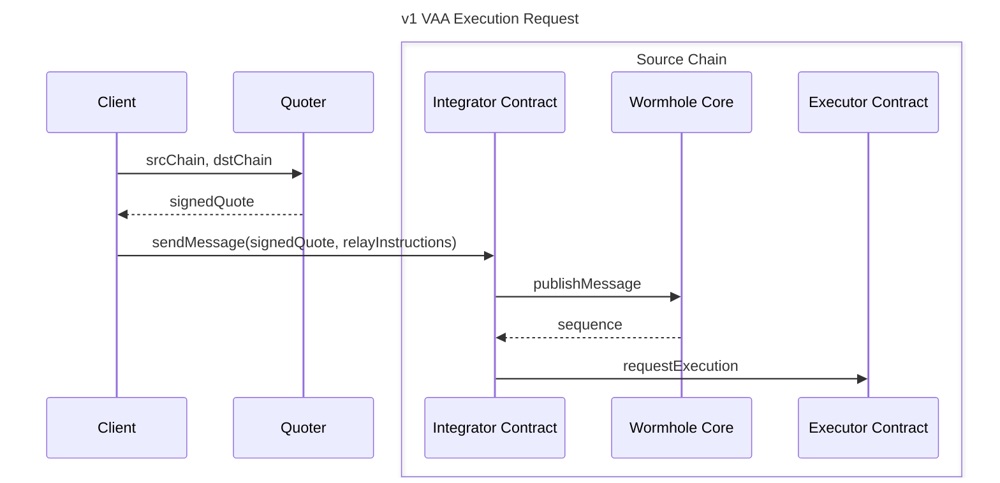
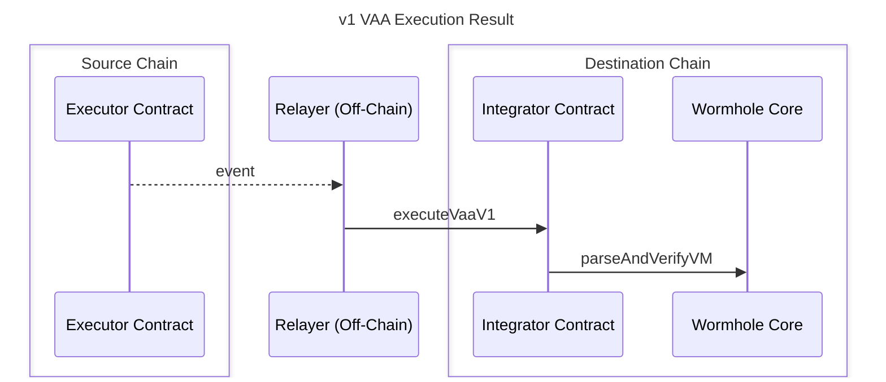

# Executor

The Executor is a shared execution framework that delivers Wormhole messages across chains. It standardizes how message execution is requested, quoted, and performed, enabling any service or protocol to execute messages permissionlessly through on-chain contracts.

The [Executor framework](/docs/products/messaging/concepts/executor-framework/){target=\_blank} enables anyone to act as a relayer within a permissionless network that uses a request-and-quote model for delivering messages. Instead of relying on a single, centralized relayer service, the Executor framework creates an open marketplace where multiple providers can compete to deliver messages based on signed execution quotes.

At its core, the Executor relies on Wormhole’s existing guarantees: messages are still secured by VAAs and verified by the Guardian network. The difference lies in how delivery requests are initiated and fulfilled.  

1. Applications call a lightweight, stateless Executor contract on the source chain, providing the target chain, target address, and a signed fee quote from a chosen provider.  
2. The contract emits an event representing the execution request, which any off-chain provider can detect.  
3. A matching provider then retrieves the VAA and performs the delivery on the destination chain.

By decentralizing message execution and supporting both EVM and non-EVM environments, the Executor framework enables developers to integrate Wormhole relaying with broader chain compatibility, without deploying or maintaining their own relayers.

## Components 

- **Relay Provider**: An off-chain party responsible for performing message execution between chains. 
- **[Executor contract](/docs/products/reference/executor-addresses/){target=\_blank}**: The shared on-chain contract or program used to make execution requests. 
- **Execution Quote**: A signed quote defining cost and parameters for execution between a source and destination chain. 
- **Execution Request**: A request generated on-chain or off-chain for a given message (e.g., NTT, VAA v1, etc.) to be executed on another chain. 
- **Quoter**: An off-chain service that produces signed quotes. It's Quoter’s EVM public key that identifies each Relay Provider.
- **Payee**: The wallet address designated by the Quoter to receive payment once the execution is completed. 

For a deeper look at how these components interact, see the [Executor framework documentation](/docs/products/messaging/concepts/executor-framework/){target=\_blank}.

## Request Flow

Message execution starts on the source chain, where an integrator creates an execution request. The request includes a signed quote from a Quoter, along with message data and delivery instructions.

1. A client requests a quote from a Quoter, specifying source and destination chains.  
2. The Quoter returns a signed quote with pricing and parameters.  
3. The client sends a message through an integrator contract, including the signed quote.  
4. The integrator publishes the message via the[ Wormhole Core contract](/docs/protocol/infrastructure/core-contracts/){target=\_blank}.  
5. The integrator then calls the Executor contract to register the execution request.

## Result Flow

Once the request is recorded on-chain, off-chain Relay Providers monitor the Executor contract for events that match their signed quotes. When a valid request is detected, the provider retrieves the message from the Guardians and executes it on the destination chain.

1. The Executor contract emits an event with the request and payment details.
2. A Relay Provider verifies the quote and fetches the associated message (e.g., a VAA).
3. The provider delivers the message to the destination chain’s integrator contract.
4. The integrator verifies the message with the Wormhole Core contract and performs the specified logic.

## Security Considerations

The Executor Contract is explicitly designed to be immutable and sit outside an integrator's security stack. Executor is intended to be used as a mechanism to permissionlessly deliver cross-chain data that includes an independent attestation source, such as Wormhole VAAs.
