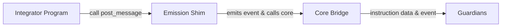
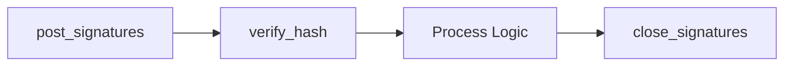

# Solana Shims

Wormhole shims on Solana are lightweight programs that enable cheaper and more flexible message emission and verification while preserving Guardian observation guarantees. They are designed for integrators who want to reduce Solana rent costs without sacrificing core protocol security or Guardian compatibility.

## The Core Bridge Account Problem

When you emit a message on Solana using the legacy [Wormhole core bridge](/docs/protocol/infrastructure/core-contracts/){target=\_blank}, it creates a new on-chain account, a Program Derived Address (PDA), for every message. Each of these accounts must hold enough SOL to be rent-exempt, locking up lamports that cannot be reclaimed since the core bridge does not allow these accounts to be closed. Over time, this results in two big problems:

- **Permanent On-Chain State**: Every message leaves behind a permanent account, increasing long-term storage needs on Solana.
- **Lost Lamports to Rent**: Integrators lose SOL for every message, as the lamports needed for rent exemption remain locked in the message accounts indefinitely.

Solana’s rent-exemption model isn't the fundamental limitation; the constraint lies in the legacy `post_message` function of the core bridge, which always creates a new, non-reclaimable account every time it’s called. Even after a message is consumed, these accounts can’t be closed or reused, resulting in unrecoverable rent costs.

Although the `post_message_unreliable` function allows account reuse, it comes with significant tradeoffs. Once a message is overwritten, it can no longer be recovered, making it no longer observable by Guardians. It also locks you into the original account size, as the feature predates Solana’s account resizing.

Verification has similar costs. The `post_vaa` instruction creates additional temporary accounts for signatures and VAA data, which, like the original accounts, require rent and aren’t automatically cleaned up. Over time, these add to both storage bloat and unrecoverable SOL.

This design ensures reliability, as message data is always available on-chain for Guardians to observe. However, it comes at a cost in both storage and lost SOL. To address these issues, Wormhole introduces Solana shims that fundamentally change the cost model for emissions and verification.

## What Are the Solana Shims?

To address the limitations of the core bridge, Wormhole deploys two specialized Solana programs called shims:

- **[Post Message Shim (`EtZMZM22ViKMo4r5y4Anovs3wKQ2owUmDpjygnMMcdEX`)](https://explorer.solana.com/address/EtZMZM22ViKMo4r5y4Anovs3wKQ2owUmDpjygnMMcdEX){target=\_blank}**: Emits Wormhole messages efficiently, without creating new message accounts for each emission, reducing rent costs.
- **[Verify VAA Shim (`EFaNWErqAtVWufdNb7yofSHHfWFos843DFpu4JBw24at`)](https://explorer.solana.com/address/EFaNWErqAtVWufdNb7yofSHHfWFos843DFpu4JBw24at){target=\_blank}**: Verifies VAAs on-chain without leaving permanent accounts.

Both act as lightweight wrappers around the existing core bridge. There are two different options, depending on whether you are emitting messages or verifying VAAs:

### Emission Shim

The [Emission Shim](/docs/products/messaging/guides/solana-shims/sol-emission/){target=\_blank} is a Solana program deployed at [`EtZMZM22ViKMo4r5y4Anovs3wKQ2owUmDpjygnMMcdEX`](https://explorer.solana.com/address/EtZMZM22ViKMo4r5y4Anovs3wKQ2owUmDpjygnMMcdEX){target=\_blank} which wraps the core bridge’s `post_message_unreliable` instruction. The Emission Shim emits message data as a log event rather than storing it in a rent-exempt message account, eliminating rent costs and preventing long-term state bloat. Guardians are configured to observe this canonical shim, allowing integrators to send messages through it without additional setup.

This shim works by calling the [`post_message`](https://github.com/wormhole-foundation/wormhole/blob/main/svm/wormhole-core-shims/anchor/idls/wormhole_post_message_shim.json){target=_blank} instruction on the Post Message Shim program. This instruction emits the Wormhole message as a log event instead of creating a rent-exempt message account.

The shim differs from the standard `post_message` approach in two key ways. First, it utilizes a Program Derived Address (PDA) per emitter for message accounts, eliminating the need to generate a new key pair for each emission. Second, instead of writing the message to a persistent, rent-exempt account, it emits the data via an Anchor CPI event that Guardians can observe directly. This design reduces rent costs and prevents unused accounts from being left behind.

The shim works through a few main components:

- **Shim Program**: Provides a `post_message` instruction modeled on the core bridge’s `post_message_unreliable`.
- **Sequence Handling**: The core bridge continues to manage sequence numbers. It reads the sequence number from the core bridge and emits it in a [CPI event](https://www.anchor-lang.com/docs/basics/cpi){target=\_blank}, along with the timestamp.
- **Message Account**: Calls `post_message_unreliable` on the core bridge, writing an empty payload, so no unique message is stored on-chain.
- **Guardian Role**: Guardians reconstruct the message from instruction data and the emitted event, not from a persistent account.

The emission fee is still paid, and the core bridge continues to manage sequence numbers as before. The difference is that instead of creating a new message account for each emission, the shim emits a CPI event with the message data. All the information Guardians need is captured in the transaction logs, without leaving behind permanent accounts.

### Verification Shim 

The [Verification Shim](/docs/products/messaging/guides/solana-shims/sol-verification/){target=\_blank} is a Solana program deployed at [`EFaNWErqAtVWufdNb7yofSHHfWFos843DFpu4JBw24at`](https://explorer.solana.com/address/EFaNWErqAtVWufdNb7yofSHHfWFos843DFpu4JBw24at){target=\_blank}. It provides a [`verify_hash`](https://github.com/wormhole-foundation/wormhole/blob/4656bd4a72cb99f4e94a771a802856c9451af844/svm/wormhole-core-shims/programs/verify-vaa/src/lib.rs#L195){target=\_blank} instruction that checks Guardian signatures against the active Guardian set for a VAA's digest. It ensures quorum, validates each signature in order, recovers the public keys, and matches them against the Guardian set. If all checks pass, the VAA is verified without creating persistent rent-exempt accounts. This verification method replaces the use of the core bridge’s `post_vaa`. Integrators can call the canonical shim, but existing programs may need to be modified to adopt this approach.

It works by first calling the [`post_signatures`](https://github.com/wormhole-foundation/wormhole/blob/main/svm/wormhole-core-shims/anchor/idls/wormhole_verify_vaa_shim.json#L43){target=_blank} on the Verification Shim to store Guardian signatures in a temporary account. Then, from within your program, call [`verify_hash`](https://github.com/wormhole-foundation/wormhole/blob/main/svm/wormhole-core-shims/programs/verify-vaa/README.md#verify-hash-technical-details){target=_blank} to check the VAA’s digest against Guardian signatures. In the same transaction, close the signatures account with [`close_signatures`](https://github.com/wormhole-foundation/wormhole/blob/main/svm/wormhole-core-shims/anchor/idls/wormhole_verify_vaa_shim.json#L11){target=\_blank} to reclaim rent. 

Instead of the core bridge instructions, such as `verify_signatures` and `post_vaa`, the verification shim provides its own flow using `post_signatures`, `verify_hash`, and `close_signatures`. The flow is a simpler sequence that avoids leaving permanent accounts on-chain:

1. **Call `post_signatures`**: Creates (or appends to) a temporary `GuardianSignatures` account that stores the collected Guardian signatures. This account is owned and managed by the verification shim.
2. **Call `verify_hash`**: Verifies the digest of the VAA against the active Guardian set and checks quorum by recovering and validating each Guardian signature. If verification succeeds, your program can continue its logic.
3. **Call `close_signatures`**: Immediately closes the `GuardianSignatures` account to reclaim the lamports paid for its creation.

This flow ensures verification is both rent-efficient and secure, no permanent accounts remain, and Guardians still enforce quorum and integrity guarantees.

## Guardian Observation Methods: Legacy vs. Shims

The following table compares how Guardians observe and verify messages on Solana before and after the introduction of the shims program.

| Observation Methods  | Legacy Model           | Shim Model               |
|----------------------|------------------------|--------------------------|
| Message Storage      | On-chain account       | Transaction logs (CPI)   |
| Data Permanence      | Permanent              | Until RPC history pruned |
| Guardian Observation | Reads account data     | Reads transaction logs   |
| Cost                 | High (rent + compute)  | Low (compute only)       |
| Closing Accounts     | Not possible           | Not needed               |

With shims, the message’s existence depends on the transaction log, so cost drops, but indefinite on-chain visibility is no longer guaranteed. Sequence tracking remains the same as the legacy model, so integrators can switch between the two without disrupting sequence numbers.

## Transaction Costs

Solana charges for two primary resources when processing transactions: 

- Compute units for execution.
- Rent for storing data on-chain. 

Understanding how each contributes to the overall cost is key to seeing why shims are cheaper.

- **Compute Units (CU)**: Solana measures CPU resource usage per transaction as “compute units”. Each transaction has a CU limit (usually ~200,000 — which can be increased for a fee).
- **Rent**: One-time cost in SOL to keep an account on-chain. Most of the core bridge’s cost comes from rent, not CUs.

Even though the shim uses slightly more compute (extra logic for logging), it avoids account creation entirely. Since rent is the most significant cost, the total emission cost drops.

## Safety, Tradeoffs & Limitations

Shims preserve the same security guarantees as the core bridge, so that integrators can adopt them without weakening protocol safety. The only difference is where data lives: instead of being stored permanently in message accounts, it is emitted in transaction logs or held temporarily until verification completes. Guardians are explicitly configured to observe shim output, ensuring messages and VAAs remain verifiable across the network.

The main tradeoff is durability. In the legacy model, messages and VAAs were always available on-chain for re-observation. With shims, message data persists only as long as RPC providers retain transaction history. This timeframe is sufficient for Guardian observation, but doesn’t provide indefinite public access to raw message data. Applications that rely on long-term on-chain storage may still prefer the legacy path, while most integrators benefit from the reduced cost and state bloat.

Finally, adopting shims may require some integration changes. For emission, developers should route messages through the Post Message Shim rather than directly through the core bridge. For verification, programs must update their logic to call `verify_hash` and manage temporary accounts in the same transaction. These are lightweight adjustments, but they are necessary to realize the cost savings fully.

## Next Steps

To put these concepts into practice, explore the dedicated guides for emission and verification on Solana.

-   :octicons-tools-16:{ .lg .middle } **Emit Messages**

    ---

    Learn how to reduce rent costs when emitting Wormhole messages on Solana by using the emission shim.

    [:custom-arrow: Use the Emission Shim](/docs/products/messaging/guides/solana-shims/sol-emission/)

-   :octicons-tools-16:{ .lg .middle } **Verify VAAs**

    ---

    Efficiently verify Wormhole VAAs on Solana using the verification shim, which avoids persistent rent-exempt accounts while keeping full security guarantees.

    [:custom-arrow: Use the Verification Shim](/docs/products/messaging/guides/solana-shims/sol-verification/)

