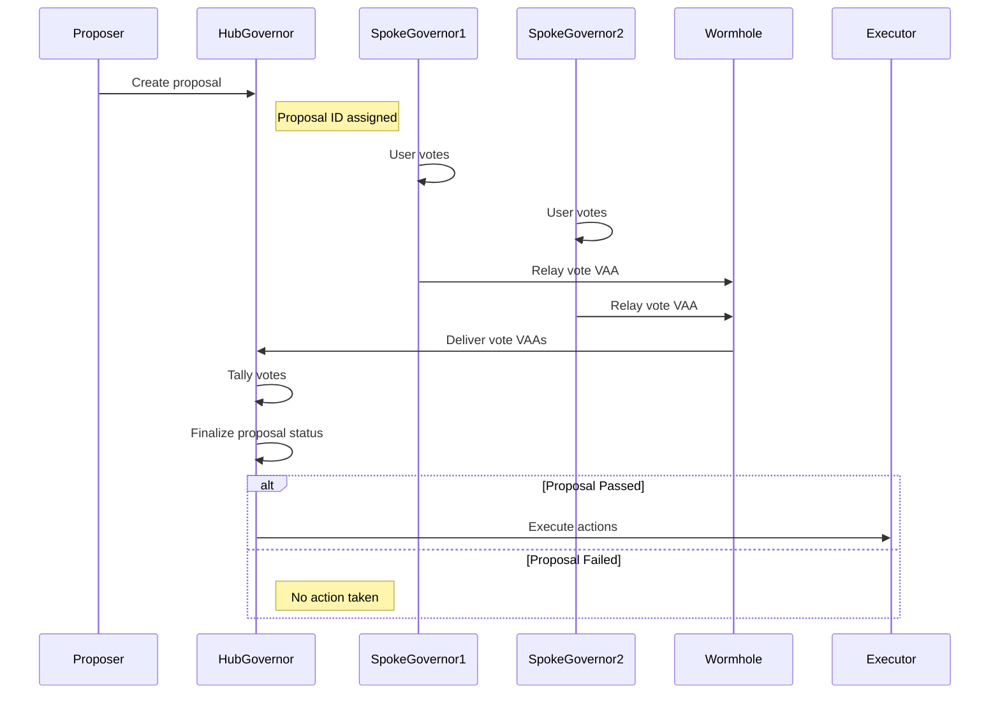

# Flow of a Proposal 

[MultiGov](/docs/products/multigov/overview/){target=\_blank} enables decentralized governance across multiple blockchains by allowing a proposal to be created on a designated hub chain and voted on from various spoke chains. Votes are aggregated, and the proposal is executed once consensus is reached.

This page covers the general lifecycle shared by all chains, EVM-specific details, and Solana-specific (SVM) details.

## Proposal Flow 

1. **Proposal Creation (Hub)**

    The proposer, typically a DAO member or smart contract, creates a proposal and submits it to the [`HubGovernor`](https://github.com/wormhole-foundation/multigov/blob/main/evm/src/HubGovernor.sol){target=\_blank} contract on the hub chain. This proposal includes proposal targets, calldata, metadata, payloads, and the voting timeline. Once submitted, it becomes immutable and is broadcast to all supported spoke chains.

2. **Voting Period Begins**

    When the proposal is activated, both the `HubGovernor` and each `SpokeGovernor` enter a voting state. On each chain, governance participants can review the proposal and prepare to cast votes using their local voting power.

3. **Users Vote on Spokes**

    Individual voters interact with their local spoke voting module to cast a vote (for, against, or abstain). Votes are validated and recorded on the spoke chain and prepared as a spoke-level aggregate.

4. **Votes Relayed to Hub**

    Spokes submit their aggregated votes back to the hub using Wormhole: either by emitting a vote message (VAA) or by exposing the aggregate via [Queries](/docs/products/queries/overview){target=\_blank} and submitting the Guardian-signed response on the hub. The hub verifies each aggregate before including it in the tally.

5. **Voting Period Ends**

    After the vote deadline (defined at proposal creation), the `HubGovernor` contract stops accepting new votes. All final tallies are frozen and no additional state transitions can occur until result finalization.   

6. **Tally Finalized and Proposal Queued for Execution**

    The `HubGovernor` evaluates the total votes, checks quorum thresholds, and determines whether the proposal passed or failed. If successful, it marks the proposal as ready for execution. Failed proposals are simply archived.

7. **Proposal Executed**

    The `HubGovernor` executes the proposal. If the action payload is on the hub chain, it’s executed directly. If actions target spoke chains, messages are composed and sent via Wormhole Messaging, then delivered by a relayer to the target executor contract or system.

## EVM Proposal Flow Details

1. On EVM, proposals are created using [`HubGovernor.propose(...)`](https://github.com/wormhole-foundation/multigov/blob/main/evm/src/HubGovernor.sol#L135){target=\_blank} or via [`HubEvmSpokeAggregateProposer`](https://github.com/wormhole-foundation/multigov/blob/main/evm/src/HubEvmSpokeAggregateProposer.sol), which aggregates proposer voting power across registered spokes to meet the threshold. [`HubProposalMetadata`](https://github.com/wormhole-foundation/multigov/blob/main/evm/src/HubProposalMetadata.sol){target=\_blank} exposes proposal metadata and is typically surfaced on each spoke by a [`SpokeMetadataCollector`](https://github.com/wormhole-foundation/multigov/blob/main/evm/src/SpokeMetadataCollector.sol){target=\_blank}, keeping local views consistent with the hub.

2. Voters cast on the spoke’s [`SpokeVoteAggregator`](https://github.com/wormhole-foundation/multigov/blob/main/evm/src/SpokeVoteAggregator.sol), which validates eligibility and produces a spoke-level aggregate. That aggregate is relayed to the hub as a Wormhole message; a relayer submits the resulting VAA to [`HubVotePool`](https://github.com/wormhole-foundation/multigov/blob/main/evm/src/HubVotePool.sol), which verifies and forwards totals to `HubGovernor` for inclusion in the global tally. 

3. After the timelock, cross-chain actions are dispatched via [`HubMessageDispatcher.dispatch(...)`](https://github.com/wormhole-foundation/multigov/blob/main/evm/src/HubMessageDispatcher.sol#L29){target=\_blank} and executed by each [`SpokeMessageExecutor`](https://github.com/wormhole-foundation/multigov/blob/main/evm/src/SpokeMessageExecutor.sol) under the authority of [`SpokeAirlock`](https://github.com/wormhole-foundation/multigov/blob/main/evm/src/SpokeAirlock.sol). In practice, configure timestamped snapshots compatible with cross-chain voting (e.g., `ERC20Votes` with the appropriate `CLOCK_MODE`) and register all expected spokes on `HubVotePool`.

## Solana (SVM) Proposal Flow Details

1. Proposals that target Solana include a [`SolanaPayload`](https://github.com/wormhole-foundation/multigov/blob/main/solana/app/e2e/01_createProposeWithSolanaExecution.ts#L40){target=\_blank} in hub calldata describing the destination program and instructions to run. 

2. The Solana spoke ingests hub proposals by fetching `HubProposalMetadata` via [Wormhole Queries](/docs/products/queries/overview/), initializing local state with [`AddProposal`](https://github.com/wormhole-foundation/multigov/blob/main/solana/app/e2e/02_addProposal.ts){target=\_blank}, and posting Guardian signatures. Verification artifacts and proposal states live in [Anchor PDAs](https://www.anchor-lang.com/docs/basics/pda) (e.g., `ProposalData`, [`GuardianSignatures`](https://github.com/wormhole-foundation/multigov/blob/main/solana/programs/staking/src/state/guardian_signatures.rs){target=\_blank}), ensuring the spoke view remains cryptographically aligned with the hub.

3. Voters interact with [`CastVote`](https://github.com/wormhole-foundation/multigov/blob/main/solana/app/e2e/03_castVote.ts){target=\_blank}, which derives weight from checkpointed stake/vesting PDAs and records for/against/abstain. The vote aggregate is exposed in a PDA and read via a Query; Guardians sign the response, and the signed result is submitted to [`HubVotePool.crossChainVote(...)`](https://github.com/wormhole-foundation/multigov/blob/main/solana/app/e2e/04_crossChainVoteSolana.ts){target=\_blank} for verification and forwarding to [`HubGovernor`](https://github.com/wormhole-foundation/multigov/blob/main/solana/app/e2e/abi/HubGovernor.json){target=\_blank}. 

4. When execution targets Solana, the hub dispatches a Solana-bound message. On Solana, [`ReceiveMessage`](https://github.com/wormhole-foundation/multigov/blob/main/solana/app/deploy/devnet/tests/receive_message.ts){target=\_blank} verifies the VAA, and [`SpokeAirlock`](https://github.com/wormhole-foundation/multigov/blob/main/solana/programs/staking/src/state/spoke_airlock.rs){target=\_blank} performs the authorized instructions. Program-level specifics include PDAs for custody and replay safety, as well as [`VoteWeightWindowLengths`](https://github.com/wormhole-foundation/multigov/blob/main/solana/app/vote_weight_window_lengths.ts){target=\_blank} to prevent double-counting.

## Conclusion

MultiGov keeps proposal authority unified at the hub while distributing participation and execution across spokes. The lifecycle is consistent, create on the hub, vote on spokes, deliver aggregates back to the hub, then dispatch execution, while the delivery mechanics differ per chain (vote VAAs vs. Queries with signed responses).

Core guarantees:

- **Single source of truth**: The hub finalizes tallies, enforces quorum/timelock, and authorizes any cross-chain actions.
- **Local first**: Votes are cast and validated on each spoke; only aggregates cross chains.
- **Verified transport**: All multichain messages are Guardian-verified; spoke execution is gated by the spoke’s authority module.
- **Replay and double-count safety**: Checkpoint windows, PDAs/decoders, and replay guards prevent re-execution and double voting.

For components and more architecture details, see the [MultiGov Architecture](/docs/products/multigov/concepts/architecture/){target=\_blank} page.
