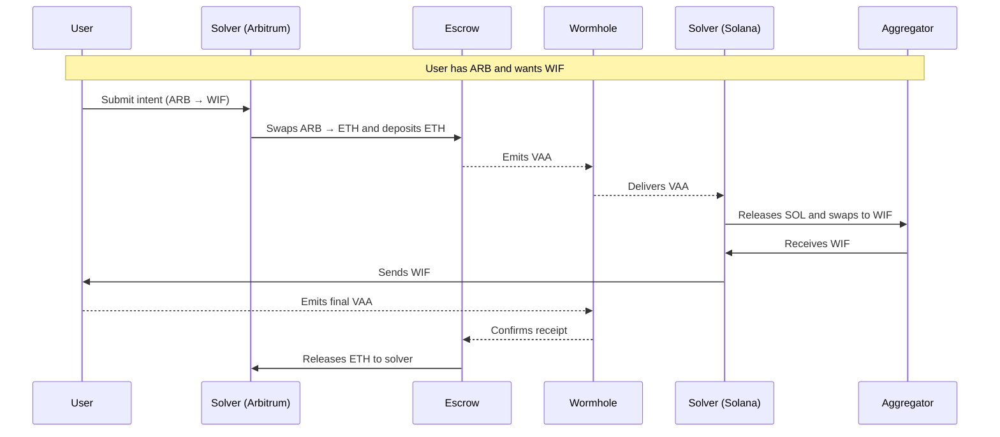

# Settlement Overview 

Wormhole Settlement is a multichain transfer system that allows users to specify what they want to happen, such as sending or swapping tokens, without handling the execution themselves. Instead, off-chain agents called solvers compete to fulfill these user intents.

Settlement prioritizes speed, execution quality, and reliability. Its primary route, Mayan Swift, leverages fast off-chain auctions among a curated set of solvers to achieve low-latency bridging with minimal slippage. All settlement steps remain verifiable on-chain through Wormhole messages. 

For broader use cases and protocol-level execution, Mayan MCTP provides an alternative path. It wraps Circle’s CCTP to facilitate native USDC bridging and token delivery in a single, verifiable flow. While slower due to chain finality constraints, MCTP offers a reliable mechanism for cross-chain transfers.

In the following video, learn the core concepts behind intents and Wormhole Settlement, including the roles of users, solvers, and the settlement layer:

<iframe src='https://www.youtube.com/embed/ONjbm2O5FDo' frameborder='0' allowfullscreen></iframe>

???- interface "Video Chapters"
    - [00:00](https://www.youtube.com/watch?v=ONjbm2O5FDo){target=\_blank}: Defining the Problem: UX and Liquidity Fragmentation
    - [00:52](https://www.youtube.com/watch?v=ONjbm2O5FDo&t=52s){target=\_blank}: Core Concept: Declarative vs. Imperative Transactions
    - [01:12](https://www.youtube.com/watch?v=ONjbm2O5FDo&t=72s){target=\_blank}: Intent Key Players: Users, Solvers, and Settlement Layers
    - [01:46](https://www.youtube.com/watch?v=ONjbm2O5FDo&t=106s){target=\_blank}: Anatomy of an Intent-Based Transaction
    - [02:11](https://www.youtube.com/watch?v=ONjbm2O5FDo&t=131s){target=\_blank}: Wormhole Settlement: The Onchain Execution Layer
    - [02:22](https://www.youtube.com/watch?v=ONjbm2O5FDo&t=142s){target=\_blank}: Mayan Swift: An Intent-Based Protocol for Swaps
    - [02:52](https://www.youtube.com/watch?v=ONjbm2O5FDo&t=172s){target=\_blank}: Benefits for Devs: Chain Abstraction & Gasless UX
    - [03:22](https://www.youtube.com/watch?v=ONjbm2O5FDo&t=202s){target=\_blank}: Code Demo: Cross-Chain Swap with Mayan Swift

## Key Features

- **Intent-based architecture**: Users express what they want to happen (e.g., swap X for Y on chain Z), and solvers execute it.
- **Solver auctions**: Solvers compete in on-chain auctions for the right to fulfill intents, improving execution quality.
- **Fast and fallback-capable**: Combines high-speed execution with a reliable fallback path.
- **Minimal slippage**: Settlement abstracts away complex balancing operations and uses shuttle assets like USDC and tokens deployed via NTT.
- **On-chain verifiability**: Even though auctions are off-chain, all settlement steps remain verifiable on-chain via Wormhole messages.
- **Two integrated routes**: Mayan Swift for speed, Mayan MCTP for compatibility and redundancy.

## How It Works

At the core of Settlement are two components:

- **Intents**: Signed transactions where a user defines what outcome they want (e.g., send USDC to another chain and receive ETH). It abstracts what the user wants, not how it should be executed.
- **Solvers**: Third-party agents that compete in auctions to fulfill these intents. They front capital, perform swaps or transfers, and receive fees in return.

Settlement currently supports the following integrated protocols.

### Mayan Swift

Mayan Swift implements a traditional intent-based architecture, where solvers compete to fulfill user intents by utilizing their inventory. It offers fast execution, typically around 12 seconds. To participate, solvers must hold assets on multiple chains, which can lead to imbalances: some chains may get depleted while others accumulate excess. This requires occasional rebalancing and adds operational overhead. Despite that, Mayan Swift is ideal for high-speed transfers and benefits from open, competitive auctions that can drive down execution prices.

The diagram below shows how Mayan Swift handles a cross-chain intent when a user wants to swap ARB on Arbitrum for WIF on Solana. Behind the scenes, the process is more involved and relies on solver-managed liquidity across both chains.

1. **Solver initiates on Arbitrum**: Solver swaps ARB → ETH and deposits ETH into an escrow on Arbitrum.
2. **VAA emitted to Solana**: A [Verifiable Action Approval (VAA)](/docs/protocol/infrastructure/vaas/){target=\_blank} triggers the solver to release SOL on Solana, which is swapped to WIF using an aggregator.
3. **User receives WIF**: Once the user receives WIF, a second VAA is emitted to finalize the transfer and releases the ETH held in the escrow to the solver.
4. **Failure handling**: If any step fails, the ETH in escrow is either retained or returned to the user; the solver only gets paid if execution succeeds.

### Mayan MCTP

Mayan MCTP is a fallback protocol that wraps Circle’s CCTP into the Settlement framework. It bundles USDC bridging and swaps into a single operation handled by protocol logic. This route is slower due to its reliance on chain finality. However, it provides broad compatibility and redundancy, making it useful when faster routes are unavailable or when targeting chains that aren’t supported by Swift. While typically more expensive due to protocol fees, it ensures reliable settlement when faster options are unavailable.

## Use Cases

- **Cross-Chain Perpetuals** 

    - **[Settlement](/docs/products/settlement/get-started/){target=\_blank}**: Provides fast token execution across chains.
    - **[Queries](/docs/products/queries/overview/){target=\_blank}**: Fetch live prices and manage position state across chains.

- **Bridging Intent Library**

    - **[Settlement](/docs/products/settlement/get-started/){target=\_blank}**: Handles user-defined bridge intents.
    - **[Messaging](/docs/products/messaging/overview/){target=\_blank}**: Triggers cross-chain function calls.

- **Multichain Prediction Markets**

    - **[Settlement](/docs/products/settlement/get-started/){target=\_blank}**: Executes token flows between chains.
    - **[Queries](/docs/products/queries/overview/){target=\_blank}**: Gets market data and tracks state.

## Next Steps

Start building with Settlement or dive deeper into specific components.

-   :octicons-tools-16:{ .lg .middle } **Get Started with Settlement**

    ---

    Follow a hands-on demo using Mayan Swift.

    [:custom-arrow: Get Started](/docs/products/settlement/get-started/)

-   :octicons-book-16:{ .lg .middle } **Architecture Overview**

    ---

    Explore the Settlement architecture and components.

    [:custom-arrow: Learn More](/docs/products/settlement/concepts/architecture/)

-   :octicons-tools-16:{ .lg .middle } **Wormhole Dev Arena: Settlement Fundamentals**

    ---

    Check out the Settlement Fundamentals course on the Wormhole Dev Arena, a structured learning hub with hands-on tutorials across the Wormhole ecosystem. 

    [:custom-arrow: Explore the Dev Arena](https://arena.wormhole.com/courses/256e7446-5ed5-8167-89a5-f2102b0090a7){target=\_blank}

