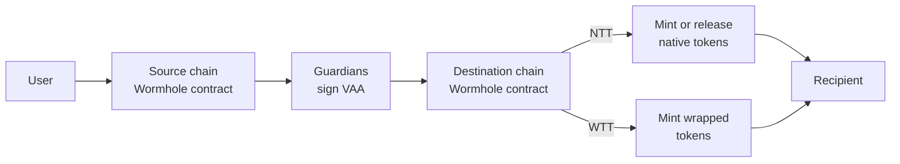

## Token Transfers Overview

Wormhole Token Transfers let you move assets seamlessly across chains. Developers can choose between [Native Token Transfers (NTT)](/docs/products/token-transfers/native-token-transfers/overview/){target=\_blank}, which enable direct movement of native tokens, or [Wrapped Token Transfers (WTT)](/docs/products/token-transfers/wrapped-token-transfers/overview/){target=\_blank}, which use a lock-and-mint model for broad compatibility. Both approaches are secured by the Wormhole [Guardians](/docs/protocol/infrastructure/guardians/){target=\_blank} and integrate with the same cross-chain messaging layer.

## How Token Transfers Work

Both NTT and WTT rely on Guardian-signed messages ([VAAs](/docs/protocol/infrastructure/vaas/){target=\_blank}) to transfer tokens across chains securely. The difference lies in how tokens are represented on the destination chain.

At a high level, the flow looks like this:

1. A user sends tokens to the Wormhole contract on the source chain.
2. The contract emits a message, which the Guardians sign as a VAA.
3. The VAA is submitted to the destination chain.
4. Depending on the transfer type:
    - **NTT**: Tokens are minted or released from escrow.
    - **WTT**: Wrapped tokens are minted to the recipient’s wallet.

## Choosing Between NTT and WTT

Wormhole provides two distinct mechanisms for transferring assets cross-chain: [Native Token Transfers (NTT)](/docs/products/token-transfers/native-token-transfers/overview/){target=\_blank} and [Wrapped Token Transfers (WTT)](/docs/products/token-transfers/wrapped-token-transfers/overview/){target=\_blank}. Both options offer distinct integration paths and feature sets tailored to your requirements, as outlined below.

Choosing between the two models comes down to trade-offs. NTT offers an adaptable, upgradable, and customizable framework that enables teams to retain ownership and define policies across chains. WTT provides the most straightforward and permissionless path, but wrapped token contracts are managed by Wormhole Governance, with no ownership transfer or contract upgradeability possible.

| Feature                | Native Token Transfers                                                                                                                                                               | Wrapped Token Transfers                                                                                                                                                                       |
|------------------------|--------------------------------------------------------------------------------------------------------------------------------------------------------------------------------------|-----------------------------------------------------------------------------------------------------------------------------------------------------------------------------------------------|
| **Best for**           | DeFi governance, native assets with multichain liquidity, stablecoins, institutional use cases, and projects that want full control of their cross-chain token                       | Consumer apps, games, wrapped-token use cases, and projects that want a fast, managed bridging solution                                                                                       |
| **Mechanism**          | Burn-and-mint or hub-and-spoke                                                                                                                                                       | Lock-and-mint                                                                                                                                                                                 |
| **Security**           | Configurable rate limiting, pausing, access control, threshold attestations. Integrated Global Accountant                                                                            | Preconfigured rate limiting and integrated Global Accountant                                                                                                                                  |
| **Contract Ownership** | User retains ownership and upgrade authority on each chain                                                                                                                           | Managed via Wormhole Governance; wrapped token contracts are controlled by WTT (ownership is not transferable, and integrators cannot upgrade wrapped contracts)                              |
| **Token Contracts**    | Native contracts owned by your protocol governance, maintain the same token across chains                                                                                            | Wrapped asset contract owned by the Wormhole WTT contract, creates a new wrapped version on the destination chain                                                                             |
| **Integration**        | Customizable, flexible framework for advanced deployments                                                                                                                            | Straightforward, permissionless deployment                                                                                                                                                    |
| **User Experience**    | Seamless, users interact with the same token everywhere                                                                                                                              | Wrapped assets may need [explorer metadata updates](/docs/products/token-transfers/wrapped-token-transfers/faqs/#how-do-i-update-the-metadata-of-a-wrapped-token){target=\_blank} for clarity |
| **Examples**           | [NTT Connect](https://github.com/wormhole-foundation/demo-ntt-connect){target=\_blank}, [NTT TypeScript SDK](https://github.com/wormhole-foundation/demo-ntt-ts-sdk){target=\_blank} | [Portal Bridge UI](https://portalbridge.com/){target=\_blank}                                                                                                                                 |

!!! note "Terminology"
    In the SDK and smart contracts, Wrapped Token Transfers (WTT) are referred to as Token Bridge. In documentation, we use WTT for clarity. Both terms describe the same protocol.

In the following video, Wormhole Foundation DevRel Pauline Barnades walks you through the key differences between Wormhole’s Native Token Transfers (NTT) and Wrapped Token Transfers (WTT) and how to select the best option for your use case:

<iframe src='https://www.youtube.com/embed/Mqpu7oWBz2A' frameborder='0' allowfullscreen></iframe>

## Next Steps

If you are looking for more guided practice, take a look at:

-   :octicons-tools-16:{ .lg .middle } **Get Started with NTT**

    ---

    Learn how to deploy and register contracts to transfer native tokens across chains.

    [:custom-arrow: Get Started](/docs/products/token-transfers/native-token-transfers/get-started/)

-   :octicons-book-16:{ .lg .middle } **Get Started with WTT**

    ---

    Perform token transfers using WTT, including manual and automatic transfers.

    [:custom-arrow: Get Started](/docs/products/token-transfers/wrapped-token-transfers/get-started/)

