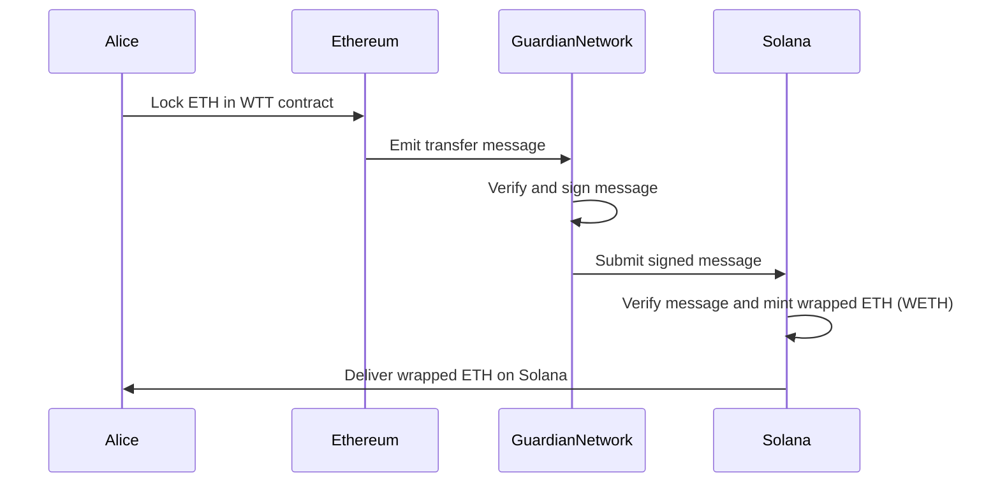

## Wrapped Token Transfers Overview

Wrapped Token Transfers (WTT) is a Wormhole module for bridging wrapped tokens across various blockchain networks. Locking assets on one network and minting corresponding wrapped tokens on another facilitates secure, efficient, and composable multichain token movement.

This overview covers WTT's main features, general processes, and possible next steps to begin building a cross-chain application.

## Key Features

WTT is built to solve interoperability problems in multichain token transfers. Key features include:

- **Interoperability**: Transfer standards-compliant tokens (e.g., ERC-20, SPL) across over 30 [supported chains](/docs/products/reference/supported-networks/#wtt){target=\_blank}.
- **Lock-and-mint mechanism**: Mint wrapped tokens backed 1:1 by locked assets on the source chain.
- **Preserved metadata**: Ensure that token properties like name, symbol, and decimals persist across chains.
- **Transfer with payload**: Attach arbitrary data to token transfers, enabling the triggering of specific actions.
- **Decentralized security**: Verified by the [Guardian Network](/docs/protocol/infrastructure/guardians/){target=\_blank}, ensuring cross-chain consistency and message authenticity.

## How It Works

WTT provides a reliable foundation for multichain interoperability at scale. The transfer process follows these key steps:

1. **Attestation**: The token’s metadata (e.g., symbol, name, decimals) is registered on the destination chain. This step is only required once per token.
2. **Locking**: On the source chain, the native token is locked in a custody account.
3. **Message emission**: The [Guardian Network](/docs/protocol/infrastructure/guardians/){target=\_blank} verifies and emits a [VAA](/docs/protocol/infrastructure/vaas/){target=\_blank}.
4. **Verification**: The VAA is submitted and verified on the destination chain to confirm authenticity.
5. **Minting**: A wrapped version of the token is minted (or the native token is released) to the recipient on the destination chain.

This diagram showcases a simplified flow of Alice bridging ETH from Ethereum to her account on Solana.

For a more in-depth understanding of how WTT works, see the [Flow of a Transfer](/docs/products/token-transfers/wrapped-token-transfers/concepts/transfer-flow/){target=\_blank} page.

## Use Cases

Here are key use cases that highlight the power and versatility of WTT.

- **Multichain Rewards and Token Utility in Decentralized Platforms (e.g., [Chingari](https://chingari.io/){target=\_blank})** 

    - **[WTT](/docs/products/token-transfers/wrapped-token-transfers/get-started/)**: Transfer tokens between chains.
    - **[Messaging](/docs/products/messaging/overview/)**: Facilitate the distribution and claiming processes of rewards.

- **Tokenized Gaming Rewards**

    - **[WTT](/docs/products/token-transfers/wrapped-token-transfers/get-started/)**: Handle the underlying lock-and-mint logic securely.
    - **[Connect](/docs/products/connect/overview/)**: Provide a user-friendly way to move game tokens across chains.

- **Multichain DeFi Arbitrage**

    - **[WTT](/docs/products/token-transfers/wrapped-token-transfers/get-started/)**: Enables rapid and secure movement of DeFi assets.
    - **[Connect](/docs/products/connect/overview/)**: Provides a UI widget to onboard users and facilitate seamless multichain swaps within DeFi aggregator platforms.

## Next Steps

If you are looking for more guided practice, take a look at the following guides.

-   :octicons-tools-16:{ .lg .middle } **Get Started with WTT**

    ---

    Perform token transfers using WTT, including manual and automatic transfers.

    [:custom-arrow: Get Started](/docs/products/token-transfers/wrapped-token-transfers/get-started/)

-   :octicons-tools-16:{ .lg .middle } **Complete Token Transfer Workflow**

    ---

    Build a cross-chain native token transfer app using Wormhole’s TypeScript SDK, supporting native token transfers across EVM and non-EVM chains.

    [:custom-arrow: Get Started](/docs/products/token-transfers/wrapped-token-transfers/tutorials/transfer-workflow/)

-   :octicons-tools-16:{ .lg .middle } **Create Multichain Tokens**

    ---

    Craft a multichain token using Wormhole's Portal Bridge.

    [:custom-arrow: Get Started](/docs/products/token-transfers/wrapped-token-transfers/tutorials/multichain-token/)

