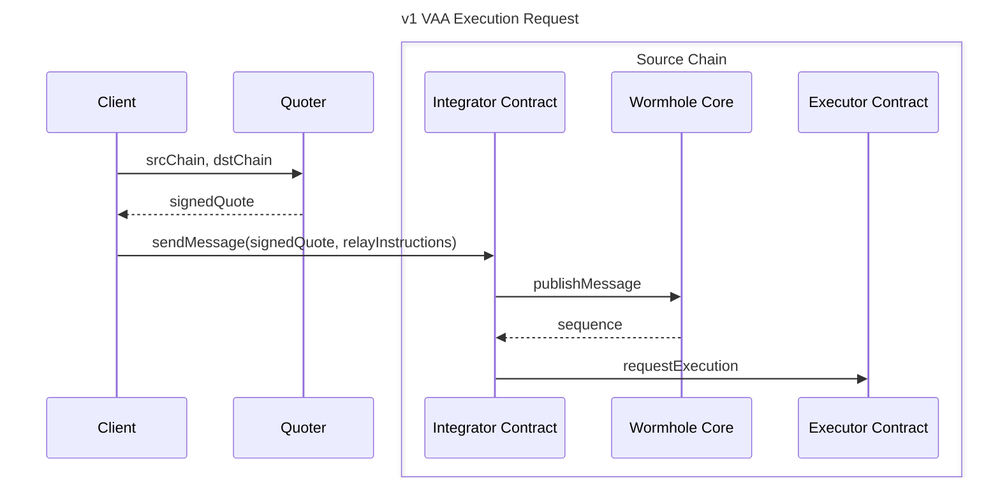
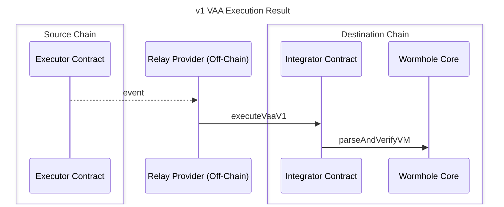

# Executor Framework

The Executor is a shared execution framework that delivers Wormhole messages across chains. It standardizes how message execution is requested, quoted, and performed, enabling any service or protocol to execute messages permissionlessly through on-chain contracts.

The Executor framework enables anyone to act as a relayer in a permissionless network that uses a request-and-quote model for message delivery. Instead of relying on a single, centralized relayer service, the Executor framework creates an open marketplace where multiple providers can compete to deliver messages based on signed execution quotes.

At its core, the Executor relies on Wormhole’s existing guarantees: messages are still secured by VAAs and verified by the Guardian network. By decentralizing message execution and supporting both EVM and non-EVM environments, the Executor framework enables developers to integrate Wormhole relaying with broader chain compatibility, without deploying or maintaining their own relayers.

## Architecture and Components

The Executor framework separates responsibilities between three independent participants:

| Actor	            | Responsibility                                                              | 
|-------------------|-----------------------------------------------------------------------------| 
| Integrator        | Creates and submits execution requests using valid quotes.                  | 
| Executor Contract | Publishes requests, transfers payment, and emits observable events.         | 
| Relay Provider	| Monitors events, issues and validates signed quotes, and executes messages. | 

This modular structure enables permissionless, verifiable, and cost-efficient message execution across multiple blockchains — without persistent on-chain state or protocol-specific relayers.

The Executor framework comprises a small set of on-chain and off-chain components that work together to request, quote, and execute cross-chain messages. The following components define the roles, interfaces, and data structures involved in the execution process.

- **Relay Provider**: An off-chain party responsible for performing message execution between chains. 
- **[Executor contract](/docs/products/reference/executor-addresses/){target=\_blank}**: The shared on-chain contract or program used to make execution requests. 
- **Execution quote**: A signed quote defining cost and parameters for execution between a source and destination chain. 
- **Execution request**: A request generated on-chain or off-chain for a given message (e.g., NTT, VAA v1, etc.) to be executed on another chain. 
- **Quoter**: An off-chain service that produces signed quotes. It's Quoter’s EVM public key that identifies each Relay Provider.
- **Payee**: The wallet address designated by the Quoter to receive payment once the execution is completed. 

## Execution Lifecycle

The execution lifecycle defines the sequence of interactions between integrators, the Executor contract, and Relay Providers that result in a cross-chain message being executed on the destination chain.

### Request Flow

Message execution starts on the source chain, where an integrator creates an execution request. The request includes a signed quote from a Quoter, along with message data and delivery instructions.

1. A client requests a quote from a Quoter, specifying source and destination chains.  
2. The Quoter returns a signed quote with pricing and parameters.  
3. The client sends a message through an integrator contract, including the signed quote.  
4. The integrator publishes the message via the [Wormhole Core contract](/docs/protocol/infrastructure/core-contracts/){target=\_blank}.  
5. The integrator then calls the Executor contract to register the execution request.

### Result Flow

Once the request is recorded on-chain, off-chain Relay Providers monitor the Executor contract for events that match their signed quotes. When a valid request is detected, the provider retrieves the message from the Guardians and executes it on the destination chain.

1. The Executor contract emits an event with the request and payment details.
2. A Relay Provider verifies the quote and fetches the associated message (e.g., a VAA).
3. The provider delivers the message to the destination chain’s integrator contract.
4. The integrator verifies the message with the Wormhole Core contract and performs the specified logic.

## Executor Contract

Each supported chain hosts a stateless, permissionless [Executor contract](/docs/products/reference/executor-addresses/){target=\_blank}. The contract provides an interface for submitting execution requests and emitting observable events for off-chain providers. It maintains no persistent state; all requests exist as events that off-chain agents can detect.

When called, the Executor contract:

- Accepts execution requests from integrators or clients.
- Verifies basic parameters (source/destination chain IDs, expiry time).
- Transfers payment to the designated [`payeeAddress`](https://github.com/wormholelabs-xyz/example-messaging-executor/blob/main/evm/src/Executor.sol#L59){target=\_blank}.
- Emits events containing request details for off-chain consumption. 

The Executor contract exposes the [`requestExecution`](https://github.com/wormholelabs-xyz/example-messaging-executor/blob/main/evm/src/Executor.sol#L22){target=\_blank} function, used by both on-chain and off-chain integrations to create an execution request. When `requestExecution` is called, the contract checks that:

- The quote’s source chain matches the chain of deployment.
- The destination matches the provided destination chain.
- The quote has not expired.

If all checks pass, payment is transferred to the [`payeeAddress`](https://github.com/wormholelabs-xyz/example-messaging-executor/blob/main/evm/src/Executor.sol#L59){target=\_blank} defined in the quote, and a [`RequestForExecution`](https://github.com/wormholelabs-xyz/example-messaging-executor/blob/main/evm/src/Executor.sol#L61){target=\_blank} event is emitted.

To remain lightweight and chain-agnostic, the Executor contract performs only minimal validation:

- **No signature verification**: The client is responsible for verifying the quote before submission.
- **No message inspection**: The contract does not parse or validate the message payload.
- **No payment enforcement**: The contract does not check that the payment matches the quoted fee; providers enforce this off-chain.

This minimal design keeps the contract generic, inexpensive, and compatible with multiple message formats and future Wormhole protocols.

## Relay Provider

A Relay Provider is an off-chain service that executes messages between chains and operates a Quoter service to issue signed execution quotes. Providers compete in a permissionless marketplace by offering signed execution quotes that define their pricing and delivery terms. This system decentralizes message delivery, allowing integrators to choose providers or run their own, rather than relying on a single relayer service. 

Each provider runs infrastructure that listens for execution requests emitted by the Executor contract on supported chains. When a request matches one of their quotes, the provider retrieves the associated VAA from the Guardians and performs the message execution on the destination chain.  

Each Relay Provider operates a Quoter service that issues signed quotes and defines execution terms. 

Each quote specifies: 

- The source and destination chains
- Pricing
- An expiry time before which the Executor contract can accept the quote

Short expiry windows reduce the risk of stale quotes but must be long enough for users to submit transactions on the source chain. 

Because the network is open, multiple providers may compete to fulfill the same request. Each quote defines the conditions under which a provider is willing to execute, enabling competitive pricing and redundancy across the system. Message validity is enforced through the Wormhole VAA and Guardian verification process, preventing providers from altering or forging the message and ensuring all executions remain trust-minimized.

Relay Providers may operate multiple wallets, each capable of performing execution or receiving payment. They can choose whether payments are collected per-wallet or directed to a central [`payeeAddress`](https://github.com/wormholelabs-xyz/example-messaging-executor/blob/main/evm/src/Executor.sol#L59){target=\_blank} defined by the Quoter.

Providers should provide a public API for integrators to track the status of the request such as: 

- Request creation
- Added gas fees
- Transaction executes
- Any issued refunds

To improve transparency, providers may also publish a Service-Level Agreement (SLA) describing the types of executions they support, their retry and refund policies, and their expected behavior during execution.

!!!warning
    The framework does not prevent repeated execution attempts. Providers should implement their own safeguards to avoid duplicate deliveries.

## Security Considerations

The Executor contract is explicitly designed to be immutable and sit outside an integrator's security stack. Executor is intended to be used as a mechanism to permissionlessly deliver cross-chain data that includes an independent attestation source, such as Wormhole VAAs. The Executor does not change Wormhole’s security model; it changes how delivery requests are initiated and fulfilled.

## Next Steps

-   :octicons-book-16:{ .lg .middle } **Migrate to Executor**

    ---

    Understand the key differences between the Executor framework and the Standard Relayer, and find guidance for migrating existing integrations.

    [:custom-arrow: Migrate to Executor](/docs/protocol/infrastructure/relayers/executor-vs-sr/)

-   :octicons-tools-16:{ .lg .middle } **Executor Demo**

    ---

    Check out a minimal end-to-end Executor demo showing quoting, request calls, and replay protection.

    [:custom-arrow: See the Hello Executor Demo](https://github.com/wormhole-foundation/demo-hello-executor){target=\_blank}

